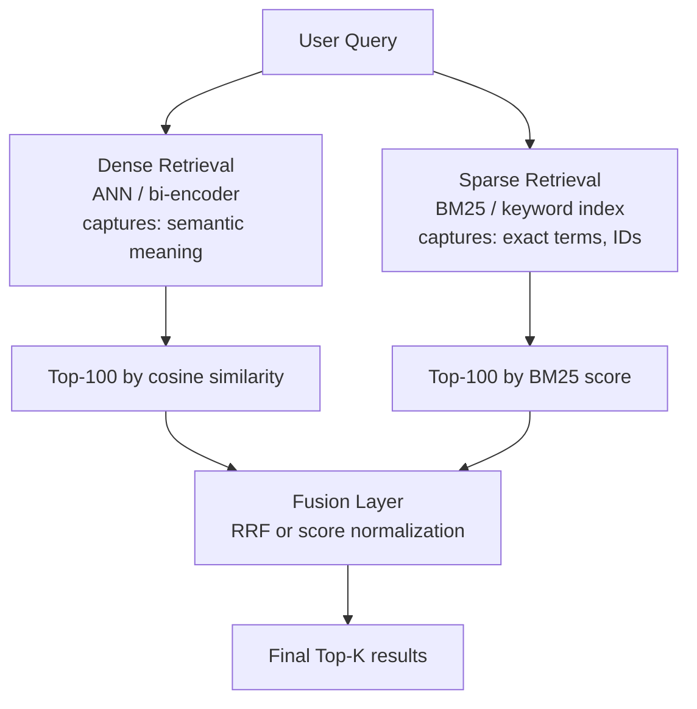
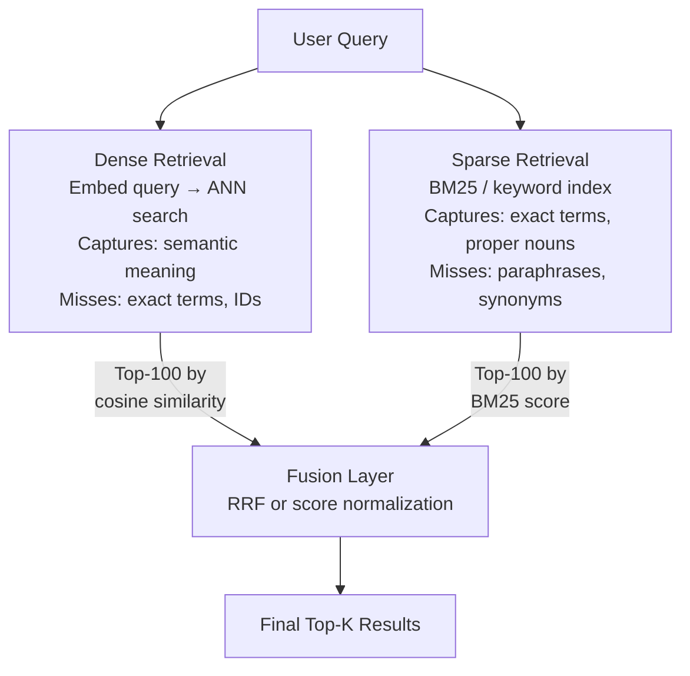

# Hybrid Search — Dense + Sparse Retrieval

**Level**: 🟡 Intermediate
**Reading Time**: 11 minutes

## 🗺️ Quick Overview



*Hybrid search runs both semantic and keyword paths then fuses them with Reciprocal Rank Fusion (RRF); consistently outperforms either alone because each covers the other's blind spots.*

> Pure vector search misses "iPhone 15 Pro Max". Pure BM25 misses "a smartphone with excellent low-light photography". Hybrid search catches both — and consistently outperforms either alone in production benchmarks.

## The Problem

### What Pure Vector Search Misses

Vector/semantic search finds documents similar in meaning. But it fails when the user is searching for exact terms:

- Product codes: "SKU-78234-A"
- Model names: "GPT-4o", "iPhone 15 Pro Max"
- Person names: "Linus Torvalds", "Jensen Huang"
- IDs: "ticket-2024-08-15-0042"
- Medical codes: "ICD-10 J06.9"
- Rare technical terms with precise meanings

A query for "GPT-4o pricing" might retrieve documents about "large language model costs" (semantically close) while missing the actual GPT-4o pricing page (keyword match). The embedding model doesn't know "GPT-4o" is a special token — it treats it like any sequence of characters.

### What Pure BM25 Misses

BM25 (Best Match 25) is a keyword scoring function used by Elasticsearch, Solr, and traditional search engines. It scores documents by term frequency and inverse document frequency.

BM25 fails when:
- The user paraphrases: "quick brown fox" doesn't match "fast auburn canine"
- Different terminology: "myocardial infarction" vs "heart attack"
- Semantic intent: "something to open a bottle" — no keyword matches "corkscrew"
- Multi-lingual: English query against French document with same meaning

## Hybrid = Dense + Sparse, Fused

Hybrid search runs both retrieval paths and combines (fuses) their results:



## Sparse Retrieval: BM25

BM25 scores a document D given query Q:

```
BM25(D, Q) = sum over query terms t of:
  IDF(t) × (tf(t,D) × (k1+1)) / (tf(t,D) + k1 × (1 - b + b × |D|/avgdl))

Where:
  IDF(t)   = log((N - df(t) + 0.5) / (df(t) + 0.5))  — rare terms score higher
  tf(t,D)  = frequency of term t in document D
  k1       = 1.2 to 2.0 (term frequency saturation)
  b        = 0.75 (document length normalization)
  |D|      = document length in tokens
  avgdl    = average document length
  N        = total documents
  df(t)    = documents containing term t
```

In practice, you don't implement BM25 from scratch — Elasticsearch, OpenSearch, or Postgres full-text search handle it. What matters is understanding that BM25 rewards exact term overlap, term rarity (IDF), and penalizes very long documents.

### Sparse Vectors (SPLADE)

Modern sparse retrieval goes beyond BM25. **SPLADE** (SParse Lexical AnD Expansion) uses a transformer to expand queries and documents into sparse vectors over the full vocabulary:

```
// SPLADE representation of "cat"
{
  "cat": 2.3,
  "feline": 1.8,     // expansion: model learned these are related
  "kitten": 1.2,
  "animal": 0.9,
  "pet": 0.7,
  ...                // most vocab terms have weight 0 (hence "sparse")
}
```

SPLADE enables semantic-like generalization while remaining in the sparse vector space, and can be stored in an inverted index like BM25 — making it very fast.

## Fusion Strategies

### Reciprocal Rank Fusion (RRF)

RRF is the industry standard for combining ranked lists. It's simple, parameter-free, and robust.

```
RRF_score(doc) = sum over rankers r of: 1 / (k + rank_r(doc))
```

Where k=60 is a constant that smooths the influence of very high-ranked results.

```python
def reciprocal_rank_fusion(result_lists, k=60):
    """
    result_lists: list of ranked lists of document IDs
                  e.g., [[doc7, doc3, doc15, ...], [doc3, doc7, doc22, ...]]
    Returns: documents sorted by RRF score descending
    """
    scores = {}
    for result_list in result_lists:
        for rank, doc_id in enumerate(result_list):
            if doc_id not in scores:
                scores[doc_id] = 0.0
            scores[doc_id] += 1.0 / (k + rank + 1)

    return sorted(scores.items(), key=lambda x: x[1], reverse=True)

# Example
dense_results  = ["doc7", "doc3", "doc15", "doc42", "doc91"]   # vector search top-5
sparse_results = ["doc3", "doc7", "doc22", "doc15", "doc8"]    # BM25 top-5

fused = reciprocal_rank_fusion([dense_results, sparse_results])
# doc7: 1/61 + 1/62 = 0.0326    (rank 1 in dense, rank 2 in sparse)
# doc3: 1/62 + 1/61 = 0.0326    (rank 2 in dense, rank 1 in sparse) — tied with doc7
# doc15: 1/63 + 1/64 = 0.0315   (rank 3 in both)
print(fused[:3])
```

**Why k=60?** The constant prevents very high-ranked results from completely dominating. If k=0, rank 1 gives score 1.0, rank 2 gives 0.5 — a 2× advantage. With k=60, rank 1 gives 0.0164 and rank 2 gives 0.0161 — a much smaller gap, allowing multiple signals to contribute.

### Score Normalization Fusion

Alternative: normalize both score distributions to [0,1] and combine with a weighted sum.

```python
def score_normalization_fusion(dense_results, sparse_results, alpha=0.5):
    """
    alpha: weight for dense results (1-alpha for sparse)
    """
    # Normalize dense scores to [0,1]
    dense_max = max(r.score for r in dense_results)
    dense_min = min(r.score for r in dense_results)

    # Normalize sparse scores to [0,1]
    sparse_max = max(r.score for r in sparse_results)
    sparse_min = min(r.score for r in sparse_results)

    scores = {}
    for r in dense_results:
        normalized = (r.score - dense_min) / (dense_max - dense_min + 1e-8)
        scores[r.id] = scores.get(r.id, 0) + alpha * normalized

    for r in sparse_results:
        normalized = (r.score - sparse_min) / (sparse_max - sparse_min + 1e-8)
        scores[r.id] = scores.get(r.id, 0) + (1 - alpha) * normalized

    return sorted(scores.items(), key=lambda x: x[1], reverse=True)
```

**RRF vs score normalization**:
- RRF: parameter-free, robust, works well when score distributions differ widely
- Score normalization: requires tuning alpha, sensitive to outliers in scores, but allows explicit weighting (e.g., 70% dense + 30% sparse for a semantic-heavy use case)

**Recommendation**: Start with RRF. Only switch to score normalization if you have labeled data to tune alpha.

## Full Hybrid Search Implementation

```python
# Pseudocode: hybrid search pipeline

function hybridSearch(query, vectorDB, bm25Index, topK=10):
    // Expand retrieval set — get more candidates than needed
    retrievalK = topK * 10  // top-100 for final top-10

    // Path 1: Dense retrieval
    queryEmbedding = embeddingModel.encode(query)
    denseResults = vectorDB.search(queryEmbedding, limit=retrievalK)
    // returns list of {id, score, content}

    // Path 2: Sparse retrieval
    sparseResults = bm25Index.search(query, limit=retrievalK)
    // returns list of {id, score, content}

    // Fuse with RRF
    denseIds  = [r.id for r in denseResults]
    sparseIds = [r.id for r in sparseResults]
    fused = reciprocalRankFusion([denseIds, sparseIds], k=60)

    // Fetch content for top-K fused results
    topIds = [id for id, score in fused[:topK]]
    return fetchDocuments(topIds)
```

## When Hybrid Beats Pure Dense

Hybrid search particularly outperforms pure vector search on:

| Query Type | Example | Why Hybrid Wins |
|------------|---------|-----------------|
| Proper nouns | "Jensen Huang AI conference 2024" | BM25 catches exact name match |
| Product/model IDs | "AWS EC2 m7i.48xlarge pricing" | BM25 catches exact model string |
| Error codes | "ETIMEDOUT error Node.js" | BM25 catches exact error token |
| Medical terms | "ICD-10 code J45.20 asthma" | BM25 catches exact ICD code |
| Short queries | "python dict" | Too few tokens for semantic signal |
| Mixed intent | "RAG pipeline latency optimization" | Both paths contribute |

Pure vector search does better on: long-form semantic queries, paraphrase detection, cross-language retrieval, image-text matching.

## Native Hybrid Support in Vector DBs

| Database | Dense | Sparse | Hybrid | Fusion |
|----------|-------|--------|--------|--------|
| Qdrant | HNSW | Sparse vectors / SPLADE | Yes | Custom or RRF |
| Weaviate | HNSW | BM25 | Yes native (`alpha` param) | Custom |
| Elasticsearch | kNN | BM25 (native) | Yes native | Score normalization |
| Pinecone | HNSW | Sparse index (separate) | Yes | RRF |
| pgvector | HNSW / IVF | Postgres full-text | Manual | SQL join |

## Common Pitfalls

1. **Retrieving too few candidates before fusion**: If dense returns top-10 and sparse returns top-10 before fusion, you miss results that are rank 15 in dense but rank 1 in sparse. Always retrieve top-100 from each path, then fuse to top-10.
2. **Not expanding the BM25 query**: BM25 is sensitive to exact token matches. Run the query through a simple synonym expansion (or SPLADE) to improve sparse recall on paraphrased terms.
3. **Using score normalization without labeled data**: Picking alpha=0.5 without testing is guesswork. Use RRF as default; it's consistently good without tuning.
4. **Forgetting to filter before hybrid**: If you need metadata filtering (e.g., only documents from 2024), apply the filter before both retrieval paths, not after fusion — otherwise the fusion scores are based on the unfiltered ranking.
5. **Assuming hybrid always wins**: For domains with very consistent terminology (e.g., legal documents with standardized language), pure BM25 sometimes beats hybrid. Always benchmark on your specific dataset.

## Key Takeaways

- Pure vector search misses exact terms (product codes, names, IDs); pure BM25 misses semantic meaning — hybrid captures both
- RRF (Reciprocal Rank Fusion) is the default fusion strategy: `score = 1/(60+rank)`, summed across retrievers, k=60
- Retrieve top-100 from each path, fuse, then take top-10 — never fuse only top-10 from each path
- Qdrant, Weaviate, Pinecone, and Elasticsearch all support hybrid search natively
- For production RAG: hybrid search consistently outperforms pure dense in BEIR and MTEB benchmarks by 5-15% NDCG
