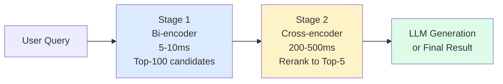
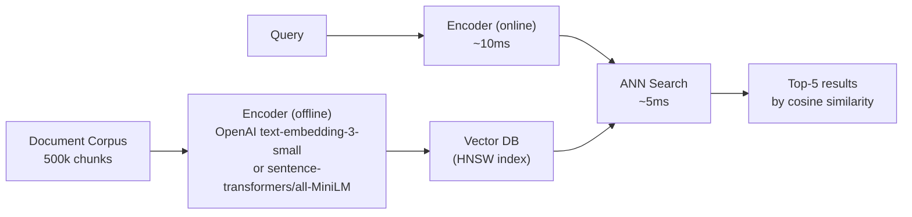
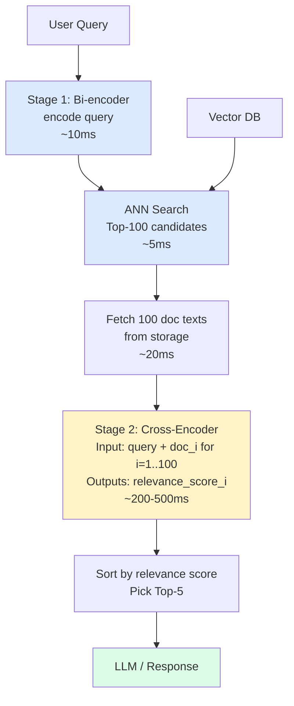
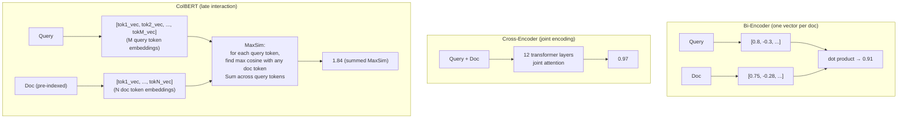
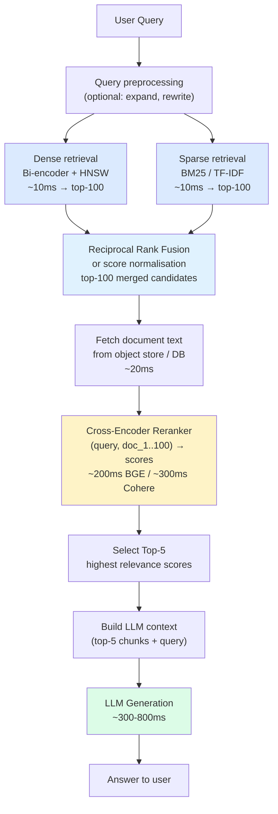
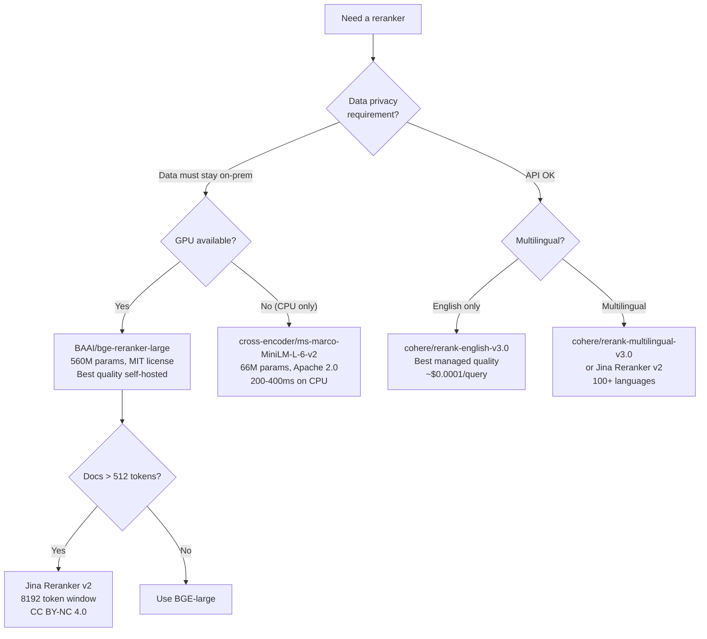

# Reranking — Improving Retrieval Precision with Cross-Encoders

**Level**: 🟡 Intermediate
**Reading Time**: 18 minutes

---

## Level 1 — Surface (2-minute read)

### What Is Reranking?

**Reranking** is a second-pass scoring step that re-orders the top-K results from a fast first-stage retriever using a slower but more accurate model. The fast retriever optimises for recall; the reranker optimises for precision.

### When Do You Need It?

Use reranking when:
- Your RAG system produces correct-looking but subtly wrong answers
- Users report that "the right document is somewhere in the results, but not at the top"
- Your retrieval precision@5 is below ~85% and latency budget allows 200-500ms
- The domain is high-stakes (medical, legal, financial) where wrong context → wrong answer → real harm

Numbers that trigger the decision:
- Corpus > 100k chunks with heterogeneous content
- Top-5 NDCG without reranking < 0.70
- LLM context window forces you to provide ≤ 5 chunks (every slot counts)

### Core Concept (5 bullets)

- **Two stages**: Stage 1 (bi-encoder, fast, ~5-10ms) retrieves top-100; Stage 2 (cross-encoder, slow, ~200-500ms) reranks to top-5
- **Bi-encoder**: encodes query and document independently; enables offline indexing; dot-product at query time — fast but blind to cross-document relevance
- **Cross-encoder**: encodes query + document jointly in one forward pass; all attention layers see both — high precision but cannot pre-compute
- **ColBERT** (late interaction): a middle ground — encodes independently but scores via per-token MaxSim operation; 10-20x faster than full cross-encoder
- **Precision impact**: reranking improves NDCG@5 by 15-30% versus first-stage retrieval alone on standard BEIR benchmarks

### Happy-Path Diagram



### Use This When / Don't Use This When

| Use reranking | Skip reranking |
|---------------|---------------|
| RAG, document QA, enterprise search | Real-time autocomplete (< 100ms SLA) |
| High-stakes domain (medical, legal) | Corpus < 10k well-structured documents |
| Users report precision issues | Latency budget < 150ms |
| Context window forces ≤ 5 chunks | Domain-specific bi-encoder already at 95%+ precision@5 |
| NDCG@5 < 0.70 without reranking | High-volume consumer queries with thin margins |

---

## Level 2 — Deep Dive

### Problem Statement and Failure Scenario

Imagine a medical RAG system with 500k document chunks. A doctor asks: "What is the recommended first-line treatment for acute bacterial sinusitis in penicillin-allergic adults?"

**Without reranking:**
- Vector search returns top-5 chunks ranked by cosine similarity
- Rank 1: A general sinusitis overview that mentions penicillin
- Rank 2: A drug interaction table for penicillin allergy generally
- Rank 3: The actual answer (doxycycline 100mg or levofloxacin 500mg)
- The LLM receives chunks 1-5 without the specific answer at the top — it may hallucinate or give a partial answer

**With reranking (top-100 → cross-encoder → top-5):**
- The cross-encoder sees the full query alongside each of the 100 candidate chunks
- It recognises that only 2 chunks actually discuss both "bacterial sinusitis" and "penicillin-allergic adults" together
- Those 2 chunks are moved to rank 1 and 2 — the LLM now has the right context

Traffic numbers: at 10k queries/day and 512-token chunks, reranking 100 docs/query at Cohere pricing adds ~$600/month. At this query volume the precision improvement (3-5% fewer bad answers) easily justifies the cost for a clinical tool.

---

### Approach A: Bi-Encoder Only (Baseline)

**Architecture**: Single embedding model encodes all documents at index time. At query time, encode the query, run ANN search, return top-K by cosine/dot-product distance.



**How it scores:**

```
query_vec = encoder("what is first-line for sinusitis in penicillin-allergic adults?")
# → 1536-dim float vector

for each doc in index:
    score = cosine(query_vec, doc_vec)   # pre-computed at index time

return top5 by score
```

| Dimension | Value |
|-----------|-------|
| Latency | 10-20ms end-to-end |
| Cost/query | ~$0.00001 (embedding only) |
| Offline indexing | Yes — documents pre-encoded |
| Precision@5 (BEIR avg) | ~70-80% |
| Scales to | Billions of documents |

**Trade-off**: Embedding is computed without knowing the query. The model encodes the "meaning" of the document in isolation. Query-document interaction is a single dot product — zero cross-attention.

---

### Approach B: Cross-Encoder Reranker (Two-Stage)

**Architecture**: Keep Approach A as Stage 1. Add a cross-encoder as Stage 2 that re-scores the top-100 candidates by processing (query, document) as a single input.



**Code (self-hosted BGE reranker):**

```python
from sentence_transformers import CrossEncoder
import numpy as np

# Load once at server startup — keep in memory
reranker = CrossEncoder("BAAI/bge-reranker-large", max_length=512)

def two_stage_retrieve(query: str, vector_db, top_k_stage1=100, top_k_final=5):
    # Stage 1: fast bi-encoder ANN search
    query_vec = embedding_model.encode(query)
    stage1_results = vector_db.search(query_vec, limit=top_k_stage1)

    # Fetch document text for candidates
    doc_texts = [result.text for result in stage1_results]

    # Stage 2: cross-encoder reranking
    pairs = [(query, doc) for doc in doc_texts]
    scores = reranker.predict(pairs)  # shape: (100,) float32

    # Sort by score descending and return top-5
    ranked_indices = np.argsort(scores)[::-1][:top_k_final]
    return [stage1_results[i] for i in ranked_indices]
```

**Code (Cohere Rerank API):**

```python
import cohere

co = cohere.Client("YOUR_COHERE_API_KEY")

def two_stage_retrieve_cohere(query: str, stage1_docs: list[str], top_k=5):
    response = co.rerank(
        model="rerank-english-v3.0",
        query=query,
        documents=stage1_docs,
        top_n=top_k,
        return_documents=True
    )
    return [(r.relevance_score, r.document.text) for r in response.results]
```

| Dimension | BGE-reranker-large (self-hosted) | Cohere Rerank v3 |
|-----------|----------------------------------|-----------------|
| Latency (100 docs) | ~150ms GPU / 2-5s CPU | ~100-300ms (API) |
| Cost/query | GPU amortised (~$0) | ~$0.002 |
| Precision@5 (BEIR avg) | ~91-95% | ~92-96% |
| Setup complexity | High (GPU infra) | Low (API key) |
| Data privacy | Full (no data leaves) | Data sent to Cohere |
| Context window | 512 tokens | ~4096 tokens |

---

### Approach C: ColBERT — Late Interaction (Middle Ground)

**What is ColBERT?** ColBERT (Contextualized Late Interaction over BERT) is a retrieval model that produces a token-level embedding for every token in a document at index time, and for every token in the query at query time. The relevance score is computed as the sum of maximum similarities between query tokens and document tokens — the **MaxSim** operation.

This is fundamentally different from both bi-encoders (one vector per doc) and cross-encoders (no pre-computation):



**MaxSim scoring:**

```
ColBERT score(query Q, document D):
    Q_vecs = [encode(q_i) for q_i in query_tokens]   # pre-compute at query time
    D_vecs = [encode(d_j) for d_j in doc_tokens]     # pre-compute at INDEX time

    score = sum(
        max(cosine(q_i, d_j) for d_j in D_vecs)
        for q_i in Q_vecs
    )
```

This is slow if done naively over the full corpus, but can be indexed with PLAID (a compressed token index) to achieve sub-100ms at scale.

**ColBERT vs alternatives:**

| | Bi-encoder | ColBERT | Cross-encoder |
|--|-----------|---------|--------------|
| Index time | Low (1 vec/doc) | High (N vecs/doc, ~50x larger index) | None possible |
| Query time | Fast (~5ms) | Medium (~50-100ms) | Slow (~200-500ms) |
| Interaction | None (independent) | Late (token-level MaxSim) | Full (joint attention) |
| Precision@5 | ~75% | ~88-92% | ~92-96% |
| Storage | 1x baseline | ~30-50x baseline | N/A |
| Use case | First-stage retrieval | End-to-end retrieval or reranking | Reranking only |

**ColBERT in practice:**

```python
# Using RAGatouille library (wraps ColBERT)
from ragatouille import RAGPretrainedModel

RAG = RAGPretrainedModel.from_pretrained("colbert-ir/colbertv2.0")

# Index documents (stores token-level embeddings)
RAG.index(
    collection=document_texts,
    index_name="my-medical-docs",
    max_document_length=300
)

# Query — single stage, no separate reranker needed
results = RAG.search(
    query="first-line treatment sinusitis penicillin-allergic",
    k=5
)
```

---

### Comparison Table: All Three Approaches

| Dimension | Bi-encoder only | Bi-encoder + Cross-encoder | ColBERT |
|-----------|----------------|---------------------------|---------|
| P50 latency | 15-20ms | 220-520ms | 60-120ms |
| P99 latency | 50ms | 800ms | 300ms |
| Precision@5 (BEIR) | ~75% | ~93% | ~89% |
| NDCG@5 improvement vs baseline | — | +15-30% | +10-20% |
| Cost at 1M queries/month | ~$10 | ~$2,000 (Cohere) or GPU | GPU only |
| Storage overhead | 1x | 1x + doc text cache | 30-50x |
| Cold start | None | 2-4s (model load) | 3-8s (model + index load) |
| Multilingual | Depends on model | Yes (bge-m3, Cohere m) | Limited (English dominant) |

---

### Production Numbers

Based on published benchmarks (BEIR, TREC-DL 2019/2020):

- **NDCG@10 improvement** from adding reranking: 0.15-0.30 absolute (roughly +20-40% relative improvement)
- **Cohere Rerank** on MS MARCO: MRR@10 ~0.395 (vs BM25 baseline of ~0.185)
- **BGE-reranker-large** vs bi-encoder on BEIR: average NDCG@10 improves from 0.53 to 0.62
- **Throughput ceiling**: BGE-reranker-large on A10G GPU: ~500 doc-pairs/second at 512 tokens each → supports ~5 QPS with 100 candidates/query before needing horizontal scaling
- **ColBERT v2**: 40ms for 1k candidates on a single A10G GPU; scales to 100ms for 10k candidates

---

### Real Company Examples

**1. Notion AI (Cohere Rerank)**
Notion uses Cohere's Rerank API in their AI search to retrieve relevant pages and blocks from a user's workspace. Their hybrid search first retrieves 50-100 candidates; Cohere reranks them to improve relevance of the top results fed into their LLM. Notion cited measurable improvements in answer quality for long-form workspace content — where lexical and semantic scores alone disagree frequently.

**2. HubSpot (Cohere Rerank)**
HubSpot integrated Cohere Rerank into their CRM knowledge retrieval pipeline. Customer support queries are answered by retrieving relevant CRM documentation, with reranking applied before passing context to the generative model. The Cohere partnership announcement confirmed production use for enterprise customer support automation.

**3. Jina AI (self-hosted reranker product)**
Jina AI ships `jina-reranker-v2-base-multilingual` — a 137M parameter cross-encoder supporting 100+ languages and an 8192-token context window (vs 512 for most BERT-based rerankers). This is targeted at enterprises building multilingual RAG systems. Jina's own internal benchmarks show 3-8% NDCG improvement over their bi-encoder on non-English retrieval tasks.

**4. Weaviate + BM25 + reranking (open-source pattern)**
Weaviate documents a canonical three-stage pipeline: BM25 (sparse) + vector search (dense) → reciprocal rank fusion → BGE reranker. Multiple enterprise users (logistics, legal tech) have published case studies showing 20-30% improvement in answer accuracy on internal knowledge bases with this pattern.

**5. Elasticsearch (Learning to Rank)**
Elasticsearch has supported Learning to Rank (a reranking plugin) since v8.8, allowing XGBoost or linear models to rerank BM25 results using additional features. This is a non-neural form of reranking used at large scale (100M+ documents) where neural cross-encoders would be too slow or expensive.

---

### Common Mistakes

**Mistake 1: Reranking too small a candidate pool**

*Root cause*: Engineer retrieves top-10 from the vector DB to "save time on reranking", then reranks to top-5.

*What goes wrong*: The true best document sits at rank 14 in the bi-encoder results. It never enters the reranker. The reranker can only improve ordering within the candidates it receives — it cannot discover documents it was never given.

*Fix*: Retrieve at minimum top-50 candidates; top-100 is the standard recommendation. The marginal cost of fetching 100 vs 10 documents from disk is small (20ms vs 2ms) relative to the reranker latency (200ms). The precision gain from a 100-candidate pool over a 10-candidate pool is typically 5-10% absolute.

**Mistake 2: Running the cross-encoder as the only retrieval**

*Root cause*: Engineer sees that cross-encoders are more accurate and attempts to score every document in the corpus at query time.

*What goes wrong*: At 500k chunks, 200ms/100-doc-batch → 1,000 batches → 200 seconds per query. Unusable.

*Fix*: Cross-encoders are physically incapable of replacing first-stage retrieval. They require the query to be present, so no offline pre-computation is possible. Always use a bi-encoder or BM25 as Stage 1, and apply the cross-encoder only to the top-K candidates.

**Mistake 3: Loading the model on every request**

*Root cause*: Reranker model initialised inside the request handler without a warm pool.

*What goes wrong*: First request after deployment takes 3-8 seconds (disk read + model instantiation). Under any traffic, this creates a queue.

*Fix*: Load the model once at server startup into a module-level or singleton variable. Use a worker pool if serving high QPS. For Cohere API, this is handled for you — but keep HTTP connections alive (persistent sessions) to avoid TLS handshake overhead on each request.

**Mistake 4: Ignoring the context window of the reranker**

*Root cause*: Document chunks are 800-1200 tokens; reranker was benchmarked on 512-token inputs.

*What goes wrong*: The reranker silently truncates documents at 512 tokens. A document whose key relevance signal is in the second half is scored on its introduction only. Precision drops unexpectedly and the problem is invisible in logs.

*Fix*: Either (a) chunk documents to 300-400 tokens at ingestion time so they fit comfortably within 512; (b) use a long-context reranker like Jina Reranker v2 (8192 tokens) or Cohere Rerank v3 (4096 tokens); (c) implement sliding-window reranking — score multiple 512-token windows per document and take the max.

**Mistake 5: Running reranker on CPU in latency-sensitive path**

*Root cause*: No GPU available in dev/staging; engineer deploys to production with same CPU config.

*What goes wrong*: BGE-reranker-large on a modern CPU (32-core) scores 100 document pairs in 2-5 seconds — 10-30x slower than a single A10G GPU (150ms). The entire RAG pipeline becomes unusable for interactive queries.

*Fix*: Always run cross-encoders on GPU for latency-sensitive workloads. If no GPU is available, use a smaller model (`ms-marco-MiniLM-L-6-v2` at 66M params can run on CPU in 200-400ms for 100 docs) or use the Cohere API which handles GPU allocation for you.

---

### Reranking in the Full RAG Pipeline



**Latency budget breakdown (p50, typical production):**

| Step | Latency | Notes |
|------|---------|-------|
| Query embedding | 10ms | OpenAI API or local model |
| Dense ANN search | 5ms | In-memory HNSW, 1M docs |
| Sparse BM25 search | 10ms | Elasticsearch |
| RRF fusion | 1ms | In-process |
| Fetch 100 doc texts | 20ms | DB reads |
| Cross-encoder rerank | 150ms | BGE-large on GPU |
| LLM generation | 400ms | GPT-4o, 200 token output |
| **Total** | **~600ms** | Acceptable for search/QA |

---

### Cost Analysis at Scale

| Monthly volume | Bi-encoder only | + Cohere Rerank | + Self-hosted BGE (A10G) |
|----------------|----------------|-----------------|--------------------------|
| 100k queries | ~$1 | ~$200 | $0 + GPU (~$150/month amortised) |
| 1M queries | ~$10 | ~$2,000 | $0 + GPU (~$150/month) |
| 10M queries | ~$100 | ~$20,000 | $0 + 2 GPUs (~$300/month) |
| 100M queries | ~$1,000 | ~$200,000 | $0 + 10 GPUs (~$1,500/month) |

The crossover from Cohere API to self-hosted is at roughly **500k-1M queries/month**. Below that, the API is cheaper once engineering and infra time is factored in. Above that, self-hosted BGE on GPU wins by an order of magnitude.

For Cohere pricing: `rerank-english-v3.0` is priced per search unit (one search unit = one document in one rerank call). At $1 per 1000 search units (documents), 100 documents/query = 0.1 search units → roughly $0.0001/query. At 1M queries → ~$100-200/month (varies by plan and document length).

---

### Choosing a Reranker Model



**Model comparison table:**

| Model | Params | Context | Latency (100 docs, GPU) | Languages | License | Quality |
|-------|--------|---------|------------------------|-----------|---------|---------|
| Cohere rerank-english-v3.0 | Proprietary | 4096 tok | ~200ms (API) | English | Proprietary API | Excellent |
| Cohere rerank-multilingual-v3.0 | Proprietary | 4096 tok | ~250ms (API) | 100+ | Proprietary API | Excellent |
| BAAI/bge-reranker-large | 560M | 512 tok | ~150ms | English | MIT | Excellent |
| BAAI/bge-reranker-base | 278M | 512 tok | ~80ms | English | MIT | Good |
| BAAI/bge-m3 (reranker mode) | 570M | 8192 tok | ~300ms | 100+ | MIT | Very good |
| Jina Reranker v2 | 137M | 8192 tok | ~60ms | 100+ | CC BY-NC 4.0 | Good |
| cross-encoder/ms-marco-MiniLM-L-6-v2 | 66M | 512 tok | ~30ms | English | Apache 2.0 | Decent |
| ColBERT v2 (via RAGatouille) | 110M | 300 tok | ~80ms (50-100 cands) | English | MIT | Good |

---

### Key Takeaways

- **Two-stage pipeline is mandatory**: retrieve top-100 fast (bi-encoder/BM25), rerank to top-5 slow (cross-encoder). Reranking alone cannot replace first-stage retrieval — it requires a query to score each document.
- **Precision impact is large**: reranking improves NDCG@5 by 15-30% absolute on standard benchmarks — equivalent to moving 1-2 relevant documents into the top-5 slot that the LLM uses.
- **Cost crossover at ~1M queries/month**: Cohere Rerank API (~$0.0001/query) beats self-hosted below ~500k queries/month when engineering cost is included; above that, a single A10G GPU at ~$150/month handles ~5 QPS sustainably.
- **Always retrieve at least top-50 before reranking**: retrieving only top-10 and reranking to top-5 is a common precision trap — the true best document may be at rank 20 in the bi-encoder results.
- **ColBERT is the speed/accuracy middle ground**: 50-100ms latency vs 200-500ms for a cross-encoder, with ~88-92% vs ~93-96% precision@5 — justified when <200ms is needed but bi-encoder precision is insufficient.
- **Context window mismatch is the silent failure**: most BERT-based rerankers truncate at 512 tokens; if your chunks are longer, use Jina v2 (8192 tokens), BGE-m3, or Cohere v3 (4096 tokens).

---

## References

- 📚 [Cohere Rerank API Documentation](https://docs.cohere.com/reference/rerank)
- 📚 [BAAI/bge-reranker-large on Hugging Face](https://huggingface.co/BAAI/bge-reranker-large)
- 📖 [ColBERT: Efficient and Effective Passage Search via Contextualized Late Interaction (arXiv 2004.12832)](https://arxiv.org/abs/2004.12832)
- 📚 [Sentence Transformers Cross Encoders — Pretrained Models](https://www.sbert.net/docs/cross_encoder/pretrained_models.html)
- 📖 [Reranking in RAG pipelines — Pinecone Learning Center](https://www.pinecone.io/learn/series/rag/rerankers/)
- 📺 [Reranking for RAG: Why and How (YouTube)](https://www.youtube.com/watch?v=tKAe8wEH23A)
- 📖 [Jina Reranker v2 announcement — Jina AI](https://jina.ai/news/jina-reranker-v2/)
