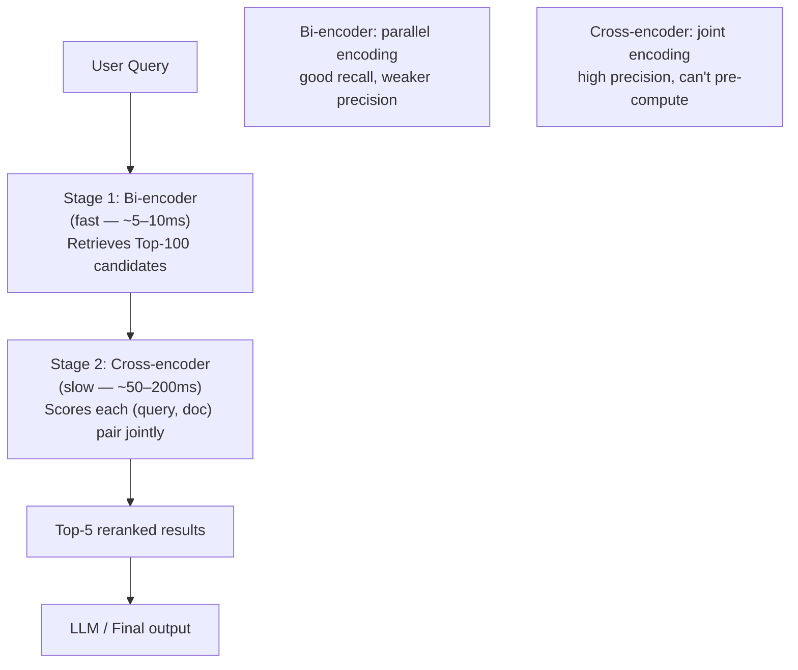
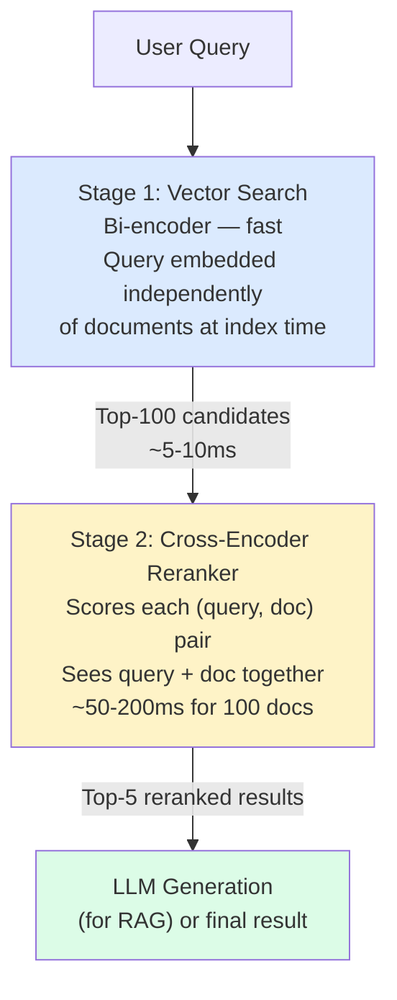

# Reranking — Improving Retrieval Precision

**Level**: 🟡 Intermediate
**Reading Time**: 10 minutes

## 🗺️ Quick Overview



*Two-stage retrieval: a fast bi-encoder gets top-100 candidates for recall, then a slow cross-encoder reranks them for precision by reading query and document together in a single forward pass.*

> Your vector search returns the 100 most semantically similar chunks. Your cross-encoder reranker reads all 100 alongside the original query and returns the 5 that actually answer the question. That's the difference between retrieval and precision.

## The Problem

Vector search (and even hybrid search) is optimized for **recall** — retrieving all potentially relevant documents quickly. The embedding is computed independently for the query and each document, which makes indexing possible but limits accuracy. The model never sees the query and document together.

Consider the query "What are the side effects of aspirin for elderly patients?" A bi-encoder might rank highly any document containing the words "aspirin" and "elderly" — including a drug interaction table, a dosage guide, and a manufacturing FAQ. The actual answer — a pharmacology section specifically about adverse effects in geriatric populations — might be ranked 7th.

A **cross-encoder** reads the query and each candidate document together as a single input and outputs a precise relevance score. Because it can see both at once, it understands nuanced relevance — but it's too slow to score every document in the index, hence the two-stage architecture.

## Two-Stage Retrieval Architecture



The two stages exploit an asymmetry:
- **Bi-encoder** (Stage 1): computes embeddings offline for all documents; query embedding computed at query time; fast dot-product comparison. Good for recall.
- **Cross-encoder** (Stage 2): computes a joint (query, doc) representation in real time; cannot pre-compute; slow but highly accurate. Good for precision.

## Why Cross-Encoders Are More Accurate

A bi-encoder encodes the query to a vector without knowing what documents exist. A cross-encoder processes `[CLS] query [SEP] document [SEP]` as a single sequence through the transformer — every layer of self-attention can relate any token in the query to any token in the document.

```
Bi-encoder:
  query_vec = encoder("What are side effects?")          → [0.8, -0.3, ...]
  doc_vec   = encoder("Aspirin adverse effects elderly") → [0.75, -0.28, ...]
  score = cosine(query_vec, doc_vec)                     → 0.91
  // The model never sees the query while encoding the document

Cross-encoder:
  input = "What are side effects? [SEP] Aspirin adverse effects in elderly patients..."
  score = classifier(encoder(input))                     → 0.97
  // Every query token attends to every document token — much richer signal
```

## Reranker Models

### API-Based (Managed)

**Cohere Rerank** is the dominant managed option:

```python
import cohere
co = cohere.Client("YOUR_API_KEY")

results = co.rerank(
    model="rerank-english-v3.0",
    query="What are the side effects of aspirin for elderly patients?",
    documents=["doc1 content", "doc2 content", ..., "doc100 content"],
    top_n=5
)

for r in results.results:
    print(f"Rank {r.index}: score={r.relevance_score:.3f}")
```

Cohere rerank-english-v3.0 latency: ~100-300ms for 100 documents of 512 tokens each.

### Self-Hosted Models

| Model | Size | Latency (100 docs) | Quality | License |
|-------|------|-------------------|---------|---------|
| BAAI/bge-reranker-large | 560M | ~150ms (GPU) | Excellent | MIT |
| BAAI/bge-reranker-base | 278M | ~80ms (GPU) | Good | MIT |
| cross-encoder/ms-marco-MiniLM-L-6-v2 | 66M | ~30ms (GPU) | Decent | Apache 2.0 |
| Jina Reranker v2 | 137M | ~60ms (GPU) | Good | CC BY-NC 4.0 |

```python
from sentence_transformers import CrossEncoder

model = CrossEncoder("BAAI/bge-reranker-large")

query = "What are side effects of aspirin for elderly patients?"
documents = [doc1_content, doc2_content, ..., doc100_content]

# Score all (query, doc) pairs
scores = model.predict([(query, doc) for doc in documents])

# Get top-5 by score
ranked = sorted(zip(scores, documents), reverse=True)
top5 = ranked[:5]
```

## Latency Budget

Understanding where time goes in a typical RAG pipeline:

```
Total p50 latency budget: ~500ms

├── Embedding the query:          ~10ms   (OpenAI API or local model)
├── Vector search (HNSW, 1M):     ~5ms    (in-memory)
├── BM25 search (hybrid):         ~10ms   (Elasticsearch)
├── Fetch 100 document chunks:    ~20ms   (DB read)
├── Cross-encoder rerank 100 docs:~150ms  (bge-reranker-large on GPU)
│                                  ~300ms  (Cohere API)
└── LLM generation (top-5 chunks):~300ms  (GPT-4o, ~500 tokens output)
```

Reranking adds 100-300ms but improves the quality of context sent to the LLM — which can meaningfully reduce hallucination and answer quality issues.

## When to Add Reranking

Add reranking when:
- **Retrieval quality is the bottleneck**: Users complain answers are wrong or incomplete; retrieval@K shows low precision
- **LLM hallucinations correlate with bad context**: LLM answer quality improves when you manually hand-pick good chunks
- **Latency budget allows it**: You have 200ms+ to spend on retrieval; overall system latency target is 500ms+
- **High-stakes domain**: Medical, legal, financial — where wrong answers have real consequences

Skip reranking when:
- **Latency is critical**: Real-time autocomplete, instant search (< 100ms target)
- **Dataset is small and precise**: Under 10k well-organized documents — good hybrid search is enough
- **Bi-encoder already has very high precision**: If your domain-specific fine-tuned bi-encoder gives 95%+ precision@5, reranking adds marginal benefit

## Full Pipeline Pseudocode

```
function twoStageRetrieval(query, vectorDB, bm25Index, reranker):
    // Stage 1: Fast retrieval — optimize for recall, not precision
    queryEmbedding = embeddingModel.encode(query)

    // Retrieve generously — 100 candidates for final top-5
    denseResults  = vectorDB.search(queryEmbedding, limit=100)
    sparseResults = bm25Index.search(query, limit=100)
    candidates    = rrfFusion([denseResults, sparseResults], topK=100)

    // Stage 2: Precise reranking — optimize for precision
    candidateTexts = [fetchContent(c.id) for c in candidates]
    rerankedScores = reranker.score(
        query = query,
        documents = candidateTexts
    )

    // Take the top-5 most relevant
    top5 = topK(zip(rerankedScores, candidates), k=5)

    return [c for score, c in top5]
```

## Cost Trade-offs

| Setup | Latency | Cost/query | Precision@5 |
|-------|---------|-----------|-------------|
| Vector search only (top-5) | 15ms | $0.00001 | ~70-80% |
| Hybrid search (top-5) | 30ms | $0.00002 | ~80-88% |
| Hybrid + Cohere Rerank (100→5) | 350ms | $0.002 | ~92-96% |
| Hybrid + bge-reranker-large (100→5) | 180ms | GPU amortized | ~91-95% |

At 1M queries/month, Cohere Rerank adds ~$2,000/month. For high-value queries (enterprise search, medical RAG), the precision improvement is worth it. For high-volume consumer queries, self-hosted bge-reranker amortizes the GPU cost.

## Common Pitfalls

1. **Reranking too few candidates**: If you retrieve top-10 from vector search and rerank to top-5, the true best result that sits at rank 15 never gets seen. Always retrieve at least top-50 candidates (top-100 is safer).
2. **Using reranker as the only retrieval**: Cross-encoders cannot scale to index-time scoring — they require the query to score each document. Never try to rerank against your full corpus. It must follow a fast first-stage retriever.
3. **Not warming the reranker**: On first request, loading bge-reranker-large from disk takes 2-4 seconds. Keep the model in memory with a warm pool of inference workers.
4. **CPU-only reranking**: bge-reranker-large on CPU takes 2-5 seconds for 100 documents — 10-30× slower than GPU. Always use GPU for latency-sensitive reranking.
5. **Ignoring reranker context window**: Most cross-encoders have a 512-token context window. If your documents are 1000 tokens, they get truncated before scoring. Either use a long-context reranker (Jina v2 supports 8192 tokens) or truncate chunks during ingestion.

## Key Takeaways

- Two-stage retrieval: fast bi-encoder (top-100) → precise cross-encoder reranker (top-5)
- Cross-encoders are more accurate because they see query and document together; bi-encoders encode independently
- Cohere Rerank API: ~100-300ms latency, ~$0.002/query; bge-reranker-large: ~150ms on GPU, self-hosted
- Always retrieve at least top-50 candidates before reranking — the best result may not be in top-10 from bi-encoder
- Add reranking when retrieval quality is the bottleneck, not when latency is the primary constraint
- Keep reranker model warm in memory; cold load of bge-reranker-large takes 2-4 seconds
