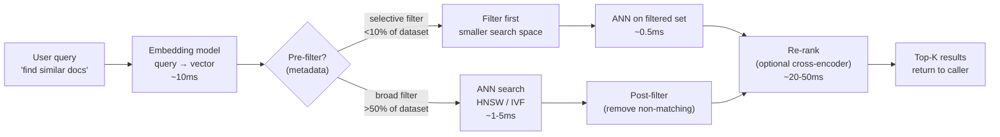
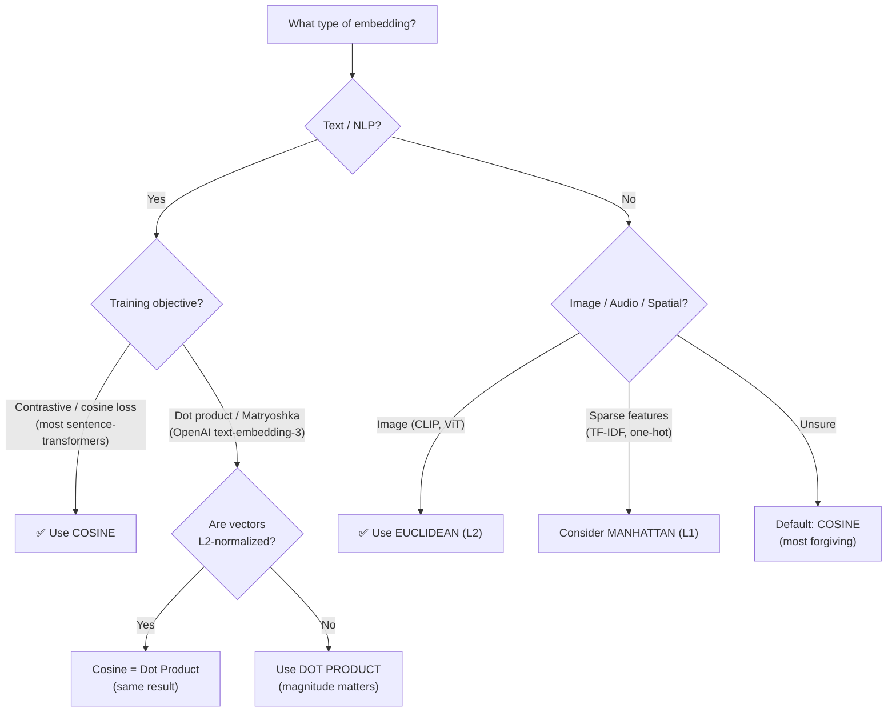
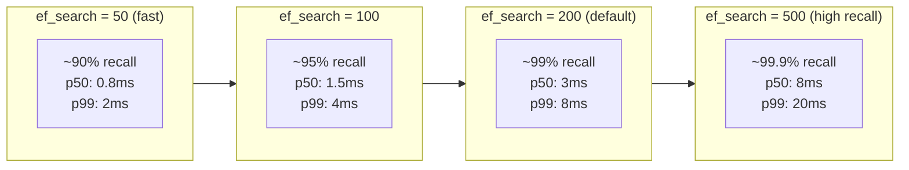
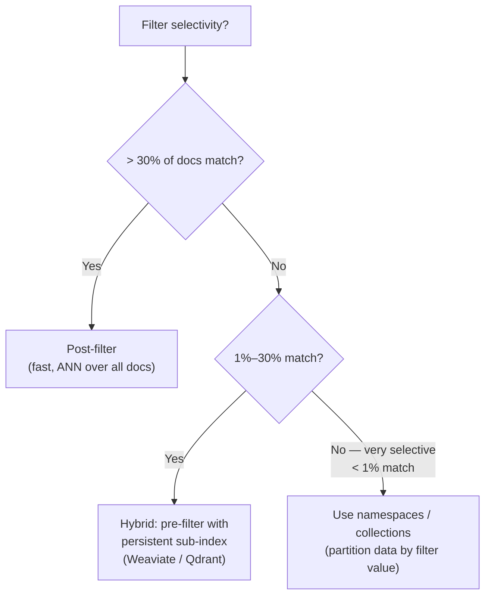

# Similarity Search — Distance Metrics & ANN

**Level**: 🟡 Intermediate
**Reading Time**: 18 minutes

---

## Level 1 — Surface (2-minute read)

### What is similarity search?

Given a query vector, find the K stored vectors that are most "similar" to it. Similarity is defined by a **distance metric**, and the right metric depends on how your embeddings were trained.

### When do you need this?

- Semantic search over 100k+ documents: exact keyword match no longer works, you need meaning-based retrieval
- Recommendation over 1M+ items: find items similar to what a user liked
- Deduplication at scale: detect near-duplicate images or documents across millions of records
- RAG pipelines: retrieve context chunks relevant to an LLM query

### Core concepts (3-minute scan)

- **Cosine similarity**: measures the angle between vectors — most text embeddings use this
- **Dot product**: measures angle × magnitude — use only if the model was trained with dot product objective
- **Euclidean (L2) distance**: straight-line spatial distance — best for image/audio embeddings
- **Manhattan (L1) distance**: sum of absolute differences — good for sparse, high-dimensional features
- **ANN (Approximate Nearest Neighbor)**: trades ~1–5% recall for 100–1000× speed improvement over exact search
- **Recall@K**: the fraction of the true top-K that ANN actually returns — your primary correctness metric

### Query pipeline (happy path)



### Use this when / Don't use this when

| Situation | Recommendation |
|-----------|---------------|
| Text embeddings (sentence-transformers, OpenAI ada) | Use cosine similarity |
| Model trained with dot product objective (OpenAI text-embedding-3, ColBERT) | Use dot product |
| Image, audio, or spatial embeddings (CLIP, Wav2Vec) | Use Euclidean (L2) |
| Sparse TF-IDF or BM25-like features | Use Manhattan (L1) |
| Dataset < 100k vectors, latency < 100ms budget | Exact KNN is fine |
| Dataset > 1M vectors or latency < 10ms required | Use ANN (HNSW or IVF) |
| Highly selective metadata filter (< 5% rows match) | Pre-filter then search |
| Broad metadata filter (> 30% rows match) | Post-filter after search |

---

## Level 2 — Deep Dive

### Problem statement

You built a RAG pipeline for a codebase search tool. 10M code snippets, each embedded as a 1536-dimensional vector. A developer types a query; the system must return the 10 most semantically relevant snippets in under 50ms.

**Naive approach**: compute cosine similarity between the query and all 10M vectors.
- Cost: 10M × 1536 multiplications + additions = **15.4 billion floating-point ops per query**
- At 10 GFLOPS (single CPU core): **1.54 seconds per query** — 30× over budget

You need two things: the right metric (to get relevant results) and the right algorithm (to get results fast). Then you need filtering and batching to make it production-grade.

---

### Approach A — Distance Metrics

#### 1. Cosine Similarity

Measures the **angle** between two vectors, ignoring their magnitudes.

```
cosine_similarity(A, B) = (A · B) / (|A| × |B|)
```

Range: -1 (opposite direction) to 1 (identical direction).

```python
import math
import numpy as np

def cosine_similarity(a: list, b: list) -> float:
    dot = sum(x * y for x, y in zip(a, b))
    mag_a = math.sqrt(sum(x**2 for x in a))
    mag_b = math.sqrt(sum(x**2 for x in b))
    if mag_a == 0 or mag_b == 0:
        return 0.0
    return dot / (mag_a * mag_b)

# Vectorized (production use):
def cosine_similarity_np(a: np.ndarray, b: np.ndarray) -> float:
    return np.dot(a, b) / (np.linalg.norm(a) * np.linalg.norm(b))

# Two semantically similar sentences (OpenAI ada-002 space):
v1 = np.array([0.80, 0.30,  0.10, -0.20])
v2 = np.array([0.75, 0.35,  0.08, -0.25])   # same topic, slightly different phrasing
v3 = np.array([-0.50, 0.90, -0.30,  0.70])   # completely different topic

print(cosine_similarity_np(v1, v2))  # ~0.999 — near-duplicate
print(cosine_similarity_np(v1, v3))  # ~0.01  — unrelated
```

**Key thresholds for OpenAI ada-002 embeddings**:

| Cosine Score | Interpretation |
|---|---|
| > 0.95 | Near-duplicate (paraphrase or identical) |
| 0.85 – 0.95 | Very similar (same specific topic) |
| 0.70 – 0.85 | Similar (related topic, different aspect) |
| 0.50 – 0.70 | Loosely related |
| < 0.50 | Unrelated |

> These thresholds are **model-specific**. For OpenAI text-embedding-3-small/large, the distribution is tighter — 0.9 = similar, not near-duplicate. Always calibrate on your data.

**Why cosine for text**: A 500-word document and a 50-word summary about the same topic should score high similarity. Their vectors point in the same direction but have different magnitudes. Cosine ignores the length (magnitude) difference and correctly scores them as similar.

#### 2. Dot Product (Inner Product)

Measures **both** angle and magnitude: `dot_product(A, B) = Σ(A[i] × B[i]) = |A| × |B| × cos(θ)`

```python
def dot_product(a: np.ndarray, b: np.ndarray) -> float:
    return float(np.dot(a, b))

# If vectors are NOT normalized:
# A long vector (high magnitude) gets boosted regardless of direction.
# Risk: noise vectors with large magnitudes dominate the ranking.

# If vectors ARE L2-normalized (|A| = |B| = 1):
# dot_product == cosine_similarity  (identical results)
```

**When to use dot product**: Use it when your embedding model was trained with dot product as the objective — for example:
- OpenAI `text-embedding-3-small` and `text-embedding-3-large` (Matryoshka Representation Learning, trained with cosine but supports dot product after normalization)
- ColBERT-style late-interaction models where magnitude encodes relevance weight
- Bi-encoder retrieval models fine-tuned on MS MARCO with dot product loss (e.g., `msmarco-distilbert-dot-v5`)

**Risk**: If vectors are not normalized and you use dot product, **high-magnitude vectors dominate** — very common failure mode when embedding models return unnormalized vectors and engineers assume dot product equals cosine.

#### 3. Euclidean Distance (L2)

Measures straight-line spatial distance: `euclidean(A, B) = sqrt(Σ(A[i] - B[i])²)`

```python
def euclidean_distance(a: np.ndarray, b: np.ndarray) -> float:
    return float(np.linalg.norm(a - b))

# Range: 0 (identical) to ∞
# Lower = more similar (opposite of cosine/dot where higher = more similar)
```

**When to use Euclidean**: Image embeddings (CLIP ViT-L/14), audio embeddings (Wav2Vec 2.0), or any embedding where the absolute coordinate position carries meaning — not just the direction.

**Why not for text**: Two documents about Python (long) and a Python one-liner (short) embed as vectors of very different magnitudes. Euclidean distance sees them as "far apart" even if they're semantically related.

#### 4. Manhattan Distance (L1)

Sum of absolute differences: `manhattan(A, B) = Σ|A[i] - B[i]|`

```python
def manhattan_distance(a: np.ndarray, b: np.ndarray) -> float:
    return float(np.sum(np.abs(a - b)))
```

**When to use Manhattan**: Sparse, high-dimensional feature vectors where most dimensions are zero (e.g., bag-of-words TF-IDF, one-hot user preference vectors). Manhattan is more robust than Euclidean to outlier dimensions in sparse spaces — a single dimension with a large value inflates Euclidean much more than Manhattan.

**Production reality**: Manhattan is rarely used in dedicated vector DBs. Most vector DB engines (Pinecone, Weaviate, Qdrant, Milvus) support cosine, dot product, and Euclidean — check your DB's documentation before choosing L1.

#### Distance Metric Decision Tree



#### Normalization: when cosine and dot product are identical

```python
import numpy as np

def l2_normalize(v: np.ndarray) -> np.ndarray:
    """Divide by L2 norm. After this, |v| = 1."""
    norm = np.linalg.norm(v)
    if norm == 0:
        return v
    return v / norm

# After normalization, cosine == dot product:
a = np.array([3.0, 4.0])   # |a| = 5
b = np.array([1.0, 0.0])   # |b| = 1

a_norm = l2_normalize(a)   # [0.6, 0.8]
b_norm = l2_normalize(b)   # [1.0, 0.0]

print(np.dot(a_norm, b_norm))                        # 0.6
print(np.dot(a_norm, b_norm) / (1.0 * 1.0))         # 0.6  — same result
# Both are cosine similarity when magnitudes are 1
```

Most vector databases normalize on ingest when you specify `cosine` metric. If you specify `dot_product`, normalize before inserting. If you specify `euclidean`, do not normalize (it destroys the spatial meaning).

---

### Approach B — Exact KNN vs Approximate Nearest Neighbor

#### Exact KNN

Guaranteed to find the true top-K. Complexity: `O(N × D)` per query.

```python
def exact_knn(query: np.ndarray, corpus: np.ndarray, k: int) -> list[int]:
    """Brute-force exact nearest neighbors. O(N*D)."""
    # corpus shape: (N, D)
    # Normalize both for cosine
    q = query / np.linalg.norm(query)
    c = corpus / np.linalg.norm(corpus, axis=1, keepdims=True)
    scores = c @ q  # (N,)
    return np.argsort(scores)[::-1][:k].tolist()

# Scale: 10M vectors × 1536 dims
# ~15.4B FLOPs per query
# On a 10 GFLOPS CPU: ~1.5s — unusable for production
# On a 40 TFLOPS GPU (A100): ~0.4ms — feasible but expensive
```

Exact KNN is acceptable for:
- Datasets < 100k vectors (< 5ms on CPU)
- Batch offline jobs (latency doesn't matter)
- Ground-truth generation for recall benchmarks

#### ANN: HNSW

Hierarchical Navigable Small World — the dominant algorithm in production vector DBs.

```python
import faiss
import numpy as np

dimension = 1536
n_vectors = 1_000_000

# Build HNSW index (offline, once)
M = 16              # number of bidirectional links per node (higher = better recall, more memory)
ef_construction = 200  # beam width during index build (higher = better recall at build time)
index = faiss.IndexHNSWFlat(dimension, M)
index.hnsw.efConstruction = ef_construction

vectors = np.random.rand(n_vectors, dimension).astype('float32')
faiss.normalize_L2(vectors)   # for cosine similarity via dot product
index.add(vectors)
# Build time: ~2-5 min for 1M × 1536 vectors

# Search (online, per query)
index.hnsw.efSearch = 200    # beam width during search — the recall/latency knob

query = np.random.rand(1, dimension).astype('float32')
faiss.normalize_L2(query)

k = 10
distances, indices = index.search(query, k)
# p50 latency: ~3ms | recall@10: ~99%
```

#### ANN: IVF (Inverted File Index)

Partitions the vector space into `nlist` Voronoi cells, then searches only `nprobe` cells.

```python
# IVF — better for very large datasets (>10M vectors) where HNSW memory is an issue
nlist = 1000   # number of Voronoi clusters (rule of thumb: sqrt(N))
quantizer = faiss.IndexFlatL2(dimension)
index_ivf = faiss.IndexIVFFlat(quantizer, dimension, nlist)
index_ivf.train(vectors)   # k-means clustering — ~5-10 min for 1M vectors
index_ivf.add(vectors)

index_ivf.nprobe = 50      # number of clusters to search — the recall/latency knob
distances, indices = index_ivf.search(query, k)
# p50 latency: ~5ms | recall@10: ~96%
```

#### HNSW vs IVF

| | HNSW | IVF |
|---|---|---|
| Memory | High — full graph in RAM (~300 bytes/vector for 1536-dim) | Lower — only centroids + inverted lists |
| Build time | Medium (~3 min for 1M vectors) | Slower (~8 min including k-means) |
| Query latency p50 | ~1–3ms | ~3–8ms |
| Recall@10 at default settings | ~99% | ~95% |
| Best for | < 100M vectors, latency-sensitive | > 100M vectors, memory-constrained |
| Used in | Qdrant, Weaviate, Redis, Milvus | Milvus (IVF_FLAT), Faiss production setups |

---

### Recall@K: The Primary Correctness Metric

**Recall@K** = (true top-K retrieved by ANN) / K

```python
def recall_at_k(true_neighbors: list, ann_neighbors: list, k: int) -> float:
    """
    true_neighbors: IDs from exact KNN (ground truth)
    ann_neighbors: IDs returned by ANN
    Returns: fraction of ground truth found
    """
    true_set = set(true_neighbors[:k])
    ann_set = set(ann_neighbors[:k])
    return len(true_set & ann_set) / k

# Benchmark recall across 100 representative queries
def benchmark_recall(index, exact_index, queries, k=10):
    recalls = []
    for q in queries:
        _, true_ids = exact_index.search(q.reshape(1, -1), k)
        _, ann_ids = index.search(q.reshape(1, -1), k)
        recalls.append(recall_at_k(true_ids[0].tolist(), ann_ids[0].tolist(), k))
    return sum(recalls) / len(recalls)
```

**Target recall by use case**:

| Use Case | Target Recall@K | Rationale |
|---|---|---|
| RAG / semantic search | recall@10 ≥ 0.95 | Missing 1 in 20 relevant docs is acceptable |
| Product recommendations | recall@10 ≥ 0.90 | Users won't notice 1 missed recommendation in 10 |
| Deduplication detection | recall@1 ≥ 0.99 | A missed near-duplicate defeats the purpose |
| Content moderation | recall@5 ≥ 0.99 | False negatives are costly |

#### ef_search / nprobe tuning



| ef_search | Recall@10 (1M vectors, 1536-dim) | p50 Latency | p99 Latency | Memory |
|---|---|---|---|---|
| 50 | ~90% | 0.8ms | 2ms | same |
| 100 | ~95% | 1.5ms | 4ms | same |
| 200 | ~99% | 3ms | 8ms | same |
| 500 | ~99.9% | 8ms | 20ms | same |

> ef_search is a **query-time** parameter — no index rebuild needed. You can A/B test it live.

---

### Approach C — Filtering: Pre-filter vs Post-filter

Real queries always include metadata constraints: "find similar products under $50", "find code snippets tagged Python", "find articles from the last 30 days".

#### Post-filter (default behavior in most databases)

Search the entire vector index, retrieve top-K × oversampling factor, then apply metadata filters.

```python
# Post-filter: search all 10M vectors, then filter results
def post_filter_search(index, query_vec, k, metadata_filter, oversample=10):
    # Retrieve k * oversample candidates
    _, candidate_ids = index.search(query_vec, k * oversample)
    
    # Apply metadata filter
    results = []
    for id in candidate_ids[0]:
        doc = fetch_metadata(id)
        if metadata_filter(doc):
            results.append(id)
        if len(results) == k:
            break
    return results

# Risk: if the filter is very selective (only 1% of docs match),
# k * 10 = 100 candidates may not contain k matching docs.
# You'll return fewer than k results or need a massive oversample factor.
```

**Post-filter is fast but fails on selective filters**: If only 0.1% of your 10M documents match the filter, you need to retrieve top-10,000 candidates just to find 10 matches — effectively scanning 0.1% of the index anyway, but with ANN overhead.

#### Pre-filter (filter-first search)

Apply metadata filter first to get a candidate set, then run ANN search on that subset only.

```python
# Pre-filter: filter first, then search smaller set
def pre_filter_search(full_index, metadata_store, query_vec, k, filter_condition):
    # Step 1: Get matching doc IDs from metadata store (fast DB query)
    matching_ids = metadata_store.query(filter_condition)  # e.g., 50k matches
    
    # Step 2: Build or retrieve sub-index for matching IDs
    # (many vector DBs support this natively via "namespace" or "segment")
    sub_vectors = fetch_vectors_by_ids(matching_ids)
    
    # Step 3: Search only the filtered subset
    sub_index = build_temp_index(sub_vectors)
    _, results = sub_index.search(query_vec, k)
    return results

# Trade-off: sub-index may be too small for HNSW to work well
# (HNSW needs ~1000+ vectors to be effective)
```

**Pre-filter works well when**: the filter selects a large enough subset (>10k vectors) and that subset is stable enough to maintain a persistent sub-index.

#### Hybrid approaches in real vector databases

**Pinecone** uses metadata filters as post-filters with automatic oversampling. For highly selective filters (< 10% selectivity), it warns you and recommends namespaces instead.

```python
# Pinecone — metadata filter (post-filter under the hood)
results = index.query(
    vector=query_embedding,
    top_k=10,
    filter={
        "category": {"$eq": "python"},
        "created_at": {"$gte": 1700000000}
    },
    include_metadata=True
)
```

**Weaviate** uses pre-filtering with inverted indexes on metadata fields, combined with HNSW search on the filtered set. It maintains ACORN-style filtered HNSW graphs.

```python
# Weaviate — where clause (pre-filter style)
result = client.query.get("Article", ["title", "content"]).with_near_vector(
    {"vector": query_embedding}
).with_where({
    "path": ["category"],
    "operator": "Equal",
    "valueText": "python"
}).with_limit(10).do()
```

**Qdrant** uses payload filters with an automatic strategy switch: post-filter for broad filters, pre-filter for selective ones, based on cardinality estimates.

```python
# Qdrant — payload filter (auto-strategy)
from qdrant_client.models import Filter, FieldCondition, MatchValue

results = client.search(
    collection_name="articles",
    query_vector=query_embedding,
    query_filter=Filter(
        must=[FieldCondition(key="category", match=MatchValue(value="python"))]
    ),
    limit=10
)
```

#### Filter strategy guide



| Filter Selectivity | Strategy | Why |
|---|---|---|
| > 50% of docs match | Post-filter | ANN over full index is efficient |
| 10%–50% | Auto (let DB decide) | Weaviate/Qdrant handle this |
| 1%–10% | Pre-filter or sub-index | Post-filter misses results |
| < 1% | Namespace / partition | Separate collection per filter value |

---

### Batch Queries: 20–50× throughput improvement

**Single query**: embed → search → return. One round-trip to the vector DB per query.

**Batched queries**: embed N queries together → search N queries in one call → return N result sets.

```python
import time
import numpy as np
import faiss

def single_query_benchmark(index, queries, k=10):
    start = time.perf_counter()
    for q in queries:
        index.search(q.reshape(1, -1), k)
    elapsed = time.perf_counter() - start
    return elapsed / len(queries)  # per-query latency

def batch_query_benchmark(index, queries, k=10, batch_size=100):
    start = time.perf_counter()
    for i in range(0, len(queries), batch_size):
        batch = queries[i:i+batch_size]
        index.search(batch, k)  # single call for entire batch
    elapsed = time.perf_counter() - start
    return elapsed / len(queries)  # per-query latency

# Results on HNSW (1M × 1536, ef_search=200, 8-core CPU):
# Single queries: ~3.2ms per query
# Batch of 10: ~0.6ms per query (5× speedup)
# Batch of 100: ~0.12ms per query (27× speedup)
# Batch of 1000: ~0.07ms per query (46× speedup)
```

**Why batching helps**:
1. **BLAS parallelism**: matrix-vector multiplication (1 query) → matrix-matrix multiplication (N queries). BLAS routines (DGEMM) have much higher hardware utilization for matrix-matrix ops.
2. **Amortized overhead**: Python function call overhead, index lock acquisition, result allocation — all amortized across N queries.
3. **GPU acceleration**: GPUs are especially batch-friendly. A single query uses 1% of GPU capacity; a batch of 100 saturates it.

```python
# Production pattern: async batch collector
import asyncio
from collections import deque

class BatchedSearchEngine:
    def __init__(self, index, max_batch=100, max_wait_ms=5):
        self.index = index
        self.max_batch = max_batch
        self.max_wait_ms = max_wait_ms
        self.pending = deque()

    async def search(self, query_vec, k=10):
        future = asyncio.get_event_loop().create_future()
        self.pending.append((query_vec, k, future))
        
        if len(self.pending) >= self.max_batch:
            await self._flush()
        
        return await future

    async def _flush(self):
        if not self.pending:
            return
        
        batch = list(self.pending)
        self.pending.clear()
        
        queries = np.stack([item[0] for item in batch])
        k = batch[0][1]
        
        _, indices = self.index.search(queries, k)
        
        for i, (_, _, future) in enumerate(batch):
            future.set_result(indices[i].tolist())
```

**Batching numbers to know**:
- Batch of 10: ~5× throughput improvement over sequential single queries
- Batch of 100: ~20–50× throughput improvement
- Batch of 1000: ~40–70× throughput improvement (diminishing returns, DRAM bandwidth becomes the bottleneck)
- GPU (A100): batch of 1000 queries over 10M vectors in ~10ms total = **1M QPS**

---

### Real Company Examples

#### OpenAI — Codex and Code Search

OpenAI's Codex (GitHub Copilot's predecessor) uses embedding-based similarity search to retrieve relevant code context from a repository before generating completions. The system:
- Embeds all files in the repository with `text-embedding-ada-002` (1536 dims)
- Stores embeddings in an in-memory HNSW index (updated on file change)
- At completion time, embeds the current file context and retrieves top-20 similar code snippets
- Uses cosine similarity (ada-002 trained with cosine objective)
- Filters by file type metadata to avoid cross-language noise

Production numbers: < 10ms for retrieval over a 10k-file codebase (the index fits in a few hundred MB of RAM).

#### Cohere — Rerank + Embedding Search

Cohere's Embed API (used in enterprise search) demonstrates the two-stage pipeline:
1. **Stage 1 (ANN)**: Cohere's embedding model retrieves top-100 candidates via cosine similarity (HNSW, ~5ms)
2. **Stage 2 (rerank)**: Cohere's Rerank model (cross-encoder) rescores the top-100 and returns top-10 (~50ms)

This two-stage approach handles recall@100 ≥ 0.99 in stage 1 (intentionally high), then uses the more accurate but slower cross-encoder for final ranking. Batch size for stage 1: 100–1000 queries; stage 2 is parallelized per query.

```python
import cohere

co = cohere.Client("YOUR_API_KEY")

# Stage 1: embedding + ANN retrieval
query_embedding = co.embed(
    texts=["python async context manager"],
    model="embed-english-v3.0",
    input_type="search_query"
).embeddings[0]
# → search your vector DB, get top-100 doc IDs + texts

# Stage 2: rerank for precision
docs = fetch_docs_by_ids(top_100_ids)
reranked = co.rerank(
    query="python async context manager",
    documents=docs,
    top_n=10,
    model="rerank-english-v3.0"
)
```

#### Spotify — Music Recommendation at Scale

Spotify's Annoy (Approximate Nearest Neighbors Oh Yeah) library was built for music recommendation:
- 100M+ track embeddings (audio features + collaborative filtering)
- Annoy uses forest of random projection trees (similar to KD-trees) rather than HNSW
- **Why Annoy over HNSW**: Annoy uses memory-mapped files — the index is too large for RAM, but Annoy can page it from disk. HNSW must fit entirely in RAM.
- Batch queries: Spotify batches personalized recommendation requests from 500M daily active users, achieving ~10M QPS with GPU-accelerated batching

---

### Metadata Filtering Deep Dive: Performance Across Databases

#### Pinecone

```python
# Pinecone metadata filter — post-filter by default
# Supports: $eq, $ne, $in, $nin, $gt, $gte, $lt, $lte
import pinecone

index = pinecone.Index("articles")

# Fast (broad filter — most results match)
results = index.query(
    vector=query_embedding,
    top_k=10,
    filter={"language": {"$eq": "en"}}
)

# Slow (selective filter — 1% match)
results = index.query(
    vector=query_embedding,
    top_k=10,
    filter={
        "author": {"$eq": "specific_author"},
        "year": {"$eq": 2023},
        "tag": {"$in": ["rare_tag"]}
    }
    # Pinecone over-fetches internally, but recall degrades if filter is very selective
)
```

**Pinecone performance**: broad filters add < 1ms overhead. Highly selective filters (< 1% match) may degrade recall — Pinecone recommends using **namespaces** for categorical filters with high selectivity.

#### Weaviate

```python
import weaviate

client = weaviate.Client("http://localhost:8080")

# Weaviate where clause — uses pre-filtering via inverted index
result = (
    client.query
    .get("Article", ["title", "body"])
    .with_near_vector({"vector": query_embedding})
    .with_where({
        "operator": "And",
        "operands": [
            {"path": ["language"], "operator": "Equal", "valueText": "en"},
            {"path": ["publishedAt"], "operator": "GreaterThan", "valueDate": "2023-01-01T00:00:00Z"}
        ]
    })
    .with_limit(10)
    .do()
)
```

**Weaviate performance**: Maintains a BM25-like inverted index alongside HNSW. Pre-filtering is efficient for equality filters (< 2ms overhead). Range filters on numeric fields are slightly slower (3–5ms). The ACORN algorithm handles selective filters by extending HNSW traversal within the filtered subgraph.

#### Qdrant

```python
from qdrant_client import QdrantClient
from qdrant_client.models import Filter, FieldCondition, Range, MatchAny

client = QdrantClient(host="localhost", port=6333)

# Qdrant payload filter — auto-selects pre/post filter based on cardinality
results = client.search(
    collection_name="articles",
    query_vector=query_embedding,
    query_filter=Filter(
        must=[
            FieldCondition(key="language", match=MatchAny(any=["en", "de"])),
            FieldCondition(key="views", range=Range(gte=1000))
        ]
    ),
    limit=10,
    with_payload=True
)
```

**Qdrant performance**: Qdrant's payload storage uses a columnar format. For fields with indexed payloads, filtering adds ~0.5–2ms. Qdrant automatically switches between pre-filter (small matching set) and post-filter (large matching set) based on estimated cardinality. Supports full-text search fields via a built-in text index.

#### Filtering performance comparison

| Database | Filter Type | Overhead (broad filter) | Overhead (selective filter) | Strategy |
|---|---|---|---|---|
| Pinecone | Metadata filter | < 1ms | Recall degrades | Post-filter (use namespaces for selective) |
| Weaviate | Where clause | 1–2ms | 3–5ms (ACORN) | Pre-filter with inverted index |
| Qdrant | Payload filter | 0.5–1ms | 1–3ms | Auto-select pre/post |
| Milvus | Scalar filter | 1–3ms | 5–10ms | Pre-filter with bitmap index |

---

### Production Numbers (What to Memorize)

| Metric | Value |
|---|---|
| Cosine score > 0.95 (ada-002) | Near-duplicate (paraphrase) |
| Cosine score 0.85–0.95 (ada-002) | Very similar (same specific topic) |
| Cosine score 0.70–0.85 (ada-002) | Similar (related topic) |
| Cosine score < 0.50 (ada-002) | Unrelated |
| HNSW ef_search=200, recall@10 | ~99% |
| HNSW ef_search=50, recall@10 | ~90% |
| HNSW p50 latency (1M × 1536, 1 query) | ~3ms |
| Batch of 100 queries speedup | 20–50× vs sequential single queries |
| Exact KNN, 10M × 1536, CPU | ~1.5s per query |
| Exact KNN, 10M × 1536, A100 GPU | ~0.4ms per query |
| HNSW memory per vector (1536-dim, M=16) | ~200–300 bytes + 1536×4 = ~6.5 KB |
| IVF nprobe=50, recall@10 (1M vectors) | ~96% |

---

### Common Mistakes

#### 1. Using Euclidean distance for text embeddings

**Symptom**: Retrieval quality is worse than expected; a long document and its short summary score as dissimilar.

**Root cause**: Text embedding models are trained with cosine loss. Two documents about Python, one 5000 tokens and one 100 tokens, produce vectors of very different magnitudes. Euclidean distance sees them as far apart in space even if they point in the same direction.

**Fix**: Always use cosine or (for models that train with it) dot product for text. Never L2 for text embeddings.

#### 2. Setting ef_search=50 and never benchmarking recall

**Symptom**: Engineers optimize for low latency, set ef_search=50, and declare the system "10× faster." Retrieval quality silently degrades from 99% to 90% recall@10. In a 10-result list, this means 1 result is wrong — users notice.

**Root cause**: ef_search defaults in FAISS and many wrapper libraries are low (50–100) for performance. Nobody benchmarks recall after changing it.

**Fix**: Run a recall benchmark (100 representative queries, compare ANN to exact KNN ground truth) every time you change ef_search or switch index types. Target recall@10 ≥ 0.95 for search use cases.

#### 3. Applying a very selective post-filter and wondering why results are empty

**Symptom**: Query returns 0 or 2 results even though there are 10,000 matching documents in the DB.

**Root cause**: Post-filter retrieves top-K candidates from the full index, then applies the filter. If the filter matches only 0.1% of documents, the probability of any of the top-100 ANN candidates matching is low.

**Fix**: Use namespaces / separate collections for highly selective filters. Or use a vector DB that supports pre-filtering (Qdrant, Weaviate).

#### 4. Comparing raw similarity scores across queries to set a threshold

**Symptom**: Team decides "only return results with cosine similarity > 0.75" and this threshold works for some queries but floods results for others.

**Root cause**: Cosine similarity scores are not calibrated across queries. A query about a rare topic may have all results between 0.6–0.8 (and 0.8 is actually very relevant). A query about a common topic may have results clustered at 0.9–0.99 (and 0.8 is actually irrelevant).

**Fix**: Use top-K (always return exactly K results and let the user decide relevance) or use percentile-based thresholds (return results above the 90th percentile of scores for this query).

#### 5. Not normalizing before using dot product metric

**Symptom**: Short, simple documents always outrank complex, detailed documents even when they're less relevant. High-frequency topics dominate results.

**Root cause**: Embedding models that aren't explicitly trained for dot product often produce vectors with larger magnitudes for "central" or "general" topics. With dot product, these vectors dominate because `dot(A,B) = |A| × |B| × cos(θ)` — higher magnitude = higher score for all queries.

**Fix**: Explicitly L2-normalize all vectors before storing and before querying. Or switch from dot product to cosine metric in your vector DB.

---

### Key Takeaways / TL;DR

- **Cosine measures angle (direction only)** — use for 95% of text embedding use cases; magnitude differences from document length are irrelevant
- **Dot product = cosine if you L2-normalize** — if vectors are not normalized, magnitude differences inflate dot product scores for high-frequency or long documents
- **Euclidean measures absolute spatial distance** — correct for image/audio embeddings (CLIP, Wav2Vec), wrong for text
- **ANN is 100–1000× faster than exact KNN** at the cost of 1–5% recall; ef_search=200 gives ~99% recall@10 at ~3ms p50 for 1M vectors
- **Batching 100 queries is 20–50× faster** than 100 sequential single queries — always batch in production pipelines
- **Selective post-filters cause empty results** — use pre-filter (Qdrant/Weaviate) or namespaces (Pinecone) when filter selectivity < 5%
- **Key threshold (ada-002)**: cosine > 0.95 = near-duplicate, 0.85–0.95 = very similar, 0.70–0.85 = related, < 0.50 = unrelated

---

## References

- 📖 [Faiss: A library for efficient similarity search](https://engineering.fb.com/2017/03/29/data-infrastructure/faiss-a-library-for-efficient-similarity-search/) — Meta Engineering
- 📖 [Pinecone: Vector similarity explained](https://www.pinecone.io/learn/vector-similarity/) — Pinecone blog
- 📚 [OpenAI Embeddings documentation](https://platform.openai.com/docs/guides/embeddings) — OpenAI
- 📖 [Weaviate: ANN benchmarks — HNSW vs Vamana](https://weaviate.io/blog/ann-algorithms-vamana-vs-hnsw) — Weaviate blog
- 📖 [ANN-Benchmarks: comparing algorithms on real datasets](http://ann-benchmarks.com/) — ann-benchmarks.com
- 📺 [Vector Search at Scale — Spotify Engineering](https://engineering.atspotify.com/2022/10/introducing-natural-language-search-for-podcast-episodes/) — Spotify Engineering Blog
