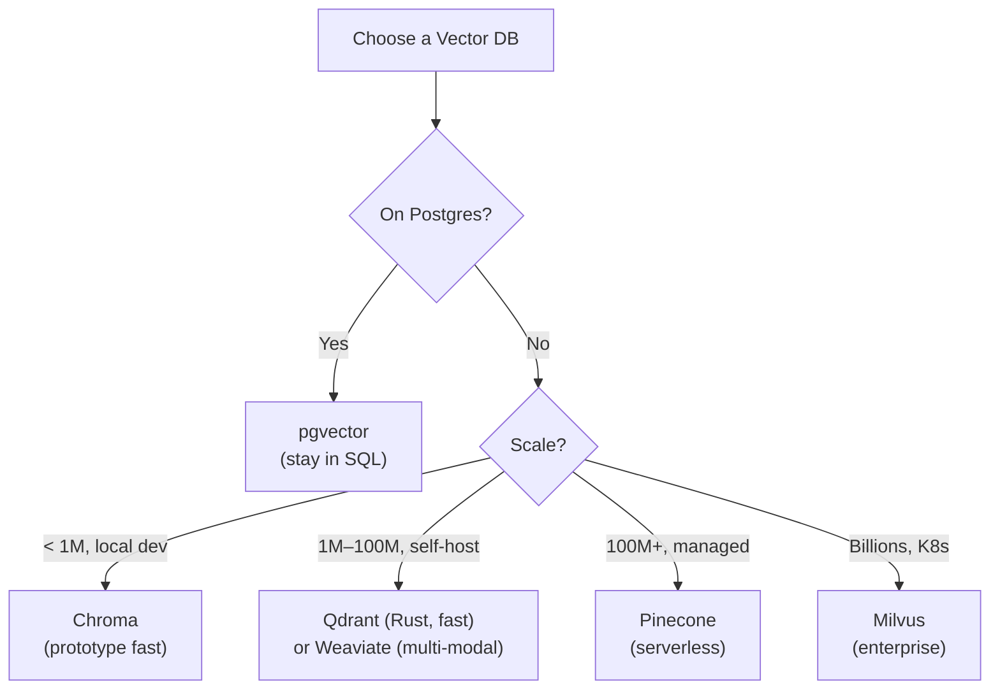
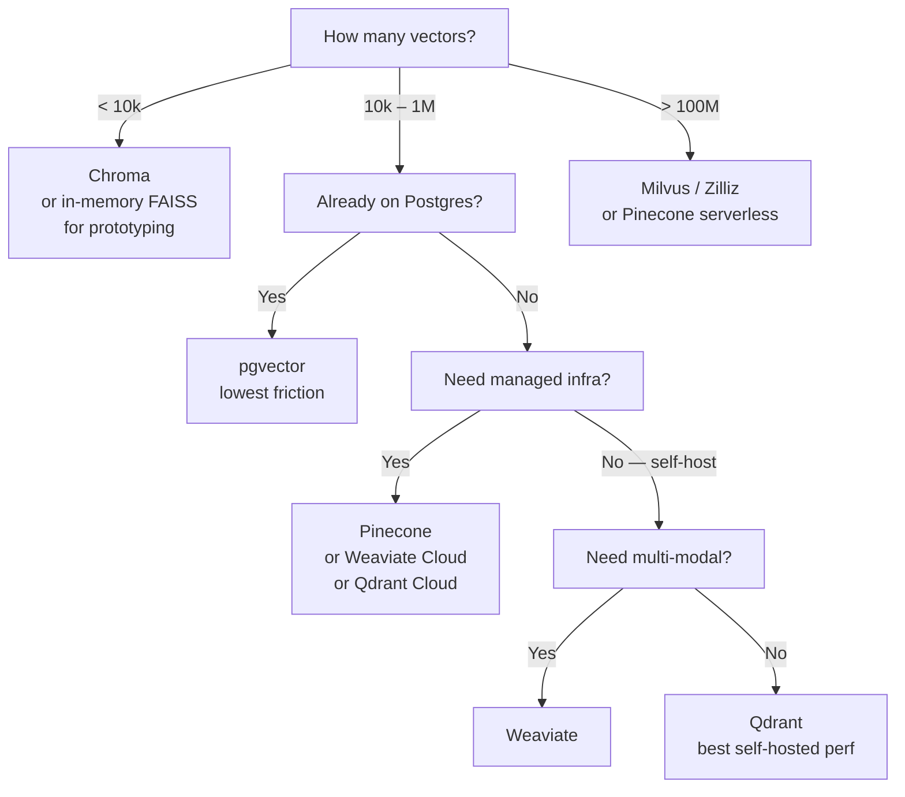

# Vector Database Comparison

**Level**: 🟡 Intermediate
**Reading Time**: 13 minutes

## 🗺️ Quick Overview



*No single best choice: pgvector wins if you're already on Postgres; Pinecone for zero-infra managed; Qdrant/Weaviate for self-hosted mid-scale; Milvus for billion-vector enterprise.*

> There is no single best vector database. The right choice depends on whether you're on Postgres already, whether you need managed infrastructure, how many vectors you'll store, and whether you need multi-modal search. This article makes the decision systematic.

## The Six Contenders

The vector database ecosystem has consolidated around six systems with meaningfully different trade-offs:

1. **Pinecone** — managed cloud, serverless, zero infra
2. **Weaviate** — open-source, multi-modal modules, GraphQL
3. **Qdrant** — Rust-based, fast, production self-hosted
4. **pgvector** — Postgres extension, use if you're already on Postgres
5. **Chroma** — local dev and prototyping
6. **Milvus** — large-scale (billions of vectors), Kubernetes-native

## Comparison Table

| | Pinecone | Weaviate | Qdrant | pgvector | Chroma | Milvus |
|--|---------|---------|--------|---------|-------|-------|
| **Hosting** | Managed only | Self-host or cloud | Self-host or cloud | Self-host (Postgres) | Local / self-host | Self-host (K8s) |
| **Index type** | Proprietary HNSW | HNSW | HNSW | HNSW or IVFFlat | HNSW or FLAT | IVF, HNSW, DiskANN |
| **Language** | Proprietary | Go | Rust | C (Postgres) | Python | Go + C++ |
| **Max scale tested** | 1B+ (serverless) | ~100M | ~100M | ~10M practical | ~1M local | 10B+ |
| **Hybrid search** | Yes (sparse+dense) | Yes (BM25 built-in) | Yes (sparse vectors) | Manual (FTS + pgvector) | No | Yes |
| **Multi-tenancy** | Namespaces | Multi-tenancy | Collections | Postgres schemas | Collections | Collections |
| **Filtering** | Yes (metadata) | Yes (GraphQL) | Yes (payload filter) | Yes (SQL WHERE) | Yes | Yes |
| **Multi-modal** | No | Yes (modules) | No | No | No | Yes |
| **Pricing** | Usage-based serverless | Free (self-host) | Free (self-host) | Free (Postgres cost) | Free | Free (infra cost) |
| **Managed option** | Yes (only) | Weaviate Cloud | Qdrant Cloud | Neon/Supabase | No | Zilliz Cloud |
| **API** | gRPC + REST | REST + GraphQL | gRPC + REST | SQL | REST + Python SDK | gRPC + REST |

## System Deep-Dives

### Pinecone

Pinecone is the "S3 of vector databases" — fully managed, serverless, no infrastructure to operate. You interact with it purely via API.

```python
from pinecone import Pinecone, ServerlessSpec

pc = Pinecone(api_key="YOUR_KEY")

# Create index
pc.create_index(
    name="my-docs",
    dimension=1536,
    metric="cosine",
    spec=ServerlessSpec(cloud="aws", region="us-east-1")
)
index = pc.Index("my-docs")

# Upsert vectors
index.upsert(vectors=[
    {"id": "doc1", "values": [0.1, 0.2, ...], "metadata": {"source": "wiki"}},
    {"id": "doc2", "values": [0.3, 0.4, ...], "metadata": {"source": "manual"}}
])

# Query
results = index.query(
    vector=[0.1, 0.2, ...],
    top_k=10,
    filter={"source": {"$eq": "wiki"}},
    include_metadata=True
)
```

**Strengths**: Zero ops burden, serverless pricing (pay per query+storage), automatic scaling, high availability SLA.
**Weaknesses**: Vendor lock-in, no self-hosting option, higher cost at very high query volume, no multi-modal support.
**Use when**: You want managed infra and don't want to operate a vector DB yourself. Best for startups moving fast.

### Weaviate

Weaviate is unique for its module system that allows plugging in embedding models, rerankers, and generative models directly into the database. It supports multi-modal search (text + images + audio) through modules.

```python
import weaviate

client = weaviate.Client("http://localhost:8080")

# Create collection with built-in BM25 + vector hybrid
client.schema.create_class({
    "class": "Document",
    "vectorizer": "text2vec-openai",  # auto-embed on ingest
    "moduleConfig": {
        "text2vec-openai": {"model": "text-embedding-3-small"}
    },
    "properties": [{"name": "content", "dataType": ["text"]}]
})

# Hybrid search with alpha parameter
results = client.query.get("Document", ["content"]).with_hybrid(
    query="machine learning optimization",
    alpha=0.5  # 0=BM25 only, 1=vector only, 0.5=balanced
).with_limit(10).do()
```

**Strengths**: Multi-modal, built-in hybrid search, module ecosystem, schema-based.
**Weaknesses**: Complex configuration, Java/Go internals feel heavyweight, schema migrations can be painful.
**Use when**: You need multi-modal search, or want the embedding model managed inside the database.

### Qdrant

Qdrant is written in Rust and is consistently the fastest self-hosted vector database in benchmarks. It uses HNSW natively and supports filtering on payload (metadata) with indexed payload fields.

```python
from qdrant_client import QdrantClient
from qdrant_client.models import Distance, VectorParams, PointStruct

client = QdrantClient("localhost", port=6333)

# Create collection
client.create_collection(
    collection_name="documents",
    vectors_config=VectorParams(size=1536, distance=Distance.COSINE)
)

# Insert with payload (metadata)
client.upsert(
    collection_name="documents",
    points=[
        PointStruct(id=1, vector=[0.1, 0.2, ...], payload={"year": 2024, "source": "wiki"}),
        PointStruct(id=2, vector=[0.3, 0.4, ...], payload={"year": 2023, "source": "docs"})
    ]
)

# Filtered search
from qdrant_client.models import Filter, FieldCondition, MatchValue

results = client.search(
    collection_name="documents",
    query_vector=[0.15, 0.25, ...],
    query_filter=Filter(
        must=[FieldCondition(key="year", match=MatchValue(value=2024))]
    ),
    limit=10
)
```

**Strengths**: Fastest self-hosted option, excellent payload filtering, Qdrant Cloud for managed, active development, sparse vector support for hybrid.
**Weaknesses**: Smaller ecosystem than Weaviate, no built-in embedding model integration (you embed externally).
**Use when**: You need high-performance self-hosted vector search, production-grade reliability without K8s complexity.

### pgvector

pgvector is a Postgres extension that adds a `vector` data type and HNSW/IVFFlat indexes. If you're already on Postgres, it's the lowest-friction path to vector search.

```sql
-- Enable extension
CREATE EXTENSION vector;

-- Create table with vector column
CREATE TABLE documents (
    id BIGSERIAL PRIMARY KEY,
    content TEXT,
    embedding VECTOR(1536),
    created_at TIMESTAMPTZ DEFAULT NOW()
);

-- Create HNSW index
CREATE INDEX ON documents USING hnsw (embedding vector_cosine_ops)
WITH (m = 16, ef_construction = 200);

-- Similarity search
SELECT id, content, 1 - (embedding <=> '[0.1, 0.2, ...]'::vector) AS similarity
FROM documents
WHERE created_at > NOW() - INTERVAL '30 days'  -- SQL filtering!
ORDER BY embedding <=> '[0.1, 0.2, ...]'::vector
LIMIT 10;
```

Operators: `<=>` (cosine distance), `<->` (L2/Euclidean), `<#>` (negative dot product).

**Strengths**: No new infrastructure, ACID transactions, SQL filtering (any Postgres condition!), joins with existing data, managed via Supabase/Neon/RDS.
**Weaknesses**: Performance degrades above ~1M vectors (HNSW in-memory requirement), no native hybrid BM25 (use Postgres full-text search + manual fusion), no multi-modal.
**Use when**: You already run Postgres and have under 1M vectors. This is the best "boring technology" choice.

### Chroma

Chroma is designed for rapid prototyping and local development. It's a Python-native, embedded database — no separate server needed.

```python
import chromadb

# Local, embedded (no server)
client = chromadb.Client()
collection = client.create_collection("my_docs")

# Add documents (Chroma can auto-embed if you configure an embedding function)
collection.add(
    ids=["doc1", "doc2"],
    documents=["The cat sat on the mat", "Machine learning optimization"],
    metadatas=[{"source": "example"}, {"source": "paper"}]
)

# Query
results = collection.query(
    query_texts=["feline resting"],
    n_results=5
)
```

**Strengths**: Trivially easy to start, no external dependencies, great for notebooks and quick experiments.
**Weaknesses**: Not designed for production scale, limited query performance, persistence is basic.
**Use when**: Prototyping, demos, local development, Jupyter notebooks. Never for production.

### Milvus

Milvus is built for web-scale: billions of vectors, multi-node distributed deployment on Kubernetes.

```python
from pymilvus import connections, Collection, CollectionSchema, FieldSchema, DataType

connections.connect("default", host="localhost", port="19530")

# Schema definition
fields = [
    FieldSchema(name="id", dtype=DataType.INT64, is_primary=True),
    FieldSchema(name="embedding", dtype=DataType.FLOAT_VECTOR, dim=1536)
]
schema = CollectionSchema(fields)
collection = Collection("documents", schema)

# Create HNSW index
collection.create_index("embedding", {
    "index_type": "HNSW",
    "metric_type": "COSINE",
    "params": {"M": 16, "efConstruction": 200}
})

# Search
collection.load()
results = collection.search(
    data=[[0.1, 0.2, ...]],
    anns_field="embedding",
    param={"metric_type": "COSINE", "params": {"ef": 200}},
    limit=10
)
```

**Strengths**: Scales to billions of vectors, multi-node distributed, handles high-throughput writes, supports IVF+PQ for memory efficiency.
**Weaknesses**: Requires Kubernetes (etcd, Pulsar/Kafka, MinIO — complex stack), operational overhead is high.
**Use when**: You have 100M+ vectors and need horizontal scalability. Use Zilliz Cloud for managed Milvus.

## Decision Flowchart



## Quick Decision Rules

| Situation | Recommendation |
|-----------|---------------|
| Already on Postgres + < 1M vectors | **pgvector** — no new infra, SQL filtering |
| Need managed, no ops | **Pinecone** — serverless, pay-per-use |
| Self-hosted, production, high performance | **Qdrant** — Rust speed, good support |
| Multi-modal (images + text + audio) | **Weaviate** — module ecosystem |
| Prototype / local dev | **Chroma** — embedded, trivial setup |
| 100M+ vectors, distributed | **Milvus** or **Zilliz Cloud** |
| Existing Supabase/Neon user | **pgvector** via Supabase/Neon — already included |

## Common Pitfalls

1. **Choosing Pinecone then regretting vendor lock-in**: Pinecone uses a proprietary format. Migrating away requires re-embedding and re-indexing everything. Consider Qdrant Cloud if portability matters.
2. **Using Chroma in production**: Chroma is explicitly not designed for production. Teams prototype with Chroma and then forget to migrate. Always plan your production vector DB from the start.
3. **Underestimating pgvector memory requirements**: HNSW in pgvector loads the entire index into shared_buffers. At 1M × 1536d vectors with M=16, the HNSW graph alone requires ~10 GB RAM. Provision accordingly or switch to IVFFlat for memory efficiency.
4. **Not enabling payload indexing in Qdrant**: Qdrant supports payload (metadata) filtering, but filtering is slow without a payload index. Run `create_payload_index` for any fields you filter on.
5. **Ignoring the embedding model dimension mismatch**: Switching embedding models requires rebuilding the entire index. Changing from text-embedding-3-small (1536d) to nomic-embed (768d) means re-embedding and re-indexing your entire corpus. Choose your embedding model early.

## Key Takeaways

- **pgvector**: use if already on Postgres + under 1M vectors — lowest friction, SQL filtering, ACID
- **Qdrant**: best self-hosted production option — Rust performance, active development, Qdrant Cloud for managed
- **Pinecone**: zero-ops managed cloud, best for teams that want to avoid infrastructure entirely
- **Weaviate**: choose specifically for multi-modal requirements or module ecosystem
- **Chroma**: prototype only, never production
- **Milvus**: 100M+ vector scale with distributed deployment — high operational cost
- The embedding model dimension is a long-term commitment — changing models means rebuilding the entire index
