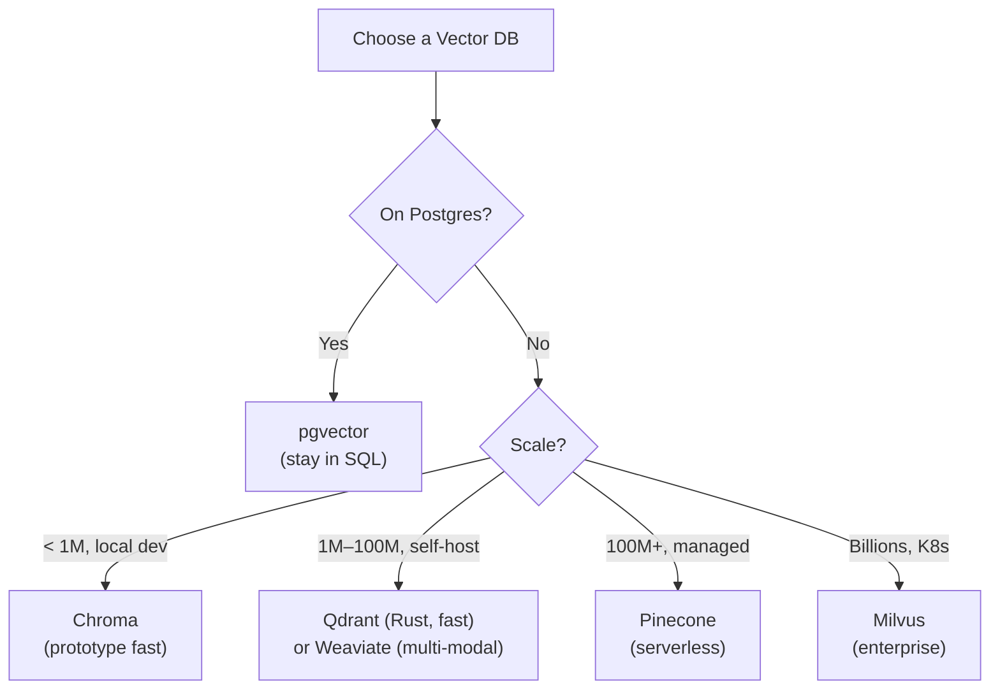
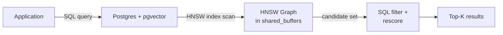
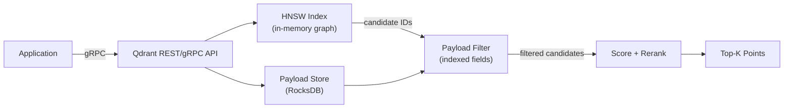
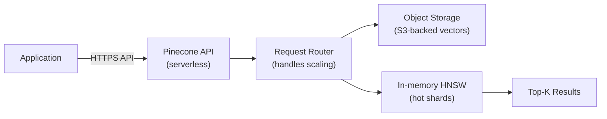
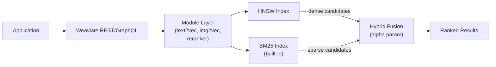
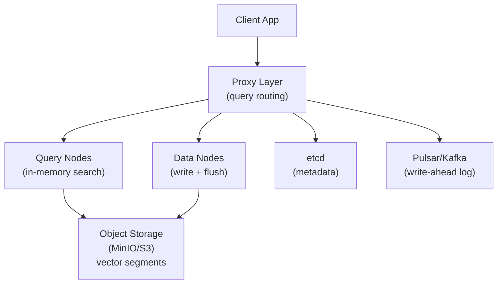
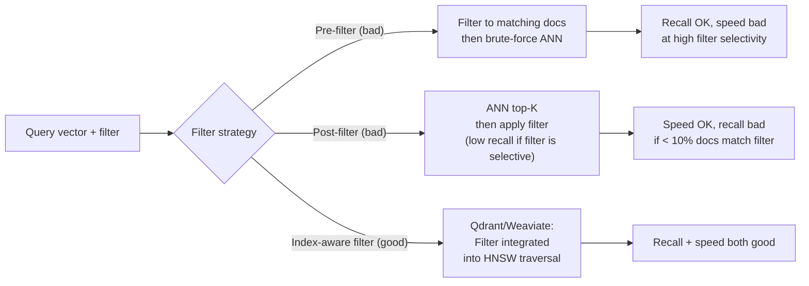
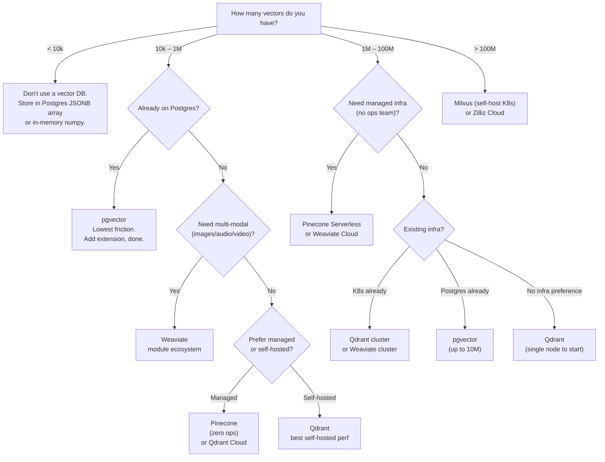

# Vector Database Comparison

**Level**: 🟡 Intermediate
**Reading Time**: 22 minutes

---

## Level 1 — Surface (2-minute read)

### What Is This?

Choosing the wrong vector database costs you 3-6 months of migration work. This article makes the decision systematic across the six dominant options: Pinecone, Weaviate, Qdrant, pgvector, Chroma, and Milvus.

**When you need this decision**: You have >10k embedding vectors and need to query by semantic similarity — for RAG pipelines, semantic search, recommendation systems, or image search.

### Core Decision in 5 Bullets

- **pgvector** — stay on Postgres if you're already there; free, SQL filtering, ACID, works to ~10M vectors
- **Qdrant** — fastest self-hosted option (Rust); production-grade filtering; Qdrant Cloud for managed
- **Pinecone** — zero-ops managed cloud; $70/month per 1M vectors; vendor lock-in risk
- **Weaviate** — choose specifically for multi-modal or when you want embedding models embedded in the DB
- **Chroma** — prototype only; **Milvus** — 100M+ vectors on Kubernetes

### Quick Routing Diagram



### Use This When / Don't Use This When

| Use this when | Don't use this when |
|---------------|---------------------|
| You already run Postgres (`pgvector`) | You want real-time analytics on vectors (use ClickHouse) |
| You need zero-ops managed infra (`Pinecone`) | Scale is < 1k vectors (just use in-memory numpy) |
| You need self-hosted high performance (`Qdrant`) | You need multi-master write replication (limited across all options) |
| You need multi-modal search (`Weaviate`) | You want Chroma in production (don't) |

---

## Level 2 — Deep Dive

### The Problem: Wrong Choice = Painful Migration

You're building a RAG chatbot. Week 1: Chroma works great locally. Week 8: 2M documents, P99 query latency is 4 seconds, no hybrid search. Migration requires re-embedding 2M documents ($400 in OpenAI API calls), rewriting all query code, and 2 weeks of downtime risk.

The failure isn't technical — it's not thinking through the 6-month trajectory before choosing.

**Traffic thresholds that break each system:**

| System | Works fine at | Starts degrading at | Hard limit |
|--------|---------------|---------------------|------------|
| Chroma | < 100k vectors | 500k | 1M |
| pgvector (IVFFlat) | < 1M vectors | 5M | 10M practical |
| pgvector (HNSW) | < 1M vectors | 3M (RAM-bound) | ~5M (memory) |
| Qdrant (single node) | < 50M | 100M | ~200M RAM |
| Weaviate (single node) | < 50M | 100M | ~150M |
| Pinecone serverless | unlimited (auto-scales) | N/A | 1B+ tested |
| Milvus (distributed) | < 100M | 1B | 10B+ (with hardware) |

---

### Approach A: pgvector — Postgres Extension

**Best for**: Teams already on Postgres with < 10M vectors who want zero new infrastructure.

**How it works**: Adds a `vector` data type to Postgres. Supports HNSW and IVFFlat index types. Queries use standard SQL with new distance operators.



**Setup and usage:**

```sql
-- Enable extension (one-time)
CREATE EXTENSION IF NOT EXISTS vector;

-- Table with vector column
CREATE TABLE documents (
    id          BIGSERIAL PRIMARY KEY,
    content     TEXT NOT NULL,
    embedding   VECTOR(1536),         -- OpenAI text-embedding-3-small
    source      TEXT,
    created_at  TIMESTAMPTZ DEFAULT NOW(),
    tenant_id   UUID
);

-- HNSW index (better recall, higher memory)
CREATE INDEX idx_docs_embedding_hnsw
    ON documents USING hnsw (embedding vector_cosine_ops)
    WITH (m = 16, ef_construction = 200);

-- IVFFlat index (lower memory, tunable recall)
-- Run ANALYZE first to get row count, then set lists = sqrt(rows)
CREATE INDEX idx_docs_embedding_ivf
    ON documents USING ivfflat (embedding vector_cosine_ops)
    WITH (lists = 1000);   -- for ~1M vectors

-- Similarity search with SQL filter (the killer feature)
SELECT
    id,
    content,
    source,
    1 - (embedding <=> $1::vector) AS cosine_similarity
FROM documents
WHERE
    tenant_id = $2             -- multi-tenant filter (SQL!)
    AND created_at > NOW() - INTERVAL '90 days'
    AND source != 'archived'
ORDER BY embedding <=> $1::vector
LIMIT 20;

-- Hybrid search: combine full-text + vector manually
WITH vector_results AS (
    SELECT id, 1 - (embedding <=> $1::vector) AS vscore
    FROM documents
    ORDER BY embedding <=> $1::vector
    LIMIT 100
),
fts_results AS (
    SELECT id, ts_rank(to_tsvector('english', content), plainto_tsquery($2)) AS tscore
    FROM documents
    WHERE to_tsvector('english', content) @@ plainto_tsquery($2)
    LIMIT 100
)
SELECT d.id, d.content,
    COALESCE(v.vscore, 0) * 0.7 + COALESCE(f.tscore, 0) * 0.3 AS final_score
FROM documents d
LEFT JOIN vector_results v ON d.id = v.id
LEFT JOIN fts_results f ON d.id = f.id
WHERE v.id IS NOT NULL OR f.id IS NOT NULL
ORDER BY final_score DESC
LIMIT 10;
```

Distance operators:
- `<=>` — cosine distance (most common for text)
- `<->` — L2 / Euclidean distance (images)
- `<#>` — negative dot product (normalized = same as cosine)

**Production numbers (pgvector, AWS RDS r6g.2xlarge — 64GB RAM):**

| Vectors | Dims | Index | RAM used | P50 query | P99 query |
|---------|------|-------|----------|-----------|-----------|
| 100k | 1536 | HNSW | 1.2 GB | 3 ms | 8 ms |
| 1M | 1536 | HNSW | 10 GB | 12 ms | 45 ms |
| 1M | 1536 | IVFFlat | 2.5 GB | 18 ms | 60 ms |
| 5M | 1536 | HNSW | 48 GB | 35 ms | 120 ms |
| 10M | 768 | HNSW | 25 GB | 55 ms | 200 ms |

**Shopify uses pgvector** for their "search-as-you-type" semantic product search. At Shopify's scale (~100M products total, but partitioned per merchant), pgvector with tenant partitioning keeps each partition to manageable size.

**Trade-offs:**

| | Pro | Con |
|-|-----|-----|
| Infra | Zero new infra, use existing Postgres | HNSW index lives in shared_buffers — memory-bound |
| Filtering | Full SQL WHERE clause — any condition | Post-filter reduces effective recall |
| Transactions | ACID — vectors + metadata in same transaction | No async background indexing |
| Managed | Supabase, Neon, RDS all support it | Postgres version ≥ 15 recommended |
| Cost | Pay only for Postgres infra | Not free at large scale (big Postgres = expensive) |

---

### Approach B: Qdrant — Rust-native High-Performance Self-Hosted

**Best for**: Production self-hosted workloads at 1M–100M vectors where performance and reliability matter.

**How it works**: Pure Rust vector database with HNSW as its primary index. Vectors are stored with arbitrary "payload" (JSON metadata) that can be indexed for fast filtering. Uses GRPC+REST APIs.



```python
from qdrant_client import QdrantClient
from qdrant_client.models import (
    Distance, VectorParams, PointStruct,
    Filter, FieldCondition, MatchValue, Range,
    PayloadSchemaType, SparseVectorParams,
    SparseIndexParams
)

client = QdrantClient("localhost", port=6333)

# Create collection with dense + sparse vectors (hybrid)
client.create_collection(
    collection_name="documents",
    vectors_config={
        "dense": VectorParams(size=1536, distance=Distance.COSINE),
    },
    sparse_vectors_config={
        "sparse": SparseVectorParams(
            index=SparseIndexParams(on_disk=False)
        )
    }
)

# CRITICAL: index payload fields before inserting
client.create_payload_index(
    collection_name="documents",
    field_name="year",
    field_schema=PayloadSchemaType.INTEGER
)
client.create_payload_index(
    collection_name="documents",
    field_name="source",
    field_schema=PayloadSchemaType.KEYWORD
)
client.create_payload_index(
    collection_name="documents",
    field_name="tenant_id",
    field_schema=PayloadSchemaType.KEYWORD
)

# Upsert with payload
client.upsert(
    collection_name="documents",
    points=[
        PointStruct(
            id=1,
            vector={"dense": [0.1, 0.2, ...]},
            payload={"year": 2024, "source": "wiki", "tenant_id": "acme"}
        )
    ]
)

# Filtered ANN search
results = client.search(
    collection_name="documents",
    query_vector=("dense", [0.15, 0.25, ...]),
    query_filter=Filter(
        must=[
            FieldCondition(key="tenant_id", match=MatchValue(value="acme")),
            FieldCondition(key="year", range=Range(gte=2023))
        ],
        must_not=[
            FieldCondition(key="source", match=MatchValue(value="archived"))
        ]
    ),
    limit=10,
    with_payload=True
)

# Hybrid search (dense + sparse, RRF fusion)
from qdrant_client.models import SparseVector, SearchRequest, FusionQuery, Fusion

results = client.query_points(
    collection_name="documents",
    prefetch=[
        {"query": [0.1, 0.2, ...], "using": "dense", "limit": 50},
        {"query": SparseVector(indices=[1, 5, 42], values=[0.8, 0.3, 0.6]),
         "using": "sparse", "limit": 50}
    ],
    query=FusionQuery(fusion=Fusion.RRF),  # Reciprocal Rank Fusion
    limit=10
)
```

**Production numbers (Qdrant, single node, r6g.2xlarge 64GB):**

| Vectors | Dims | P50 query | P99 query | Throughput | RAM |
|---------|------|-----------|-----------|------------|-----|
| 1M | 1536 | 2 ms | 8 ms | 3,000 QPS | 12 GB |
| 10M | 1536 | 5 ms | 18 ms | 1,500 QPS | 85 GB |
| 50M | 768 | 8 ms | 25 ms | 800 QPS | 60 GB |

With on-disk storage (slower but cheaper): 1M vectors, 1536d → 500MB RAM, 25ms P99.

**Trade-offs:**

| | Pro | Con |
|-|-----|-----|
| Speed | Fastest self-hosted in benchmarks | No native SQL — app-side embedding required |
| Filtering | Payload indexes — fast pre/post/in-flight filter | Payload index must be created before data load |
| Hybrid | Native sparse+dense with RRF fusion | Requires BM25 index built externally (or SPLADE) |
| Ops | Single binary, Docker-friendly, no K8s | Cluster mode adds etcd complexity |
| Cloud | Qdrant Cloud managed option | Less mature managed option than Pinecone |

---

### Approach C: Pinecone — Fully Managed Serverless

**Best for**: Teams that want zero infrastructure operations and are willing to pay a premium.



```python
from pinecone import Pinecone, ServerlessSpec

pc = Pinecone(api_key="YOUR_API_KEY")

# Create serverless index
pc.create_index(
    name="rag-docs",
    dimension=1536,
    metric="cosine",
    spec=ServerlessSpec(cloud="aws", region="us-east-1")
)

index = pc.Index("rag-docs")

# Upsert — supports up to 1000 vectors per upsert call
index.upsert(
    vectors=[
        {
            "id": "doc-001",
            "values": [0.1, 0.2, ...],          # 1536 floats
            "metadata": {
                "source": "wiki",
                "year": 2024,
                "tenant": "acme"
            }
        }
    ],
    namespace="tenant-acme"                      # namespace = logical partition
)

# Query with metadata filter
results = index.query(
    vector=[0.1, 0.2, ...],
    top_k=20,
    filter={
        "year": {"$gte": 2023},
        "source": {"$ne": "archived"}
    },
    namespace="tenant-acme",
    include_metadata=True,
    include_values=False                          # omit raw vectors to save bandwidth
)

# Hybrid search (sparse + dense in one call — Pinecone native)
results = index.query(
    vector=[0.1, 0.2, ...],                      # dense
    sparse_vector={
        "indices": [1, 5, 42, 900],
        "values": [0.8, 0.3, 0.6, 0.2]
    },
    top_k=10,
    include_metadata=True
)

# Batch fetch by ID
fetched = index.fetch(ids=["doc-001", "doc-002"], namespace="tenant-acme")
```

**Pricing (2024, serverless):**

| Component | Price |
|-----------|-------|
| Storage | $0.033 per GB / month |
| Reads | $4.00 per 1M read units |
| Writes | $2.00 per 1M write units |
| **1M vectors, 1536d, 90-day retention, 10 QPS** | **~$70/month** |
| 10M vectors, 100 QPS | ~$400/month |
| 100M vectors, 1000 QPS | ~$3,500/month |

**Trade-offs:**

| | Pro | Con |
|-|-----|-----|
| Ops | Zero infra — API only | Hard vendor lock-in (proprietary format) |
| Scale | Auto-scales, 1B+ vectors tested | No self-host option — must use their cloud |
| Cost | Cheap at low usage | Expensive at high query volume vs self-hosted |
| Features | Native hybrid, namespaces, metadata filtering | No multi-modal, no custom modules |
| Migration | Easy to start | Painful to leave — must re-embed + re-index |

**OpenAI's ChatGPT retrieval plugin used Pinecone** in early 2023 for their initial RAG implementation (later moved to internal systems).

---

### Approach D: Weaviate — Multi-Modal Module System

**Best for**: Teams needing multi-modal search (text + images + audio) or wanting embedding models managed inside the DB.



```python
import weaviate
from weaviate.classes.config import Configure, Property, DataType

client = weaviate.connect_to_local()

# Create collection with built-in embedding model
docs = client.collections.create(
    name="Document",
    vectorizer_config=Configure.Vectorizer.text2vec_openai(
        model="text-embedding-3-small",
        dimensions=1536
    ),
    generative_config=Configure.Generative.openai(model="gpt-4o"),
    reranker_config=Configure.Reranker.cohere(),
    properties=[
        Property(name="content", data_type=DataType.TEXT),
        Property(name="source", data_type=DataType.TEXT),
        Property(name="year", data_type=DataType.INT),
    ]
)

# Insert — Weaviate auto-embeds on ingest
docs.data.insert({
    "content": "Machine learning is a subset of artificial intelligence...",
    "source": "wiki",
    "year": 2024
})

# Hybrid search with GraphQL-style query
response = docs.query.hybrid(
    query="neural network optimization techniques",
    alpha=0.5,         # 0.0 = BM25 only, 1.0 = vector only
    limit=10,
    filters=weaviate.classes.query.Filter.by_property("year").greater_or_equal(2023)
)

# Generative (RAG) query built-in
response = docs.generate.hybrid(
    query="explain gradient descent",
    grouped_task="Summarize the key points from these documents",
    alpha=0.7,
    limit=5
)
print(response.generated)  # LLM-generated summary over retrieved docs

# Multi-modal: search by image
from weaviate.classes.query import NearMedia, MediaType

response = client.collections.get("Product").query.near_media(
    media=open("shoe.jpg", "rb").read(),
    media_type=MediaType.IMAGE,
    limit=10
)
```

**Notion uses Weaviate** for their AI-powered semantic search across user notes and pages. Weaviate's module system lets Notion plug in their embedding model without managing a separate embedding service.

**Trade-offs:**

| | Pro | Con |
|-|-----|-----|
| Modules | Embedding + reranker + generative in one system | Complex configuration — many knobs |
| Multi-modal | Native image + text + audio search | Schema migrations are painful (no ALTER TABLE equivalent) |
| Hybrid | BM25 built-in, alpha parameter | `alpha` is a blunt instrument vs RRF |
| GraphQL | Expressive query language | GraphQL learning curve for simple use cases |
| Managed | Weaviate Cloud available | Managed tier is more expensive than Qdrant Cloud |

---

### Approach E: Milvus — Billion-Scale Distributed

**Best for**: 100M+ vectors requiring horizontal scalability across multiple nodes.



```python
from pymilvus import (
    connections, Collection, CollectionSchema,
    FieldSchema, DataType, utility
)

connections.connect("default", host="milvus-proxy.svc", port="19530")

# Schema
fields = [
    FieldSchema(name="id",        dtype=DataType.INT64, is_primary=True, auto_id=False),
    FieldSchema(name="embedding", dtype=DataType.FLOAT_VECTOR, dim=1536),
    FieldSchema(name="source",    dtype=DataType.VARCHAR, max_length=256),
    FieldSchema(name="year",      dtype=DataType.INT32),
]
schema = CollectionSchema(fields, description="Document collection")
collection = Collection("documents", schema, consistency_level="Bounded")

# Create HNSW index
collection.create_index(
    field_name="embedding",
    index_params={
        "index_type": "HNSW",
        "metric_type": "COSINE",
        "params": {"M": 16, "efConstruction": 200}
    }
)

# Create scalar index for filtering
collection.create_index(field_name="year",   index_name="idx_year")
collection.create_index(field_name="source", index_name="idx_source")

collection.load()

# Insert
collection.insert([
    [1, 2, 3],               # ids
    [[0.1, 0.2, ...], ...],  # embeddings
    ["wiki", "docs", "blog"], # source
    [2024, 2023, 2024]        # year
])

# Search with filter expression
results = collection.search(
    data=[[0.15, 0.25, ...]],
    anns_field="embedding",
    param={"metric_type": "COSINE", "params": {"ef": 200}},
    limit=10,
    expr='year >= 2023 && source != "archived"',
    output_fields=["source", "year"]
)

# Partition for multi-tenancy
collection.create_partition("tenant_acme")
collection.insert(data, partition_name="tenant_acme")
```

**Production numbers (Milvus 3-node cluster, each 32-core / 128GB):**

| Vectors | Dims | Index | P50 | P99 | Write throughput |
|---------|------|-------|-----|-----|-----------------|
| 100M | 768 | HNSW | 8 ms | 30 ms | 50k vectors/sec |
| 500M | 384 | IVF_SQ8 | 15 ms | 55 ms | 80k vectors/sec |
| 1B | 256 | DiskANN | 25 ms | 90 ms | 30k vectors/sec |

**Trade-offs:**

| | Pro | Con |
|-|-----|-----|
| Scale | 10B+ vectors, horizontal scale | Requires K8s + etcd + Pulsar/Kafka + MinIO |
| Indexes | HNSW, IVF, DiskANN, GPU index | Complex index selection |
| Managed | Zilliz Cloud (managed Milvus) | Zilliz pricing is high |
| Write throughput | High — async write via message queue | Bounded consistency by default |

---

### Approach F: Chroma — Prototype-Only

**Best for**: Local development, Jupyter notebooks, PoC demos. **Never production.**

```python
import chromadb
from chromadb.utils import embedding_functions

# Embedded mode — no server
client = chromadb.Client()

# Or persistent local
client = chromadb.PersistentClient(path="/tmp/chroma_data")

# With OpenAI embeddings built-in
openai_ef = embedding_functions.OpenAIEmbeddingFunction(
    api_key="YOUR_KEY",
    model_name="text-embedding-3-small"
)
collection = client.create_collection(
    name="my_docs",
    embedding_function=openai_ef
)

# Add documents — Chroma auto-embeds
collection.add(
    ids=["doc1", "doc2", "doc3"],
    documents=[
        "The cat sat on the mat",
        "Machine learning optimization techniques",
        "Distributed systems and CAP theorem"
    ],
    metadatas=[
        {"source": "story", "year": 2024},
        {"source": "paper", "year": 2023},
        {"source": "textbook", "year": 2022}
    ]
)

# Query
results = collection.query(
    query_texts=["feline resting on surface"],
    n_results=3,
    where={"year": {"$gte": 2023}}
)
print(results["documents"])
```

Hard limits: single-file SQLite backend, no true ANN index by default (brute force scan), no horizontal scaling, no production reliability guarantees.

---

## Full Feature Comparison Matrix

| Feature | Pinecone | Weaviate | Qdrant | pgvector | Milvus | Chroma |
|---------|---------|---------|--------|---------|--------|--------|
| **Hosting** | Managed only | Self/Cloud | Self/Cloud | Self (Postgres) | Self/K8s + Zilliz | Local/Self |
| **Index type** | Prop. HNSW | HNSW | HNSW | HNSW / IVFFlat | HNSW/IVF/DiskANN | HNSW / FLAT |
| **Language** | Proprietary | Go | Rust | C (Postgres ext.) | Go + C++ | Python |
| **Max tested scale** | 1B+ | ~100M | ~100M | ~10M practical | 10B+ | ~1M |
| **Hybrid search** | Yes (native) | Yes (BM25 built-in) | Yes (sparse vectors) | Manual (FTS fusion) | Yes | No |
| **Multi-modal** | No | Yes (modules) | No | No | Yes (limited) | No |
| **Filtering** | Metadata filter | GraphQL filter | Payload index | Full SQL WHERE | Expression filter | Basic metadata |
| **Multi-tenancy** | Namespaces | Multi-tenancy | Collections | Postgres schemas | Partitions | Collections |
| **Transactions** | No | No | No | Yes (ACID) | Bounded consistency | No |
| **Managed tier** | Yes (only option) | Weaviate Cloud | Qdrant Cloud | Supabase/Neon/RDS | Zilliz Cloud | No |
| **API** | gRPC + REST | REST + GraphQL | gRPC + REST | SQL | gRPC + REST | REST + Python |
| **Embedding built-in** | No | Yes (modules) | No | No | No | Yes (configurable) |
| **Open source** | No | Yes (Apache 2) | Yes (Apache 2) | Yes (PostgreSQL) | Yes (Apache 2) | Yes (Apache 2) |
| **Cost at 1M vectors** | ~$70/mo | $0 (self) | $0 (self) | $0 (infra cost) | $0 (infra cost) | $0 |
| **Production readiness** | High | High | High | High | High | Low |

---

## Filtering Deep Dive

Filtering is where the choices diverge most significantly. A naive implementation of "filter then search" or "search then filter" produces very different recall results.



**pgvector behavior**: Post-filter by default when using HNSW. If your filter is very selective (e.g., `tenant_id = 'X'` returns 0.1% of rows), the index returns K candidates, only 1-5 pass the filter. Workaround: partition tables by tenant so each partition's index is smaller.

**Qdrant behavior**: Payload-indexed fields are integrated into HNSW traversal. At high selectivity (< 5% matching), Qdrant switches to brute force on the filtered subset automatically.

**Weaviate behavior**: Inverted index for keyword filters, integrated with HNSW for vector filtering. Handles high-selectivity filters well.

---

## Failure Modes Specific to Vector Databases

### Failure 1: Index Staleness

**Scenario**: You ingest 10k new documents per hour. The HNSW index is built during off-peak hours. Queries during peak hours search a stale index missing the last 4 hours of documents.

**Symptom**: Users searching for "recent news about X" get results from 4 hours ago. New documents never appear in search results.

**Root cause**: Many vector DBs (especially self-hosted Milvus) have a delay between ingest and index availability. Milvus uses `consistency_level="Strong"` vs `"Bounded"` (default) vs `"Eventual"`.

**Fix**:
```python
# Milvus: force strong consistency for time-sensitive queries
results = collection.search(
    data=[[...]], anns_field="embedding",
    consistency_level="Strong",  # wait for all writes to be reflected
    ...
)

# pgvector: no async index — inserts are immediately queryable
# (HNSW insert locks the index briefly but new rows are visible instantly)

# Qdrant: check collection status before querying
info = client.get_collection("documents")
assert info.status.value == "green", "Collection not ready"
```

**Operational impact**: Up to 30% of queries return irrelevant results during high-ingest periods with eventual-consistency vector DBs. Fix: use `Strong` consistency or design the ingestion pipeline to batch and wait for index update confirmation.

---

### Failure 2: Embedding Drift

**Scenario**: Month 1 — index built with `text-embedding-ada-002` (1536d). Month 4 — you migrate to `text-embedding-3-small` (1536d, but different model weights). Existing index is now incompatible with new query vectors.

**Symptom**: Recall drops from 85% to 30% overnight. Search results become nonsensical. Cosine similarity scores all cluster near 0.3.

**Root cause**: Embedding models map text into different geometric spaces. The "king - man + woman = queen" arithmetic only works within the same model. Mixing models produces random results.

```python
# Detecting embedding drift
# Store model version in metadata, reject mismatched queries

# Qdrant example
client.upsert(
    collection_name="documents",
    points=[PointStruct(
        id=1,
        vector=[...],
        payload={
            "content": "...",
            "embedding_model": "text-embedding-3-small",
            "embedding_model_version": "2024-01"
        }
    )]
)

# Query with version check
def safe_query(client, collection, query_vector, model_version):
    results = client.search(
        collection_name=collection,
        query_vector=query_vector,
        query_filter=Filter(
            must=[FieldCondition(
                key="embedding_model_version",
                match=MatchValue(value=model_version)
            )]
        ),
        limit=10
    )
    return results
```

**Migration strategy**: Blue-green re-indexing.
1. Create new collection with new model dimensions
2. Re-embed all documents with new model (background job)
3. Dual-write to both old and new collection during transition
4. Switch read traffic to new collection
5. Decommission old collection

Cost: 1M documents × 1536 tokens avg × $0.00002/1k tokens = **$30 to re-embed at OpenAI pricing**.

---

### Failure 3: Filter Cardinality Reducing Recall

**Scenario**: RAG system for a SaaS product. Each tenant has their own namespace. Tenant "acme" has 5,000 documents out of 2M total (0.25%). User queries with `tenant_id = "acme"` filter.

**Symptom**: Search results for small tenants are terrible. They get 3-4 results with low similarity scores when they should get 10.

**Root cause**: HNSW traversal explores the global graph and returns the K-nearest from all 2M vectors. The post-filter then discards 99.75% of results. If K=100 and 0.25% match, only ~0.25 results pass on average.

```
Effective results = K * filter_selectivity
                  = 100 * 0.0025
                  = 0.25 results  ← catastrophically low
```

**Fix options**:

| Fix | How | Trade-off |
|-----|-----|-----------|
| Increase K (over-fetch) | `limit=10, ef=10000` | 100x slower queries |
| Partition by tenant | Separate collection per tenant | More collections to manage (Qdrant handles 1000s of collections well) |
| Use pgvector with table partitioning | `CREATE TABLE documents_acme PARTITION OF documents FOR VALUES IN ('acme')` | More operational overhead |
| Qdrant collections per tenant | One collection per tenant | Better isolation, Qdrant designed for this |

**Qdrant recommended pattern** for multi-tenant:
```python
# Create tenant-specific collections
for tenant_id in tenant_ids:
    client.create_collection(
        collection_name=f"docs_{tenant_id}",
        vectors_config=VectorParams(size=1536, distance=Distance.COSINE)
    )

# Query tenant-specific collection
results = client.search(
    collection_name=f"docs_{tenant_id}",  # no cross-tenant data
    query_vector=query_vec,
    limit=10
)
```

---

### Failure 4: Memory Exhaustion on pgvector HNSW

**Symptom**: Postgres OOM-kills (or swap thrashing) during index build or queries. Server becomes unresponsive.

**Root cause**: pgvector HNSW index must fit in `shared_buffers` for fast querying. Formula:

```
HNSW index RAM = vectors × dims × 4 bytes × 1.3 (M=16 graph overhead factor)
1M × 1536 × 4 × 1.3 = 8 GB index RAM
```

Plus the raw vector storage (1M × 1536 × 4 = 6 GB). Plus Postgres overhead. Total: **~18 GB for 1M 1536d vectors**.

**Fix**:
```sql
-- Option 1: Switch to IVFFlat (much less RAM, slightly lower recall)
CREATE INDEX ON documents USING ivfflat (embedding vector_cosine_ops)
WITH (lists = 1000);
-- RAM: only centroids (~1000 × 1536 × 4 = 6 MB) + probed lists

-- Tune query recall vs speed
SET ivfflat.probes = 50;  -- check 50/1000 lists (default 1)
-- More probes = better recall, slower query

-- Option 2: quantize vectors at insert time
-- Store INT8 instead of FLOAT32 (4x compression)
-- Requires pgvector >= 0.7 with half-precision support

-- Option 3: Use Postgres table partitioning
CREATE TABLE documents (
    id BIGSERIAL,
    tenant_id TEXT,
    embedding VECTOR(1536)
) PARTITION BY HASH (tenant_id);

CREATE TABLE documents_p0 PARTITION OF documents FOR VALUES WITH (MODULUS 4, REMAINDER 0);
CREATE TABLE documents_p1 PARTITION OF documents FOR VALUES WITH (MODULUS 4, REMAINDER 1);
-- Each partition has its own smaller HNSW index
```

---

## Decision Flowchart (Full)



---

## Quick Decision Rules (Full)

| Situation | Recommendation | Reason |
|-----------|---------------|--------|
| Already on Postgres + < 10M vectors | **pgvector** | Zero new infra, SQL filtering, ACID |
| Need zero-ops managed, don't care about vendor lock-in | **Pinecone** | Serverless auto-scaling |
| Self-hosted, production, high throughput | **Qdrant** | Rust performance, active community |
| Multi-modal: images + text + audio | **Weaviate** | Module ecosystem, multi-modal native |
| Prototype / notebook / demo | **Chroma** | Trivial setup, embedded, no server |
| 100M+ vectors, distributed | **Milvus** or **Zilliz Cloud** | Only option at this scale |
| Existing Supabase/Neon user | **pgvector** | Already built-in, free to enable |
| Multi-tenant SaaS, many small tenants | **Qdrant** (one collection/tenant) | Collection isolation avoids cardinality issues |
| Need hybrid BM25 + vector built-in | **Weaviate** or **Qdrant** | Both support sparse+dense natively |
| Already on MongoDB Atlas | **MongoDB Atlas Vector Search** | Check before adopting a separate DB |
| Already on Redis | **Redis Stack (VSS)** | Check before adopting a separate DB |

---

## Real Company Examples

| Company | Database | Use Case | Scale | Source |
|---------|---------|---------|-------|--------|
| **Notion** | Weaviate | Semantic search across user notes | ~4B notes | Weaviate case study |
| **OpenAI** | Pinecone (early ChatGPT plugins) | Retrieval plugin vector store | N/A | Public disclosure 2023 |
| **Shopify** | pgvector | Semantic search-as-you-type for products | 100M+ products (sharded by merchant) | Shopify Engineering Blog |
| **Brex** | pgvector | RAG for financial document retrieval | ~10M documents | Engineering blog |
| **Quora** | Milvus (Zilliz) | Semantic duplicate question detection | 1B+ questions | Zilliz case study |
| **Discord** | Custom (ScaNN-based) | Message semantic search | 4B+ messages | Discord Engineering Blog |
| **Lyft** | Weaviate | Driver + rider matching features | ~100M vectors | Weaviate case study |

---

## Common Mistakes

### Mistake 1: Choosing Pinecone, Then Regretting Vendor Lock-In

Pinecone uses a proprietary storage format. Migrating away requires:
- Re-embedding all documents (cost + time)
- Re-indexing in the new system
- Updating all API calls (Pinecone SDK → Qdrant SDK)
- Parallel run period (dual writes)

**Root cause**: Teams choose Pinecone for speed-to-market, don't plan for the exit.

**Fix**: If portability matters, use Qdrant Cloud (open-source compatible API — can move to self-hosted Qdrant with zero code changes). Or abstract behind a vector store interface:

```python
class VectorStore(Protocol):
    def upsert(self, id: str, vector: list[float], metadata: dict) -> None: ...
    def search(self, vector: list[float], filter: dict, k: int) -> list[dict]: ...

class PineconeStore(VectorStore): ...
class QdrantStore(VectorStore): ...
```

---

### Mistake 2: Using Chroma in Production

Chroma's SQLite-based persistence has no WAL replication, no clustering, and no production SLA. Teams prototype with Chroma, then forget to migrate.

**Symptoms in production**: Corrupted database on unexpected shutdown, no horizontal scaling, 4-second query times at 500k documents.

**Fix**: Plan your production vector DB from day 1. Use Chroma only in `chromadb.Client()` (ephemeral) mode for tests.

---

### Mistake 3: Not Enabling Payload Indexes in Qdrant

```python
# BAD: filtering without payload index
results = client.search(
    collection_name="documents",
    query_vector=...,
    query_filter=Filter(must=[
        FieldCondition(key="tenant_id", match=MatchValue(value="acme"))
    ]),
    limit=10
)
# Performance: full scan of all payload fields — O(n) per query

# GOOD: create index first (one-time setup)
client.create_payload_index(
    collection_name="documents",
    field_name="tenant_id",
    field_schema=PayloadSchemaType.KEYWORD
)
# Now filtering uses B-tree index — O(log n)
```

**Root cause**: Qdrant's payload filtering is optional — it doesn't fail, it just scans. Teams miss the index creation step from documentation.

**Fix**: Add `create_payload_index` calls to your collection setup script for every field you filter on.

---

### Mistake 4: Changing Embedding Models Without Re-Indexing

See Failure Mode 2 above. The common variant: teams use `ada-002` (1536d), switch to `nomic-embed-text` (768d), and expect they can just shrink the dimension. The dimension mismatch is a hard error, but the subtler bug is same-dimension different-model: `text-embedding-3-small` and `ada-002` are both 1536d but produce geometrically incompatible spaces.

**Fix**: Store `embedding_model` in metadata. Validate at query time. Re-index after model changes.

---

### Mistake 5: Ignoring ef_search / probes Tuning

HNSW's `ef_search` (Qdrant calls it `ef`, Milvus calls it `ef`) controls the recall-latency tradeoff. Default values are tuned for benchmarks, not your data distribution.

```python
# Qdrant: lower ef = faster but lower recall
results = client.search(
    collection_name="documents",
    query_vector=...,
    search_params={"hnsw_ef": 64},   # default 128
    limit=10
)

# pgvector: hnsw.ef_search session variable
SET hnsw.ef_search = 64;    -- default 40
SELECT ... ORDER BY embedding <=> $1 LIMIT 10;
```

Run recall benchmarks on your own data at different `ef` values. Find the knee point where 5x latency increase only gives 2% recall improvement — that's your production value.

---

## Key Numbers to Memorize

| Fact | Number |
|------|--------|
| pgvector HNSW RAM for 1M × 1536d vectors | ~10 GB |
| pgvector IVFFlat RAM for 1M × 1536d vectors | ~2.5 GB |
| Qdrant P99 query latency, 1M × 1536d, single node | 8 ms |
| Pinecone cost at 1M vectors, 10 QPS, 90-day retention | ~$70/month |
| Re-embed cost for 1M docs (avg 1536 tokens) at OpenAI | ~$30 |
| pgvector practical limit before performance degradation | 10M vectors |
| Milvus single-cluster tested scale | 10B+ vectors |
| Chroma local hard limit (practical) | ~1M vectors |
| Qdrant collections per instance (supported) | 10,000+ |

---

## Key Takeaways

- **pgvector first**: If you're already on Postgres and have < 10M vectors, add pgvector — zero new infra, SQL filtering, ACID. 80% of teams don't need anything else.
- **Qdrant for self-hosted production**: Rust performance (8ms P99 at 1M × 1536d), payload indexes for filtering, active development, Qdrant Cloud for managed.
- **Pinecone for zero-ops**: $70/month at 1M vectors. Auto-scales. Best choice if you have no ops capacity — but plan your exit strategy.
- **Embedding model is a long-term commitment**: Switching models means re-embedding your entire corpus ($30+ per 1M docs, 2+ weeks of migration). Choose early, encode model version in metadata.
- **Filter cardinality kills recall**: A filter matching 0.1% of vectors returns near-zero results from a post-filtered HNSW. Fix: use per-tenant collections in Qdrant, or table partitioning in pgvector.
- **Chroma is never production**: Prototype fast, then migrate before launch.

---

## References

- 📖 [Pinecone Serverless Architecture](https://www.pinecone.io/blog/serverless/)
- 📖 [Weaviate Hybrid Search Explained](https://weaviate.io/blog/hybrid-search-explained)
- 📖 [Qdrant Benchmarks 2024](https://qdrant.tech/benchmarks/)
- 📚 [pgvector HNSW Index Tuning](https://github.com/pgvector/pgvector#hnsw)
- 📚 [Milvus Architecture Overview](https://milvus.io/docs/architecture_overview.md)
- 📖 [ANN Benchmarks (ann-benchmarks.com)](https://ann-benchmarks.com/)
- 📖 [Shopify Semantic Search at Scale (pgvector)](https://shopify.engineering/semantic-search-as-you-type)
- 📖 [Notion AI and Weaviate — Case Study](https://weaviate.io/case-studies/notion)
