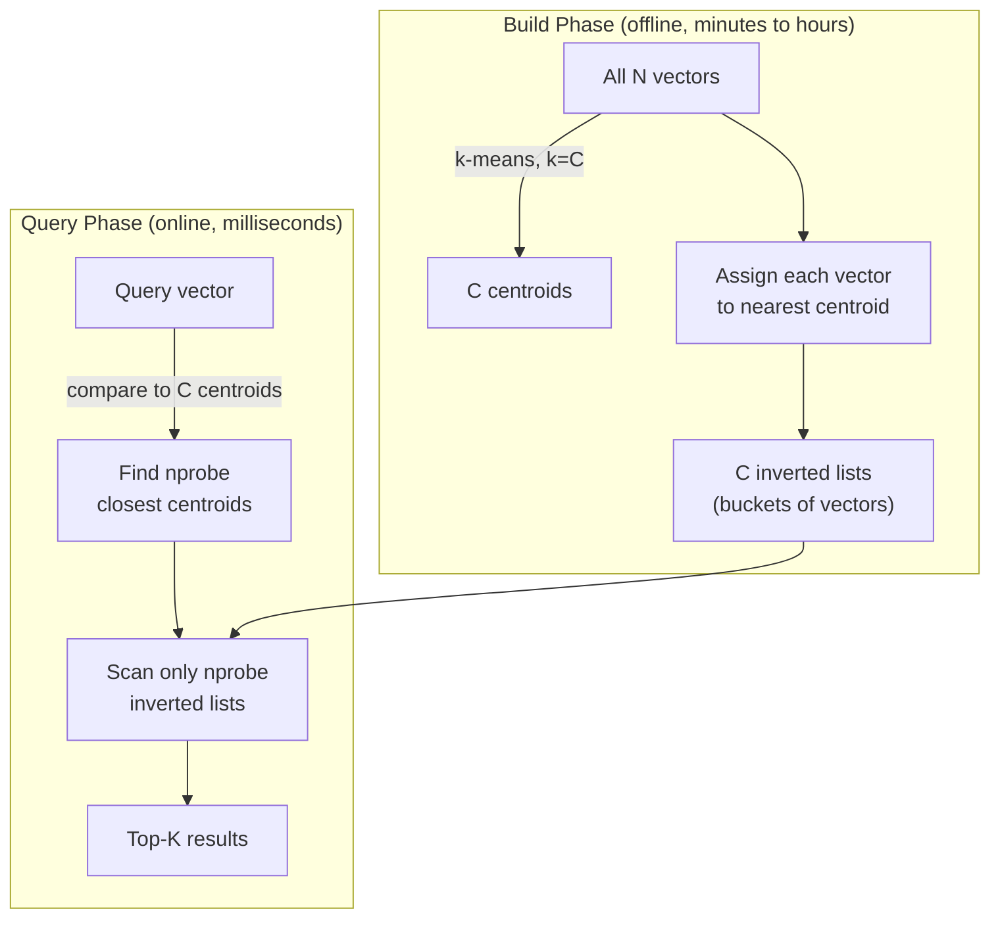
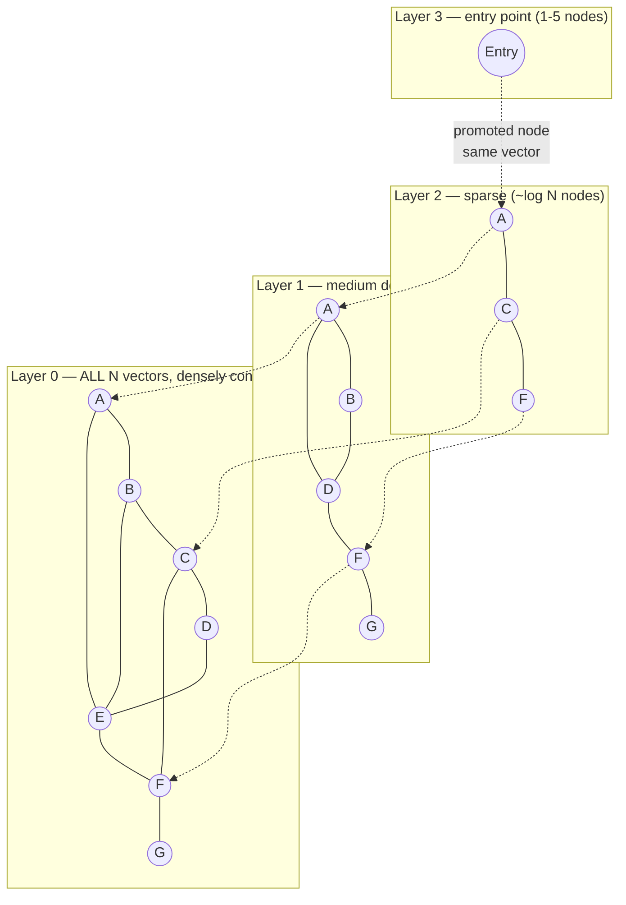
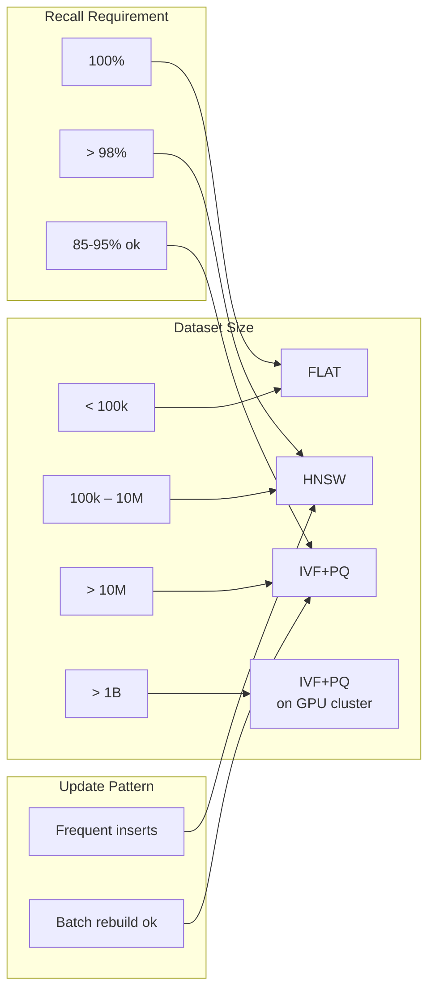

# Vector Index Algorithms (HNSW, IVF, FLAT, FAISS)

**Level**: 🔴 Advanced
**Reading Time**: 20 minutes

> HNSW finds your 10 nearest neighbors in 10 million vectors in under 5ms. FLAT takes 5 seconds. The difference is the index. Understanding why HNSW works means understanding every production vector system.

---

## Level 1 — Surface (2-minute read)

**What it is**: A vector index is a data structure that answers "which stored vectors are most similar to this query vector?" in sub-linear time, trading a small amount of accuracy for massive speed gains.

**When you need it**: When your vector dataset exceeds ~100k entries and you're getting more than ~10 queries per second — exact brute-force search at 1M vectors with 1536 dimensions takes ~5 seconds per query on CPU.

**Core concepts**:
- **ANN (Approximate Nearest Neighbor)**: Trade perfect recall for O(log N) or better query time
- **FLAT**: Exact search, O(N×D) per query — only viable below 100k vectors
- **IVF**: Cluster vectors into Voronoi cells; search only the nearest cells at query time
- **HNSW**: Multi-layer proximity graph; greedy graph traversal gives O(log N) queries
- **PQ (Product Quantization)**: Compress vectors 32-64× for billion-scale memory efficiency

```mermaid
graph LR
    Q[Query Vector] --> IDX[Vector Index]
    IDX -->|FLAT| ALL[Scan all N vectors\nO(N·D) exact]
    IDX -->|IVF| CELLS[Scan nprobe cells\nO(nprobe·N/C)]
    IDX -->|HNSW| GRAPH[Traverse proximity graph\nO(log N)]
    ALL --> TOPK[Top-K results]
    CELLS --> TOPK
    GRAPH --> TOPK
```

**Use this when / don't use this when**:

| Use HNSW when | Use IVF when | Stick with FLAT when |
|---------------|--------------|----------------------|
| 100k – 500M vectors | > 500M vectors, GPU available | < 100k vectors |
| Recall > 95% required | Memory is the primary constraint | Ground-truth benchmarking |
| Frequent inserts/deletes | Batch workloads, periodic rebuilds acceptable | Infrequent queries |
| Latency < 5ms target | Can tolerate 10-20ms at high nprobe | Any scale, exact required |

---

## Level 2 — Deep Dive

### Why Exact k-NN Is Impossible at Scale

Exact nearest-neighbor search requires computing the distance between the query vector and every stored vector. The complexity is **O(N × D)** per query, where:
- N = number of vectors
- D = dimensionality (1536 for OpenAI embeddings, 768 for many BERT models)

**Failure scenario**: A production RAG system ingests 10M documents, each embedded as a 1536-float vector. User traffic: 500 QPS.

```
Exact search cost per query:
  10M vectors × 1536 floats × 4 bytes × 2 ops (multiply + add) 
  = ~120 billion FLOPs per query
  = ~0.5 seconds on a 256-GFLOP CPU core

At 500 QPS:
  500 × 0.5s = 250 CPU-core-seconds per second
  = 250 dedicated CPU cores to serve queries
  = $50,000+/month in cloud compute
```

With HNSW (M=16, ef=200):
- Same query: ~2ms on a single CPU core
- At 500 QPS: 1 CPU core needed
- Memory: ~2.5 GB for the index
- Cost: ~$100/month

The O(N×D) wall is why every production vector system uses ANN indexing.

---

### Approach A — IVF (Inverted File Index)

IVF partitions the vector space into C Voronoi cells using k-means clustering. Each vector is assigned to its nearest centroid. At query time, only the nprobe closest cells are searched.



```
// IVF build phase (offline, expensive)
function buildIVF(vectors, C=1024):
  // K-means to get C centroids — O(N·C·D·iterations)
  centroids = kMeans(vectors, k=C, max_iter=100)

  // Assign each vector to its nearest centroid
  inverted_lists = [[] for _ in range(C)]
  for vector in vectors:
    centroid_id = argmin(distance(vector, c) for c in centroids)
    inverted_lists[centroid_id].append((vector_id, vector))

  return IVFIndex(centroids, inverted_lists)

// IVF search phase (online, fast)
function searchIVF(query, k, nprobe=8):
  // Find the nprobe closest centroids to the query — O(C·D)
  centroid_distances = [(distance(query, c), i) for i, c in enumerate(centroids)]
  nearest_centroids = topK(centroid_distances, nprobe)  // O(C log nprobe)

  // Search only those nprobe inverted lists — O(nprobe·(N/C)·D)
  candidates = []
  for centroid_id in nearest_centroids:
    for (vid, vector) in inverted_lists[centroid_id]:
      candidates.append((cosineSimilarity(query, vector), vid))

  return topK(candidates, k)
```

#### IVF: Parameter Tuning

**nlist (C)**: Number of clusters. Rule of thumb: `nlist = 4 × sqrt(N)`.
- N=1M → nlist=4000
- N=100M → nlist=40000
- Too few clusters: each list is large, scans are slow
- Too many clusters: centroids are too specific, vectors near boundaries are misassigned

**nprobe**: Number of clusters to search at query time.

| nprobe | Recall@10 | Latency (1M vectors) | Vectors scanned |
|--------|----------|----------------------|-----------------|
| 1 | ~60% | 0.3ms | N/C |
| 8 | ~80% | 1.5ms | 8×N/C |
| 32 | ~90% | 5ms | 32×N/C |
| 128 | ~97% | 18ms | 128×N/C |
| C (all) | ~100% | ~FLAT speed | N |

The **boundary problem**: A vector near a Voronoi cell edge is equidistant from two centroids. With nprobe=1, the true nearest neighbor may live in the adjacent cell and be missed entirely. This is why recall degrades sharply at low nprobe.

#### IVF Trade-off Table

| Dimension | Low nprobe (1-4) | Medium nprobe (8-32) | High nprobe (64-256) |
|-----------|-----------------|----------------------|----------------------|
| Recall@10 | 60-75% | 80-92% | 95-99% |
| Latency | Fastest (~0.5ms) | Fast (~2-8ms) | Moderate (~20-50ms) |
| Use case | Recommendation (recall ok) | RAG, search | Near-exact recall needed |

---

### Approach B — HNSW (Hierarchical Navigable Small World)

HNSW is a graph-based index providing O(log N) query time with 90-99.9% recall. It is the default algorithm in Qdrant, Weaviate, Milvus, and most modern vector databases.

#### Multi-Layer Graph Structure

HNSW builds a hierarchy of proximity graphs:



Each vector is inserted at Layer 0. With probability `1/e`, it's also promoted to Layer 1. With probability `1/e²`, to Layer 2. And so on. This random promotion creates an exponentially thinning hierarchy — the same skip-list intuition that makes sorted lookups fast.

#### HNSW Search Algorithm

```
function searchHNSW(query, k, ef_search=200):
  // Start at the single entry point in the topmost layer
  current = entryPoint  // usually 1 node

  // Phase 1: Greedy descent through upper layers (fast, no backtracking)
  for layer = topLayer downto 1:
    // Move to whichever neighbor is closest to the query
    // Stop when no neighbor is closer than current node
    current = greedyDescend(current, query, layer)

  // Phase 2: Beam search at Layer 0 (thorough, with backtracking)
  // ef_search = candidate pool size — the main recall/speed dial
  candidates = beamSearch(entrypoint=current, query, layer=0, ef=ef_search)

  return topK(candidates, k)

function beamSearch(start, query, layer, ef):
  visited = {start}
  candidates = MaxHeap()   // by distance to query — worst at top
  dynamic_list = MinHeap() // ef best candidates seen so far

  dynamic_list.push((distance(start, query), start))
  candidates.push((distance(start, query), start))

  while candidates not empty:
    closest_unvisited = candidates.pop_min()
    worst_in_ef = dynamic_list.peek_max()

    // Termination: closest unvisited is farther than worst current candidate
    if distance(closest_unvisited, query) > distance(worst_in_ef, query):
      break

    for neighbor in graph.neighbors(closest_unvisited, layer):
      if neighbor not in visited:
        visited.add(neighbor)
        d = distance(neighbor, query)
        if d < distance(worst_in_ef, query) OR len(dynamic_list) < ef:
          candidates.push((d, neighbor))
          dynamic_list.push((d, neighbor))
          if len(dynamic_list) > ef:
            dynamic_list.pop_max()  // evict worst

  return dynamic_list  // ef best candidates
```

The upper layers act as a "highway network" — they let you jump across large chunks of the vector space in a few hops. Layer 0 does the fine-grained search. This is the skip-list analogy made spatial.

#### HNSW Parameters

| Parameter | Default | Typical Range | Effect |
|-----------|---------|---------------|--------|
| M | 16 | 8–64 | Connections per node. Higher M = better recall, more memory. Memory ≈ M × N × 8 bytes for the graph alone |
| ef_construction | 200 | 100–500 | Beam width during build. Higher = better graph quality, slower build. Set once, can't change without rebuild |
| ef_search | 200 | 50–500 | Beam width during query. **The primary runtime tuning knob.** Higher = better recall, higher latency |

**ef_search recall/latency profile at 1M 1536-dim vectors**:

| ef_search | Recall@10 | Latency (p50) | Latency (p99) |
|-----------|----------|---------------|---------------|
| 50 | ~90% | 0.8ms | 2ms |
| 100 | ~95% | 1.5ms | 3.5ms |
200 | ~99% | 2.5ms | 6ms |
| 500 | ~99.9% | 7ms | 15ms |
| 1000 | ~99.99% | 15ms | 30ms |

**Real-world HNSW numbers (1M vectors, 1536 dimensions)**:
- Build time: ~50 minutes on single CPU (M=16, ef_construction=200)
- Index size: ~1.5 GB RAM (vectors) + ~200 MB (graph edges at M=16) = ~1.7 GB
- Query latency: ~1ms at ef=100 (p50), single thread
- QPS per core: ~500-1000 at ef=100

**Memory formula**:
```
RAM = N × D × 4 bytes (float32 vectors)
    + N × M × 2 × 8 bytes (bidirectional graph edges)
    + N × log(N) × 8 bytes (upper-layer edges, smaller term)

Example: 1M vectors, D=1536, M=16
  = 1M × 1536 × 4  = 6.1 GB (vectors)
  + 1M × 16 × 2 × 8 = 256 MB (graph)
  ≈ 6.4 GB total
```

#### HNSW Trade-off Table

| Dimension | Low M (8) | Default M (16) | High M (32-64) |
|-----------|-----------|----------------|----------------|
| Memory | Low | Moderate | High (2-4× more) |
| Recall at same ef | Lower | Baseline | Higher |
| Build time | Fast | Moderate | Slow |
| Best for | Memory-constrained | General purpose | Highest recall needed |

---

### Approach C — FAISS (Facebook AI Similarity Search)

FAISS is not an algorithm — it is a **library** implementing FLAT, IVF, HNSW, PQ, and combinations thereof, with GPU acceleration. It is the underlying engine used by Milvus, and the reference implementation most benchmarks use.

```python
import faiss
import numpy as np

d = 1536          # dimension
n = 1_000_000     # number of vectors

vectors = np.random.randn(n, d).astype('float32')
faiss.normalize_L2(vectors)   # normalize for cosine similarity

# --- IVFFlat: accurate, moderate speed ---
nlist = 4000                          # clusters = 4 * sqrt(N)
quantizer = faiss.IndexFlatL2(d)      # coarse quantizer
index_ivf = faiss.IndexIVFFlat(quantizer, d, nlist, faiss.METRIC_INNER_PRODUCT)
index_ivf.train(vectors)              # k-means clustering (slow once)
index_ivf.add(vectors)
index_ivf.nprobe = 8                  # search 8 cells at query time

# --- HNSW: best recall/speed balance ---
M = 16
index_hnsw = faiss.IndexHNSWFlat(d, M, faiss.METRIC_INNER_PRODUCT)
index_hnsw.hnsw.efConstruction = 200
index_hnsw.add(vectors)
index_hnsw.hnsw.efSearch = 200

# --- IVFPQ: billion-scale memory efficient ---
nlist = 4000
m_pq = 96          # 96 subvectors (1536/96 = 16 floats each)
nbits = 8          # 256 codewords per subvector (1 byte)
index_pq = faiss.IndexIVFPQ(quantizer, d, nlist, m_pq, nbits)
index_pq.train(vectors)
index_pq.add(vectors)
# Memory: ~96 bytes/vector vs 6144 bytes raw (64× compression)
index_pq.nprobe = 8

# --- GPU acceleration (10-50× speedup for IVF) ---
res = faiss.StandardGpuResources()
index_gpu = faiss.index_cpu_to_gpu(res, 0, index_ivf)

# Query
query = np.random.randn(1, d).astype('float32')
faiss.normalize_L2(query)
k = 10
distances, indices = index_hnsw.search(query, k)  # returns top-10
```

**FAISS index variants**:

| FAISS Index | Algorithm | Recall | Memory | Speed | Best for |
|-------------|-----------|--------|--------|-------|---------|
| IndexFlatL2 | FLAT | 100% exact | High | Slowest | Ground truth |
| IndexIVFFlat | IVF | 85-99% | Medium | Fast | 1M-100M vectors |
| IndexHNSWFlat | HNSW | 90-99.9% | High | Fast | 100k-500M |
| IndexIVFPQ | IVF+PQ | 80-95% | Very low | Medium | 100M-10B |
| IndexHNSWPQ | HNSW+PQ | 85-98% | Low | Fast | 10M-1B |

---

### Product Quantization: Memory Compression

A 1536-dim float32 vector requires 6 KB. At 100M vectors, that's 600 GB — impossible to hold in RAM on a single machine.

**Product Quantization (PQ)** compresses vectors by:
1. Splitting each vector into `m` equal subvectors
2. Training a codebook of 256 entries for each subspace
3. Replacing each subvector with its nearest codebook index (1 byte)

```
// PQ compression: 1536d float32 → 96 bytes (64× compression)
function trainPQ(training_vectors, m=96, k=256):
  subvector_size = D / m   // 1536 / 96 = 16 floats
  codebooks = []
  for i in range(m):
    // Extract i-th subvector from all training vectors
    subvectors = training_vectors[:, i*subvector_size:(i+1)*subvector_size]
    // K-means to find 256 centroids for this subspace
    codebooks[i] = kMeans(subvectors, k=256)
  return codebooks

function compressPQ(vector, codebooks, m=96):
  codes = []
  for i in range(m):
    subvector = vector[i*subvector_size:(i+1)*subvector_size]
    // Find nearest of 256 codebook entries → 1 byte
    code = argmin(distance(subvector, cb) for cb in codebooks[i])
    codes.append(code)
  return codes  // 96 bytes instead of 6144 bytes

function approximateDistancePQ(query, compressed_vector, codebooks):
  // Precompute distance tables: D(query_subvector, codebook_entry)
  // This is the fast path — table lookup, not float multiply
  distance_tables = []
  for i in range(m):
    query_sub = query[i*subvector_size:(i+1)*subvector_size]
    distance_tables[i] = [distance(query_sub, cb) for cb in codebooks[i]]

  // Accumulate approximate distance via table lookups
  total = 0
  for i in range(m):
    total += distance_tables[i][compressed_vector[i]]  // O(1) lookup
  return total
```

PQ accuracy vs compression:

| Subvectors (m) | Bytes/vector | Compression | Recall@10 loss | Notes |
|----------------|-------------|-------------|----------------|-------|
| 32 | 32 bytes | 192× | ~10-15% | Extreme compression, noticeable loss |
| 64 | 64 bytes | 96× | ~5-8% | Aggressive, acceptable for some use cases |
| 96 | 96 bytes | 64× | ~3-5% | Common production setting for 1536-dim |
| 192 | 192 bytes | 32× | ~1-3% | High fidelity with good compression |

---

### Comparison: Algorithm vs Algorithm



| Algorithm | Query Speed | Recall | RAM/vector | Build Time | Supports Live Updates |
|-----------|------------|--------|-----------|------------|----------------------|
| FLAT | O(N·D) ~5s/1M | 100% exact | 6 KB (1536d) | Instant | Yes |
| IVF (nprobe=8) | ~1.5ms/1M | ~80% | 6 KB + centroids | Minutes | Partial |
| IVF (nprobe=32) | ~5ms/1M | ~90% | 6 KB + centroids | Minutes | Partial |
| HNSW (ef=100) | ~1.5ms/1M | ~95% | 6 KB + 256 bytes graph | ~50 min | Yes |
| HNSW (ef=200) | ~2.5ms/1M | ~99% | 6 KB + 256 bytes graph | ~50 min | Yes |
| IVF+PQ | ~2ms/1M | ~85% | 96 bytes | Hours | No (full rebuild) |
| HNSW+PQ | ~2ms/1M | ~88% | ~350 bytes | Hours | Partial |

---

### Managed Vector Databases: Comparison

| | Pinecone | Weaviate | Qdrant | pgvector |
|--|----------|----------|--------|---------|
| Type | Managed SaaS | Self-hosted / Cloud | Self-hosted / Cloud | Postgres extension |
| Default index | Proprietary HNSW | HNSW | HNSW | HNSW or IVFFlat |
| Max vectors | 1B+ (enterprise) | Unlimited (cluster) | Unlimited (cluster) | ~10M practical (Postgres limits) |
| Filtering | Yes (metadata filters) | Yes (GraphQL) | Yes (payload filters) | Yes (SQL WHERE) |
| Sparse+dense | Yes (hybrid search) | Yes | Yes | No (vectors only) |
| Ease of use | Easiest (fully managed) | Moderate | Moderate | Easiest if already using Postgres |
| Cost | $$$  (per vector/query) | Free (self-hosted) | Free (self-hosted) | Free (open source) |
| Latency at scale | <10ms (managed) | ~5ms | ~3ms | ~20ms at 10M |
| Best for | Startups, fast time-to-market | Full control, custom schema | High-perf self-hosted | Existing Postgres users |

**Filtering with HNSW**: Pre-filtering (filter first, then ANN) can drastically reduce the searchable set, breaking the HNSW graph traversal assumptions. Qdrant and Weaviate implement **filterable HNSW** — they maintain filtered subgraphs or fall back to flat scan when filtered set is small. This is a non-trivial engineering problem that all production vector DBs must solve.

---

### Real Company Examples

**1. Pinecone — 1B+ vectors at production scale**
Pinecone serves over 1 billion vectors for customers including Notion, Hubspot, and Gong. Their proprietary HNSW variant uses a distributed sharding layer on top, partitioning the HNSW graph across nodes by vector ID range. Each shard indexes ~50M vectors and merges top-K results from multiple shards at query time. P99 latency target: <100ms.

**2. Spotify — ANN for music recommendations at 100M songs**
Spotify's music recommendation system uses ANN at 100M song embeddings. They use Annoy (another ANN library) for offline recommendation batch jobs and HNSW for real-time "related songs" features. Their Podcast search team reported switching from Annoy to HNSW improved recall@10 from 87% to 96% with comparable latency.

**3. Meta — FAISS at billion scale**
Meta developed FAISS to power their image similarity search across billions of photos. Their primary production index is `IndexIVFPQ` on GPU clusters: IVF with 65,536 clusters, PQ with 64 subvectors. This achieves sub-100ms search across 10B vectors using ~640 bytes/vector (vs 4KB raw), with recall tuned via nprobe=128 targeting ~85% recall@10.

**4. Notion AI — pgvector for simplicity first**
Notion AI started with pgvector (IVFFlat) co-located with their existing Postgres infrastructure. At their initial scale of ~10M document chunks, the latency was acceptable (15-30ms). They avoided the operational overhead of a separate vector DB. As they scale into 100M+ vectors, they are evaluating Qdrant for the HNSW performance gap.

---

### Common Mistakes

**1. Using default ef_search=50 in production RAG**
Default settings in many libraries start at ef_search=50, giving ~90% recall. For a RAG pipeline, this means 1 in 10 relevant documents is silently missed — the LLM never sees it and either hallucinates or gives an incomplete answer. Always set ef_search ≥ 200 and measure recall@10 against a ground truth set before deploying.

Root cause: ef_search is a latency knob, not a correctness threshold. Engineers tune for latency and forget to validate recall.
Fix: Build a recall benchmark (100-1000 test queries with known correct answers). Run it on every ef_search candidate before deploying.

**2. Setting IVF nprobe=1 (library default)**
FAISS defaults nprobe=1 for IVF indexes, giving ~60% recall. This means 4 out of 10 nearest neighbors are wrong.

Root cause: nprobe=1 is the "fastest possible" default, not the "correct" default.
Fix: Start at nprobe=8 (80% recall), benchmark recall@K, increase until recall meets your threshold.

**3. Using HNSW for billion-scale without PQ**
At 1B vectors, 1536-dim float32: `1B × 6KB = 6 TB RAM`. A 768 GB RAM instance costs ~$10/hour. Add HNSW graph overhead (M=16): ~250 MB per 1M vectors = 250 GB for 1B vectors. Total: ~6.2 TB.

Root cause: HNSW was designed for high recall, not memory efficiency.
Fix: Use HNSW+PQ (reduce to 96-350 bytes/vector = 90-350 GB for 1B vectors) or IVF+PQ on GPU.

**4. Not measuring recall@K (only measuring latency)**
Teams optimize for p99 latency but never measure whether the index is returning the right results.

Root cause: Latency is easy to measure (APM dashboards). Recall requires a labeled test set.
Fix: Maintain a test set of 1000+ queries with known ground truth (run FLAT search on a sample). Compute recall@K monthly or on every config change.

**5. Ignoring the filtering problem**
Vector DBs that support metadata filtering (Qdrant, Weaviate, Pinecone) can degrade badly when the filter is very selective (e.g., "find similar documents written by user_id=12345 who has 30 documents"). HNSW traversal assumes dense connectivity — a highly filtered subset breaks this.

Root cause: HNSW is built for the full vector set. Filtering post-search is wasteful; pre-filtering breaks graph traversal.
Fix: Use a vector DB that explicitly supports filterable HNSW (Qdrant, Weaviate). Alternatively, shard by filter dimension (separate index per user, or per category).

**6. Skipping the IVF training phase**
IVF requires a `train()` call before `add()`. Skipping it (e.g., calling `add()` on an untrained index) silently assigns all vectors to centroid 0, making the index effectively a FLAT scan.

Root cause: FAISS API separates training and adding — easy to miss in quick prototyping.
Fix: Always call `index.is_trained` before adding vectors. Make `train()` part of your build pipeline.

---

### Decision Tree

```
Dataset size?
├── < 100k vectors
│   └── FLAT (exact, zero overhead, instant build)
├── 100k – 5M vectors
│   ├── Recall > 98% required? → HNSW, ef=200-500
│   ├── Memory tight (< 1 GB)? → IVF+PQ, nprobe=32
│   └── Default: HNSW, M=16, ef=200 (covers 90% of cases)
├── 5M – 100M vectors
│   ├── Frequent inserts? → HNSW (handles updates natively)
│   ├── Batch workload? → IVF+PQ, nprobe=16-32
│   └── RAM available? → HNSW (+PQ if > 50M vectors)
└── > 100M vectors
    ├── GPU cluster available? → FAISS IVF+PQ on GPU
    ├── Need live updates? → HNSW+PQ (Qdrant, Milvus)
    └── Cost-sensitive? → IVF+PQ, accept periodic rebuilds
```

---

### Key Takeaways

- Exact k-NN is O(N×D) per query — at 10M vectors, 1536-dim, this is ~5 seconds on CPU. ANN trades 1-10% recall for 100-1000× speed.
- **HNSW** builds a multi-layer proximity graph; O(log N) queries with 90-99.9% recall; default for datasets under 500M vectors. ef_search is the primary recall/speed dial.
- **IVF** clusters vectors into C Voronoi cells and searches nprobe cells at query time. C = 4×sqrt(N) is the rule of thumb; nprobe=8 gives ~80% recall at 10× the speed of FLAT.
- **FAISS** is the reference library (IVFFlat, HNSWPQ, IVFPQ, GPU support) — it underlies most production vector databases.
- **Real numbers**: HNSW ef=100 → 95%+ recall, ~1.5ms on 1M 1536-dim vectors, ~1.7 GB RAM. HNSW ef=200 → 99% recall at ~2.5ms.
- **Always measure recall@K** before declaring your index production-ready. Latency metrics are useless without recall validation.

---

## References

- 📖 [HNSW paper: Efficient and robust approximate nearest neighbor search using Hierarchical Navigable Small World graphs](https://arxiv.org/abs/1603.09320) — Malkov & Yashunin (2018), the foundational paper
- 📖 [FAISS: A Library for Efficient Similarity Search (Meta Engineering Blog)](https://engineering.fb.com/2017/03/29/data-infrastructure/faiss-a-library-for-efficient-similarity-search/)
- 📖 [Pinecone: Choosing the Right Vector Index](https://www.pinecone.io/learn/series/faiss/vector-indexes/) — practical guide with benchmarks
- 📖 [Qdrant: Filterable HNSW](https://qdrant.tech/articles/filterable-hnsw/) — how production vector DBs solve the filtering problem
- 📺 [ANN Benchmarks (ann-benchmarks.com)](http://ann-benchmarks.com/) — live recall/latency benchmarks across all major ANN algorithms
