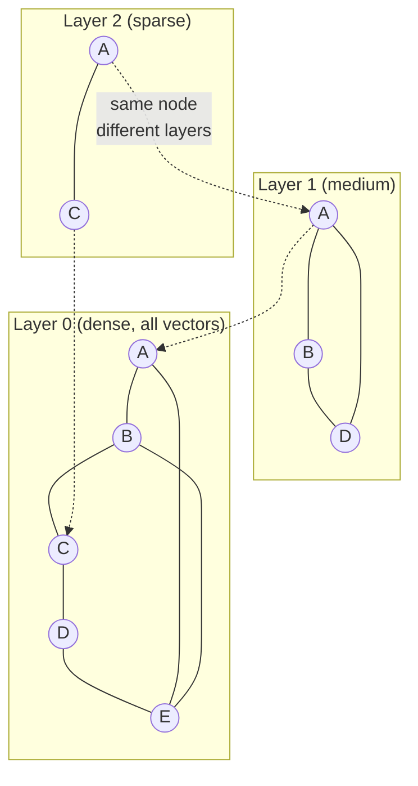

# Vector Index Algorithms (HNSW, IVF, FLAT)

**Level**: 🔴 Advanced
**Reading Time**: 16 minutes

> HNSW finds your 10 nearest neighbors in 10 million vectors in under 5ms. FLAT takes 5 seconds. The difference is the index. Understanding why HNSW works means understanding every production vector system.

## The Problem

You have 10 million text embeddings, each 1536 floats. A user submits a query. You need the 10 closest vectors to the query vector. The naive approach — compute cosine similarity with all 10M vectors — takes ~5 seconds on a single CPU. At 1000 queries per second, that's 50,000 CPUs for the brute-force scan alone.

You need an index: a data structure that lets you find approximate nearest neighbors in O(log n) or O(1) time, trading a small amount of recall for enormous speed gains.

## Three Index Families

```mermaid
flowchart TD
    subgraph FLAT["FLAT — Exact Search"]
        F1["Store all vectors\nin a flat array"]
        F2["Query: scan all N vectors\ncompute similarity each"]
        F3["Result: exact top-K\nO(N·D) per query"]
        F1 --> F2 --> F3
    end

    subgraph IVF["IVF — Inverted File"]
        I1["K-means cluster vectors\ninto C Voronoi cells"]
        I2["Query: find nprobe\nclosest centroids"]
        I3["Scan only those\nnprobe·(N/C) vectors"]
        I4["Result: approx top-K\nO(nprobe·N/C·D) per query"]
        I1 --> I2 --> I3 --> I4
    end

    subgraph HNSW["HNSW — Graph-Based"]
        H1["Build multi-layer graph\nof proximity links"]
        H2["Query: greedy traverse\nfrom top layer down"]
        H3["Each layer halves\nthe search space"]
        H4["Result: approx top-K\nO(log N·D) per query"]
        H1 --> H2 --> H3 --> H4
    end
```



## FLAT: Exact Search

FLAT stores every vector in a contiguous array. A query scans all N vectors and returns the true top-K.

```
// FLAT index
struct FlatIndex:
  vectors: float[N][D]  // N vectors of D dimensions each

function build(vectors):
  self.vectors = vectors  // O(N·D) storage, O(1) build

function search(query, k):
  scores = []
  for i in range(N):
    score = cosineSimilarity(query, self.vectors[i])
    scores.append((score, i))
  return topK(scores, k)  // O(N·D) per query
```

**When to use FLAT**:
- Dataset < 100k vectors (brute force is fast enough)
- You need 100% recall (ground truth evaluation)
- Building recall@K ground truth for benchmarking other indexes

**When NOT to use FLAT**: Any production system with > 100k vectors and > 10 QPS.

## IVF: Inverted File Index

IVF (from FAISS) divides the vector space into C Voronoi cells using k-means clustering. Each vector is assigned to its nearest centroid. At query time, only nprobe cells are searched.

```
// IVF build phase (offline, expensive)
function buildIVF(vectors, C=1024):
  // K-means to get C centroids
  centroids = kMeans(vectors, k=C)

  // Assign each vector to its nearest centroid
  inverted_lists = [[] for _ in range(C)]
  for vector in vectors:
    centroid_id = argmin(distance(vector, c) for c in centroids)
    inverted_lists[centroid_id].append(vector)

  return IVFIndex(centroids, inverted_lists)

// IVF search phase (online, fast)
function searchIVF(query, k, nprobe=8):
  // Find the nprobe closest centroids to the query
  centroid_distances = [(distance(query, c), i) for i, c in enumerate(centroids)]
  nearest_centroids = topK(centroid_distances, nprobe)

  // Search only those nprobe inverted lists
  candidates = []
  for centroid_id in nearest_centroids:
    for vector in inverted_lists[centroid_id]:
      candidates.append((cosineSimilarity(query, vector), vector))

  return topK(candidates, k)
```

### IVF Trade-offs

The critical parameter is **nprobe**: how many cells to search.

| nprobe | Recall@10 | Latency | Vectors scanned |
|--------|----------|---------|-----------------|
| 1 | ~60% | fastest | N/C |
| 8 | ~85% | fast | 8·N/C |
| 32 | ~95% | medium | 32·N/C |
| 256 | ~99% | slow (approaches FLAT) | 256·N/C |

**The boundary problem**: Vectors near a Voronoi cell boundary are equidistant from two centroids. If nprobe=1, the true nearest neighbor might be in the adjacent cell and get missed. This is why recall degrades at low nprobe.

**Rule of thumb**: C = 4√N centroids, nprobe ≥ 8 for most use cases.

## HNSW: Hierarchical Navigable Small World

HNSW is a graph-based index that provides O(log N) query time with excellent recall. It's the default algorithm in Qdrant, Weaviate, and most modern vector databases.

### The Core Idea

HNSW builds a multi-layer proximity graph where:
- Layer 0: All vectors, densely connected to their M nearest neighbors
- Layer 1: A random ~1/e subset of vectors, each connected to M neighbors
- Layer 2: A further random subset
- ...continuing until the top layer has ~log(N) nodes



### HNSW Search Algorithm

```
function searchHNSW(query, k, ef_search=200):
  // Start at the entry point at the top layer
  current = entryPoint

  // Greedy descent through upper layers
  for layer = topLayer downto 1:
    // In upper layers: greedy, pick the closest neighbor, no backtracking
    current = greedyDescend(current, query, layer)

  // At layer 0: beam search with ef_search candidates
  // ef_search controls the search breadth — higher = better recall, slower
  candidates = beamSearch(current, query, layer=0, efSearch=ef_search)

  return topK(candidates, k)

function beamSearch(start, query, layer, efSearch):
  visited = {start}
  candidates = MinHeap()  // sorted by distance to query
  candidates.push(start)

  while candidates not empty:
    current = candidates.pop()  // closest unvisited
    if distance(current, query) > distance(worst in top-efSearch, query):
      break  // can't improve, stop

    for neighbor in graph.neighbors(current, layer):
      if neighbor not in visited:
        visited.add(neighbor)
        candidates.push(neighbor)

  return topEfSearch(candidates)
```

### HNSW Parameters

| Parameter | Default | Effect |
|-----------|---------|--------|
| M | 16 | Number of connections per node. Higher M = better recall, more memory (memory ≈ M × N × 4 bytes extra) |
| ef_construction | 200 | Build-time beam width. Higher = better index quality, slower build |
| ef_search | 200 | Query-time beam width. Higher = better recall, higher latency. Main tuning knob |

**ef_search tuning**:
- ef_search = 50: recall ~0.90, latency ~1ms at 1M vectors
- ef_search = 200: recall ~0.99, latency ~3ms
- ef_search = 500: recall ~0.9999, latency ~8ms

## Product Quantization: Memory Compression

A 1536d float32 vector requires 6 KB. At 100M vectors, that's 600 GB — too expensive for RAM-only serving.

**Product Quantization (PQ)** compresses vectors by splitting them into subvectors and quantizing each to a codebook of 256 entries (1 byte):

```
// PQ compression (1536d float32 → 96 bytes, 64× compression)
function compressPQ(vector, subvectorCount=96, codebookSize=256):
  subvectorSize = len(vector) / subvectorCount  // 1536 / 96 = 16 floats each
  compressed = []

  for i in range(subvectorCount):
    subvector = vector[i*subvectorSize : (i+1)*subvectorSize]
    // Find nearest of 256 codebook entries for this subspace
    codeword = argmin(distance(subvector, cb) for cb in codebooks[i])
    compressed.append(codeword)  // 1 byte instead of 16×4=64 bytes

  return compressed  // 96 bytes instead of 6144 bytes
```

PQ trades accuracy for memory — approximate distances from compressed vectors. Used in combination with HNSW (as HNSWPQ) or IVF (as IVFFlat+PQ).

## Algorithm Comparison Table

| Algorithm | Query Speed | Recall | Memory | Build Time | Supports Updates |
|-----------|------------|--------|--------|------------|-----------------|
| FLAT | O(N) slow | 100% exact | Low (just vectors) | O(N) fast | Yes (append) |
| IVF | O(nprobe·N/C) | 85-99% | Medium | O(N·C) slow | Partial (rebuild centroids) |
| HNSW | O(log N) fast | 90-99.9% | High (+graph) | O(N·M·log N) | Yes (insert/delete) |
| HNSW+PQ | O(log N) fast | 85-99% | Very low | Slow | Partial |
| IVF+PQ | Medium | 80-95% | Very low | Slow | No (full rebuild) |

## Which to Use

```
Dataset size?
├── < 100k vectors    → FLAT (exact, no index overhead)
├── 100k – 10M       → HNSW (best recall+speed balance)
│   └── Memory tight? → HNSW + PQ
└── > 10M vectors    → IVF + PQ (Milvus / FAISS large-scale)
    └── Need updates? → HNSW + PQ (IVF requires full rebuild for new centroids)
```

## Real-World Notes

- **Qdrant**, **Weaviate**, and **pgvector** all default to HNSW
- **Pinecone** uses a proprietary variant of HNSW
- **FAISS** (Facebook AI Similarity Search) implements FLAT, IVF, HNSW, and PQ — it's the library underneath most vector DBs
- **Milvus** uses IVF variants for very large datasets (billions of vectors)
- HNSW cannot easily scale across multiple machines — sharding is done at the application layer, not within the algorithm

## Common Pitfalls

1. **Low ef_search**: Default ef_search=50 gives ~90% recall. For production RAG, set ef_search ≥ 200 to get 99%+ recall. A missed document = a hallucinated answer.
2. **IVF with low nprobe**: nprobe=1 (the default in some libraries) gives ~60% recall. Always set nprobe ≥ 8.
3. **Not benchmarking recall**: Teams tune for latency but never measure recall@K. A fast index that misses 15% of relevant documents silently degrades every downstream AI task.
4. **Using HNSW for billion-scale**: HNSW graph at 1B vectors requires ~120 GB RAM just for the graph edges (M=16). Use IVF+PQ with FAISS/Milvus instead.
5. **PQ with too few subvectors**: Fewer subvectors = more compression = worse accuracy. For 1536d, use at least 96 subvectors (16d each). Never compress below 8d per subvector.

## Key Takeaways

- FLAT is exact but O(N) — only for datasets under 100k vectors or benchmarking
- IVF clusters vectors; query only scans nprobe clusters — tuning nprobe balances recall vs speed
- HNSW builds a multi-layer proximity graph; O(log N) queries with 90-99.9% recall; default for most production systems
- ef_search is the main HNSW tuning knob: higher = better recall, higher latency
- Product Quantization (PQ) compresses vectors 32-64×, enabling billion-scale at the cost of ~5% recall
- Recall@K is the primary correctness metric — always measure it before declaring your index "good"
