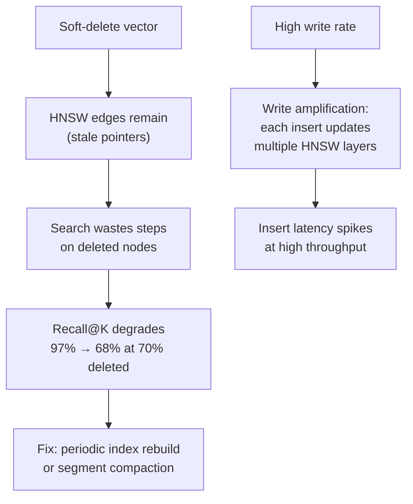
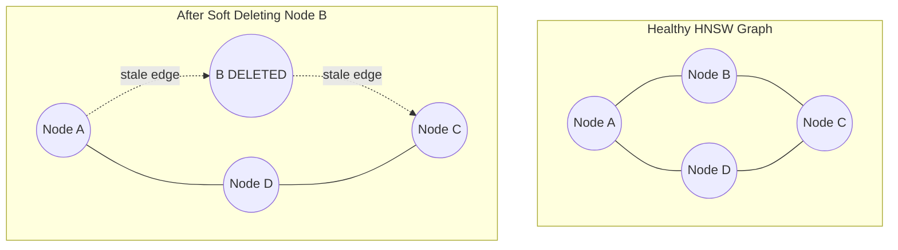
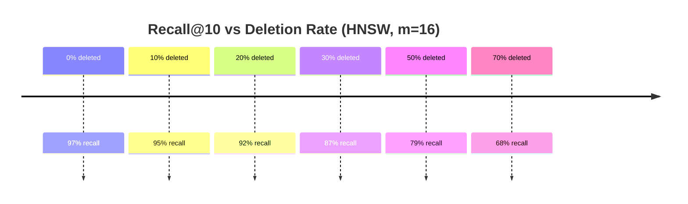

# Index Staleness & Write Amplification

**Level**: 🟡 Intermediate
**Reading Time**: 7 minutes

## 🗺️ Quick Overview



*HNSW soft-deletes leave stale edges that waste search traversal; recall degrades proportionally with deletion rate and only recovers after a full index rebuild.*

> You delete outdated documents. Six months later, your search recall has quietly dropped from 97% to 84%. The data is correct — the index isn't.

## The Problem

HNSW (Hierarchical Navigable Small World) is a graph-based index. Adding a vector means inserting a new node and creating bidirectional links to existing neighbors. Deleting a vector in most implementations is a **soft delete** — the node is marked as deleted but its edges remain in the graph.

Over time, the graph accumulates stale pointers: paths that lead through deleted nodes to reach other nodes. The traversal still works, but the routing quality degrades. Recall@K drops — not to zero, but enough to matter.

## How HNSW Soft Deletes Work



When the search traversal reaches Node B, it:
1. Sees B is deleted — skips it from the result set
2. But still follows B's outgoing edges to explore neighbors
3. This wastes traversal steps and can miss better paths

With 5% deletion rate, impact is minor. At 30%+ deletion rate, recall drops measurably.

## Index Degradation Timeline



*Simulated on 1M × 1536d vectors. Actual degradation varies by m and ef_search settings.*

## Write Amplification

Every vector INSERT into an HNSW index is not just one write — it involves:

1. Traverse graph to find nearest neighbors at each level
2. Insert new node
3. Create bidirectional edges to M neighbors at each level
4. For each neighbor: update that neighbor's edge list

For `m=16`, inserting one vector modifies approximately 16–32 existing nodes. At write-heavy workloads (1000+ inserts/sec), this creates significant I/O and CPU pressure.

### Write Amplification Formula

```
Writes per vector insert ≈ m × (1 + log(n) / log(m))

Where:
  m = HNSW connections per node
  n = current index size

For m=16, n=1M:
  ≈ 16 × (1 + log(1M)/log(16)) ≈ 16 × (1 + 5) ≈ 96 node updates
```

In practice: each `INSERT` into a 1M-vector HNSW index with `m=16` touches ~50–100 node records.

## Detection

### 1. Monitor Index Size vs Vector Count

Healthy index: size grows linearly with vector count.
Stale index: size grows faster than vector count (deleted nodes still occupy space).

```python
# monitor_index_health.py
def check_index_health(vector_count: int, index_size_bytes: int, model_dim: int = 1536) -> dict:
    """
    Expected HNSW RAM usage (rough):
    ~(dim × 4 bytes) × 1.3 overhead × vector_count
    """
    expected_bytes = model_dim * 4 * 1.3 * vector_count
    actual_to_expected_ratio = index_size_bytes / expected_bytes

    return {
        "vector_count": vector_count,
        "index_size_gb": round(index_size_bytes / 1e9, 2),
        "expected_size_gb": round(expected_bytes / 1e9, 2),
        "bloat_ratio": round(actual_to_expected_ratio, 2),
        "needs_rebuild": actual_to_expected_ratio > 1.3,  # >30% bloat → rebuild
    }

# Example output after heavy deletion workload:
# {"vector_count": 700000, "index_size_gb": 5.8, "expected_size_gb": 4.2, "bloat_ratio": 1.38, "needs_rebuild": True}
```

### 2. Track Recall@K Over Time

```python
# recall_probe.py — run this as a cron job
def measure_recall(search_fn, exact_search_fn, probe_queries, k=10) -> float:
    """
    Compare ANN results vs exact KNN results on the same queries.
    Recall@K = |ANN results ∩ exact results| / K
    """
    recalls = []
    for query in probe_queries:
        ann_ids = {r.id for r in search_fn(query, top_k=k)}
        exact_ids = {r.id for r in exact_search_fn(query, top_k=k)}
        recalls.append(len(ann_ids & exact_ids) / k)
    return sum(recalls) / len(recalls)

# Alert threshold: if recall@10 drops below 0.90 → trigger rebuild
```

## Fix: Periodic Index Rebuild

### Qdrant (automatic optimization)

```python
from qdrant_client import QdrantClient

client = QdrantClient("localhost", port=6333)

# Check if optimization is needed
info = client.get_collection("documents")
print(f"Vectors: {info.vectors_count}")
print(f"Deleted: {info.deleted_vectors_count}")

deletion_rate = info.deleted_vectors_count / max(info.vectors_count, 1)
if deletion_rate > 0.20:
    # Trigger re-indexing (rebuilds HNSW, reclaims space)
    client.update_collection(
        "documents",
        optimizer_config=models.OptimizersConfigDiff(
            deleted_threshold=0.05,       # rebuild when 5% deleted
            vacuum_min_vector_number=1000  # don't bother under 1k vectors
        )
    )
    print("Optimization triggered")
```

### pgvector (manual VACUUM)

```sql
-- Check index bloat
SELECT
    schemaname,
    tablename,
    pg_size_pretty(pg_total_relation_size(schemaname||'.'||tablename)) AS total_size,
    pg_size_pretty(pg_relation_size(schemaname||'.'||tablename)) AS table_size
FROM pg_tables
WHERE tablename = 'documents';

-- Reclaim space after large deletes
VACUUM ANALYZE documents;

-- Full rebuild (blocks briefly, reclaims most space)
REINDEX INDEX CONCURRENTLY documents_embedding_hnsw_idx;
```

### Rebuild Impact

| Collection Size | Qdrant Optimize | pgvector REINDEX CONCURRENTLY |
|----------------|----------------|-------------------------------|
| 100k vectors | ~30 seconds | ~2 min |
| 1M vectors | ~8 min | ~15 min |
| 10M vectors | ~80 min | ~2.5 hours |

During rebuild: reads continue to work (old index still serves queries). Writes are accepted but not yet indexed (buffered). After rebuild: writes are flushed and fully indexed.

## Strategies for Write-Heavy Workloads

### 1. Batch Updates Instead of Per-Document

```python
# WRONG: update one vector at a time — maximum write amplification
for doc in updated_documents:
    vector_store.update(doc.id, new_embedding)

# BETTER: batch updates, trigger one reindex at the end
vector_store.batch_upsert([(doc.id, emb) for doc, emb in updates])
# Qdrant will consolidate index updates in its background optimizer
```

### 2. Use Segments with Delayed Indexing (Qdrant)

```python
# New vectors go into un-indexed segments (plain array scan)
# Background optimizer merges them into HNSW when segment is large enough
client.update_collection(
    "documents",
    optimizer_config=models.OptimizersConfigDiff(
        indexing_threshold=20000  # only build HNSW for segments >20k vectors
    )
)
# Small segments use brute-force — fast for small N, accurate, no write amplification
```

### 3. Consider IVFFlat for Write-Heavy Use Cases

| | HNSW | IVFFlat |
|--|------|---------|
| Query speed | Faster | Slower |
| Write cost | High (graph maintenance) | Low (just add to a bucket) |
| Rebuild frequency needed | Higher | Lower |
| Recall@K (typical) | Higher | Slightly lower |

If your write/read ratio > 0.1 (more than 1 write per 10 reads), evaluate IVFFlat.

## Key Takeaways

- HNSW soft deletes leave stale graph edges — recall@K degrades over time
- Write amplification: each INSERT touches ~50–100 existing nodes in a 1M-vector index
- Detect degradation by monitoring index size vs vector count ratio, and by measuring recall@K against exact KNN
- Fix: periodic index optimization/rebuild (non-blocking in most vector DBs)
- For write-heavy workloads: use batched updates, delayed indexing, or consider IVFFlat

## Related

- [pgvector Setup](../hands-on/pgvector-setup) — HNSW index creation and parameter tuning
- [Vector DB Scaling Failures](./vector-db-scaling-failures) — memory exhaustion and other scaling issues
- [Silent Retrieval Quality Degradation](./retrieval-quality-degradation) — detecting and measuring quality issues
