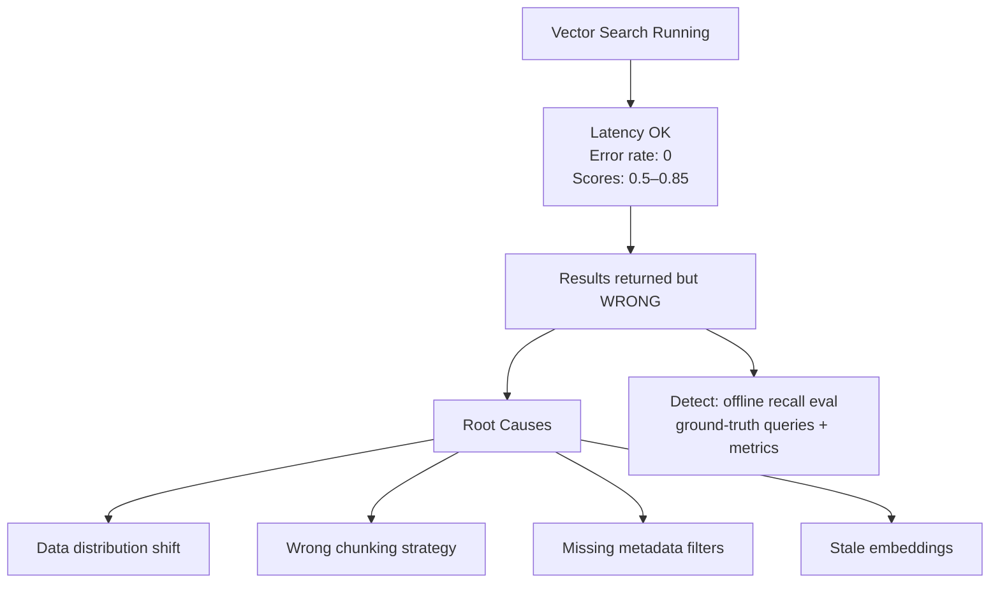
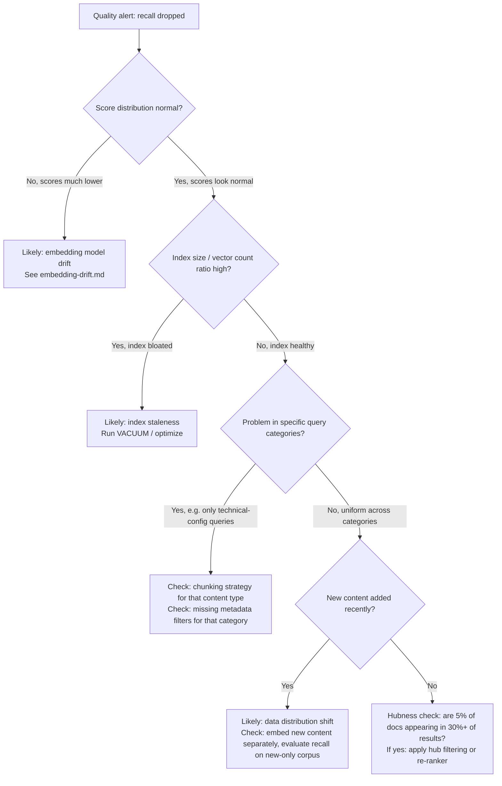

# Silent Retrieval Quality Degradation

**Level**: 🔴 Advanced
**Reading Time**: 10 minutes

## 🗺️ Quick Overview



*Silent quality degradation produces no errors or latency spikes — the only signal is measuring retrieval recall against ground-truth queries; most teams skip this and go weeks without noticing.*

> Your vector search is returning results. The latency is normal. The error rate is zero. But the results are wrong — and have been for three weeks. This is the hardest failure mode in production vector systems.

## The Problem

Vector search fails without any observable signal. Unlike a database outage (queries fail) or index staleness (recall drops measurably), silent quality degradation means:

- Cosine similarity scores look reasonable (0.5–0.85)
- The system returns exactly K results per query
- Latency is within SLA
- RAG responses sound plausible — they're just based on wrong context

The failure is only detectable if you measure retrieval quality explicitly. Most teams don't.

## Root Causes

### 1. Data Distribution Shift

Your corpus evolves, but the query patterns evolve differently. New content uses terminology that the embedding space handles poorly relative to your original corpus.

```
Original corpus: 100k technical documentation articles (2022 vocabulary)
6 months later: 30k new articles added with different style/terminology
Effect: Queries about old content work fine; queries about new content have
        poor recall because the document distribution shifted
```

### 2. Wrong Chunking Strategy

Chunking decisions made at ingestion time become permanent. If you change how you chunk documents later, old chunks and new chunks use different granularities — some queries hit the seam perfectly, others miss.

```
Problem: 500-word chunks → query about a small specific detail gets diluted
         by surrounding context in the same chunk
Fix:     Smaller chunks (100–200 words) + parent chunk retrieval
         Or late chunking (embed full doc, serve relevant sub-section)
```

### 3. Missing Metadata Filters

Without filtering, the search space includes documents from the wrong context. A customer service query that should only search product A's documentation also matches product B and C's docs — returning high-cosine but irrelevant results.

```python
# WRONG: no filter — searches all 500k vectors across all products
results = store.search(query_vector, top_k=10)

# CORRECT: filter by tenant/product namespace first
results = store.search(
    query_vector,
    top_k=10,
    filter={"product_id": current_product_id}
)
```

### 4. The Hubness Problem

In high-dimensional spaces, certain vectors become "hubs" — they appear in the top-K results of many unrelated queries. These hubs are often generic or ambiguous documents that happen to sit near the center of the embedding distribution.

```
Symptom: One document appears in top-3 results for 15% of all queries,
         even when it's clearly not relevant
Cause:   That document's embedding is close to the centroid of the vector space
Fix:     Filter out high-frequency result documents (if their appearance
         rate is suspicious), or use a re-ranker to validate relevance
```

### 5. Stale Corpus (Right Data, Wrong Version)

Documents are updated but embeddings aren't re-indexed. The content at retrieval time doesn't match the content that was embedded.

## Building a Retrieval Quality Monitoring Pipeline

```mermaid
flowchart LR
    subgraph Offline
        G[Golden Query Set\n50 labeled queries] --> E[Weekly Eval Job]
        E --> M[Recall@K metric\nper query category]
        M --> D[Dashboard + alerts]
    end
    subgraph Online
        Q[Live Queries] --> S[Sample 1%]
        S --> R[Human spot-check\nrelevance rating]
        R --> F[Rolling quality score]
        F --> D
    end
    subgraph Trigger
        D --> AL{Quality alert?}
        AL -- Yes --> I[Investigate root cause\n+ remediation]
    end
```

### Step 1: Build a Golden Query Set

```python
# golden_set.py
"""
A golden query set is a hand-labeled list of (query, relevant_doc_ids) pairs.
50 queries is enough to catch major quality regressions.
Aim for coverage across:
  - Short queries (2-3 words)
  - Long queries (full sentences)
  - Queries with exact identifiers (error codes, product names)
  - Paraphrase queries (asking same thing in different words)
  - Rare-topic queries (edge of the corpus distribution)
"""

GOLDEN_QUERIES = [
    {
        "query": "how to configure TLS for Redis connections",
        "relevant_doc_ids": ["redis-tls-guide", "redis-security-overview"],
        "category": "technical-config",
        "difficulty": "specific"
    },
    {
        "query": "database connection pool exhaustion symptoms",
        "relevant_doc_ids": ["connection-pool-starvation", "pg-performance-tuning"],
        "category": "troubleshooting",
        "difficulty": "conceptual"
    },
    # ... 48 more
]
```

### Step 2: Recall@K Evaluation

```python
# eval_pipeline.py
import json
from datetime import datetime
from typing import List, Callable

def recall_at_k(retrieved_ids: List[str], relevant_ids: List[str], k: int) -> float:
    """Fraction of relevant docs found in top-K results."""
    retrieved_set = set(retrieved_ids[:k])
    relevant_set = set(relevant_ids)
    if not relevant_set:
        return 1.0
    return len(retrieved_set & relevant_set) / len(relevant_set)

def mean_reciprocal_rank(retrieved_ids: List[str], relevant_ids: List[str]) -> float:
    """Position of first relevant result (1/rank). MRR=1.0 means always first."""
    relevant_set = set(relevant_ids)
    for i, doc_id in enumerate(retrieved_ids, 1):
        if doc_id in relevant_set:
            return 1.0 / i
    return 0.0

def run_evaluation(
    search_fn: Callable,
    golden_queries: List[dict],
    k: int = 5
) -> dict:
    """
    Run golden eval and return metrics broken down by category.
    """
    results_by_category = {}
    all_recalls = []
    all_mrr = []

    for item in golden_queries:
        retrieved = search_fn(item["query"], top_k=k)
        retrieved_ids = [r.doc_id for r in retrieved]

        rec = recall_at_k(retrieved_ids, item["relevant_doc_ids"], k)
        mrr = mean_reciprocal_rank(retrieved_ids, item["relevant_doc_ids"])

        all_recalls.append(rec)
        all_mrr.append(mrr)

        cat = item.get("category", "uncategorized")
        if cat not in results_by_category:
            results_by_category[cat] = {"recalls": [], "mrrs": []}
        results_by_category[cat]["recalls"].append(rec)
        results_by_category[cat]["mrrs"].append(mrr)

    report = {
        "timestamp": datetime.utcnow().isoformat(),
        "k": k,
        "overall": {
            f"recall@{k}": round(sum(all_recalls) / len(all_recalls), 4),
            "mrr": round(sum(all_mrr) / len(all_mrr), 4),
            "query_count": len(golden_queries)
        },
        "by_category": {
            cat: {
                f"recall@{k}": round(sum(v["recalls"]) / len(v["recalls"]), 4),
                "mrr": round(sum(v["mrrs"]) / len(v["mrrs"]), 4),
                "query_count": len(v["recalls"])
            }
            for cat, v in results_by_category.items()
        }
    }
    return report

# Sample output:
# {
#   "overall": {"recall@5": 0.823, "mrr": 0.741},
#   "by_category": {
#     "technical-config":  {"recall@5": 0.910, "mrr": 0.870},
#     "troubleshooting":   {"recall@5": 0.780, "mrr": 0.700},
#     "conceptual":        {"recall@5": 0.820, "mrr": 0.760}
#   }
# }
```

### Step 3: Alerting Rules

```python
# quality_gates.py
ALERT_THRESHOLDS = {
    "recall@5_min": 0.75,     # alert if overall recall drops below 75%
    "mrr_min": 0.65,          # alert if MRR drops below 0.65
    "category_recall_min": 0.60,  # alert if any single category drops below 60%
    "weekly_regression_pct": 0.05  # alert if week-over-week drop > 5 percentage points
}

def check_quality_gates(current: dict, previous: dict) -> List[str]:
    alerts = []

    overall = current["overall"]
    if overall["recall@5"] < ALERT_THRESHOLDS["recall@5_min"]:
        alerts.append(f"Recall@5 below threshold: {overall['recall@5']:.3f}")

    if previous:
        prev_recall = previous["overall"]["recall@5"]
        curr_recall = overall["recall@5"]
        drop = prev_recall - curr_recall
        if drop > ALERT_THRESHOLDS["weekly_regression_pct"]:
            alerts.append(f"Recall regression: {prev_recall:.3f} → {curr_recall:.3f} ({drop:.3f} drop)")

    for cat, metrics in current["by_category"].items():
        if metrics["recall@5"] < ALERT_THRESHOLDS["category_recall_min"]:
            alerts.append(f"Category '{cat}' recall critical: {metrics['recall@5']:.3f}")

    return alerts
```

### Step 4: Online Sampling

For production traffic, sample 1% of queries and route them through a secondary "ground truth" pathway (e.g., exact KNN against a smaller, curated corpus) to get real-world quality signals:

```python
# online_monitor.py
import random

async def search_with_quality_sample(query: str, top_k: int = 5):
    """
    Normal search path, but 1% of queries are also evaluated
    against exact KNN to measure ANN recall in production.
    """
    ann_results = await vector_store.search_ann(query, top_k)

    if random.random() < 0.01:  # 1% sampling rate
        exact_results = await vector_store.search_exact(query, top_k)
        ann_ids = {r.id for r in ann_results}
        exact_ids = {r.id for r in exact_results}
        recall = len(ann_ids & exact_ids) / top_k
        metrics.record("ann_recall_online", recall)  # push to your metrics system

    return ann_results
```

## Diagnosing Specific Root Causes

Once an alert fires, run this diagnostic checklist:



## The Minimum Viable Monitoring Setup

If you can only do one thing: maintain a golden query set and run recall@5 on every significant deployment (new model, new chunking strategy, new index params, new data ingestion run).

```bash
# Add to your CI/CD pipeline
python eval_pipeline.py \
  --golden-set ./golden_queries.json \
  --search-endpoint http://search-service/search \
  --threshold 0.75 \
  --fail-on-regression  # exit code 1 if quality drops > 5%
```

## Key Takeaways

- Vector search can silently return wrong results with normal latency and zero errors
- Root causes: embedding drift, chunking mismatch, missing filters, hubness, stale documents
- The minimum safety net: 50 golden queries + recall@K check on every deployment
- Online monitoring: sample 1% of production queries, compare ANN vs exact KNN recall
- Break down quality metrics by query category — category-level regressions reveal root causes faster than aggregate metrics

## Related

- [Embedding Model Drift](./embedding-drift) — the most common cause of sudden quality drops
- [Index Staleness](./index-staleness) — index graph degradation after many deletes
- [Hybrid Search POC](../hands-on/hybrid-search-poc) — hybrid search reduces vulnerability to pure-vector blind spots
