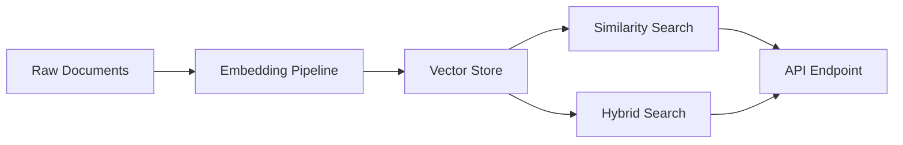

# Vector Databases — Hands-On POCs

Four practical proof-of-concepts that take you from zero to production-grade vector search. Each POC is self-contained with runnable code, realistic datasets, and measured performance numbers.

## What You'll Build

## POC Progression

| POC | Level | What You Learn | Time |
|-----|-------|---------------|------|
| [Similarity Search from Scratch](./similarity-search-poc) | 🟢 Beginner | How vector search works under the hood — no DB required | 20 min |
| [pgvector Setup](./pgvector-setup) | 🟡 Intermediate | Production vector search inside PostgreSQL | 30 min |
| [Embedding Ingestion Pipeline](./embedding-pipeline) | 🔴 Advanced | Batch, deduplicate, and incrementally update a large corpus | 45 min |
| [Hybrid Search (BM25 + Vector)](./hybrid-search-poc) | 🔴 Advanced | Combine keyword and semantic search for best-of-both results | 40 min |

## Recommended Order

**If you're new to vector search**: Start with [Similarity Search from Scratch](./similarity-search-poc). You'll embed 20 documents and query them with pure numpy — no database, no framework. Once you understand what a cosine similarity score means and why it beats keyword matching, the rest makes sense.

**If you already use embeddings**: Jump to [pgvector Setup](./pgvector-setup) for a production-grade SQL-native vector store, then [Hybrid Search](./hybrid-search-poc) if you need to handle exact product names or codes.

**If you're building a production ingestion pipeline**: Go straight to [Embedding Ingestion Pipeline](./embedding-pipeline) — it covers batch embedding, retry with backoff, content deduplication, and incremental updates.

## Prerequisites

All POCs assume:
- Python 3.10+ (POCs 1, 3, 4) or Docker + PostgreSQL (POC 2)
- Basic familiarity with embeddings (what they are — not how to train them)
- An OpenAI API key **or** a local sentence-transformers installation (each POC notes which it uses)

## Key Numbers to Know Before You Start

- **text-embedding-3-small** output: 1536 dimensions, ~$0.02 / 1M tokens
- **HNSW index** in RAM: 1M × 1536d float32 ≈ 6 GB
- **pgvector cosine query** at 1M rows with HNSW: ~5–15 ms at p99
- **BM25 + vector fusion** typically gains 5–15% precision@5 over pure vector on keyword-heavy queries

## Related Sections

- [Vector Database Concepts](/15-vector-databases/concepts/) — what HNSW is, why cosine similarity, ANN vs exact search
- [Failure Modes](/15-vector-databases/failures/) — embedding drift, index staleness, silent quality degradation
