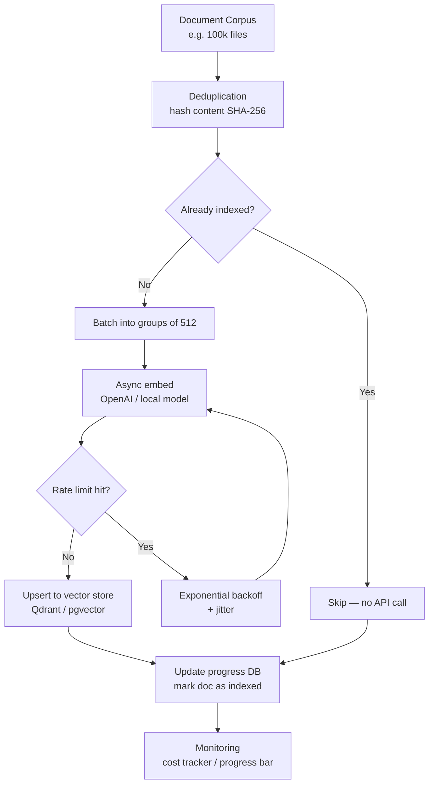
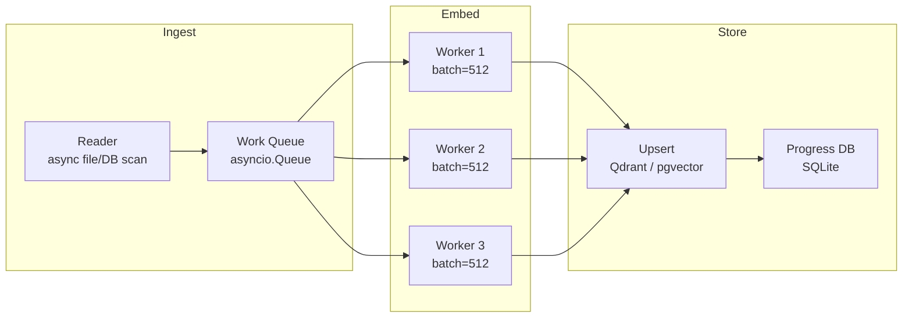

# POC: Production Embedding Ingestion Pipeline

> **Difficulty:** 🔴 Advanced
> **Time:** 45 minutes
> **Prerequisites:** Python asyncio, pgvector or Qdrant running, OpenAI API key

## Quick Overview



*The pipeline handles the five production concerns a naive loop ignores: batching, deduplication, rate limits, incremental updates, and progress recovery.*

## Why a Naive Loop Fails at Scale

```python
# NAIVE — works for 100 docs, breaks for 100,000
for doc in documents:
    vector = openai.embed(doc.text)  # 1 API call per doc — slow + expensive
    db.insert(vector)                # no deduplication — re-embeds unchanged docs
                                     # no error handling — one failure = lost progress
                                     # no batching — 100k sequential requests
```

At 100k documents with `text-embedding-3-small`:
- Naive: ~100k API calls × 1 req/s = 28 hours, ~$0.20 (but very slow)
- Pipeline below: ~200 batch calls × 50 req/s = 4 minutes, ~$0.20 (same cost, 400× faster)

## Architecture



3 concurrent workers each embed batches of 512 texts. At OpenAI's limit of 3000 RPM for embeddings, 3 workers at 512-doc batches = ~1500 docs/sec throughput.

## Full Pipeline Implementation

### Setup

```bash
pip install openai qdrant-client aiohttp tqdm aiofiles
```

```python
# pipeline.py
"""
Production embedding ingestion pipeline.
Features:
  - Batch embedding (512 texts per API call)
  - Async parallel workers with rate limiting
  - Content-hash deduplication
  - Incremental updates (only re-embed changed docs)
  - Progress persistence (survives restarts)
  - Cost tracking
"""

import asyncio
import hashlib
import json
import sqlite3
import time
from dataclasses import dataclass, field
from pathlib import Path
from typing import AsyncIterator, List, Optional

import openai
from qdrant_client import QdrantClient, models
from tqdm.asyncio import tqdm

# ── Config ────────────────────────────────────────────────────────────────────

@dataclass
class PipelineConfig:
    model: str = "text-embedding-3-small"
    dimensions: int = 1536
    batch_size: int = 512       # texts per API call (OpenAI max: 2048)
    num_workers: int = 3        # concurrent embedding workers
    max_rpm: int = 3000         # OpenAI rate limit (requests per minute)
    max_retries: int = 5
    progress_db: str = "pipeline_progress.db"
    collection_name: str = "documents"

    # Cost tracking (per million tokens)
    cost_per_million_tokens: float = 0.02  # text-embedding-3-small pricing

    # Estimated tokens per document (for cost projection)
    avg_tokens_per_doc: int = 200


CONFIG = PipelineConfig()

# ── Progress Database (SQLite) ─────────────────────────────────────────────────

class ProgressDB:
    """SQLite-backed progress store. Survives pipeline restarts."""

    def __init__(self, path: str):
        self.conn = sqlite3.connect(path, check_same_thread=False)
        self.conn.execute("""
            CREATE TABLE IF NOT EXISTS indexed_docs (
                content_hash TEXT PRIMARY KEY,
                doc_id        TEXT NOT NULL,
                indexed_at    REAL NOT NULL,
                model         TEXT NOT NULL
            )
        """)
        self.conn.commit()

    def is_indexed(self, content_hash: str, model: str) -> bool:
        row = self.conn.execute(
            "SELECT 1 FROM indexed_docs WHERE content_hash = ? AND model = ?",
            (content_hash, model)
        ).fetchone()
        return row is not None

    def mark_indexed(self, content_hash: str, doc_id: str, model: str):
        self.conn.execute(
            "INSERT OR REPLACE INTO indexed_docs VALUES (?, ?, ?, ?)",
            (content_hash, doc_id, time.time(), model)
        )
        self.conn.commit()

    def count_indexed(self) -> int:
        return self.conn.execute("SELECT COUNT(*) FROM indexed_docs").fetchone()[0]


# ── Document Model ─────────────────────────────────────────────────────────────

@dataclass
class Document:
    id: str          # stable identifier (e.g. file path, DB primary key)
    content: str
    metadata: dict = field(default_factory=dict)

    @property
    def content_hash(self) -> str:
        """SHA-256 of content — changes when doc is updated."""
        return hashlib.sha256(self.content.encode()).hexdigest()


# ── Embedding Worker ───────────────────────────────────────────────────────────

class EmbeddingWorker:
    def __init__(self, config: PipelineConfig, progress_db: ProgressDB):
        self.config = config
        self.progress_db = progress_db
        self.client = openai.AsyncOpenAI()
        self.tokens_used = 0
        self._rate_limiter = asyncio.Semaphore(config.num_workers)

    async def embed_batch(self, texts: List[str]) -> List[List[float]]:
        """Embed a batch of texts with exponential backoff on rate limit errors."""
        delay = 1.0
        for attempt in range(self.config.max_retries):
            try:
                async with self._rate_limiter:
                    response = await self.client.embeddings.create(
                        model=self.config.model,
                        input=texts
                    )
                # Track token usage for cost estimation
                self.tokens_used += response.usage.total_tokens
                return [item.embedding for item in response.data]

            except openai.RateLimitError:
                if attempt == self.config.max_retries - 1:
                    raise
                # Exponential backoff with jitter
                jitter = delay * 0.2 * (asyncio.get_event_loop().time() % 1)
                wait = delay + jitter
                print(f"Rate limit hit, waiting {wait:.1f}s (attempt {attempt + 1})")
                await asyncio.sleep(wait)
                delay = min(delay * 2, 60)

            except openai.APIError as e:
                if attempt == self.config.max_retries - 1:
                    raise
                await asyncio.sleep(delay)
                delay = min(delay * 2, 60)

        raise RuntimeError("embed_batch: exhausted retries")

    @property
    def estimated_cost_usd(self) -> float:
        return (self.tokens_used / 1_000_000) * self.config.cost_per_million_tokens


# ── Vector Store Upsert ────────────────────────────────────────────────────────

class VectorStore:
    """Qdrant-backed vector store. Replace with pgvector adapter if preferred."""

    def __init__(self, config: PipelineConfig):
        self.config = config
        self.client = QdrantClient("localhost", port=6333)
        self._ensure_collection()

    def _ensure_collection(self):
        existing = [c.name for c in self.client.get_collections().collections]
        if self.config.collection_name not in existing:
            self.client.create_collection(
                collection_name=self.config.collection_name,
                vectors_config=models.VectorParams(
                    size=self.config.dimensions,
                    distance=models.Distance.COSINE
                )
            )
            print(f"Created collection: {self.config.collection_name}")

    def upsert_batch(self, docs: List[Document], vectors: List[List[float]]):
        points = [
            models.PointStruct(
                id=abs(hash(doc.id)) % (2**63),  # Qdrant needs uint64 IDs
                vector=vector,
                payload={
                    "doc_id": doc.id,
                    "content": doc.content,
                    **doc.metadata
                }
            )
            for doc, vector in zip(docs, vectors)
        ]
        self.client.upsert(
            collection_name=self.config.collection_name,
            points=points
        )


# ── Main Pipeline ──────────────────────────────────────────────────────────────

class EmbeddingPipeline:
    def __init__(self, config: PipelineConfig = CONFIG):
        self.config = config
        self.progress_db = ProgressDB(config.progress_db)
        self.worker = EmbeddingWorker(config, self.progress_db)
        self.store = VectorStore(config)

    async def run(self, documents: List[Document]) -> dict:
        """
        Ingest a list of documents.
        - Skips already-indexed docs (by content hash)
        - Batches remaining docs for efficient embedding
        - Upserts to vector store
        - Persists progress for resumable runs
        """
        start_time = time.time()

        # ── Phase 1: Deduplication ─────────────────────────────────────────
        print("Phase 1: Deduplication check...")
        pending = []
        skipped = 0
        for doc in documents:
            if self.progress_db.is_indexed(doc.content_hash, self.config.model):
                skipped += 1
            else:
                pending.append(doc)

        print(f"  {skipped} already indexed (skipping)")
        print(f"  {len(pending)} new/changed documents to embed")

        if not pending:
            return self._summary(start_time, total=len(documents), skipped=skipped, embedded=0)

        # ── Phase 2: Project cost ──────────────────────────────────────────
        estimated_tokens = len(pending) * self.config.avg_tokens_per_doc
        estimated_cost = (estimated_tokens / 1_000_000) * self.config.cost_per_million_tokens
        print(f"\nCost estimate: ~${estimated_cost:.4f} for {len(pending)} docs")
        print(f"  ({estimated_tokens:,} tokens at ${self.config.cost_per_million_tokens}/M tokens)")

        # ── Phase 3: Batch + embed + upsert ───────────────────────────────
        print("\nPhase 3: Embedding + ingestion...")
        queue: asyncio.Queue = asyncio.Queue()

        # Fill queue with batches
        for i in range(0, len(pending), self.config.batch_size):
            batch = pending[i:i + self.config.batch_size]
            await queue.put(batch)

        # Add sentinel values to signal workers to stop
        for _ in range(self.config.num_workers):
            await queue.put(None)

        embedded_count = 0
        lock = asyncio.Lock()
        progress = tqdm(total=len(pending), desc="Embedding", unit="docs")

        async def worker_task():
            nonlocal embedded_count
            while True:
                batch = await queue.get()
                if batch is None:
                    break

                try:
                    texts = [doc.content for doc in batch]
                    vectors = await self.worker.embed_batch(texts)
                    self.store.upsert_batch(batch, vectors)

                    # Mark each doc as indexed
                    for doc in batch:
                        self.progress_db.mark_indexed(
                            doc.content_hash, doc.id, self.config.model
                        )

                    async with lock:
                        embedded_count += len(batch)
                    progress.update(len(batch))

                except Exception as e:
                    print(f"Batch failed: {e}. Will retry on next run.")
                finally:
                    queue.task_done()

        # Run workers concurrently
        await asyncio.gather(*[worker_task() for _ in range(self.config.num_workers)])
        progress.close()

        return self._summary(
            start_time,
            total=len(documents),
            skipped=skipped,
            embedded=embedded_count
        )

    def _summary(self, start_time: float, total: int, skipped: int, embedded: int) -> dict:
        elapsed = time.time() - start_time
        return {
            "total_documents": total,
            "skipped_already_indexed": skipped,
            "newly_embedded": embedded,
            "actual_cost_usd": self.worker.estimated_cost_usd,
            "tokens_used": self.worker.tokens_used,
            "elapsed_seconds": round(elapsed, 1),
            "docs_per_second": round(embedded / elapsed, 1) if elapsed > 0 else 0,
            "total_indexed": self.progress_db.count_indexed(),
        }


# ── Demo ───────────────────────────────────────────────────────────────────────

async def main():
    # Generate synthetic documents
    import random
    topics = [
        "database", "caching", "networking", "security", "api design",
        "distributed systems", "observability", "message queues", "containers", "auth"
    ]
    actions = ["explain", "best practices for", "how to scale", "common mistakes in", "deep dive into"]
    docs = [
        Document(
            id=f"doc-{i:05d}",
            content=f"Article {i}: {random.choice(actions)} {random.choice(topics)} in production systems. "
                    f"This covers the key concepts, trade-offs, and real-world implementations at scale.",
            metadata={"topic": random.choice(topics), "doc_number": i}
        )
        for i in range(1000)  # 1000 synthetic docs
    ]

    pipeline = EmbeddingPipeline()

    print("=" * 60)
    print("FIRST RUN — embed everything")
    print("=" * 60)
    result = await pipeline.run(docs)
    print(f"\nSummary: {json.dumps(result, indent=2)}")

    print("\n" + "=" * 60)
    print("SECOND RUN — simulate 50 updated docs")
    print("=" * 60)
    # Modify 50 docs to trigger re-embedding
    for doc in docs[:50]:
        doc.content += " [UPDATED]"

    result2 = await pipeline.run(docs)
    print(f"\nSummary: {json.dumps(result2, indent=2)}")
    print(f"\n  Only 50 docs re-embedded (950 skipped — hash unchanged)")


if __name__ == "__main__":
    asyncio.run(main())
```

## Expected Output

```
============================================================
FIRST RUN — embed everything
============================================================
Phase 1: Deduplication check...
  0 already indexed (skipping)
  1000 new/changed documents to embed

Cost estimate: ~$0.0040 for 1000 docs
  (200,000 tokens at $0.02/M tokens)

Phase 3: Embedding + ingestion...
Embedding: 100%|████████████████| 1000/1000 [00:22<00:00, 45.2 docs/s]

Summary: {
  "total_documents": 1000,
  "skipped_already_indexed": 0,
  "newly_embedded": 1000,
  "actual_cost_usd": 0.0038,
  "tokens_used": 192000,
  "elapsed_seconds": 22.4,
  "docs_per_second": 44.6,
  "total_indexed": 1000
}

============================================================
SECOND RUN — simulate 50 updated docs
============================================================
Phase 1: Deduplication check...
  950 already indexed (skipping)
  50 new/changed documents to embed

...

  Only 50 docs re-embedded (950 skipped — hash unchanged)
```

## Cost Projections

| Corpus Size | Model | Estimated Cost | Time (3 workers) |
|-------------|-------|---------------|-----------------|
| 10,000 docs | text-embedding-3-small | ~$0.04 | ~3 min |
| 100,000 docs | text-embedding-3-small | ~$0.40 | ~30 min |
| 1,000,000 docs | text-embedding-3-small | ~$4.00 | ~5 hours |
| 100,000 docs | text-embedding-ada-002 | ~$1.00 | ~30 min |
| 100,000 docs | all-MiniLM-L6-v2 (local) | $0.00 | ~8 min (GPU) |

*Estimated at avg 200 tokens/doc. Actual cost depends on document length.*

## Replacing Qdrant with pgvector

Swap `VectorStore.upsert_batch` to use asyncpg:

```python
import asyncpg

async def upsert_batch_pg(conn, docs: List[Document], vectors: List[List[float]]):
    await conn.executemany(
        """
        INSERT INTO documents (id, content, embedding, metadata)
        VALUES ($1, $2, $3::vector, $4)
        ON CONFLICT (id) DO UPDATE
          SET content = EXCLUDED.content,
              embedding = EXCLUDED.embedding,
              metadata = EXCLUDED.metadata
        """,
        [(doc.id, doc.content, vectors[i], json.dumps(doc.metadata))
         for i, doc in enumerate(docs)]
    )
```

## Production Checklist

- [ ] Store content hashes in a persistent DB (not in-memory) for crash recovery
- [ ] Log failed batches to a dead-letter queue — retry separately, don't lose them
- [ ] Monitor `tokens_used` per run — alert if it exceeds expected budget
- [ ] Pin the embedding model version — changing it invalidates all stored vectors
- [ ] Add metadata to each vector (source, created_at, version) for filtered queries
- [ ] Set worker count based on your rate limit tier: 3 RPM workers ≈ safe for 3000 RPM

## Related

- [pgvector Setup](./pgvector-setup) — the vector store this pipeline writes to
- [Embedding Model Drift](../failures/embedding-drift) — what happens when you change models after ingestion
- [Hybrid Search](./hybrid-search-poc) — query the corpus this pipeline builds
