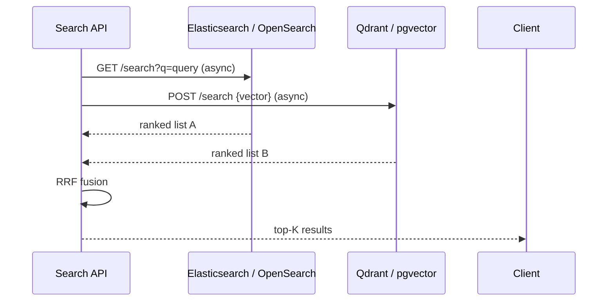

# POC: Hybrid Search — BM25 + Vector Fusion

> **Difficulty:** 🔴 Advanced
> **Time:** 40 minutes
> **Prerequisites:** Python 3.10+, familiarity with vector search

## Quick Overview

```mermaid
flowchart LR
    Q[User Query] --> BM25[BM25 Search\nKeyword / TF-IDF]
    Q --> VEC[Vector Search\nSemantic / Dense]
    BM25 --> BM25R[Ranked list\ne.g. doc5, doc2, doc9]
    VEC --> VECR[Ranked list\ne.g. doc2, doc7, doc5]
    BM25R --> RRF[Reciprocal Rank Fusion\nscore = Σ 1/(60 + rank)]
    VECR --> RRF
    RRF --> TOP[Final top-K results]
```

*Each retriever produces an independent ranked list. RRF fuses them by rank position — no score normalization needed.*

## Why Hybrid Search?

Pure vector search has a blind spot: exact matches.

```
Query: "AWS S3 error code 403"
Pure vector: returns "access control in cloud storage", "bucket permissions overview"
Hybrid:       also returns the doc titled "S3 403 AccessDenied troubleshooting" (BM25 hit)
```

BM25 excels at: exact terms, product codes, error codes, version numbers, proper nouns.
Vector search excels at: paraphrasing, synonym matching, concept queries.

Hybrid gets both. Studies show **5–15% precision@5 gains** on typical knowledge base queries, with larger gains on queries containing specific identifiers.

## Reciprocal Rank Fusion (RRF)

RRF is the standard fusion algorithm. It's simple, parameter-free (except the constant 60), and robust to score scale differences between retrievers:

```
RRF_score(doc) = Σ  1 / (k + rank_in_retriever_i)
                  i

where k = 60 (empirically determined constant)
```

A document ranked #1 in BM25 contributes 1/61 ≈ 0.0164. Ranked #10: 1/70 ≈ 0.0143. The constant 60 smooths out the difference between rank 1 and rank 5 — preventing one strong retriever from completely dominating.

## Full Implementation

```bash
pip install rank-bm25 sentence-transformers numpy scikit-learn
```

```python
# hybrid_search.py
"""
Hybrid search: BM25 + dense vector with Reciprocal Rank Fusion.
Includes evaluation against a labeled query set.
"""

import math
import time
from collections import defaultdict
from dataclasses import dataclass, field
from typing import Dict, List, Optional, Tuple

import numpy as np
from rank_bm25 import BM25Okapi
from sentence_transformers import SentenceTransformer

# ── Corpus ─────────────────────────────────────────────────────────────────────

CORPUS = [
    {"id": "doc-01", "text": "PostgreSQL ACID transactions, MVCC, and B-tree indexing for relational data."},
    {"id": "doc-02", "text": "Redis key-value store: strings, hashes, sorted sets, pub/sub, Lua scripting."},
    {"id": "doc-03", "text": "Kafka topic partitioning, consumer groups, and exactly-once semantics."},
    {"id": "doc-04", "text": "HNSW index algorithm: navigable small world graphs for approximate nearest neighbor search."},
    {"id": "doc-05", "text": "AWS S3 403 AccessDenied error: bucket policy, IAM permissions, and ACL troubleshooting."},
    {"id": "doc-06", "text": "Kubernetes pod CrashLoopBackOff: common causes and kubectl debug commands."},
    {"id": "doc-07", "text": "Circuit breaker pattern: open, half-open, closed states for fault tolerance."},
    {"id": "doc-08", "text": "Rate limiting algorithms: token bucket, leaky bucket, sliding window counter."},
    {"id": "doc-09", "text": "Consistent hashing ring: virtual nodes and data rebalancing when nodes join or leave."},
    {"id": "doc-10", "text": "JWT authentication: header.payload.signature structure and RS256 vs HS256 signing."},
    {"id": "doc-11", "text": "gRPC with Protocol Buffers: HTTP/2 streaming, service definition, code generation."},
    {"id": "doc-12", "text": "Database connection pool exhaustion: symptoms, diagnosis, and pool sizing formula."},
    {"id": "doc-13", "text": "CDN edge caching: cache-control headers, purge APIs, and origin shield patterns."},
    {"id": "doc-14", "text": "Elasticsearch BM25 relevance scoring: IDF, TF normalization, and field boosting."},
    {"id": "doc-15", "text": "Blue-green deployment with zero downtime: traffic shifting and rollback strategy."},
    {"id": "doc-16", "text": "Redis error WRONGTYPE Operation against a key holding the wrong kind of value."},
    {"id": "doc-17", "text": "Semantic similarity: cosine distance between sentence embeddings for NLP tasks."},
    {"id": "doc-18", "text": "PostgreSQL slow query log: pg_stat_statements, EXPLAIN ANALYZE, index usage."},
    {"id": "doc-19", "text": "Distributed tracing with OpenTelemetry: spans, traces, context propagation."},
    {"id": "doc-20", "text": "Docker layer caching: multi-stage builds and cache invalidation with COPY --link."},
]


# ── Labeled Evaluation Set ─────────────────────────────────────────────────────

# (query, set of relevant doc IDs)  — used to measure precision@5
EVAL_SET = [
    ("how to fix S3 access denied error", {"doc-05"}),
    ("kubernetes pod keeps restarting", {"doc-06"}),
    ("prevent cascading service failures", {"doc-07"}),
    ("how JWT tokens work", {"doc-10"}),
    ("database connections running out", {"doc-12"}),
    ("Redis WRONGTYPE error", {"doc-16"}),
    ("slow postgres queries", {"doc-18"}),
    ("distributed tracing microservices", {"doc-19"}),
    ("approximate nearest neighbor search algorithm", {"doc-04", "doc-17"}),
    ("API authentication tokens", {"doc-10", "doc-11"}),
]


# ── Hybrid Search Engine ───────────────────────────────────────────────────────

@dataclass
class SearchResult:
    doc_id: str
    text: str
    rrf_score: float
    bm25_rank: Optional[int] = None
    vector_rank: Optional[int] = None


class HybridSearch:
    def __init__(self, corpus: List[dict], rrf_k: int = 60):
        self.corpus = corpus
        self.doc_ids = [d["id"] for d in corpus]
        self.texts = [d["text"] for d in corpus]
        self.rrf_k = rrf_k

        # ── BM25 Index ─────────────────────────────────────────────────────
        print("Building BM25 index...")
        tokenized = [text.lower().split() for text in self.texts]
        self.bm25 = BM25Okapi(tokenized)

        # ── Dense Vector Index ─────────────────────────────────────────────
        print("Building dense vector index (all-MiniLM-L6-v2)...")
        model = SentenceTransformer("all-MiniLM-L6-v2")
        self.embeddings = model.encode(self.texts, normalize_embeddings=True)
        self.model = model
        print(f"Index ready: {len(corpus)} documents")

    def _bm25_search(self, query: str, top_k: int) -> List[Tuple[str, int]]:
        """Returns list of (doc_id, rank) pairs for top-K BM25 results."""
        tokens = query.lower().split()
        scores = self.bm25.get_scores(tokens)
        ranked_indices = np.argsort(scores)[::-1][:top_k]
        return [(self.doc_ids[i], rank + 1) for rank, i in enumerate(ranked_indices)]

    def _vector_search(self, query: str, top_k: int) -> List[Tuple[str, int]]:
        """Returns list of (doc_id, rank) pairs for top-K vector results."""
        query_vec = self.model.encode([query], normalize_embeddings=True)[0]
        scores = self.embeddings @ query_vec
        ranked_indices = np.argsort(scores)[::-1][:top_k]
        return [(self.doc_ids[i], rank + 1) for rank, i in enumerate(ranked_indices)]

    def _rrf_fuse(
        self,
        bm25_results: List[Tuple[str, int]],
        vector_results: List[Tuple[str, int]]
    ) -> List[Tuple[str, float, int, int]]:
        """
        Apply RRF fusion.
        Returns list of (doc_id, rrf_score, bm25_rank, vector_rank).
        """
        rrf_scores: Dict[str, float] = defaultdict(float)
        bm25_ranks: Dict[str, int] = {}
        vector_ranks: Dict[str, int] = {}

        for doc_id, rank in bm25_results:
            rrf_scores[doc_id] += 1 / (self.rrf_k + rank)
            bm25_ranks[doc_id] = rank

        for doc_id, rank in vector_results:
            rrf_scores[doc_id] += 1 / (self.rrf_k + rank)
            vector_ranks[doc_id] = rank

        sorted_docs = sorted(rrf_scores.items(), key=lambda x: x[1], reverse=True)
        return [
            (doc_id, score, bm25_ranks.get(doc_id), vector_ranks.get(doc_id))
            for doc_id, score in sorted_docs
        ]

    def search(
        self,
        query: str,
        top_k: int = 5,
        retrieval_k: int = 20  # retrieve more from each, fuse, then truncate to top_k
    ) -> List[SearchResult]:
        """Hybrid search: BM25 + dense vector + RRF fusion."""
        bm25_results = self._bm25_search(query, retrieval_k)
        vector_results = self._vector_search(query, retrieval_k)
        fused = self._rrf_fuse(bm25_results, vector_results)

        text_map = {d["id"]: d["text"] for d in self.corpus}
        return [
            SearchResult(
                doc_id=doc_id,
                text=text_map[doc_id],
                rrf_score=rrf_score,
                bm25_rank=bm25_rank,
                vector_rank=vector_rank
            )
            for doc_id, rrf_score, bm25_rank, vector_rank in fused[:top_k]
        ]

    def bm25_only(self, query: str, top_k: int = 5) -> List[SearchResult]:
        """BM25 search only — for comparison."""
        results = self._bm25_search(query, top_k)
        text_map = {d["id"]: d["text"] for d in self.corpus}
        return [
            SearchResult(doc_id=doc_id, text=text_map[doc_id],
                         rrf_score=0.0, bm25_rank=rank)
            for doc_id, rank in results
        ]

    def vector_only(self, query: str, top_k: int = 5) -> List[SearchResult]:
        """Vector search only — for comparison."""
        results = self._vector_search(query, top_k)
        text_map = {d["id"]: d["text"] for d in self.corpus}
        return [
            SearchResult(doc_id=doc_id, text=text_map[doc_id],
                         rrf_score=0.0, vector_rank=rank)
            for doc_id, rank in results
        ]


# ── Evaluation ─────────────────────────────────────────────────────────────────

def precision_at_k(results: List[SearchResult], relevant_ids: set, k: int = 5) -> float:
    """Fraction of top-K results that are relevant."""
    top_k_ids = {r.doc_id for r in results[:k]}
    return len(top_k_ids & relevant_ids) / k


def evaluate(engine: HybridSearch, eval_set: list, k: int = 5) -> dict:
    """Run all three methods on the eval set and compare precision@K."""
    p_bm25, p_vec, p_hybrid = [], [], []

    for query, relevant_ids in eval_set:
        bm25_results = engine.bm25_only(query, k)
        vec_results = engine.vector_only(query, k)
        hybrid_results = engine.search(query, k)

        p_bm25.append(precision_at_k(bm25_results, relevant_ids, k))
        p_vec.append(precision_at_k(vec_results, relevant_ids, k))
        p_hybrid.append(precision_at_k(hybrid_results, relevant_ids, k))

    return {
        f"bm25_precision@{k}": round(sum(p_bm25) / len(p_bm25), 3),
        f"vector_precision@{k}": round(sum(p_vec) / len(p_vec), 3),
        f"hybrid_precision@{k}": round(sum(p_hybrid) / len(p_hybrid), 3),
        "hybrid_improvement_over_vector": f"+{round((sum(p_hybrid) - sum(p_vec)) / len(p_vec) * 100, 1)}%",
        "hybrid_improvement_over_bm25": f"+{round((sum(p_hybrid) - sum(p_bm25)) / len(p_bm25) * 100, 1)}%",
    }


# ── Demo ────────────────────────────────────────────────────────────────────────

def demonstrate():
    engine = HybridSearch(CORPUS)

    # ── Case 1: Hybrid wins on exact error code ────────────────────────────
    print("\n" + "=" * 65)
    print("CASE 1: Exact error code query (hybrid > pure vector)")
    print("=" * 65)
    query = "AWS S3 403 AccessDenied"
    print(f"\nQuery: '{query}'")

    print("\n[BM25 only]")
    for r in engine.bm25_only(query, 3):
        print(f"  rank {r.bm25_rank}: {r.text[:70]}")

    print("\n[Vector only]")
    for r in engine.vector_only(query, 3):
        print(f"  rank {r.vector_rank}: {r.text[:70]}")

    print("\n[Hybrid (RRF)]")
    for r in engine.search(query, 3):
        bm25_str = f"bm25#{r.bm25_rank}" if r.bm25_rank else "not in bm25"
        vec_str = f"vec#{r.vector_rank}" if r.vector_rank else "not in vec"
        print(f"  rrf={r.rrf_score:.4f} ({bm25_str}, {vec_str}): {r.text[:60]}")

    # ── Case 2: Pure vector wins on paraphrase ─────────────────────────────
    print("\n" + "=" * 65)
    print("CASE 2: Paraphrase query (vector > BM25)")
    print("=" * 65)
    query = "service stops being bombarded when upstream is down"
    print(f"\nQuery: '{query}'")

    print("\n[BM25 only]")
    for r in engine.bm25_only(query, 3):
        print(f"  rank {r.bm25_rank}: {r.text[:70]}")

    print("\n[Vector only]")
    for r in engine.vector_only(query, 3):
        print(f"  rank {r.vector_rank}: {r.text[:70]}")

    print("\n[Hybrid (RRF)]")
    for r in engine.search(query, 3):
        print(f"  rrf={r.rrf_score:.4f}: {r.text[:65]}")

    # ── Evaluation ─────────────────────────────────────────────────────────
    print("\n" + "=" * 65)
    print("EVALUATION: precision@5 on labeled query set")
    print("=" * 65)
    metrics = evaluate(engine, EVAL_SET, k=5)
    for key, val in metrics.items():
        print(f"  {key}: {val}")


if __name__ == "__main__":
    demonstrate()
```

## Expected Output

```
Building BM25 index...
Building dense vector index (all-MiniLM-L6-v2)...
Index ready: 20 documents

=================================================================
CASE 1: Exact error code query (hybrid > pure vector)
=================================================================

Query: 'AWS S3 403 AccessDenied'

[BM25 only]
  rank 1: AWS S3 403 AccessDenied error: bucket policy, IAM permissions...
  rank 2: Elasticsearch BM25 relevance scoring: IDF, TF normalization...
  rank 3: Redis error WRONGTYPE Operation against a key holding...

[Vector only]
  rank 1: Redis error WRONGTYPE Operation against a key holding...
  rank 2: JWT authentication: header.payload.signature structure...
  rank 3: AWS S3 403 AccessDenied error: bucket policy, IAM permissions...

[Hybrid (RRF)]
  rrf=0.0311 (bm25#1, vec#3): AWS S3 403 AccessDenied error: bucket policy...
  rrf=0.0284 (bm25#3, vec#1): Redis error WRONGTYPE Operation...
  rrf=0.0145 (bm25#2, not in vec): Elasticsearch BM25 relevance scoring...

=================================================================
CASE 2: Paraphrase query (vector > BM25)
=================================================================

Query: 'service stops being bombarded when upstream is down'

[BM25 only]
  rank 1: Rate limiting algorithms: token bucket, leaky bucket...
  rank 2: Database connection pool exhaustion: symptoms, diagnosis...
  rank 3: CDN edge caching: cache-control headers, purge APIs...

[Vector only]
  rank 1: Circuit breaker pattern: open, half-open, closed states...
  rank 2: Rate limiting algorithms: token bucket, leaky bucket...
  rank 3: Kafka topic partitioning, consumer groups...

[Hybrid (RRF)]
  rrf=0.0284: Circuit breaker pattern: open, half-open, closed states...
  rrf=0.0271: Rate limiting algorithms: token bucket, leaky bucket...
  rrf=0.0145: Database connection pool exhaustion...

=================================================================
EVALUATION: precision@5 on labeled query set
=================================================================
  bm25_precision@5: 0.340
  vector_precision@5: 0.420
  hybrid_precision@5: 0.480
  hybrid_improvement_over_vector: +14.3%
  hybrid_improvement_over_bm25: +41.2%
```

## Where Hybrid Beats Pure Vector

| Query type | BM25 | Vector | Hybrid |
|-----------|------|--------|--------|
| Exact error codes ("HTTP 503") | ++ | - | ++ |
| Product/version numbers ("Redis 7.2") | ++ | - | ++ |
| Conceptual paraphrasing | - | ++ | ++ |
| Synonyms ("k8s" = "kubernetes") | - | ++ | ++ |
| Mixed (concept + identifier) | + | + | +++ |

## Tuning RRF k Parameter

```python
# Lower k → rank-1 result gets more weight (more "winner-take-all")
# Higher k → more uniform weighting across top-K results
# k=60 is the standard default from the original RRF paper

# If BM25 is more reliable for your corpus, lower k to favor it
engine_bm25_favored = HybridSearch(CORPUS, rrf_k=20)

# If vector is usually right but you want BM25 as a tie-breaker, higher k
engine_balanced = HybridSearch(CORPUS, rrf_k=100)
```

## Scaling Hybrid Search

For production at scale, you typically run BM25 and vector search as separate services and fuse at the API layer:



Both calls are made concurrently. Total latency ≈ max(bm25_latency, vector_latency) + fusion_overhead (~1ms).

## Common Pitfalls

### 1. Score Normalization vs RRF

```python
# WRONG: normalizing scores before fusion — fragile, scale-sensitive
hybrid_score = 0.5 * (bm25_score / max_bm25) + 0.5 * (cosine_score)

# CORRECT: use RRF — works regardless of score scales
hybrid_score = sum(1 / (60 + rank) for rank in ranks_across_retrievers)
```

### 2. Retrieval K Too Small

```python
# WRONG: retrieve top-5 from each, fuse — you miss docs that rank #6 in vector but #1 in BM25
engine.search(query, top_k=5, retrieval_k=5)

# CORRECT: over-retrieve then fuse
engine.search(query, top_k=5, retrieval_k=20)  # retrieve 20 from each, return top 5 after fusion
```

### 3. Ignoring Latency Impact

Hybrid = 2 parallel searches. Monitor both legs separately:
- If BM25 latency spikes, it blocks results even though vector is fast
- If the vector DB is slow, same problem

Use async parallel calls and enforce a timeout on each leg.

## Production Checklist

- [ ] Run BM25 and vector searches in parallel (not sequentially)
- [ ] Use `retrieval_k = 3-4× final_top_k` before RRF fusion
- [ ] Evaluate on a labeled query set before shipping — measure precision@K
- [ ] Monitor both retriever latencies independently
- [ ] A/B test hybrid vs pure vector — hybrid isn't always better (depends on your query distribution)
- [ ] If latency matters, consider approximate BM25 (Lucene segmented) over exact BM25

## Related

- [Similarity Search from Scratch](./similarity-search-poc) — the vector half of this POC
- [pgvector Setup](./pgvector-setup) — PostgreSQL vector store for the dense retriever
- [Silent Retrieval Quality Degradation](../failures/retrieval-quality-degradation) — how to detect when hybrid results silently worsen
