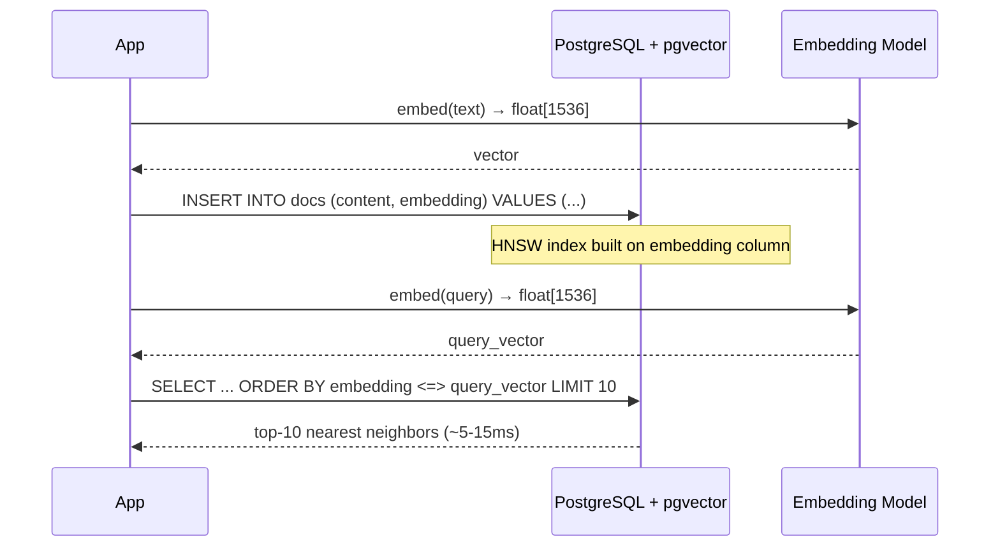

# POC: pgvector — Vector Search in PostgreSQL

> **Difficulty:** 🟡 Intermediate
> **Time:** 30 minutes
> **Prerequisites:** Docker, PostgreSQL basics, Python

## Quick Overview



*pgvector adds a native `vector` type and ANN index to PostgreSQL — no separate vector DB needed.*

## What You'll Learn

**pgvector** brings vector similarity search directly into PostgreSQL. Instead of maintaining a separate Pinecone or Qdrant instance, you store embeddings alongside your relational data and query them with standard SQL.

When to choose pgvector over a dedicated vector DB:
- Your vector count is under 5–10M and your team already runs Postgres
- You need JOIN vectors with relational filters in the same transaction
- Operational simplicity matters more than raw ANN throughput
- You want ACID guarantees across your embeddings and metadata

## Setup

### Docker Compose

```yaml
# docker-compose.yml
version: '3.8'
services:
  postgres:
    image: pgvector/pgvector:pg16
    ports:
      - "5432:5432"
    environment:
      POSTGRES_USER: demo
      POSTGRES_PASSWORD: demo
      POSTGRES_DB: vectordemo
    volumes:
      - pgdata:/var/lib/postgresql/data

volumes:
  pgdata:
```

```bash
docker-compose up -d
```

### Enable the Extension

```sql
-- Connect to the database and enable pgvector
CREATE EXTENSION IF NOT EXISTS vector;

-- Verify
SELECT * FROM pg_extension WHERE extname = 'vector';
```

## Schema Design

```sql
-- Documents table with a 1536-dimension embedding column
-- 1536 = OpenAI text-embedding-3-small / ada-002 output size
CREATE TABLE documents (
    id          BIGSERIAL PRIMARY KEY,
    content     TEXT         NOT NULL,
    source      VARCHAR(255),
    created_at  TIMESTAMPTZ  DEFAULT NOW(),
    embedding   vector(1536) NOT NULL
);

-- For metadata filtering: add a GIN index on source
CREATE INDEX ON documents (source);

-- HNSW index for approximate nearest neighbor search
-- ef_construction: quality of graph build (higher = better recall, slower build)
-- m: number of bidirectional links per node (higher = better recall, more RAM)
CREATE INDEX ON documents
  USING hnsw (embedding vector_cosine_ops)
  WITH (m = 16, ef_construction = 64);

-- Alternative: IVFFlat (faster build, lower memory, slightly worse recall)
-- CREATE INDEX ON documents
--   USING ivfflat (embedding vector_cosine_ops)
--   WITH (lists = 100);
```

### Index Parameter Guide

| Parameter | Conservative | Balanced | High Recall |
|-----------|-------------|---------|-------------|
| `m` | 8 | 16 | 32 |
| `ef_construction` | 32 | 64 | 128 |
| RAM per 1M 1536d vectors | ~4 GB | ~6 GB | ~10 GB |
| Index build time (1M rows) | ~5 min | ~12 min | ~25 min |
| Recall@10 | ~92% | ~96% | ~99% |

## Inserting Embeddings

### Python Setup

```bash
pip install psycopg2-binary openai numpy
```

```python
# insert_embeddings.py
import psycopg2
import openai
import numpy as np
from typing import List

openai.api_key = "your-api-key"

conn = psycopg2.connect(
    host="localhost", port=5432,
    dbname="vectordemo", user="demo", password="demo"
)

def embed(texts: List[str]) -> List[List[float]]:
    """Batch embed up to 2048 texts per call."""
    response = openai.embeddings.create(
        model="text-embedding-3-small",
        input=texts
    )
    return [item.embedding for item in response.data]

def insert_documents(documents: List[dict]):
    """Insert documents with their embeddings."""
    texts = [d["content"] for d in documents]
    vectors = embed(texts)

    with conn.cursor() as cur:
        for doc, vector in zip(documents, vectors):
            cur.execute(
                """
                INSERT INTO documents (content, source, embedding)
                VALUES (%s, %s, %s)
                """,
                (doc["content"], doc.get("source"), vector)
            )
    conn.commit()
    print(f"Inserted {len(documents)} documents")

# Sample data
sample_docs = [
    {"content": "PostgreSQL supports ACID transactions and complex queries.", "source": "db-docs"},
    {"content": "Redis is an in-memory key-value store used for caching.", "source": "db-docs"},
    {"content": "Kafka is a distributed event streaming platform.", "source": "messaging-docs"},
    {"content": "Docker containers package applications with their dependencies.", "source": "infra-docs"},
    {"content": "Kubernetes orchestrates containerized workloads at scale.", "source": "infra-docs"},
    {"content": "Vector databases store high-dimensional embeddings for similarity search.", "source": "db-docs"},
    {"content": "HNSW (Hierarchical Navigable Small World) is a graph-based ANN algorithm.", "source": "db-docs"},
    {"content": "Cosine similarity measures the angle between two vectors.", "source": "ml-docs"},
    {"content": "Load balancers distribute traffic across multiple backend servers.", "source": "infra-docs"},
    {"content": "Rate limiting protects APIs from abuse and prevents overload.", "source": "infra-docs"},
]

insert_documents(sample_docs)
```

## Querying

### Similarity Operators

pgvector provides three distance operators:

```sql
-- <->  L2 distance (Euclidean) — good for spatial data
SELECT content, embedding <-> '[0.1, 0.2, ...]'::vector AS distance
FROM documents ORDER BY distance LIMIT 5;

-- <=>  Cosine distance — best for text embeddings (unit vectors)
SELECT content, embedding <=> '[0.1, 0.2, ...]'::vector AS distance
FROM documents ORDER BY distance LIMIT 5;

-- <#>  Negative inner product — when vectors are already normalized
SELECT content, (embedding <#> '[0.1, 0.2, ...]'::vector) * -1 AS score
FROM documents ORDER BY score DESC LIMIT 5;
```

### Full Query Example (Python)

```python
# query_documents.py
def search(query: str, top_k: int = 5, source_filter: str = None) -> list:
    """
    Semantic search over documents.
    Optionally filter by source (uses relational index, fast).
    """
    query_vector = embed([query])[0]

    # Build query — combine vector ANN with relational filter
    if source_filter:
        sql = """
            SELECT id, content, source,
                   1 - (embedding <=> %s::vector) AS similarity
            FROM documents
            WHERE source = %s
            ORDER BY embedding <=> %s::vector
            LIMIT %s
        """
        params = (query_vector, source_filter, query_vector, top_k)
    else:
        sql = """
            SELECT id, content, source,
                   1 - (embedding <=> %s::vector) AS similarity
            FROM documents
            ORDER BY embedding <=> %s::vector
            LIMIT %s
        """
        params = (query_vector, query_vector, top_k)

    with conn.cursor() as cur:
        cur.execute(sql, params)
        rows = cur.fetchall()

    return [
        {"id": r[0], "content": r[1], "source": r[2], "similarity": float(r[3])}
        for r in rows
    ]

# Run searches
print("Query: 'How does database indexing work?'")
results = search("How does database indexing work?", top_k=3)
for r in results:
    print(f"  [{r['similarity']:.3f}] {r['content'][:80]}")

print("\nQuery: 'container orchestration' (infra-docs only)")
results = search("container orchestration", top_k=3, source_filter="infra-docs")
for r in results:
    print(f"  [{r['similarity']:.3f}] {r['content'][:80]}")
```

### Expected Output

```
Query: 'How does database indexing work?'
  [0.891] HNSW (Hierarchical Navigable Small World) is a graph-based ANN algorithm.
  [0.847] Vector databases store high-dimensional embeddings for similarity search.
  [0.823] PostgreSQL supports ACID transactions and complex queries.

Query: 'container orchestration' (infra-docs only)
  [0.934] Kubernetes orchestrates containerized workloads at scale.
  [0.812] Docker containers package applications with their dependencies.
  [0.731] Load balancers distribute traffic across multiple backend servers.
```

## Performance at Scale

### Benchmarks: 1M vectors (1536d), m=16, ef_construction=64

| Operation | Time | Notes |
|-----------|------|-------|
| Index build | ~12 min | One-time cost; online (non-blocking) in PG 16 |
| ANN query (no filter) | 5–15 ms p99 | ef_search=40 (default) |
| ANN query (with WHERE filter) | 15–40 ms p99 | Pre-filtering degrades ANN quality |
| Exact KNN (no index) | 800–2000 ms | seq scan over all vectors |
| INSERT (with index maintenance) | 2–5 ms each | HNSW insert is O(log n) |

### Controlling Query-Time Recall vs Speed

```sql
-- Increase ef_search to trade speed for higher recall
-- Default is 40; bump to 100 for high-recall use cases
SET hnsw.ef_search = 100;

SELECT content, 1 - (embedding <=> %s::vector) AS similarity
FROM documents
ORDER BY embedding <=> %s::vector
LIMIT 10;
```

## When to Choose pgvector vs Dedicated Vector DB

| Criterion | pgvector | Dedicated (Qdrant, Pinecone, Weaviate) |
|-----------|----------|----------------------------------------|
| Vector count | Up to ~10M | 10M–1B+ |
| Team expertise | Postgres devs | Willing to operate new infra |
| JOIN with relational data | Native SQL | Requires application-layer join |
| Filtering semantics | Standard WHERE | Payload filters (varies by product) |
| Operational overhead | Same as Postgres | Additional DB to operate/monitor |
| Horizontal scaling | Limited (Citus) | Built-in sharding |
| Disk-based index | Not yet | DiskANN available (Qdrant, Weaviate) |

## Common Pitfalls

### 1. Index Not Used Due to Pre-Filter

```sql
-- WRONG: Postgres may skip HNSW index when WHERE is very selective
SELECT content FROM documents
WHERE source = 'rare-source'   -- filters to 50 rows first
ORDER BY embedding <=> $1::vector LIMIT 5;
-- pgvector falls back to seq scan over 50 rows — fine here, but
-- can force exact KNN unexpectedly at larger filter sizes

-- BETTER: Use partitioning if you always filter by a specific column
-- Or increase hnsw.ef_search when filtering
```

### 2. Storing Embeddings as JSON/TEXT

```sql
-- WRONG: Storing as text or JSON loses all index benefits
embedding_json TEXT  -- forces full serialization/deserialization

-- CORRECT: Use the native vector type
embedding vector(1536)
```

### 3. Forgetting to Normalize Before Inner Product

```python
# If using <#> (inner product), normalize first for cosine-equivalent results
import numpy as np

def normalize(v: List[float]) -> List[float]:
    arr = np.array(v)
    return (arr / np.linalg.norm(arr)).tolist()

# OpenAI embeddings are already normalized — skip this step for them
```

## Run the Full POC

```bash
# Start Postgres with pgvector
docker-compose up -d

# Install Python dependencies
pip install psycopg2-binary openai numpy

# Set your API key
export OPENAI_API_KEY=your-key-here

# Insert sample documents
python insert_embeddings.py

# Run similarity queries
python query_documents.py
```

## Production Checklist

- [ ] Pin `pgvector` version in Docker image (breaking changes between minor versions)
- [ ] Set `hnsw.ef_search` at query time for recall/speed tuning
- [ ] Monitor `pg_relation_size` on the HNSW index — should grow ~linearly with vector count
- [ ] Use `VACUUM` regularly; soft-deleted rows cause index graph bloat
- [ ] Keep at least 2× HNSW index size free in RAM (index is entirely RAM-resident)
- [ ] Use `asyncpg` instead of `psycopg2` for high-concurrency workloads

## Related

- [Similarity Search from Scratch](./similarity-search-poc) — understand what pgvector does under the hood
- [Embedding Ingestion Pipeline](./embedding-pipeline) — batch-insert at scale with deduplication
- [Index Staleness](../failures/index-staleness) — what happens when you delete many vectors
