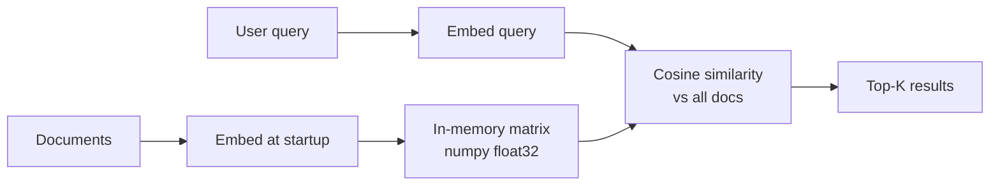

# POC: Semantic Similarity Search from Scratch

> **Difficulty:** 🟢 Beginner
> **Time:** 20 minutes
> **Prerequisites:** Python 3.10+, pip

## Quick Overview



*No database, no framework — just embeddings and numpy. This POC shows exactly what vector databases do under the hood.*

## What You'll Build

A semantic search engine over 20 documents in ~80 lines of Python. The key insight: two semantically similar sentences produce vectors that point in nearly the same direction, so measuring the angle between them (cosine similarity) finds meaning — not just shared keywords.

## Why This Matters

Keyword search fails when query and document use different words for the same concept:

| Query | Keyword Match | Semantic Match |
|-------|--------------|----------------|
| "How do I store user sessions?" | Returns docs containing "session" | Also returns "cookie-based auth", "JWT storage" |
| "k8s deployment failed" | Misses docs saying "pod not starting" | Finds all "Kubernetes troubleshooting" docs |
| "fast database" | Needs exact word "fast" | Finds "low-latency DB", "high-throughput storage" |

## The ~80-Line Implementation

```python
# semantic_search.py
"""
Semantic similarity search from scratch.
No vector DB, no framework — just sentence-transformers + numpy.
"""

import numpy as np
from sentence_transformers import SentenceTransformer
from typing import List, Tuple

# ── 1. Sample document corpus ─────────────────────────────────────────────────
DOCUMENTS = [
    "PostgreSQL supports ACID transactions and complex SQL queries.",
    "Redis is an in-memory key-value store commonly used for caching.",
    "Kafka is a distributed event streaming platform for high-throughput pipelines.",
    "Docker packages applications into portable containers with all dependencies.",
    "Kubernetes orchestrates containerized workloads and handles autoscaling.",
    "HNSW is a graph-based approximate nearest neighbor algorithm used in vector search.",
    "Cosine similarity measures the angle between two vectors, not their magnitude.",
    "Load balancers distribute incoming requests across multiple backend servers.",
    "Rate limiting controls how many requests a client can make per time window.",
    "Sharding splits a database horizontally across multiple nodes by a partition key.",
    "Replication copies data from a primary node to one or more replicas for redundancy.",
    "An API gateway is a single entry point that handles auth, routing, and rate limiting.",
    "Circuit breakers stop cascading failures by temporarily blocking failing services.",
    "Content delivery networks cache static assets close to end users worldwide.",
    "gRPC uses Protocol Buffers and HTTP/2 for fast, strongly typed RPC between services.",
    "JWT tokens encode claims in a signed payload that clients present for authentication.",
    "Blue-green deployments maintain two identical production environments for zero-downtime releases.",
    "Consistent hashing minimizes data movement when adding or removing nodes from a cluster.",
    "Message queues decouple producers and consumers, allowing async processing at different rates.",
    "Bloom filters are probabilistic data structures that test set membership with no false negatives.",
]


# ── 2. Index: embed all documents at startup ──────────────────────────────────
class SemanticSearch:
    def __init__(self, model_name: str = "all-MiniLM-L6-v2"):
        """
        all-MiniLM-L6-v2: 384d, 80MB download, runs on CPU.
        For higher quality use 'all-mpnet-base-v2' (768d, 420MB).
        """
        print(f"Loading model: {model_name}")
        self.model = SentenceTransformer(model_name)

        print(f"Embedding {len(DOCUMENTS)} documents...")
        # Shape: (num_docs, embedding_dim) — float32
        self.doc_embeddings = self.model.encode(
            DOCUMENTS,
            normalize_embeddings=True,  # unit vectors → cosine sim = dot product
            show_progress_bar=True
        )
        print(f"Index ready: {self.doc_embeddings.shape}")

    def search(self, query: str, top_k: int = 5) -> List[Tuple[float, str]]:
        """
        Embed query, compute cosine similarity against all doc vectors,
        return top-K (score, text) pairs.
        """
        # Embed and normalize the query
        query_vec = self.model.encode([query], normalize_embeddings=True)[0]  # (dim,)

        # Cosine similarity: dot product of unit vectors
        # scores shape: (num_docs,)
        scores = self.doc_embeddings @ query_vec  # matrix-vector multiply

        # Get indices of top-K scores (descending)
        top_indices = np.argsort(scores)[::-1][:top_k]

        return [(float(scores[i]), DOCUMENTS[i]) for i in top_indices]


# ── 3. Demo ────────────────────────────────────────────────────────────────────
def run_demo():
    engine = SemanticSearch()
    print()

    queries = [
        "How do I store user sessions securely?",
        "My k8s pod keeps crashing",
        "What prevents one slow service from taking everything down?",
        "How do databases stay available if one server dies?",
        "I need to send events between microservices",
    ]

    for query in queries:
        print(f"Query: '{query}'")
        results = engine.search(query, top_k=3)
        for rank, (score, text) in enumerate(results, 1):
            print(f"  {rank}. [{score:.3f}] {text}")
        print()

    # ── Semantic vs keyword comparison ────────────────────────────────────────
    print("=" * 60)
    print("SEMANTIC vs KEYWORD COMPARISON")
    print("=" * 60)

    query = "fast in-memory lookup"

    print(f"\nQuery: '{query}'")

    # Keyword match: check if any query word appears in the document
    query_words = set(query.lower().split())
    print("\nKeyword matches (any query word in doc):")
    keyword_hits = [doc for doc in DOCUMENTS if query_words & set(doc.lower().split())]
    if keyword_hits:
        for doc in keyword_hits:
            print(f"  - {doc}")
    else:
        print("  (no matches)")

    # Semantic match
    print("\nSemantic matches:")
    for score, text in engine.search(query, top_k=3):
        print(f"  [{score:.3f}] {text}")


if __name__ == "__main__":
    run_demo()
```

## Install and Run

```bash
# Install dependencies (no Docker needed)
pip install sentence-transformers numpy

# Run the demo (first run downloads ~80MB model)
python semantic_search.py
```

## Expected Output

```
Loading model: all-MiniLM-L6-v2
Embedding 20 documents...
Index ready: (20, 384)

Query: 'How do I store user sessions securely?'
  1. [0.612] JWT tokens encode claims in a signed payload that clients present for authentication.
  2. [0.487] Redis is an in-memory key-value store commonly used for caching.
  3. [0.431] An API gateway is a single entry point that handles auth, routing, and rate limiting.

Query: 'My k8s pod keeps crashing'
  1. [0.731] Kubernetes orchestrates containerized workloads and handles autoscaling.
  2. [0.584] Docker packages applications into portable containers with all dependencies.
  3. [0.421] Blue-green deployments maintain two identical production environments...

Query: "What prevents one slow service from taking everything down?"
  1. [0.743] Circuit breakers stop cascading failures by temporarily blocking failing services.
  2. [0.512] Rate limiting controls how many requests a client can make per time window.
  3. [0.401] Load balancers distribute incoming requests across multiple backend servers.

============================================================
SEMANTIC vs KEYWORD COMPARISON
============================================================

Query: 'fast in-memory lookup'

Keyword matches (any query word in doc):
  (no matches)

Semantic matches:
  [0.691] Redis is an in-memory key-value store commonly used for caching.
  [0.578] HNSW is a graph-based approximate nearest neighbor algorithm used in vector search.
  [0.421] PostgreSQL supports ACID transactions and complex SQL queries.
```

The keyword search returned zero results. The semantic search correctly identified Redis — without the query containing "Redis", "key-value", or "store".

## How Cosine Similarity Works

```python
# The math behind engine.search() — expanded for clarity
def cosine_similarity_explained(vec_a: np.ndarray, vec_b: np.ndarray) -> float:
    """
    cos(theta) = (A · B) / (|A| * |B|)

    If vectors are already unit-normalized (|A| = |B| = 1):
    cos(theta) = A · B   ← just a dot product

    Range: -1 (opposite) to 1 (identical direction)
    For text embeddings, practical range is ~0.2 (unrelated) to ~0.99 (nearly identical)
    """
    dot_product = np.dot(vec_a, vec_b)
    magnitudes = np.linalg.norm(vec_a) * np.linalg.norm(vec_b)
    return dot_product / magnitudes

# With pre-normalized vectors (what sentence-transformers returns with normalize=True):
# cosine_sim(a, b) == np.dot(a, b)
# This is why the batched version (matrix @ vector) is fast — pure BLAS matmul
```

## Extend to a FastAPI Endpoint

```python
# api.py — add this to serve the engine over HTTP
from fastapi import FastAPI
from pydantic import BaseModel

app = FastAPI()
engine = SemanticSearch()  # loaded at startup

class SearchRequest(BaseModel):
    query: str
    top_k: int = 5

@app.post("/search")
def search(req: SearchRequest):
    results = engine.search(req.query, req.top_k)
    return {
        "query": req.query,
        "results": [{"score": score, "text": text} for score, text in results]
    }
```

```bash
pip install fastapi uvicorn
uvicorn api:app --reload
# POST http://localhost:8000/search
# {"query": "prevent cascading failures", "top_k": 3}
```

## Scalability Limits of This Approach

| Vector count | Search time (numpy, CPU) | Memory |
|-------------|--------------------------|--------|
| 1,000 | <1 ms | 1.5 MB |
| 100,000 | ~10 ms | 150 MB |
| 1,000,000 | ~100 ms | 1.5 GB |
| 10,000,000 | ~1,000 ms | 15 GB |

At 100K+ vectors, numpy sequential scan becomes too slow. This is exactly why vector databases use ANN indexes (HNSW, IVFFlat) — they trade a small amount of recall for 10–100× query speedup. See [pgvector Setup](./pgvector-setup) for the next step.

## Key Takeaways

- Vector search = embed everything → store vectors → embed query → find nearest vectors
- Cosine similarity on unit vectors = dot product — fast with numpy/BLAS
- Semantic search finds meaning even when words differ; keyword search requires exact matches
- This in-memory approach works up to ~50K docs; beyond that, use an ANN index
- The model choice matters more than the search algorithm: a better embedding model improves all queries

## Related

- [pgvector Setup](./pgvector-setup) — scale this to millions of vectors with an HNSW index
- [Hybrid Search](./hybrid-search-poc) — combine this semantic approach with BM25 for keyword precision
- [Embedding Ingestion Pipeline](./embedding-pipeline) — batch-embed a large corpus efficiently
