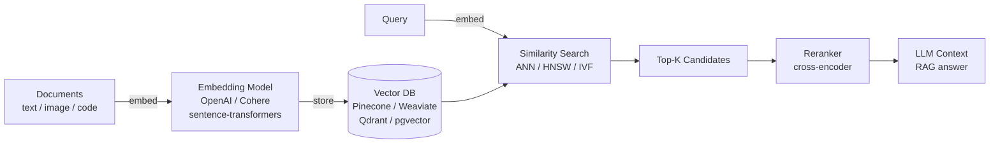

# Vector Databases

Traditional databases answer exact questions: "give me all users where id = 42." Vector databases answer approximate questions: "give me the 10 documents most semantically similar to this query." That shift — from exact lookup to nearest-neighbor search in high-dimensional space — is what makes vector databases the backbone of modern AI-powered search, RAG pipelines, recommendation engines, and anomaly detection.



## What Is a Vector Database?

A vector database stores, indexes, and queries **dense float vectors** (embeddings). Each embedding is a fixed-length array of floats — typically 768 to 3072 dimensions — that encodes the semantic meaning of a piece of data (text, image, audio, code).

```
"The cat sat on the mat"  →  [0.21, -0.84, 0.13, ..., 0.67]  (1536 dimensions)
"A feline rested on the rug" →  [0.19, -0.81, 0.15, ..., 0.65]  (1536 dimensions)
```

The two vectors above are close together in 1536-dimensional space — cosine similarity ~0.97 — even though no words overlap. That's the core superpower.

## The Vector Search Stack

Every production vector search system passes data through the same four stages:

```
┌──────────────────────────────────────────────────────────┐
│                   Vector Search Stack                    │
│                                                          │
│  1. Embedding Model                                      │
│     text/image/code → dense float vector                 │
│     (OpenAI, Cohere, sentence-transformers, nomic)       │
│                          │                               │
│  2. Vector Index                                         │
│     organize millions of vectors for fast search         │
│     (HNSW, IVF, FLAT — stored in Qdrant/Pinecone/etc)   │
│                          │                               │
│  3. ANN Search                                           │
│     approximate nearest neighbor: find top-K candidates  │
│     (trade recall for speed via ef_search, nprobe)       │
│                          │                               │
│  4. Reranking (optional)                                 │
│     cross-encoder rescores top-100 → top-5               │
│     (Cohere Rerank, bge-reranker-large)                  │
└──────────────────────────────────────────────────────────┘
```

## When You Need a Vector Database

You need one when your search or retrieval problem is **semantic**, not exact:

| Use Case | Why Vector Search |
|----------|------------------|
| RAG (Retrieval-Augmented Generation) | Find relevant doc chunks by meaning, not keywords |
| Semantic search | "find articles about dog training" matches "canine obedience" |
| Recommendation | "find items similar to what this user bought" |
| Duplicate detection | Find near-duplicate content at scale |
| Anomaly detection | Find vectors far from their cluster centroid |
| Image/audio similarity | Find visually similar images or matching audio clips |
| Code search | Find functions that do the same thing as this query |

**You do NOT need a vector database if**: you only need exact-match lookup, full-text keyword search (use Elasticsearch/Postgres full-text), or your dataset is under ~10k items (a simple in-memory brute-force scan is fine).

## Learning Path

Start with what embeddings are, learn how they get indexed efficiently, understand the similarity search mechanics, then layer in the production concerns (hybrid search, reranking, database choice):

| Article | Level | What You'll Learn |
|---------|-------|------------------|
| [Embeddings](/15-vector-databases/concepts/embeddings) | 🟢 Beginner | What dense vectors are, how embedding models work |
| [Vector Index Algorithms](/15-vector-databases/concepts/vector-index) | 🔴 Advanced | HNSW, IVF, FLAT — the math behind fast ANN search |
| [Similarity Search](/15-vector-databases/concepts/similarity-search) | 🟡 Intermediate | Distance metrics, recall@K, ef_search tuning |
| [Hybrid Search](/15-vector-databases/concepts/hybrid-search) | 🟡 Intermediate | Dense + sparse (BM25) fusion with RRF |
| [Reranking](/15-vector-databases/concepts/reranking) | 🟡 Intermediate | Two-stage retrieval: bi-encoder then cross-encoder |
| [Vector DB Comparison](/15-vector-databases/concepts/vector-db-comparison) | 🟡 Intermediate | Pinecone vs Weaviate vs Qdrant vs pgvector vs Chroma |

## Key Mental Models

**Embeddings collapse meaning into coordinates.** Two semantically similar things have nearby coordinates. Retrieval is just geometry — finding the nearest points to a query coordinate.

**Indexing is the bottleneck, not compute.** A brute-force cosine similarity scan over 10M vectors takes seconds. HNSW finds the same answer in milliseconds. The index structure is why vector DBs are fast.

**Recall is the primary metric, not speed.** A vector search that's fast but returns wrong results is useless. Tune ef_search / nprobe until recall@10 ≥ 0.95 before optimizing for latency.

**Hybrid almost always beats pure vector.** BM25 catches exact keyword matches (product codes, names, IDs). Vector search catches semantic matches. Combining them with RRF beats either alone in every production benchmark.

**Reranking is cheap precision.** Retrieve 100 candidates cheaply, rerank with a cross-encoder to top 5 accurately. The 50-200ms reranker latency is usually worth the precision gain.
