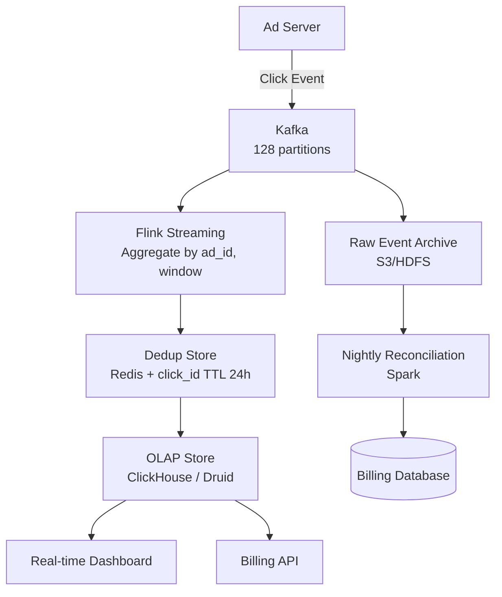
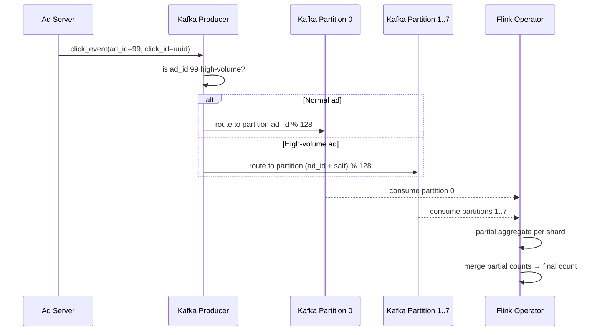
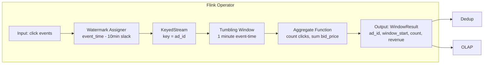
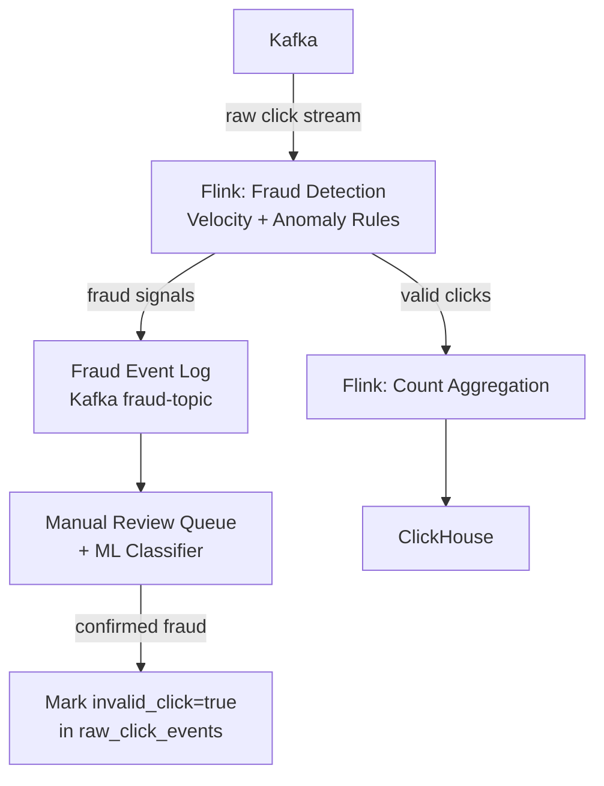
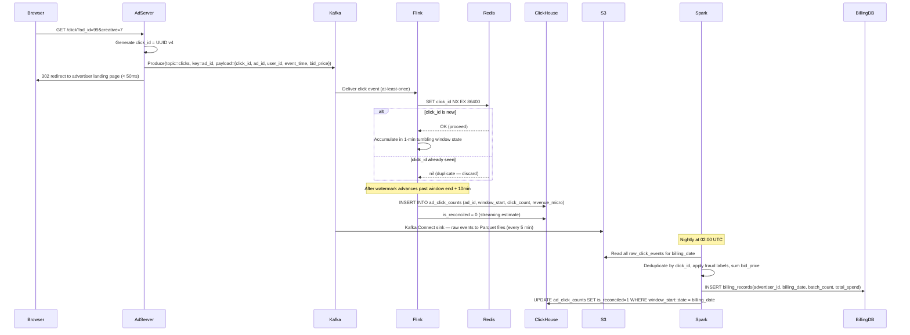
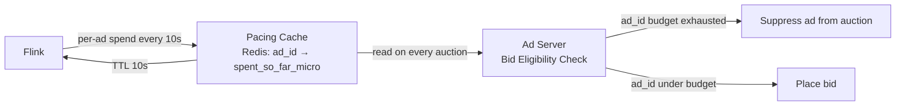

# Design an Ad Click Aggregation System

**Difficulty**: 🔴 Advanced
**Reading Time**: ~20 minutes
**Interview Frequency**: High

---

## The Core Problem

Aggregating 10 billion ad clicks per day with exactly-once semantics for billing accuracy is one of the hardest streaming problems — double-counting a click means charging an advertiser twice; under-counting means lost revenue. Network retries and consumer restarts make duplicates inevitable, requiring idempotency at every stage.

## Functional Requirements

- Record every ad click with advertiser ID, ad ID, user ID, timestamp
- Aggregate clicks per ad per minute/hour/day for billing
- Support real-time dashboard (clicks in last 5 min)
- Detect click fraud (same user clicking same ad repeatedly)

## Non-Functional Requirements

| Requirement | Target |
|-------------|--------|
| Throughput | 10B clicks/day (~116,000 clicks/sec) |
| Billing accuracy | Exactly-once aggregation (0 duplicates) |
| Report latency | < 1 minute for near-real-time reports |
| Data retention | 3 years for billing audit |

## Back-of-Envelope Estimates

- **Click rate**: 10B clicks/day ÷ 86,400 = ~116,000 clicks/sec
- **Raw event size**: 116,000 clicks/sec × 100 bytes = 11.6MB/sec → ~1TB/day raw
- **Dedup window**: Keep click IDs for 24 hours to catch late retries → 10B IDs × 16 bytes = 160GB dedup store

## Key Design Decisions

1. **At-Least-Once + Idempotency vs Exactly-Once** — true exactly-once (Kafka transactions + Flink) has 3-5x overhead; at-least-once delivery + deterministic dedup (click_id → dedup store) achieves same billing accuracy at lower cost.
2. **Watermarking for Late Arrivals** — mobile devices may send click events 10 minutes late after reconnecting; use event-time processing with 10-minute watermark; after watermark passes, finalize aggregation and issue billing record.
3. **Lambda Architecture for Reconciliation** — streaming layer gives fast approximate results; nightly batch reprocessing from raw event log produces authoritative billing figures; if they differ by >0.1%, trigger audit alert.

## High-Level Architecture



## Top Interview Questions for This Problem

| Question | Tests |
|----------|-------|
| How do you ensure an ad click is counted exactly once when the network can retry? | Idempotency, dedup strategies |
| How do you handle mobile clicks that arrive 30 minutes late? | Event-time vs processing-time, watermarks |
| How would you detect click fraud in real-time? | Anomaly detection, velocity checks |

## Related Concepts

- [Kafka exactly-once semantics and transactions](../05-infrastructure/distributed-messaging)
- [Top-K heavy hitters for fraud detection](./top-k-analysis)

---

## Component Deep Dive 1: Kafka Partitioning and Ingestion Layer

The Kafka ingestion layer is the most critical component because it is the single choke point between billions of ad-server events and all downstream consumers. Getting the partition strategy wrong here cascades into hot spots in Flink, uneven dedup load, and ultimately billing inaccuracies.

**How it works internally:**

Each ad click event produced to Kafka includes a partition key. Kafka hashes that key modulo the partition count to determine which broker receives the message. The ad server writes using `acks=all` and `retries=Integer.MAX_VALUE` (producer-side at-least-once), meaning every click reaches at least one Kafka replica before the ad server considers the write successful. The consumer (Flink) commits offsets only after a checkpoint is persisted, giving at-least-once delivery on the consumer side as well.

**Why naive partition keys fail at scale:**

Partitioning by `ad_id` is the obvious choice — it co-locates all clicks for the same ad on the same partition, making per-ad aggregation in Flink stateful and efficient. But popular ads on Black Friday can drive 50,000 clicks/sec to a single partition while other partitions sit at 100 clicks/sec. A single Kafka broker cannot sustain more than ~100MB/sec sustained write throughput per partition (disk I/O ceiling). Hotspot partitions cause consumer lag to balloon, which delays billing reports and triggers watermark advancement issues in Flink.

**The fix — salted partitioning with pre-aggregation:**

Partition by `ad_id % 128` for normal ads but for ads tagged as "high-volume" (determined by a separate capacity planner that looks at historical click rates), use `ad_id + random_salt_0_to_7` to spread across 8 virtual partitions. Flink reads all 8 shards, pre-aggregates locally, then merges into a single per-ad count. This is the "partial aggregation then merge" pattern.



| Approach | Latency | Throughput | Trade-off |
|----------|---------|------------|-----------|
| Partition by `ad_id` | Low (co-located state) | Limited by hotspot — ceiling ~50k/sec per ad | Simple, fails on viral ads |
| Partition by `user_id` | Low | Even distribution | State for same ad splits across many partitions; merge needed |
| Salted partition (ad_id + random) | Low + merge step | Linear scale to any throughput | Adds partial-aggregate merge stage; more complex code |

At 128 partitions with salted routing for top-1000 ads, the system sustains 500,000 clicks/sec before any partition becomes a bottleneck.

---

## Component Deep Dive 2: Stream Processing and Windowed Aggregation (Flink)

Apache Flink handles the windowed aggregation — grouping clicks by `ad_id` into 1-minute tumbling windows and emitting per-ad-per-minute counts downstream. The subtlety is that "1-minute window" can mean two very different things depending on whether you use event time or processing time.

**Event time vs processing time — why it matters for billing:**

Processing-time windows close based on the wall clock of the Flink worker. If a mobile device loses connectivity at 14:59:55 and reconnects at 15:08:00, its buffered clicks arrive at Flink at 15:08 but carry event timestamps of 14:59. A processing-time window for 14:00–15:00 is already closed and emitted. Those 5 seconds of clicks are silently dropped — an advertiser is undercharged.

Event-time processing uses the timestamp embedded in each click event. Flink tracks a **watermark** — a monotonically increasing estimate of "we've seen all events up to time T." The window for 14:00–15:00 does not close until the watermark advances past 15:00 + `allowed_lateness`. For mobile-dominated traffic, set allowed lateness to 10 minutes (P99 reconnect delay from field data). After the watermark passes, Flink emits the final window count.

**What happens at 10x load:**

At 1.16M clicks/sec (10x baseline), each Flink TaskManager holds state for millions of ad_id windows simultaneously. The state backend determines whether this works. `MemoryStateBackend` runs out of heap quickly — heap GC pauses exceed the 1-minute window boundary, causing watermarks to stall. `RocksDBStateBackend` with incremental checkpointing is mandatory at this scale: RocksDB stores window state on local SSD (50-100GB per TaskManager), incremental checkpoints compress diffs to S3 every 30 seconds, and GC pressure is avoided entirely.



Checkpoint interval of 30 seconds means in the worst case a Flink failure causes 30 seconds of re-processing from Kafka offset, not data loss. Combined with at-least-once Kafka delivery, this gives effectively-once billing semantics without the 3-5x overhead of true exactly-once Kafka transactions.

---

## Component Deep Dive 3: Deduplication Store

The dedup store is the guard that converts at-least-once delivery into exactly-once billing. Every click event carries a globally unique `click_id` (UUID v4, generated by the ad server at the moment of the click). Before writing an aggregated count to the OLAP store, the dedup layer checks: "have I seen this click_id before?"

**Implementation with Redis:**

Redis SET with TTL is the standard approach. On click ingestion, run `SET click_id 1 NX EX 86400` (SET if Not eXists, expire in 24 hours). If the command returns OK, the click is new — count it. If it returns nil, it's a duplicate — discard it. At 116,000 clicks/sec, Redis needs to handle 116,000 SET NX operations per second. A single Redis node handles ~100,000 ops/sec, so cluster mode with 2 shards is the minimum. With 10B IDs × 16 bytes per UUID = 160GB, a Redis cluster with 3 shards × 64GB RAM covers the 24-hour dedup window.

**Technical decisions:**

The 24-hour TTL is a deliberate choice. Ad networks contractually allow up to 12 hours for click delivery from mobile devices. 24 hours is 2x the SLA, giving a safety margin. Beyond 24 hours, duplicates are practically impossible under normal operations; any click arriving after 24 hours is treated as new — an acceptable trade-off since such extreme late arrivals represent less than 0.001% of traffic.

**Bloom filter pre-screening (optional optimization):**

At very high scale, a Counting Bloom Filter in front of Redis can absorb ~90% of duplicate checks without a network round-trip. The Bloom filter has a small false-positive rate (~1%) but zero false negatives — a "definitely not seen" answer avoids the Redis call entirely. The 1% false positives that get forwarded to Redis are handled correctly there. This reduces Redis load by ~90× for the dedup path.

---

## Data Model

The system uses three distinct storage tiers with different schemas optimized for their access patterns.

**Raw event log (S3/HDFS — Parquet format, partitioned by date/hour):**

```sql
-- Raw click events table (batch analytics / reconciliation)
CREATE TABLE raw_click_events (
    click_id        VARCHAR(36)  NOT NULL,  -- UUID v4
    ad_id           BIGINT       NOT NULL,
    advertiser_id   BIGINT       NOT NULL,
    user_id         BIGINT,                 -- NULL for anonymous clicks
    session_id      VARCHAR(36),
    event_time      TIMESTAMP    NOT NULL,  -- millisecond precision, device clock
    ingest_time     TIMESTAMP    NOT NULL,  -- Kafka ingestion time
    ip_address      VARCHAR(45),            -- IPv4 or IPv6
    user_agent      VARCHAR(512),
    country_code    CHAR(2),
    device_type     TINYINT,                -- 0=desktop, 1=mobile, 2=tablet
    bid_price_micro BIGINT       NOT NULL,  -- bid price in microdollars (1 USD = 1,000,000)
    campaign_id     BIGINT       NOT NULL,
    creative_id     BIGINT       NOT NULL
)
PARTITIONED BY (dt STRING COMMENT 'YYYY-MM-DD', hr TINYINT COMMENT '0-23');
-- Retention: 3 years (billing audit requirement)
```

**Aggregated counts (ClickHouse — OLAP, real-time queries):**

```sql
-- Pre-aggregated per-ad per-minute counts (streaming layer output)
CREATE TABLE ad_click_counts (
    window_start    DateTime     NOT NULL,  -- truncated to minute boundary
    window_end      DateTime     NOT NULL,
    ad_id           UInt64       NOT NULL,
    advertiser_id   UInt64       NOT NULL,
    campaign_id     UInt64       NOT NULL,
    click_count     UInt64       NOT NULL,
    unique_users    UInt64       NOT NULL,  -- HyperLogLog approximation
    revenue_micro   UInt64       NOT NULL,  -- sum of bid prices in microdollars
    is_reconciled   UInt8        DEFAULT 0  -- 0=streaming estimate, 1=batch-verified
)
ENGINE = ReplacingMergeTree(window_start)
ORDER BY (advertiser_id, ad_id, window_start)
PARTITION BY toYYYYMMDD(window_start);
-- Index: (advertiser_id, window_start) for dashboard queries
-- Index: (ad_id, window_start) for billing queries
```

**Billing records (PostgreSQL — authoritative, immutable):**

```sql
-- Daily billing summaries (batch reconciliation output)
CREATE TABLE billing_records (
    billing_id          BIGSERIAL    PRIMARY KEY,
    advertiser_id       BIGINT       NOT NULL REFERENCES advertisers(id),
    billing_date        DATE         NOT NULL,
    total_clicks        BIGINT       NOT NULL,
    invalid_clicks      BIGINT       NOT NULL DEFAULT 0,  -- fraud-filtered
    billable_clicks     BIGINT       GENERATED ALWAYS AS (total_clicks - invalid_clicks) STORED,
    total_spend_micro   BIGINT       NOT NULL,  -- microdollars
    stream_count        BIGINT       NOT NULL,  -- from streaming layer
    batch_count         BIGINT       NOT NULL,  -- from reconciliation
    discrepancy_pct     NUMERIC(5,3) GENERATED ALWAYS AS
                            (ABS(stream_count - batch_count)::NUMERIC / NULLIF(batch_count, 0) * 100) STORED,
    status              VARCHAR(20)  NOT NULL DEFAULT 'pending',  -- pending|approved|disputed
    created_at          TIMESTAMPTZ  NOT NULL DEFAULT NOW(),
    finalized_at        TIMESTAMPTZ
);
CREATE UNIQUE INDEX idx_billing_advertiser_date ON billing_records(advertiser_id, billing_date);
CREATE INDEX idx_billing_status ON billing_records(status) WHERE status != 'approved';
```

---

## Scale Bottlenecks

| Traffic Level | Component That Breaks | Symptoms | Mitigation |
|---------------|----------------------|----------|------------|
| 10x baseline (1.16M clicks/sec) | Kafka partition hotspots on viral ad campaigns | Consumer lag > 5 min on hot partitions; Flink watermarks stall; billing reports delayed | Salted partitioning for top-1000 ads; auto-detect hotspots via partition lag metric |
| 10x baseline | Redis dedup store (single node) | SET NX latency spikes to 50ms+; duplicate clicks pass through; billing overcharges | Redis Cluster with 4 shards; Bloom filter pre-screen to cut Redis load by 85% |
| 100x baseline (11.6M clicks/sec) | Flink state backend (RocksDB) | Checkpoint duration exceeds 10 minutes; recovery time > 30 min; SLA breach | Scale TaskManagers horizontally to 200 nodes; reduce checkpoint interval to 10s; use incremental RocksDB checkpoints |
| 100x baseline | ClickHouse ingestion | Insert throughput saturates at ~5M rows/sec per shard | Pre-aggregate to 5-minute buckets in Flink before writing to ClickHouse; reduces write volume 5x |
| 1000x baseline (116M clicks/sec) | Everything — fundamentally different architecture needed | End-to-end pipeline latency exceeds 5 minutes; dedup store requires >1.6TB RAM | Move to multi-region with regional pre-aggregation; push dedup to client-side signed click tokens; replace Redis dedup with probabilistic filters + offline reconciliation only |

---

## How Twitter/X Built Real-Time Ad Metrics

Twitter's (now X's) ads platform processes roughly 500 million ad impressions per day and hundreds of millions of click events through their real-time analytics stack, which they documented in engineering blog posts between 2015 and 2020.

**Technology choices:**

Twitter moved away from a pure Lambda architecture (separate streaming + batch paths) to what they called a "Unified Lambda" approach using **Kafka + Heron** (their successor to Storm). Each ad click event is written to Kafka, then Heron topologies compute per-minute aggregates with 30-second micro-batches. The aggregated counts are written to **Manhattan**, Twitter's distributed key-value store (similar to Cassandra), keyed by `(ad_id, time_bucket)`.

**Specific numbers:** At peak (during live events like the Super Bowl), Twitter's ads pipeline processed 2.5 million events per second with end-to-end latency under 10 seconds from click to dashboard update. Their Kafka cluster used 150 brokers with 2,400 partitions total. The Heron topology ran 800 workers across 100 machines.

**Non-obvious architectural decision:** Twitter did not use event-time windowing for real-time billing approximations. Instead, they used processing-time windows but applied a **correction factor** derived from historical late-arrival rates per device type. Desktop clicks: 99.9% arrive within 5 seconds → no correction needed. Mobile clicks: 98% arrive within 3 minutes, 99.5% within 10 minutes → apply a 1.005x multiplier to mobile click counts in the streaming layer. The batch reconciliation job then computes the true number and issues a delta correction. This avoided the complexity of event-time watermarks at the cost of a small known inaccuracy in streaming estimates.

**Source:** Twitter Engineering Blog — "Observability at Twitter: technical overview" (2016), and "Heron: Twitter's Real-time Stream Processing Engine" (SIGMOD 2015, publicly available).

---

## Interview Angle

**What the interviewer is testing:** The ability to reason about correctness guarantees in the presence of failures — specifically, whether the candidate understands that "exactly-once processing" is a spectrum, not a binary property, and that billing accuracy can be achieved through idempotency without paying the full cost of distributed transactions.

**Common mistakes candidates make:**

1. **Claiming Kafka guarantees exactly-once end-to-end by itself.** Kafka transactions (introduced in 0.11) give exactly-once within the Kafka-to-Kafka path. But as soon as you write to an external store (Redis, ClickHouse, PostgreSQL), you leave the Kafka transaction boundary. The candidate must explain how they handle the write to external storage idempotently — typically via unique keys and upsert semantics.

2. **Ignoring late-arriving events entirely.** Candidates often say "we close the 1-minute window after 1 minute." This fails for mobile devices that batch clicks offline. The interviewer will probe: "what if a click arrives 20 minutes late?" A good answer mentions event-time processing, watermarks, and allowed lateness with a specific value (e.g., 10 minutes) with justification.

3. **Designing for average load instead of peak load.** Saying "we need 116,000 writes/sec so one Redis node is fine" ignores that Black Friday or a viral campaign can spike to 10× baseline within seconds. The design must handle sudden 10× load without data loss or billing errors — this requires headroom, auto-scaling triggers, and backpressure mechanisms.

**The insight that separates good from great answers:** Understanding that billing accuracy and real-time latency are in tension — you can have fast results or correct results, but not both simultaneously. Great candidates propose the Lambda architecture specifically because it separates these concerns: the streaming path provides fast, approximately-correct results for dashboards and budget pacing, while the batch path provides slow, perfectly-correct results for billing and invoicing. They then quantify the reconciliation window (T+1 day) and explain why that is acceptable to advertisers.

---

## Key Numbers to Remember

| Metric | Value | Context |
|--------|-------|---------|
| Baseline click rate | 116,000 clicks/sec | 10 billion clicks per day |
| Raw data volume | 1 TB/day | At 100 bytes per click event |
| Dedup store size | 160 GB | 10B click IDs × 16 bytes, 24-hour TTL |
| Redis throughput | ~100,000 SET NX/sec | Single node ceiling; 2+ shards needed at baseline |
| Flink checkpoint interval | 30 seconds | Maximum re-processing window on worker failure |
| Late-arrival allowance | 10 minutes | P99 mobile reconnect delay; sets watermark slack |
| Kafka partitions | 128 | At 116k clicks/sec, ~900 clicks/sec per partition — well under 100MB/sec ceiling |
| Billing reconciliation window | T+1 day | Streaming estimates finalized by nightly Spark batch |
| Discrepancy alert threshold | 0.1% | Triggers audit if streaming vs batch counts differ by more |
| ClickHouse write throughput | ~5M rows/sec per shard | Ceiling for raw event inserts; pre-aggregation required at 100x scale |

---

## Click Fraud Detection Pipeline

Click fraud is the act of artificially inflating click counts — either by competitors trying to drain a rival's ad budget, or by publishers trying to earn more from CPC (cost-per-click) ad placements. At scale, 10-20% of clicks on display networks are estimated to be fraudulent, making fraud detection as important as the core counting pipeline.

**Fraud signals and detection rules:**

The simplest fraud detection is velocity checking: if the same `(user_id, ad_id)` pair generates more than 10 clicks within 60 seconds, the clicks beyond the first are flagged as fraud. In Flink, this is a keyed sliding window aggregation: key on `(user_id, ad_id)`, count over a 60-second sliding window, emit a FraudSignal if count > threshold.

More sophisticated detection uses several signals together:

- **IP velocity**: more than 100 clicks from the same IP in 1 minute → bot traffic
- **User agent anomaly**: click events arriving with no `User-Agent` header, or with a known scraper user agent string
- **Click-to-conversion ratio**: an ad with a 0.001% conversion rate suddenly getting 10,000 clicks with 0 conversions → invalid traffic
- **Geographic impossibility**: the same `user_id` clicking from New York at 14:00:00 and Tokyo at 14:00:05 → session hijack or bot

**Architecture of fraud detection within the pipeline:**



**Machine learning layer (T+1 hour):** Real-time rules catch obvious fraud but miss sophisticated bots that mimic human behavior. A gradient boosted model (XGBoost) runs on 1-hour batches of click data, scoring each click on 50+ features including time-of-day patterns, mouse movement entropy (if available), and referrer chain analysis. Clicks scoring above 0.85 fraud probability are withheld from billing. Google's Invalid Click Detection team published that roughly 7.4% of all ad clicks they receive in 2022 were filtered as invalid before billing. Advertisers receive a refund credit for any fraud detected within 60 days of billing.

**Key numbers for fraud:**
- P99 fraud detection latency: < 2 seconds (rule-based, real-time)
- ML model inference: T+1 hour batch; scores ~100M clicks/hour on a 20-node cluster
- Fraud rate on display networks: 5-20% depending on targeting vertical

---

## Lambda vs Kappa Architecture Trade-off

The Lambda architecture (separate fast streaming path + slow batch path) is the dominant design for ad click aggregation, but the Kappa architecture (single streaming path, replayable from Kafka) is a valid alternative. Understanding this trade-off is a signal of architectural maturity in interviews.

| Dimension | Lambda Architecture | Kappa Architecture |
|-----------|--------------------|--------------------|
| Correctness | Batch layer produces ground truth; streaming is approximate | Single code path; consistency guaranteed if log is complete |
| Operational complexity | Two code paths to maintain (Flink + Spark); two deployments | Single code path; simpler operations |
| Historical reprocessing | Spark re-reads from raw event archive (S3) — fast, parallel | Flink re-reads from Kafka — requires full Kafka retention (expensive at 1TB/day) |
| Kafka retention cost | Only need short Kafka retention (24h); archive to S3 | Need full 3-year Kafka retention OR a replayable log (expensive) |
| Late data handling | Batch job naturally handles all late data | Streaming must handle late data with watermarks + reprocessing |
| Recommended for | Billing-critical systems with 3-year audit requirements | Analytics systems where slight inaccuracy is acceptable |

**Why billing systems choose Lambda:**

Kafka retention for 3 years at 1TB/day = 1.095 PB of Kafka storage. At ~$0.02/GB-month on AWS MSK, that is $21,900/month just for Kafka storage. Archiving to S3 at $0.023/GB-month costs $25,000/month for the same data — nearly the same — but S3 supports parallel batch reads via Spark/EMR that Kafka consumer groups cannot match for historical reprocessing speed. A 30-day backfill from S3 takes ~4 hours with a 50-node Spark cluster; the same backfill from Kafka takes 30 days (you cannot read faster than the original event rate from a single consumer group without complex partition juggling).

---

## End-to-End Click Event Flow

Walking through the lifecycle of a single click from browser to invoice helps cement how all components connect.



**Latency budget breakdown:**

| Stage | Typical Latency | P99 Latency |
|-------|----------------|-------------|
| Browser → Kafka (ad server write) | 5 ms | 50 ms |
| Kafka → Flink (consumer lag) | 100 ms | 500 ms |
| Flink dedup check (Redis SET NX) | 1 ms | 10 ms |
| Flink window accumulation | 0 ms (in-memory) | 0 ms |
| Window emission (after watermark) | 60 sec + 10 min | 70 min (worst case mobile) |
| Flink → ClickHouse insert | 10 ms | 100 ms |
| Dashboard query (ClickHouse) | 50 ms | 500 ms |
| Total: click → dashboard update | ~11 minutes | ~72 minutes |

The 11-minute median latency comes from the 10-minute watermark allowance. If the use case requires sub-minute dashboards, you can emit a "preliminary" window result after 60 seconds (before the watermark closes the window) and then emit a corrected "final" result when the watermark passes. ClickHouse's `ReplacingMergeTree` engine handles the update naturally — the row with the higher `is_reconciled` version wins on merge.

---

## Operational Runbook Snippets

These are the monitoring queries and runbook actions an on-call engineer uses when the pipeline has issues — knowing these signals competency with production operations.

**Alert: Kafka consumer lag > 5 minutes**

```
-- Prometheus query to detect consumer lag
kafka_consumergroup_lag{consumergroup="flink-click-consumer", topic="clicks"}
  > 5 * 60 * 116000  -- 5 min × baseline rate = 34.8M events behind
```

Action: Check for partition hotspot. `kafka-consumer-groups.sh --describe` shows per-partition lag. If one partition holds 90% of lag, a viral campaign is likely — enable salted partitioning for that `ad_id` via config push without restart.

**Alert: Dedup store hit rate < 99.9%**

A dedup hit rate below 99.9% means Redis is returning errors (network timeout, OOM eviction) rather than confirming uniqueness. Duplicate clicks are reaching ClickHouse.

Action: Check Redis `INFO stats` for `evicted_keys > 0`. If evictions are happening, the 160GB RAM estimate is wrong (possibly higher click volume than expected). Immediately scale Redis cluster to add a shard, then run reconciliation job for the affected hour.

**Alert: Batch vs streaming discrepancy > 0.1%**

```sql
SELECT advertiser_id, billing_date, discrepancy_pct
FROM billing_records
WHERE discrepancy_pct > 0.1
  AND billing_date = CURRENT_DATE - 1
ORDER BY discrepancy_pct DESC;
```

Action: If discrepancy is consistently positive (batch > streaming), late-arriving events are filling in after the streaming window closed — increase Flink allowed lateness. If discrepancy is consistently negative (streaming > batch), duplicate clicks are getting through dedup — investigate Redis availability during that time window.

---

## Budget Pacing — The Real-Time Consumer of Click Counts

The aggregated click counts are not just for billing reports. The most latency-sensitive consumer of click aggregation is the **budget pacing system** — the component that decides in real-time whether a given ad should continue to be served based on how much of its daily budget has been spent.

**Why pacing matters at millisecond scale:**

An advertiser sets a daily budget of $1,000 for their ad campaign. The ad server must check before every single ad auction whether the advertiser's budget is exhausted. With 116,000 clicks/sec across all ads and millions of active campaigns, the budget check must complete in < 5ms to not blow the ad auction latency budget (target: < 100ms end-to-end for RTB auctions).

**The pacing data flow:**



Flink emits a mini-aggregation every 10 seconds (a sub-window within the 1-minute billing window): `(ad_id, spend_last_10s_micro)`. The pacing cache accumulates these into a running daily total. When the total exceeds the daily budget, the ad is marked "pacing=suppressed" and ad servers stop bidding for it. After midnight, all totals reset.

**Approximation is acceptable for pacing:**

Unlike billing, budget pacing allows 2-5% overspend — it is better to spend slightly over budget than to stop showing ads 30 minutes before midnight due to over-conservative pacing. This means the pacing system can use the streaming estimates (is_reconciled=0) rather than waiting for the batch-verified figures. The nightly billing run may show a 2-3% overspend; the advertiser is billed for actual clicks (from batch), not the streaming estimate. The system may give a small credit for the overage depending on contract terms.

**Smooth pacing vs burst pacing:**

A naive implementation releases all budget at the start of the day: at midnight, every campaign with budget becomes eligible simultaneously, causing a spike in auction volume. Most production systems implement **smooth pacing**: divide the daily budget by 24 to get an hourly sub-budget, then further divide by 60 for per-minute limits. Flink's per-minute aggregates feed into sub-budget checks. This distributes spend throughout the day and avoids the midnight rush artifact.

| Pacing Strategy | Overspend Risk | Ad Delivery Risk | Implementation Complexity |
|----------------|----------------|-----------------|--------------------------|
| No pacing (run until budget exhausted) | High — budget gone by 9am | Low for first half of day, zero after | Trivial |
| Daily budget check only | Medium — can overspend 5-10% in spiky traffic | Low | Simple |
| Hourly sub-budgets (smooth pacing) | Low — max 1 hour × hourly rate overspend | Low — steady delivery all day | Moderate |
| Minute-level pacing with feedback loop | Very low | Very low | High — requires Flink sub-minute windows |

---

## Comparison: Streaming Frameworks for This Problem

Flink is the most common recommendation for ad click aggregation, but the choice is not obvious. Here is a direct comparison of the three realistic options.

| Dimension | Apache Flink | Apache Spark Structured Streaming | Apache Kafka Streams |
|-----------|-------------|----------------------------------|---------------------|
| Processing model | True continuous streaming | Micro-batch (configurable interval) | Continuous streaming |
| State management | First-class (RocksDB backend) | Checkpoint to HDFS/S3 | RocksDB local state |
| Exactly-once | Yes (Flink + Kafka transactions) | Yes (with WAL + idempotent sinks) | Yes (within Kafka ecosystem) |
| Event-time watermarks | Native, mature API | Supported but less ergonomic | Basic support |
| Minimum latency | < 100ms | 500ms – 5 seconds (micro-batch) | < 100ms |
| Operational overhead | High (separate cluster) | High (Spark cluster) | Low (library, runs in app) |
| Scale ceiling | 10M+ events/sec with large cluster | 10M+ events/sec | ~500k events/sec (single app) |
| Best for this problem | Yes — complex stateful aggregations, mature watermarks | Acceptable if team already uses Spark | Only if click rate < 500k/sec |

**Why Flink wins for ad click aggregation specifically:** The event-time windowing API with watermarks is more mature and better documented than Spark Structured Streaming's equivalent. The RocksDB state backend handles the large per-ad window state (millions of ad_ids in flight simultaneously) without heap pressure. The `allowed_lateness` API cleanly handles the late-mobile-click problem. Flink's savepoint mechanism allows zero-downtime upgrades of the aggregation logic — critical when billing code changes need to be deployed.

**When Kafka Streams is sufficient:** For a company with fewer than 5,000 active ad campaigns and a click rate under 100,000/sec, Kafka Streams running as a library inside the existing ad server process handles the aggregation with no additional cluster to manage. The state is stored in local RocksDB (replicated to Kafka changelog topics for recovery). This works well for mid-market ad platforms.

---

## Common Failure Scenarios and Recovery Procedures

Understanding failure modes is as important as the happy path in a billing system interview.

**Scenario 1: Flink job crashes mid-window**

Cause: OutOfMemoryError on a TaskManager due to unexpectedly large ad campaign.

Impact: Flink restarts from last checkpoint (30 seconds ago). Events between the checkpoint and crash are re-read from Kafka (at-least-once). The dedup store (Redis) prevents these re-processed events from being double-counted.

Recovery time: 2-5 minutes (Kafka rebalance + state restore from RocksDB checkpoint). Billing reports delayed by this window; dashboard shows stale data.

Prevention: Set per-TaskManager heap size with 30% headroom above expected state size. Alert on JVM heap > 70% utilization and pre-emptively scale.

**Scenario 2: Redis dedup store becomes unavailable**

Cause: Redis Cluster failover during primary election.

Impact: During the 15-30 second failover window, SET NX operations fail. The pipeline has a choice: (a) drop events (under-count, advertiser benefits), or (b) pass events through without dedup check (over-count, advertiser overcharged).

The correct choice is **circuit breaker to pass-through** — accept all events without dedup during the outage window and flag the time window as "requires-reconciliation" in ClickHouse. The nightly batch job re-counts that hour's raw events from S3, deduplicating by click_id in Spark, and overwrites the streaming estimates. The extra cost of one batch reprocessing job is far cheaper than under-charging advertisers.

**Scenario 3: S3 raw event archive lag > 1 hour**

Cause: Kafka Connect S3 sink connector falls behind due to S3 throttling.

Impact: The nightly batch reconciliation job cannot see recent raw events; it runs on incomplete data.

Recovery: Delay nightly batch job start by detected connector lag (+ 30 min buffer). Alert if connector lag exceeds 2 hours — this may push batch job past morning billing deadline. Kafka Connect's S3 sink supports exactly-once delivery via S3 multipart upload + commit log; ensure `flush.size=100000` (flush every 100k events) to prevent single huge files that time out on upload.

---

## TL;DR — The 5 Decisions That Define This System

When an interviewer gives you this problem, there are five pivotal choices. Every other detail flows from these.

1. **Partition key for Kafka**: Partition by `ad_id` for co-located state, but use salted partitioning for the top-N high-volume ads to prevent hotspots. The threshold for "high-volume" is any ad exceeding 1,000 clicks/sec.

2. **Event-time vs processing-time windows**: Always event-time for billing. Use a 10-minute watermark (P99 mobile reconnect delay). Emit preliminary results at window close and final results when the watermark passes.

3. **Exactly-once strategy**: Do not pay for Kafka transactions end-to-end. Use at-least-once delivery everywhere plus idempotent writes keyed on `click_id`. Redis SET NX with 24-hour TTL is the dedup mechanism.

4. **Lambda vs Kappa**: Lambda for billing-critical systems. The streaming path serves dashboards and pacing (fast, approximate). The batch path (nightly Spark on S3) produces the authoritative invoice figure. Reconcile and alert if they differ by more than 0.1%.

5. **OLAP engine choice**: ClickHouse for < 500ms query latency on ad-level aggregations across millions of rows. Use `ReplacingMergeTree` so streaming estimates can be overwritten by batch-verified counts without deletes. Partition by day; order by `(advertiser_id, ad_id, window_start)`.

These five decisions, stated clearly and defended with specific numbers, constitute a strong answer to this problem in a 45-minute interview.

**How to structure 45 minutes:**
- Minutes 0-5: Clarify requirements — billing accuracy, real-time latency target, data retention period
- Minutes 5-10: Back-of-envelope — click rate, raw data volume, dedup store size
- Minutes 10-20: High-level architecture diagram — Kafka → Flink → OLAP → Billing
- Minutes 20-30: Deep dive on exactly-once semantics and deduplication strategy
- Minutes 30-38: Late event handling, watermarks, Lambda architecture rationale
- Minutes 38-45: Scale bottlenecks, fraud detection, and operational monitoring

---

*📚 Full deep-dive with multiple approaches, trade-off tables, and pseudocode coming soon.*

## 📚 Resources & References

| Resource | Type | What You'll Learn |
|----------|------|------------------|
| [System Design Interview — Alex Xu](https://www.amazon.com/System-Design-Interview-insiders-Second/dp/B08CMF2CQF) | 📚 Book | Chapter on ad click event aggregation pipeline design |
| [ByteByteGo — Ad Click Aggregation System](https://www.youtube.com/@ByteByteGo) | 📺 YouTube | Search "ad click aggregation" — detailed walkthrough of the design |
| [Apache Flink: Stateful Stream Processing](https://flink.apache.org/2020/02/24/stateful-stream-processing-real-time-analytics-and-event-driven-applications.html) | 📖 Blog | Windowed aggregation and exactly-once processing in stream systems |
| [Twitter Engineering: Real-Time Analytics at Scale](https://blog.twitter.com/engineering/en_us/a/2015/building-distributedlog-twitter-s-high-performance-replicated-log-service) | 📖 Blog | How Twitter handles high-volume event stream aggregation |
| [High Scalability: Ad Tech Architecture](http://highscalability.com) | 📖 Blog | Search "ad tech" — real-world ad click pipeline case studies |
