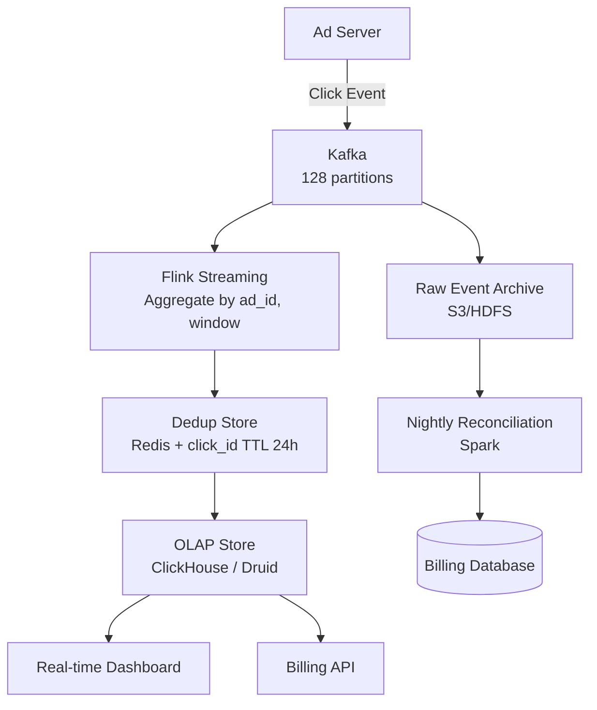

# Design an Ad Click Aggregation System

**Difficulty**: 🔴 Advanced
**Reading Time**: Coming Soon
**Interview Frequency**: High

---

> 🚧 **Full article coming soon.** This stub gives you the essentials to start thinking about this problem.

---

## The Core Problem

Aggregating 10 billion ad clicks per day with exactly-once semantics for billing accuracy is one of the hardest streaming problems — double-counting a click means charging an advertiser twice; under-counting means lost revenue. Network retries and consumer restarts make duplicates inevitable, requiring idempotency at every stage.

## Functional Requirements

- Record every ad click with advertiser ID, ad ID, user ID, timestamp
- Aggregate clicks per ad per minute/hour/day for billing
- Support real-time dashboard (clicks in last 5 min)
- Detect click fraud (same user clicking same ad repeatedly)

## Non-Functional Requirements

| Requirement | Target |
|-------------|--------|
| Throughput | 10B clicks/day (~116,000 clicks/sec) |
| Billing accuracy | Exactly-once aggregation (0 duplicates) |
| Report latency | < 1 minute for near-real-time reports |
| Data retention | 3 years for billing audit |

## Back-of-Envelope Estimates

- **Click rate**: 10B clicks/day ÷ 86,400 = ~116,000 clicks/sec
- **Raw event size**: 116,000 clicks/sec × 100 bytes = 11.6MB/sec → ~1TB/day raw
- **Dedup window**: Keep click IDs for 24 hours to catch late retries → 10B IDs × 16 bytes = 160GB dedup store

## Key Design Decisions

1. **At-Least-Once + Idempotency vs Exactly-Once** — true exactly-once (Kafka transactions + Flink) has 3-5x overhead; at-least-once delivery + deterministic dedup (click_id → dedup store) achieves same billing accuracy at lower cost.
2. **Watermarking for Late Arrivals** — mobile devices may send click events 10 minutes late after reconnecting; use event-time processing with 10-minute watermark; after watermark passes, finalize aggregation and issue billing record.
3. **Lambda Architecture for Reconciliation** — streaming layer gives fast approximate results; nightly batch reprocessing from raw event log produces authoritative billing figures; if they differ by >0.1%, trigger audit alert.

## High-Level Architecture

## Top Interview Questions for This Problem

| Question | Tests |
|----------|-------|
| How do you ensure an ad click is counted exactly once when the network can retry? | Idempotency, dedup strategies |
| How do you handle mobile clicks that arrive 30 minutes late? | Event-time vs processing-time, watermarks |
| How would you detect click fraud in real-time? | Anomaly detection, velocity checks |

## Related Concepts

- [Kafka exactly-once semantics and transactions](../05-infrastructure/distributed-messaging)
- [Top-K heavy hitters for fraud detection](./top-k-analysis)

---

*📚 Full deep-dive with multiple approaches, trade-off tables, and pseudocode coming soon.*
