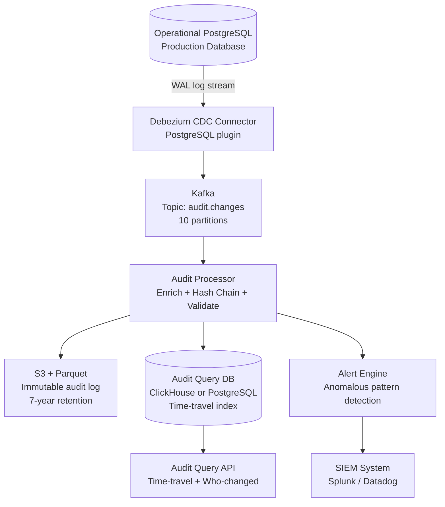

# Design a Database Batch Auditing System

**Difficulty**: 🟡 Medium | **Codemania #88**
**Reading Time**: ~10 min
**Interview Frequency**: Medium

---

## The Core Problem

Auditing all data changes in a HIPAA/SOX-compliant database — who changed what field, when, and what were the before and after values — without impacting the performance of the operational database. The hard problems: capturing changes reliably without modifying application code, creating a tamper-evident log, and supporting time-travel queries ("what did row X look like on Jan 1?").

---

## Functional Requirements

- Capture every INSERT, UPDATE, DELETE on specified tables
- Store before/after image for every changed row
- Record who made the change (user ID from application context)
- Support time-travel query: "what was the value of field X at time T?"
- Immutable audit log (no deletes, no edits to audit records)
- Alert on suspicious activity (mass deletes, off-hours access)

## Non-Functional Requirements

| Requirement | Target |
|-------------|--------|
| Capture latency | Audit record available within 5 seconds of DB change |
| Throughput | 100k DB changes/sec (peak) |
| Retention | 7 years (HIPAA/SOX) |
| Query latency | Time-travel query: < 1 second for point-in-time lookup |
| Tamper-evidence | Hash chain — any modification detectable |
| DB overhead | < 5% added latency to operational DB |

---

## Back-of-Envelope Estimates

- **Change rate**: 100k changes/sec × 1 KB avg row (before + after + metadata) = 100 MB/sec
- **Daily audit log**: 100 MB/sec × 86,400s = ~8.6 TB/day
- **7-year retention**: 8.6 TB × 365 × 7 = ~22 PB (compressed with Parquet ~4:1 → 5.5 PB)
- **Kafka throughput**: 100 MB/sec → 10 partitions at 10 MB/sec each
- **Hash chain compute**: SHA-256 of 1 KB record = < 0.1ms — negligible overhead

---

## High-Level Architecture



---

## Key Design Decisions

### 1. Trigger-Based vs CDC-Based Capture

| Approach | Trigger-Based | CDC (Debezium + WAL) |
|----------|--------------|----------------------|
| Application changes | None needed | None needed |
| DB performance | 5–15% overhead (triggers fire on every write) | < 2% overhead (reads WAL, doesn't block writes) |
| Capture completeness | Misses bulk operations that skip triggers | Captures everything in WAL |
| Schema changes | Triggers must be updated manually | Debezium adapts via schema registry |
| Transactional consistency | Within same transaction | Reads committed changes from WAL |

**Decision**: CDC via Debezium + PostgreSQL WAL (Write-Ahead Log). The WAL is already written for replication; Debezium reads it as a stream. This adds < 2% overhead to the operational database (vs 10–15% for triggers). It also captures bulk operations (COPY, bulk INSERT) that triggers might miss.

### 2. Synchronous vs Async Audit Write

| Approach | Synchronous (in same DB transaction) | Async (CDC + Kafka) |
|----------|--------------------------------------|---------------------|
| Consistency | Audit record guaranteed if DB write commits | Small delay (1–5s) but decoupled |
| Performance | Every write blocked until audit write completes | Negligible impact on operational DB |
| Failure mode | If audit DB is down, operational write fails | Operational DB unaffected; audit catches up |

**Decision**: Async via CDC + Kafka. For most compliance use cases (HIPAA, SOX), 5-second audit latency is acceptable. Synchronous audit write couples the operational DB to audit DB availability — unacceptable for production systems.

### 3. Before/After Image Capture

Debezium captures the full row before and after change:
```json
{
  "op": "u",
  "ts_ms": 1704067200000,
  "source": {"table": "patients", "txId": 12345},
  "before": {
    "patient_id": 1001,
    "diagnosis": "Type 1 Diabetes",
    "updated_by": "dr_smith",
    "updated_at": "2024-01-01T00:00:00Z"
  },
  "after": {
    "patient_id": 1001,
    "diagnosis": "Type 2 Diabetes",
    "updated_by": "dr_jones",
    "updated_at": "2024-01-01T10:00:00Z"
  }
}
```

For UPDATE operations, Debezium can be configured to capture:
- Full row before (requires PostgreSQL `REPLICA IDENTITY FULL`)
- Only changed columns (smaller payload but incomplete context)

**Decision**: Full row capture for HIPAA-regulated tables (patient records, billing). Changed-columns-only for non-regulated tables (performance logs, click data) to reduce payload size.

### 4. Tamper-Evident Hash Chain

Each audit record includes a hash of the previous record:
```json
{
  "audit_id": "uuid-456",
  "change_data": {...},
  "timestamp": "2024-01-01T10:00:00Z",
  "prev_audit_id": "uuid-455",
  "prev_hash": "sha256:abc123...",
  "this_hash": "sha256:def456..."  // SHA256(change_data + timestamp + prev_hash)
}
```

Verification: compute `SHA256(change_data + timestamp + prev_hash)` for any record; compare to `this_hash`. If they don't match, the record was tampered with. Any tamper breaks all subsequent hashes in the chain (like a blockchain).

Periodic verification job: run every 24 hours, verify hash chain integrity for the previous day's records.

### 5. Time-Travel Query Interface

Two approaches:

**Approach A: Replay from event log**
- Fetch all events for row X from beginning
- Apply changes in sequence to reconstruct state at time T
- Expensive for rows with many changes

**Approach B: Snapshot + delta**
- Store full row snapshots every 24 hours
- For point-in-time T, find the nearest snapshot before T, apply deltas
- O(N) where N = changes in snapshot window (bounded)

**Decision**: Approach B for rows with high change frequency. Implement SQL-style time-travel query:
```sql
-- What did patient 1001 look like on Jan 1, 2024 at 10 AM?
SELECT * FROM audit_snapshots(
  table_name := 'patients',
  row_id := 1001,
  as_of := '2024-01-01T10:00:00Z'
);
```

---

## Top Interview Questions for This Problem

| Question | Tests |
|----------|-------|
| Why not just use database triggers for audit logging? | Performance overhead (10–15%), misses bulk operations, couples to app code |
| How do you prove an audit log record hasn't been tampered with? | Hash chain, cryptographic proof, periodic verification |
| How do you query "who deleted all records in the patient table at 2 AM"? | Alert on bulk DELETE operations, SIEM integration, off-hours detection |
| What happens if Debezium falls behind and the WAL is truncated? | WAL retention policy (keep 24h minimum), Debezium offset tracking, restart from snapshot |

---

## Common Mistakes

1. **Storing audit logs in the same database as operational data**: If the DB is compromised, audit logs are too. Separate audit log to immutable S3 + append-only Kafka topic.
2. **Capturing only changed columns**: For compliance, regulators want to see the full row context. Always capture full before/after image for regulated tables.
3. **No hash chain or tamper-evidence**: An audit log without integrity verification can be disputed. Always implement cryptographic hash chain.

---

## Related Concepts

- [Message Queue Basics](../../04-messaging/concepts/message-queue-basics) — Kafka as durable change event stream
- [Database Scaling](../../01-databases/concepts/database-scaling) — PostgreSQL WAL and replication architecture

---

## 📚 Resources & References

| Resource | Type | What You'll Learn |
|----------|------|------------------|
| [Debezium CDC Documentation](https://debezium.io/documentation/) | 📚 Book | WAL-based CDC, connector configuration, schema registry |
| [ByteByteGo — Event Sourcing Pattern](https://www.youtube.com/@ByteByteGo) | 📺 YouTube | Immutable event logs, time-travel queries |
| [Hussein Nasser — Database Internals](https://www.youtube.com/@hnasr) | 📺 YouTube | WAL mechanics, replication, CDC architecture |
| [Martin Kleppmann — Stream Processing](https://martin.kleppmann.com) | 📚 Book | CDC patterns, event sourcing, audit log design |
