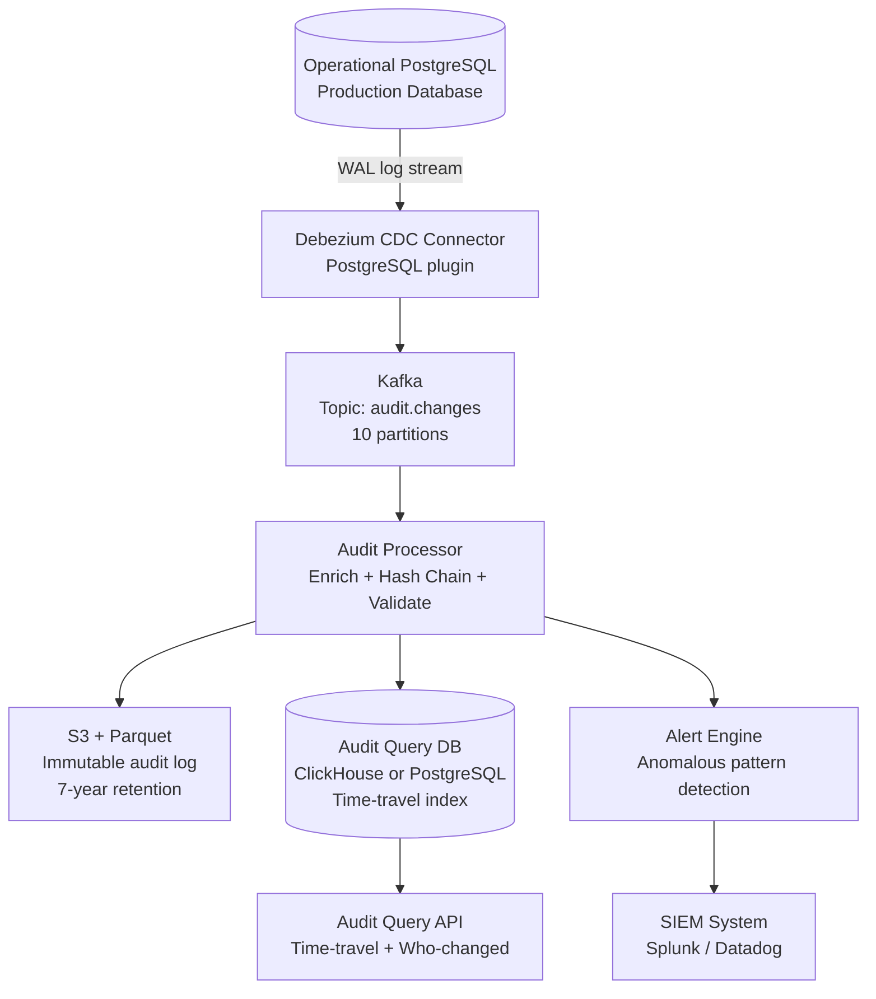
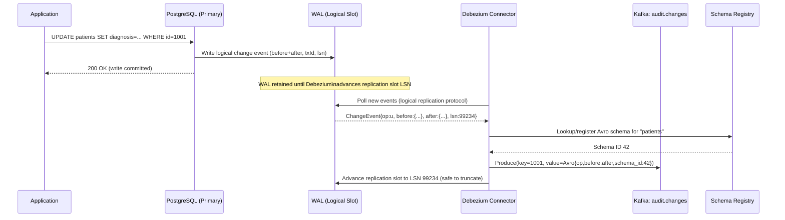
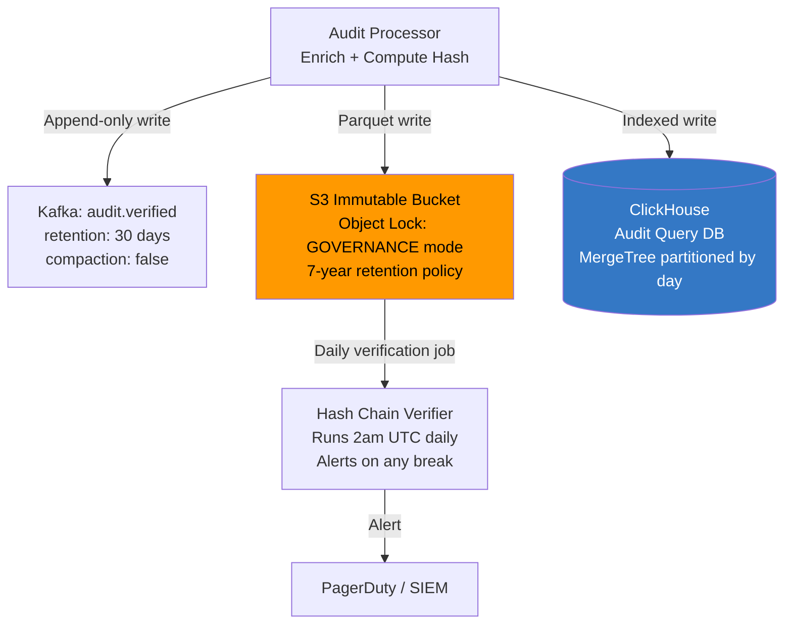

# Design a Database Batch Auditing System

**Difficulty**: 🟡 Medium | **Codemania #88**
**Reading Time**: ~10 min
**Interview Frequency**: Medium

---

## The Core Problem

Auditing all data changes in a HIPAA/SOX-compliant database — who changed what field, when, and what were the before and after values — without impacting the performance of the operational database. The hard problems: capturing changes reliably without modifying application code, creating a tamper-evident log, and supporting time-travel queries ("what did row X look like on Jan 1?").

---

## Functional Requirements

- Capture every INSERT, UPDATE, DELETE on specified tables
- Store before/after image for every changed row
- Record who made the change (user ID from application context)
- Support time-travel query: "what was the value of field X at time T?"
- Immutable audit log (no deletes, no edits to audit records)
- Alert on suspicious activity (mass deletes, off-hours access)

## Non-Functional Requirements

| Requirement | Target |
|-------------|--------|
| Capture latency | Audit record available within 5 seconds of DB change |
| Throughput | 100k DB changes/sec (peak) |
| Retention | 7 years (HIPAA/SOX) |
| Query latency | Time-travel query: < 1 second for point-in-time lookup |
| Tamper-evidence | Hash chain — any modification detectable |
| DB overhead | < 5% added latency to operational DB |

---

## Back-of-Envelope Estimates

- **Change rate**: 100k changes/sec × 1 KB avg row (before + after + metadata) = 100 MB/sec
- **Daily audit log**: 100 MB/sec × 86,400s = ~8.6 TB/day
- **7-year retention**: 8.6 TB × 365 × 7 = ~22 PB (compressed with Parquet ~4:1 → 5.5 PB)
- **Kafka throughput**: 100 MB/sec → 10 partitions at 10 MB/sec each
- **Hash chain compute**: SHA-256 of 1 KB record = < 0.1ms — negligible overhead

---

## High-Level Architecture



---

## Key Design Decisions

### 1. Trigger-Based vs CDC-Based Capture

| Approach | Trigger-Based | CDC (Debezium + WAL) |
|----------|--------------|----------------------|
| Application changes | None needed | None needed |
| DB performance | 5–15% overhead (triggers fire on every write) | < 2% overhead (reads WAL, doesn't block writes) |
| Capture completeness | Misses bulk operations that skip triggers | Captures everything in WAL |
| Schema changes | Triggers must be updated manually | Debezium adapts via schema registry |
| Transactional consistency | Within same transaction | Reads committed changes from WAL |

**Decision**: CDC via Debezium + PostgreSQL WAL (Write-Ahead Log). The WAL is already written for replication; Debezium reads it as a stream. This adds < 2% overhead to the operational database (vs 10–15% for triggers). It also captures bulk operations (COPY, bulk INSERT) that triggers might miss.

### 2. Synchronous vs Async Audit Write

| Approach | Synchronous (in same DB transaction) | Async (CDC + Kafka) |
|----------|--------------------------------------|---------------------|
| Consistency | Audit record guaranteed if DB write commits | Small delay (1–5s) but decoupled |
| Performance | Every write blocked until audit write completes | Negligible impact on operational DB |
| Failure mode | If audit DB is down, operational write fails | Operational DB unaffected; audit catches up |

**Decision**: Async via CDC + Kafka. For most compliance use cases (HIPAA, SOX), 5-second audit latency is acceptable. Synchronous audit write couples the operational DB to audit DB availability — unacceptable for production systems.

### 3. Before/After Image Capture

Debezium captures the full row before and after change:
```json
{
  "op": "u",
  "ts_ms": 1704067200000,
  "source": {"table": "patients", "txId": 12345},
  "before": {
    "patient_id": 1001,
    "diagnosis": "Type 1 Diabetes",
    "updated_by": "dr_smith",
    "updated_at": "2024-01-01T00:00:00Z"
  },
  "after": {
    "patient_id": 1001,
    "diagnosis": "Type 2 Diabetes",
    "updated_by": "dr_jones",
    "updated_at": "2024-01-01T10:00:00Z"
  }
}
```

For UPDATE operations, Debezium can be configured to capture:
- Full row before (requires PostgreSQL `REPLICA IDENTITY FULL`)
- Only changed columns (smaller payload but incomplete context)

**Decision**: Full row capture for HIPAA-regulated tables (patient records, billing). Changed-columns-only for non-regulated tables (performance logs, click data) to reduce payload size.

### 4. Tamper-Evident Hash Chain

Each audit record includes a hash of the previous record:
```json
{
  "audit_id": "uuid-456",
  "change_data": {...},
  "timestamp": "2024-01-01T10:00:00Z",
  "prev_audit_id": "uuid-455",
  "prev_hash": "sha256:abc123...",
  "this_hash": "sha256:def456..."  // SHA256(change_data + timestamp + prev_hash)
}
```

Verification: compute `SHA256(change_data + timestamp + prev_hash)` for any record; compare to `this_hash`. If they don't match, the record was tampered with. Any tamper breaks all subsequent hashes in the chain (like a blockchain).

Periodic verification job: run every 24 hours, verify hash chain integrity for the previous day's records.

### 5. Time-Travel Query Interface

Two approaches:

**Approach A: Replay from event log**
- Fetch all events for row X from beginning
- Apply changes in sequence to reconstruct state at time T
- Expensive for rows with many changes

**Approach B: Snapshot + delta**
- Store full row snapshots every 24 hours
- For point-in-time T, find the nearest snapshot before T, apply deltas
- O(N) where N = changes in snapshot window (bounded)

**Decision**: Approach B for rows with high change frequency. Implement SQL-style time-travel query:
```sql
-- What did patient 1001 look like on Jan 1, 2024 at 10 AM?
SELECT * FROM audit_snapshots(
  table_name := 'patients',
  row_id := 1001,
  as_of := '2024-01-01T10:00:00Z'
);
```

---

## Top Interview Questions for This Problem

| Question | Tests |
|----------|-------|
| Why not just use database triggers for audit logging? | Performance overhead (10–15%), misses bulk operations, couples to app code |
| How do you prove an audit log record hasn't been tampered with? | Hash chain, cryptographic proof, periodic verification |
| How do you query "who deleted all records in the patient table at 2 AM"? | Alert on bulk DELETE operations, SIEM integration, off-hours detection |
| What happens if Debezium falls behind and the WAL is truncated? | WAL retention policy (keep 24h minimum), Debezium offset tracking, restart from snapshot |

---

## Common Mistakes

1. **Storing audit logs in the same database as operational data**: If the DB is compromised, audit logs are too. Separate audit log to immutable S3 + append-only Kafka topic.
2. **Capturing only changed columns**: For compliance, regulators want to see the full row context. Always capture full before/after image for regulated tables.
3. **No hash chain or tamper-evidence**: An audit log without integrity verification can be disputed. Always implement cryptographic hash chain.

---

## Related Concepts

- [Message Queue Basics](../../04-messaging/concepts/message-queue-basics) — Kafka as durable change event stream
- [Database Scaling](../../01-databases/concepts/sharding-strategies) — PostgreSQL WAL and replication architecture

---

## Component Deep Dive 1: CDC Pipeline — Debezium + WAL

The most critical architectural component in any database audit system is the **Change Data Capture (CDC) pipeline**. This is the foundation that determines capture completeness, operational overhead, and fault tolerance. Getting this wrong means either missing changes, adding unacceptable overhead to the production database, or creating a brittle pipeline that loses events during restarts.

### How the PostgreSQL WAL-Based CDC Works Internally

PostgreSQL's Write-Ahead Log (WAL) is a sequential, append-only log of every change that occurs in the database before it is applied to the actual data files. PostgreSQL writes to the WAL for crash recovery and streaming replication. Debezium exploits this existing infrastructure: it registers itself as a logical replication slot, which causes PostgreSQL to retain WAL segments until Debezium has read them. The WAL stream contains fully decoded row-level change events (INSERT, UPDATE, DELETE) in a logical format rather than raw binary page changes.

The key PostgreSQL configuration required:
- `wal_level = logical` — enables logical decoding of the WAL
- `max_replication_slots = 10` — one slot per Debezium connector
- `REPLICA IDENTITY FULL` on audited tables — ensures the full "before" row image is written into the WAL on UPDATE/DELETE (by default only the primary key is included in before images)

Without `REPLICA IDENTITY FULL`, an UPDATE of `patients.diagnosis` in the WAL would only show the primary key in the "before" image, not the old value of `diagnosis`. This is the single most common misconfiguration in CDC-based audit systems.

### Why Naive Approaches Fail at Scale

**Database triggers** add 5–15% overhead because they execute inline with every DML operation, consuming connection threads and adding synchronous latency. At 100k changes/sec, this is a 15k ms/sec wall of extra work on the critical path.

**Application-level audit writes** (manually inserting into an audit table after every business operation) fail because: (1) bulk operations like `DELETE FROM patients WHERE status = 'inactive'` bypass application code, (2) direct DB admin operations are completely invisible, and (3) any bug or exception in application code can silently drop audit records.

**Polling the operational table** (comparing snapshots) is too slow for < 5s capture latency and creates enormous read load on the production DB.

### CDC Internal Component Diagram



### CDC Implementation Options Trade-off Table

| Approach | Latency | Throughput | DB Overhead | Failure Handling |
|----------|---------|------------|-------------|-----------------|
| Debezium + PostgreSQL WAL | 1–3s | 200k events/sec per connector | < 2% (reads WAL asynchronously) | Replication slot retains WAL; can replay from last committed LSN |
| AWS DMS (Database Migration Service) | 3–10s | ~50k events/sec | < 3% (managed replication) | Managed restarts, but less control over offset management |
| Trigger-based (stored procedures) | Synchronous (< 1ms) | Limited by DB write capacity | 10–20% (trigger fires on critical path) | No message loss, but kills throughput at scale |

**Decision driver**: For 100k changes/sec with < 2% DB overhead, Debezium + WAL is the only viable choice. AWS DMS is appropriate for smaller scale with managed infrastructure. Triggers work for low-volume systems (< 1k changes/sec) where sub-millisecond consistency is non-negotiable.

### WAL Retention Risk: The Single Biggest Operational Concern

If Debezium falls behind and PostgreSQL decides it needs to reclaim disk space, it will **truncate the WAL even though the replication slot is still open**. This causes the replication slot to become invalid, and Debezium must restart from a full snapshot — potentially replaying millions of rows. Mitigation:

- Configure `max_slot_wal_keep_size = 10GB` (PostgreSQL 13+) to bound how much WAL a lagging slot can retain
- Monitor `pg_replication_slots` for `wal_status = 'lost'`
- Alert when Debezium consumer lag exceeds 100k events (approximately 30 seconds of buffer)

---

## Component Deep Dive 2: Immutable Audit Log with Hash Chain Integrity

The second most critical component is the **tamper-evident immutable log**. An audit log that can be silently modified is legally worthless under HIPAA, SOX, or PCI-DSS. The hash chain provides cryptographic proof of record integrity — any modification to any record (including the "who modified it" field) invalidates all subsequent hashes.

### Internal Mechanics of the Hash Chain

The Audit Processor consumes events from Kafka and computes a chained hash before persisting each record. The computation is:

```
this_hash = SHA-256(
  audit_id       ||
  table_name     ||
  row_pk         ||
  operation      ||
  before_json    ||
  after_json     ||
  user_id        ||
  timestamp_ms   ||
  prev_hash
)
```

The `prev_hash` of the very first record in a chain is a known genesis constant (e.g., all zeros). Each subsequent record includes the hash of the previous record. This creates a **Merkle chain** — to verify any record, you must verify all records before it.

### What Happens at 10x Load

At baseline 100k changes/sec, the hash chain Kafka consumer processes ~100k SHA-256 computations/sec per partition. SHA-256 of a 1 KB payload takes ~0.05ms on modern hardware, meaning a single CPU core handles ~20k hashes/sec. At 10x load (1M changes/sec), you need ~50 cores dedicated to hash computation across 50 Kafka partitions.

The critical constraint: hash chaining requires **sequential processing per partition** (you need the previous record's hash to compute the current one). This means parallelism happens at the partition level, not within a partition. Kafka partition count becomes the parallelism limit. With 50 partitions, 1M changes/sec is achievable.

At 1000x load (100M changes/sec), hash chain computation itself becomes the bottleneck. Alternative: switch to a Merkle tree approach — hash records in batches of 1000, build a Merkle tree per batch, store only the root hash. This reduces sequential constraint while maintaining tamper-evidence at the batch level.

### Immutable Storage Architecture



**S3 Object Lock** in GOVERNANCE mode prevents any principal (including root) from deleting or overwriting objects before the retention period expires. This is the mechanism that satisfies HIPAA's requirement that audit logs cannot be deleted or altered. An additional S3 bucket policy denies `s3:DeleteObject` and `s3:PutObject` on existing keys to all principals including administrators.

---

## Component Deep Dive 3: Time-Travel Query Engine

Time-travel queries ("what did row X look like at time T?") are the primary read path for compliance auditors and incident investigation. The naive approach — replaying all events from the beginning for a row — is O(N) where N can be millions of changes for a high-frequency row.

### Production-Grade Time-Travel Implementation

The Audit Query DB (ClickHouse) stores the full denormalized event log partitioned by `(table_name, event_date)`. For time-travel, ClickHouse's `FINAL` modifier with `argMax` aggregation reconstructs the row state at any point in time:

```sql
-- What did patient 1001's record look like on 2024-01-01 at 10:00:00 UTC?
SELECT
    argMax(after_json, event_timestamp) AS row_state,
    argMax(user_id, event_timestamp) AS last_changed_by
FROM audit_events
WHERE
    table_name = 'patients'
    AND row_pk = '1001'
    AND event_timestamp <= toDateTime('2024-01-01 10:00:00')
```

For high-churn rows, a **daily snapshot compaction job** materializes the full row state at midnight UTC and stores it in a separate `audit_snapshots` table. Time-travel queries first check if a snapshot exists for the nearest day boundary before T, then apply only the deltas from that snapshot forward. This bounds query time to O(changes within one day) rather than O(total changes).

### Scale behavior

| Row Change Frequency | Query Latency (no snapshot) | Query Latency (with snapshot) |
|---------------------|----------------------------|-------------------------------|
| 1 change/day (most rows) | 1–5ms | 1–5ms |
| 100 changes/day | 10–50ms | 2–10ms |
| 10,000 changes/day (hot rows) | 500ms–2s | 5–20ms |
| 1,000,000 changes (all-time) | 10s+ (unacceptable) | 5–20ms |

The snapshot strategy is critical for any row that accumulates more than ~10k lifetime changes.

---

## Data Model

```sql
-- Core audit events table (ClickHouse MergeTree, partitioned by event_date)
CREATE TABLE audit_events (
    audit_id          UUID           NOT NULL,
    table_name        VARCHAR(128)   NOT NULL,
    row_pk            VARCHAR(256)   NOT NULL,   -- JSON-encoded composite PK
    operation         ENUM('INSERT','UPDATE','DELETE') NOT NULL,
    before_json       TEXT,                       -- NULL for INSERT
    after_json        TEXT,                       -- NULL for DELETE
    changed_fields    ARRAY(VARCHAR(64)),         -- list of changed column names
    user_id           VARCHAR(128)   NOT NULL,    -- application user who triggered change
    db_user           VARCHAR(64)    NOT NULL,    -- DB session user (e.g., app_service_account)
    source_ip         VARCHAR(45),
    application_name  VARCHAR(128),
    transaction_id    BIGINT         NOT NULL,    -- PostgreSQL txid
    lsn               BIGINT         NOT NULL,    -- WAL log sequence number
    event_timestamp   DateTime64(3)  NOT NULL,    -- microsecond precision
    kafka_offset      BIGINT         NOT NULL,
    kafka_partition   SMALLINT       NOT NULL,
    prev_audit_id     UUID,
    prev_hash         VARCHAR(64),               -- hex SHA-256 of previous record
    this_hash         VARCHAR(64)    NOT NULL,   -- hex SHA-256 of this record
    schema_version    SMALLINT       DEFAULT 1
)
ENGINE = MergeTree()
PARTITION BY toYYYYMM(event_timestamp)
ORDER BY (table_name, row_pk, event_timestamp)
SETTINGS index_granularity = 8192;

-- Secondary index for user-centric audit queries (who changed what)
CREATE INDEX idx_audit_user ON audit_events (user_id, event_timestamp);
CREATE INDEX idx_audit_txn  ON audit_events (transaction_id);

-- Daily snapshots for time-travel optimization
CREATE TABLE audit_snapshots (
    snapshot_id       UUID           NOT NULL,
    table_name        VARCHAR(128)   NOT NULL,
    row_pk            VARCHAR(256)   NOT NULL,
    snapshot_date     Date           NOT NULL,   -- midnight UTC of this snapshot
    row_json          TEXT           NOT NULL,   -- full row state at snapshot_date 23:59:59
    last_audit_id     UUID           NOT NULL,   -- audit_events.audit_id of last change
    created_at        DateTime       NOT NULL
)
ENGINE = ReplacingMergeTree(created_at)
PARTITION BY toYYYYMM(snapshot_date)
ORDER BY (table_name, row_pk, snapshot_date);

-- Hash chain verification checkpoints (for fast incremental verification)
CREATE TABLE audit_chain_checkpoints (
    checkpoint_id     UUID           NOT NULL,
    kafka_partition   SMALLINT       NOT NULL,
    last_verified_offset BIGINT     NOT NULL,
    last_audit_id     UUID          NOT NULL,
    last_hash         VARCHAR(64)   NOT NULL,
    verified_at       DateTime      NOT NULL,
    record_count      BIGINT        NOT NULL,
    status            ENUM('ok','tamper_detected','gap_detected') NOT NULL
)
ENGINE = MergeTree()
ORDER BY (kafka_partition, verified_at);
```

---

## Scale Bottlenecks

| Traffic Level | Component That Breaks | Symptoms | Mitigation |
|---------------|----------------------|----------|------------|
| 10x baseline (1M changes/sec) | Kafka consumer lag in Audit Processor | Audit records delayed > 30s; replication slot WAL grows unbounded | Scale Audit Processor horizontally to 50 instances; increase Kafka partitions to 50 |
| 10x baseline (1M changes/sec) | PostgreSQL WAL disk usage | Postgres disk full alert; replication slot invalidated | `max_slot_wal_keep_size = 50GB`; monitor `pg_replication_slots.wal_status` |
| 100x baseline (10M changes/sec) | ClickHouse write throughput | ClickHouse MergeTree merge backlog; query latency degrades to 10s+ | Shard ClickHouse by `table_name`; use ClickHouse Keeper for distributed coordination; target 3M inserts/sec per shard |
| 100x baseline (10M changes/sec) | S3 write throughput | S3 `503 SlowDown` errors | Batch Parquet writes to 128 MB files; use S3 multipart upload; target 1 file per partition per minute |
| 1000x baseline (100M changes/sec) | Hash chain sequential computation | Hash verification falls behind real-time; audit records not tamper-verified for hours | Switch to batch Merkle tree (hash 10k records per tree, store root); distribute across 500+ Kafka partitions |
| 1000x baseline (100M changes/sec) | Single Debezium connector on one PostgreSQL | Debezium CPU saturates decoding WAL; LSN falls behind by millions | Shard writes across multiple PostgreSQL primaries; one Debezium connector per primary; 10 primaries × 10M changes/sec each |

---

## How LinkedIn Built Their Audit Pipeline (Databus + Espresso)

LinkedIn faced the database audit problem at a scale that exposed every weakness of naive approaches. By 2013, LinkedIn was processing over **1 trillion messages per day** through Kafka (then still evolving), with core social graph data (connections, profile updates, job applications) requiring full audit trails for both compliance and data consistency.

**The Databus System**: LinkedIn built Databus, a low-latency, reliable change capture system for their Oracle and MySQL databases. Databus used a database-specific log mining approach similar to Debezium's WAL approach but predated it. For Oracle, it used Oracle LogMiner; for MySQL, it consumed the binary replication log. The system maintained a circular in-memory buffer of the last N seconds of change events, allowing downstream consumers to start from any point in the recent window without hitting the database.

**Specific Technology Choices**:
- **Relay tier**: A dedicated relay layer buffered Databus events so that slow consumers (audit storage) couldn't affect fast consumers (cache invalidation)
- **Bootstrap service**: For consumers starting cold (or after a long lag), a separate Bootstrap service served a full row snapshot without overwhelming the source database
- **Avro schema evolution**: All change events were encoded as Avro with schema IDs, allowing schema evolution without breaking consumers

**Non-obvious architectural decision**: LinkedIn separated the **relay** (real-time buffer, seconds of retention) from the **bootstrap** (historical snapshot, full table) into separate services. This meant audit consumers could start reading from "now" and use the bootstrap service to catch up independently, rather than forcing the relay to hold days of data. At LinkedIn's scale (~10 billion DB changes/day across all services), holding even 1 hour of events in memory would require terabytes of RAM.

**Numbers**: Databus achieved < 100ms end-to-end change propagation latency at 100k events/sec per cluster, with a fleet of ~20 Databus clusters across LinkedIn's infrastructure.

Source: [LinkedIn Engineering Blog — Databus: LinkedIn's Change Data Capture System](https://engineering.linkedin.com/data-replication/open-sourcing-databus-linkedins-scalable-consistent-change-data-capture-system) (2013)

---

## Interview Angle

**What the interviewer is testing:** Can the candidate design a system that is simultaneously non-intrusive to the operational database, cryptographically tamper-proof, and queryable for time-travel without resorting to full replay? This tests knowledge of CDC mechanics, compliance requirements, and distributed systems trade-offs.

**Common mistakes candidates make:**

1. **Proposing database triggers as the primary capture mechanism.** Triggers fire synchronously on the write path, adding 10–20% overhead at scale. At 100k writes/sec this compounds to tens of milliseconds of added latency per request. The correct answer is WAL-based CDC (Debezium), which reads asynchronously from a log already written for replication.

2. **Storing audit logs in the same database as operational data.** Candidates often draw an `audit_log` table inside the same PostgreSQL instance. This fails compliance requirements: a compromised DB admin can alter both the operational data and the audit log simultaneously. Separation to an immutable S3 bucket with Object Lock (or a separate audit-only ClickHouse cluster with no delete permissions) is required.

3. **Ignoring WAL retention risk.** Candidates describe Debezium consuming WAL without mentioning that a lagging Debezium connector can cause the PostgreSQL replication slot to retain WAL indefinitely, eventually filling the disk and crashing the production database. This is a real operational catastrophe and interviewers specifically look for candidates who know about `max_slot_wal_keep_size` and slot lag monitoring.

**The insight that separates good from great answers:** Great candidates recognize that `REPLICA IDENTITY FULL` must be set on each audited table — without it, UPDATE and DELETE events in the WAL contain only the primary key in the "before" image, not the old field values. This means before/after auditing silently captures incomplete data. Knowing this specific PostgreSQL configuration detail signals hands-on experience with CDC in production.

---

## Key Numbers to Remember

| Metric | Value | Context |
|--------|-------|---------|
| CDC capture latency | 1–3 seconds | Debezium WAL polling interval (configurable down to 0s for real-time) |
| DB overhead (CDC) | < 2% | WAL read is asynchronous; doesn't block writes |
| DB overhead (triggers) | 10–20% | Trigger fires synchronously on critical write path |
| Hash computation speed | ~20,000 SHA-256/sec | Per CPU core on 1 KB record; scales linearly with cores |
| WAL segment size | 16 MB default | PostgreSQL default; one WAL segment = ~1,000 row changes at 16 KB/row |
| S3 Object Lock retention | 7 years | HIPAA requires 6 years minimum; SOX requires 7 years |
| ClickHouse insert throughput | 500k rows/sec | Per node; scale horizontally with sharding |
| Snapshot compaction window | 24 hours | Daily snapshots bound time-travel query cost to O(daily changes) |
| LinkedIn Databus latency | < 100ms | End-to-end change propagation across relay tier at 100k events/sec |
| Kafka consumer lag alert threshold | 100k events | ~30 seconds of buffer; beyond this, risk of WAL slot invalidity |

---

## Deployment Topology

A minimal production deployment for 100k changes/sec requires the following instance sizing:

| Component | Instance Type | Count | Role |
|-----------|--------------|-------|------|
| Debezium + Kafka Connect | 4 vCPU / 8 GB RAM | 2 | Active + standby connector; one replication slot each |
| Kafka brokers | 8 vCPU / 32 GB RAM / 2 TB NVMe | 3 | 10 partitions, replication factor 3 |
| Audit Processor (Flink/Java) | 4 vCPU / 16 GB RAM | 10 | Hash chain + enrichment; 1 instance per Kafka partition group |
| ClickHouse shards | 16 vCPU / 64 GB RAM / 8 TB NVMe | 4 | 2 shards × 2 replicas; 500k inserts/sec per shard |
| Alert Engine (Flink) | 4 vCPU / 8 GB RAM | 3 | Stateful windowed rule evaluation |
| Audit Query API | 2 vCPU / 4 GB RAM | 3 | Stateless; horizontal scale behind load balancer |

Total baseline cost at AWS on-demand: ~$8,000/month. Reserved instances (1-year) reduce to ~$5,200/month. S3 storage for 7-year Parquet retention at 5.5 PB ≈ $110,000/year at $0.02/GB-month (S3 Glacier Instant Retrieval).

**Network egress consideration**: ClickHouse query results returned to the Audit API cross AZ boundaries. Place ClickHouse and the Audit API in the same AZ to eliminate $0.01/GB cross-AZ transfer cost — at 1 TB/day of query results, that is $3,650/year saved.

**Kafka retention tuning**: Set `retention.ms = 2592000000` (30 days) on `audit.changes` to allow Debezium replay in case the Audit Processor falls behind. Do not set `retention.bytes` — let time-based retention govern. 30 days at 100 MB/sec = ~260 TB Kafka storage; use tiered storage (Confluent or MSK with S3 tiering) to keep broker local disk under 2 TB while retaining the full 30-day window on S3.

**ClickHouse cold/hot tiering**: Partition `audit_events` by month. Months older than 90 days move to S3-backed cold storage via ClickHouse's `storage_policy`. Queries on cold partitions are 5–10x slower (300ms vs 30ms) but compliance auditors rarely need sub-second response on 2-year-old data. Hot NVMe holds 3 months; cold S3 holds the remaining 81 months of the 7-year window. This reduces ClickHouse NVMe cost by ~95%.

---

## Failure Modes and Recovery

Every component in the CDC pipeline has a specific failure mode. Knowing these in advance — and having documented recovery procedures — is what separates a production-grade audit system from a demo.

### Failure Mode 1: Debezium Connector Crash Mid-Transaction

**What happens**: Debezium crashes between processing two events from the same database transaction. On restart, it resumes from its last committed Kafka offset, which may be mid-transaction.

**Symptom**: Partial transaction in audit log — some rows from a multi-table UPDATE appear audited, others missing. This is not a data corruption issue; the Kafka offset is the recovery point.

**Recovery**: Debezium uses Kafka Connect's offset storage (stored in a Kafka internal topic `__consumer_offsets` or a dedicated `debezium-offsets` topic). On restart, it replays from the last committed WAL LSN. Because WAL events are idempotent when replayed, duplicate events may appear in Kafka briefly but are deduplicated in the Audit Processor using `(lsn, transaction_id)` as the deduplication key.

**Prevention**: Set `errors.tolerance = none` in Debezium connector config so that any schema mismatch or decode error causes an immediate alert rather than a silent skip.

### Failure Mode 2: ClickHouse Node Down During Write

**What happens**: A ClickHouse shard node goes down while the Audit Processor is mid-batch insert. The Audit Processor retries with exponential backoff. Because the Kafka consumer has not yet committed its offset, all events in the failed batch will be reprocessed.

**Symptom**: Duplicate audit records in ClickHouse for the window before the node came back up.

**Recovery**: ClickHouse `ReplacingMergeTree` deduplicates rows with the same `(table_name, row_pk, event_timestamp)` ordering key during background merges. The `FINAL` keyword on queries forces deduplication at read time. For the Parquet/S3 golden copy, the Audit Processor uses idempotent S3 key naming (`s3://audit-bucket/year=2024/month=01/day=01/partition=3/offset=99200-99400.parquet`), so retried writes overwrite the same key without duplication.

### Failure Mode 3: Hash Chain Gap

**What happens**: The daily hash chain verification job detects that `record[N].prev_hash != SHA256(record[N-1])`. This could indicate: (a) genuine tampering, (b) a reprocessed/duplicate record inserted out of order, or (c) a bug in the hash computation code deployed mid-day.

**Triage steps**:
1. Check if the gap timestamp coincides with a Debezium restart (reprocessed events have correct hashes but may be inserted out of sequence)
2. Check deploy history — did a code change alter hash computation logic?
3. If neither explains it, escalate to security team as potential tamper event

**SLA**: Hash chain verification findings must be triaged within 4 hours under HIPAA incident response requirements.

---

## Alert Engine: Anomaly Detection Patterns

The Alert Engine consumes from the same `audit.verified` Kafka topic (after hash enrichment) and evaluates streaming rules against a sliding window. It does not query ClickHouse — it operates on the live event stream to meet a < 30-second alert latency SLA.

### Key Detection Rules

| Rule | Window | Threshold | Severity |
|------|--------|-----------|----------|
| Bulk DELETE | 60 seconds | > 1,000 deletes on same table by same user | CRITICAL |
| Off-hours access to PHI table | None (time-of-day check) | Any write to `patients` table between 23:00–05:00 UTC | HIGH |
| Privilege escalation | 5 minutes | `db_user` changes from application service account to `postgres` superuser | CRITICAL |
| Mass SELECT on PHI (read audit) | 60 seconds | > 10,000 rows read from `patients` by single user | HIGH |
| Schema ALTER | None | Any `ALTER TABLE` / `DROP TABLE` DDL on audited tables | CRITICAL |
| Repeated failed auth | 5 minutes | > 10 authentication failures from same `source_ip` | MEDIUM |

The Alert Engine uses **Flink** (or Kafka Streams for simpler deployments) with tumbling 60-second windows. Each rule is implemented as a stateful Flink job with a keyed state per `(user_id, table_name)`. State TTL is set to 5 minutes to bound memory usage.

On trigger, the alert is published to a dedicated `audit.alerts` Kafka topic, which feeds both the SIEM system (Splunk/Datadog) and an on-call PagerDuty integration. All alert records are also written to ClickHouse for trend analysis ("how many bulk-delete alerts per week?").

---

## Compliance Checklist

The following checklist maps audit system capabilities to specific regulatory requirements:

| Requirement | Regulation | Implementation |
|-------------|-----------|----------------|
| All reads and writes logged | HIPAA § 164.312(b) | CDC captures all DML; application-level read logging via query interceptor |
| Audit log cannot be deleted | HIPAA § 164.312(c)(2) | S3 Object Lock GOVERNANCE mode; 7-year retention policy |
| Who accessed PHI, when | HIPAA § 164.308(a)(1) | `user_id`, `source_ip`, `event_timestamp` in every audit record |
| Financial record integrity | SOX Section 404 | Hash chain provides cryptographic tamper-evidence |
| Audit log access controls | PCI-DSS 10.2 | Audit DB is separate cluster; read-only access via audit API with RBAC |
| Log review and alerting | PCI-DSS 10.6 | Alert Engine monitors for bulk deletes, off-hours access, privilege escalation |
| 90-day hot query window | PCI-DSS 10.7 | ClickHouse retains 90 days on fast NVMe; older data on S3 Glacier |

---

## 📚 Resources & References

| Resource | Type | What You'll Learn |
|----------|------|------------------|
| [Debezium CDC Documentation](https://debezium.io/documentation/) | 📚 Book | WAL-based CDC, connector configuration, schema registry |
| [ByteByteGo — Event Sourcing Pattern](https://www.youtube.com/@ByteByteGo) | 📺 YouTube | Immutable event logs, time-travel queries |
| [Hussein Nasser — Database Internals](https://www.youtube.com/@hnasr) | 📺 YouTube | WAL mechanics, replication, CDC architecture |
| [Martin Kleppmann — Stream Processing](https://martin.kleppmann.com) | 📚 Book | CDC patterns, event sourcing, audit log design |
