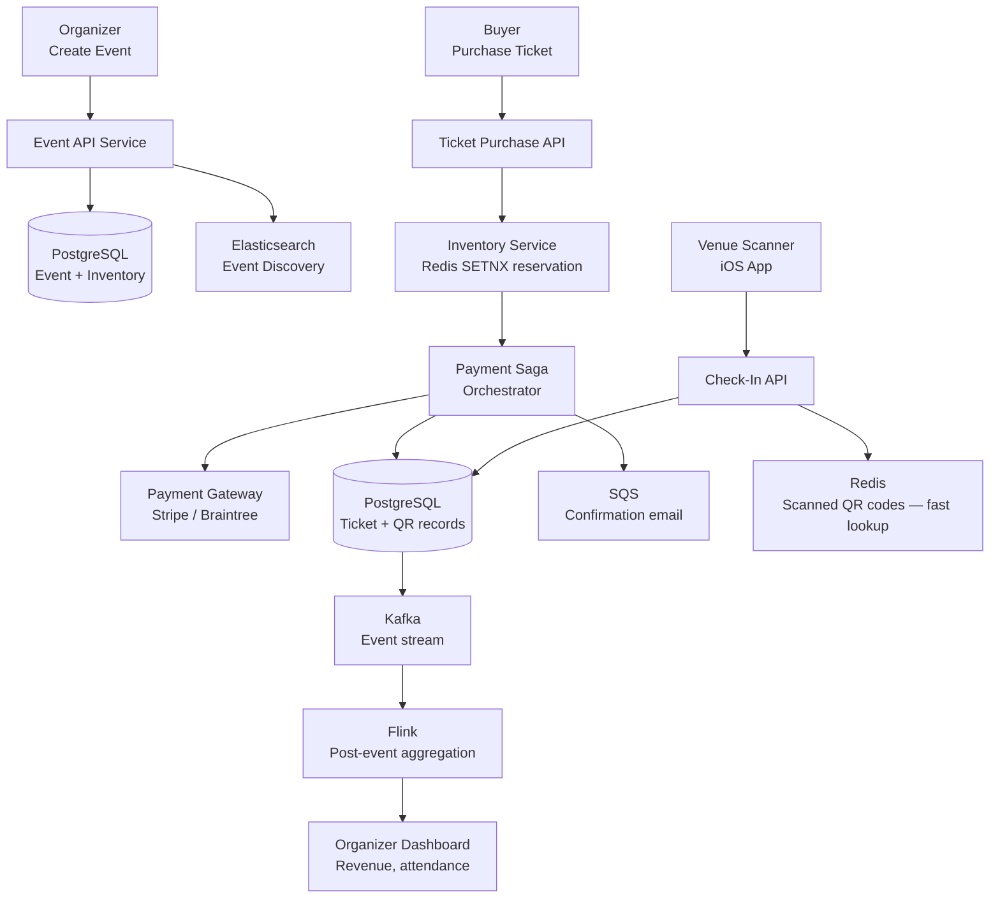

# Design an Event Lifecycle Management Platform

**Difficulty**: 🔴 Advanced | **Codemania #144**
**Reading Time**: ~14 min
**Interview Frequency**: High

---

## The Core Problem

Managing the full lifecycle of events at Eventbrite scale: creation → discovery → ticket purchase (with inventory management) → QR code check-in → post-event analytics. The hard problems: preventing oversell during ticket rushes (inventory race conditions), reliable QR code check-in at high volume, and stitching together a coherent analytics picture across the full funnel.

---

## Functional Requirements

- Organizers create and publish events with ticket types (general, VIP, early bird)
- Attendees browse and search events; purchase tickets
- Payment processing with inventory reservation (prevent oversell)
- Generate QR codes for tickets; check-in scanning at venue
- Post-event analytics: attendance rate, revenue, geographic breakdown

## Non-Functional Requirements

| Requirement | Target |
|-------------|--------|
| Ticket purchase throughput | 50,000 tickets/sec during popular event launches |
| Inventory accuracy | Zero oversell (sell exactly N tickets for N capacity) |
| QR check-in throughput | 10,000 scans/minute at venue entry |
| Check-in latency | < 500ms per scan (long lines if slow) |
| Analytics latency | Post-event report available within 1 hour of event end |

---

## Back-of-Envelope Estimates

- **Events**: 5M active events globally at any time
- **Ticket inventory**: 5M events × avg 500 tickets = 2.5B ticket records
- **Purchase spike**: Taylor Swift concert on sale → 100,000 concurrent buyers competing for 50,000 tickets
- **QR scan rate**: 10,000 capacity venue × 80% arrive in first 30 min = 8,000 scans in 1,800s = ~4.4 scans/sec per entry scanner (trivial per scanner; scale with # of scanners)
- **Analytics**: 5M events × 500 attendees × 10 analytics events = 25B events/day processed post-event

---

## High-Level Architecture



---

## Key Design Decisions

### 1. Ticket Inventory: Preventing Oversell

The core problem: 100k concurrent buyers, 50k tickets. Without coordination, all 100k buyers see "1 ticket available" and all try to purchase → oversell.

**Approach A: Optimistic Locking (DB-level)**
```sql
UPDATE ticket_inventory
SET available = available - 1, version = version + 1
WHERE event_id = :eid AND ticket_type = :type
  AND available > 0 AND version = :expected_version;
```
If 0 rows affected (version mismatch or available=0) → retry or reject. Good for low contention; degrades under high contention (many retries).

**Approach B: Redis Atomic Reservation (SETNX)**
```lua
-- Lua script (atomic in Redis)
local key = "inventory:" .. event_id .. ":" .. ticket_type
local available = redis.call("DECRBY", key, qty)
if available < 0 then
  redis.call("INCRBY", key, qty)  -- undo
  return 0  -- rejected
end
return 1  -- reserved
```

Reserve in Redis first (< 1ms), then process payment asynchronously. If payment fails, increment Redis counter back. This handles 50k concurrent reservations without database lock contention.

**Decision**: Redis atomic reservation for inventory (handles spike), PostgreSQL as authoritative source (sync'd after payment confirms).

### 2. Event State Machine

```
DRAFT → PUBLISHED → ON_SALE → SOLD_OUT → LIVE → COMPLETED → ARCHIVED
                ↓
            CANCELLED (from any state before COMPLETED)
```

State transitions enforced at the application layer with optimistic locking on the `event_status` field. Illegal transitions (e.g., COMPLETED → ON_SALE) rejected.

### 3. Saga Pattern for Ticket Purchase

Distributed transaction: reserve inventory + charge payment + issue ticket. If payment fails, must release inventory.

```
Step 1: Reserve inventory (Redis DECRBY)
  Compensation: Redis INCRBY (release)

Step 2: Charge payment (Stripe API)
  Compensation: Stripe refund

Step 3: Create ticket record + generate QR (PostgreSQL INSERT)
  Compensation: Mark ticket VOID

Step 4: Send confirmation email (SQS)
  Compensation: Send cancellation email
```

Saga orchestrator tracks step completion. On failure, run compensations in reverse order.

### 4. QR Code Check-In

QR code = HMAC-signed token:
```
qr_data = base64(ticket_id + event_id + expiry_ts + HMAC_SHA256(secret, ticket_id))
```

At check-in:
1. Scanner decodes QR → verify HMAC signature (prevents forgery)
2. Check Redis set `checked_in:{event_id}` → `SADD ticket_id` (returns 0 if already in set = duplicate scan)
3. Redis lookup: < 5ms → fast enough for high-throughput scanning
4. Async write to PostgreSQL for permanent record

Offline mode: scanner app caches valid ticket list; check-in works without network; syncs when reconnected.

---

## Event Discovery

Attendees search events by location, date, category:
- Elasticsearch index with geo-point field for location
- Query: `{"geo_distance": {"distance": "5km", "location": "37.77,-122.41"}}`
- Facets: date range, price range, category
- Trending events: Redis sorted set updated by purchase rate

---

## Top Interview Questions for This Problem

| Question | Tests |
|----------|-------|
| How do you handle 100k buyers competing for 50k tickets simultaneously? | Redis atomic DECR, optimistic locking, queue-based virtual waiting room |
| What happens if the payment gateway is down when a buyer tries to purchase? | Saga compensation — release inventory reservation, show retry page |
| How do you prevent the same QR code from being scanned twice (ticket sharing)? | Redis SADD idempotency, HMAC signature, event-scoped check-in set |
| How would you implement a "virtual waiting room" for very high-demand events? | Queue-based access control, estimated wait time, fair ordering |

---

## Common Mistakes

1. **Using SELECT FOR UPDATE on inventory**: Serializes all purchases through a DB lock. At 50k TPS, this becomes a single-threaded bottleneck. Use Redis atomic operations instead.
2. **Trusting client-side QR display without server verification**: QR can be screenshot and shared. Always verify HMAC signature server-side and check check-in status in Redis.
3. **Processing post-event analytics synchronously**: Analytics aggregation should be async (Kafka + Flink). Blocking the API on analytics hurts availability.

---

## Related Concepts

- [Message Queue Basics](../../04-messaging/concepts/message-queue-basics) — SQS for notification pipeline
- [Caching Fundamentals](../../02-caching/concepts/caching-fundamentals) — Redis inventory reservation

---

## 📚 Resources & References

| Resource | Type | What You'll Learn |
|----------|------|------------------|
| [ByteByteGo — Ticketmaster System Design](https://www.youtube.com/@ByteByteGo) | 📺 YouTube | Inventory management, virtual waiting room, QR check-in |
| [Hussein Nasser — Distributed Transactions](https://www.youtube.com/@hnasr) | 📺 YouTube | Saga pattern implementation, compensation strategies |
| [Martin Kleppmann — Designing Data-Intensive Applications](https://martin.kleppmann.com) | 📚 Book | Distributed transactions, optimistic vs pessimistic locking |
| [High Scalability — Ticketing Systems](https://highscalability.com) | 📖 Blog | Lessons from real ticketing platform architecture |
