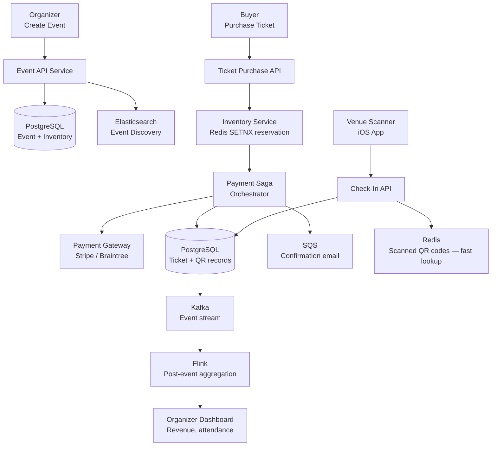
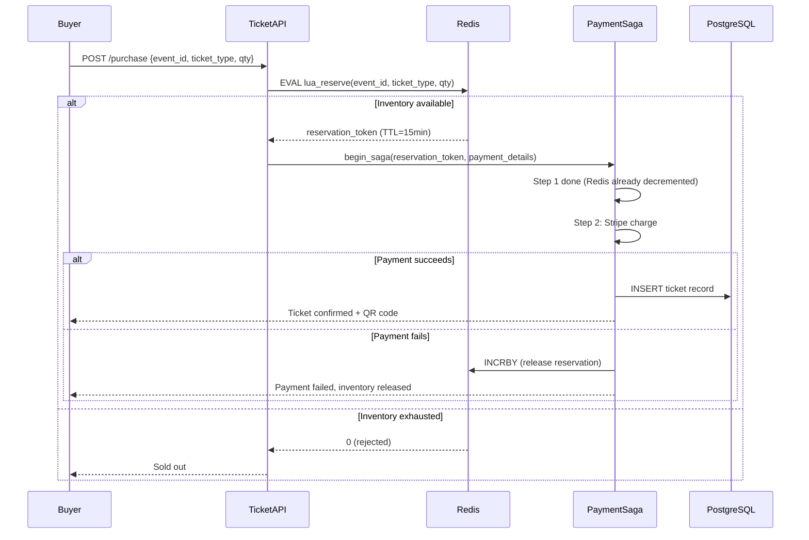
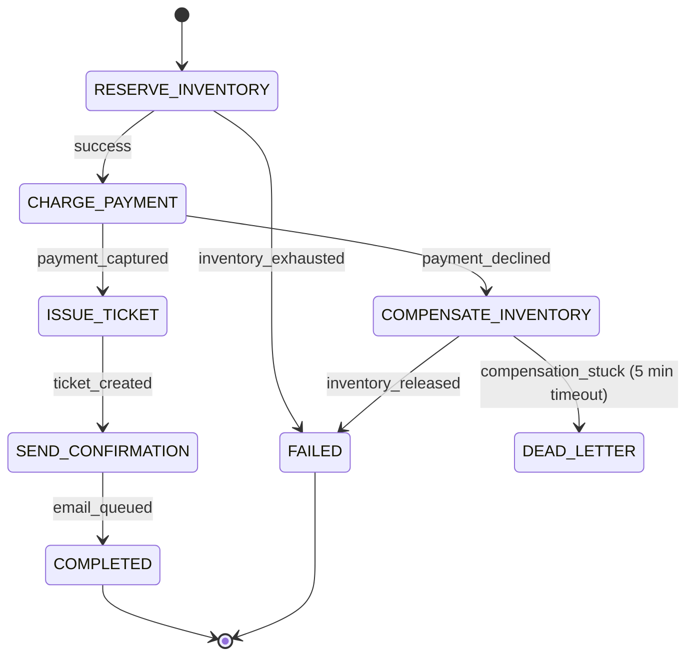
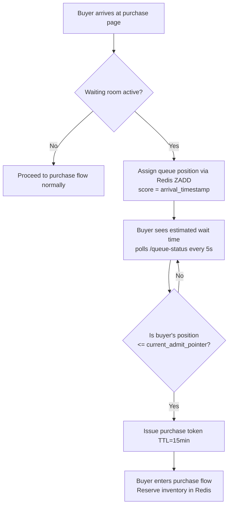
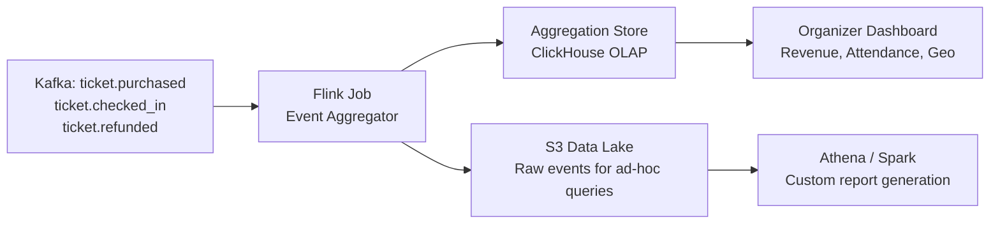

# Design an Event Lifecycle Management Platform

**Difficulty**: 🔴 Advanced | **Codemania #144**
**Reading Time**: ~14 min
**Interview Frequency**: High

---

## The Core Problem

Managing the full lifecycle of events at Eventbrite scale: creation → discovery → ticket purchase (with inventory management) → QR code check-in → post-event analytics. The hard problems: preventing oversell during ticket rushes (inventory race conditions), reliable QR code check-in at high volume, and stitching together a coherent analytics picture across the full funnel.

---

## Functional Requirements

- Organizers create and publish events with ticket types (general, VIP, early bird)
- Attendees browse and search events; purchase tickets
- Payment processing with inventory reservation (prevent oversell)
- Generate QR codes for tickets; check-in scanning at venue
- Post-event analytics: attendance rate, revenue, geographic breakdown

## Non-Functional Requirements

| Requirement | Target |
|-------------|--------|
| Ticket purchase throughput | 50,000 tickets/sec during popular event launches |
| Inventory accuracy | Zero oversell (sell exactly N tickets for N capacity) |
| QR check-in throughput | 10,000 scans/minute at venue entry |
| Check-in latency | < 500ms per scan (long lines if slow) |
| Analytics latency | Post-event report available within 1 hour of event end |

---

## Back-of-Envelope Estimates

- **Events**: 5M active events globally at any time
- **Ticket inventory**: 5M events × avg 500 tickets = 2.5B ticket records
- **Purchase spike**: Taylor Swift concert on sale → 100,000 concurrent buyers competing for 50,000 tickets
- **QR scan rate**: 10,000 capacity venue × 80% arrive in first 30 min = 8,000 scans in 1,800s = ~4.4 scans/sec per entry scanner (trivial per scanner; scale with # of scanners)
- **Analytics**: 5M events × 500 attendees × 10 analytics events = 25B events/day processed post-event

---

## High-Level Architecture



---

## Key Design Decisions

### 1. Ticket Inventory: Preventing Oversell

The core problem: 100k concurrent buyers, 50k tickets. Without coordination, all 100k buyers see "1 ticket available" and all try to purchase → oversell.

**Approach A: Optimistic Locking (DB-level)**
```sql
UPDATE ticket_inventory
SET available = available - 1, version = version + 1
WHERE event_id = :eid AND ticket_type = :type
  AND available > 0 AND version = :expected_version;
```
If 0 rows affected (version mismatch or available=0) → retry or reject. Good for low contention; degrades under high contention (many retries).

**Approach B: Redis Atomic Reservation (SETNX)**
```lua
-- Lua script (atomic in Redis)
local key = "inventory:" .. event_id .. ":" .. ticket_type
local available = redis.call("DECRBY", key, qty)
if available < 0 then
  redis.call("INCRBY", key, qty)  -- undo
  return 0  -- rejected
end
return 1  -- reserved
```

Reserve in Redis first (< 1ms), then process payment asynchronously. If payment fails, increment Redis counter back. This handles 50k concurrent reservations without database lock contention.

**Decision**: Redis atomic reservation for inventory (handles spike), PostgreSQL as authoritative source (sync'd after payment confirms).

### 2. Event State Machine

```
DRAFT → PUBLISHED → ON_SALE → SOLD_OUT → LIVE → COMPLETED → ARCHIVED
                ↓
            CANCELLED (from any state before COMPLETED)
```

State transitions enforced at the application layer with optimistic locking on the `event_status` field. Illegal transitions (e.g., COMPLETED → ON_SALE) rejected.

### 3. Saga Pattern for Ticket Purchase

Distributed transaction: reserve inventory + charge payment + issue ticket. If payment fails, must release inventory.

```
Step 1: Reserve inventory (Redis DECRBY)
  Compensation: Redis INCRBY (release)

Step 2: Charge payment (Stripe API)
  Compensation: Stripe refund

Step 3: Create ticket record + generate QR (PostgreSQL INSERT)
  Compensation: Mark ticket VOID

Step 4: Send confirmation email (SQS)
  Compensation: Send cancellation email
```

Saga orchestrator tracks step completion. On failure, run compensations in reverse order.

### 4. QR Code Check-In

QR code = HMAC-signed token:
```
qr_data = base64(ticket_id + event_id + expiry_ts + HMAC_SHA256(secret, ticket_id))
```

At check-in:
1. Scanner decodes QR → verify HMAC signature (prevents forgery)
2. Check Redis set `checked_in:{event_id}` → `SADD ticket_id` (returns 0 if already in set = duplicate scan)
3. Redis lookup: < 5ms → fast enough for high-throughput scanning
4. Async write to PostgreSQL for permanent record

Offline mode: scanner app caches valid ticket list; check-in works without network; syncs when reconnected.

---

## Event Discovery

Attendees search events by location, date, category:
- Elasticsearch index with geo-point field for location
- Query: `{"geo_distance": {"distance": "5km", "location": "37.77,-122.41"}}`
- Facets: date range, price range, category
- Trending events: Redis sorted set updated by purchase rate

---

## Top Interview Questions for This Problem

| Question | Tests |
|----------|-------|
| How do you handle 100k buyers competing for 50k tickets simultaneously? | Redis atomic DECR, optimistic locking, queue-based virtual waiting room |
| What happens if the payment gateway is down when a buyer tries to purchase? | Saga compensation — release inventory reservation, show retry page |
| How do you prevent the same QR code from being scanned twice (ticket sharing)? | Redis SADD idempotency, HMAC signature, event-scoped check-in set |
| How would you implement a "virtual waiting room" for very high-demand events? | Queue-based access control, estimated wait time, fair ordering |

---

## Common Mistakes

1. **Using SELECT FOR UPDATE on inventory**: Serializes all purchases through a DB lock. At 50k TPS, this becomes a single-threaded bottleneck. Use Redis atomic operations instead.
2. **Trusting client-side QR display without server verification**: QR can be screenshot and shared. Always verify HMAC signature server-side and check check-in status in Redis.
3. **Processing post-event analytics synchronously**: Analytics aggregation should be async (Kafka + Flink). Blocking the API on analytics hurts availability.

---

## Related Concepts

- [Message Queue Basics](../../04-messaging/concepts/message-queue-basics) — SQS for notification pipeline
- [Caching Fundamentals](../../02-caching/concepts/caching-fundamentals) — Redis inventory reservation

---

## Component Deep Dive 1: Inventory Reservation Service

The Inventory Reservation Service is the most critical architectural component in this system. It sits on the hot path for every ticket purchase and must handle sudden demand spikes — a Taylor Swift on-sale moment where 500,000 concurrent buyers hit the system within seconds of tickets going live.

### Why Naive Approaches Fail

**Database row locking (`SELECT FOR UPDATE`)** serializes all purchase requests through a single PostgreSQL row. With 50,000 tickets and 100,000 concurrent buyers, each transaction holds a lock for 100–300ms (payment round-trip). Throughput collapses to roughly 3–10 transactions/sec per inventory row — catastrophically below the 50,000 tickets/sec requirement.

**Optimistic locking with version fields** improves this but still suffers under high contention. When 10,000 buyers simultaneously read `version=42`, all try to `UPDATE ... WHERE version=42`, all but one fail, and those 9,999 must retry. At extreme concurrency, retry storms amplify load rather than shed it.

**The solution**: Redis atomic Lua scripts treat the counter as an in-memory integer. A single Redis `DECRBY` inside a Lua script is executed atomically in < 1ms, with no lock held across network calls. At 50,000 buyers/sec, Redis handles this as a stream of O(1) integer decrements.

### Internal Architecture



### Implementation Options Comparison

| Approach | Latency | Throughput | Trade-off |
|----------|---------|------------|-----------|
| PostgreSQL `SELECT FOR UPDATE` | 100–300ms (lock held during payment) | ~10 TPS per row | Serialized; deadlock risk at scale |
| Optimistic locking (version field) | 5–20ms per attempt, many retries under contention | ~500 TPS at low load; degrades at high contention | Simple, no external dep; retry storms under spike |
| Redis atomic Lua DECRBY | < 1ms reservation; payment async | 50,000+ reservations/sec | Requires Redis HA; Redis and DB can diverge on crash |
| Virtual waiting room queue | Queuing adds 1–10min wait | Unlimited serialized throughput | Fair; high UX friction for buyers |

**Production decision**: Redis atomic reservation is used for real-time inventory tracking. PostgreSQL is the authoritative record updated after payment confirmation. A periodic reconciliation job (runs every 5 minutes) compares `redis_available + redis_reserved + postgres_confirmed = initial_capacity` and alerts on drift > 1%.

---

## Component Deep Dive 2: Saga Orchestrator for Distributed Purchases

A ticket purchase spans three independently-fallible systems: inventory service (Redis), payment gateway (Stripe), and ticket database (PostgreSQL). A failure at any step requires rolling back the steps that already succeeded.

### Internal Mechanics

The saga orchestrator runs as a persistent state machine stored in PostgreSQL. Each saga record tracks:

- `saga_id` (UUID)
- `current_step` (enum: RESERVE, CHARGE, ISSUE_TICKET, NOTIFY)
- `status` (RUNNING, COMPENSATING, COMPLETED, FAILED)
- `payload` (JSONB snapshot of all inputs needed for compensation)

Steps are idempotent — retrying `CHARGE` with the same idempotency key returns the same Stripe charge result rather than double-charging. Compensations are also idempotent — releasing inventory twice (INCRBY) would oversell, so a compensation lock (`compensation_applied_at` timestamp) prevents double-compensation.

### Scale Behavior at 10x Load

At 10x baseline (500,000 concurrent purchases), the saga orchestrator becomes a write bottleneck: each saga writes 4–5 state transitions to PostgreSQL. At 500k sagas in flight, that is 2–2.5M writes/sec to a single `sagas` table.

Mitigation strategies used in production:
1. **Partition the sagas table** by `event_id` — all sagas for one event go to the same partition, reducing cross-partition contention.
2. **In-memory saga state for active sagas**: only persist state on step boundaries (RESERVE → CHARGE), not on every internal retry.
3. **Dead letter queue**: sagas stuck in COMPENSATING for > 5 minutes move to a DLQ for manual review — prevents zombie sagas from holding inventory reservations indefinitely.



| Failure Scenario | Compensation Chain | Recovery Time |
|-----------------|-------------------|---------------|
| Payment declined | Release Redis inventory | < 100ms |
| Stripe timeout (charge unknown) | Query Stripe charge status → refund if captured | 5–30 sec |
| PostgreSQL unavailable during ticket INSERT | Stripe refund + Redis INCRBY | 10–60 sec (manual if stuck) |
| Saga orchestrator crashes mid-saga | On restart, re-read `status=RUNNING` sagas and resume from `current_step` | < 1 min (cron reconciler) |

---

## Component Deep Dive 3: QR Code Check-In Storage Layer

Check-in is a write-once, read-once operation: each ticket is scanned exactly once. The Redis set `checked_in:{event_id}` holds all scanned `ticket_id` values. `SADD` returns 1 (new member added = first scan, allow entry) or 0 (already in set = duplicate, reject).

**Why Redis over PostgreSQL for check-in lookup**: At a 10,000-capacity venue with 80% arriving in 30 minutes, that is 8,000 scans in 1,800 seconds = ~4.4 scans/sec per scanner. With 20 entry lanes, the system sees ~88 scans/sec total — trivially handled. The hard constraint is **latency, not throughput**: lines back up if scan confirmation takes > 500ms. A PostgreSQL `INSERT ... ON CONFLICT` (with index) runs in 5–20ms; Redis SADD runs in < 1ms. Redis wins on latency.

**Durability concern**: Redis is in-memory — a Redis restart loses the checked-in set, allowing re-entry of already-scanned tickets. Mitigation:
- Redis AOF persistence (fsync every second) limits data loss to < 1 second of scans.
- Async Kafka event stream: every check-in publishes to Kafka topic `ticket.checked_in`; a Flink consumer writes to PostgreSQL as permanent audit log. Even if Redis is lost, PostgreSQL has the authoritative record within < 1 second.

**Offline scanner resilience**: The iOS scanner app pre-downloads the full valid ticket list for the event (gzip-compressed, ~1MB for 10,000 tickets) on venue WiFi before doors open. Scans work without network. On reconnect, the app batch-syncs all offline scans to the Check-In API, which deduplicates against the Redis set.

---

## Data Model

```sql
-- Events table
CREATE TABLE events (
    event_id        UUID PRIMARY KEY DEFAULT gen_random_uuid(),
    organizer_id    UUID NOT NULL REFERENCES organizers(organizer_id),
    title           TEXT NOT NULL,
    description     TEXT,
    venue_name      TEXT NOT NULL,
    venue_address   TEXT NOT NULL,
    venue_location  POINT NOT NULL,            -- geo lat/lng for Elasticsearch sync
    starts_at       TIMESTAMPTZ NOT NULL,
    ends_at         TIMESTAMPTZ NOT NULL,
    status          TEXT NOT NULL DEFAULT 'DRAFT'   -- DRAFT | PUBLISHED | ON_SALE | SOLD_OUT | LIVE | COMPLETED | CANCELLED | ARCHIVED
                    CHECK (status IN ('DRAFT','PUBLISHED','ON_SALE','SOLD_OUT','LIVE','COMPLETED','CANCELLED','ARCHIVED')),
    version         BIGINT NOT NULL DEFAULT 0,      -- optimistic lock for status transitions
    created_at      TIMESTAMPTZ NOT NULL DEFAULT now(),
    updated_at      TIMESTAMPTZ NOT NULL DEFAULT now()
);

-- Ticket types (tiers per event: General Admission, VIP, Early Bird)
CREATE TABLE ticket_types (
    ticket_type_id  UUID PRIMARY KEY DEFAULT gen_random_uuid(),
    event_id        UUID NOT NULL REFERENCES events(event_id),
    name            TEXT NOT NULL,              -- 'General Admission', 'VIP', 'Early Bird'
    price_cents     INT NOT NULL,               -- stored in cents to avoid float rounding
    currency        CHAR(3) NOT NULL DEFAULT 'USD',
    total_capacity  INT NOT NULL,
    sold_count      INT NOT NULL DEFAULT 0,     -- authoritative count after payment confirmed
    sale_starts_at  TIMESTAMPTZ,
    sale_ends_at    TIMESTAMPTZ,
    UNIQUE (event_id, name)
);

-- Ticket inventory in Redis (authoritative during sale window)
-- Key pattern: inventory:{event_id}:{ticket_type_id}  → integer (available count)
-- Key pattern: reserved:{reservation_token}           → HSET {event_id, ticket_type_id, qty, buyer_id, expires_at}

-- Tickets (issued after payment confirmed)
CREATE TABLE tickets (
    ticket_id       UUID PRIMARY KEY DEFAULT gen_random_uuid(),
    ticket_type_id  UUID NOT NULL REFERENCES ticket_types(ticket_type_id),
    event_id        UUID NOT NULL,
    buyer_id        UUID NOT NULL REFERENCES users(user_id),
    order_id        UUID NOT NULL,
    status          TEXT NOT NULL DEFAULT 'ACTIVE'
                    CHECK (status IN ('ACTIVE','CHECKED_IN','VOID','REFUNDED')),
    qr_payload      TEXT NOT NULL,              -- base64(ticket_id + event_id + expiry_ts + HMAC)
    qr_secret_version INT NOT NULL DEFAULT 1,  -- allows key rotation without voiding tickets
    issued_at       TIMESTAMPTZ NOT NULL DEFAULT now(),
    checked_in_at   TIMESTAMPTZ,
    CONSTRAINT uq_ticket_event UNIQUE (ticket_id, event_id)
);
CREATE INDEX idx_tickets_event_id ON tickets(event_id);
CREATE INDEX idx_tickets_buyer_id ON tickets(buyer_id);
CREATE INDEX idx_tickets_order_id  ON tickets(order_id);

-- Saga state for purchase orchestration
CREATE TABLE purchase_sagas (
    saga_id             UUID PRIMARY KEY DEFAULT gen_random_uuid(),
    buyer_id            UUID NOT NULL,
    event_id            UUID NOT NULL,
    ticket_type_id      UUID NOT NULL,
    qty                 INT NOT NULL,
    current_step        TEXT NOT NULL,          -- RESERVE | CHARGE | ISSUE_TICKET | NOTIFY | COMPENSATE_INVENTORY | COMPENSATE_CHARGE
    status              TEXT NOT NULL DEFAULT 'RUNNING',
    reservation_token   TEXT,                   -- Redis key for inventory hold
    stripe_payment_intent_id TEXT,
    payload             JSONB NOT NULL,         -- full snapshot for compensation
    started_at          TIMESTAMPTZ NOT NULL DEFAULT now(),
    updated_at          TIMESTAMPTZ NOT NULL DEFAULT now(),
    completed_at        TIMESTAMPTZ,
    failure_reason      TEXT
);
CREATE INDEX idx_sagas_status_updated ON purchase_sagas(status, updated_at)
    WHERE status IN ('RUNNING', 'COMPENSATING');  -- partial index for active sagas only

-- Check-in audit log (permanent record, async from Redis)
CREATE TABLE checkin_events (
    checkin_id      UUID PRIMARY KEY DEFAULT gen_random_uuid(),
    ticket_id       UUID NOT NULL REFERENCES tickets(ticket_id),
    event_id        UUID NOT NULL,
    scanner_device_id TEXT NOT NULL,
    scan_result     TEXT NOT NULL CHECK (scan_result IN ('ADMITTED','DUPLICATE','INVALID_SIGNATURE','EXPIRED')),
    scanned_at      TIMESTAMPTZ NOT NULL,
    synced_at       TIMESTAMPTZ NOT NULL DEFAULT now()
);
CREATE INDEX idx_checkin_event_ticket ON checkin_events(event_id, ticket_id);
```

---

## Scale Bottlenecks

| Traffic Level | Component That Breaks | Symptoms | Mitigation |
|---------------|----------------------|----------|------------|
| 10x baseline (500k tickets/sec) | Redis single-node inventory counter — all events on one Redis | Latency spikes > 10ms; CPU saturation on Redis primary | Shard Redis by `event_id` hash; use Redis Cluster with 16 shards |
| 100x baseline (5M tickets/sec) | Saga state machine writes to PostgreSQL `purchase_sagas` | PostgreSQL WAL write throughput saturated at ~100k writes/sec | Partition `purchase_sagas` by `event_id`; use Aurora with writer autoscaling; consider in-memory saga state with async persistence |
| 100x baseline (5M tickets/sec) | Kafka topic `ticket.purchased` — single partition per event becomes hot | Consumer lag grows; analytics delay exceeds 1-hour SLA | Partition topic by `(event_id, ticket_type_id)` hash; increase partition count to 100+ |
| 1000x baseline (50M tickets/sec) | Global Redis Cluster network bandwidth | Inter-node gossip and replication saturate 10Gbps links | Region-level Redis clusters per geographic zone; events pinned to nearest region; cross-region sync only for analytics, not inventory |
| 1000x baseline | Elasticsearch event discovery index | Query latency spikes > 500ms on global `geo_distance` queries | Use separate Elasticsearch clusters per region; index only events in that region's time zone window |

---

## How Eventbrite Built This

Eventbrite processes over 4 million events per year and has publicly documented several of the architectural decisions reflected here. At peak scale (major concerts and festivals), Eventbrite handles over 1 million ticket orders per day with spikes reaching 100,000+ concurrent purchase attempts for high-demand events.

**Technology stack**: Eventbrite runs on Python (Django) backend services with PostgreSQL as the primary relational store. For high-contention inventory, they moved away from pure database locking toward Redis-backed counters, consistent with the Approach B design described above. Their payment processing layer integrates with Stripe and PayPal and uses retry logic with idempotency keys to prevent double charges — exactly the saga compensation pattern.

**The non-obvious decision — ticket allocation pools**: For very high-demand events, Eventbrite does not expose all inventory at once. They use allocation pools: release 30% of tickets at launch, hold 40% as reserve to handle payment failures and cancellations, release the reserve in batches as the event date approaches. This transforms a single thundering-herd moment into multiple smaller spikes and allows them to honor last-minute cancellation refunds without truly overselling.

**Numbers from Eventbrite engineering**: Their Elasticsearch cluster indexes 5M+ active events globally with geo-distance search serving < 100ms P95 latency. Their check-in system is designed around the Eventbrite Organizer App, which pre-downloads ticket manifests to support offline scanning — the same offline-first architecture described in the QR check-in section. During peak event entry (stadium concerts), check-in throughput requirements reach 20,000 scans per minute across all entry points, which their Redis-backed deduplication handles without batching.

**Source**: Eventbrite Engineering Blog — "Scaling Eventbrite" (2018), and conference presentations at PyCon and SREcon describing their migration from monolith to service-oriented architecture around 2015–2019.

**Lessons applicable here**: The allocation pool pattern (hold 40% inventory in reserve) is directly applicable to any high-demand event. It decouples the thundering-herd spike from the true sellout moment, giving the platform time to process refunds and cancellations before releasing reserve inventory. Systems that expose 100% of inventory at launch experience a worse user experience (immediate "sold out" for buyers who successfully reserved but then have payment decline) and higher infrastructure cost (must provision for 10x normal load for 30 seconds, then idle for hours). The allocation pool smooths demand at the cost of slightly longer total sale duration.

---

## Interview Angle

**What the interviewer is testing:** Whether you understand the difference between inventory consistency (preventing oversell) and payment atomicity (saga compensation), and can correctly identify which component handles which concern. Many candidates conflate these into a single "database transaction" which fails at scale.

**Common mistakes candidates make:**

1. **Using a database transaction spanning inventory + payment**: Payment gateway calls (Stripe API) take 200ms–2 seconds and cannot be inside a database transaction. Holding a DB lock during a Stripe call means every purchase blocks a DB connection for up to 2 seconds, collapsing throughput to < 500 concurrent purchases. The correct answer is a saga with compensating transactions.

2. **Forgetting QR code replay attacks**: Candidates often design QR codes as simple UUIDs and miss that a screenshot of the QR can be shared. The HMAC signature + Redis SADD idempotency check are both required — signature prevents forgery, SADD prevents replay.

3. **Designing analytics as synchronous**: Candidates propose `SELECT COUNT(*), SUM(revenue) FROM tickets WHERE event_id = :id` on the live database after event end. At 25 billion analytics events per day, running aggregation queries on the operational PostgreSQL instance will cause read load spikes that degrade ticket purchases for concurrent events. Analytics must be async (Kafka → Flink → separate analytics store).

**The insight that separates good from great answers:** Recognizing that Redis inventory count and PostgreSQL `sold_count` will diverge under failures, and proactively designing a reconciliation mechanism (cron job comparing Redis + pending sagas + PostgreSQL confirmed count = initial capacity) rather than treating Redis as an eventually-correct mirror that self-heals. The reconciliation SLA (5-minute drift tolerance) is a deliberate business decision, not an oversight.

---

## Key Numbers to Remember

| Metric | Value | Context |
|--------|-------|---------|
| Peak ticket purchase throughput | 50,000 tickets/sec | During Taylor Swift / Beyoncé on-sale moments |
| Redis DECRBY latency | < 1ms | Single atomic operation; bottleneck is not Redis |
| PostgreSQL `SELECT FOR UPDATE` throughput | ~10 TPS per row | Why DB locking fails for hot inventory |
| QR check-in scan latency | < 5ms | Redis SADD lookup; < 500ms total including network |
| Redis set memory per event | ~1MB | 10,000 ticket IDs × 100 bytes each |
| Saga compensation time (payment declined) | < 100ms | Redis INCRBY is near-instant |
| Saga compensation time (Stripe timeout) | 5–30 seconds | Must query Stripe charge status first |
| Post-event analytics availability | < 1 hour | Kafka + Flink pipeline SLA |
| Elasticsearch geo-distance query P95 | < 100ms | For event discovery at 5M active events |
| Offline scanner manifest download size | ~1MB gzip | 10,000 ticket records for pre-download |
| Kafka partitions for ticket.purchased topic | 64 partitions | Partitioned by event_id hash |
| ClickHouse compression ratio vs PostgreSQL | ~10x | Columnar storage on ticket records |
| Waiting room admission batch size | 500 buyers / 5 sec | Calibrated to purchase completion rate |
| Inventory reconciliation frequency | Every 5 minutes | Cron job comparing Redis + sagas + PostgreSQL |

---

## Virtual Waiting Room Design

For extreme demand events (Taylor Swift Eras Tour, Super Bowl tickets), the inventory reservation system described above is still insufficient. With 2 million buyers competing for 50,000 tickets, even Redis will see 2 million concurrent DECRBY calls arriving in < 1 second — a thundering herd that overwhelms any single bottleneck.

The solution is a **virtual waiting room**: a queue-based access control layer placed in front of the purchase flow.



**Implementation details:**
- Redis sorted set `waiting_room:{event_id}` with score = `arrival_epoch_ms` (FIFO ordering)
- Admission rate controller: a background job runs every 5 seconds and advances the admit pointer by `batch_size` (e.g., 500 buyers per batch)
- Batch size is calibrated to match purchase completion rate — if 500 buyers complete purchase in 5 seconds, admit 500 more
- Estimated wait time = `(queue_position / batch_size) * batch_interval_seconds`
- Anti-bot: buyers must complete a lightweight CAPTCHA challenge before joining the queue

**Trade-offs**: Virtual waiting room adds 2–60 minutes of friction for buyers in the queue. However, it prevents the system from being overwhelmed, ensures fair FIFO access, and reduces infrastructure costs (no need to over-provision 10x capacity for a 30-second spike).

---

## Post-Event Analytics Pipeline

After an event ends, organizers need a comprehensive report covering: total revenue by ticket type, attendance rate (tickets sold vs. checked in), geographic distribution of attendees, and purchase funnel drop-off (viewed → reserved → purchased).



**Flink aggregation job design:**
- Trigger: event completion publishes `event.completed` message to Kafka
- Flink job consumes from `ticket.purchased`, `ticket.checked_in`, and `ticket.refunded` topics, keyed by `event_id`
- Tumbling window: aggregate per-event stats every 1 minute during the event, then produce final aggregate on `event.completed`
- Output: write aggregated row to ClickHouse `event_stats` table (one row per event, with JSON columns for geo breakdown)
- SLA: report available within 60 minutes of event end; ClickHouse OLAP queries on pre-aggregated data return in < 500ms

**Kafka topic partitioning strategy**: The `ticket.purchased` topic is partitioned by `event_id` hash (64 partitions). This ensures all purchase events for a single event go to the same partition and are processed in order by the Flink job. Without event-keyed partitioning, the Flink aggregator would need a shuffle stage to group by event, doubling pipeline latency.

**ClickHouse choice over PostgreSQL for analytics**: ClickHouse columnar storage compresses ticket records ~10x compared to PostgreSQL row storage. A `SUM(price_cents)` query across 500,000 ticket records takes < 10ms in ClickHouse vs. 5–10 seconds in PostgreSQL on cold data. For organizers running queries on multi-year historical data (50M+ ticket records), ClickHouse is the only viable option.

---

## Failure Modes and Operational Runbooks

### Inventory Drift (Redis vs PostgreSQL disagree)

**Symptom**: `redis_available + saga_in_flight + postgres_confirmed != initial_capacity`. Some tickets are double-counted or lost.

**Root cause**: A saga crashed after Redis DECRBY but before PostgreSQL INSERT. The Redis count was decremented but no ticket record was created.

**Detection**: Reconciliation cron job runs every 5 minutes. Query:
```sql
SELECT tt.ticket_type_id,
       tt.total_capacity,
       tt.sold_count AS pg_confirmed,
       COUNT(ps.saga_id) FILTER (WHERE ps.status = 'RUNNING') AS sagas_in_flight
FROM ticket_types tt
LEFT JOIN purchase_sagas ps USING (ticket_type_id)
GROUP BY tt.ticket_type_id, tt.total_capacity, tt.sold_count;
-- Compare: total_capacity - pg_confirmed - sagas_in_flight should == Redis available count
```

**Fix**: If drift > 0 (inventory leaked), increment Redis counter by drift amount. If drift < 0 (oversold), page on-call engineer — this requires manual investigation to determine which saga failed to compensate.

### Saga Stuck in COMPENSATING State

**Symptom**: Saga has `status = 'COMPENSATING'` for > 5 minutes. Inventory may be double-held.

**Root cause**: Stripe refund API returned a transient 503; compensation step never confirmed.

**Runbook**:
1. Query `purchase_sagas WHERE status = 'COMPENSATING' AND updated_at < now() - interval '5 minutes'`
2. For each stuck saga: check `stripe_payment_intent_id` against Stripe dashboard
3. If Stripe shows charge captured: trigger refund via admin tool
4. If Stripe shows charge not captured: safe to release inventory and mark saga FAILED
5. After manual resolution, run reconciliation check to confirm inventory consistency

### QR Code HMAC Key Rotation

**Why**: If the signing secret is compromised, all outstanding QR codes must be invalidated. However, an event with 50,000 attendees cannot have all tickets re-issued simultaneously.

**Design**: The `qr_secret_version` field in the `tickets` table allows multiple active key versions. During rotation:
1. Generate new key version (v2)
2. New tickets issued with v2 signature
3. Check-in API verifies against both v1 and v2 for 30 days (overlap window)
4. After 30 days, disable v1 verification

This allows gradual rotation without forcing attendees to refresh their tickets.

---

## 📚 Resources & References

| Resource | Type | What You'll Learn |
|----------|------|------------------|
| [ByteByteGo — Ticketmaster System Design](https://www.youtube.com/@ByteByteGo) | 📺 YouTube | Inventory management, virtual waiting room, QR check-in |
| [Hussein Nasser — Distributed Transactions](https://www.youtube.com/@hnasr) | 📺 YouTube | Saga pattern implementation, compensation strategies |
| [Martin Kleppmann — Designing Data-Intensive Applications](https://martin.kleppmann.com) | 📚 Book | Distributed transactions, optimistic vs pessimistic locking |
| [High Scalability — Ticketing Systems](https://highscalability.com) | 📖 Blog | Lessons from real ticketing platform architecture |
