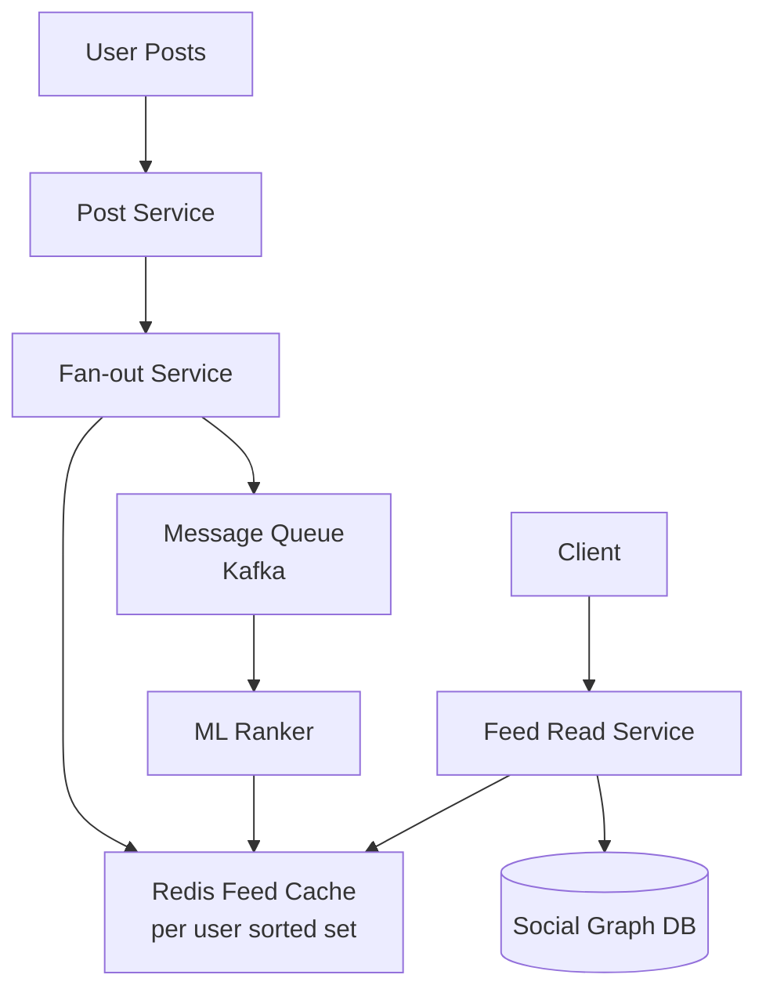

# Design Facebook Newsfeed — Fan-out at Scale

**Difficulty**: 🔴 Advanced
**Reading Time**: Coming Soon
**Interview Frequency**: Very High

---

> 🚧 **Full article coming soon.** This stub gives you the essentials to start thinking about this problem.

---

## The Core Problem

Delivering a personalized, ranked newsfeed to 2 billion users with sub-100ms read latency works fine for average users, but breaks catastrophically when a celebrity with 100M followers posts content — the fan-out write storm generates 100M cache writes in seconds. The system must balance write amplification against read latency.

## Functional Requirements

- Users see a ranked feed of posts from friends and pages they follow
- Feed updates in near-real-time (within a few seconds of a post)
- Posts can include text, images, videos, and links
- Feed supports infinite scroll with pagination

## Non-Functional Requirements

| Requirement | Target |
|-------------|--------|
| Availability | 99.99% (52 min downtime/year) |
| Feed read latency | p99 < 100ms |
| Feed write propagation | < 5 seconds for average users |
| Scale | 2B users, 500M DAU, 100M posts/day |

## Back-of-Envelope Estimates

- **Posts per second**: 100M posts/day ÷ 86,400s = ~1,160 posts/sec
- **Fan-out writes**: 1,160 posts/sec × avg 300 friends = 348,000 feed writes/sec
- **Feed cache storage**: 500M DAU × 500 posts in cache × 8 bytes per post ID = ~2TB for feed lists

## Key Design Decisions

1. **Push vs Pull Fan-out Hybrid** — push (fan-out on write) for regular users gives fast reads; pull (fan-out on read) for celebrities with 10M+ followers avoids write storms. Merge at read time.
2. **ML-based Ranking** — don't show raw chronological feed; score each candidate post by engagement probability using EdgeRank or successor models to maximize time-on-site.
3. **Caching Hot Feeds** — store pre-computed feed lists as sorted sets in Redis; cache only active users (logged in last 30 days) to control memory cost.

## High-Level Architecture

## Top Interview Questions for This Problem

| Question | Tests |
|----------|-------|
| How do you handle fan-out for users with 100M followers? | Write amplification, hybrid push/pull |
| What happens if the Redis feed cache is cold for a user? | Read fallback, cache warming strategy |
| How do you rank posts without scanning the entire social graph? | ML scoring, candidate generation |

## Related Concepts

- [Consistent Hashing for cache sharding](../../../05-infrastructure/concepts/consistent-hashing)
- [Redis Sorted Sets for feed storage](../../../03-caching/concepts/redis-data-structures)

---

*📚 Full deep-dive with multiple approaches, trade-off tables, and pseudocode coming soon.*
