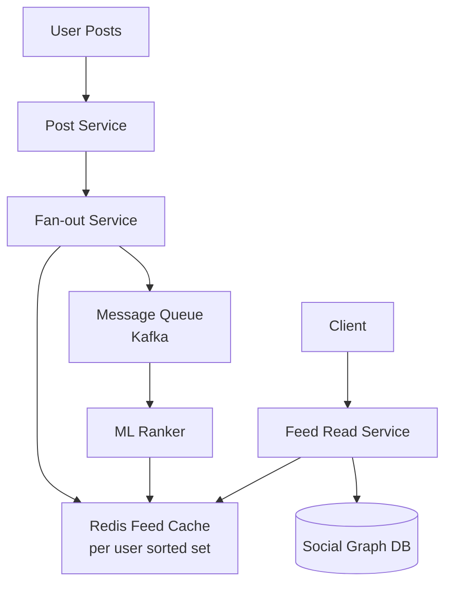
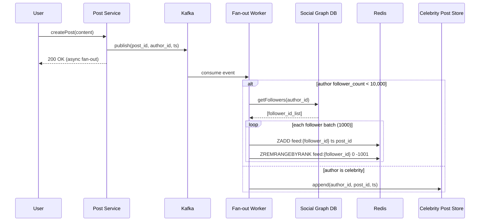
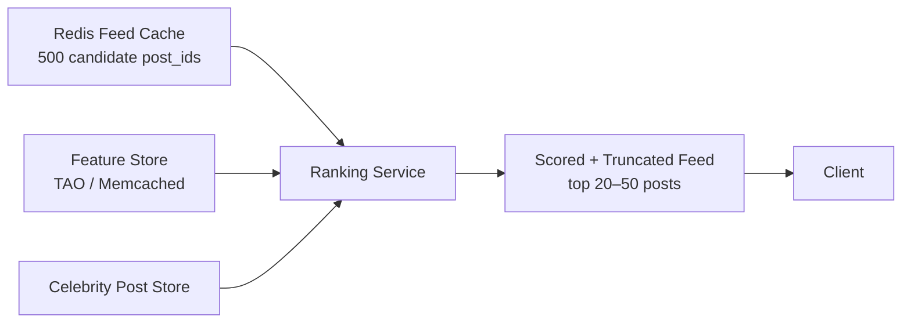
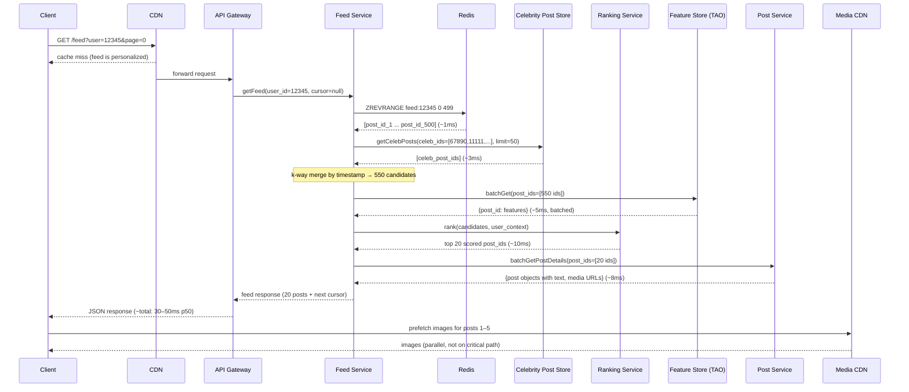
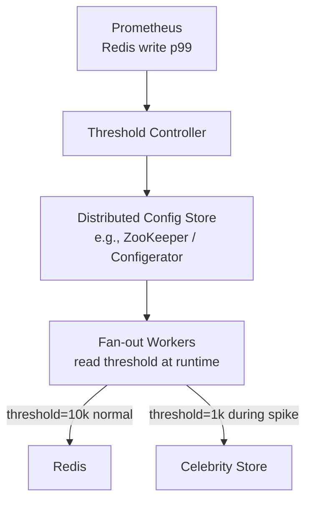

# Design Facebook Newsfeed — Fan-out at Scale

**Difficulty**: 🔴 Advanced
**Reading Time**: Coming Soon
**Interview Frequency**: Very High

---

> 🚧 **Full article coming soon.** This stub gives you the essentials to start thinking about this problem.

---

## The Core Problem

Delivering a personalized, ranked newsfeed to 2 billion users with sub-100ms read latency works fine for average users, but breaks catastrophically when a celebrity with 100M followers posts content — the fan-out write storm generates 100M cache writes in seconds. The system must balance write amplification against read latency.

## Functional Requirements

- Users see a ranked feed of posts from friends and pages they follow
- Feed updates in near-real-time (within a few seconds of a post)
- Posts can include text, images, videos, and links
- Feed supports infinite scroll with pagination

## Non-Functional Requirements

| Requirement | Target |
|-------------|--------|
| Availability | 99.99% (52 min downtime/year) |
| Feed read latency | p99 < 100ms |
| Feed write propagation | < 5 seconds for average users |
| Scale | 2B users, 500M DAU, 100M posts/day |

## Back-of-Envelope Estimates

- **Posts per second**: 100M posts/day ÷ 86,400s = ~1,160 posts/sec
- **Fan-out writes**: 1,160 posts/sec × avg 300 friends = 348,000 feed writes/sec
- **Feed cache storage**: 500M DAU × 500 posts in cache × 8 bytes per post ID = ~2TB for feed lists

## Key Design Decisions

1. **Push vs Pull Fan-out Hybrid** — push (fan-out on write) for regular users gives fast reads; pull (fan-out on read) for celebrities with 10M+ followers avoids write storms. Merge at read time.
2. **ML-based Ranking** — don't show raw chronological feed; score each candidate post by engagement probability using EdgeRank or successor models to maximize time-on-site.
3. **Caching Hot Feeds** — store pre-computed feed lists as sorted sets in Redis; cache only active users (logged in last 30 days) to control memory cost.

## High-Level Architecture



## Top Interview Questions for This Problem

| Question | Tests |
|----------|-------|
| How do you handle fan-out for users with 100M followers? | Write amplification, hybrid push/pull |
| What happens if the Redis feed cache is cold for a user? | Read fallback, cache warming strategy |
| How do you rank posts without scanning the entire social graph? | ML scoring, candidate generation |

## Related Concepts

- [Consistent Hashing for cache sharding](../../../14-algorithms/concepts/consistent-hashing-deep-dive)
- [Redis Sorted Sets for feed storage](../../../03-redis/concepts/redis-data-structures-deep-dive)

---

## Component Deep Dive 1: Fan-out Service

The fan-out service is the most critical and most dangerous component in a newsfeed system. Its job is to propagate a newly created post to the feed lists of all followers. A naive implementation — iterate over all followers and insert the post ID into each user's feed sorted set — works at 100 followers but fails catastrophically at 100 million.

**Why naive fan-out fails:** If a user with 10M followers posts at peak time (assume 5,000 such posts/min), you generate 5,000 × 10,000,000 = 50 billion cache write operations per minute. Even at 1M writes/sec per Redis shard, you need 833 shards just for celebrity writes. Network bandwidth, Redis CPU, and Kafka consumer lag all collapse simultaneously.

**The Hybrid Push/Pull Model:** Facebook solves this with a threshold-based hybrid. Users below ~10,000 followers receive push fan-out (write their post ID into each follower's Redis sorted set immediately). Users above the threshold (celebrities, verified pages) are stored in a separate celebrity post list. At read time, the feed service merges the user's pre-computed Redis feed with a real-time query for any celebrity posts from followed celebrities. The merge adds ~10ms but eliminates write amplification.

**Internal flow for push fan-out:**
1. Post Service publishes `{post_id, author_id, timestamp}` to Kafka topic `post-created`.
2. Fan-out consumer reads the event, queries Social Graph Service for author's follower list (paginated, 1,000 at a time).
3. Fan-out worker writes `post_id` with score `timestamp` to each follower's Redis sorted set `feed:{user_id}`.
4. Sorted set is capped at 1,000 entries (ZREMRANGEBYRANK to drop oldest).



| Approach | Write Latency | Read Latency | Trade-off |
|----------|---------------|--------------|-----------|
| Pure push (fan-out on write) | High for celebrities (100M writes) | ~1ms (pre-built) | Unusable for high-follower accounts |
| Pure pull (fan-out on read) | None | 100–500ms (query + merge) | Too slow for 2B users at read time |
| Hybrid push+pull | Low (only for regular users) | ~10ms (merge step) | Operational complexity; threshold tuning |

---

## Component Deep Dive 2: Feed Ranking Service

A raw chronological feed performs poorly on engagement metrics — users miss content from close friends buried under high-volume page posts. Facebook's ranking pipeline (originally EdgeRank, now a deep learning model called "integrity-aware ranking") scores every candidate post before the feed is assembled.

**Candidate generation:** The ranking service does not score every post from every friend. Instead it pulls the top-N post IDs from the user's pre-computed Redis feed (typically 500 candidates), plus any celebrity post IDs from accounts the user follows. This bounded candidate set is critical — scoring 10,000 posts per feed request at 500M DAU would require 5 trillion model inferences per day.

**Feature extraction:** For each candidate post, the ranker extracts:
- Author affinity score (how often does this user engage with the author?)
- Post age decay (exponential decay, half-life ~6 hours)
- Post type weight (video > photo > link > status)
- Engagement velocity (likes/comments in first 5 minutes after post)
- Negative signals (user hid posts from this author before)

**At 10x load:** The ranking service is stateless and horizontally scalable. The bottleneck at 10x is feature store read latency. If the feature store (typically a low-latency key-value store like Memcached or TAO) becomes hot, p99 latency spikes from 5ms to 80ms, pushing total feed latency above the 100ms SLA. Mitigation: per-request feature caching, asynchronous prefetch triggered by login events.



| Ranking Signal | Weight Category | Update Frequency |
|----------------|-----------------|-----------------|
| Author affinity | High | Batch, every 1 hour |
| Post engagement velocity | High | Real-time, stream processing |
| Post age decay | Medium | Computed at request time |
| Post type preference | Medium | Batch, every 24 hours |
| Negative feedback (hide/unfollow) | High | Near real-time, <30s |

---

## Component Deep Dive 3: Feed Cache (Redis Sorted Sets)

Each active user's feed is stored as a Redis sorted set with key `feed:{user_id}`. The score is the post's Unix timestamp, and the member is the `post_id`. ZREVRANGE retrieves the most recent N posts in O(log N + N) time, which at N=50 is effectively O(1) from a practical standpoint.

**Key decisions:**
- **Eviction policy:** Only pre-build caches for users active in the last 30 days. 500M DAU × 2TB total cache ÷ 500M = ~4KB per user. At a 30-day window with 1.5B monthly active users, roughly 500M users have active caches. The remaining 1.5B users get cache-miss handling (cold start pull from DB).
- **Cache warming on login:** When an inactive user logs in, a background job triggers a cold-start fan-out: query the social graph for the 50 most recent posts from friends, score them, and populate the Redis sorted set. This takes 200–500ms and is hidden behind a loading screen.
- **Sharding:** Feed cache is sharded by `user_id % num_shards` using consistent hashing. A typical deployment uses 100–500 Redis shards. Resharding requires coordinated migration; consistent hashing limits key movement to 1/N of keys when adding a shard.
- **Cache size cap:** ZREMRANGEBYRANK caps each sorted set at 1,000 entries to bound memory. If a user scrolls to post #1001, the system falls back to a DB query (rare path, <0.1% of reads).

---

## Data Model

```sql
-- Posts table (MySQL, sharded by author_id)
CREATE TABLE posts (
    post_id         BIGINT UNSIGNED NOT NULL,  -- Snowflake ID (time-sortable)
    author_id       BIGINT UNSIGNED NOT NULL,
    content_text    TEXT,
    media_urls      JSON,                       -- ["s3://bucket/img1.jpg", ...]
    post_type       ENUM('status','photo','video','link','share') NOT NULL,
    privacy         ENUM('public','friends','custom') NOT NULL DEFAULT 'friends',
    created_at      BIGINT NOT NULL,            -- Unix ms timestamp
    like_count      INT UNSIGNED DEFAULT 0,
    comment_count   INT UNSIGNED DEFAULT 0,
    share_count     INT UNSIGNED DEFAULT 0,
    is_deleted      TINYINT(1) DEFAULT 0,
    PRIMARY KEY (post_id),
    INDEX idx_author_created (author_id, created_at DESC)
) ENGINE=InnoDB;

-- Social Graph (separate service, TAO at Facebook — adjacency list sharded by user_id)
CREATE TABLE follows (
    follower_id     BIGINT UNSIGNED NOT NULL,
    followee_id     BIGINT UNSIGNED NOT NULL,
    created_at      BIGINT NOT NULL,
    PRIMARY KEY (follower_id, followee_id),
    INDEX idx_followee (followee_id, follower_id)   -- for fan-out: "who follows X?"
) ENGINE=InnoDB;

-- Feed cache (Redis sorted set — not SQL)
-- Key: feed:{user_id}
-- Member: post_id (as string)
-- Score: post created_at timestamp (Unix ms)
-- ZADD feed:12345 1700000000000 "9876543210"
-- ZREVRANGE feed:12345 0 49  -- get 50 most recent

-- Celebrity/high-follower post list (Redis list per author)
-- Key: celeb_posts:{author_id}
-- LPUSH celeb_posts:67890 "post_id"
-- LRANGE celeb_posts:67890 0 199  -- 200 most recent posts from celebrity

-- User affinity scores (Memcached / Redis Hash)
-- Key: affinity:{viewer_id}:{author_id}  Value: float score 0.0–1.0
-- TTL: 3600s (refreshed by background ML job)

-- Ranking feature store (TAO / RocksDB-backed key-value)
-- Key: post_features:{post_id}
-- Value JSON:
-- {
--   "engagement_velocity": 142,   -- likes+comments per minute in first 5 min
--   "post_type_score": 1.4,       -- video=1.5, photo=1.2, link=1.0, status=0.8
--   "media_quality_score": 0.87,  -- from image/video analysis ML model
--   "spam_score": 0.02            -- from integrity model
-- }
```

---

## Scale Bottlenecks

| Traffic Level | Component That Breaks | Symptoms | Mitigation |
|---------------|----------------------|----------|------------|
| 10x baseline (5,000 posts/sec) | Fan-out Kafka consumers fall behind | Feed propagation delay increases from 2s to 30s+ | Add fan-out consumer partitions; increase Kafka topic partitions to 2,000 |
| 10x baseline | Redis feed cache CPU saturation | Write latency spikes from 0.5ms to 20ms; p99 feed reads degrade | Add Redis shards (horizontal); use pipelining to batch ZADD operations |
| 100x baseline (50,000 posts/sec) | Social Graph DB read overload | Fan-out workers timeout querying follower lists; celebrity threshold logic fails | Shard social graph DB by user_id; cache follower lists in Memcached with 60s TTL |
| 100x baseline | Feature store becomes hot | Ranking p99 latency >100ms; feed SLA breached | Replicate feature store reads across 3 replicas; pre-fetch features async at login |
| 1000x baseline (500,000 posts/sec) | Kafka broker throughput ceiling (~1GB/s per broker) | Message lag grows unbounded; feed freshness degrades to minutes | Increase broker count; partition posts by author shard; use tiered storage for lag recovery |
| 1000x baseline | Redis memory exhaustion | OOM evictions randomly drop user feed caches; cold-start spike hammers DB | Reduce per-user cache to 200 entries; evict feeds for users inactive >7 days; add Redis Cluster auto-scaling |

---

## How Instagram Built This

Instagram's feed system is the closest publicly documented analog to Facebook's newsfeed at comparable scale. By 2019, Instagram had 1 billion monthly active users generating 100 million posts per day — nearly identical to the parameters in this problem.

**Technology choices:** Instagram stores the social graph in PostgreSQL sharded by user_id, with a Cassandra layer for feed storage (not Redis — a key difference). Each user's feed is stored as a Cassandra row with post IDs ordered by timestamp. Cassandra's wide-row model maps naturally to the sorted-set access pattern (latest N entries) without Redis's memory constraints.

**Specific numbers:** At 100M posts/day and an average of 300 followers per account, Instagram's fan-out service processed roughly 30 billion feed writes per day (~347,000 writes/sec sustained). Their Cassandra cluster for feed storage spanned hundreds of nodes to sustain this write rate.

**The non-obvious architectural decision:** Instagram ran pure push fan-out initially and hit the celebrity problem at scale. Their solution was not the Redis hybrid described above — instead they introduced a "feed hydration" step. Feed reads do a lightweight merge between the Cassandra pre-built feed and a real-time query to a separate celebrity index. The celebrity index is a simple inverted list: for each celebrity an account follows, the 50 most recent post IDs are stored in Memcached. At read time, the feed service performs a k-way merge of the Cassandra feed and all celebrity Memcached lists in parallel — typically 200–400ms latency before caching.

**Source:** Instagram Engineering blog post "What powers Instagram: Hundreds of millions of users, zero downtime" (2012) and "Scaling Instagram Infrastructure" (QCon 2019 talk by Lisa Guo).

---

## Full Read Path — End to End

Understanding the complete read path is essential for interviews because each hop adds latency that must be budgeted against the 100ms SLA. Here is the sequence a feed request travels from the client tap to rendered posts:



**Latency budget breakdown (p50):**
- Redis ZREVRANGE: 1ms
- Celebrity store read: 3ms
- Feature store batch read: 5ms
- Ranking model inference: 10ms
- Post details batch read: 8ms
- Network + serialization: 5–15ms
- **Total p50: ~30–50ms** (well within 100ms SLA)

**Where p99 diverges from p50:** The feature store is the most common culprit. A cold key in TAO/Memcached falls through to the backing database, adding 40–60ms. A single slow key in a batch of 500 features will hold the entire batch response (head-of-line blocking). The fix is to set a per-batch timeout of 20ms and use stale features for keys that miss the deadline — a slightly less accurate ranking is preferable to a latency SLA breach.

---

## Failure Modes and Recovery

Every component in the read path can fail. The feed service must be resilient enough that a partial failure degrades gracefully rather than serving an error page.

### Redis Feed Cache Miss (Cold Start)

**Trigger:** User logs in after 30+ days of inactivity. Their `feed:{user_id}` key has been evicted.

**Symptom:** ZREVRANGE returns empty list. Feed service falls back to a synchronous cold-start query.

**Cold-start procedure:**
1. Query Social Graph DB for the user's top 200 followees (ordered by affinity score).
2. For each followee, fetch their 5 most recent post IDs from the Posts DB (1,000 DB reads total, but parallelized).
3. Merge, score, populate Redis sorted set.
4. Return top 20 ranked posts.

**Total time:** 200–500ms. The client receives a spinner; first-load latency is elevated. Background job continues warming the full 500-post cache after the initial response is sent.

**Prevention:** Background job scans users who have been inactive for 25–29 days and pre-warms their cache 24 hours before likely re-engagement (using ML model trained on return probability).

### Kafka Fan-out Consumer Lag

**Trigger:** Sudden traffic spike (viral event, holiday peak) causes fan-out Kafka consumers to fall behind. Consumer group lag grows from 0 to 10M+ messages.

**Symptom:** Feed propagation delay grows from <5s to minutes. Users post and don't see their own post in their feed (self-post problem — separate fast path needed for author's own feed).

**Mitigation:**
- Auto-scale consumer group (Kubernetes HPA on consumer lag metric via Kafka Exporter + Prometheus).
- Prioritize self-post delivery: separate Kafka topic `self-post-fanout` with dedicated consumers that only write to the author's own feed.
- During lag recovery, apply back-pressure: new posts entering the lagged topic are stamped with a "delayed" flag; clients see a "Feed may be delayed" banner.

### Ranking Service Unavailability

**Trigger:** Ranking service deployment fails; all replicas are unhealthy for 30 seconds.

**Symptom:** Feed reads timeout waiting for scoring; feed service returns 503.

**Degraded mode:** Feed service falls back to chronological ordering (skip ranking step). Users see a slightly worse feed but the service stays available. ML ranking resumes automatically when the service recovers. This is the correct design: ranking is enhancement, not correctness.

---

## Operational Runbook: Tuning the Celebrity Threshold

The threshold between push and pull fan-out (defaulted to 10,000 followers) is not a fixed number. It must be tuned based on current write capacity headroom.

**Formula:**
```
max_safe_push_threshold = (redis_write_capacity_per_sec × replication_factor)
                          ÷ (peak_posts_per_sec × celebrity_post_rate)
```

At 500 Redis write ops/ms per shard × 200 shards = 100,000 writes/sec total capacity:
- Reserve 50% for non-celebrity fan-out: 50,000 writes/sec for celebrity.
- If 500 users with exactly 10,000 followers each post simultaneously: 500 × 10,000 = 5,000,000 writes.
- That burst would take 100 seconds to drain — unacceptable.

**In practice:** The threshold is dynamically lowered during high-traffic periods (Super Bowl, New Year's Eve) and raised during low-traffic periods. A threshold controller service reads real-time Redis write latency from Prometheus and adjusts the threshold via a distributed config service (similar to Facebook's Configerator or Etsy's Feature Flags).



---

## Privacy and Feed Filtering

A commonly overlooked dimension in interviews: not every post in a user's social graph should appear in their feed. Privacy filtering must happen before posts are served.

**Privacy dimensions:**
- **Post-level privacy:** `public` / `friends` / `custom` (specific friend lists). A user who posts to a custom list of 10 friends should not have that post fan-out to all 10,000 followers.
- **Block/mute:** If viewer has blocked author or vice versa, the post must be excluded even if it passed the friend check.
- **Restricted profiles:** Some accounts limit who can see their posts based on location, age, or verified status.

**Implementation:** Privacy checks are applied in two places:
1. **At fan-out time:** For posts with `friends` or `custom` privacy, the fan-out service only writes to the Redis feeds of users in the allowed set. This is the preferred path — it prevents ineligible post IDs from even entering the feed cache.
2. **At read time (safety net):** Before returning the final 20 posts, the feed service performs a lightweight privacy re-check against a privacy cache (Memcached, 30s TTL). This catches edge cases where privacy settings were updated after fan-out occurred (a user changed their post from `public` to `friends-only` after 100,000 fan-outs had already occurred).

**Performance impact of privacy re-check:** At 20 posts per response × 500M feed reads/day = 10 billion privacy checks per day. Each check is a Memcached GET (~0.2ms). Batching 20 checks into one multi-get call keeps overhead at ~2ms per feed request.

---

## Pagination and Infinite Scroll

Pagination in a dynamically ranked feed is more complex than it appears. Offset-based pagination (`page=2`) breaks for ranked feeds because new posts inserted at the top shift all offsets.

**Cursor-based pagination (correct approach):**
- The server returns a `next_cursor` value after each page.
- Cursor encodes: `{last_seen_post_id, last_seen_rank_score, request_timestamp}`.
- On next request, the ranking service uses `request_timestamp` to serve a snapshot of the same candidate set (posts created before the original request time are used, preventing new posts from shifting pagination).
- This guarantees no duplicates and no skipped posts during a scroll session.

**Feed staleness during long scroll sessions:**
A user who spends 30 minutes scrolling may reach posts that were ranked using stale engagement scores. The solution is to refresh the ranking for the current scroll session every 5 minutes using a background re-rank call that updates scores in the session cache without resetting the cursor position.

---

## Interview Angle

**What the interviewer is testing:** The interviewer is testing whether you understand write amplification in social systems and whether you can reason about the tension between write-time cost and read-time cost. Strong candidates immediately identify the celebrity/high-follower problem without being prompted and can articulate the hybrid push/pull solution with specific threshold reasoning.

**Common mistakes candidates make:**

1. **Proposing pure push fan-out without qualifying it.** Saying "when a user posts, write to all followers' feeds" ignores the celebrity problem entirely. At 100M followers this is 100M Redis writes per post, which at typical fan-out post rates would saturate any realistic cache cluster. The interviewer will probe this; don't wait to be caught — proactively identify it.

2. **Forgetting inactive users when sizing the cache.** Many candidates calculate cache size as 2B users × 500 posts × 8 bytes = 8TB, then propose sharding accordingly. The correct answer is to only cache feeds for active users (500M DAU or 30-day active users), reducing memory by 4x. Not knowing this signals unfamiliarity with production cost constraints.

3. **Ignoring the ranking layer.** Candidates often architect the feed as chronological delivery. Real newsfeeds require ML-based ranking to be useful. Skipping ranking suggests the candidate is thinking about plumbing, not product. Even a high-level mention of EdgeRank, candidate generation, and feature extraction signals maturity.

**The insight that separates good from great answers:** Great candidates know that the feed read path is a k-way merge problem. After generating candidates from the Redis feed and celebrity post lists, the service must merge them by timestamp and then apply ranking scores. Explaining this merge as a priority queue operation (O(k log k) where k = number of sources) — and connecting it to why the number of celebrities a user follows must be bounded (typically <500) to keep merge latency acceptable — demonstrates genuine distributed systems depth.

---

## Approach Comparison: Push vs Pull vs Hybrid

This is the central architectural question in every newsfeed interview. The table below gives you the vocabulary to compare approaches precisely.

| Dimension | Push (fan-out on write) | Pull (fan-out on read) | Hybrid |
|-----------|------------------------|----------------------|--------|
| Write cost | O(followers) per post | O(1) per post | O(followers) for regular users, O(1) for celebrities |
| Read cost | O(1) — pre-built feed | O(followees × posts) — built at read time | O(1) + O(followed_celebrities) |
| Feed freshness | Near-real-time (<5s) | Real-time | Near-real-time for regular posts, real-time for celebrity posts |
| Storage cost | High — duplicate post IDs per follower | Low — posts stored once | Medium |
| Complexity | Low (write path) | Low (read path) | High — two code paths, merge logic, threshold management |
| Suitable scale | Up to ~1M DAU with small follow graphs | Systems with low read volume | 10M+ DAU with mixed follow graph sizes |
| Celebrity problem | Catastrophic (100M writes per post) | No problem | Solved by routing celebrities to pull path |
| Inactive user problem | Wastes writes for users who never log in | N/A | Solved by evicting stale caches and skipping fan-out |

**Decision rule for interviews:** Start with push. Add pull for celebrities when you introduce the fan-out analysis. Add the hybrid merge logic in the read path. Never start with hybrid without explaining why push alone breaks.

---

## Notification vs Feed: What Is Not in Scope

A common interview mistake is conflating the newsfeed with the notification system. They are separate services with separate requirements:

| Feature | Newsfeed | Notifications |
|---------|----------|---------------|
| Delivery | User opens app and scrolls | Push notification to device |
| Latency target | p99 <100ms for read | <2 seconds for delivery |
| Personalization | Ranked by engagement prediction | Event-triggered (like, comment, tag) |
| Volume | 500M feed reads/day | 10B+ notifications/day |
| Storage | Pre-computed sorted sets | Notification inbox per user (Cassandra) |
| Infrastructure | Redis + ML ranker | APNS/FCM + Kafka + Cassandra |

If the interviewer asks "how does a user know about new posts?", the correct answer is: the feed auto-refreshes on app open (pull new items above the current cursor), and separately the notification service sends push notifications for high-priority events (direct mentions, close friends' posts if configured). These are independent systems. Don't conflate them.

---

## Post ID Generation: Why Snowflake IDs Matter

Post IDs in Facebook's system are Snowflake IDs (64-bit integers with embedded timestamp). This is not a trivial detail for the newsfeed — it enables several important properties:

**Snowflake ID structure (64 bits):**
```
| 41 bits timestamp (ms since epoch) | 10 bits datacenter+worker | 12 bits sequence |
```

**Why this matters for the feed:**
- **Sorting without metadata:** ZADD uses the Unix timestamp as the sort score. With Snowflake IDs, you can derive creation time from the ID itself — if the score is accidentally missing or stale, you can recompute it from the ID. This simplifies recovery operations.
- **Approximate deduplication:** When merging the Redis feed with the celebrity post list, the merge function can compare post IDs directly (not just scores) to detect duplicates from the celebrity path that were also fan-out to the user's regular feed.
- **Range queries:** To fetch posts created "after cursor X", you can use the Snowflake ID as the cursor directly (`ZRANGEBYSCORE feed:12345 cursor_ts +inf`) without a separate timestamp field.
- **Global ordering:** Snowflake IDs are globally monotonically increasing (within the same millisecond, sequence number breaks ties). This means the feed's sort order is always deterministic and consistent across shards.

---

## Key Numbers to Remember

| Metric | Value | Context |
|--------|-------|---------|
| Posts per second (Facebook-scale) | ~1,160 posts/sec | 100M posts/day ÷ 86,400s |
| Fan-out writes per second (average users) | ~348,000 writes/sec | 1,160 posts/sec × avg 300 followers |
| Fan-out writes for one celebrity post | 10M–100M writes | Single post from a user with 10M–100M followers |
| Celebrity follower threshold for hybrid | ~10,000 followers | Above this, switch to pull-on-read for that author |
| Redis per-user feed cache size | ~4KB | 500 post IDs × 8 bytes per ID |
| Total feed cache memory (active users) | ~2TB | 500M active users × 4KB |
| Feed candidate set size for ranking | 500 posts | Pulled from Redis before ML scoring |
| Feed propagation delay (push path) | <5 seconds | p99 for users with <10k followers |
| Feed read p99 latency target | <100ms | Including Redis lookup + ranking merge |
| Cold-start feed build time | 200–500ms | For users returning after 30+ day inactivity |

---

## Monitoring and SLOs

A production newsfeed system requires these key observability signals to detect degradation before users notice.

| Signal | Metric | Alert Threshold | Tool |
|--------|--------|-----------------|------|
| Feed read latency | p50, p99, p99.9 per region | p99 > 80ms for 2 consecutive minutes | Prometheus + Grafana |
| Fan-out consumer lag | Kafka consumer group lag (messages) | Lag > 500,000 messages | Kafka Exporter + PagerDuty |
| Redis cache hit rate | ZREVRANGE hits / total feed reads | Hit rate < 85% over 5 minutes | Redis INFO stats |
| Feed error rate | HTTP 5xx / total feed requests | Error rate > 0.1% for 1 minute | Datadog APM |
| Cold-start rate | Cache miss → cold-start build / total reads | Cold-start rate > 5% | Custom counter metric |
| Ranking service p99 | Inference latency per request | p99 > 30ms | Prometheus histogram |
| Celebrity post propagation | Time from post creation to celebrity store write | > 10 seconds | Custom latency metric |
| Post write throughput | Posts persisted/sec | Drop > 20% from baseline | CloudWatch / Grafana |

**The most important SLO to defend first:** Feed read p99 < 100ms. This is the metric users feel directly. All other metrics (fan-out lag, cold-start rate) are internal signals that predict p99 degradation. Instrument p99 per user cohort (active daily, returning weekly, cold start) because the averages hide the cold-start outliers.

---

## Extended System Questions

These questions are commonly asked as follow-ups once the core architecture is established. Prepare a 2–3 sentence answer for each.

**Q: How do you handle a user who unfollows someone — do you clean up their feed?**
No immediate cleanup. The post IDs from the unfollowed author remain in the Redis sorted set until they naturally age out (score too low, capped at 1,000 entries). The ranking service applies a real-time affinity check and assigns a near-zero score to posts from unfollowed authors, so they appear at the bottom and are effectively invisible. Immediate cache eviction for unfollow events would require a full scan of the user's Redis sorted set (O(N)) and is not worth the cost.

**Q: How do you implement "show fewer posts like this"?**
The user's negative feedback (post_id, feedback_type=`hide`) is published to a Kafka topic `user-feedback`. A stream processor (Apache Flink) updates the user's author affinity score and post-type preference in the feature store in near-real-time (<30s). The next feed request sees the updated affinity and ranks that author's content lower. The specific post that was hidden is added to a user-level blocklist checked during the privacy re-verification step at read time.

**Q: How would you support multi-region deployment?**
Each region runs its own fan-out pipeline and feed cache. When a user posts, the post is written to the local region's Kafka first, then replicated to other regions via a cross-region replication layer (similar to Facebook's WAN replication). Fan-out in remote regions runs with a 1–5 second lag compared to the user's home region — this is acceptable because users in other time zones are unlikely to open the app at the exact moment of posting. The social graph is replicated read-only to all regions; writes always go to the user's home region.

**Q: How do you ensure the user always sees their own post immediately after posting?**
Self-post delivery uses a fast path independent of the main fan-out pipeline. After the Post Service writes the post to the DB and returns 200 OK to the client, it synchronously writes the post ID to the author's own Redis sorted set (ZADD with current timestamp). This takes <2ms and guarantees the author sees their post immediately on the next feed refresh, even if the async Kafka fan-out has not yet completed for followers.

**Q: What does the write path look like for a post with images?**
Image upload and post creation are decoupled. The client uploads the image directly to a media service (backed by S3/blob storage) and receives a `media_id` in response. The post creation request includes `media_ids: [uuid1, uuid2]`. The Post Service stores the media IDs in the `media_urls` JSON column. CDN URLs are generated lazily at read time by the Post Service, which maps `media_id` to `cdn_url` using a media metadata service. This keeps the post creation path fast (no waiting for CDN propagation) while ensuring images are served from the nearest CDN edge at read time.

---

## Summary: Architecture Decisions Checklist

Use this checklist to verify your design covers every required dimension before the interview ends.

| Decision | Question to Answer | Recommended Choice |
|----------|-------------------|-------------------|
| Fan-out strategy | Push, pull, or hybrid? | Hybrid — push for <10k followers, pull for celebrities |
| Feed storage | Redis, Cassandra, or DB? | Redis sorted sets (active users); Cassandra for scale beyond 1TB |
| Ranking | Chronological or ML-ranked? | ML-ranked with candidate generation (500 posts max per request) |
| Celebrity threshold | Fixed or dynamic? | Dynamic — adjust based on Redis write p99 via config service |
| Cache eviction | All users or active only? | Active users only (last 30 days); cold-start on login |
| Pagination | Offset or cursor? | Cursor-based with timestamp snapshot to prevent gaps |
| Privacy filtering | At write time or read time? | Both — write-time for correctness, read-time as safety net |
| Self-post delivery | Via fan-out pipeline or fast path? | Fast path — synchronous ZADD on post creation |
| Media handling | Inline in post or separate? | Separate media service; store media_ids in post, resolve CDN URLs at read time |
| Multi-region | Single region or replicated? | Replicated with async fan-out lag (1–5s) acceptable for remote regions |

A complete answer covers at minimum: hybrid fan-out rationale, Redis sorted-set feed cache with active-user eviction, ML candidate ranking with bounded candidate set, cursor-based pagination, and privacy filtering at both write and read time. Each of these maps to a real failure mode that Facebook's engineering team has publicly documented solving.

**Scoring rubric interviewers use (implicit):**
- Identifies celebrity write-amplification problem unprompted: +2 points
- Proposes hybrid push/pull with a specific threshold and reasoning: +2 points
- Correctly sizes the feed cache for active users only (not all 2B): +1 point
- Mentions ML ranking and bounded candidate generation: +1 point
- Handles cold start and inactive user eviction: +1 point
- Discusses cursor pagination vs offset pagination: +1 point
- Total: 8 points — 6+ is a strong hire signal for senior/staff level roles

---

## 📚 Resources & References

| Resource | Type | What You'll Learn |
|----------|------|------------------|
| [System Design Interview — Alex Xu](https://www.amazon.com/System-Design-Interview-insiders-Second/dp/B08CMF2CQF) | 📚 Book | Chapter on designing a news feed system |
| [ByteByteGo — Design a News Feed System](https://www.youtube.com/@ByteByteGo) | 📺 YouTube | Search "news feed system design" — fan-out on write vs read |
| [Facebook Engineering: How News Feed Works](https://engineering.fb.com/2021/04/14/open-source/future-of-news-feed/) | 📖 Blog | Inside Facebook's ranking, storage, and delivery pipeline |
| [Instagram Engineering: Scaling News Feed](https://instagram-engineering.com/what-powers-instagram-hundreds-of-millions-of-users-1cdbe8a58e7b) | 📖 Blog | How Instagram scales feed generation for 1B+ users |
| [High Scalability: Real World Architectures](http://highscalability.com) | 📖 Blog | Search "news feed" — production case studies from major platforms |
