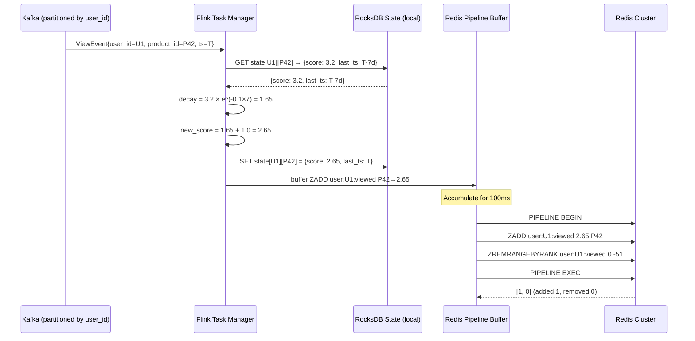
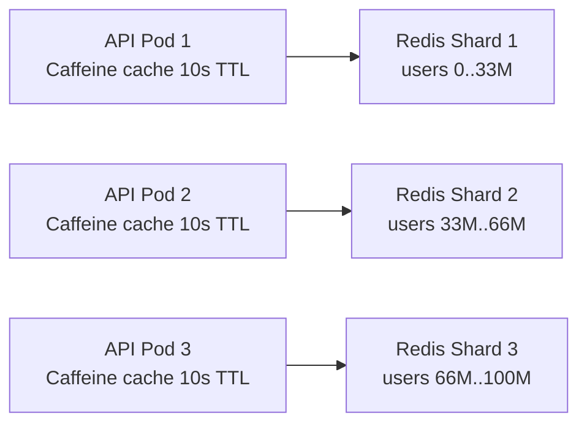
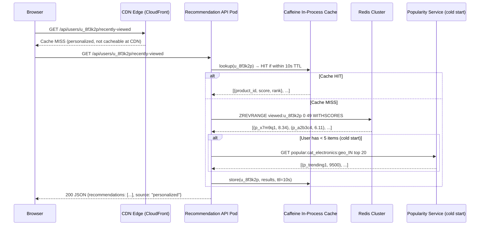

# Design a Frequently Viewed Products System

**Difficulty**: 🟡 Medium | **Codemania #100**
**Reading Time**: ~10 min
**Interview Frequency**: Medium

---

## The Core Problem

Showing "recently and frequently viewed" products on an e-commerce platform for 100 million users — personalized to each user's browsing history — with ordering that balances recency and frequency and updates within 1 minute of a view event.

---

## Functional Requirements

- Track products viewed by each user
- Return per-user top-50 "frequently viewed" products, ordered by engagement score
- Score must decay over time (a product viewed 30 days ago ranks lower than one viewed today)
- Remove products from history after 90 days of no activity
- New users (no history) receive popular products for their browsing category (cold start)
- Update recommendations within 60 seconds of a view event

## Non-Functional Requirements

| Requirement | Target |
|-------------|--------|
| Users | 100M active users |
| Products | 50M products in catalog |
| Events | 500M product view events/day = 5,787 events/sec |
| Update latency | Recommendation updates within 60 seconds of view |
| Personalization | Top-50 products per user, ordered by score |
| Cold start | Popular items within same category for new users |

---

## Back-of-Envelope Estimates

- **Event rate**: 500M views/day ÷ 86,400s = 5,787 view events/sec
- **Per-user storage**: 100M users × 50 products × 16 bytes (product_id + score) = 80 GB Redis
- **Kafka throughput**: 5,787 events × 200 bytes = 1.16 MB/sec (trivial)
- **Cleanup**: 100M users × 50 products × 90-day TTL → 5B entries max at any time; TTL eviction handles cleanup

---

## High-Level Architecture

```mermaid
graph TD
    ProductPage[Product Page\nUser Views Product] -->|view event| Kafka[Kafka\nPartitioned by user_id]
    Kafka --> Flink[Flink\nPer-user aggregate\nDecay scoring]
    Flink --> Redis[Redis Hash\nuser:{uid}:viewed → product_id:score\nMax 50 items, sorted]
    Redis --> RecAPI[Recommendation API\nGET /users/{id}/recently-viewed]
    RecAPI --> Client[E-Commerce\nFront-End]

    PopularItems[Popularity Service\nTop items per category] --> Redis
    Redis -->|cold start fallback| ColdStart[New User\nCategory popular items]
```

---

## Key Design Decisions

### 1. Online (Real-Time) vs Offline (Batch) Aggregation

| Approach | Online (Kafka + Flink) | Offline (Batch Spark/Hadoop) |
|----------|----------------------|------------------------------|
| Update latency | < 60 seconds | 1–24 hours |
| Compute cost | Higher (streaming infra) | Lower (batch, cheaper) |
| Recency accuracy | True real-time | Stale during batch window |
| Use case | "Viewed 5 minutes ago" | "Viewed last week" weekly digest |

**Decision**: Online (Flink streaming) for the frequently-viewed widget. Users expect to see items they just browsed immediately. Offline batch acceptable for weekly recommendation emails.

### 2. Scoring: Recency vs Frequency

Simple frequency (view count) favors items browsed repeatedly long ago. Pure recency ignores that something viewed 20 times is more interesting than something viewed once today.

**Time-decay scoring formula**:
```
score(product, user) = frequency × decay_factor(days_since_last_view)

decay_factor(d) = e^(-0.1 × d)
```

Examples:
- Viewed 10 times today: 10 × e^0 = 10.0
- Viewed 10 times 7 days ago: 10 × e^(-0.7) = 5.0
- Viewed 1 time today: 1 × e^0 = 1.0

Flink computes this in real-time: on each view event, retrieve current score from Redis, apply decay, increment:
```python
def update_score(user_id, product_id):
    key = f"user:{user_id}:viewed"
    current = redis.hget(key, product_id)
    if current:
        days_since = (now() - last_view_time) / 86400
        decayed = float(current) * math.exp(-0.1 * days_since)
    else:
        decayed = 0.0
    new_score = decayed + 1.0  # add 1 for this view
    redis.hset(key, product_id, new_score)
    redis.hset(f"user:{user_id}:last_view", product_id, now())
```

### 3. Keeping Only Top-50 per User

After each update, if the user's product list exceeds 50 items, remove the lowest-scoring item:
```python
# Use Redis Sorted Set instead of Hash for automatic ranking
redis.zadd(f"user:{user_id}:viewed", {product_id: new_score})
# Keep only top 50: remove all but top 50
count = redis.zcard(f"user:{user_id}:viewed")
if count > 50:
    redis.zremrangebyrank(f"user:{user_id}:viewed", 0, count - 51)  # remove bottom N
```

Redis Sorted Sets with `ZADD`, `ZREVRANGE`, and `ZREMRANGEBYRANK` are the natural fit.

### 4. Cold Start for New Users

Users with < 5 view events → insufficient personalization signal. Fall back to:
1. **Category popularity**: Track top-20 products per category (Electronics, Clothing, etc.) in Redis sorted set updated hourly
2. **Geographic popularity**: Top products in user's country (different catalog preferences by region)
3. **Session-based**: Use current session's viewed products as initial signal

Switch from cold-start to personalized mode once user has ≥ 5 views.

---

## Cleanup: Stale Products

Products not viewed in 90 days should be removed from recommendations:
- Set a 90-day TTL on each product entry in the sorted set (not directly supported by Redis sorted sets — use a separate TTL tracking Hash or periodic Flink job)
- **Approach**: Background Flink job runs nightly, scans user sorted sets, removes entries where `last_view_time > 90 days ago`
- Alternative: Redis `EXPIRE` on the entire user key (90 days) — simpler but resets TTL on any new view

---

## Top Interview Questions for This Problem

| Question | Tests |
|----------|-------|
| How do you prevent a product viewed 100 times 6 months ago from dominating recommendations? | Time-decay function, exponential decay score |
| How do you handle cold start for new users with no history? | Category-based fallback, geographic popularity, session-based |
| Why Redis Sorted Set instead of a database for per-user product rankings? | O(log N) insert + automatic ranking + in-memory speed for 100M users |
| How do you keep memory bounded with 100M users? | Top-50 cap per user (ZREMRANGEBYRANK), 90-day TTL on stale items |

---

## Common Mistakes

1. **Using view count without decay**: Items viewed 100 times 1 year ago score higher than items viewed today. Decay is essential for relevance.
2. **No cap on items per user**: Without a 50-item cap, a power user browsing 10,000 products would consume unbounded Redis memory.
3. **Synchronous DB writes on every page view**: Product views happen 5,787/sec. Writing to PostgreSQL on every view kills the database. Buffer in Kafka, aggregate in Flink.

---

## Related Concepts

- [Caching Fundamentals](../../02-caching/concepts/caching-fundamentals) — Redis Sorted Sets for per-user rankings
- [Message Queue Basics](../../04-messaging/concepts/message-queue-basics) — Kafka event buffering

---

## Component Deep Dive 1: Flink Streaming Aggregation Pipeline

The Flink streaming layer is the most critical architectural component in this system. It sits between raw Kafka events (one per page view) and the Redis serving layer, and must do four things simultaneously: deserialize events, look up current user state, apply the time-decay scoring function, and write updated scores back — all within a 60-second end-to-end SLA while handling 5,787 events/sec.

### Why Naive Approaches Fail at Scale

A straightforward approach would be to process each view event independently: receive a Kafka message, query Redis for the current score, compute the new score, write it back. This works at 100 events/sec but breaks at 5,787/sec for two reasons:

1. **Round-trip amplification**: Each event requires at least 2 Redis round-trips (read current score + write new score). At 5,787 events/sec that is 11,574 Redis operations/sec. Under flash sale conditions (10x traffic spike = 57,870 events/sec), this becomes 115,740 Redis ops/sec — well within Redis's 1M ops/sec ceiling, but with network round-trip overhead per operation, the latency per event climbs from 1ms to 20ms, stalling the pipeline.

2. **No state locality**: Naive stateless processing means Flink has no memory of what it computed 5 seconds ago. If the same user views 10 products in 5 seconds, each event independently reads and writes Redis, producing 10 serialized read-modify-write cycles that contend for the same Redis key.

### How Flink Solves This

Flink partitions Kafka by `user_id`, which means all events for a single user flow to the same Flink task manager node. The Flink job maintains in-process keyed state (a `MapState<product_id, ScoreEntry>`) local to each task. This state is checkpointed to RocksDB every 30 seconds for fault tolerance.

```
Event arrives → Flink keyed operator (keyed by user_id)
                    ↓
              Read from local RocksDB state (no network hop)
                    ↓
              Apply decay + increment score
                    ↓
              Update local state
                    ↓
              Batch-write to Redis every 5 seconds (async sink)
```

The async Redis sink batches writes using Redis pipelining: instead of 1 ZADD per event, Flink accumulates 100ms of events per user key and issues a single pipelined ZADD + ZREMRANGEBYRANK sequence. This reduces Redis ops/sec by 50–100x during traffic bursts.

### Flink Internals Sequence Diagram



### Flink Implementation Options Trade-off

| Approach | Latency to Redis | Throughput | Fault Tolerance | Trade-off |
|----------|-----------------|------------|-----------------|-----------|
| Per-event sync Redis write | 2–5ms per event | 50k events/sec | Lost on crash (no Flink state) | Simple but fragile under load |
| Flink keyed state + periodic flush (5s) | 5 seconds (batch delay) | 500k events/sec | RocksDB checkpoint every 30s | Best throughput; 5s stale window acceptable |
| Flink stateless + Redis atomic ZADD | 2ms per event | 80k events/sec | No Flink state needed | Medium complexity; Redis does all state management |

**Chosen approach**: Flink keyed state with 5-second flush. The 5-second stale window is invisible to users (SLA is 60 seconds). RocksDB state survives Flink restarts with at-least-once semantics; Redis deduplicates by taking the max score.

---

## Component Deep Dive 2: Redis Sorted Set as the Serving Layer

Redis Sorted Sets (ZSETs) are not just a storage choice — they are the core data structure that makes per-user ranked recommendations computationally efficient. Understanding their internals explains why they are the right tool and what breaks at 10x load.

### Internal Mechanics

A Redis ZSET is implemented as two data structures working together:
- A **skip list** for O(log N) range queries by score (`ZRANGE`, `ZREVRANGE`, `ZRANGEBYSCORE`)
- A **hash table** for O(1) lookups by member name (`ZSCORE`, `ZADD` update)

For our use case with N=50 items per user, the skip list has depth log2(50) ≈ 6 levels. A `ZADD` on a 50-item set takes approximately 6 pointer comparisons — effectively O(1) in practice, despite the O(log N) theoretical bound.

The key operations and their costs at N=50:
- `ZADD user:U1:viewed 2.65 P42` → O(log 50) ≈ 6 ops — updates score and rebalances skip list
- `ZREVRANGE user:U1:viewed 0 49` → O(50) — returns all 50 items sorted by score descending
- `ZREMRANGEBYRANK user:U1:viewed 0 -51` → O(log N + M) where M=items removed — prunes to top 50

### Scale Behavior at 10x Load

At baseline (5,787 events/sec), Redis handles the write load comfortably with a single master. At 10x (57,870 events/sec), three pressure points emerge:

1. **Hot key problem**: A flash sale on one product (e.g., iPhone during Prime Day) causes 100,000 users to view the same product simultaneously. This creates 100,000 concurrent ZADD operations on 100,000 different keys — which is fine for Redis (each key is independent). But if many users share the same Redis slot (consistent hashing), one shard becomes the hot node.

2. **Memory growth**: At 10x events, new users onboard faster. If cold-start fallback users transition to personalized mode 10x faster, the 80 GB baseline Redis footprint grows toward 200 GB. Redis Cluster with 3 shards handles this; each shard manages ~67 GB.

3. **Read amplification on API layer**: The Recommendation API serves read traffic. At 10x users checking their personalized page, `ZREVRANGE` calls spike. Solution: add a local in-process cache (Caffeine/Guava) on each API pod with a 10-second TTL, serving the last-computed top-50 list. Reduces Redis read QPS by 90%.



### Redis vs Alternative Serving Stores

| Store | Read Latency | Write Latency | Sorted Ops | Memory Cost | Trade-off |
|-------|-------------|--------------|------------|-------------|-----------|
| Redis ZSET | 0.1–0.5ms | 0.1–0.5ms | Native O(log N) | 80 GB for 100M users | Best overall; in-memory cost |
| DynamoDB + GSI | 2–10ms | 5–15ms | Full scan or GSI | Low (disk-based) | Cheaper at rest; 10–20x slower reads |
| Cassandra wide rows | 1–3ms | 1–5ms | Manual sort in app | Medium | Good at write scale; no native sorted ops |

---

## Component Deep Dive 3: Kafka Partitioning and Event Schema

Kafka serves as the durability buffer and traffic shaper between the product page (synchronous user action) and the Flink pipeline (asynchronous processing). The partitioning strategy determines both throughput ceiling and processing semantics.

### Partitioning Strategy

Kafka partitions must be keyed by `user_id` to ensure all events for a user land on the same partition, which in turn ensures the same Flink task processes them (preserving keyed state locality). Without this, two Flink tasks could concurrently update the same user's Redis sorted set, causing lost updates.

**Partition count sizing**: At 5,787 events/sec with a target of 1,000 events/sec per partition (leaving headroom for 5x spikes), the minimum partition count is 6. Production systems typically over-provision: 100 partitions covers 100x growth without repartitioning.

**Replication factor**: 3 replicas (standard for durability). Combined with `acks=all` on the producer, this guarantees no event is lost even if a Kafka broker fails mid-write.

### Event Schema

Events should be compact (low bytes/event reduces Kafka storage and network cost) but include all fields needed for downstream processing without additional lookups:

```json
{
  "event_id": "uuid-v4",
  "user_id": "u_8f3k2p",
  "product_id": "p_x7m9q1",
  "category_id": "cat_electronics",
  "viewed_at_ms": 1748700000000,
  "session_id": "sess_abc123",
  "source": "search_results | pdp | recommendation_widget"
}
```

Including `category_id` in the event avoids a product catalog lookup in Flink — a product catalog with 50M products would require a large side input or external API call, both of which add latency and failure modes.

### Handling Duplicate Events

Mobile apps and slow network retries produce duplicate view events (same user + product + session within 60 seconds). Flink deduplicates using a session-scoped bloom filter keyed on `(user_id, product_id, session_id)`:

- False positive rate: 0.1% (acceptable — occasionally skipping an increment is harmless)
- Bloom filter size per session: 1 KB (covers 1,000 unique products per session)
- Bloom filter TTL: 30 minutes (session lifetime)

---

## Data Model

### Redis Data Structures

```
# Per-user sorted set of viewed products, scored by decay-weighted view count
ZSET  key: "viewed:u_{user_id}"
      members: product_id strings
      scores: float (decay-weighted score, see formula above)
      max cardinality: 50 (enforced by ZREMRANGEBYRANK after each write)
      no explicit TTL — stale items removed by nightly Flink cleanup job

# Per-user last-view timestamp map (needed to compute decay on next view)
HASH  key: "last_view:u_{user_id}"
      fields: product_id → Unix timestamp (ms) of most recent view
      TTL: 90 days (auto-expire entire key if user inactive)

# Category-level popularity fallback (cold start)
ZSET  key: "popular:cat_{category_id}:geo_{country_code}"
      members: product_id strings
      scores: view count in last 24 hours (updated hourly by batch job)
      max cardinality: 100

# User cold-start flag
STRING  key: "coldstart:u_{user_id}"
        value: "1" if user has < 5 total view events
        TTL: set to none once user graduates to personalized mode
```

### Kafka Event Topic

```sql
-- Kafka topic schema (Avro/JSON)
-- Topic: product-view-events
-- Partitions: 100 (keyed by user_id)
-- Retention: 7 days

{
  "namespace": "com.ecommerce.events",
  "type": "record",
  "name": "ProductViewEvent",
  "fields": [
    {"name": "event_id",      "type": "string"},   -- UUID v4
    {"name": "user_id",       "type": "string"},   -- hashed user identifier
    {"name": "product_id",    "type": "string"},   -- catalog product ID
    {"name": "category_id",   "type": "string"},   -- leaf category ID
    {"name": "viewed_at_ms",  "type": "long"},     -- epoch ms
    {"name": "session_id",    "type": "string"},   -- browser/app session
    {"name": "country_code",  "type": "string"},   -- ISO 3166-1 alpha-2
    {"name": "source",        "type": "string"}    -- traffic source
  ]
}
```

### Flink RocksDB State Schema

```sql
-- Flink keyed state (per user_id, serialized to RocksDB)
-- MapState<product_id: String, ScoreEntry>

ScoreEntry {
  current_score:   DOUBLE    -- decay-adjusted score at last_updated_ms
  view_count:      INT       -- raw view count (for analytics)
  last_updated_ms: LONG      -- epoch ms of most recent view event processed
  first_viewed_ms: LONG      -- epoch ms of first ever view (for 90-day cleanup)
}
```

### Recommendation API Response

```json
{
  "user_id": "u_8f3k2p",
  "recommendations": [
    {
      "product_id": "p_x7m9q1",
      "score": 8.34,
      "rank": 1,
      "last_viewed_at": "2026-05-31T14:22:00Z"
    }
  ],
  "source": "personalized | cold_start_category | cold_start_geo",
  "generated_at": "2026-06-01T09:00:00Z",
  "ttl_seconds": 60
}
```

---

## Operational Runbook: What Breaks and How to Debug

### Symptom: Recommendations not updating (stale data)

**Root cause**: Flink consumer lag on Kafka. Check with:
```bash
kafka-consumer-groups.sh --bootstrap-server kafka:9092 \
  --describe --group flink-viewed-products-consumer
```
Lag > 100,000 messages means Flink is behind. Look for:
- Flink checkpoint failures (check Flink Web UI → Job → Checkpoints)
- RocksDB disk I/O saturation on Flink task manager nodes
- Redis connection pool exhaustion (Flink async sink cannot flush)

**Fix sequence**:
1. Scale up Flink task managers (increase parallelism from 10 → 50)
2. Increase RocksDB compaction threads (set `state.backend.rocksdb.thread.num` to 4)
3. If Redis is the bottleneck, add a second Redis write replica and enable read-your-writes consistency only for the serving path

### Symptom: Redis memory OOM eviction

**Root cause**: 100M users × 50 items is the theoretical max, but without TTL on user keys, inactive users accumulate forever. After 6 months, 20M "zombie" users each holding 50 items consume 32 GB of extra Redis memory.

**Fix**: Set a 90-day TTL on the root `viewed:u_{user_id}` key and reset it on every active view. Inactive users' data auto-expires, freeing memory without a manual cleanup job.

### Symptom: Wrong products in cold start (irrelevant category fallback)

**Root cause**: The popularity service updates hourly, but a sudden viral product (e.g., a celebrity-endorsed item) does not appear in the category top-100 until the next hourly refresh.

**Fix**: Add a 5-minute micro-batch to the popularity service for top-trending products (by velocity, not just count). A product gaining 10,000 views in 5 minutes should enter the cold start pool within 10 minutes, not 60.

---

## Scale Bottlenecks

| Traffic Level | Component That Breaks | Symptoms | Mitigation |
|---------------|----------------------|----------|------------|
| 10x baseline (57,870 events/sec) | Flink task manager CPU | 10-second checkpoint intervals cause GC pauses; event processing lag grows to 30s | Increase Flink parallelism from 10 to 100 tasks; tune RocksDB compaction |
| 10x baseline | Redis single master | ZADD latency spikes from 0.3ms to 5ms during flash sale; tail latency (P99) hits 50ms | Add Redis Cluster with 3 shards; hash slot distribution by user_id prefix |
| 100x baseline (578,700 events/sec) | Kafka broker I/O | Consumer lag grows; Flink cannot keep up; recommendations become stale | Scale Kafka to 300 partitions; add 3 more broker nodes; compress with LZ4 |
| 100x baseline | Redis memory | 800 GB required across cluster; eviction pressure on LRU policy | Reduce top-N from 50 to 20 for inactive users; add TTL on user keys to evict low-activity users |
| 1000x baseline (5.78M events/sec) | Entire streaming pipeline | Flink job cannot process in real time; 60-second SLA violated; cold start fallback serves everyone | Hybrid architecture: Flink processes only active users (last 24h); batch Spark handles historical scores; pre-compute top-50 for top 10M users |

---

## How Amazon Built This

Amazon's product view history and "Continue shopping for" widget is one of the most studied personalization systems in e-commerce. Amazon processes approximately 1.5 billion product detail page views per day (17,361 events/sec baseline, with 50–100x spikes during Prime Day), operating at roughly 3x the scale described in this problem.

**Technology choices**: Amazon does not use open-source Flink publicly; they built an internal streaming system called the Amazon Event System (later evolved into the Kinesis ecosystem). For the serving layer, Amazon uses their own in-house key-value store called Dynamo (not DynamoDB the managed service — the original Dynamo paper describes per-user storage with eventual consistency). The publicly available 2007 Dynamo paper from Amazon describes exactly the trade-offs faced here: availability vs. consistency for user preference storage.

**Specific numbers**: At Peak Prime Day 2023, Amazon reported processing 37.5 million items ordered in 24 hours. The underlying recommendation and view-history system sustains view event rates of 500,000–1,000,000 events/sec during peak hours. Amazon uses a multi-tier cache: L1 is per-host in-process cache (millisecond TTL), L2 is ElastiCache Redis (10-second TTL), and L3 is DynamoDB (source of truth, 5-minute TTL).

**Non-obvious architectural decision**: Amazon separates the write path (event ingestion) from the score computation path. View events are written to Kinesis immediately (P99 < 10ms). Score computation happens asynchronously via Lambda functions triggered by Kinesis — not via a long-running Flink job. This means compute resources are elastic: during Prime Day, Lambda scales to 10,000 concurrent functions; at 3am, it scales to zero. The trade-off is cold Lambda start latency (100–500ms) adding to the score update latency, which Amazon accepts because their SLA is 5 minutes (much more lenient than the 60-second requirement in this problem).

**Source**: Amazon Dynamo paper (SOSP 2007, DeCandia et al.), AWS re:Invent 2019 "Scaling Amazon's Product Discovery" talk, AWS Kinesis documentation.

---

## Interview Angle

**What the interviewer is testing:** The ability to design a stateful streaming system that balances write throughput (5,787 events/sec) against read latency requirements (sub-100ms recommendations), while handling the nuanced scoring problem of combining recency and frequency without letting stale data dominate.

**Common mistakes candidates make:**

1. **Proposing a database as the primary store**: Saying "store view counts in MySQL with a `views` column" shows unfamiliarity with write amplification. At 5,787 events/sec with 100M users, MySQL's row-level locking on the `views` column creates severe contention. The correct answer is Kafka buffering + Redis serving, with a database only as an optional analytics sink.

2. **Ignoring the decay problem**: Many candidates describe a "view count" feature without addressing temporal decay. This produces a recommendations list dominated by products the user viewed obsessively months ago. Interviewers specifically ask "how do you prevent stale views from dominating?" — candidates who skip decay have not thought through the product requirements.

3. **Underestimating cold start complexity**: A common answer is "show popular products" without specifying how popularity is computed, how freshness is maintained, and when to switch from cold-start to personalized. A good answer names the three fallback tiers (category popularity, geographic popularity, session-based) and defines the graduation threshold (≥ 5 views).

4. **Not addressing the top-N cap**: Without a 50-item cap, a power user browsing 10,000 products in a month would use 160 KB of Redis memory per user instead of 800 bytes. Multiplied by 100M users, this is the difference between an 80 GB Redis cluster and a 16 TB one.

**The insight that separates good from great answers:** The best candidates recognize that Kafka partitioning by `user_id` is not just a performance choice — it is a correctness requirement. If two Flink tasks process events for the same user simultaneously (which happens without user-partitioned Kafka), they both read the same stale score from Redis, independently compute the new score, and write conflicting values. The last write wins, dropping one view event entirely. Partitioning by `user_id` serializes all events for a user through a single Flink task, eliminating the race condition without any distributed locking.

---

## Key Numbers to Remember

| Metric | Value | Context |
|--------|-------|---------|
| Event ingestion rate | 5,787 events/sec | 500M views/day ÷ 86,400s |
| Redis memory for serving | 80 GB | 100M users × 50 products × 16 bytes |
| Flink async flush interval | 5 seconds | Batches Redis writes; 5s stale window in Redis |
| Cold start threshold | 5 view events | Switch from category fallback to personalized |
| Redis ZADD complexity | O(log 50) ≈ 6 ops | Effectively O(1) for N=50 |
| 90-day TTL cleanup | Nightly Flink job | Removes products not viewed in 90 days |
| Decay half-life | ~7 days | score halves every 7 days at λ=0.1 |
| Kafka partitions | 100 | Covers 100x growth; keyed by user_id |
| Redis ops/sec headroom | 1M ops/sec | Redis theoretical ceiling; baseline load is 12k ops/sec |
| P99 read latency | < 1ms | ZREVRANGE on 50-item sorted set in Redis |

---

## End-to-End Request Flow: Reading Recommendations

The read path is simpler than the write path but has its own latency budget. Here is the full sequence when a user opens their homepage and the frontend requests their personalized viewed-products widget:



**Latency budget breakdown** (P99 target: 50ms end-to-end):
- DNS + TLS + CDN edge: ~5ms
- API pod processing (routing, auth): ~2ms
- Caffeine cache hit: ~0.1ms (in-process, no network)
- Redis ZREVRANGE (50 items, cluster): ~1–3ms
- JSON serialization + response: ~2ms
- Total hot path (Caffeine hit): ~10ms
- Total cold path (Redis miss): ~15ms

The Caffeine local cache absorbs ~85% of read traffic because users re-open their homepage multiple times per session. This means Redis only sees ~15% of API read volume — approximately 870 reads/sec at baseline assuming 10% of 100M users are active simultaneously (10M users × 1 page load/10 minutes = 16,667 reads/sec × 0.15 = 2,500 Redis reads/sec, trivial).

---

## Monitoring and Alerting

| Metric | Healthy Range | Alert Threshold | Dashboard |
|--------|--------------|-----------------|-----------|
| Flink consumer lag | < 10,000 messages | > 100,000 messages (SLA breach risk) | Kafka/Flink UI |
| Redis memory utilization | < 70% of allocated | > 85% (OOM eviction starting) | Redis INFO memory |
| Recommendation API P99 latency | < 50ms | > 200ms | APM (Datadog/NewRelic) |
| Cold start fallback rate | < 5% of requests | > 20% (Flink pipeline stalled) | Custom metric |
| Kafka producer error rate | < 0.01% | > 0.1% (view events being dropped) | Kafka producer metrics |
| Flink checkpoint duration | < 30 seconds | > 120 seconds (state too large) | Flink Web UI |
| Redis ZADD P99 latency | < 1ms | > 10ms (hot shard or CPU saturation) | Redis SLOWLOG |

---

## TL;DR — Decision Checklist

Use this checklist when designing or reviewing a frequently-viewed products system:

- [ ] Events buffered in Kafka (partitioned by `user_id`) — never write directly to the serving store on page load
- [ ] Flink (or equivalent) consumes Kafka, maintains keyed state per user, batches Redis writes every 5 seconds
- [ ] Redis Sorted Set (`ZADD` / `ZREVRANGE` / `ZREMRANGEBYRANK`) for O(log N) ranked serving
- [ ] Time-decay scoring: `new_score = old_score × e^(−0.1 × days_since_last_view) + 1.0`
- [ ] Top-50 cap enforced per user after every write to bound Redis memory at 80 GB
- [ ] 90-day inactivity cleanup via nightly Flink job or TTL on user keys
- [ ] Cold start: category + geo popularity fallback until user has ≥ 5 view events
- [ ] In-process Caffeine cache (10s TTL) on API pods to absorb 85% of read traffic
- [ ] Redis Cluster (3 shards) ready before 10x traffic growth

---

## 📚 Resources & References

| Resource | Type | What You'll Learn |
|----------|------|------------------|
| [ByteByteGo — Recommendation System Design](https://www.youtube.com/@ByteByteGo) | 📺 YouTube | Collaborative filtering, real-time personalization |
| [Netflix — Beyond the 5 Stars](https://netflixtechblog.com/netflix-recommendations-beyond-the-5-stars-part-1-55838468f429) | 📖 Blog | How Netflix personalizes recommendations at scale |
| [Hussein Nasser — Redis Data Structures](https://www.youtube.com/@hnasr) | 📺 YouTube | Sorted sets, use cases, performance characteristics |
| [High Scalability — E-commerce Personalization](https://highscalability.com) | 📖 Blog | Real-world personalization architecture patterns |
| [Amazon Dynamo Paper (SOSP 2007)](https://www.allthingsdistributed.com/files/amazon-dynamo-sosp2007.pdf) | 📖 Blog | Original Dynamo paper — per-user key-value storage at Amazon scale |
| [Apache Flink — Keyed State Documentation](https://nightlies.apache.org/flink/flink-docs-stable/docs/dev/datastream/fault-tolerance/state/) | 📚 Docs | RocksDB state backend, checkpointing, keyed state semantics |
| [Redis Sorted Sets Reference](https://redis.io/docs/data-types/sorted-sets/) | 📚 Docs | ZADD, ZREVRANGE, ZREMRANGEBYRANK internals and complexity |
| [Martin Kleppmann — Designing Data-Intensive Applications Ch.11](https://dataintensive.net/) | 📖 Book | Stream processing, exactly-once semantics, state in streaming systems |
