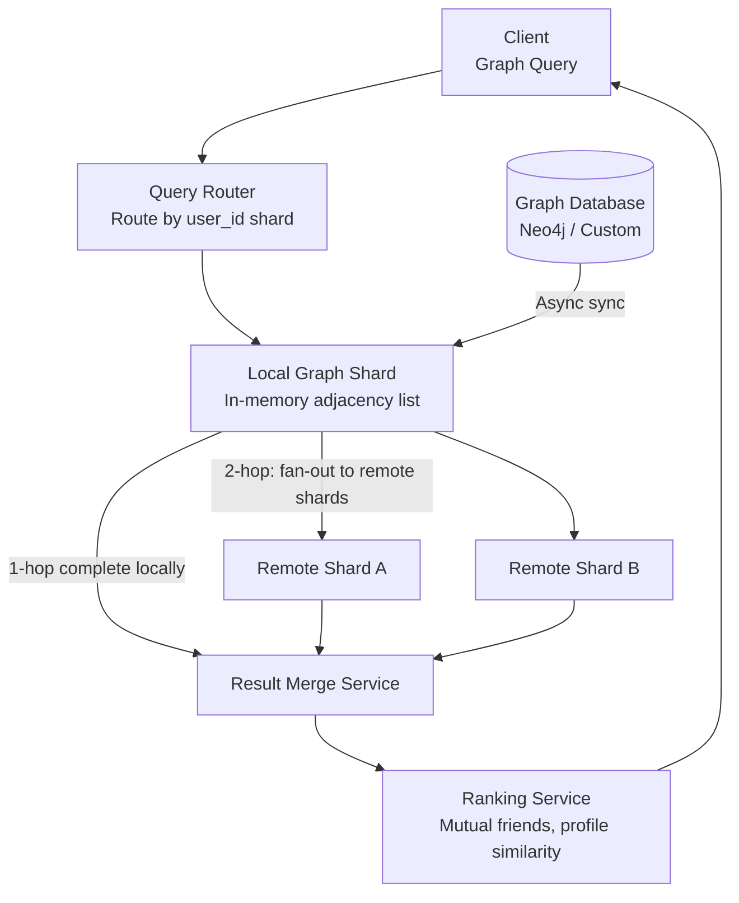

# Design Graph Search for a Social Network

**Difficulty**: 🔴 Advanced | **Codemania #118**
**Reading Time**: ~14 min
**Interview Frequency**: High

---

## The Core Problem

Performing BFS (breadth-first search) and friend-of-friend queries on a 1-billion-node social graph (Facebook/LinkedIn scale) with less than 200ms response time. The challenge: a naive BFS on 1B nodes with avg 500 friends each would touch 250B nodes at depth 2 — impossible in 200ms. The solution requires graph partitioning, in-memory caching, aggressive pruning, and distributed coordination.

---

## Functional Requirements

- "People you may know" — return 20 friend-of-friend suggestions within 200ms
- "Shortest path between user A and user B" — degrees of separation (< 6 degrees)
- "Common friends" — users X and Y share how many mutual friends?
- "Graph search" — find friends who live in NYC and work at Google
- Support graphs with 1B nodes and 100B edges (Facebook scale)

## Non-Functional Requirements

| Requirement | Target |
|-------------|--------|
| Graph scale | 1B nodes, 100B edges, avg 200 edges/node |
| Query latency | < 200ms for 2-hop BFS |
| Throughput | 100k graph queries/sec |
| Read/write ratio | 99% reads, 1% writes (friend add/remove) |
| Memory | In-memory adjacency list (100B edges × 8 bytes = 800 GB) |

---

## Back-of-Envelope Estimates

- **Graph size**: 1B nodes × 200 avg friends × 8 bytes/edge = 1.6 TB total edges
- **1-hop query**: 200 friends — trivial, O(1) lookup in adjacency list
- **2-hop query (friend-of-friend)**: 200 × 200 = 40,000 nodes to visit → feasible in < 200ms with in-memory adjacency list
- **3-hop query**: 200³ = 8M nodes — requires pruning and approximation
- **Partition size**: 1.6 TB ÷ 200 servers = 8 GB/server (fits in memory with modern 256 GB RAM servers)

---

## High-Level Architecture



---

## Key Design Decisions

### 1. Graph Partitioning Strategy

| Strategy | Random Partitioning | Locality-Aware Partitioning |
|----------|--------------------|-----------------------------|
| Load balance | Perfect — even node distribution | Uneven — popular communities on one shard |
| Cross-shard hops | High — 2-hop touches 200 random shards | Low — friends often on same shard |
| Edge cut | 99% of edges cross shard boundaries | 20–40% edges cross boundaries |
| Implementation | Simple (user_id % num_shards) | Complex (community detection algorithm) |

**Decision**: Locality-aware partitioning using community detection (Facebook uses a geographic + social cluster algorithm). Users in the same city/school/company placed on the same shard. Reduces cross-shard BFS fan-out by 5–10x.

Facebook TAO uses a hierarchical approach: social locality reduces the average 2-hop BFS from touching 500 shards to ~50 shards.

### 2. In-Memory Adjacency List (TAO Architecture)

Facebook's TAO stores the social graph as an in-memory adjacency list across thousands of servers:
```
user_id → [friend_1, friend_2, ..., friend_N]  // stored as sorted int array
```

Each edge is stored in both directions (undirected graph). Total storage:
- 100B edges × 2 directions × 8 bytes = 1.6 TB
- Sharded across 200 servers × 8 GB each

TAO uses a tiered cache: L1 (local Memcached), L2 (regional Memcached), database (MySQL) as fallback.

### 3. BFS Pruning Heuristics

Naive 2-hop BFS visits 40,000 nodes. For 3-hop suggestions, prune aggressively:
1. **Depth limit**: Never go beyond depth 2 for "people you may know" (depth 3 quality is too low)
2. **Already connected pruning**: Skip nodes already connected to user (not suggestions)
3. **Score-based early termination**: If we have 1000 candidates with high mutual-friend count, stop BFS and rank
4. **Bloom filter for visited**: Track visited nodes in a Bloom filter (space-efficient) to avoid revisiting

### 4. Distributed BFS Coordination

For 2-hop BFS when friends are on different shards:
1. Query shard for user U's friends (1-hop): returns [F1, F2, ..., F200]
2. Group friends by their shard: F1–F50 on shard A, F51–F100 on shard B, ...
3. Parallel fan-out: send "get friends of [F1..F50]" to shard A, "get friends of [F51..F100]" to shard B
4. Merge results, deduplicate, filter already-connected, rank

This requires the BFS coordinator to track which shard owns each user_id.

---

## Graph Search Beyond Friends

For "friends in NYC who work at Google":
1. **Graph traversal**: Get user's friends (1-hop) — fast
2. **Attribute filter**: Filter friends by `city = NYC AND employer = Google` — requires attribute index
3. **Index structure**: Inverted index `(city, employer) → [user_ids]` in Elasticsearch

The trick: Facebook indexes only immediate friends' attributes (not friends-of-friends) for search, limiting index size to social distance 1.

---

## Top Interview Questions for This Problem

| Question | Tests |
|----------|-------|
| How does Facebook store 100B edges in memory? | Adjacency list, horizontal sharding, locality-aware partitioning |
| How do you compute "6 degrees of separation" efficiently? | Bidirectional BFS (meet in middle), dramatically reduces search space |
| Why not use Neo4j for 1B nodes? | Neo4j can handle ~1B nodes but 100k query/sec is challenging; custom in-memory solution wins on latency |
| How do you handle a celebrity with 100M followers? | Special handling for high-degree nodes, don't expand their adjacency list in BFS |

---

## Common Mistakes

1. **Expanding high-degree nodes (celebrities) in BFS**: Beyoncé has 100M followers — BFS through her at depth 2 would touch every user. Apply degree cap: skip nodes with >10,000 friends in BFS expansion.
2. **Cross-datacenter BFS**: Querying shards across data centers adds 50–100ms per hop. Keep all shards for a BFS query within a single data center.
3. **Using a relational DB for graph traversal**: `JOIN friends ON id` at depth 3 produces cartesian products. Graph databases or in-memory adjacency lists are the right tools.

---

## Related Concepts

- [Consistent Hashing](../../05-distributed-systems/concepts/consistent-hashing-deep-dive) — Routing queries to the correct shard
- [Caching Fundamentals](../../02-caching/concepts/caching-fundamentals) — TAO tiered cache architecture

---

## 📚 Resources & References

| Resource | Type | What You'll Learn |
|----------|------|------------------|
| [Facebook TAO — The Power of the Graph](https://engineering.fb.com/2013/06/25/core-data/tao-the-power-of-the-graph/) | 📖 Blog | Facebook's distributed graph store architecture |
| [ByteByteGo — Graph Database Design](https://www.youtube.com/@ByteByteGo) | 📺 YouTube | Graph storage, BFS at scale, social network queries |
| [LinkedIn Real-Time Graph Computation](https://engineering.linkedin.com/real-time-distributed-graph/real-time-distributed-graph) | 📖 Blog | How LinkedIn runs graph traversal at scale |
| [High Scalability — Social Graph Lessons](https://highscalability.com) | 📖 Blog | Architectural patterns from social network graph systems |
