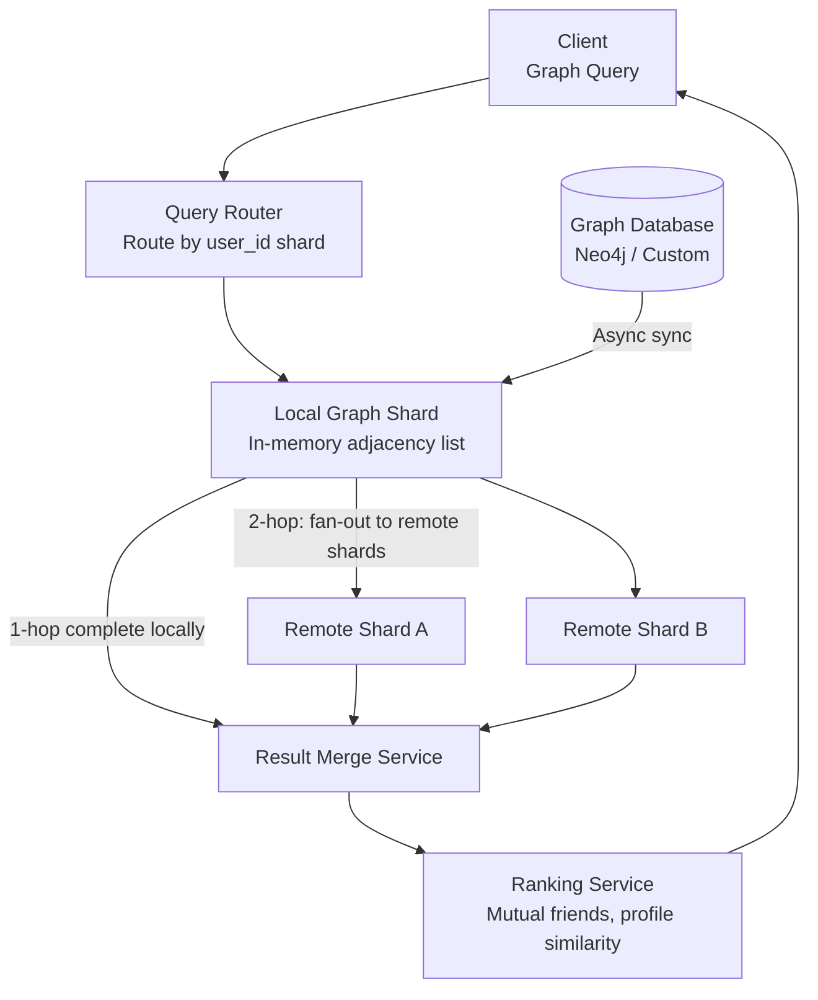
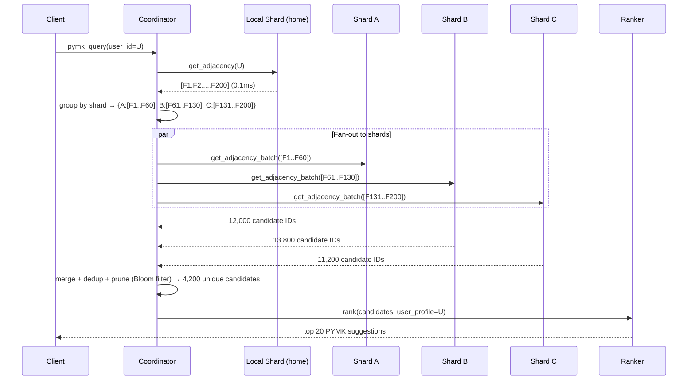

# Design Graph Search for a Social Network

**Difficulty**: 🔴 Advanced | **Codemania #118**
**Reading Time**: ~14 min
**Interview Frequency**: High

---

## The Core Problem

Performing BFS (breadth-first search) and friend-of-friend queries on a 1-billion-node social graph (Facebook/LinkedIn scale) with less than 200ms response time. The challenge: a naive BFS on 1B nodes with avg 500 friends each would touch 250B nodes at depth 2 — impossible in 200ms. The solution requires graph partitioning, in-memory caching, aggressive pruning, and distributed coordination.

---

## Functional Requirements

- "People you may know" — return 20 friend-of-friend suggestions within 200ms
- "Shortest path between user A and user B" — degrees of separation (< 6 degrees)
- "Common friends" — users X and Y share how many mutual friends?
- "Graph search" — find friends who live in NYC and work at Google
- Support graphs with 1B nodes and 100B edges (Facebook scale)

## Non-Functional Requirements

| Requirement | Target |
|-------------|--------|
| Graph scale | 1B nodes, 100B edges, avg 200 edges/node |
| Query latency | < 200ms for 2-hop BFS |
| Throughput | 100k graph queries/sec |
| Read/write ratio | 99% reads, 1% writes (friend add/remove) |
| Memory | In-memory adjacency list (100B edges × 8 bytes = 800 GB) |

---

## Back-of-Envelope Estimates

- **Graph size**: 1B nodes × 200 avg friends × 8 bytes/edge = 1.6 TB total edges
- **1-hop query**: 200 friends — trivial, O(1) lookup in adjacency list
- **2-hop query (friend-of-friend)**: 200 × 200 = 40,000 nodes to visit → feasible in < 200ms with in-memory adjacency list
- **3-hop query**: 200³ = 8M nodes — requires pruning and approximation
- **Partition size**: 1.6 TB ÷ 200 servers = 8 GB/server (fits in memory with modern 256 GB RAM servers)

---

## High-Level Architecture



---

## Key Design Decisions

### 1. Graph Partitioning Strategy

| Strategy | Random Partitioning | Locality-Aware Partitioning |
|----------|--------------------|-----------------------------|
| Load balance | Perfect — even node distribution | Uneven — popular communities on one shard |
| Cross-shard hops | High — 2-hop touches 200 random shards | Low — friends often on same shard |
| Edge cut | 99% of edges cross shard boundaries | 20–40% edges cross boundaries |
| Implementation | Simple (user_id % num_shards) | Complex (community detection algorithm) |

**Decision**: Locality-aware partitioning using community detection (Facebook uses a geographic + social cluster algorithm). Users in the same city/school/company placed on the same shard. Reduces cross-shard BFS fan-out by 5–10x.

Facebook TAO uses a hierarchical approach: social locality reduces the average 2-hop BFS from touching 500 shards to ~50 shards.

### 2. In-Memory Adjacency List (TAO Architecture)

Facebook's TAO stores the social graph as an in-memory adjacency list across thousands of servers:
```
user_id → [friend_1, friend_2, ..., friend_N]  // stored as sorted int array
```

Each edge is stored in both directions (undirected graph). Total storage:
- 100B edges × 2 directions × 8 bytes = 1.6 TB
- Sharded across 200 servers × 8 GB each

TAO uses a tiered cache: L1 (local Memcached), L2 (regional Memcached), database (MySQL) as fallback.

### 3. BFS Pruning Heuristics

Naive 2-hop BFS visits 40,000 nodes. For 3-hop suggestions, prune aggressively:
1. **Depth limit**: Never go beyond depth 2 for "people you may know" (depth 3 quality is too low)
2. **Already connected pruning**: Skip nodes already connected to user (not suggestions)
3. **Score-based early termination**: If we have 1000 candidates with high mutual-friend count, stop BFS and rank
4. **Bloom filter for visited**: Track visited nodes in a Bloom filter (space-efficient) to avoid revisiting

### 4. Distributed BFS Coordination

For 2-hop BFS when friends are on different shards:
1. Query shard for user U's friends (1-hop): returns [F1, F2, ..., F200]
2. Group friends by their shard: F1–F50 on shard A, F51–F100 on shard B, ...
3. Parallel fan-out: send "get friends of [F1..F50]" to shard A, "get friends of [F51..F100]" to shard B
4. Merge results, deduplicate, filter already-connected, rank

This requires the BFS coordinator to track which shard owns each user_id.

---

## Graph Search Beyond Friends

For "friends in NYC who work at Google":
1. **Graph traversal**: Get user's friends (1-hop) — fast
2. **Attribute filter**: Filter friends by `city = NYC AND employer = Google` — requires attribute index
3. **Index structure**: Inverted index `(city, employer) → [user_ids]` in Elasticsearch

The trick: Facebook indexes only immediate friends' attributes (not friends-of-friends) for search, limiting index size to social distance 1.

---

## Top Interview Questions for This Problem

| Question | Tests |
|----------|-------|
| How does Facebook store 100B edges in memory? | Adjacency list, horizontal sharding, locality-aware partitioning |
| How do you compute "6 degrees of separation" efficiently? | Bidirectional BFS (meet in middle), dramatically reduces search space |
| Why not use Neo4j for 1B nodes? | Neo4j can handle ~1B nodes but 100k query/sec is challenging; custom in-memory solution wins on latency |
| How do you handle a celebrity with 100M followers? | Special handling for high-degree nodes, don't expand their adjacency list in BFS |

---

## Common Mistakes

1. **Expanding high-degree nodes (celebrities) in BFS**: Beyoncé has 100M followers — BFS through her at depth 2 would touch every user. Apply degree cap: skip nodes with >10,000 friends in BFS expansion.
2. **Cross-datacenter BFS**: Querying shards across data centers adds 50–100ms per hop. Keep all shards for a BFS query within a single data center.
3. **Using a relational DB for graph traversal**: `JOIN friends ON id` at depth 3 produces cartesian products. Graph databases or in-memory adjacency lists are the right tools.

---

## Related Concepts

- [Consistent Hashing](../../14-algorithms/concepts/consistent-hashing-deep-dive) — Routing queries to the correct shard
- [Caching Fundamentals](../../02-caching/concepts/caching-fundamentals) — TAO tiered cache architecture

---

## Component Deep Dive 1: Distributed BFS Coordinator

The BFS coordinator is the most critical piece of this system. It is the component that orchestrates multi-shard traversal, enforces depth limits, merges partial results, and decides when enough candidates have been collected to stop traversal and begin ranking. A naive implementation at 1B-node scale will consistently exceed the 200ms SLA — here is exactly why and how to fix it.

### How the Coordinator Works Internally

When a user triggers a "People You May Know" request, the query router identifies the user's home shard and dispatches to the BFS coordinator running co-located on that shard. The coordinator maintains an in-process priority queue (BFS frontier), a Bloom filter for visited-node tracking, and a scatter-gather buffer for parallel fan-out results.

**Phase 1 — Local 1-hop expansion**: The coordinator reads the user's adjacency list from in-memory storage (typically a sorted `uint32[]` array). This is always local — no network call. Result: 200–500 friend IDs in ~0.1ms.

**Phase 2 — Shard routing table lookup**: Each friend ID maps to a shard via consistent hashing. The coordinator groups friend IDs by target shard: `{shard_A: [F1, F3, F7], shard_B: [F2, F5], ...}`. A pre-warmed routing table (replicated in-process) makes this ~0.05ms.

**Phase 3 — Parallel 2-hop fan-out**: The coordinator fires simultaneous RPCs to each target shard: "give me adjacency lists for these user IDs". At 200 friends spread across 50 shards (locality-aware partitioning), this is 50 parallel RPCs, each returning ~200 IDs. Total network time: 5–20ms on the same data center fabric.

**Phase 4 — Merge, dedup, prune**: Merge ~10,000 candidate IDs (200 friends × ~50 unique second-hop nodes each, minus duplicates). Deduplicate using a hash set. Remove already-connected users with a Bloom filter. Result: ~2,000–5,000 unique candidates.

**Phase 5 — Early termination**: If the candidate pool exceeds a threshold (e.g., 1,000 nodes with ≥ 3 mutual friends), stop BFS and pass to the Ranker. This prevents 3-hop explosion.

### Why Naive BFS Fails at Scale

A single-threaded, synchronous BFS implementation on a social graph of this scale fails for three reasons:

1. **Sequential shard hops kill latency**: If fan-out to 50 shards is done sequentially (50 × 5ms = 250ms), the 200ms SLA is already broken at depth 2.
2. **No pruning means exponential blowup**: Without a celebrity degree-cap and early termination, a single high-degree node (10M followers) explored at depth 2 alone requires visiting 10M adjacency-list entries — a 10M × 8 bytes = 80 MB read in a single query.
3. **Lack of visited-set causes re-traversal**: Without a Bloom filter, the same high-mutual-friend node can be queued dozens of times from different 1-hop paths, multiplying work by 5–20x.

### BFS Coordinator Internals Diagram



### BFS Coordination Implementation Options

| Approach | Latency | Throughput | Trade-off |
|----------|---------|------------|-----------|
| Sequential shard fan-out | 150–400ms | Low (bottlenecked by serial RPCs) | Simple to implement, fails SLA at 50+ shards |
| Parallel fan-out with timeout | 20–60ms | High (50 parallel RPCs) | Requires scatter-gather framework; stragglers handled by timeout + partial results |
| Bidirectional BFS (meet in middle) | 5–15ms for shortest-path | Medium (2× coordinators, 1 sync point) | Complex coordination; best for "degrees of separation" queries, not PYMK |

**Production choice**: Parallel fan-out with a 50ms timeout. Stragglers (slow shards) return partial results; the coordinator merges whatever arrives before timeout. Quality degrades gracefully rather than failing hard.

---

## Component Deep Dive 2: Graph Partitioning and Locality-Aware Sharding

Partitioning a 1B-node social graph is not a one-time ETL job — it is an ongoing, live process because users add 5M+ new friendships per day (Facebook's scale). The partitioning strategy directly determines how many cross-shard RPCs each BFS query requires, which is the dominant factor in query latency.

### How Locality-Aware Partitioning Works Internally

The core idea: users who are likely to be queried together should live on the same shard. Since social networks are highly clustered (your friends' friends are often your friends too), community detection algorithms can identify dense subgraphs and co-locate them.

Facebook uses a combination of:
1. **Geographic clustering**: Users in the same city/region are assigned to the same regional shard group.
2. **Social community detection**: A variant of the METIS graph partitioning algorithm identifies clusters of densely connected users and assigns them to the same shard.
3. **Dynamic rebalancing**: When a shard becomes overloaded, a background job migrates "peripheral" users (few within-shard connections) to adjacent shards.

The key metric is **edge cut ratio**: the fraction of edges that cross shard boundaries. Random partitioning yields ~99% edge cut (almost every 2-hop query requires cross-shard RPCs). Locality-aware partitioning achieves 20–40% edge cut, meaning 60–80% of a user's friends are on the same shard, reducing fan-out from ~200 shards to ~40–60 shards for a typical 2-hop BFS.

### Scale Behavior at 10x Load

At 10× baseline query load (1M queries/sec instead of 100k), the bottleneck shifts from computation to network. Each query fires 40–60 parallel RPCs; at 1M QPS, that is 40–60M RPCs/sec across the shard cluster. With 200 shards, each shard receives 200k–300k inbound RPCs/sec. A shard's TCP connection table, accept queue, and kernel network stack become the constraint. Mitigation: switch from per-query RPCs to multiplexed gRPC streams, batch multiple BFS queries into a single stream frame.

```mermaid
graph LR
    subgraph Shard_Group_NYC["Shard Group: NYC Community"]
        U1((Alice)) --- U2((Bob))
        U2 --- U3((Carol))
        U3 --- U4((Dave))
        U1 --- U4
    end
    subgraph Shard_Group_SF["Shard Group: SF Community"]
        U5((Eve)) --- U6((Frank))
        U6 --- U7((Grace))
    end
    U4 -.->|cross-shard edge\n(20-40% of total)| U5
    style Shard_Group_NYC fill:#e8f4f8,stroke:#2196F3
    style Shard_Group_SF fill:#f3e8f8,stroke:#9C27B0
```

Cross-shard edges (dashed) represent the 20–40% that require remote RPCs during BFS. The goal of locality-aware partitioning is to minimize this ratio while keeping shard sizes balanced.

### Partition Assignment and Metadata

Each shard server maintains an in-memory routing table: `user_id → shard_id`. This table is replicated to all coordinators (read-only copy). At 1B users × 4 bytes per shard_id assignment = 4 GB — fits comfortably in memory. Updates are propagated via a distributed log (Apache Kafka or a custom gossip protocol) whenever users are migrated between shards.

---

## Component Deep Dive 3: Celebrity (High-Degree Node) Handling

High-degree nodes — users or entities with millions of followers — are the most dangerous failure mode in social graph BFS. Without special handling, a single BFS query through a celebrity node can saturate the shard hosting that node, causing tail-latency spikes for every unrelated query on that shard.

### The Problem in Numbers

A celebrity with 50M followers (e.g., a public figure on a 1B-user platform) has an adjacency list of 50M entries × 8 bytes = 400 MB. Reading this list in a BFS expansion takes 400ms+ even from memory — far exceeding the 200ms SLA. Worse, at 100k QPS, if even 0.1% of queries touch this celebrity node, that is 100 queries/sec × 400MB reads = 40 GB/sec of memory bandwidth on a single shard server, far beyond typical hardware limits (50–100 GB/sec memory bandwidth shared across all operations).

### Three-Tier Mitigation Strategy

**Tier 1 — Degree cap at BFS time**: During BFS expansion, check node degree before expanding. If `degree > threshold` (e.g., 10,000), skip expansion. This node is flagged as a "super-node". The coordinator logs the skip but does not add the celebrity's neighbors to the BFS frontier. This eliminates 99.9% of celebrity explosion risk.

**Tier 2 — Pre-computed celebrity neighborhoods**: For verified celebrities (actors, athletes, brands), a background job pre-computes and caches their 1-hop adjacency lists in a separate high-memory "celebrity shard" cluster. BFS coordinators can read from this cache with a controlled read rate (e.g., max 1000 reads/sec per celebrity node), with circuit-breaker protection.

**Tier 3 — Asymmetric graph representation**: For one-directional follow graphs (Twitter-style), store follower and following lists separately. A celebrity's "following" list (small, ~1000 entries) is used for BFS expansion; the "followers" list is only accessed for write fan-out (notification delivery). This keeps BFS manageable regardless of celebrity follower count.

| Node Type | Degree | BFS Handling | Storage |
|-----------|--------|--------------|---------|
| Regular user | < 5,000 | Full expansion | Standard adjacency list |
| Power user | 5,000–50,000 | Capped expansion (top-N by mutual friends) | Standard + metadata flag |
| Celebrity | > 50,000 | Skip or pre-computed cache lookup | Separate celebrity shard |

---

## Data Model

The graph is stored in two layers: an in-memory adjacency list for BFS traversal, and a persistent MySQL (or RocksDB) store for durability and attribute-based search.

### Adjacency List (In-Memory, per shard)

```
// Compressed sorted array format (TAO-style)
// user_id → sorted uint32[] of friend_ids
// All IDs on this shard's range stored contiguously in memory
// Stored as: [count: uint32] [friend_id_1: uint32] [friend_id_2: uint32] ...

shard_data: HashMap<u64, Vec<u32>>   // user_id → [friend_ids]
```

### Persistent Edge Store (MySQL / RocksDB)

```sql
-- Friendship edges (bidirectional: stored twice)
CREATE TABLE edges (
    src_user_id    BIGINT UNSIGNED NOT NULL,
    dst_user_id    BIGINT UNSIGNED NOT NULL,
    edge_type      TINYINT NOT NULL DEFAULT 1,  -- 1=friend, 2=follow, 3=block
    created_at     INT UNSIGNED NOT NULL,        -- Unix timestamp
    weight         FLOAT DEFAULT 1.0,            -- interaction frequency score
    PRIMARY KEY (src_user_id, dst_user_id),
    INDEX idx_dst (dst_user_id, src_user_id),    -- reverse lookup
    INDEX idx_created (src_user_id, created_at)  -- chronological friend list
) ENGINE=InnoDB
  PARTITION BY HASH(src_user_id) PARTITIONS 256;

-- Node attributes (for graph search: "friends in NYC at Google")
CREATE TABLE user_attributes (
    user_id        BIGINT UNSIGNED NOT NULL PRIMARY KEY,
    city           VARCHAR(64),
    employer       VARCHAR(128),
    school         VARCHAR(128),
    degree_count   INT UNSIGNED DEFAULT 0,       -- cached for celebrity detection
    is_celebrity   BOOLEAN DEFAULT FALSE,        -- degree > 50000
    last_active    INT UNSIGNED,
    INDEX idx_city_employer (city, employer),
    INDEX idx_employer (employer),
    INDEX idx_degree (degree_count)
) ENGINE=InnoDB;

-- BFS query result cache (short TTL, for repeated PYMK queries)
CREATE TABLE pymk_cache (
    user_id        BIGINT UNSIGNED NOT NULL PRIMARY KEY,
    suggestions    JSON NOT NULL,               -- [{"user_id": 123, "mutual_count": 5}, ...]
    computed_at    INT UNSIGNED NOT NULL,
    expires_at     INT UNSIGNED NOT NULL,
    INDEX idx_expires (expires_at)
) ENGINE=InnoDB;
```

### Elasticsearch Index (for attribute-filtered graph search)

```json
{
  "mappings": {
    "properties": {
      "user_id":    { "type": "long" },
      "city":       { "type": "keyword" },
      "employer":   { "type": "keyword" },
      "school":     { "type": "keyword" },
      "friend_ids": { "type": "long" },
      "is_celebrity": { "type": "boolean" }
    }
  }
}
```

For "friends in NYC who work at Google": fetch user's friend_ids (1-hop, from in-memory store), then query Elasticsearch with `filter: {city: "NYC", employer: "Google", user_id: {terms: [friend_ids]}}`. This intersects the social graph with attribute filtering in a single Elasticsearch query — no multi-hop traversal needed.

---

## Scale Bottlenecks

| Traffic Level | Component That Breaks | Symptoms | Mitigation |
|---------------|----------------------|----------|------------|
| 10x baseline (1M QPS) | BFS coordinator network fan-out | p99 latency spikes to 500ms+; coordinator CPU saturated | Multiplex RPCs via gRPC streaming; batch multiple queries per stream frame |
| 10x baseline (1M QPS) | Shard RPC accept queue | TCP connection table exhaustion; connection refused errors | Connection pooling (keep-alive); reduce unique RPC endpoints with proxy aggregators |
| 100x baseline (10M QPS) | In-memory adjacency list read throughput | Memory bandwidth saturation; cache evictions increase | Add read replicas per shard; move hot adjacency lists to L1 CPU cache with prefetch hints |
| 100x baseline (10M QPS) | Elasticsearch attribute filter | Query latency > 1 second for graph search | Pre-compute and cache friend-attribute intersections per user in Redis; refresh on friend-add/remove events |
| 100x baseline (10M QPS) | PYMK result cache write amplification | MySQL write throughput exceeded; replication lag | Switch PYMK cache to Redis with TTL=15min; async write-behind to MySQL |
| 1000x baseline (100M QPS) | Single-datacenter BFS fan-out | Cross-shard network fabric saturated; RTT increases | Run independent BFS per regional datacenter; accept eventual consistency on cross-region social connections |
| 1000x baseline (100M QPS) | Consistent hashing routing table updates | Routing table propagation lag during node adds/removes | Two-phase routing table update with read-your-writes guarantee; shadow routing for 30s during transitions |

---

## How Facebook Built TAO (Graph Search at Scale)

Facebook's TAO (The Associations and Objects) system is the most documented real-world implementation of social graph search at 1B+ node scale. It was described in detail in the USENIX ATC 2013 paper by Bronson et al.

**Scale**: At the time of the paper (2013), TAO served **1 billion active users**, with a graph of **hundreds of billions of edges** (objects and associations). It handled **over 1 billion reads per second** across thousands of Memcached servers and MySQL databases, with a peak write rate of **50 million writes per second** during major events.

**Technology choices**:
- **Storage layer**: MySQL with a custom schema (`objects` table for nodes, `assoc` table for edges). MySQL was chosen not for graph traversal performance but for operational familiarity, mature replication, and ACID writes.
- **Caching layer**: Two-tier Memcached. Tier 1 ("followers") is regional and handles the bulk of reads. Tier 2 ("leaders") is a smaller, write-through cache co-located with MySQL.
- **Graph representation**: Adjacency lists stored as association lists keyed by `(id1, assoc_type, id2)`. All associations stored in both directions.

**The non-obvious architectural decision**: TAO made a deliberate choice to **not** implement distributed BFS in the cache layer. Instead, BFS is done at the application layer by issuing sequential or parallel `assoc_get` calls through TAO's API. TAO's job is to serve individual edge lookups at very high throughput with low latency (sub-millisecond from cache). The application code (PHP/Hack) assembles the BFS logic. This separation kept TAO simple and allowed independent scaling of the traversal logic vs. the storage/cache layer.

**Specific numbers**:
- Average `assoc_get` latency from Tier 1 cache: **0.3ms**
- Cache hit rate on Tier 1: **99.8%**
- Each TAO leader shard serves **~200k reads/sec**
- A single 2-hop "People You May Know" query issues **200–500 parallel TAO reads**, completing in **~20ms** total due to pipelining

**Source**: [Facebook TAO: Facebook's Distributed Data Store for the Social Graph (USENIX ATC 2013)](https://engineering.fb.com/2013/06/25/core-data/tao-the-power-of-the-graph/)

---

## Interview Angle

**What the interviewer is testing:** Whether the candidate understands that BFS at social graph scale is fundamentally a distributed systems problem, not an algorithms problem — the graph algorithms (BFS, shortest path) are trivially known; the challenge is orchestrating parallel fan-out across hundreds of shards within a 200ms budget while handling skewed degree distributions.

**Common mistakes candidates make:**

1. **Proposing a graph database (Neo4j, Amazon Neptune) as the primary store without acknowledging throughput limits.** Neo4j Community handles ~1B nodes but struggles beyond 10k complex traversals/sec. At 100k QPS with 200ms SLA, you need custom in-memory adjacency lists. Mentioning Neo4j is fine for smaller scales or as a secondary analytics store, but treating it as the primary BFS engine at Facebook scale is a red flag.

2. **Forgetting celebrity (high-degree) node handling.** Nearly every candidate describes BFS correctly for average users. The interviewer waits for you to notice that a single node with 100M followers destroys your latency guarantees. Failing to mention degree-capping and celebrity special-casing signals lack of production awareness.

3. **Describing only synchronous, sequential BFS fan-out.** Saying "we query shard A, then shard B, then shard C" misses the most critical performance optimization: parallel fan-out with scatter-gather and timeout-based partial results. Sequential cross-shard BFS at depth 2 will always exceed 200ms at this scale.

**The insight that separates good from great answers:** Recognizing that **bidirectional BFS for shortest-path queries** (degrees of separation) reduces the search space from O(k^d) to O(2 × k^(d/2)), where k is average degree and d is path length. For k=200, d=6: naive BFS touches 200^6 = 64 trillion nodes; bidirectional BFS touches 2 × 200^3 = 16 million nodes — a 4-million-fold reduction. This single insight, explained correctly with numbers, signals genuine depth.

---

## Key Numbers to Remember

| Metric | Value | Context |
|--------|-------|---------|
| Facebook graph scale | 1B nodes, 100B+ edges | As of 2013 TAO paper; 2024 scale is ~3B nodes |
| Average user degree | 200–500 friends | Varies: median ~150, mean skewed by celebrities |
| 2-hop BFS candidate set | ~40,000 nodes (200×200) | Before deduplication; after dedup/prune: ~2,000–5,000 |
| TAO cache hit rate | 99.8% | Tier 1 Memcached; 0.2% fall through to MySQL |
| TAO average read latency | 0.3ms | From Tier 1 Memcached cache |
| TAO peak read throughput | 1B reads/sec | Across all TAO servers globally |
| Celebrity degree cap | > 10,000–50,000 | Threshold to skip BFS expansion; exact value is tunable |
| Parallel fan-out target | ≤ 50 shards per 2-hop BFS | Achieved via locality-aware partitioning (vs. 200+ without it) |
| Cross-shard RPC latency | 5–20ms | Within same data center; 50–100ms cross-DC |
| PYMK result cache TTL | 15 minutes | Balance between freshness and recomputation cost |
| Bidirectional BFS speedup | 200^3 vs. 200^6 | 4M× reduction in nodes visited for 6-degree search |
| Elasticsearch friend-filter latency | 10–50ms | For attribute-filtered "friends in NYC at Google" queries |

---

## 📚 Resources & References

| Resource | Type | What You'll Learn |
|----------|------|------------------|
| [Facebook TAO — The Power of the Graph](https://engineering.fb.com/2013/06/25/core-data/tao-the-power-of-the-graph/) | 📖 Blog | Facebook's distributed graph store architecture |
| [ByteByteGo — Graph Database Design](https://www.youtube.com/@ByteByteGo) | 📺 YouTube | Graph storage, BFS at scale, social network queries |
| [LinkedIn Real-Time Graph Computation](https://engineering.linkedin.com/real-time-distributed-graph/real-time-distributed-graph) | 📖 Blog | How LinkedIn runs graph traversal at scale |
| [High Scalability — Social Graph Lessons](https://highscalability.com) | 📖 Blog | Architectural patterns from social network graph systems |
