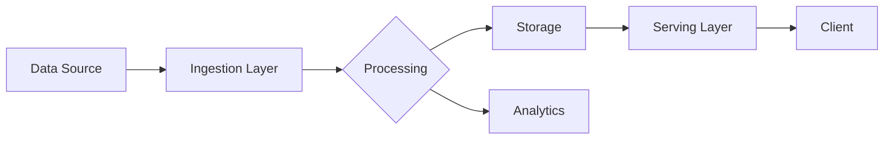

# ⚙️ Data Processing

These problems all share a common challenge: **moving data from A to B — reliably, fast, and at massive scale**.

## Core Concepts in Every Problem

| Problem | Key Challenge | Difficulty |
|---------|---------------|-----------|
| [URL Shortener](./url-shortener) | Read-heavy, hash collisions, redirect speed | 🟢 Easy |
| [YouTube / Netflix](./youtube-netflix) | Video encoding, CDN, adaptive streaming | 🟡 Medium |
| [Facebook Newsfeed](./facebook-newsfeed) | Fan-out at social scale | 🔴 Hard |
| [Web Crawler](./web-crawler) | Distributed crawl, deduplication, politeness | 🔴 Hard |
| [Ad Click Aggregation](./ad-click-aggregation) | High-write, real-time aggregation, exactly-once | 🔴 Hard |
| [Top-K Analysis](./top-k-analysis) | Approximate counting, streaming, Count-Min Sketch | 🟡 Medium |

## Recurring Patterns

1. **Read >> Write**: Most data is written once, read millions of times → cache aggressively
2. **Hot partitions**: Popular items (viral URLs, trending videos) cause load imbalance
3. **Async processing**: Heavy work (video transcoding, analytics) must be async via queues
4. **Approximate > Exact**: For large-scale analytics, HyperLogLog and Count-Min Sketch trade accuracy for performance
