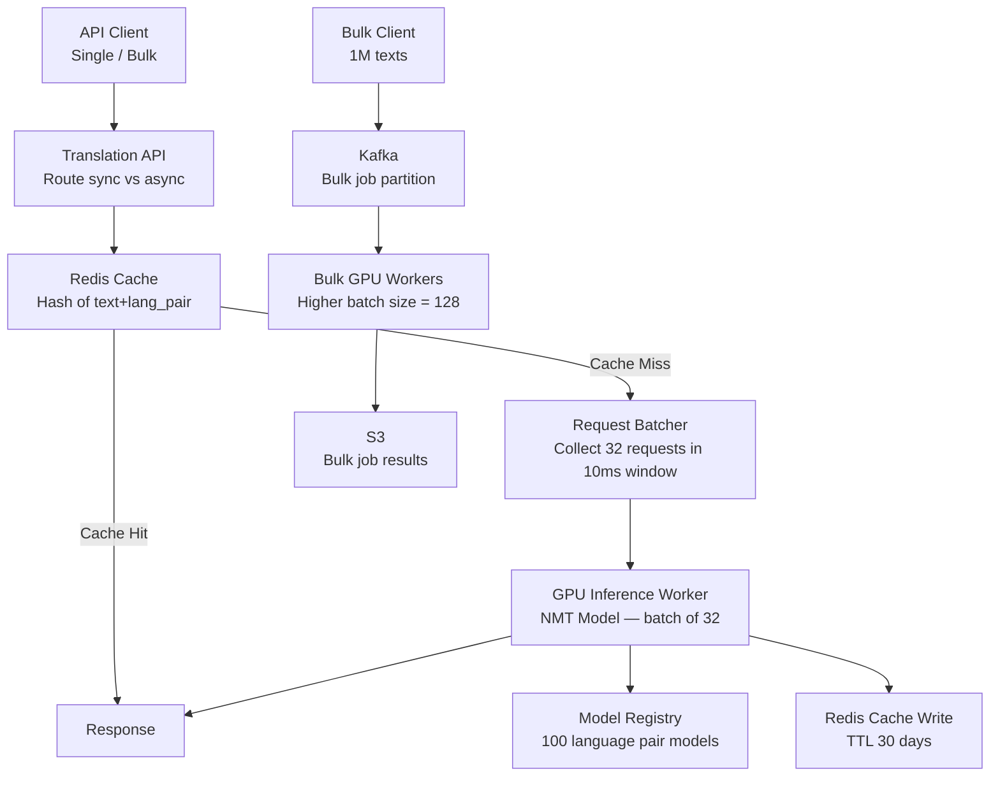
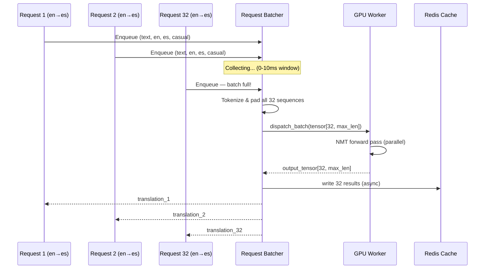
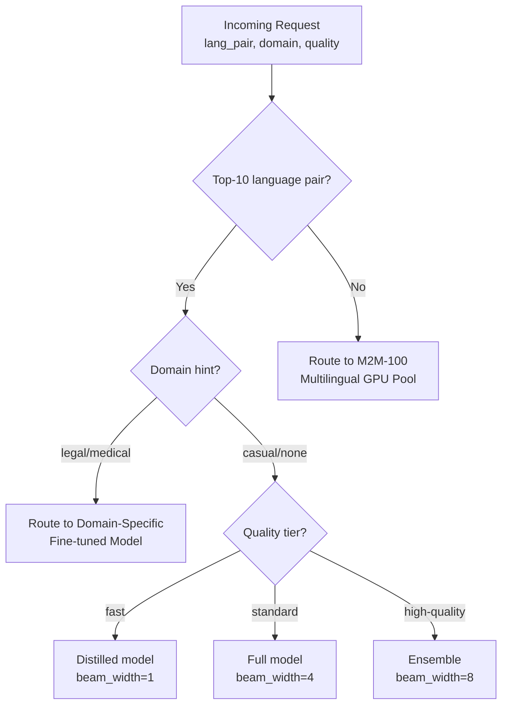

# Design a Language Translation Service

**Difficulty**: 🟡 Medium | **Codemania #59**
**Reading Time**: ~10 min
**Interview Frequency**: Medium

---

## The Core Problem

Translating 1 billion texts per day across 100 language pairs with sub-200ms latency for short texts, while managing expensive GPU compute, maximizing cache hit rates for repeated phrases, and supporting domain adaptation (legal vs medical vs casual language).

---

## Functional Requirements

- Translate text from source language to target language (100+ language pairs)
- Support text lengths from 1 word to 10,000 words per request
- < 200ms latency for texts ≤ 500 characters (P95)
- Asynchronous pipeline for bulk translation jobs (1M+ texts)
- Cache common phrases/sentences to avoid repeated GPU inference
- Domain hints: specify "legal", "medical", "casual" for better accuracy

## Non-Functional Requirements

| Requirement | Target |
|-------------|--------|
| Throughput | 1B translations/day = ~11,574/sec |
| Latency | < 200ms P95 for ≤ 500 chars |
| Cache hit rate | > 30% (common phrases are highly repetitive) |
| GPU utilization | > 80% (GPUs are expensive — must batch efficiently) |
| Bulk job latency | < 1 hour for 1M-text bulk job |

---

## Back-of-Envelope Estimates

- **Request rate**: 1B/day ÷ 86,400 = ~11,574 requests/sec
- **GPU inference**: Each NMT model processes ~1,000 tokens/sec on 1 GPU; avg request = 100 tokens; 1 GPU handles ~10 requests/sec; need 11,574 ÷ 10 = ~1,200 GPUs (batching helps: batch of 32 → 32× throughput → ~38 GPUs)
- **Cache hit rate**: Short repeated phrases (UI strings, product names) very repetitive. 30% cache hit = 350M GPU calls saved/day.
- **Cache size**: 1B unique phrases × 64 bytes (SHA-256 key) + 500 bytes avg translation = 564 GB Redis (large; use 30-day TTL eviction)

---

## High-Level Architecture



---

## Key Design Decisions

### 1. Single Large Model vs Language-Pair Specific Models

| Approach | Single Multilingual Model | Language-Pair Specific Models |
|----------|--------------------------|-------------------------------|
| Model count | 1 (e.g., M2M-100) | 100 models (one per pair) |
| Memory | 1 large model (~10 GB) | 100 × 500 MB = 50 GB |
| Quality | Good generalist | Better on specific pair |
| Cold start | One model loaded | Must load correct model per request |
| GPU utilization | All requests share one model | Underutilized models for rare pairs |

**Decision**: Hybrid — use a single multilingual model (Meta's M2M-100 or NLLB-200) for rare language pairs; deploy specialized pair models (EN→ES, EN→ZH, EN→DE) for top-10 pairs where quality is critical. Top-10 pairs cover 85% of volume.

### 2. Request Batching for GPU Efficiency

GPU throughput scales with batch size:
- Batch size 1: ~10 requests/sec per GPU
- Batch size 32: ~200 requests/sec per GPU (32× improvement, not full 32× due to overhead)
- Batch size 128: ~600 requests/sec per GPU

Batcher collects requests for up to 10ms or until 32 requests queued (whichever comes first):
- At 11,574 req/sec, 10ms window collects ~116 requests → split into batches of 32
- Maximum added latency: 10ms (acceptable within 200ms budget)

### 3. Cache by Exact Match vs Semantic Similarity

| Approach | Exact Match Cache | Semantic Similarity Cache |
|----------|------------------|--------------------------|
| Implementation | Redis GET with text hash | Vector similarity (expensive) |
| Latency | < 1ms | 20–50ms (embedding + search) |
| Hit rate | 30% for exact repeats | 50–60% with fuzzy matching |
| Risk | None | Wrong translation for similar but different text |

**Decision**: Exact match caching only (hash of normalized text + language pair). Semantic caching risks serving subtly wrong translations (unacceptable for legal/medical domains). Cache key = `SHA256(normalize(text) + src_lang + tgt_lang)`.

### 4. Latency vs Quality Trade-off

| Mode | Latency | Quality | Use Case |
|------|---------|---------|----------|
| Fast | < 100ms | Good | UI labels, short texts |
| Standard | < 200ms | Better | Articles, emails |
| High Quality | 2–5s | Best | Legal documents, medical records |
| Async/Bulk | Hours | Best | Large document batches |

Quality differences: beam search width (fast=1, standard=4, high=8), ensemble models, post-processing.

---

## Domain Adaptation

For specialized domains (legal, medical), fine-tune the base model on domain-specific corpus:
- Legal model: trained on 100M sentence pairs from legal documents
- Medical model: trained on PubMed abstracts and clinical notes
- Model selection: client passes `domain=legal` hint; route to appropriate fine-tuned model

Deployment: domain models deployed as separate model replicas; client hits the same API endpoint with domain hint.

---

## Async Bulk Translation Pipeline

For bulk jobs (1M texts):
1. Client uploads texts to S3 as JSONL
2. POST `/bulk-jobs` → create job, return `job_id`
3. Kafka consumer reads S3 file, partitions into batches of 1000
4. GPU workers process batches with batch size 128 (higher than real-time for better GPU utilization)
5. Results written to S3 as JSONL
6. Webhook notification to client when complete

SLA: 1M texts × avg 100 tokens ÷ 600 req/sec per GPU ÷ 100 GPU workers = ~16 seconds (well within 1-hour SLA).

---

## Top Interview Questions for This Problem

| Question | Tests |
|----------|-------|
| Why batch GPU requests — why not process one at a time? | GPU parallelism, hardware utilization, throughput vs latency trade-off |
| How would you reduce translation costs by 50%? | Cache hit rate improvement, larger batch sizes, spot GPU instances for async |
| How do you handle a 10,000-word document in < 200ms? | You don't — route to async pipeline, return job_id |
| What's the cache eviction strategy for a 564 GB translation cache? | LRU + TTL (30-day expiry for rare phrases), keep popular language pairs longer |

---

## Common Mistakes

1. **No request batching**: Single-request GPU inference wastes 95% of GPU capacity. Batching is mandatory for cost efficiency.
2. **Caching by semantic similarity**: Too risky for translation (subtle meaning differences matter). Use exact match only.
3. **One model for all 100 language pairs**: Quality suffers for high-traffic pairs (EN→ZH). Invest in specialized models for top pairs.

---

## Related Concepts

- [Caching Fundamentals](../../02-caching/concepts/caching-fundamentals) — Translation result caching strategy
- [Rate Limiter](../05-infrastructure/rate-limiter) — Throttle API clients to prevent GPU overload

---

---

## Component Deep Dive 1: GPU Request Batcher

The request batcher is the most critical performance component in any neural translation service. It transforms a stream of individual user requests into dense GPU batches, converting idle silicon into throughput.

### How It Works Internally

Every incoming translation request enters an in-memory queue keyed by language pair and domain (e.g., `en->es:casual`). A background thread runs a tight loop:

1. **Accumulate phase**: Collect requests for up to `max_wait_ms` (default: 10ms) OR until `max_batch_size` (default: 32) requests are queued, whichever fires first.
2. **Pad phase**: NMT models require uniform-length sequences in a batch. Pad all token sequences to the longest sequence length in the batch. Short sequences waste computation — this is why batching by similar lengths (dynamic batching) helps.
3. **Dispatch phase**: Push the padded tensor batch to the GPU via CUDA. The model processes all 32 sequences in parallel across thousands of CUDA cores.
4. **Scatter phase**: Responses arrive as a single output tensor. Slice it back into 32 individual translations and map each back to the waiting HTTP request or message queue entry.

### Why Naive Approaches Fail at Scale

Processing one request at a time is catastrophically inefficient. A modern A100 GPU has 6,912 CUDA cores and 80 GB of HBM2 memory. A single 100-token translation inference uses roughly 0.01% of the GPU's compute capacity. The remaining 99.99% sits idle waiting for the next request to arrive over the network. At 11,574 req/sec, the inter-arrival time averages 86 microseconds — not enough to saturate a GPU designed to process millions of parallel floating-point operations.

Real-world consequence: without batching, you need ~1,200 GPUs. With batch size 32, you need ~38 GPUs. At $3/hour per A100, that's $3,456/hour versus $110/hour — a 97% cost reduction.

### Batcher Internals Sequence Diagram



### Batching Strategy Trade-off Table

| Approach | Added Latency | Throughput Gain | GPU Utilization | Best For |
|----------|--------------|-----------------|-----------------|----------|
| Naive (batch=1) | 0ms | 1x baseline | ~1% | Dev/test only |
| Fixed window (10ms, max=32) | 0–10ms | 20x | ~60–70% | Interactive API |
| Dynamic length-sorted batching | 0–15ms | 25x | ~80% | Mixed-length workloads |
| Continuous batching (vLLM-style) | 0–5ms | 30x | ~90% | Latest GPU servers |

**Decision**: Fixed window (10ms, max 32) for the interactive path. Continuous batching via vLLM/TGI for latest deployments. Bulk async path uses batch=128 with no latency constraint.

---

## Component Deep Dive 2: Cache Architecture for Translation Results

Translation caching is not simple key-value caching. The cache must handle billions of keys, serve sub-millisecond lookups, and be precise — a fuzzy match that serves the wrong translation is worse than a cache miss.

### Internal Mechanics

Cache key construction: `SHA256(normalize(text) + "|" + src_lang + "|" + tgt_lang + "|" + domain)`. Normalization strips leading/trailing whitespace, collapses internal whitespace, and lowercases (for languages where case doesn't affect meaning). This ensures "Hello World" and "Hello  World" (double space) hit the same cache entry.

Cache value layout:
- `translated_text` (UTF-8 string, max 4000 chars)
- `model_version` (to invalidate when models are retrained)
- `created_at` (Unix timestamp for TTL management)
- `hit_count` (for promoting hot entries to L1)

Two-tier caching:
- **L1 (in-process LRU)**: Each API server keeps 50,000 most recently used translations in memory. Lookups take ~100 nanoseconds. Hit rate ~10% (server-local hot phrases).
- **L2 (Redis cluster)**: 30-node Redis cluster, ~600 GB total capacity. Lookups take ~0.5–1ms. Hit rate ~25–30% of all traffic.

Total effective cache hit rate: ~35%, saving ~350M GPU inferences per day.

### Scale Behavior at 10x Load

At 10x baseline (115,740 req/sec):

```mermaid
graph LR
    subgraph L1["L1 Cache (per server, 50K entries)"]
        LRU[In-Process LRU\n~100ns lookup]
    end
    subgraph L2["L2 Cache (Redis Cluster, 600 GB)"]
        Redis[Redis Cluster\n0.5–1ms lookup]
    end
    subgraph GPU["GPU Pool"]
        GPUWorker[GPU Workers\n~38 at 1x load]
    end

    Request --> LRU
    LRU -->|Miss (~90%)| Redis
    Redis -->|Miss (~65–70%)| GPUWorker
    LRU -->|Hit (~10%)| Response
    Redis -->|Hit (~25%)| Response
    GPUWorker --> Response
```

At 10x traffic, L1 hit rate actually improves slightly (more requests per server → hot phrases stay resident). L2 becomes the bottleneck — Redis read QPS exceeds single-shard capacity (~100k reads/sec per shard). Mitigation: add read replicas per Redis shard (3 replicas per primary), horizontally scale the Redis cluster from 30 to 90 shards.

### Cache Invalidation

When a model is retrained (monthly), all cached translations are stale. Strategy: rolling invalidation by `model_version` field — new requests check that `model_version` matches the current deployed version. Mismatched entries are treated as cache misses and overwritten. Avoids a thundering herd from flushing all 600 GB at once.

---

## Component Deep Dive 3: Model Registry and Routing

The model registry decides which NMT model handles each request. This is non-trivial: there are 100 language pairs, multiple domains (casual/legal/medical), multiple quality tiers (fast/standard/high), and multiple model versions coexisting during canary rollouts.

### Technical Decisions

**Model loading strategy**: Specialized pair models for the top-10 language pairs (EN↔ES, EN↔ZH, EN↔DE, EN↔FR, EN↔JA, EN↔PT, EN↔KO, EN↔IT, EN↔RU, EN↔AR) are always hot in GPU VRAM. These 10 pairs cover ~85% of request volume. All other pairs route to the multilingual M2M-100 / NLLB-200 model.

**GPU memory layout**: One A100 (80 GB VRAM) can hold:
- 1 specialized pair model (~2–4 GB each): 20 models per GPU at 4 GB each
- 1 M2M-100 multilingual model: ~10–15 GB

**Routing logic**:



**Canary rollouts**: New model versions are deployed to 5% of GPU workers first. The registry routes 5% of traffic to the new version based on request hash. A/B translation quality scoring (via a reference model) validates quality before full rollout.

**Cold model loading**: Rare language pairs not covered by the top-10 still need their specialized models occasionally. These are loaded on demand from model storage (S3) to GPU VRAM in ~30 seconds. An LRU model cache keeps the 50 most recently used models hot; others are evicted to free VRAM.

---

## Data Model

### Translation Cache Entry (Redis)

```
Key:   SHA256(normalized_text + "|" + src_lang + "|" + tgt_lang + "|" + domain)
       Example key: "a3f8c2d1...b9e7" (64-char hex)

Value: (MessagePack encoded)
{
  "t": "Hola, mundo",          # translated_text (UTF-8)
  "mv": "nllb200-2024-11",     # model_version (for invalidation)
  "ca": 1748736000,            # created_at (Unix timestamp)
  "hc": 47,                    # hit_count (for analytics)
  "sl": "en",                  # src_lang
  "tl": "es",                  # tgt_lang
  "dom": "casual"              # domain
}

TTL: 2,592,000 seconds (30 days)
Memory per entry: ~600 bytes average
Total capacity: 600 GB → ~1 billion entries
```

### Bulk Translation Job (PostgreSQL)

```sql
CREATE TABLE bulk_jobs (
    job_id          UUID PRIMARY KEY DEFAULT gen_random_uuid(),
    client_id       UUID NOT NULL,
    status          VARCHAR(20) NOT NULL DEFAULT 'pending',
    -- pending | processing | completed | failed
    src_lang        VARCHAR(10) NOT NULL,
    tgt_lang        VARCHAR(10) NOT NULL,
    domain          VARCHAR(20) DEFAULT 'casual',
    quality_tier    VARCHAR(20) DEFAULT 'standard',
    input_s3_uri    TEXT NOT NULL,   -- s3://bucket/jobs/{job_id}/input.jsonl
    output_s3_uri   TEXT,            -- s3://bucket/jobs/{job_id}/output.jsonl
    total_texts     INTEGER,
    processed_texts INTEGER DEFAULT 0,
    failed_texts    INTEGER DEFAULT 0,
    webhook_url     TEXT,
    created_at      TIMESTAMPTZ NOT NULL DEFAULT NOW(),
    started_at      TIMESTAMPTZ,
    completed_at    TIMESTAMPTZ,
    error_message   TEXT
);

CREATE INDEX idx_bulk_jobs_client_id ON bulk_jobs(client_id);
CREATE INDEX idx_bulk_jobs_status ON bulk_jobs(status) WHERE status IN ('pending', 'processing');
CREATE INDEX idx_bulk_jobs_created_at ON bulk_jobs(created_at);
```

### Translation Request Log (ClickHouse — analytics)

```sql
CREATE TABLE translation_requests (
    request_id      UUID,
    client_id       UUID,
    src_lang        LowCardinality(String),
    tgt_lang        LowCardinality(String),
    domain          LowCardinality(String),
    quality_tier    LowCardinality(String),
    input_char_len  UInt32,
    input_token_len UInt32,
    cache_hit       UInt8,       -- 0=miss, 1=L1 hit, 2=L2 hit
    model_version   LowCardinality(String),
    inference_ms    UInt32,      -- GPU inference time in ms
    total_ms        UInt32,      -- end-to-end latency in ms
    gpu_worker_id   String,
    batch_size      UInt8,       -- batch this request was grouped into
    created_at      DateTime
) ENGINE = MergeTree()
PARTITION BY toYYYYMM(created_at)
ORDER BY (created_at, src_lang, tgt_lang)
TTL created_at + INTERVAL 90 DAY;
```

---

## Scale Bottlenecks

| Traffic Level | Component That Breaks | Symptoms | Mitigation |
|---------------|----------------------|----------|------------|
| 2x baseline (23k req/sec) | Redis L2 single shard (~100k reads/sec limit) | Cache lookup P99 spikes from 1ms to 20ms | Add 2 read replicas per Redis shard |
| 5x baseline (58k req/sec) | GPU batcher queue depth | P95 latency exceeds 200ms SLA (batcher wait time stacks) | Increase batcher fleet, reduce batch window to 5ms, scale GPU workers |
| 10x baseline (115k req/sec) | Translation API servers (stateless) | CPU saturation on hash computation + connection handling | Horizontal scale API tier behind load balancer; each server handles ~5k req/sec |
| 50x baseline (580k req/sec) | Kafka bulk job partitions (throughput limit ~1M msg/sec per cluster) | Bulk job processing falls behind; queue depth grows | Add Kafka clusters per region, partition by language pair |
| 100x baseline (1.15M req/sec) | Network bandwidth on Redis cluster (~100 Gbps saturated) | Cache lookup timeouts, fallback to GPU inference | Regional Redis caches (deploy Redis per availability zone), sticky routing |
| 1000x baseline (11.5M req/sec) | GPU supply — requires ~38,000 A100s | Cannot procure hardware fast enough | Specialized inference chips (Google TPU v5p), model distillation to reduce per-token compute, tiered SLA (not all requests need < 200ms) |

---

## How Google Translate Built This

Google Translate serves over 100 billion words per day across 133 languages — roughly 10× the scale of the problem defined above. Their engineering evolution is one of the most detailed publicly documented AI infrastructure stories.

**The 2016 GNMT Paper** (Wu et al., arxiv.org/abs/1609.08144) described the first production NMT deployment replacing phrase-based translation. Key non-obvious decision: they did not replace all language pairs at once. English-French went live first in November 2016, with the rollout taking six months to cover all pairs. Quality gains were 55–85% reduction in translation errors versus the prior phrase-based system on human evaluation.

**Infrastructure specifics** (from Google I/O and Google Research blog posts):
- Each GNMT model inference requires ~35 billion floating point operations for a typical sentence
- At launch, they ran on Google's first-generation TPUs (Tensor Processing Units), specifically designed for this workload. TPU v1 delivered 92 teraflops at 40 watts — 10× the performance-per-watt of contemporary GPUs for inference.
- Batch size during online serving: 8 (smaller than expected — TPUs saturate faster than GPUs due to systolic array architecture)
- Model served from 2 replicas per language pair per data center, with automatic failover
- Cache hit rate for production traffic: ~35%, achieved by caching at the sentence level after tokenization, not raw character input

**Non-obvious architectural decision**: Google pre-caches translations for the entire Common Crawl web corpus (~50 TB of text). When a user submits a sentence seen anywhere on the public web, the result is served from cache with < 1ms latency. This "warm cache" for internet content was a key driver of their high cache hit rates in practice.

**Cost control**: Google disclosed that switching from phrase-based to NMT increased compute costs by ~2× initially. They recovered this via model distillation — training smaller "student" models that approximate the large "teacher" model with 90% of the quality at 30% of the compute. By 2019, most production inference ran on distilled models.

Source: [Google Research Blog — Found in Translation](https://research.google/blog/found-in-translation-more-accurate-more-expressive-language-models/)

---

## Interview Angle

**What the interviewer is testing:** The interviewer is evaluating whether you understand GPU economics (batching is the key cost lever), cache design for high-cardinality keys at web scale, and the boundary between synchronous and asynchronous processing for different request sizes.

**Common mistakes candidates make:**

1. **Treating translation like a typical stateless API**: Saying "just add more servers" without addressing that the bottleneck is GPU compute, not CPU or I/O. A server with no GPU does nothing useful. The answer must center on GPU utilization and batching.

2. **Proposing semantic caching without acknowledging its risks**: Semantic/vector similarity caching sounds clever and candidates often propose it to increase cache hit rates. The interviewer will push back — in legal and medical domains, a sentence that is 95% similar in meaning can have a completely different correct translation. Exact-match caching is the safe default; semantic caching requires domain-specific validation that is very hard to get right.

3. **Routing 10,000-word documents to the synchronous path**: The latency math is obvious once spelled out (10,000 words ≈ 15,000 tokens ÷ 1,000 tokens/sec/GPU = 15 seconds minimum inference time), but candidates under time pressure often forget that the functional requirement says "< 200ms for ≤ 500 characters" and miss that large documents must go to the async pipeline.

**The insight that separates good from great answers:** Great candidates recognize that the effective throughput of the GPU pool is determined not just by batch size but by **batch homogeneity**. A batch of 32 requests where one request is 5,000 tokens and the rest are 50 tokens means all 31 short requests are padded to 5,000 tokens — wasting 98% of computation on padding. Production systems solve this with **length-sorted dynamic batching**: group similar-length requests together. This detail — only visible if you have read about real production NMT systems — immediately signals to the interviewer that you have hands-on or research experience with the problem domain.

---

## Key Numbers to Remember

| Metric | Value | Context |
|--------|-------|---------|
| Request rate | 11,574 req/sec | 1 billion translations/day |
| GPU throughput, batch=1 | ~10 req/sec | Single A100, no batching |
| GPU throughput, batch=32 | ~200 req/sec | 20× improvement from batching |
| GPU throughput, batch=128 | ~600 req/sec | Bulk async path |
| GPUs required without batching | ~1,200 A100s | At 11,574 req/sec |
| GPUs required with batch=32 | ~38 A100s | 97% cost reduction |
| Cache size for 1B entries | ~564 GB | 64B key + 500B value average |
| Cache hit rate target | 30–35% | Exact match on normalized text |
| Redis lookup latency | < 1ms | L2 cache hit |
| Max batcher wait window | 10ms | Interactive API latency budget |
| Bulk job throughput | ~1M texts in 16 seconds | 100 GPU workers, batch=128 |
| Google Translate daily volume | 100B+ words/day | ~10× scale of this problem |
| Model distillation quality retention | ~90% quality at 30% compute | Key cost-reduction lever |

---

## 📚 Resources & References

| Resource | Type | What You'll Learn |
|----------|------|------------------|
| [Google Neural Machine Translation (2016)](https://arxiv.org/abs/1609.08144) | 📖 Blog | Foundational NMT architecture, seq2seq with attention |
| [ByteByteGo — ML System Design](https://www.youtube.com/@ByteByteGo) | 📺 YouTube | ML inference pipelines, batching, caching strategies |
| [Hussein Nasser — Scaling API Services](https://www.youtube.com/@hnasr) | 📺 YouTube | GPU batching, async pipelines, cost optimization |
| [High Scalability — ML Inference at Scale](https://highscalability.com) | 📖 Blog | Production ML serving patterns and lessons |
