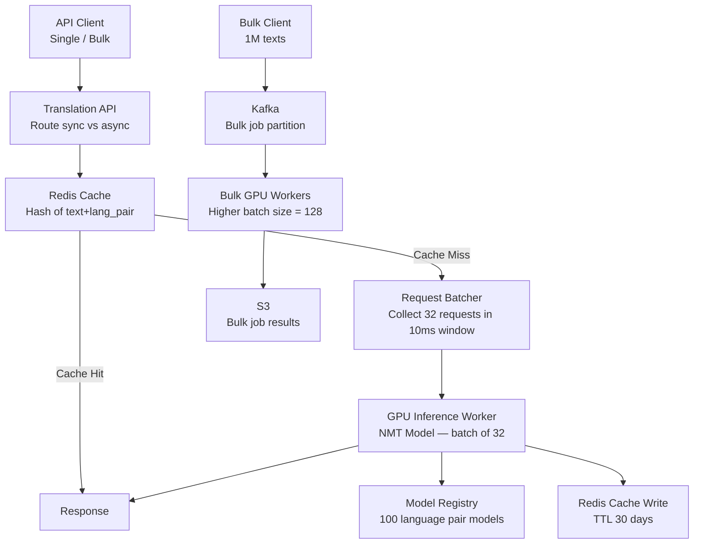

# Design a Language Translation Service

**Difficulty**: 🟡 Medium | **Codemania #59**
**Reading Time**: ~10 min
**Interview Frequency**: Medium

---

## The Core Problem

Translating 1 billion texts per day across 100 language pairs with sub-200ms latency for short texts, while managing expensive GPU compute, maximizing cache hit rates for repeated phrases, and supporting domain adaptation (legal vs medical vs casual language).

---

## Functional Requirements

- Translate text from source language to target language (100+ language pairs)
- Support text lengths from 1 word to 10,000 words per request
- < 200ms latency for texts ≤ 500 characters (P95)
- Asynchronous pipeline for bulk translation jobs (1M+ texts)
- Cache common phrases/sentences to avoid repeated GPU inference
- Domain hints: specify "legal", "medical", "casual" for better accuracy

## Non-Functional Requirements

| Requirement | Target |
|-------------|--------|
| Throughput | 1B translations/day = ~11,574/sec |
| Latency | < 200ms P95 for ≤ 500 chars |
| Cache hit rate | > 30% (common phrases are highly repetitive) |
| GPU utilization | > 80% (GPUs are expensive — must batch efficiently) |
| Bulk job latency | < 1 hour for 1M-text bulk job |

---

## Back-of-Envelope Estimates

- **Request rate**: 1B/day ÷ 86,400 = ~11,574 requests/sec
- **GPU inference**: Each NMT model processes ~1,000 tokens/sec on 1 GPU; avg request = 100 tokens; 1 GPU handles ~10 requests/sec; need 11,574 ÷ 10 = ~1,200 GPUs (batching helps: batch of 32 → 32× throughput → ~38 GPUs)
- **Cache hit rate**: Short repeated phrases (UI strings, product names) very repetitive. 30% cache hit = 350M GPU calls saved/day.
- **Cache size**: 1B unique phrases × 64 bytes (SHA-256 key) + 500 bytes avg translation = 564 GB Redis (large; use 30-day TTL eviction)

---

## High-Level Architecture

---

## Key Design Decisions

### 1. Single Large Model vs Language-Pair Specific Models

| Approach | Single Multilingual Model | Language-Pair Specific Models |
|----------|--------------------------|-------------------------------|
| Model count | 1 (e.g., M2M-100) | 100 models (one per pair) |
| Memory | 1 large model (~10 GB) | 100 × 500 MB = 50 GB |
| Quality | Good generalist | Better on specific pair |
| Cold start | One model loaded | Must load correct model per request |
| GPU utilization | All requests share one model | Underutilized models for rare pairs |

**Decision**: Hybrid — use a single multilingual model (Meta's M2M-100 or NLLB-200) for rare language pairs; deploy specialized pair models (EN→ES, EN→ZH, EN→DE) for top-10 pairs where quality is critical. Top-10 pairs cover 85% of volume.

### 2. Request Batching for GPU Efficiency

GPU throughput scales with batch size:
- Batch size 1: ~10 requests/sec per GPU
- Batch size 32: ~200 requests/sec per GPU (32× improvement, not full 32× due to overhead)
- Batch size 128: ~600 requests/sec per GPU

Batcher collects requests for up to 10ms or until 32 requests queued (whichever comes first):
- At 11,574 req/sec, 10ms window collects ~116 requests → split into batches of 32
- Maximum added latency: 10ms (acceptable within 200ms budget)

### 3. Cache by Exact Match vs Semantic Similarity

| Approach | Exact Match Cache | Semantic Similarity Cache |
|----------|------------------|--------------------------|
| Implementation | Redis GET with text hash | Vector similarity (expensive) |
| Latency | < 1ms | 20–50ms (embedding + search) |
| Hit rate | 30% for exact repeats | 50–60% with fuzzy matching |
| Risk | None | Wrong translation for similar but different text |

**Decision**: Exact match caching only (hash of normalized text + language pair). Semantic caching risks serving subtly wrong translations (unacceptable for legal/medical domains). Cache key = `SHA256(normalize(text) + src_lang + tgt_lang)`.

### 4. Latency vs Quality Trade-off

| Mode | Latency | Quality | Use Case |
|------|---------|---------|----------|
| Fast | < 100ms | Good | UI labels, short texts |
| Standard | < 200ms | Better | Articles, emails |
| High Quality | 2–5s | Best | Legal documents, medical records |
| Async/Bulk | Hours | Best | Large document batches |

Quality differences: beam search width (fast=1, standard=4, high=8), ensemble models, post-processing.

---

## Domain Adaptation

For specialized domains (legal, medical), fine-tune the base model on domain-specific corpus:
- Legal model: trained on 100M sentence pairs from legal documents
- Medical model: trained on PubMed abstracts and clinical notes
- Model selection: client passes `domain=legal` hint; route to appropriate fine-tuned model

Deployment: domain models deployed as separate model replicas; client hits the same API endpoint with domain hint.

---

## Async Bulk Translation Pipeline

For bulk jobs (1M texts):
1. Client uploads texts to S3 as JSONL
2. POST `/bulk-jobs` → create job, return `job_id`
3. Kafka consumer reads S3 file, partitions into batches of 1000
4. GPU workers process batches with batch size 128 (higher than real-time for better GPU utilization)
5. Results written to S3 as JSONL
6. Webhook notification to client when complete

SLA: 1M texts × avg 100 tokens ÷ 600 req/sec per GPU ÷ 100 GPU workers = ~16 seconds (well within 1-hour SLA).

---

## Top Interview Questions for This Problem

| Question | Tests |
|----------|-------|
| Why batch GPU requests — why not process one at a time? | GPU parallelism, hardware utilization, throughput vs latency trade-off |
| How would you reduce translation costs by 50%? | Cache hit rate improvement, larger batch sizes, spot GPU instances for async |
| How do you handle a 10,000-word document in < 200ms? | You don't — route to async pipeline, return job_id |
| What's the cache eviction strategy for a 564 GB translation cache? | LRU + TTL (30-day expiry for rare phrases), keep popular language pairs longer |

---

## Common Mistakes

1. **No request batching**: Single-request GPU inference wastes 95% of GPU capacity. Batching is mandatory for cost efficiency.
2. **Caching by semantic similarity**: Too risky for translation (subtle meaning differences matter). Use exact match only.
3. **One model for all 100 language pairs**: Quality suffers for high-traffic pairs (EN→ZH). Invest in specialized models for top pairs.

---

## Related Concepts

- [Caching Fundamentals](../../02-caching/concepts/caching-fundamentals) — Translation result caching strategy
- [Rate Limiter](../05-infrastructure/rate-limiter) — Throttle API clients to prevent GPU overload

---

## 📚 Resources & References

| Resource | Type | What You'll Learn |
|----------|------|------------------|
| [Google Neural Machine Translation (2016)](https://arxiv.org/abs/1609.08144) | 📖 Blog | Foundational NMT architecture, seq2seq with attention |
| [ByteByteGo — ML System Design](https://www.youtube.com/@ByteByteGo) | 📺 YouTube | ML inference pipelines, batching, caching strategies |
| [Hussein Nasser — Scaling API Services](https://www.youtube.com/@hnasr) | 📺 YouTube | GPU batching, async pipelines, cost optimization |
| [High Scalability — ML Inference at Scale](https://highscalability.com) | 📖 Blog | Production ML serving patterns and lessons |
