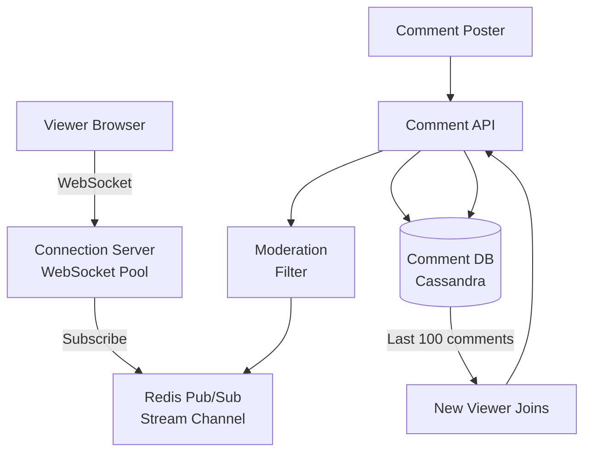

# Design a Live Comment System

**Difficulty**: 🟡 Intermediate
**Reading Time**: Coming Soon
**Interview Frequency**: Medium

---

> 🚧 **Full article coming soon.** This stub gives you the essentials to start thinking about this problem.

---

## The Core Problem

Broadcasting comments to 100,000 concurrent viewers of a live stream with under 500ms delivery latency requires a fan-out mechanism that doesn't collapse under viral events. A naive approach of writing each comment to every viewer's queue generates 100,000 writes per comment — at 100 comments/sec that's 10M writes/sec from a single popular stream.

## Functional Requirements

- Viewers can post comments visible to all other viewers in real-time
- Comments are delivered within 500ms to all connected viewers
- Support basic moderation (block/delete comments)
- Show comment history when a user joins mid-stream

## Non-Functional Requirements

| Requirement | Target |
|-------------|--------|
| Delivery latency | p99 < 500ms |
| Concurrent viewers | 100,000 per stream |
| Comment throughput | 1,000 comments/sec per stream |
| Availability | 99.9% (8.7 hrs downtime/year) |

## Back-of-Envelope Estimates

- **Fan-out writes**: 1,000 comments/sec × 100,000 viewers = 100M fan-out operations/sec per popular stream
- **WebSocket connections**: 100,000 viewers × 1 WebSocket each = 100,000 persistent connections per stream (needs connection pooling across servers)
- **Comment storage**: 1,000 comments/sec × 200 bytes = 200KB/sec → ~17GB/day for persistent storage

## Key Design Decisions

1. **Redis Pub/Sub for Fan-out** — instead of writing to every viewer queue, publish to a single channel per stream; every connection server subscribes; connection servers then push to their local WebSocket clients. One write fans out to all servers.
2. **WebSocket vs SSE** — WebSocket enables bidirectional communication (posting and receiving); SSE (Server-Sent Events) is unidirectional and works through HTTP/2 proxies more easily; use WebSocket for full interactivity.
3. **Comment Moderation Pipeline** — run async classifier on all comments before broadcasting; block keywords immediately; flag ML-scored comments for human review without blocking delivery of clean comments.

## High-Level Architecture

## Top Interview Questions for This Problem

| Question | Tests |
|----------|-------|
| How do you scale WebSocket connections beyond a single server's capacity? | Horizontal scaling, connection routing |
| How would you show the last 100 comments to a user who joins mid-stream? | Persistent storage, lazy loading |
| How do you handle a toxic commenter posting 100 comments/sec (abuse)? | Rate limiting, per-user throttle |

## Related Concepts

- [WebSocket vs SSE vs Long Polling trade-offs](../../../07-api-design/concepts/realtime-api-patterns)
- [Redis Pub/Sub for real-time messaging](../../../03-redis/concepts/redis-pub-sub-vs-streams)

---

*📚 Full deep-dive with multiple approaches, trade-off tables, and pseudocode coming soon.*

## 📚 Resources & References

| Resource | Type | What You'll Learn |
|----------|------|------------------|
| [ByteByteGo — Design a Live Comment System](https://www.youtube.com/@ByteByteGo) | 📺 YouTube | Search "live comment system" — WebSocket, fan-out, and ordering challenges |
| [YouTube Engineering: Live Streaming at Scale](https://www.youtube.com/watch?v=x-KFdEbqIco) | 📺 YouTube | How YouTube handles real-time comments during live events |
| [Twitch Engineering: Chat at Scale](https://blog.twitch.tv/en/2015/12/18/twitch-engineering-an-introduction-and-overview-1a00c5c3d1bb/) | 📖 Blog | How Twitch handles millions of concurrent chat messages per channel |
| [Redis Pub/Sub Documentation](https://redis.io/docs/manual/pubsub/) | 📚 Docs | Redis Pub/Sub patterns for real-time message broadcasting |
| [High Scalability: Live Streaming Architecture](http://highscalability.com) | 📖 Blog | Real-world live streaming system case studies |
