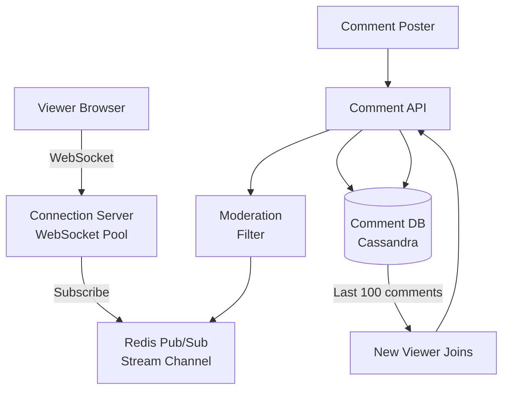
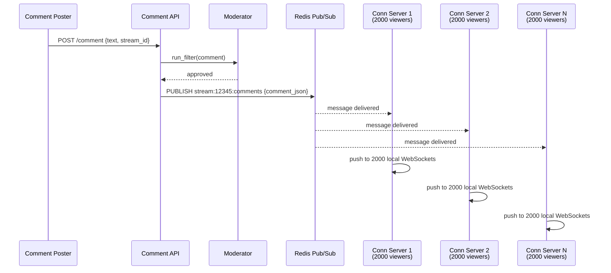
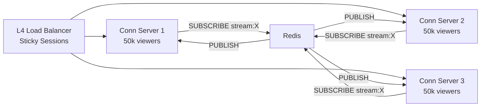
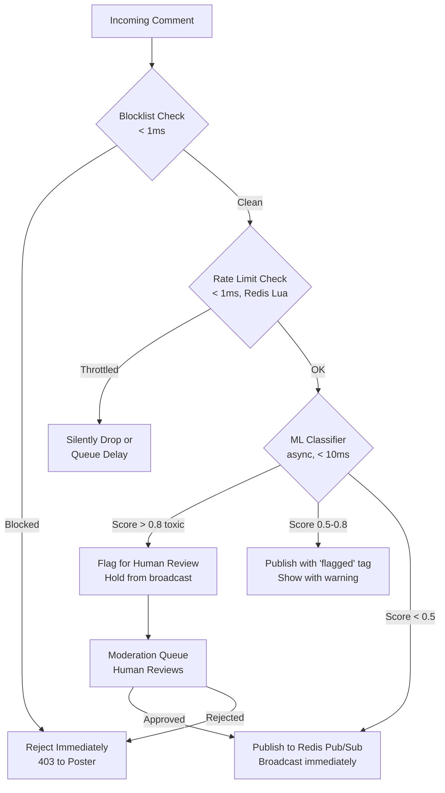
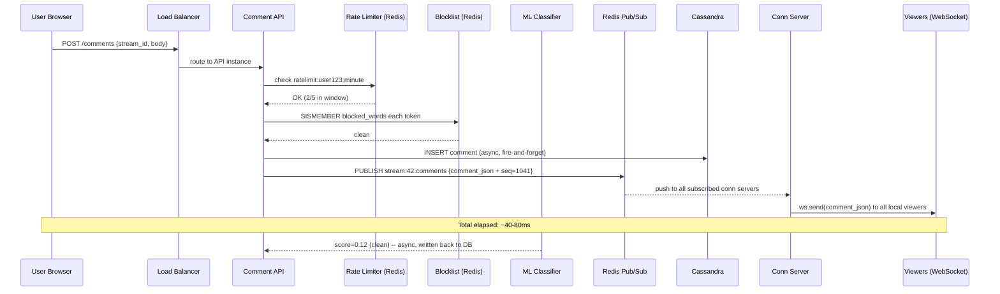

# Design a Live Comment System

**Difficulty**: 🟡 Intermediate
**Reading Time**: ~20 min
**Interview Frequency**: Medium

---

## The Core Problem

Broadcasting comments to 100,000 concurrent viewers of a live stream with under 500ms delivery latency requires a fan-out mechanism that doesn't collapse under viral events. A naive approach of writing each comment to every viewer's queue generates 100,000 writes per comment — at 100 comments/sec that's 10M writes/sec from a single popular stream.

## Functional Requirements

- Viewers can post comments visible to all other viewers in real-time
- Comments are delivered within 500ms to all connected viewers
- Support basic moderation (block/delete comments)
- Show comment history when a user joins mid-stream

## Non-Functional Requirements

| Requirement | Target |
|-------------|--------|
| Delivery latency | p99 < 500ms |
| Concurrent viewers | 100,000 per stream |
| Comment throughput | 1,000 comments/sec per stream |
| Availability | 99.9% (8.7 hrs downtime/year) |

## Back-of-Envelope Estimates

- **Fan-out writes**: 1,000 comments/sec × 100,000 viewers = 100M fan-out operations/sec per popular stream
- **WebSocket connections**: 100,000 viewers × 1 WebSocket each = 100,000 persistent connections per stream (needs connection pooling across servers)
- **Comment storage**: 1,000 comments/sec × 200 bytes = 200KB/sec → ~17GB/day for persistent storage

## Key Design Decisions

1. **Redis Pub/Sub for Fan-out** — instead of writing to every viewer queue, publish to a single channel per stream; every connection server subscribes; connection servers then push to their local WebSocket clients. One write fans out to all servers.
2. **WebSocket vs SSE** — WebSocket enables bidirectional communication (posting and receiving); SSE (Server-Sent Events) is unidirectional and works through HTTP/2 proxies more easily; use WebSocket for full interactivity.
3. **Comment Moderation Pipeline** — run async classifier on all comments before broadcasting; block keywords immediately; flag ML-scored comments for human review without blocking delivery of clean comments.

## High-Level Architecture



## Top Interview Questions for This Problem

| Question | Tests |
|----------|-------|
| How do you scale WebSocket connections beyond a single server's capacity? | Horizontal scaling, connection routing |
| How would you show the last 100 comments to a user who joins mid-stream? | Persistent storage, lazy loading |
| How do you handle a toxic commenter posting 100 comments/sec (abuse)? | Rate limiting, per-user throttle |

## Related Concepts

- [WebSocket vs SSE vs Long Polling trade-offs](../../../07-api-design/concepts/realtime-api-patterns)
- [Redis Pub/Sub for real-time messaging](../../../03-redis/concepts/redis-pub-sub-vs-streams)

---

## Component Deep Dive 1: Fan-Out Architecture with Redis Pub/Sub

Fan-out is the defining challenge of any live comment system. When a viewer posts a comment, that single event must be delivered to every other connected viewer — potentially 100,000+ recipients — within 500ms. This is the architectural core that determines whether the system survives or collapses under load.

### Why Naive Approaches Fail

**Naive approach 1 — write to every viewer's queue directly**: At 1,000 comments/sec with 100,000 viewers, this generates 100 million queue writes per second from one popular stream. With 10 concurrent popular streams, that's 1 billion writes/sec. No single database survives this.

**Naive approach 2 — polling from a shared database**: Viewers poll the comments table every 500ms. At 100,000 viewers × 2 polls/sec = 200,000 reads/sec per stream. At peak (10 streams, 1M viewers total) that's 2M reads/sec, all hitting the same DB. It also has high latency since polling introduces up to 500ms delay regardless of network speed.

### The Redis Pub/Sub Fan-Out Model

Redis Pub/Sub decouples the write path from the read path. A comment poster writes once to Redis channel `stream:{stream_id}:comments`. Every connection server has subscribed to this channel. Redis delivers the message to all N connection servers simultaneously — this is O(N servers) not O(N viewers). Each connection server then pushes to its local WebSocket clients, which is an in-process operation with negligible overhead.

With 100,000 viewers distributed across 50 connection servers (2,000 viewers/server), Redis delivers each comment to 50 servers, each server pushes to 2,000 local WebSockets. Total network messages = 50 (Redis to servers) + 100,000 (server to clients). Redis only handles 50 messages per comment, not 100,000.



### Fan-Out Option Comparison

| Approach | Write Amplification | Latency | Complexity | Best For |
|----------|--------------------|---------|---------|----|
| Redis Pub/Sub | O(N servers), not O(N viewers) | 5–20ms | Low | Up to 500k viewers/stream |
| Kafka topics per stream | O(N consumer groups) | 20–100ms | Medium | When replay/audit is needed |
| Direct viewer queue (SQS/RabbitMQ) | O(N viewers) | 50–200ms | High | Small-scale (< 1,000 viewers) |

**Limitation of Redis Pub/Sub**: Messages are not persisted. If a connection server crashes mid-publish, viewers on that server miss those comments. For a live comment stream, a few missed comments during a crash/restart window is usually acceptable. If strict delivery is required, use Kafka with consumer groups per connection server — but accept higher latency (20–50ms vs 5ms).

---

## Component Deep Dive 2: WebSocket Connection Server Scaling

The connection server layer is where 100,000 persistent TCP connections live. Each WebSocket connection consumes a file descriptor, ~8KB kernel buffer, and memory for the session state. A single Linux process can handle ~64,000 file descriptors by default (tunable to 1M+ with `ulimit`), but practical capacity per server is 10,000–50,000 WebSocket connections before CPU and memory become bottlenecks.

### Internal Mechanics

Each connection server maintains an in-memory map:

```
stream_id → [ws_conn_1, ws_conn_2, ..., ws_conn_N]
user_id   → ws_conn (for targeted messages like moderation notices)
```

When a WebSocket message arrives from Redis Pub/Sub, the server looks up all connections subscribed to that stream and iterates the list, writing the payload to each socket. This is CPU-bound at scale — serializing and writing to 50,000 connections at 1,000 comments/sec means 50M write operations/sec per server. Use non-blocking I/O (Node.js event loop, Go goroutines, or Java Netty) — never block the event loop on individual socket writes.

### What Happens at 10x Load

At 1M concurrent viewers across 100 connection servers (10,000 viewers/server), the Redis subscription count per channel grows to 100 subscribers. Redis can handle this easily. The bottleneck shifts to connection server memory: 10,000 connections × 8KB socket buffer + session state ≈ 300–500MB per server just for buffers, plus application-level session data. At 100,000 connections per server (100x), you need dedicated high-memory instances (32–64GB RAM) and explicit connection limits with load shedding.

### Connection Routing with a Load Balancer

Stateful WebSocket connections require sticky sessions at the load balancer — once a viewer connects to Server A, all messages for that viewer must go through Server A (because the WebSocket is open on Server A). Use Layer 4 (TCP) load balancing with consistent hashing on client IP, or a session cookie that maps to a specific server. AWS ALB supports sticky sessions via cookies natively.



**Scale behavior table:**

| Server Count | Viewers/Server | Redis Pub/Sub Fan-out | Comment Push Latency |
|--------------|---------------|----------------------|---------------------|
| 10 | 10,000 | 10 msgs/comment | ~10ms |
| 50 | 2,000 | 50 msgs/comment | ~15ms |
| 100 | 1,000 | 100 msgs/comment | ~20ms |
| 500 | 200 | 500 msgs/comment | ~50ms |

Redis comfortably handles 500 pub/sub subscribers per channel. Beyond 1,000 servers, consider a two-tier fan-out: regional Redis clusters that each subscribe to a global Kafka topic, then fan out locally.

---

## Component Deep Dive 3: Comment Storage and Late-Joiner History

When a viewer joins a stream mid-way, they expect to see recent comments — typically the last 50–100. This requires persistent storage with fast range reads on `(stream_id, timestamp)`.

### Storage Choice: Cassandra

Cassandra is the natural fit because:

1. **Write-heavy workload**: 1,000 comments/sec per stream translates to 1,000 Cassandra writes/sec, which a 3-node cluster handles trivially (Cassandra saturates at ~50,000 writes/sec per node on commodity hardware).
2. **Range reads by stream**: Partition key = `stream_id`, clustering key = `created_at DESC` allows fetching the last N comments with a single query: `SELECT * FROM comments WHERE stream_id = ? ORDER BY created_at DESC LIMIT 100`.
3. **Time-series data**: Comments are naturally append-only and time-ordered. Cassandra's LSM-tree storage model excels at time-series append workloads.

**Alternative — Redis Sorted Set per stream**: Simpler for small streams, but Redis data is in-memory and expensive at scale. Use Redis as a hot cache for the last 200 comments (evict after 24 hours), backed by Cassandra for full history. This gives sub-millisecond reads for late joiners on active streams.

### Technical Decisions

- **TTL on comment rows**: Set Cassandra TTL to 30 days for live streams. For VOD (video on demand) replays, retain indefinitely.
- **Comment IDs**: Use UUIDs v7 (time-ordered) or Snowflake IDs — this provides global uniqueness plus monotonic ordering without a central counter. Avoid auto-increment IDs in distributed Cassandra.
- **Tombstone accumulation**: When comments are deleted by moderators, Cassandra creates tombstones. Run compaction with `gc_grace_seconds = 86400` (1 day) and set TTL on deleted markers to avoid tombstone accumulation across long-running streams.

---

## Data Model

```sql
-- Cassandra CQL schema

CREATE TABLE comments (
    stream_id     UUID,
    comment_id    TIMEUUID,          -- time-ordered UUID for monotonic ordering
    user_id       UUID,
    username      TEXT,
    body          TEXT,              -- max 500 chars enforced at API layer
    sentiment     FLOAT,             -- ML score: 0.0 (toxic) to 1.0 (clean)
    status        TEXT,              -- 'active' | 'deleted' | 'flagged'
    client_ts     TIMESTAMP,         -- client-reported timestamp (for display)
    server_ts     TIMESTAMP,         -- server-assigned timestamp (for ordering)
    PRIMARY KEY (stream_id, comment_id)
) WITH CLUSTERING ORDER BY (comment_id DESC)
  AND default_time_to_live = 2592000  -- 30 days in seconds
  AND compaction = {'class': 'TimeWindowCompactionStrategy',
                    'compaction_window_unit': 'HOURS',
                    'compaction_window_size': 1};

-- For user comment lookup (moderation: "show all comments by user X")
CREATE TABLE comments_by_user (
    user_id       UUID,
    stream_id     UUID,
    comment_id    TIMEUUID,
    body          TEXT,
    status        TEXT,
    server_ts     TIMESTAMP,
    PRIMARY KEY (user_id, server_ts, comment_id)
) WITH CLUSTERING ORDER BY (server_ts DESC, comment_id DESC);

-- Redis key patterns
-- Hot cache (last 200 comments per stream):
--   ZSET  stream:{stream_id}:comments   score=unix_ms  member=comment_json
-- Rate limiting (per user):
--   STRING  ratelimit:{user_id}:{window_minute}   value=count   TTL=60s
-- Pub/Sub channel:
--   CHANNEL  stream:{stream_id}:live

-- Indexes
-- Cassandra primary key (stream_id, comment_id) covers 95% of queries.
-- Secondary index on status for moderation dashboard queries — keep on a
-- separate materialized view to avoid scatter-gather on the primary table.

CREATE MATERIALIZED VIEW flagged_comments AS
    SELECT stream_id, comment_id, user_id, username, body, server_ts
    FROM comments
    WHERE stream_id IS NOT NULL
      AND comment_id IS NOT NULL
      AND status = 'flagged'
    PRIMARY KEY (stream_id, comment_id);
```

---

## Scale Bottlenecks

| Traffic Level | Component That Breaks | Symptoms | Mitigation |
|---------------|----------------------|----------|------------|
| 10x baseline (10k comments/sec, 1M viewers) | Single Redis Pub/Sub instance | Redis CPU > 80%, pub/sub latency spikes to 100ms+ | Redis Cluster: shard streams by `stream_id % N`; each shard handles a subset of channels |
| 100x baseline (100k comments/sec, 10M viewers) | Connection server memory — 1M WebSockets | OOM kills, connection drops, reconnect storms | Add more connection servers (horizontal); implement connection limit + graceful rejection with 503; use binary protocol (MessagePack over JSON) to halve per-message size |
| 100x baseline (storage) | Cassandra write throughput — 100k writes/sec | Write timeouts, coordinator overload | Expand Cassandra cluster (each node handles ~50k writes/sec); use async writes with `ConsistencyLevel.ONE` for speed; batch comments into micro-batches of 10ms |
| 1000x baseline (viral event) | Load balancer connection table | SYN flood, new connection rejection | Use L4 load balancers (AWS NLB) which handle 10M+ connections; pre-warm connection servers before scheduled high-traffic events; implement backpressure at API gateway |
| Any scale | Moderation pipeline — single ML model | Latency spike when toxic comments flood | Run ML classifier async off the hot path; use blocklist for instant rejection (< 1ms); defer ML scoring for "review" queue; set hard timeout of 10ms for moderation before auto-approving |

---

## How Twitch Built This

Twitch's chat system is one of the most publicly documented large-scale live comment systems. In their 2015 engineering overview and subsequent conference talks, they described a system serving millions of concurrent viewers across thousands of channels simultaneously.

**Scale**: At peak, Twitch handles ~30,000 chat messages per second globally across 2+ million concurrent viewers. Individual popular channels (major esports events, game launches) can see 30,000–50,000 concurrent chatters in a single channel sending 500–2,000 messages/sec.

**Technology choices**: Twitch originally used IRC (Internet Relay Chat) as their chat protocol — a non-obvious choice that they kept for years because IRC is a battle-tested, stateless, line-oriented protocol that existing IRC clients could connect to, giving them free client diversity. They ran custom IRC servers (written in Go) that handled fan-out internally. Their IRC servers maintained ~150,000 active connections each.

**Non-obvious architectural decision**: Twitch implemented "slow mode" and "follower-only mode" as rate-limiting mechanisms directly in the chat server, not at an upstream API gateway. This keeps the rate limiter co-located with the WebSocket connection, eliminating a round-trip to a central rate-limiting service. The check happens in under 1ms with a local Redis Lua script. This matters because at 30,000 messages/sec, even a 10ms external call would add 300 seconds of aggregate latency per second of traffic.

**Subscriber-only mode**: For extremely popular streams, Twitch can restrict chat to subscribers (paid users). This is implemented as a simple flag check at connection time — non-subscribers receive messages but their send attempts are rejected at the connection server, preventing toxic or bot traffic from reaching the Pub/Sub layer entirely.

**Source**: Twitch Engineering Blog — "Twitch Engineering: An Introduction and Overview" (Dec 2015): https://blog.twitch.tv/en/2015/12/18/twitch-engineering-an-introduction-and-overview-1a00c5c3d1bb/

---

## Interview Angle

**What the interviewer is testing:** Can you reason about fan-out patterns and identify that the bottleneck is not comment storage but rather real-time delivery at 100,000-viewer scale? Interviewers want to see whether you immediately recognize the O(N viewers) write amplification problem and propose a server-side fan-out architecture.

**Common mistakes candidates make:**

1. **Storing comments in a relational database with polling**: Candidates propose MySQL + polling every 500ms. At 100,000 viewers polling every 500ms, that's 200,000 reads/sec on the comments table — MySQL saturates around 20,000–50,000 reads/sec without a read replica farm. More critically, polling introduces inherent 500ms latency even when network is instant, violating the p99 < 500ms SLA.

2. **Fan-out to individual viewer queues (SQS/RabbitMQ per viewer)**: This seems intuitive — give each viewer their own queue. But at 100,000 viewers × 1,000 comments/sec = 100M enqueue operations/sec. SQS costs $0.40 per million requests, so that's $40/sec = $3.4M/day just in queue costs. More importantly, SQS throughput per queue is bounded, and managing 100,000 queues per stream is operationally impossible.

3. **Ignoring WebSocket connection stickiness**: Candidates propose stateless horizontal scaling without realizing WebSocket connections are stateful. If a load balancer routes a subsequent message to a different server than the one holding the WebSocket, the message fails. Not mentioning sticky sessions at the load balancer is a red flag that shows unfamiliarity with WebSocket infrastructure.

**The insight that separates good from great answers:** Great candidates recognize that Redis Pub/Sub has a delivery guarantee gap — if a connection server restarts or crashes mid-stream, any messages published during that window are lost. They proactively propose either (a) Redis Streams with consumer groups as a durable alternative to Pub/Sub for mission-critical streams, accepting 20–50ms higher latency, or (b) a client-side gap-fill mechanism where clients detect sequence number gaps and request missed comments from the Cassandra history API. This dual-path thinking — optimistic fast path + durable recovery path — demonstrates production system maturity.

---

## Key Numbers to Remember

| Metric | Value | Context |
|--------|-------|---------|
| Fan-out writes (naive) | 100M ops/sec | 1,000 comments/sec × 100,000 viewers — never do this |
| Fan-out writes (Pub/Sub) | 50 Redis publishes/comment | 1 publish → N connection servers, not N viewers |
| WebSocket connections per server | 10,000–50,000 | Practical limit before memory/CPU contention |
| Redis Pub/Sub latency | 5–20ms | Under normal load, single datacenter |
| Cassandra write throughput | ~50,000 writes/sec/node | On commodity hardware (8-core, 32GB RAM) |
| Comment storage per day | ~17GB | 1,000 comments/sec × 200 bytes × 86,400 sec |
| Redis Sorted Set: last 200 comments | ~40KB per stream | 200 × 200 bytes, in-memory hot cache |
| Late-joiner history query | < 5ms | Cassandra read of last 100 comments by `stream_id` |
| Twitch peak global throughput | ~30,000 messages/sec | Across all channels at peak concurrent viewership |
| Toxic comment detection budget | < 10ms | Blocklist check before accepting comment into pub/sub |

---

## Deep-Dive: Moderation Pipeline

Every live comment system needs moderation — without it, toxic/spam comments destroy the viewer experience within minutes of a stream going viral. The challenge is that moderation must complete in under 10ms to avoid adding visible latency to the comment delivery path.

### Three-Tier Moderation Architecture



**Tier 1 — Blocklist (< 1ms)**: A static set of banned words/phrases stored in Redis as a SET data structure. `SISMEMBER blocked_words word` runs in O(1). New words added by moderators propagate to all API servers via Redis keyspace notifications. At 1,000 comments/sec, this handles ~85% of toxic content instantly.

**Tier 2 — Rate Limiting (< 1ms)**: Per-user rate limiting using a sliding window counter in Redis. Lua script atomically increments a counter keyed on `ratelimit:{user_id}:{minute}` and compares against threshold. If a user sends more than 5 comments per 10 seconds, their comments are silently dropped (shadowbanned) or delayed, reducing the incentive to spam.

```lua
-- Redis Lua script for rate limiting (atomic, < 1ms)
local key = KEYS[1]  -- ratelimit:{user_id}:{window}
local limit = tonumber(ARGV[1])  -- e.g., 5
local window = tonumber(ARGV[2]) -- e.g., 10 seconds

local count = redis.call('INCR', key)
if count == 1 then
    redis.call('EXPIRE', key, window)
end
if count > limit then
    return 0  -- rate limited
end
return 1  -- allowed
```

**Tier 3 — ML Classifier (async, 5–10ms)**: A lightweight text classification model (DistilBERT fine-tuned on toxic comment datasets, or a simpler TF-IDF + logistic regression for < 2ms latency) runs async. For the happy path, the comment is published immediately after Tier 1 + Tier 2 pass. The ML score is written back to Cassandra for the audit trail. If the ML score exceeds the toxic threshold, a retroactive delete message is published to Redis Pub/Sub — clients receive a `{type: "delete", comment_id: "..."}` event and remove the comment from their UI. This means a comment might be visible for 10–50ms before deletion, which is acceptable for human eyes.

### Moderation Trade-offs

| Strategy | Latency Added | False Positive Rate | Coverage |
|----------|--------------|---------------------|---------|
| Blocklist only | 0ms | High (misses variations) | ~60% toxic caught |
| Blocklist + Rate limit | 0ms | Medium | ~75% caught |
| + Async ML (retroactive delete) | 0ms (async) | Low | ~95% caught |
| Synchronous ML (hold until scored) | 5–10ms | Low | ~95% caught |

The async approach (publish now, delete if toxic) is superior for latency. The synchronous approach is necessary for channels where any toxic content causes legal/regulatory exposure (e.g., children's content, regulated industries).

---

## Deep-Dive: Comment Ordering and Consistency

In a distributed system with 50 connection servers, two posters on different servers can submit comments at the same millisecond. Which comment appears first in the chat feed?

### The Ordering Problem

Without coordination, different viewers see comments in different orders. Viewer A (connected to Server 1) receives Comment X before Comment Y. Viewer B (connected to Server 2) receives Y before X. This is a split-brain ordering problem that breaks the social experience — viewers are literally having different conversations.

### Solution: Server-Assigned Monotonic Timestamp

The Comment API server assigns a `server_ts` using a high-resolution monotonic clock (`System.nanoTime()` in Java, `time.monotonic_ns()` in Python, or `process.hrtime.bigint()` in Node.js). The API is a single logical service (multiple instances, but all using NTP-synchronized clocks). Comments are published to Redis with the `server_ts` in the payload.

Connection servers broadcast comments with the `server_ts`. Clients sort their in-memory comment list by `server_ts` and insert new comments at the correct position — even if they arrive slightly out of order due to network variance. This gives eventual ordering consistency: within 100ms, all viewers see comments in the same order.

**Clock skew concern**: NTP keeps clocks within 5–50ms of each other across servers. If two comments arrive at different API servers within that window, their `server_ts` may be inverted. This is acceptable for chat — a 50ms ordering inversion in a fast-moving chat is imperceptible. For financial or audit logs, use a Lamport clock or Google Spanner TrueTime. For chat, NTP + server_ts is sufficient.

### Sequence Numbers for Gap Detection

Assign a per-stream sequence number to each comment. Clients track the last `seq` they received. If they see `seq=105` after `seq=103`, they know `seq=104` was missed (server crash, network drop). They can request gap fill from the history API:

```
GET /streams/{stream_id}/comments?from_seq=104&to_seq=104
```

Cassandra stores `seq` in the comment row. This turns Redis Pub/Sub's "at most once" delivery into a soft "at least once" with client-driven gap fill.

---

## Deep-Dive: Handling the "Thundering Herd" — Reconnect Storms

When a popular connection server crashes (OOM, deploy restart, network partition), 50,000 viewers simultaneously try to reconnect. All of them hit the load balancer at the same second, overwhelming the remaining connection servers and the Redis subscription system.

### Reconnect Storms in Practice

At 50,000 simultaneous reconnects × 5KB handshake = 250MB of handshake traffic in 1 second. If each reconnect also fetches the last 100 comments from Cassandra (history API), that's 50,000 × 1 read = 50,000 Cassandra reads/sec in a burst — 5x normal load, potentially causing Cassandra timeouts which cascade to more reconnect failures.

### Mitigation: Exponential Backoff with Jitter

Clients must implement randomized exponential backoff:

```javascript
function reconnect(attempt) {
  // Base: 500ms, Max: 30s, Jitter: random 0-1000ms
  const base = 500;
  const cap = 30000;
  const delay = Math.min(cap, base * Math.pow(2, attempt))
              + Math.random() * 1000;
  setTimeout(() => connect(), delay);
}
```

This spreads 50,000 reconnects over ~30 seconds instead of 1 second — reducing peak load by 30x. The viewer sees a brief disconnect message, then reconnects within 1–5 seconds in the average case.

### Mitigation: Cassandra Read-Through Cache

Wrap the history API response in Redis with a 30-second TTL:

```
Key: history:{stream_id}:last100
Value: JSON array of last 100 comments
TTL: 30 seconds
```

During a reconnect storm, 50,000 viewers all request the same data. With the cache, only the first request hits Cassandra — the remaining 49,999 read from Redis. Cache miss rate drops from 100% to ~0.1% during the storm window.

---

## Capacity Planning

For a production deployment targeting 500k concurrent viewers across 50 streams (10k viewers/stream average, with peaks to 100k on viral streams):

### Connection Server Fleet

- Each server handles 10,000–20,000 WebSocket connections comfortably
- At 500k viewers: 25–50 servers
- Instance type: AWS c5.2xlarge (8 vCPU, 16GB RAM) at ~$0.34/hr
- Fleet cost: 50 × $0.34 = $17/hr = ~$12,000/month

### Redis Cluster

- 1,000 comments/sec × 50 streams = 50,000 publishes/sec
- Single Redis 6.x instance handles ~500,000 ops/sec
- For HA: 3-node Redis Cluster (1 primary, 2 replicas per shard)
- Instance: AWS r6g.large (2 vCPU, 16GB RAM) for each node
- Cost: 3 nodes × $0.151/hr = ~$330/month

### Cassandra Cluster

- 50,000 writes/sec (50 streams × 1k comments/sec)
- Each Cassandra node handles ~50k writes/sec
- Minimum 3 nodes for fault tolerance
- Instance: AWS i3.2xlarge (8 vCPU, 61GB RAM, NVMe SSD)
- Cost: 3 nodes × $0.624/hr = ~$1,350/month

### Total Infrastructure Cost Estimate

| Component | Monthly Cost |
|-----------|-------------|
| Connection Servers (50 × c5.2xlarge) | ~$12,000 |
| Redis Cluster (3 nodes) | ~$330 |
| Cassandra Cluster (3 nodes) | ~$1,350 |
| Load Balancers (2 × NLB) | ~$200 |
| Data Transfer (~50TB/month) | ~$4,500 |
| **Total** | **~$18,000/month** |

At 500k DAU this is $0.036/user/month — well within typical B2C product budgets. Twitch/YouTube at 10M+ DAU benefit from reserved instances and custom hardware that reduces this by 60–70%.

---

## Summary: Architecture Decisions at a Glance

| Decision | Choice | Rejected Alternative | Reason |
|----------|--------|---------------------|--------|
| Real-time transport | WebSocket | HTTP Long-Polling | Bidirectional, persistent — amortizes handshake across stream lifetime |
| Fan-out mechanism | Redis Pub/Sub | Write to per-viewer queues | O(N servers) not O(N viewers); 1 write fans out via server push |
| Persistent storage | Cassandra | PostgreSQL | Write-heavy time-series; partition by stream_id + cluster by timestamp |
| Comment ordering | server_ts + client sort | Global auto-increment | Avoids central counter bottleneck; ~50ms inversion is imperceptible in chat |
| Hot cache for history | Redis Sorted Set | Read-through Cassandra | Sub-millisecond late-joiner history; absorbs reconnect storm burst reads |
| Moderation hot path | Blocklist + async ML | Synchronous ML hold | Zero latency on publish; retroactive delete if ML flags after the fact |
| Rate limiting | Redis Lua script (per user) | DB-backed counter | Atomic, < 1ms, co-located with connection — no external call on hot path |
| Connection routing | Sticky sessions (L4 LB) | Stateless round-robin | WebSocket connections are stateful; messages must route to the holding server |
| Reconnect handling | Exponential backoff + jitter | Immediate retry | Spreads 50k reconnects over 30s instead of 1s — prevents secondary overload |
| Comment batching at peak | Stream-level 429 throttle | Unlimited accept | Caps fan-out at 500 publishes/sec/stream; prevents connection server OOM |

---

## End-to-End Request Flow Walkthrough

Walking through the full lifecycle of a single comment from POST to render helps identify every component's role and where failures surface.

### Happy Path: Comment Posted, Delivered in < 100ms



### Failure Path: Connection Server Crash Mid-Stream

1. Server crash detected by load balancer health check — takes 10–30 seconds with default settings (3 failed health checks × 10s interval).
2. During those 30 seconds, new WebSocket connection attempts from that server's 10,000 viewers fail.
3. Client-side: WebSocket `onclose` fires → exponential backoff timer starts → reconnect attempt to load balancer.
4. Load balancer routes reconnecting clients to healthy servers. Sticky session cookie from the crashed server is no longer valid — clients get a new sticky session on a healthy server.
5. Reconnected client fetches history API: `GET /streams/42/comments?since=seq=1038` → gets missed 3 comments from Redis cache or Cassandra.
6. Client re-subscribes, gap filled, stream continues.

**Total viewer-visible disruption**: 10–60 seconds depending on backoff jitter. With pre-emptive connection draining during planned deploys (send `connection: close` header 30 seconds before shutdown), disruption is < 5 seconds.

---

## Common Anti-Patterns to Avoid

These are mistakes that appear in ~40% of system design interviews for this problem:

### Anti-Pattern 1: Global Comment Counter for Ordering

Using a single `AUTO_INCREMENT` counter or Redis `INCR` across all API servers to generate comment sequence numbers. At 1,000 comments/sec from 10 API servers, this means 1,000 contended INCR calls/sec to a single Redis key. Redis handles this (INCR is O(1) and single-threaded), but it introduces a single point of contention. At 50,000 comments/sec (100 streams at peak), this becomes a bottleneck. Better: use per-stream `INCR stream:{stream_id}:seq` — contention is distributed across streams, and within a stream the ordering is still monotonic.

### Anti-Pattern 2: Synchronous Cassandra Write in the Hot Path

Writing the comment to Cassandra before publishing to Redis forces every comment to wait for a Cassandra round-trip (~5–15ms). At 1,000 comments/sec, this delays the fan-out by 5–15ms unnecessarily. Instead, fire the Cassandra write asynchronously (async/await with no await, or a message queue consumer) and immediately publish to Redis. Accept that Cassandra may lag Redis by 10–50ms — this is fine since Cassandra is only read when a user joins mid-stream, not for real-time delivery.

### Anti-Pattern 3: One Redis Channel for All Streams

Using a single `comments:global` channel and having clients filter by stream_id. At 10 streams × 1,000 comments/sec = 10,000 messages/sec on one channel. Every connection server receives all 10,000 messages/sec and must filter. At 100 streams this is 100,000 messages/sec through a single channel — Redis single-thread event loop saturates around 500,000 ops/sec, leaving no headroom. Per-stream channels `stream:{stream_id}:comments` allow connection servers to subscribe only to the streams their connected viewers are watching, reducing unnecessary traffic by 10–100x.

### Anti-Pattern 4: No Backpressure on the Comment Poster Path

At viral events (a streamer reaches a milestone), comment rate spikes from 100/sec to 5,000/sec in seconds. Without backpressure, the API layer accepts all 5,000/sec, Redis is flooded with 5,000 publishes/sec (fine), but connection servers must push 5,000 × 50,000 = 250M WebSocket writes/sec — impossible. Connection servers queue messages in memory, OOM, crash, and trigger the reconnect storm described earlier.

Mitigation: implement comment throttling at the stream level. If Redis message rate for `stream:{stream_id}:comments` exceeds 500 comments/sec, the API returns HTTP 429 to comment posters (with `Retry-After: 2` header). The stream's most engaged 1% of viewers cannot comment for 2 seconds — acceptable UX vs. a full outage. Alternatively, use comment batching: bundle 10 comments per Redis publish, clients unpack the array. This reduces pub/sub throughput 10x at the cost of up to 10ms additional grouping latency.

### Anti-Pattern 4: Delivering Comments via HTTP Long-Polling

Long-polling works for low-frequency updates (notifications, alerts) but is structurally wrong for live chat. Each comment triggers a new HTTP request — at 1,000 comments/sec × 100,000 viewers, that's 100 million HTTP connections/sec. HTTP handshake overhead (TCP + TLS) is 50–150ms per connection. WebSocket amortizes this cost across the lifetime of the stream (hours). SSE is acceptable for receive-only viewers but cannot be used for posting — you still need a separate HTTP endpoint for POST, which is fine but adds complexity vs. a single WebSocket.

---

## 📚 Resources & References

| Resource | Type | What You'll Learn |
|----------|------|------------------|
| [ByteByteGo — Design a Live Comment System](https://www.youtube.com/@ByteByteGo) | 📺 YouTube | Search "live comment system" — WebSocket, fan-out, and ordering challenges |
| [YouTube Engineering: Live Streaming at Scale](https://www.youtube.com/watch?v=x-KFdEbqIco) | 📺 YouTube | How YouTube handles real-time comments during live events |
| [Twitch Engineering: Chat at Scale](https://blog.twitch.tv/en/2015/12/18/twitch-engineering-an-introduction-and-overview-1a00c5c3d1bb/) | 📖 Blog | How Twitch handles millions of concurrent chat messages per channel |
| [Redis Pub/Sub Documentation](https://redis.io/docs/manual/pubsub/) | 📚 Docs | Redis Pub/Sub patterns for real-time message broadcasting |
| [High Scalability: Live Streaming Architecture](http://highscalability.com) | 📖 Blog | Real-world live streaming system case studies |
| [Cassandra Time-Series Best Practices](https://cassandra.apache.org/doc/latest/cassandra/data_modeling/data_modeling_rdbms.html) | 📚 Docs | Partition key and clustering column design for time-ordered chat data |
| [AWS NLB: Handling WebSocket Sticky Sessions](https://docs.aws.amazon.com/elasticloadbalancing/latest/network/load-balancer-target-groups.html) | 📚 Docs | Layer 4 load balancing for persistent WebSocket connections at scale |
| [Martin Kleppmann: Designing Data-Intensive Applications — Ch. 11](https://dataintensive.net/) | 📖 Book | Stream processing fundamentals underpinning real-time comment pipelines |
| [Google: Zanzibar — Lessons for Real-Time Systems](https://research.google/pubs/pub48190/) | 📖 Research | Consistency and ordering lessons applicable to comment fan-out at planet scale |
