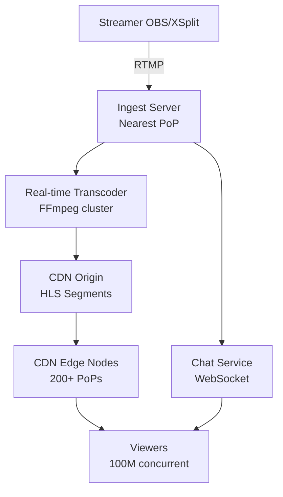

# Design a Live Video Streaming Platform (Twitch)

**Difficulty**: 🔴 Advanced
**Reading Time**: Coming Soon
**Interview Frequency**: High

---

> 🚧 **Full article coming soon.** This stub gives you the essentials to start thinking about this problem.

---

## The Core Problem

Ingesting live video from 10,000 concurrent streamers, transcoding each stream to 4-6 bitrate variants (1080p/720p/480p/360p), and delivering to 100M concurrent viewers with under 3 seconds of glass-to-glass latency requires a fundamentally different architecture from VOD streaming — no pre-processing is possible.

## Functional Requirements

- Streamers can broadcast live video via RTMP or WebRTC
- System transcodes streams to multiple bitrates in real-time
- Viewers receive adaptive HLS/DASH streams
- Support 100k concurrent viewers per channel for major events

## Non-Functional Requirements

| Requirement | Target |
|-------------|--------|
| Ingest latency | < 1 second from streamer to transcoder |
| Glass-to-glass latency | < 3 seconds (HLS), < 1 second (LL-HLS) |
| Availability | 99.95% (4.4 hrs downtime/year) |
| Scale | 10,000 concurrent streamers, 100M viewers |

## Back-of-Envelope Estimates

- **Ingest bandwidth**: 10,000 streamers × 6 Mbps avg = 60 Gbps ingest capacity needed
- **Transcoding cost**: Each stream needs 6 output variants → 10,000 × 6 = 60,000 real-time transcoding jobs
- **CDN delivery**: 100M viewers × 3 Mbps avg quality = 300 Tbps peak CDN delivery bandwidth

## Key Design Decisions

1. **RTMP Ingest then HLS Delivery** — streamers use RTMP (stable, broadcaster software support) to relay servers; these package segments into HLS for viewers with 2-6s segment length trade-off between latency and stability.
2. **Dedicated Ingest PoPs** — deploy ingest servers in 20 geographic regions; each streamer connects to nearest PoP which relays to transcoding cluster, avoiding single-region bottleneck.
3. **CDN Sharding by Stream** — assign each stream to a CDN origin path; popular streams get dedicated CDN cache hierarchy; viewer requests are routed to CDN edge, never hitting origin for live segments.

## High-Level Architecture

## Top Interview Questions for This Problem

| Question | Tests |
|----------|-------|
| How do you handle a streamer's connection dropping mid-stream? | Fault tolerance, reconnect |
| How does adaptive bitrate switching work for viewers on slow connections? | ABR algorithm, segment buffer |
| How would you reduce latency from 6 seconds to under 1 second? | LL-HLS, chunked transfer encoding |

## Related Concepts

- [CDN Architecture for video delivery](../05-infrastructure/cdn)
- [YouTube/Netflix VOD streaming comparison](./youtube-netflix)

---

*📚 Full deep-dive with multiple approaches, trade-off tables, and pseudocode coming soon.*
