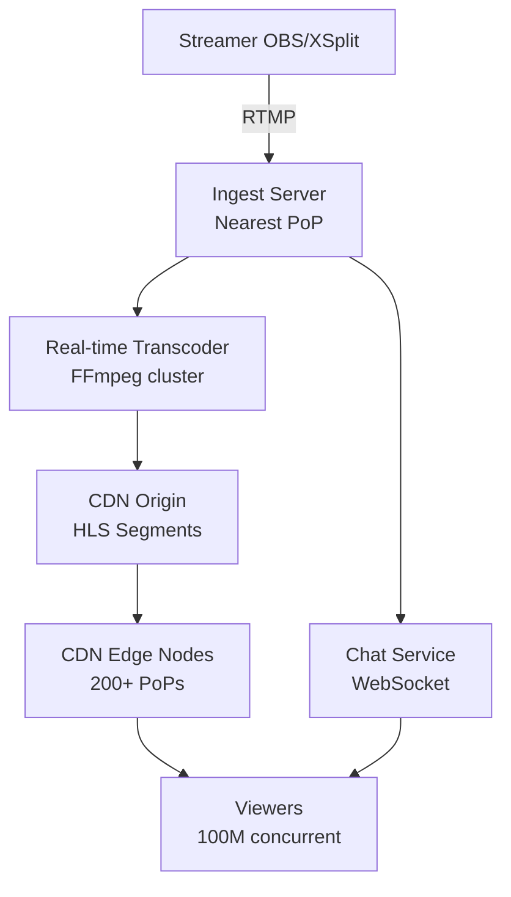
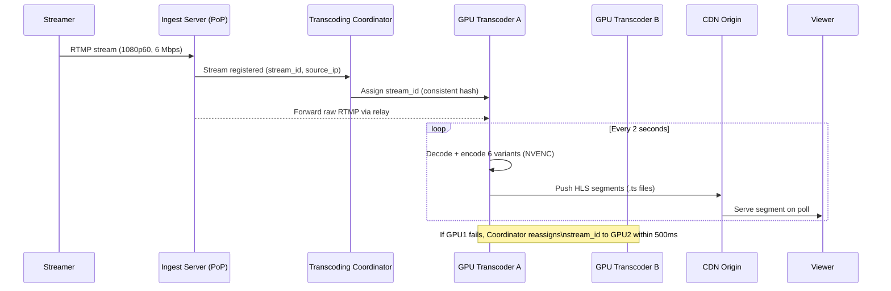
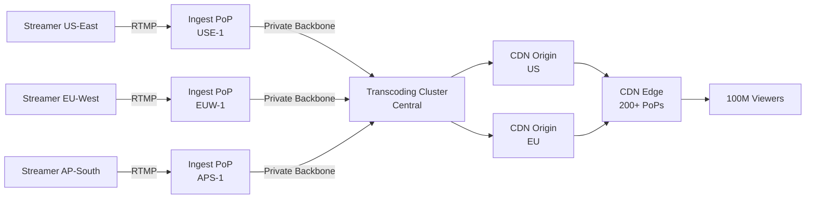
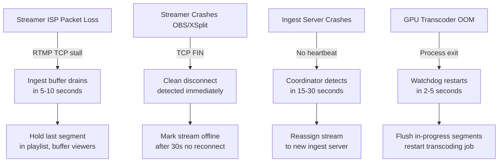

# Design a Live Video Streaming Platform (Twitch)

**Difficulty**: 🔴 Advanced
**Reading Time**: ~25 minutes
**Interview Frequency**: High

---

## The Core Problem

Ingesting live video from 10,000 concurrent streamers, transcoding each stream to 4-6 bitrate variants (1080p/720p/480p/360p), and delivering to 100M concurrent viewers with under 3 seconds of glass-to-glass latency requires a fundamentally different architecture from VOD streaming — no pre-processing is possible.

## Functional Requirements

- Streamers can broadcast live video via RTMP or WebRTC
- System transcodes streams to multiple bitrates in real-time
- Viewers receive adaptive HLS/DASH streams
- Support 100k concurrent viewers per channel for major events

## Non-Functional Requirements

| Requirement | Target |
|-------------|--------|
| Ingest latency | < 1 second from streamer to transcoder |
| Glass-to-glass latency | < 3 seconds (HLS), < 1 second (LL-HLS) |
| Availability | 99.95% (4.4 hrs downtime/year) |
| Scale | 10,000 concurrent streamers, 100M viewers |

## Back-of-Envelope Estimates

- **Ingest bandwidth**: 10,000 streamers × 6 Mbps avg = 60 Gbps ingest capacity needed
- **Transcoding cost**: Each stream needs 6 output variants → 10,000 × 6 = 60,000 real-time transcoding jobs
- **CDN delivery**: 100M viewers × 3 Mbps avg quality = 300 Tbps peak CDN delivery bandwidth

## Key Design Decisions

1. **RTMP Ingest then HLS Delivery** — streamers use RTMP (stable, broadcaster software support) to relay servers; these package segments into HLS for viewers with 2-6s segment length trade-off between latency and stability.
2. **Dedicated Ingest PoPs** — deploy ingest servers in 20 geographic regions; each streamer connects to nearest PoP which relays to transcoding cluster, avoiding single-region bottleneck.
3. **CDN Sharding by Stream** — assign each stream to a CDN origin path; popular streams get dedicated CDN cache hierarchy; viewer requests are routed to CDN edge, never hitting origin for live segments.

## High-Level Architecture



## Top Interview Questions for This Problem

| Question | Tests |
|----------|-------|
| How do you handle a streamer's connection dropping mid-stream? | Fault tolerance, reconnect |
| How does adaptive bitrate switching work for viewers on slow connections? | ABR algorithm, segment buffer |
| How would you reduce latency from 6 seconds to under 1 second? | LL-HLS, chunked transfer encoding |

## Related Concepts

- [CDN Architecture for video delivery](../05-infrastructure/cdn)
- [YouTube/Netflix VOD streaming comparison](./youtube-netflix)

---

## Component Deep Dive 1: Real-Time Transcoding Pipeline

The transcoding pipeline is the most critical and computationally expensive component in live streaming. Unlike VOD platforms where you transcode once and serve many times, live streaming demands that every second of video be transcoded in real-time, across multiple bitrate variants, faster than it arrives.

### How it Works Internally

When a streamer's RTMP feed arrives at an ingest server, the raw stream is an H.264 or H.265 encoded bitstream at a single resolution (typically 1080p60 at 6 Mbps). The transcoding pipeline must simultaneously produce 5-6 output variants:

- **1080p60** at 6 Mbps (passthrough or light re-encode)
- **720p60** at 4.5 Mbps
- **720p30** at 3 Mbps
- **480p30** at 1.5 Mbps
- **360p30** at 0.8 Mbps
- **160p30** at 0.3 Mbps (mobile fallback)

Each variant must be segmented into 2-second HLS chunks and written to the CDN origin simultaneously. The end-to-end transcoding + segmentation must complete in under 1 second for the segment to be available before playback stalls.

### Why Naive Approaches Fail at Scale

A single FFmpeg process on a CPU server can transcode one 1080p stream to multiple outputs in real-time — but at 10,000 concurrent streams, you need 10,000 simultaneous FFmpeg processes. Naive vertical scaling hits limits fast:

- **CPU-only transcoding**: One stream needs ~8-12 CPU cores for real-time 1080p→6-variant output. At 10,000 streams: 80,000–120,000 cores. At $0.05/core-hour on cloud VMs, that's $4–6M/hour just for compute.
- **Single-server assignment**: If one transcoding server fails, all streams assigned to it die simultaneously. Reconnect logic takes 2-5 seconds, causing viewer buffering.
- **No burst capacity**: A gaming tournament with 50 streamers going live simultaneously causes a spike that pre-allocated fleets can't absorb instantly.

The production solution is GPU-accelerated transcoding with NVENC/NVDEC hardware encoders, horizontal auto-scaling, and consistent hashing for stream-to-server assignment.

### Transcoding Architecture



### Transcoding Implementation Options

| Approach | Latency | Throughput | Cost | Trade-off |
|----------|---------|------------|------|-----------|
| CPU-only (x264/x265) | ~800ms/segment | 1 stream per 8 cores | High (compute-heavy) | Best quality, worst cost efficiency at scale |
| GPU hardware encode (NVENC) | ~200ms/segment | 30-60 streams per GPU | Medium (GPU expensive but dense) | 10x throughput vs CPU, slight quality loss at low bitrates |
| ASIC/FPGA transcoding | ~50ms/segment | 100+ streams per chip | Low ongoing, high upfront | Used by Twitch/AWS at massive scale; not cloud-portable |

At 10,000 streams with NVENC: ~200 A10G GPUs needed. At 10,000 streams with CPU: ~80,000 cores. GPU wins decisively at scale.

---

## Component Deep Dive 2: Ingest PoP and Stream Relay

The ingest infrastructure is the entry point of the entire pipeline. Every millisecond added here becomes permanent latency that viewers see. This component must be globally distributed, handle arbitrary streamer locations, and relay streams reliably to the transcoding cluster — all with sub-second handoff time.

### Internal Mechanics

A typical ingest PoP runs a custom RTMP server (or a modified nginx-rtmp or Go-based server) that does three things simultaneously:

1. **Accepts the RTMP TCP connection** from the broadcaster and buffers incoming keyframes
2. **Authenticates the stream key** against the auth service (verified within the first 500ms or the stream is rejected)
3. **Relays the stream** over an internal RTMP or SRT link to the assigned transcoding server

The relay uses the operator's private backbone network (AWS Global Accelerator, Twitch's internal backbone) rather than the public internet — this is critical because the ingest PoP is near the streamer, but the transcoding cluster may be in a different region.

### Scale Behavior at 10x Load

At baseline (10,000 concurrent streamers), each ingest PoP handles ~500-1,000 streams. At 10x (100,000 streamers — e.g., a major gaming event):

- **Connection storms**: RTMP is TCP-based; 100,000 simultaneous TCP connections require a large file descriptor limit and connection pool tuning. Linux kernel needs `net.core.somaxconn` tuned to 65,535+.
- **Relay bandwidth**: If each stream is 6 Mbps, a single PoP handling 1,000 streams needs 6 Gbps of relay bandwidth — requires NIC bonding or 10 GbE+ interfaces per server.
- **Auth service contention**: Auth calls hit a central service; at 10x load, this becomes a bottleneck unless auth tokens are cached locally at the PoP for 30 seconds.



| Design Choice | Option A: Centralized Ingest | Option B: Regional Ingest | Trade-off |
|---------------|------------------------------|--------------------------|-----------|
| Streamer latency | High (200ms+ for remote regions) | Low (< 50ms to nearest PoP) | Regional wins for streamer experience |
| Relay complexity | Simple (no cross-region relay) | Complex (private backbone needed) | Centralized is simpler to operate |
| Failure blast radius | All streamers affected by one outage | Regional outage only | Regional isolation is critical for 99.95% SLA |

---

## Component Deep Dive 3: CDN Segment Delivery and Cache Behavior

Live stream delivery differs fundamentally from VOD CDN delivery: segments are written once, read millions of times within a 10-second window, then become cold. This "sliding window" cache pattern creates unique pressure on CDN design.

### Specific Technical Decisions

**Segment naming**: HLS segments are named with a monotonically increasing sequence number (e.g., `stream_abc123_00001234.ts`). The CDN cannot pre-warm these because sequence numbers are unknown ahead of time. The first viewer request for each segment is always a cache miss — this is the "thundering herd" problem at segment boundaries.

**Cache TTL strategy**: Live segments use a 2-second CDN TTL matching the segment duration. The HLS playlist file (`.m3u8`) has a 1-second TTL since it updates every segment. This causes very high origin request rates: at 100M viewers polling the playlist every 2 seconds, that's 50M requests/second to playlist endpoints — which must be served from CDN edge exclusively, with origin-shield intermediary caches absorbing the remainder.

**Origin shield**: Between the CDN edge nodes and the transcoding origin, a small fleet of "origin shield" servers collapses the fan-in. Instead of 200 CDN PoPs each making independent requests to the transcoding server, they all request through 2-3 shield nodes per region. This reduces origin load by 100x for popular streams.

**Segment availability window**: A live stream retains only the last 3-5 HLS segments in the active playlist (6-10 seconds of content). Segments older than this are deleted from origin. CDN edge caches naturally hold them longer due to TTL, giving slow viewers a few extra seconds to catch up before buffering.

---

## Adaptive Bitrate (ABR) Algorithm — Viewer Side

Adaptive Bitrate Streaming (ABR) is the mechanism that makes live streaming resilient to varying viewer network conditions. The ABR algorithm runs entirely in the video player on the viewer's device (browser, mobile app, smart TV) — not on any server.

### How ABR Works

The HLS manifest returned to the viewer's player is a master playlist listing all available quality variants:

```
#EXTM3U
#EXT-X-STREAM-INF:BANDWIDTH=6000000,RESOLUTION=1920x1080,CODECS="avc1.640028,mp4a.40.2"
https://cdn.example.com/stream_abc/1080p60/playlist.m3u8
#EXT-X-STREAM-INF:BANDWIDTH=3000000,RESOLUTION=1280x720,CODECS="avc1.4d401f,mp4a.40.2"
https://cdn.example.com/stream_abc/720p30/playlist.m3u8
#EXT-X-STREAM-INF:BANDWIDTH=800000,RESOLUTION=640x360,CODECS="avc1.42E01E,mp4a.40.2"
https://cdn.example.com/stream_abc/360p30/playlist.m3u8
```

The player downloads this master playlist once (refreshed every 5-10 seconds for live streams) and then independently downloads variant playlists and segments. The ABR algorithm decides *which variant* to request for each segment based on:

1. **Buffer health**: Current playback buffer depth. If buffer < 10 seconds, the player downgrades quality. If buffer > 30 seconds, it upgrades.
2. **Measured download throughput**: Exponentially weighted moving average of recent segment download speeds, compared to the variant's declared BANDWIDTH.
3. **Player latency mode**: Standard players target 20-30 second buffer depth; low-latency players target 2-5 seconds (at the cost of more frequent quality switches).

### Buffer-Based vs Throughput-Based ABR

| Algorithm | Decision Input | Strengths | Weaknesses |
|-----------|---------------|-----------|------------|
| Throughput-based (BOLA) | Recent download speed estimate | Reacts quickly to bandwidth changes | Unstable — single slow segment causes unnecessary downgrade |
| Buffer-based (MPC) | Buffer occupancy level | Stable, smooth quality changes | Slow to react to sudden bandwidth drops |
| Hybrid (used by Twitch, YouTube) | Both buffer level and throughput trend | Stable yet responsive | Complex to tune; different devices need different coefficients |

At Twitch, the player uses a hybrid ABR algorithm that primarily tracks buffer occupancy but uses throughput estimates to predict 3-5 segment windows ahead. The player avoids upgrading quality if throughput trend is downward, even if current buffer is healthy.

### Low-Latency ABR Challenges

Low-Latency HLS (LL-HLS) targets 2-4 seconds of glass-to-glass latency by using 200ms partial segments ("chunks") instead of 2-second full segments. This creates ABR problems:

- **Download window too small**: 200ms chunks complete so quickly that throughput estimates are noisy. Players need 500ms-1s of data to reliably estimate bandwidth.
- **Reduced buffer depth**: Standard ABR requires 10+ segments of buffer. LL-HLS has only 1-2 seconds of buffer, so any single chunk download slowdown immediately threatens stall.
- **Solution**: LL-HLS players use server-side bandwidth headers (`X-Download-Throughput`) and preload hints (the server tells the player the next segment URL before it's complete) to make ABR decisions with less local data.

---

## Reconnection and Fault Tolerance

A production live streaming platform must handle stream interruptions gracefully — without exposing viewers to black screens or dead stream errors. This is more complex than it appears.

### Failure Scenarios



### Reconnect Protocol

When a streamer drops and reconnects within 30 seconds (the most common case — home network hiccup), the system must:

1. **Maintain the stream URL**: The viewer's player must not need to reload. The CDN URL `https://cdn.example.com/stream_abc/720p30/playlist.m3u8` must remain valid through the reconnect.
2. **Gap fill in HLS manifest**: During the dropout, the HLS playlist should include a `#EXT-X-DISCONTINUITY` tag rather than stalling, so the player knows a gap occurred but can continue playing.
3. **Resume sequence numbers**: After reconnect, the transcoder continues the HLS sequence numbers from where it left off, not from 0. Viewers who stayed buffered will receive the next segment seamlessly.
4. **Transcoder state preservation**: The relay server holds stream state for 30 seconds after disconnect. When the streamer reconnects, the same transcoder is reused if available (preserving encoder state for reference frames).

If the streamer does NOT reconnect within 30 seconds, the stream is marked `ended` in the database, the HLS manifest gets an `#EXT-X-ENDLIST` tag, and viewers see an "offline" state message.

---

## Data Model

### Stream Metadata (PostgreSQL)

```sql
-- Core stream session record
CREATE TABLE streams (
    stream_id        UUID PRIMARY KEY DEFAULT gen_random_uuid(),
    user_id          BIGINT NOT NULL REFERENCES users(user_id),
    stream_key       VARCHAR(64) NOT NULL UNIQUE,
    title            VARCHAR(255),
    status           VARCHAR(20) NOT NULL DEFAULT 'offline',  -- offline | live | ended
    started_at       TIMESTAMPTZ,
    ended_at         TIMESTAMPTZ,
    ingest_pop       VARCHAR(32),         -- e.g. "use1-ingest-07"
    transcoder_id    VARCHAR(32),         -- e.g. "gpu-cluster-use1-12"
    source_resolution VARCHAR(16),        -- e.g. "1920x1080"
    source_fps       SMALLINT,            -- e.g. 60
    source_bitrate_kbps INTEGER,          -- e.g. 6000
    peak_concurrent  INTEGER DEFAULT 0,
    total_views      BIGINT DEFAULT 0,
    created_at       TIMESTAMPTZ NOT NULL DEFAULT now()
);

CREATE INDEX idx_streams_user_id ON streams(user_id);
CREATE INDEX idx_streams_status  ON streams(status) WHERE status = 'live';

-- Per-stream transcoding output variants
CREATE TABLE stream_variants (
    variant_id    SERIAL PRIMARY KEY,
    stream_id     UUID NOT NULL REFERENCES streams(stream_id),
    label         VARCHAR(16) NOT NULL,   -- e.g. "1080p60", "480p30"
    resolution    VARCHAR(16) NOT NULL,   -- e.g. "1920x1080"
    fps           SMALLINT NOT NULL,
    bitrate_kbps  INTEGER NOT NULL,
    codec         VARCHAR(16) DEFAULT 'h264',
    segment_url   TEXT,                   -- CDN prefix for HLS segments
    enabled       BOOLEAN DEFAULT true
);

-- HLS segment tracking (short-lived, high-write table)
CREATE TABLE hls_segments (
    segment_id     BIGSERIAL PRIMARY KEY,
    stream_id      UUID NOT NULL,
    variant_label  VARCHAR(16) NOT NULL,
    sequence_num   INTEGER NOT NULL,
    duration_ms    SMALLINT NOT NULL,     -- typically 2000ms
    cdn_url        TEXT NOT NULL,
    created_at     TIMESTAMPTZ NOT NULL DEFAULT now()
);

-- Partitioned by created_at hour; old partitions dropped after 1 hour
CREATE INDEX idx_hls_segments_stream_seq ON hls_segments(stream_id, sequence_num DESC);

-- Viewer session counters (Redis-first, flushed to here every 30s)
CREATE TABLE stream_viewer_counts (
    stream_id     UUID NOT NULL REFERENCES streams(stream_id),
    recorded_at   TIMESTAMPTZ NOT NULL,
    concurrent    INTEGER NOT NULL,
    PRIMARY KEY (stream_id, recorded_at)
);
```

### Real-Time State (Redis)

```json
// Key: "stream:{stream_id}:state"  TTL: 30s (refreshed by transcoder heartbeat)
{
  "stream_id": "a3f9c2d1-...",
  "status": "live",
  "transcoder_id": "gpu-use1-07",
  "ingest_pop": "use1-ingest-03",
  "current_sequence": 18423,
  "last_segment_at": 1717200000.423,
  "concurrent_viewers": 142000,
  "active_variants": ["1080p60", "720p60", "480p30", "360p30", "160p30"]
}

// Key: "stream:{stream_id}:playlist"  TTL: 3s
// Stores the current HLS master playlist content, updated every 2s
// Avoids transcoder being hit directly for playlist files
```

---

## Scale Bottlenecks

| Traffic Level | Component That Breaks | Symptoms | Mitigation |
|---------------|----------------------|----------|------------|
| 10x baseline (100k streamers) | Transcoding coordinator | Assignment lookup latency spikes; streams fail to start | Shard coordinator by stream_id prefix; pre-scale GPU fleet based on ingest counts |
| 10x baseline | Auth service at ingest | Stream key validation takes 2-5 seconds; streamers see delayed go-live | Cache stream keys at ingest PoP for 30s; use JWT tokens that are self-validating |
| 100x baseline (1M streamers) | CDN origin (HLS playlist writes) | Origin overwhelmed by 1M concurrent segment writes; segment delays cascade | Per-region origin clusters with consistent hashing; write pipeline uses async object store (S3/GCS) with CDN pulling |
| 100x baseline | Private backbone relay bandwidth | Relay packet loss causes transcoder starvation; viewer buffering spikes | Multi-path relay (MPTCP or SRT with redundant paths); reserve 20% backbone headroom |
| 1000x baseline (10M streamers) | Everything | Entire stack needs rearchitecting at this scale | Federated ingest regions with regional transcoding; eliminate central coordinator entirely; per-region independent stacks |

---

## How Twitch Built This

Twitch's live video infrastructure is one of the most publicly documented live streaming systems. Their 2022 engineering post ["Ingesting Live Video Streams at Global Scale"](https://blog.twitch.tv/en/2022/04/26/ingesting-live-video-streams-at-global-scale/) provides specific architectural details.

**Scale**: Twitch handles 7–9 million concurrent viewers on peak nights (e.g., major esports events), with 80,000–100,000 concurrent live streams. Individual channels routinely see 300,000–500,000 simultaneous viewers during major broadcasts.

**Technology choices**:
- **Ingest protocol**: Twitch moved from pure RTMP to a custom protocol called "Jitter Buffer" RTMP that tolerates 5–15% packet loss on the ingest path — critical for streamers on residential connections. They also added SRT support in 2021 for streamers in high-packet-loss regions.
- **Transcoding**: Twitch uses a mix of on-premises GPU servers (NVENC on NVIDIA A-series) and AWS GPU instances. The on-prem fleet handles steady-state load; AWS autoscales for peak events. Their custom transcoding scheduler (written in Go) can spin up a new transcoding job within 800ms of a stream key authenticating.
- **HLS segment length**: Twitch uses 2-second HLS segments for standard streaming, and experimented with Low-Latency HLS (LL-HLS) with 200ms partial segments to bring glass-to-glass latency below 1 second for qualifying streams.

**Non-obvious architectural decision**: Twitch separates "ingest PoP" servers from "relay" servers with a dedicated relay tier. The ingest server does nothing except accept the RTMP connection and forward it via an internal protocol to a relay cluster. The relay cluster handles buffering, segment distribution, and reconnect logic. This separation means ingest servers are stateless and can be replaced instantly, while relay servers hold the "source of truth" for the live stream's current state. This allows near-zero-downtime ingest server replacements during live streams.

**Source**: [Twitch Engineering Blog — Ingesting Live Video Streams at Global Scale (April 2022)](https://blog.twitch.tv/en/2022/04/26/ingesting-live-video-streams-at-global-scale/)

---

## Interview Angle

**What the interviewer is testing:** Your ability to reason about real-time constraints under massive scale — specifically, whether you understand that live streaming is a pipeline problem (each stage must complete in under the segment duration) rather than a storage/retrieval problem like VOD.

**Common mistakes candidates make:**

1. **Treating it like YouTube** — Proposing upload → process → serve patterns that assume pre-processing time. Live streaming gives you zero processing budget before delivery starts. Candidates who say "transcode in the background" miss the fundamental constraint.

2. **Underspecifying the CDN layer** — Saying "use a CDN" without addressing the thundering herd at segment boundaries. Every viewer requests the same new segment within 2 seconds of it being published. Without origin shield or request coalescing, origin gets hammered proportionally to viewer count.

3. **Ignoring reconnect logic** — Real streamers drop connections. A good answer describes what happens when the RTMP connection dies mid-stream: does the stream URL change? Does the HLS manifest stall? Do viewers get a black screen? The answer should cover: keep the stream URL stable, re-assign to same transcoder if reconnect within 30 seconds, hold the last segment in the playlist so viewers buffer gracefully.

**The insight that separates good from great answers:** Recognizing that "latency" in live streaming has three independent budgets — ingest latency (streamer to transcoder, ~500ms), segment latency (transcoding time per segment, ~200ms with NVENC), and delivery latency (segment TTL + player buffer, 2-10s). Reducing glass-to-glass latency below 3 seconds requires optimizing all three independently: LL-HLS reduces delivery latency to ~1-2s, SRT reduces ingest latency on bad networks, and GPU transcoding keeps segment latency under 200ms. You cannot fix end-to-end latency by only tuning one stage.

---

## Common Failure Modes and Production Mitigations

Every component in the pipeline can fail independently. Senior candidates are expected to enumerate failure modes proactively, not wait to be asked.

| Failure | Root Cause | Viewer Impact | Mitigation |
|---------|-----------|---------------|------------|
| Ingest PoP goes offline | Hardware failure, network partition | All streams in that PoP go dark | Active-active ingest: each streamer connects to primary + hot standby PoP; failover in < 5s |
| GPU transcoder OOM | Memory leak in FFmpeg for a long-running 12+ hour stream | Single stream blacks out | Watchdog process (systemd/supervisord) restarts transcoder in < 3s; relay buffers incoming frames during restart |
| CDN origin write failure | Disk full, storage backend slow | New HLS segments not published; viewers stall after buffer drains | Write to two independent object stores (S3 + GCS) in parallel; CDN pulls from whichever responds first |
| Streamer bitrate spike | Streamer overloads upload (e.g. sets 20 Mbps accidentally) | Transcoder falls behind real-time; segment latency grows unboundedly | Ingest server enforces max bitrate cap (8 Mbps); excess bits dropped with a warning log; transcoder stays on schedule |
| HLS playlist staleness | Transcoder crashes after writing segments but before updating playlist | Viewers get a playlist that never advances; buffer empties | Playlist has `#EXT-X-TARGETDURATION` header; player detects stall if playlist doesn't update in 3× target duration and shows error |
| Chat-stream desync | Chat messages arrive before corresponding video frame due to CDN latency | "Chat is spoiling the stream" — viewers see reactions before the action | Chat server delays message delivery to match estimated stream latency; configurable per-channel latency offset (default: 5-second delay) |

---

## Key Numbers to Remember

| Metric | Value | Context |
|--------|-------|---------|
| RTMP ingest bitrate | 6 Mbps avg per stream | 1080p60 streamer with good upload |
| Total ingest bandwidth | 60 Gbps | 10,000 concurrent streamers at 6 Mbps each |
| CDN delivery bandwidth | 300 Tbps | 100M viewers at 3 Mbps avg quality |
| HLS segment duration | 2 seconds (standard), 200ms (LL-HLS) | Standard trades latency for stability |
| Glass-to-glass latency | 3–8s (HLS), <1s (LL-HLS) | HLS due to 2s segments × 2-4 buffer depth |
| NVENC throughput | 30–60 streams per A10G GPU | Each stream = 6 output variants simultaneously |
| CPU transcoding cost | 8-12 cores per 1080p stream | Why GPU is mandatory at 10k+ streams |
| Transcoder assignment time | < 800ms | Time from stream key auth to first segment available |
| CDN playlist request rate | 50M req/sec | 100M viewers polling 2s playlists every 2s |
| Segment cache window | 3–5 segments (6–10 seconds) | Only recent segments in live manifest |

---

## Low-Latency HLS vs Standard HLS: Protocol Comparison

Understanding the protocol-level differences between standard HLS and LL-HLS is frequently tested in senior interviews because it exposes whether you understand *why* latency exists, not just *that* it exists.

### Standard HLS Latency Budget Breakdown

With 2-second segments and a 3-segment player buffer:

```
Streamer captures frame
  → 0–2000ms: Current segment fills up at encoder
  → +200ms:   Segment written to CDN origin
  → +100ms:   CDN edge caches segment
  → +2000ms:  Player waits for next segment to confirm playlist update
  → +0–2000ms: Player buffer holds 3 segments (6s) before playing current segment
─────────────────────────────────────────────────────────────
Total glass-to-glass: 6–10 seconds
```

### LL-HLS Latency Budget Breakdown

With 200ms partial segments (chunks) and 1-segment player buffer:

```
Streamer captures frame
  → 0–200ms:  First partial segment chunk is ready
  → +50ms:    Server sends chunk via HTTP/2 push before complete
  → +200ms:   Player holds 1 full segment buffer (200ms)
─────────────────────────────────────────────────────────────
Total glass-to-glass: ~1–2 seconds
```

### Protocol Feature Comparison

| Feature | Standard HLS | Low-Latency HLS | WebRTC (sub-second) |
|---------|-------------|-----------------|---------------------|
| Segment size | 2–6 seconds | 200ms partial chunks | N/A (real-time) |
| Glass-to-glass latency | 6–30 seconds | 1–3 seconds | 100–500ms |
| CDN compatibility | Universal | Requires HTTP/2 + CDN support | Requires SFU, no CDN |
| Viewer scale | 100M+ (CDN) | 100M+ (CDN) | ~10,000 (SFU limits) |
| ABR support | Full | Full (with preload hints) | Limited |
| Best for | General streaming | Esports, sports betting | Interactive video, auctions |

The key trade-off: WebRTC delivers sub-second latency but doesn't scale through CDN infrastructure — you need a Selective Forwarding Unit (SFU) mesh that has a hard ceiling around 10,000 concurrent viewers per channel before needing complex fan-out. Twitch uses LL-HLS for its low-latency mode rather than WebRTC, accepting 1-2 second latency to maintain 100M-scale CDN delivery.

---

## Viewer Count and Analytics Pipeline

Counting concurrent viewers for a live stream sounds simple. At 100M concurrent viewers it is a distributed systems problem of its own.

### Why Naive Counting Fails

The obvious approach — increment a Redis counter when a viewer joins, decrement when they leave — breaks down because:

- **Players don't send explicit "leave" events.** A viewer closing the browser tab causes a TCP close, but mobile apps, smart TVs, and embedded players frequently crash or lose connection silently. A viewer who walked away from their TV is indistinguishable from an active viewer unless you implement heartbeats.
- **Heartbeat storm**: If 100M viewers send a heartbeat every 30 seconds, that's ~3.3M heartbeat events per second — a significant write load.
- **Counter precision vs cost**: Exact counts require distributed coordination. Approximate counts (HyperLogLog) are cheaper but unsuitable for billing or revenue-sharing.

### Production Approach: Sliding-Window Heartbeats

```
Viewer Player → POST /heartbeat {stream_id, session_id, quality, buffer_health}
  → Every 30 seconds while playing

Backend:
  ZADD stream:{stream_id}:viewers {timestamp} {session_id}
  ZREMRANGEBYSCORE stream:{stream_id}:viewers 0 (now - 90s)
  ZCARD stream:{stream_id}:viewers  → current viewer count

Flush to PostgreSQL every 60s for historical analytics
```

The Redis sorted set approach gives an approximate real-time count (viewers who sent a heartbeat in the last 90 seconds) that handles silent disconnects gracefully. A viewer who closes the tab will fall out of the count within 90 seconds — acceptable for live stream dashboards.

At 100M viewers: each ZADD is O(log N), Redis handles ~500K ops/sec per instance, so 3.3M heartbeats/sec needs 7-8 Redis shards partitioned by stream_id. Popular streams (500K+ viewers) get dedicated Redis instances.

---

## 📚 Resources & References

| Resource | Type | What You'll Learn |
|----------|------|------------------|
| [System Design Interview Vol 2 — Alex Xu](https://www.amazon.com/System-Design-Interview-Insiders-Guide/dp/1736049119) | 📚 Book | Chapter on designing a video streaming service like YouTube |
| [ByteByteGo — Design a Video Streaming Service](https://www.youtube.com/@ByteByteGo) | 📺 YouTube | Search "video streaming design" — transcoding, CDN, adaptive bitrate |
| [Netflix Technology Blog: Adaptive Streaming](https://netflixtechblog.com/streaming-quality-at-netflix-c7d8a4960bec) | 📖 Blog | How Netflix implements ABR streaming and quality optimization |
| [Twitch Engineering: Live Video Infrastructure](https://blog.twitch.tv/en/2022/04/26/twitch-engineering-an-introduction-and-overview/) | 📖 Blog | Ultra-low latency live streaming architecture at Twitch |
| [High Scalability: Video Platform Architectures](http://highscalability.com) | 📖 Blog | Search "video streaming" — production case studies |
