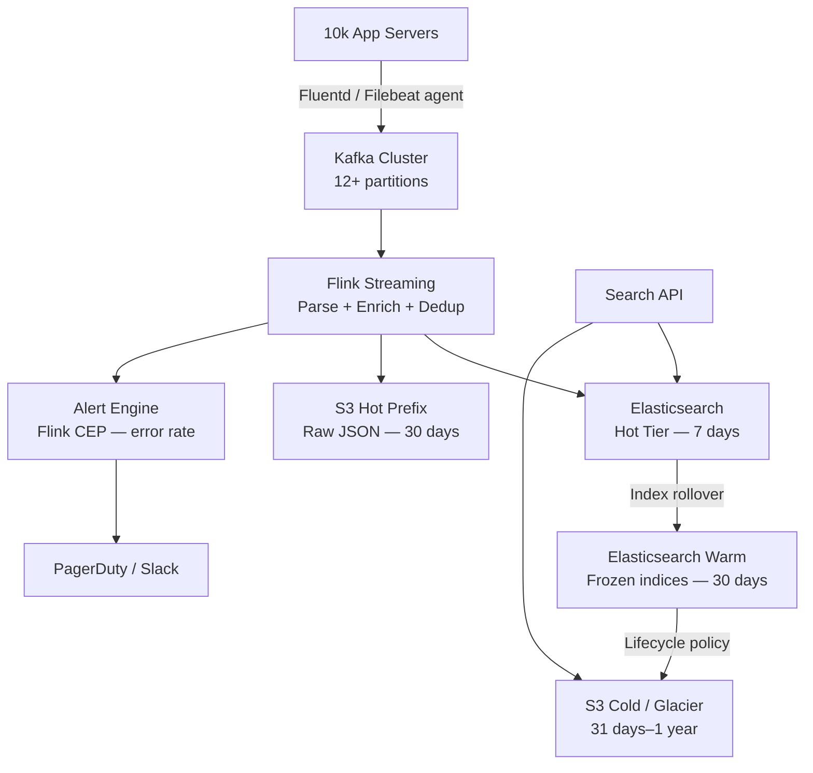

# Design a Log Collection & Analysis System

**Difficulty**: 🔴 Advanced | **Codemania #40**
**Reading Time**: ~12 min
**Interview Frequency**: High

---

## The Core Problem

Collecting 10 TB/day of logs from 10,000 servers, indexing them for sub-second full-text search, and retaining data for 1 year with cost-efficient tiered storage. The challenge spans three domains: reliable agent-based collection, real-time enrichment and indexing, and lifecycle management across hot/warm/cold tiers.

---

## Functional Requirements

- Collect structured and unstructured logs from 10,000 servers (app logs, access logs, system logs)
- Index logs for full-text search with < 5s ingest-to-searchable latency
- Correlate logs with distributed trace IDs (OpenTelemetry)
- Alert within 60 seconds when error rate exceeds threshold
- Retain logs for 1 year; hot for 7 days, warm for 30 days, cold for remainder

## Non-Functional Requirements

| Requirement | Target |
|-------------|--------|
| Ingest throughput | 10 TB/day (~120 MB/sec sustained) |
| Search latency | < 2s for time-range queries over 7-day window |
| Durability | No log loss; at-least-once delivery |
| Retention | 1 year total; tiered hot/warm/cold |
| Alert latency | Error spike detected and alerted within 60s |

---

## Back-of-Envelope Estimates

- **Log volume**: 10 TB/day ÷ 86,400s = ~120 MB/sec raw ingest
- **Servers**: 10,000 servers × 1 GB/day avg = 10 TB/day
- **Kafka throughput**: 120 MB/sec requires ~12 partitions at 10 MB/sec each
- **Elasticsearch hot tier**: 7 days × 10 TB = 70 TB (with 1.5x index overhead = 105 TB)
- **S3 cold storage**: 1 year × 10 TB = 3.65 PB compressed (assume 3:1 ratio → 1.2 PB)
- **Search index size**: 70 TB raw × 1.5x overhead = 105 TB for 7-day hot window

---

## High-Level Architecture



---

## Key Design Decisions

### 1. Push vs Pull Log Collection

| Dimension | Push (Agent → Kafka) | Pull (Central Collector polls) |
|-----------|---------------------|-------------------------------|
| Latency | Low — events pushed immediately | Higher — poll interval adds delay |
| Server load | Low — agent buffers locally | Higher — collector must connect to each server |
| Reliability | Agent retries on disconnect | Collector must track last-read offset |
| Scale | Horizontal — add Kafka partitions | Bottleneck at central collector |

**Decision**: Push model with Fluentd/Filebeat agents. Agents tail log files, buffer to disk on Kafka unavailability, and retry with exponential backoff. This decouples collection from availability of downstream systems.

### 2. Schema-on-Write vs Schema-on-Read

| Approach | Schema-on-Write (structured) | Schema-on-Read (raw) |
|----------|------------------------------|----------------------|
| Ingest speed | Slower — must parse at write time | Faster — store raw bytes |
| Query speed | Fast — pre-parsed fields | Slower — parse at query time |
| Schema evolution | Requires migration | Flexible — new fields free |
| Storage | Smaller — efficient encoding | Larger — raw text |

**Decision**: Hybrid. Flink parses mandatory fields (timestamp, level, service, trace_id) at write time into Elasticsearch for fast queries. Raw log line is also stored for ad-hoc grep queries against S3.

### 3. Hot/Cold Tiering Strategy

- **Hot (0–7 days)**: Elasticsearch with SSD-backed data nodes. Full-text search, real-time alerting.
- **Warm (8–30 days)**: Elasticsearch frozen indices on HDD. Search possible but slower (indices loaded on demand).
- **Cold (31 days–1 year)**: S3 + Parquet/ORC columnar format. Queried via Athena for compliance/audit. Lifecycle rule moves objects to Glacier Instant Retrieval after 90 days.

---

## Log Correlation with Trace IDs

Every log line must carry a `trace_id` and `span_id` field (W3C TraceContext format). The Flink enrichment layer:
1. Parses `trace_id` from log line using regex
2. Adds `service_name` and `environment` from server metadata sidecar
3. Stores correlation index: `trace_id → [log_ids]` in Redis with 48h TTL

This allows "show me all logs for trace X" queries that reconstruct the full request lifecycle across 100 microservices.

---

## Alerting on Error Rate Spikes

Flink CEP (Complex Event Processing) pattern:

```
DEFINE ErrorWindow AS:
  COUNT(level = "ERROR") OVER 60 seconds
  GROUP BY service_name

TRIGGER ALERT IF:
  error_count > baseline_count * 3.0   -- 3x spike
  OR error_count > 500 per minute      -- absolute threshold
```

Baseline is computed as a rolling 7-day median for the same time-of-day window (catches "always noisy at 9am" false positives).

---

## Top Interview Questions for This Problem

| Question | Tests |
|----------|-------|
| How do you handle a log agent that goes offline for 2 hours? | Buffer-to-disk, Kafka offset management |
| Why not write logs directly to Elasticsearch — why Kafka in the middle? | Backpressure, durability, fan-out to multiple consumers |
| How would you reduce Elasticsearch storage costs by 10x? | Tiering, compression, schema optimization, HLL for counts |
| How do you search logs from 6 months ago without loading them into Elasticsearch? | Athena + S3 Parquet, partition pruning by date/service |
| What happens when the Flink job restarts mid-stream? | Checkpointing, exactly-once with Kafka consumer offsets |

---

## Common Mistakes

1. **Shipping raw unstructured logs**: Without structured fields, every query requires full-text scan. Enforce structured JSON logging at the application layer.
2. **Single Elasticsearch cluster for all tiers**: Hot and cold data compete for resources. Use index lifecycle management (ILM) with separate node pools.
3. **No agent-side buffering**: If Kafka is unavailable, agents that drop logs cause gaps. Always configure agent-side disk buffer (e.g., Fluentd `buffer_type file`).

---

## Related Concepts

- [Message Queue Basics](../../04-messaging/concepts/message-queue-basics) — Kafka as durable ingest buffer
- [Caching Fundamentals](../../02-caching/concepts/caching-fundamentals) — Redis for trace correlation index

---

## 📚 Resources & References

| Resource | Type | What You'll Learn |
|----------|------|------------------|
| [ByteByteGo — Design a Log Collection System](https://www.youtube.com/@ByteByteGo) | 📺 YouTube | End-to-end log pipeline architecture |
| [Elastic Stack Architecture](https://www.elastic.co/guide/en/elasticsearch/reference/current/elasticsearch-intro.html) | 📚 Book | Beats → Logstash → ES → Kibana stack |
| [Grafana Loki — Prometheus for Logs](https://grafana.com/blog/2018/12/12/loki-prometheus-inspired-open-source-logging-for-cloud-natives/) | 📖 Blog | Label-based log aggregation, cost trade-offs |
| [Netflix Edgar — Observability](https://netflixtechblog.com/edgar-solving-mysteries-faster-with-observability-e1a76302c71f) | 📖 Blog | How Netflix correlates logs, traces, metrics |
| [High Scalability — Log Analysis](https://highscalability.com) | 📖 Blog | Architectural patterns for log pipelines at scale |
