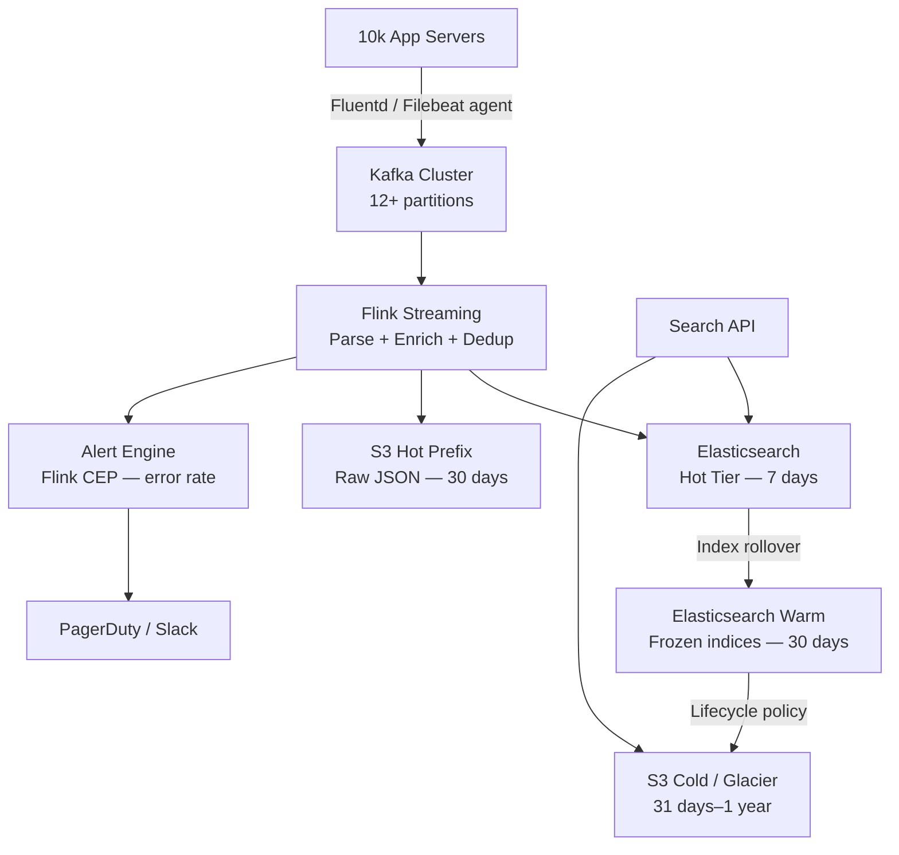
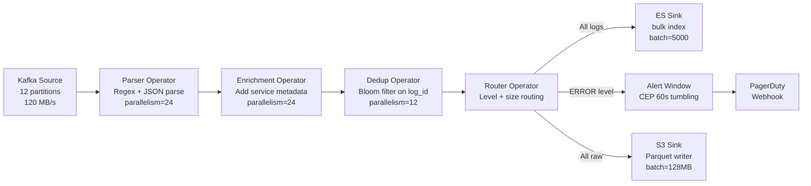

# Design a Log Collection & Analysis System

**Difficulty**: 🔴 Advanced | **Codemania #40**
**Reading Time**: ~12 min
**Interview Frequency**: High

---

## The Core Problem

Collecting 10 TB/day of logs from 10,000 servers, indexing them for sub-second full-text search, and retaining data for 1 year with cost-efficient tiered storage. The challenge spans three domains: reliable agent-based collection, real-time enrichment and indexing, and lifecycle management across hot/warm/cold tiers.

---

## Functional Requirements

- Collect structured and unstructured logs from 10,000 servers (app logs, access logs, system logs)
- Index logs for full-text search with < 5s ingest-to-searchable latency
- Correlate logs with distributed trace IDs (OpenTelemetry)
- Alert within 60 seconds when error rate exceeds threshold
- Retain logs for 1 year; hot for 7 days, warm for 30 days, cold for remainder

## Non-Functional Requirements

| Requirement | Target |
|-------------|--------|
| Ingest throughput | 10 TB/day (~120 MB/sec sustained) |
| Search latency | < 2s for time-range queries over 7-day window |
| Durability | No log loss; at-least-once delivery |
| Retention | 1 year total; tiered hot/warm/cold |
| Alert latency | Error spike detected and alerted within 60s |

---

## Back-of-Envelope Estimates

- **Log volume**: 10 TB/day ÷ 86,400s = ~120 MB/sec raw ingest
- **Servers**: 10,000 servers × 1 GB/day avg = 10 TB/day
- **Kafka throughput**: 120 MB/sec requires ~12 partitions at 10 MB/sec each
- **Elasticsearch hot tier**: 7 days × 10 TB = 70 TB (with 1.5x index overhead = 105 TB)
- **S3 cold storage**: 1 year × 10 TB = 3.65 PB compressed (assume 3:1 ratio → 1.2 PB)
- **Search index size**: 70 TB raw × 1.5x overhead = 105 TB for 7-day hot window

---

## High-Level Architecture



---

## Key Design Decisions

### 1. Push vs Pull Log Collection

| Dimension | Push (Agent → Kafka) | Pull (Central Collector polls) |
|-----------|---------------------|-------------------------------|
| Latency | Low — events pushed immediately | Higher — poll interval adds delay |
| Server load | Low — agent buffers locally | Higher — collector must connect to each server |
| Reliability | Agent retries on disconnect | Collector must track last-read offset |
| Scale | Horizontal — add Kafka partitions | Bottleneck at central collector |

**Decision**: Push model with Fluentd/Filebeat agents. Agents tail log files, buffer to disk on Kafka unavailability, and retry with exponential backoff. This decouples collection from availability of downstream systems.

### 2. Schema-on-Write vs Schema-on-Read

| Approach | Schema-on-Write (structured) | Schema-on-Read (raw) |
|----------|------------------------------|----------------------|
| Ingest speed | Slower — must parse at write time | Faster — store raw bytes |
| Query speed | Fast — pre-parsed fields | Slower — parse at query time |
| Schema evolution | Requires migration | Flexible — new fields free |
| Storage | Smaller — efficient encoding | Larger — raw text |

**Decision**: Hybrid. Flink parses mandatory fields (timestamp, level, service, trace_id) at write time into Elasticsearch for fast queries. Raw log line is also stored for ad-hoc grep queries against S3.

### 3. Hot/Cold Tiering Strategy

- **Hot (0–7 days)**: Elasticsearch with SSD-backed data nodes. Full-text search, real-time alerting.
- **Warm (8–30 days)**: Elasticsearch frozen indices on HDD. Search possible but slower (indices loaded on demand).
- **Cold (31 days–1 year)**: S3 + Parquet/ORC columnar format. Queried via Athena for compliance/audit. Lifecycle rule moves objects to Glacier Instant Retrieval after 90 days.

---

## Log Correlation with Trace IDs

Every log line must carry a `trace_id` and `span_id` field (W3C TraceContext format). The Flink enrichment layer:
1. Parses `trace_id` from log line using regex
2. Adds `service_name` and `environment` from server metadata sidecar
3. Stores correlation index: `trace_id → [log_ids]` in Redis with 48h TTL

This allows "show me all logs for trace X" queries that reconstruct the full request lifecycle across 100 microservices.

---

## Alerting on Error Rate Spikes

Flink CEP (Complex Event Processing) pattern:

```
DEFINE ErrorWindow AS:
  COUNT(level = "ERROR") OVER 60 seconds
  GROUP BY service_name

TRIGGER ALERT IF:
  error_count > baseline_count * 3.0   -- 3x spike
  OR error_count > 500 per minute      -- absolute threshold
```

Baseline is computed as a rolling 7-day median for the same time-of-day window (catches "always noisy at 9am" false positives).

---

## Top Interview Questions for This Problem

| Question | Tests |
|----------|-------|
| How do you handle a log agent that goes offline for 2 hours? | Buffer-to-disk, Kafka offset management |
| Why not write logs directly to Elasticsearch — why Kafka in the middle? | Backpressure, durability, fan-out to multiple consumers |
| How would you reduce Elasticsearch storage costs by 10x? | Tiering, compression, schema optimization, HLL for counts |
| How do you search logs from 6 months ago without loading them into Elasticsearch? | Athena + S3 Parquet, partition pruning by date/service |
| What happens when the Flink job restarts mid-stream? | Checkpointing, exactly-once with Kafka consumer offsets |

---

## Common Mistakes

1. **Shipping raw unstructured logs**: Without structured fields, every query requires full-text scan. Enforce structured JSON logging at the application layer.
2. **Single Elasticsearch cluster for all tiers**: Hot and cold data compete for resources. Use index lifecycle management (ILM) with separate node pools.
3. **No agent-side buffering**: If Kafka is unavailable, agents that drop logs cause gaps. Always configure agent-side disk buffer (e.g., Fluentd `buffer_type file`).

---

## Component Deep Dive 1: Kafka as the Ingest Buffer

Kafka sits between the agents on 10,000 servers and every downstream consumer. Understanding why it is the architectural linchpin — and why simpler alternatives fail — is central to this interview question.

### How Kafka Works Internally

Kafka stores messages in an ordered, append-only commit log partitioned across brokers. Producers (Fluentd/Filebeat agents) write to a specific partition based on a key (typically `service_name` hash). Consumers (Flink jobs) maintain their own read offset per partition, stored in `__consumer_offsets`. This separation of read position from the data itself means:

1. **Multiple consumers** (Flink alert job, Flink indexing job, S3 archiver) can each consume the full stream independently without interfering.
2. **Replay is free**: if the Elasticsearch indexer crashes, it simply resets its offset to the last checkpoint and re-processes. No messages are lost.
3. **Backpressure isolation**: if Elasticsearch is slow, Kafka absorbs the backlog. Without Kafka, a slow ES would block the agents and cause log loss on servers.

### Why Naive Approaches Fail at 120 MB/sec

**Direct-to-Elasticsearch write**: At 10,000 agents each sending bursts, ES ingest nodes become the bottleneck. A single ES node ingests roughly 50–80 MB/sec. More critically, ES does not handle fan-out — you cannot replay data to a second consumer after the fact.

**Direct-to-S3 write from agents**: S3 PUT latency is 50–200 ms. At 10,000 agents sending hundreds of events per second, the PUT API throttle (3,500 PUTs/sec per prefix) causes dropped writes. Additionally, S3 files cannot be read until the write completes, so small-file proliferation (millions of 1 KB files) destroys Athena query performance.

### Kafka Partition Sizing

```mermaid
graph LR
    subgraph Agents
        A1[Server 1\nFluentd] 
        A2[Server 2\nFluentd]
        AN[...Server N\nFluentd]
    end
    subgraph Kafka Cluster
        P0[Partition 0\nBroker 1]
        P1[Partition 1\nBroker 2]
        P2[Partition 2\nBroker 3]
        PN[...Partition N]
    end
    subgraph Consumers
        F1[Flink Job 1\nES Indexer]
        F2[Flink Job 2\nAlerting]
        F3[S3 Archiver]
    end
    A1 -->|hash(service_name)| P0
    A2 -->|hash(service_name)| P1
    AN -->|hash(service_name)| PN
    P0 --> F1
    P1 --> F1
    P0 --> F2
    P1 --> F2
    P0 --> F3
    P1 --> F3
```

Each Kafka partition sustains ~10 MB/sec reliably. At 120 MB/sec sustained, you need at minimum 12 partitions. Production deployments add 50% headroom: 18 partitions across 6 brokers (3 partitions per broker) with replication factor 3.

### Kafka Implementation Options

| Approach | Latency | Throughput | Trade-off |
|----------|---------|------------|-----------|
| Apache Kafka (self-managed) | 2–10 ms p99 | 500 MB/sec per cluster | Full control; operational burden of ZooKeeper/KRaft, broker tuning |
| AWS MSK (managed Kafka) | 5–15 ms p99 | 500 MB/sec per cluster | Reduced ops; higher cost; limited broker tuning (no custom JVM flags) |
| AWS Kinesis Data Streams | 70–200 ms p99 | 1 MB/sec per shard (120 shards needed) | Serverless; expensive at this scale; 7-day retention cap |

**Decision at this scale**: Self-managed Kafka on EC2 i3en instances (NVMe SSD) or AWS MSK with 6 brokers. Kinesis becomes prohibitively expensive above 50 MB/sec sustained ingest.

---

## Component Deep Dive 2: Flink Streaming — Parse, Enrich, Deduplicate

Apache Flink is the real-time processing layer that transforms raw log bytes from Kafka into structured, enriched events and routes them to the appropriate sinks. At 120 MB/sec, the Flink job must process without introducing more than 1–2 seconds of latency end-to-end.

### How the Flink Pipeline Works Internally

A Flink Streaming job runs as a directed acyclic graph (DAG) of operators:



**Parallelism at 120 MB/sec**: Each Parser operator processes ~5 MB/sec. To handle 120 MB/sec, you need parallelism of 24 for the parser stage. Enrichment is CPU-light (hashtable lookup), so parallelism can remain at 24. Dedup with a Bloom filter is stateful — keep at 12 to avoid excessive network shuffling.

### What Happens at 10x Load (1.2 GB/sec)

At 10x load (e.g., incident causing log explosion), the bottleneck shifts from Kafka ingest to the ES Sink. Elasticsearch bulk indexing saturates at roughly 200–300 MB/sec per cluster with default configuration. The S3 sink can absorb 1.2 GB/sec without issues (S3 throughput scales horizontally). Options at 10x:

1. **Throttle at the agent**: Configure Fluentd `rate_limit_per_second 1000` per agent. Drops least-important logs (DEBUG level) during overload.
2. **Dynamic scaling**: Flink on Kubernetes with KEDA autoscaler triggers additional task manager pods when consumer lag exceeds 60 seconds.
3. **ES circuit breaker**: Route overflow directly to S3 Hot prefix; backfill ES from S3 once load normalizes. Accept < 5s latency SLA is temporarily breached.

### Flink Checkpointing for Exactly-Once Semantics

Flink saves checkpoints to S3 every 30 seconds. If the job crashes, it restarts from the last checkpoint and re-reads Kafka from the saved offset. Combined with Kafka's 7-day retention, this means up to 7 days of replay is available. The ES sink uses Flink's `TwoPhaseCommitSinkFunction` to only commit documents after a successful Kafka offset commit — preventing duplicate documents in ES.

---

## Component Deep Dive 3: Tiered Storage — Hot, Warm, Cold

The three-tier storage model is the primary cost lever in this system. Without tiering, storing 10 TB/day × 365 days = 3.65 PB in Elasticsearch would cost approximately $18M/year in SSD-backed AWS EBS. With tiering, the same retention costs under $200k/year.

### Tier Configuration

**Hot tier (0–7 days)**: Elasticsearch data nodes on SSD (`gp3` EBS). Each index covers one day of logs. An index template enforces:
- 1 primary shard per 25 GB of data (approximately 4 shards per day at 70–100 GB compressed)
- 1 replica for durability
- `index.codec: best_compression` to reduce on-disk size by ~40%

**Warm tier (8–30 days)**: Elasticsearch frozen indices on HDD (`st1` EBS). Index Lifecycle Management (ILM) moves indices from hot to warm after 7 days by:
1. Merging shards to 1 per index (force-merge reduces segment count, speeding up searches)
2. Removing replicas (warm data is readable from S3 backup if a node fails)
3. Relocating to warm-tier nodes using shard allocation filtering

**Cold tier (31 days–1 year)**: S3 Standard for the first 90 days in cold, then S3 Glacier Instant Retrieval. Format is Parquet with Snappy compression (3:1 ratio), partitioned by `year=YYYY/month=MM/day=DD/service=name`. This partition scheme allows AWS Athena to prune 99%+ of data for typical queries ("show errors for service X in March").

### ILM Policy (abbreviated)

```json
{
  "policy": {
    "phases": {
      "hot":  { "actions": { "rollover": { "max_age": "1d", "max_size": "50gb" } } },
      "warm": { "min_age": "7d",  "actions": { "forcemerge": { "max_num_segments": 1 }, "allocate": { "require": { "tier": "warm" } } } },
      "cold": { "min_age": "30d", "actions": { "delete": {} } }
    }
  }
}
```

The S3 archiver (separate Flink sink) writes Parquet files concurrently with ES indexing — cold storage is not derived from ES but written in parallel from Kafka. This ensures cold data is available even if ILM policy removes the ES index.

---

## Data Model

### Elasticsearch Document (Hot Tier)

```json
{
  "_index": "logs-2026-05-31",
  "_id": "sha256(server_id + timestamp_ns + log_line)",
  "_source": {
    "timestamp":    "2026-05-31T14:22:01.432Z",
    "timestamp_ns": 1748697721432000000,
    "level":        "ERROR",
    "service_name": "payment-service",
    "host":         "prod-server-4821",
    "trace_id":     "4bf92f3577b34da6a3ce929d0e0e4736",
    "span_id":      "00f067aa0ba902b7",
    "message":      "Payment gateway timeout after 5000ms",
    "http_method":  "POST",
    "http_path":    "/v1/charge",
    "http_status":  504,
    "duration_ms":  5001,
    "user_id":      "usr_9f3k2m",
    "raw_line":     "2026-05-31T14:22:01.432Z ERROR [payment-service] Payment gateway..."
  }
}
```

### Elasticsearch Index Mappings (key fields)

```json
{
  "mappings": {
    "properties": {
      "timestamp":    { "type": "date", "format": "strict_date_optional_time" },
      "timestamp_ns": { "type": "long" },
      "level":        { "type": "keyword" },
      "service_name": { "type": "keyword" },
      "host":         { "type": "keyword" },
      "trace_id":     { "type": "keyword", "index": true },
      "span_id":      { "type": "keyword", "index": true },
      "message":      { "type": "text",    "analyzer": "standard" },
      "http_status":  { "type": "short" },
      "duration_ms":  { "type": "integer" },
      "user_id":      { "type": "keyword" },
      "raw_line":     { "type": "text",    "index": false }
    }
  }
}
```

Note: `raw_line` has `"index": false` — it is stored for retrieval but not indexed for search. This reduces the index size by ~20% while preserving the ability to return the original log line in results.

### S3 Parquet Schema (Cold Tier)

```sql
-- Athena table DDL
CREATE EXTERNAL TABLE logs_cold (
    timestamp_ns   BIGINT        COMMENT 'Unix nanoseconds for microsecond-precision sorting',
    level          VARCHAR(10)   COMMENT 'DEBUG|INFO|WARN|ERROR|FATAL',
    service_name   VARCHAR(128),
    host           VARCHAR(128),
    trace_id       CHAR(32)      COMMENT 'W3C TraceContext 128-bit hex',
    span_id        CHAR(16),
    message        VARCHAR(4096),
    http_status    SMALLINT,
    duration_ms    INT,
    user_id        VARCHAR(64),
    raw_line       VARCHAR(8192)
)
PARTITIONED BY (
    year    VARCHAR(4),
    month   VARCHAR(2),
    day     VARCHAR(2),
    service VARCHAR(128)
)
STORED AS PARQUET
LOCATION 's3://logs-cold-bucket/logs/'
TBLPROPERTIES ('parquet.compress'='SNAPPY');
```

**Partition pruning example**: Query for payment-service errors in May 2026 scans only `year=2026/month=05/service=payment-service` — roughly 31 files instead of 365 × number-of-services files.

### Kafka Message Schema

```json
{
  "schema_version": 2,
  "server_id":      "prod-server-4821",
  "agent_id":       "fluentd-v1.14.2",
  "collected_at_ns": 1748697721450000000,
  "log_line":       "2026-05-31T14:22:01.432Z ERROR [payment-service] Payment gateway...",
  "source_file":    "/var/log/app/payment-service.log",
  "tags":           { "env": "production", "region": "us-east-1", "datacenter": "dc1" }
}
```

`schema_version` allows the Flink parser to apply version-specific parsing rules as log formats evolve without a big-bang migration.

---

## Scale Bottlenecks

| Traffic Level | Component That Breaks | Symptoms | Mitigation |
|---------------|----------------------|----------|------------|
| 10x baseline (1.2 GB/sec) | Elasticsearch ingest nodes | Bulk indexing queue depth > 10k; indexing latency > 30s; JVM GC pauses | Add ES ingest nodes; enable adaptive replica selection; drop DEBUG logs at agent |
| 10x baseline | Flink task manager heap | OutOfMemoryError in enrichment operator at 10M events/sec; checkpoint failures | Increase TM heap to 16 GB; use RocksDB state backend instead of in-memory for dedup Bloom filter |
| 100x baseline (12 GB/sec) | Kafka broker disk I/O | Producer acks timeout; consumer lag grows unbounded; broker CPU > 90% | Partition count from 18 to 180; 60-broker cluster; tiered storage (Kafka 3.6+ remote log storage to S3) |
| 100x baseline | Flink parallelism ceiling | Kafka consumer lag grows; alert latency exceeds 60s SLA | Flink on Kubernetes with KEDA; auto-scale from 24 to 240 task slots based on consumer lag |
| 1000x baseline (120 GB/sec) | Entire architecture | Kafka write throughput exceeds single cluster; S3 PUT throttle hits partition limit | Multi-region Kafka (MirrorMaker2 replication); separate Kafka clusters per region; S3 prefix sharding (128 prefixes × 3,500 PUT/sec = 448k PUT/sec) |

---

## How Datadog Built This

Datadog ingests over **100 TB of logs per day** from millions of customer agents, making it one of the largest log collection systems in production.

**Technology choices**: Datadog built a custom agent (the Datadog Agent, written in Go) that replaced Fluentd/Filebeat. The Go agent uses 50 MB of RAM vs Fluentd's 300+ MB, critical when agents run on every customer server. The agent compresses logs with zstd (2x better compression than gzip at similar CPU cost) before transmission.

**Specific numbers**: Datadog's intake pipeline processes 5 million log events per second globally (as of 2023, referenced in their engineering blog series "Building Blocks of Datadog"). Each intake region (US1, EU1, AP1) handles ~1–2M events/sec with a fleet of Go-based intake servers behind an NLB.

**Non-obvious architectural decision**: Datadog does not use Kafka as the primary ingest buffer. Instead, they use a proprietary distributed log called **Husky** (announced at Dash 2022). Husky is a columnar log store that combines ingest buffering and the hot-tier storage layer into a single system. This eliminates the Kafka → Flink → ES pipeline entirely for the first 15 days of retention. Husky stores data in columnar chunks on NVMe SSD with a custom compression scheme tuned for log data patterns (high cardinality timestamps, repetitive service names). The result: 2–3x better storage efficiency than Elasticsearch and sub-second query latency without a separate indexing step.

**The lesson for system design interviews**: Datadog's evolution from ELK stack to Husky demonstrates a common pattern — start with open-source components (Kafka + ES), measure the actual bottlenecks at scale (ES indexing CPU and storage cost), then replace the bottleneck with a purpose-built component. In an interview, proposing Kafka + Elasticsearch is the correct starting point. Mentioning that a production system at this scale would likely converge to a purpose-built columnar store (like Husky, ClickHouse, or Apache Pinot) demonstrates architectural maturity.

**Source**: [Datadog Engineering Blog — Husky: Building a System for Efficient Log Querying](https://www.datadoghq.com/blog/engineering/introducing-husky/), Dash 2022 conference talk.

---

## Interview Angle

**What the interviewer is testing:** Whether you understand the operational complexity of running a distributed log pipeline at scale — specifically backpressure handling, data durability guarantees, and cost management across storage tiers. The interviewer is not looking for a list of technologies; they want to see you reason through failure modes and trade-offs.

**Common mistakes candidates make:**

1. **Writing logs directly to Elasticsearch from agents**: This couples 10,000 writers to a single sink with no buffering. When ES is slow (GC pause, shard relocation), the write call blocks or fails. Agents have no retry queue, so logs are lost. The fix is always an intermediate durable buffer (Kafka).

2. **Using a single Elasticsearch cluster for all retention**: Candidates often propose "just use ILM to move data to cheaper nodes." The mistake is not considering that ES nodes serving 7-day hot searches and 30-day frozen searches share the same JVM heap. A large frozen-index query (full table scan) triggers a heap spike that causes hot-tier query timeouts. Node role separation (`hot`, `warm`, `cold`) is mandatory above ~10 TB.

3. **Ignoring the agent-side failure scenario**: Candidates model the happy path (agent → Kafka → ES). The interviewer will ask "what happens if Kafka is unavailable for 2 hours?" Candidates who haven't thought through agent-side disk buffering (Fluentd `buffer_type file`, Filebeat `queue.disk`) will say "logs are lost" — which is wrong and fails the durability requirement.

**The insight that separates good from great answers:** Most candidates describe how logs flow from agent to Elasticsearch. Great candidates explain that the trace correlation layer (trace_id → [log_ids] in Redis with 48h TTL) is what makes a log system operationally useful — without it, debugging a microservices incident requires manually correlating timestamps across 50 service log streams. Mentioning distributed tracing integration with OpenTelemetry and the difference between log correlation (what we're building) and distributed tracing (Jaeger/Zipkin) shows that you understand the full observability stack, not just log storage.

---

## Key Numbers to Remember

| Metric | Value | Context |
|--------|-------|---------|
| Ingest throughput | 120 MB/sec sustained | 10,000 servers × 1 GB/day each |
| Kafka partitions needed | 18 (12 minimum, 50% headroom) | At 10 MB/sec reliable throughput per partition |
| Elasticsearch hot-tier storage | 105 TB | 7 days × 10 TB/day × 1.5x index overhead |
| Cold storage (S3 + Parquet) | 1.2 PB | 1 year × 10 TB/day ÷ 3 (compression ratio) |
| ES hot-tier query latency | < 2s | Over 7-day window with SSD-backed shards |
| Alert detection latency | < 60s | Flink CEP 60s tumbling window end-to-end |
| Flink parallelism | 24 parser tasks | Each task handles ~5 MB/sec of log stream |
| S3 Parquet compression ratio | 3:1 (Snappy) | Typical for structured log data |
| Kafka retention needed | 7 days | Covers max Flink checkpoint replay window |
| Datadog ingestion scale | 5M events/sec globally | Reference: Datadog Engineering Blog, 2023 |

---

## Related Concepts

- [Message Queue Basics](../../04-messaging/concepts/message-queue-basics) — Kafka as durable ingest buffer
- [Caching Fundamentals](../../02-caching/concepts/caching-fundamentals) — Redis for trace correlation index

---

## 📚 Resources & References

| Resource | Type | What You'll Learn |
|----------|------|------------------|
| [ByteByteGo — Design a Log Collection System](https://www.youtube.com/@ByteByteGo) | 📺 YouTube | End-to-end log pipeline architecture |
| [Elastic Stack Architecture](https://www.elastic.co/guide/en/elasticsearch/reference/current/elasticsearch-intro.html) | 📚 Book | Beats → Logstash → ES → Kibana stack |
| [Grafana Loki — Prometheus for Logs](https://grafana.com/blog/2018/12/12/loki-prometheus-inspired-open-source-logging-for-cloud-natives/) | 📖 Blog | Label-based log aggregation, cost trade-offs |
| [Netflix Edgar — Observability](https://netflixtechblog.com/edgar-solving-mysteries-faster-with-observability-e1a76302c71f) | 📖 Blog | How Netflix correlates logs, traces, metrics |
| [High Scalability — Log Analysis](https://highscalability.com) | 📖 Blog | Architectural patterns for log pipelines at scale |
