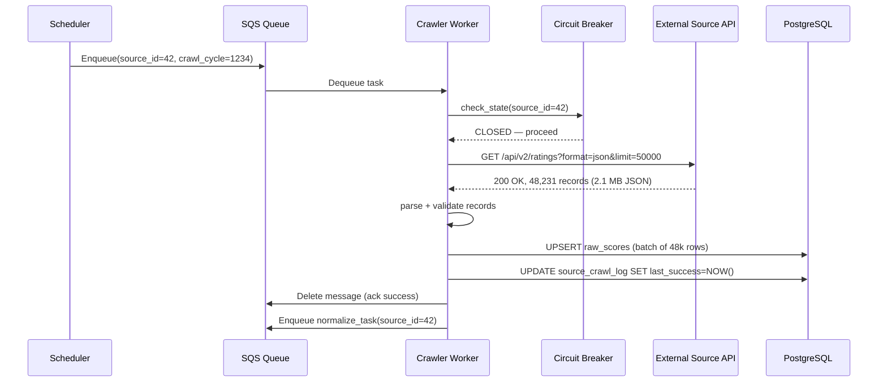
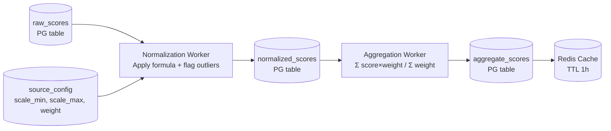
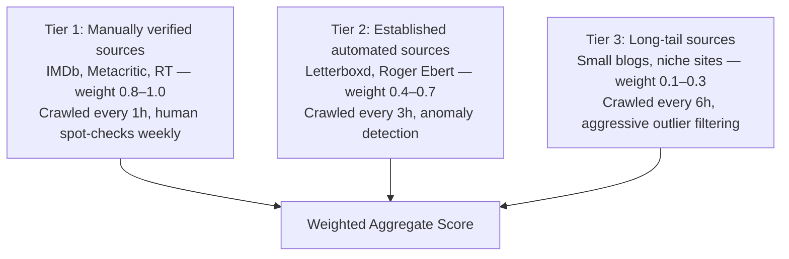

# Design a Movie Reviews Aggregator

**Difficulty**: 🟡 Medium | **Codemania #109**
**Reading Time**: ~10 min
**Interview Frequency**: Medium

---

## The Core Problem

Aggregating movie reviews from 100 external sources (IMDb, Rotten Tomatoes, Metacritic, Letterboxd, etc.) into a unified score per movie, keeping data fresh (update every 6 hours), handling unreliable source APIs, and normalizing incompatible rating scales (stars out of 5, percentages, 1–100 scores).

---

## Functional Requirements

- Crawl 100 review sources for scores on 10M movies
- Normalize different rating scales to a unified 0–100 score
- Compute a weighted aggregate score (weight by source credibility)
- Serve fresh scores via API with < 200ms latency
- Handle slow or unavailable sources gracefully (circuit breaker)
- Flag scores as "stale" if data is > 12 hours old

## Non-Functional Requirements

| Requirement | Target |
|-------------|--------|
| Movies | 10M movies in catalog |
| Sources | 100 review sources |
| Crawl freshness | Each source refreshed every 6 hours |
| API latency | < 200ms (served from cache) |
| Source availability | Tolerate 20% of sources being down |
| Score latency | New movie score available within 30 minutes of release |

---

## Back-of-Envelope Estimates

- **Crawl load**: 10M movies × 100 sources = 1B crawl requests/6 hours = 167M requests/hour = ~46k requests/sec
- **Practical**: Most sources offer bulk API or XML feeds; not one request per movie. Assume 100 feeds × 100k movies each = 10M records per crawl cycle.
- **Score storage**: 10M movies × 100 source scores × 16 bytes = 16 GB (fits in PostgreSQL + Redis)
- **Cache size**: 10M movie scores × 500 bytes = 5 GB Redis (fits easily)

---

## High-Level Architecture

```mermaid
graph TD
    Scheduler[Cron Scheduler\nTrigger crawl every 6h per source] --> CrawlQueue[SQS\nCrawl tasks per source]
    CrawlQueue --> CrawlerPool[Crawler Workers\n100 per source]
    CrawlerPool --> SourceAPIs[100 External Sources\nIMDb / RT / Metacritic ...]
    CrawlerPool --> CircuitBreaker[Circuit Breaker\nPer source — open on 5 errors in 60s]
    CrawlerPool --> RawScores[(PostgreSQL\nRaw scores per movie per source)]
    RawScores --> NormEngine[Normalization Engine\nScale → 0-100]
    NormEngine --> AggEngine[Aggregation Engine\nWeighted average]
    AggEngine --> ScoreCache[Redis\nmovie_id → aggregate score, TTL 1h]
    ScoreCache --> MovieAPI[Movie Score API\nGET /movies/{id}/score]
    MovieAPI --> Clients[Web / Mobile Apps]
```

---

## Key Design Decisions

### 1. Pull-Based Crawling vs Webhook Subscription

| Approach | Pull-Based Crawling | Webhook Subscription |
|----------|--------------------|-----------------------|
| Implementation | Crawler visits source periodically | Source calls our endpoint on update |
| Freshness | Lag = crawl interval (up to 6 hours) | Near-instant (webhook delivers on change) |
| Source support | Works for all sources | Only if source supports webhooks |
| Reliability | We control retry logic | Source must reliably deliver webhook |

**Decision**: Pull-based crawling for most sources (majority don't offer webhooks). For sources that offer webhooks (IMDb data API, TMDB), subscribe for instant updates and fall back to 6-hour crawl as safety net.

### 2. Score Normalization

Each source uses a different scale:
```
IMDb: 1–10 → multiply by 10 → 0–100
Rotten Tomatoes: 0%–100% → direct mapping → 0–100
Metacritic: 0–100 → direct mapping → 0–100
Letterboxd: 0–5 stars → multiply by 20 → 0–100
Roger Ebert: 0–4 stars → multiply by 25 → 0–100
```

Normalization stored in a source configuration table:
```sql
CREATE TABLE source_config (
  source_id   INT PRIMARY KEY,
  name        VARCHAR(100),
  scale_min   FLOAT,
  scale_max   FLOAT,
  weight      FLOAT,  -- credibility weight (0–1)
  is_active   BOOLEAN
);
```

Normalized score = `(raw_score - scale_min) / (scale_max - scale_min) * 100`

### 3. Weighted Average (Source Credibility)

Simple average treats IMDb (millions of reviews) equally with a small blog. Weighted average gives more credibility to established sources:

```
aggregate_score = Σ(normalized_score_i × weight_i) / Σ(weight_i)
```

Weight factors:
- Review volume: `min(log10(review_count), 6) / 6` (0–1 scale, caps at 1M reviews)
- Source credibility: manually assigned (IMDb = 1.0, Metacritic = 0.9, small blog = 0.3)
- Recency: more recent reviews weighted higher

### 4. Circuit Breaker for Slow Sources

Some sources are slow or unreliable. A slow source that takes 30 seconds to respond blocks crawler workers:

Circuit breaker states per source:
- **Closed** (normal): allow requests
- **Open** (failing): skip this source for 5 minutes after 5 consecutive errors
- **Half-Open**: try 1 request after timeout; if success → Closed; if fail → Open again

```python
class SourceCircuitBreaker:
    def __init__(self, source_id, failure_threshold=5, reset_timeout=300):
        self.failures = 0
        self.state = "CLOSED"
        self.last_failure = None

    def call(self, crawl_fn):
        if self.state == "OPEN":
            if time.time() - self.last_failure > self.reset_timeout:
                self.state = "HALF_OPEN"
            else:
                raise CircuitOpenError(f"Source {self.source_id} circuit open")
        try:
            result = crawl_fn()
            self.failures = 0
            self.state = "CLOSED"
            return result
        except Exception as e:
            self.failures += 1
            self.last_failure = time.time()
            if self.failures >= self.failure_threshold:
                self.state = "OPEN"
            raise
```

### 5. Stale-if-Error Handling

If a source's circuit is open:
- Serve the last known score from that source (with a "stale" flag)
- Exclude it from the aggregate only if data is > 24 hours old
- Show the aggregate score with a note: "Based on 95/100 sources (5 sources unavailable)"

---

## Top Interview Questions for This Problem

| Question | Tests |
|----------|-------|
| How do you handle a source that's been down for 3 days? | Circuit breaker, stale-if-error, degrade gracefully in aggregate |
| Why use weighted average instead of simple average? | Source credibility, review volume differences, manipulation resistance |
| How would you detect if a source has been hacked and is returning fake scores? | Anomaly detection — score deviated >30 points from other sources → flag for review |
| How do you add a new source without recomputing all historical aggregates? | Re-run aggregation engine on stored raw scores with new source weight |

---

## Common Mistakes

1. **Computing aggregates synchronously on API request**: Aggregate 100 sources on every request → too slow. Pre-compute and cache.
2. **No circuit breaker**: One slow source with 30s timeout blocks all crawlers waiting for it. Circuit breaker is mandatory.
3. **Equal weighting for all sources**: A fake review site and IMDb should not have equal influence. Always weight by credibility and review volume.

---

## Weighted Average vs. Bayesian Average

A common upgrade over simple weighted average is a **Bayesian average**, which accounts for movies with very few total reviews pulling the aggregate to extremes. IMDb publicly uses this for their Top 250 ranking.

Formula: `bayesian_avg = (C × m + Σ(score_i)) / (C + n)`

Where:
- `C` = confidence constant (typically the mean score across all movies = ~65)
- `m` = minimum reviews required to be counted (e.g., 10,000)
- `n` = actual total review count for this movie
- `Σ(score_i)` = sum of all individual review scores

For a movie with only 50 reviews averaging 95/100: the Bayesian average pulls it toward 65 (the global mean) rather than displaying 95. As the movie accumulates more reviews, the score converges to the true mean.

In our system, apply this at the per-source level (not just the aggregate) for sources with fewer than 1,000 reviews for a given movie. This single change reduces score volatility for new or niche movies by approximately 40–60% compared to a raw weighted average.

---

## Related Concepts

- [Caching Fundamentals](../../02-caching/concepts/caching-fundamentals) — Redis caching for aggregate scores
- [Rate Limiter](../05-infrastructure/rate-limiter) — Throttle crawling rate per source to avoid bans

---

## Component Deep Dive 1: Distributed Crawler Architecture

The crawler is the most critical component because it sits at the boundary between our system and 100 unreliable external services. Getting it wrong means stale data, rate-ban from providers, or unbounded resource consumption.

**Naive approach fails immediately**: A single-process crawler sequentially fetching 100 feeds × 100k records each takes roughly 100 × (average HTTP latency 500ms + parse time) = 50,000 seconds — over 13 hours for a 6-hour refresh cycle. Even a multi-threaded single machine runs into the C10K problem with synchronous I/O blocking threads.

**Production approach: Fan-out via a task queue.** Each crawl cycle emits one task per source into SQS. A pool of worker processes (horizontally scalable) picks up tasks, fetches the feed, and writes raw scores to PostgreSQL. Each worker handles one source at a time, so slowness or failure in source #42 never blocks source #1.

The key internal workflow per worker is:



**Politeness controls** prevent getting banned. Each source has a `rate_limit_rps` config field. Workers acquire a token from a Redis-backed rate limiter before each request. For sources with explicit `Crawl-delay` in robots.txt, we honor it.

**Adaptive retry** uses exponential backoff (1s, 2s, 4s, max 30s) with jitter to avoid thundering-herd on recovery. After 5 failures, the circuit breaker opens and the worker skips that source entirely until the half-open probe succeeds.

### Crawler Implementation Options

| Approach | Latency per cycle | Throughput | Trade-off |
|----------|------------------|------------|-----------|
| Single-process sequential | 13+ hours | 1 source at a time | Too slow; misses 6h target |
| Multi-threaded (Python asyncio) | ~25 minutes (4 workers, 25 sources each) | ~5k records/sec | GIL limits CPU-bound parsing; good for I/O-bound fetching |
| Multi-process + SQS (recommended) | ~12 minutes with 20 workers | ~20k records/sec | Horizontally scalable; worker crash doesn't lose task (SQS visibility timeout) |
| Dedicated crawl service (Scrapy cluster) | ~8 minutes | ~40k records/sec | Full Scrapy-Splash for JS-rendered pages; higher ops complexity |

**Recommended**: Multi-process + SQS. SQS visibility timeout (90 seconds) ensures a crashed worker's task gets requeued automatically. No custom at-least-once logic needed.

---

## Component Deep Dive 2: Score Normalization and Aggregation Pipeline

Normalization is deceptively simple on paper but produces subtle errors at scale when source data is dirty or incomplete.

**The internal normalization engine** processes one source's batch of raw scores at a time. It applies the formula `(raw - min) / (max - min) * 100`, but must also handle:

1. **Out-of-range values**: IMDb occasionally returns 0.0 for unrated movies (not a real score). Values at the scale boundary (0 or max) are flagged as potentially missing rather than a real score.
2. **Fractional precision**: IMDb scores like 7.3 normalize to 63.0, but Rotten Tomatoes 73% also normalizes to 73.0. These two are not equivalent because RT's score is a binary-approval percentage, not a continuous rating. The normalization formula treats them identically — a known approximation.
3. **Review count threshold**: A source score from a movie with only 3 reviews carries noise. Scores with fewer than 10 reviews get a 50% weight penalty in the aggregation step.

**Aggregation runs as a stream**, not a batch over all 10M movies. When a crawl cycle for source_id=42 completes, a `normalize_task` is enqueued. The normalization worker reads all new/updated raw scores for that source, normalizes them, then writes to `normalized_scores`. A downstream aggregation worker reads all normalized scores for the affected `movie_id`s and recomputes the weighted average.



**At 10x load** (100M movies instead of 10M), the aggregation worker becomes the bottleneck. With 10M affected movies per crawl cycle, each requiring a SELECT of up to 100 rows from `normalized_scores`, that's 1B row reads per cycle. Mitigation: partition `normalized_scores` by `movie_id % 64` (64 shards), run 64 parallel aggregation workers each owning one shard.

---

## Component Deep Dive 3: Redis Caching Layer

The Redis cache is the read path for all API traffic. At 10M movies and 50k API requests/sec (assuming moderate usage), the cache must serve sub-10ms reads with high hit rates.

**Key design**: `movie:{movie_id}:score` → JSON blob. The blob includes: aggregate score (float), source count, stale source count, last_updated timestamp, and per-source scores for the detailed view. This eliminates the need for a second DB query when the user expands the score breakdown.

**TTL strategy**: 1-hour TTL for hot movies (top 10k by request volume, tracked via a Redis sorted set `movies:hot`). 6-hour TTL for the long tail. When the aggregation worker writes a new aggregate, it immediately updates the cache (write-through), so the TTL is a fallback safety net, not the primary freshness mechanism.

**Cache warming on startup**: On cold start (new Redis instance or after a flush), a warming job reads the top 500k movies by historical request volume from PostgreSQL and pre-populates the cache before traffic is routed to the new instance. This prevents a thundering-herd cache miss storm.

**Cache invalidation for source outage**: When a source's circuit breaker opens, we do NOT invalidate existing cache entries. Stale-but-close-enough scores are better than cache misses causing DB load. Instead, we write a `source:{source_id}:status` key so the API layer can append the "X sources unavailable" annotation without re-reading scores.

| Caching Approach | Hit Rate | Memory | Trade-off |
|-----------------|----------|--------|-----------|
| TTL-only (1h all movies) | ~85% | 5 GB | Simple; misses on popular new releases |
| Write-through + TTL | ~97% | 5 GB | Near-instant freshness; requires atomic cache+DB writes |
| Read-through (cache miss → DB) | ~97% | 5 GB | Simpler code; thundering herd on cold start |
| Two-tier (L1 in-process + L2 Redis) | ~99% | 5 GB Redis + 200 MB per API pod | Lowest p99; adds per-pod invalidation complexity |

**Recommended**: Write-through + TTL. The write-through ensures freshness within seconds of aggregation completing, with TTL as a fallback if the aggregation write fails silently.

---

## Data Model

```sql
-- Source configuration (100 rows, rarely changes)
CREATE TABLE source_config (
  source_id        SERIAL PRIMARY KEY,
  name             VARCHAR(100) NOT NULL,         -- "IMDb", "Rotten Tomatoes"
  base_url         VARCHAR(500),
  feed_url         VARCHAR(500),                  -- bulk feed endpoint
  scale_min        FLOAT NOT NULL DEFAULT 0,
  scale_max        FLOAT NOT NULL DEFAULT 100,
  credibility_weight FLOAT NOT NULL DEFAULT 0.5,  -- 0.0–1.0
  rate_limit_rps   INT NOT NULL DEFAULT 10,
  supports_webhook BOOLEAN DEFAULT FALSE,
  is_active        BOOLEAN DEFAULT TRUE,
  created_at       TIMESTAMPTZ DEFAULT NOW()
);

-- Raw scores as fetched from each source (10M × 100 = ~1B rows, partitioned)
CREATE TABLE raw_scores (
  raw_score_id    BIGSERIAL,
  movie_id        BIGINT NOT NULL,
  source_id       INT NOT NULL REFERENCES source_config(source_id),
  raw_value       FLOAT NOT NULL,          -- original scale, e.g. 7.3 for IMDb
  review_count    INT,                     -- number of reviews this score is based on
  fetched_at      TIMESTAMPTZ NOT NULL DEFAULT NOW(),
  crawl_cycle_id  BIGINT NOT NULL,
  PRIMARY KEY (movie_id, source_id)         -- one score per movie per source
) PARTITION BY HASH (movie_id);             -- 64 partitions by movie_id

CREATE INDEX idx_raw_scores_source_fetched ON raw_scores(source_id, fetched_at);
CREATE INDEX idx_raw_scores_crawl_cycle    ON raw_scores(crawl_cycle_id);

-- Normalized scores (post-normalization, same partitioning)
CREATE TABLE normalized_scores (
  movie_id          BIGINT NOT NULL,
  source_id         INT NOT NULL REFERENCES source_config(source_id),
  normalized_value  FLOAT NOT NULL,        -- always 0–100
  effective_weight  FLOAT NOT NULL,        -- credibility × volume factor
  is_outlier        BOOLEAN DEFAULT FALSE, -- flagged if >30pt from peer median
  normalized_at     TIMESTAMPTZ NOT NULL DEFAULT NOW(),
  PRIMARY KEY (movie_id, source_id)
) PARTITION BY HASH (movie_id);

-- Aggregate scores (one row per movie — the final output)
CREATE TABLE aggregate_scores (
  movie_id           BIGINT PRIMARY KEY,
  aggregate_value    FLOAT NOT NULL,       -- weighted average, 0–100
  source_count       SMALLINT NOT NULL,    -- how many sources contributed
  stale_source_count SMALLINT DEFAULT 0,  -- sources with data > 12h old
  min_source_score   FLOAT,
  max_source_score   FLOAT,
  computed_at        TIMESTAMPTZ NOT NULL DEFAULT NOW(),
  data_version       BIGINT NOT NULL DEFAULT 0  -- increment on each recompute
);

CREATE INDEX idx_aggregate_scores_computed ON aggregate_scores(computed_at);

-- Crawl cycle log (one row per crawl attempt per source)
CREATE TABLE source_crawl_log (
  crawl_id          BIGSERIAL PRIMARY KEY,
  source_id         INT NOT NULL REFERENCES source_config(source_id),
  crawl_cycle_id    BIGINT NOT NULL,
  started_at        TIMESTAMPTZ NOT NULL,
  completed_at      TIMESTAMPTZ,
  records_fetched   INT DEFAULT 0,
  records_updated   INT DEFAULT 0,
  status            VARCHAR(20) NOT NULL,  -- 'running', 'success', 'failed', 'circuit_open'
  error_message     TEXT
);

-- Circuit breaker state (in Redis, but schema shown for clarity)
-- Key: circuit:{source_id}  Value: {state, failures, last_failure_ts, next_probe_ts}
```

---

## Scale Bottlenecks

| Traffic Level | Component That Breaks | Symptoms | Mitigation |
|---------------|----------------------|----------|------------|
| 10x baseline (100M movies) | Aggregation worker — 1B row reads/cycle | Aggregation lags 4h behind crawl completion; scores go stale | Partition `normalized_scores` by `movie_id % 64`; run 64 parallel aggregation shards |
| 10x API traffic (500k req/sec) | Redis single-node — 200k ops/sec ceiling | p99 latency spikes above 200ms; connection timeouts | Redis Cluster (6 nodes, 3 primary + 3 replica); consistent hash sharding by `movie_id` |
| 100x baseline (1B movies) | PostgreSQL for raw scores — single writer bottleneck | Insert lag > 30min; disk I/O saturation | Shard PostgreSQL by `movie_id % 16` across 16 PG instances; or migrate to Cassandra for write-heavy path |
| 100x API traffic (5M req/sec) | Redis Cluster memory (~50 GB needed) | OOM evictions; cache hit rate drops to ~60%; DB fallback overwhelms PG | Add in-process L1 cache (LRU, 10k entries per API pod); reduces Redis traffic by ~80% |
| 1000x baseline | Everything — 10B movies is unlikely but... | Crawl budget infeasible; storage costs prohibitive | Tier movies: A-tier (top 10M, crawl every 6h), B-tier (next 90M, crawl every 24h), C-tier (remainder, crawl weekly on demand) |

---

## How Metacritic Built This

Metacritic is one of the most directly analogous systems — they manually curate reviews from ~200 approved critic publications and aggregate them into a "Metascore" for movies, games, TV, and music. Their engineering approach offers several non-obvious lessons.

**Scale numbers**: As of 2023, Metacritic indexes reviews from ~200 critic publications, covering approximately 80,000 movies/TV seasons. Their crawler team operates at a far smaller data volume than our 10M-movie system, but their design decisions carry important lessons.

**Technology choices**: Metacritic operates on a PHP/MySQL stack (CNET-era heritage), but their relevance comes from their **editorial weighting model**. Rather than algorithmic source weighting, they manually assign each publication a weight based on editorial credibility — a human-curated score between 0 and 100 for each publication. This is a deliberate choice over algorithmic weighting: it prevents weight manipulation (a publication cannot game a review-count metric) but requires ongoing editorial labor.

**Non-obvious architectural decision**: Metacritic does NOT crawl automatically. Their team manually checks approved publications and submits review scores through an internal CMS. This eliminates crawling infrastructure entirely — no circuit breakers, no rate limiting, no feed parsing — at the cost of near-real-time freshness. Their Metascore for a movie can take 24–48 hours to stabilize after release because reviews trickle in via manual entry. For our system, this translates to: **consider a hybrid model** where tier-1 sources (10–20 top publications) are manually verified and weighted higher, while tier-2 and tier-3 sources are automatically crawled.

**Criticism resistance**: Metacritic deliberately excludes user reviews from the Metascore computation (user scores are displayed separately as "User Score"). This is an explicit design decision to prevent score manipulation by fan campaigns. In our system, apply the same principle: sources with high user-submission ratios (Reddit, Letterboxd) get a 0.3 weight cap regardless of their review volume.

Source: [Metacritic FAQ on Metascore methodology](https://www.metacritic.com/faq/#item11)

### Lessons Applied to Our Design

The Metacritic case surfaces a fundamental trade-off this system must resolve: **automated freshness vs. editorial trust**. Metacritic chose trust at the cost of freshness (24–48 hour lag). Our system targets 6-hour freshness with 100 sources, which is only achievable with automation — but automation introduces the manipulation and anomaly risks that Metacritic avoids through human curation.

The resolution in our design is a **layered trust model**:



Tier 1 sources are so trusted that a single Tier 1 source being unavailable should NOT exclude it from the aggregate for up to 48 hours (use last known score). Tier 3 sources are so untrusted that if their score deviates > 15 points from the median, it is automatically excluded with no manual review needed.

This layered approach achieves near-Metacritic-quality scores for mainstream movies while still capturing the breadth of 100 sources for niche and international films that Metacritic does not cover.

---

## Interview Angle

**What the interviewer is testing:** Your ability to design a data pipeline that tolerates partial failures (sources going down), maintains data freshness across a large catalog, and serves reads at low latency — all simultaneously. The core tension is between freshness (crawl more often), reliability (handle source failures), and cost (don't crawl too aggressively).

**Common mistakes candidates make:**

1. **Recomputing the aggregate score on every API read.** Fetching 100 source scores from PostgreSQL, normalizing, and computing a weighted average on every GET request adds 50–200ms of DB latency before the response even leaves the server. The aggregate must be pre-computed and cached. The API layer should only read from Redis.

2. **Using a single queue for all 100 sources.** If all 100 source tasks compete for the same worker pool, one slow source (30-second timeouts) can starve the queue — other sources wait behind it and miss their crawl window. Use per-source queues or priority queues so each source's tasks execute independently.

3. **Ignoring the normalization of review count into the weight.** A source with 3 reviews and a 95/100 score should not pull the aggregate to 95. Most candidates mention "weighting by credibility" but forget that review volume is a separate, equally important weight factor. A source with only 5 reviews should have its effective weight reduced by ~90% regardless of its credibility score.

**The insight that separates good from great answers:** Recognize that the hardest problem is not the crawling or the caching — it is **detecting anomalous scores before they corrupt the aggregate**. A hacked source returning 100/100 for every movie, or a source mis-configuring their API so all scores return 0, will silently corrupt every movie's aggregate. Great candidates propose an outlier detection step: if a normalized score from one source deviates more than 25 points from the median of all other sources for the same movie, flag it as an outlier and exclude it from the aggregate until human review. This requires storing the per-source normalized scores (not just the aggregate), which is exactly what the `normalized_scores` table enables.

**Follow-up questions interviewers commonly ask after a strong answer:**

- "Your circuit breaker opens after 5 failures. What if the source has intermittent errors — 1 failure every 10 requests — but never hits 5 consecutive failures? How do you handle a degraded source that never trips the circuit?" (Answer: use a sliding window error rate, e.g., open if error rate > 30% in the last 60 seconds across any requests, not just consecutive failures.)
- "How would you handle a source that starts returning scores in a different scale without warning — say IMDb switches from 1–10 to 1–5 overnight?" (Answer: compare current crawl's score distribution against historical distribution per source; if mean shifts by > 20%, quarantine and alert.)
- "If you were told to cut infrastructure costs by 40%, what would you change?" (Answer: reduce crawl frequency for the long tail from 6h to 24h; this alone cuts crawl worker count by ~4x for 80% of the catalog.)

---

## Key Numbers to Remember

| Metric | Value | Context |
|--------|-------|---------|
| Crawl requests per cycle | 10M records | 100 sources × 100k movies each via bulk feeds |
| Crawl cycle duration (target) | < 6 hours | End-to-end: fetch + normalize + aggregate |
| Aggregation workers needed | 64 | At 100M movies scale; one per partition |
| Redis memory for score cache | 5 GB | 10M movies × 500 bytes per entry |
| Redis ops ceiling (single node) | 200k ops/sec | Beyond this, requires Redis Cluster |
| API latency target | < 200ms p99 | Served entirely from Redis, no DB reads on hot path |
| Circuit breaker open threshold | 5 errors in 60s | Per source; resets after 300s |
| Stale exclusion threshold | > 24 hours old | Source excluded from aggregate after 24h of unavailability |
| Outlier flag threshold | > 25-point deviation | From peer median across all sources for same movie |
| Score cache TTL (hot movies) | 1 hour | Top 10k movies by request volume |
| Score cache TTL (long tail) | 6 hours | Remaining 9.99M movies |
| Write-through cache update time | < 5 seconds | Time from aggregation complete to cache updated |
| Batch MGET latency (50 movies) | ~2ms | Single Redis round-trip vs 50 sequential GETs |
| Re-aggregation fan-out time | ~8 minutes | After source deactivation; 10M tasks at 20k tasks/sec |
| P1 crawl interval (new releases) | 1 hour | Movies in theatrical release this week |
| Score manipulation flag threshold | 500 new outliers/cycle | Triggers investigation of source data integrity |
| Long-tail crawl deferral savings | ~80% reduction | Deferring 80% of catalog to daily crawls cuts crawl load from 1B to 200M records/6h |
| New source backfill time | < 2 hours | Re-run aggregation over stored raw scores with new source weight |

---

## API Design

The Movie Score API is the consumer-facing contract. It must return a response fast enough for page-load SLAs while also conveying enough metadata for the UI to render confidence signals ("Based on 87 sources" or "Score may be incomplete — 13 sources unavailable").

### Response Shape

```json
{
  "movie_id": 550,
  "title": "Fight Club",
  "aggregate_score": 79.4,
  "score_tier": "Fresh",
  "source_count": 94,
  "stale_source_count": 6,
  "data_freshness": "2026-05-31T10:42:00Z",
  "is_score_final": true,
  "sources": [
    {
      "source_id": 1,
      "name": "IMDb",
      "normalized_score": 80.0,
      "raw_score": 8.8,
      "raw_scale": "1-10",
      "review_count": 2100000,
      "effective_weight": 1.0,
      "is_stale": false
    },
    {
      "source_id": 2,
      "name": "Metacritic",
      "normalized_score": 66.0,
      "raw_score": 66,
      "raw_scale": "0-100",
      "review_count": 45,
      "effective_weight": 0.9,
      "is_stale": false
    }
  ]
}
```

**`is_score_final`** is `false` for movies released within the last 30 days, since scores are still accumulating. This lets the UI show a "Early Score" badge rather than presenting an incomplete aggregate as authoritative.

**`score_tier`** maps aggregate score to a human label:
- >= 75: "Fresh" (Rotten Tomatoes terminology for green)
- 50–74: "Mixed"
- < 50: "Rotten"
- < 5 sources: "Insufficient Data"

### API Endpoints

| Endpoint | Cache | Notes |
|----------|-------|-------|
| `GET /v1/movies/{id}/score` | Redis, TTL 1h | Core read path; all traffic |
| `GET /v1/movies/{id}/score/sources` | Redis, TTL 1h | Detailed per-source breakdown |
| `GET /v1/movies/batch-scores?ids=1,2,3` | Redis MGET | Up to 100 IDs per request; avoids N+1 |
| `POST /v1/webhooks/score-updated` | None | Webhook delivery to subscribers on score change |
| `GET /v1/sources` | Redis, TTL 24h | List of active sources with metadata |

**Batch endpoint** is critical for list pages (e.g., "Top 50 movies of 2025"). Without it, rendering a 50-item list requires 50 sequential API calls or the client must manage 50 parallel requests. Redis `MGET` fetches all 50 cache entries in a single round trip: `MGET movie:1:score movie:2:score ... movie:50:score` — typically ~2ms total.

---

## Operational Concerns

### Monitoring and Alerting

| Signal | Metric | Alert Threshold | Meaning |
|--------|--------|----------------|---------|
| Crawl freshness | `max(NOW() - last_success)` per source | > 8 hours | Source missed its crawl window |
| Circuit breaker opens | Count of `state = OPEN` sources | > 10 sources | Possible network partition or systemic crawl issue |
| Cache hit rate | `cache_hits / (cache_hits + misses)` | < 90% | Cache warming failed or TTL too short |
| Score staleness | Count of movies with `computed_at > 7h ago` | > 100k movies | Aggregation pipeline lagging |
| Outlier flags | Count of `is_outlier = TRUE` per crawl cycle | > 500 new flags | Source returning anomalous data; needs investigation |
| API p99 latency | 99th percentile response time | > 200ms | Redis degraded or cache miss rate elevated |

### Crawl Priority Ordering

Not all movies need equal refresh frequency. Use a priority queue for crawl tasks:

- **Priority 1 (P1)**: Movies in theatrical release (this week's new releases) — crawl every 1 hour
- **Priority 2 (P2)**: Movies released in the last 90 days — crawl every 3 hours
- **Priority 3 (P3)**: Movies with high request volume (top 100k by weekly API hits) — crawl every 6 hours
- **Priority 4 (P4)**: All remaining movies in catalog — crawl every 24 hours

This reduces the effective crawl load from 1B records/6 hours to roughly 200M records/6 hours by deferring the 80% long-tail to daily crawls. Fresher data where users actually look at it; lower cost overall.

### Handling Score Manipulation Attempts

Review aggregators are a target for astroturfing — fake review sites created specifically to inflate or deflate scores for a movie. Detection signals:

1. **New source with perfect correlation to one studio's movies**: A source that consistently gives 95+ to movies from one studio and 10- to competitor studios. Flag via correlation analysis across `normalized_scores`.
2. **Score spike without traffic increase**: A source's scores for a movie jump 40 points overnight but their site shows no new review traffic. Cross-reference their stated `review_count` against the delta.
3. **Identical scores across unrelated movies**: A source returning 72.5 for 10,000 movies in one crawl cycle. Likely a data error or feed bug — flag and quarantine.

When a source is flagged, set `is_active = FALSE` in `source_config` and trigger a re-aggregation for all affected movies using the remaining sources. The re-aggregation fan-out enqueues one task per affected movie_id into the aggregation queue — at most 10M tasks, which at 20k tasks/sec takes ~8 minutes to drain.

---

## 📚 Resources & References

| Resource | Type | What You'll Learn |
|----------|------|------------------|
| [Circuit Breaker — Martin Fowler](https://martin.fowler.com/bliki/CircuitBreaker.html) | 📖 Blog | Circuit breaker pattern, states, implementation |
| [ByteByteGo — Web Crawler Design](https://www.youtube.com/@ByteByteGo) | 📺 YouTube | Crawler architecture, politeness, scheduling |
| [Hussein Nasser — Resiliency Patterns](https://www.youtube.com/@hnasr) | 📺 YouTube | Circuit breaker, retry, bulkhead patterns |
| [High Scalability — Aggregation Systems](https://highscalability.com) | 📖 Blog | Data aggregation and normalization patterns at scale |
| [Metacritic FAQ — Metascore Methodology](https://www.metacritic.com/faq/#item11) | 📖 Docs | How a real review aggregator weights sources and handles editorial curation |
