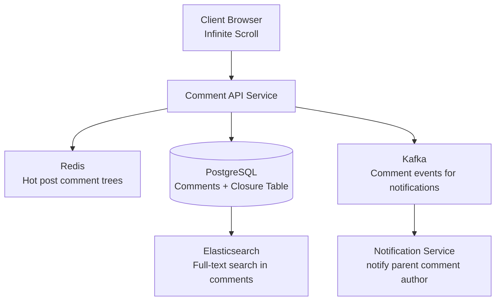

# Design a Nested Comments System

**Difficulty**: 🟢 Easy | **Codemania #76**
**Reading Time**: ~8 min
**Interview Frequency**: Medium

---

## The Core Problem

Designing a comment system that supports infinite nesting (comment → reply → reply to reply...) with efficient reads of "top-level comments with N replies" and cursor-based pagination for infinite scroll. The data modeling challenge: SQL databases are not natively tree-structured.

---

## Functional Requirements

- Users can post comments on content items (posts, articles, videos)
- Users can reply to any comment at any depth (theoretically infinite nesting)
- Fetch top-level comments with their replies (paginated, sorted by votes or time)
- Delete a comment while preserving child replies ("deleted" placeholder)
- Support upvoting/downvoting on individual comments
- Efficient loading: top-10 comments × top-3 replies per comment on page load

## Non-Functional Requirements

| Requirement | Target |
|-------------|--------|
| Read latency | < 100ms for top-level + first 3 reply levels |
| Write throughput | 10,000 new comments/sec at peak |
| Scale | 1B comments total; 1M comments per popular post |
| Pagination | Cursor-based (not offset — performance degrades) |
| Soft delete | Deleted comments show "[deleted]", children preserved |

---

## Back-of-Envelope Estimates

- **Total comments**: 1B × 200 bytes avg = 200 GB of comment text
- **Tree metadata**: 1B rows × 100 bytes (adjacency list) = 100 GB
- **Closure table**: 1B rows × avg depth 3 = 3B rows × 50 bytes = 150 GB
- **Read pattern**: 95% reads (users scroll), 5% writes (users comment)
- **Hot posts**: Top 1000 posts get 80% of traffic → cache comment trees for hot posts in Redis

---

## High-Level Architecture



---

## Key Design Decisions

### 1. Tree Storage Approaches Compared

| Approach | Read Subtree | Write | Depth Query | Move Subtree | Best For |
|----------|-------------|-------|-------------|--------------|----------|
| Adjacency List | N+1 queries or recursive CTE | O(1) | Recursive CTE | Easy | Simple hierarchies, PostgreSQL with CTE |
| Closure Table | Single JOIN | 2× inserts (self + ancestors) | Single WHERE | Complex | Reddit-style nested comments |
| Materialized Path | LIKE query on path string | O(1) | LIKE prefix | Path rebuild needed | Moderate depth, simple queries |
| Nested Set | Single range query | O(N) (rebuild left/right) | Simple | Very expensive | Read-heavy, rarely modified trees |

### 2. Adjacency List (Simplest)

```sql
CREATE TABLE comments (
  id          BIGINT PRIMARY KEY,
  post_id     BIGINT NOT NULL,
  parent_id   BIGINT REFERENCES comments(id),  -- NULL = top-level
  author_id   BIGINT NOT NULL,
  body        TEXT,
  votes       INT DEFAULT 0,
  deleted_at  TIMESTAMPTZ,                      -- soft delete
  created_at  TIMESTAMPTZ DEFAULT NOW()
);
CREATE INDEX idx_comments_parent ON comments(parent_id);
CREATE INDEX idx_comments_post   ON comments(post_id, created_at DESC);
```

Fetching full subtree with PostgreSQL recursive CTE:
```sql
WITH RECURSIVE tree AS (
  SELECT * FROM comments WHERE id = :root_id
  UNION ALL
  SELECT c.* FROM comments c JOIN tree t ON c.parent_id = t.id
)
SELECT * FROM tree ORDER BY created_at;
```

**Limitation**: Recursive CTE performance degrades past depth 5–6 on large trees (millions of comments).

### 3. Closure Table (Best for Deep Reads)

```sql
CREATE TABLE comment_paths (
  ancestor_id   BIGINT NOT NULL,
  descendant_id BIGINT NOT NULL,
  depth         INT NOT NULL,  -- 0 = self-referencing row
  PRIMARY KEY (ancestor_id, descendant_id)
);
```

On insert of new comment C with parent P:
```sql
INSERT INTO comment_paths
  SELECT ancestor_id, :new_id, depth+1 FROM comment_paths WHERE descendant_id = :parent_id
  UNION ALL SELECT :new_id, :new_id, 0;
```

Fetching all descendants of comment X (any depth):
```sql
SELECT c.* FROM comments c
JOIN comment_paths cp ON c.id = cp.descendant_id
WHERE cp.ancestor_id = :x AND cp.depth > 0;
```

This is a single JOIN — O(1) regardless of tree depth. Trade-off: each insert writes `depth` rows to the paths table (avg 3x overhead).

**Decision**: Use closure table for Reddit/HN-style comments where deep nested reads are common. Use adjacency list with recursive CTE for simpler use cases (max 3–4 levels deep).

### 4. Pagination: Cursor vs Offset

Offset pagination (`LIMIT 20 OFFSET 1000`) degrades to O(N) — the database must skip 1000 rows.
Cursor pagination uses the last-seen row's `(votes, created_at, id)` as a stable cursor:
```sql
SELECT * FROM comments
WHERE post_id = :post_id AND parent_id IS NULL
  AND (votes, created_at, id) < (:last_votes, :last_ts, :last_id)
ORDER BY votes DESC, created_at DESC
LIMIT 20;
```

---

## Soft Delete with Child Retention

When a comment is deleted:
1. Set `deleted_at = NOW()`, `body = '[deleted]'`, `author_id = NULL`
2. Do NOT delete the row (children still reference it as `parent_id`)
3. API excludes `body` and `author_id` for deleted comments but returns the row (so tree structure intact)

If a deleted comment has no children → hard-delete eligible (background job).

---

## Top Interview Questions for This Problem

| Question | Tests |
|----------|-------|
| What are the trade-offs between adjacency list and closure table? | Storage vs query complexity, tree depth, write amplification |
| How do you paginate comments within a nested thread? | Cursor-based pagination, depth-first vs breadth-first ordering |
| How do you handle a popular post with 1M comments without loading them all? | Lazy loading by depth level, "load more replies" pagination |
| How would you add a voting/scoring system that sorts by "best" comments? | Wilson score or Hot formula, index on (post_id, score DESC) |

---

## Common Mistakes

1. **Using offset pagination**: At page 500 with 20 items/page, offset=10,000 causes full table scan. Always use cursor-based pagination.
2. **Fetching full comment tree at once**: Load top 20 comments + top 3 replies per comment on initial page load. Lazy-load deeper levels on demand.
3. **Hard-deleting comments with children**: Orphans the child comments. Always soft-delete and retain the tree structure.

---

## 📚 Resources & References

| Resource | Type | What You'll Learn |
|----------|------|------------------|
| [ByteByteGo — Database Design Patterns](https://www.youtube.com/@ByteByteGo) | 📺 YouTube | Tree structures in relational databases |
| [Joe Celko — Trees in SQL](https://www.amazon.com/Trees-Hierarchies-SQL-Smarties-Kaufmann/dp/1558609202) | 📚 Book | Complete reference for all 4 tree storage patterns |
| [High Scalability — Reddit Comment Ranking](https://highscalability.com) | 📖 Blog | Wilson score ranking, hot/top sorting algorithms |
| [Facebook Engineering — Comment Systems](https://engineering.fb.com) | 📖 Blog | Scaling threaded comments at Facebook scale |
