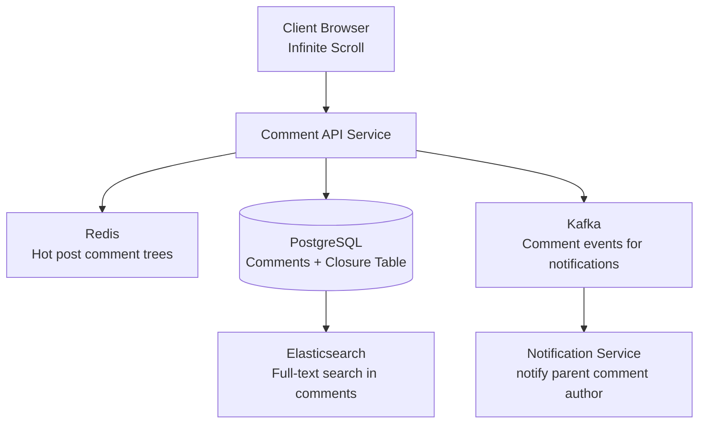
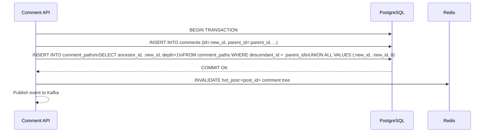
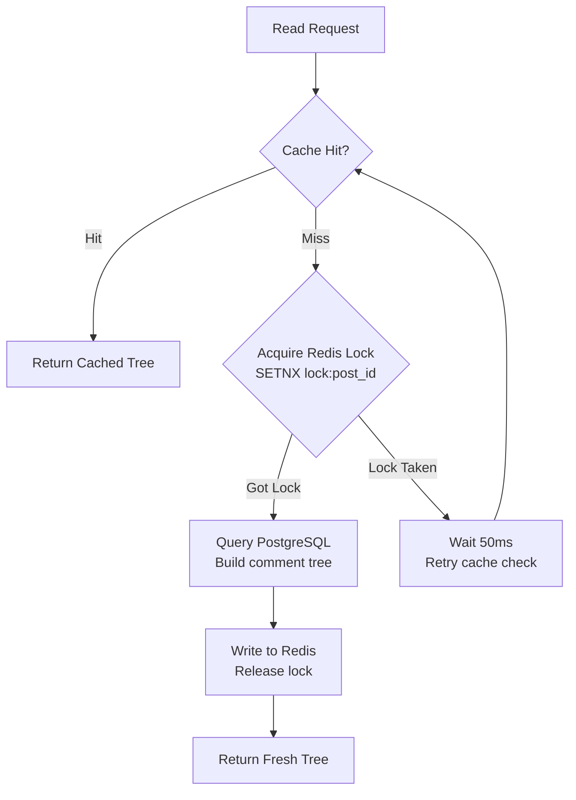
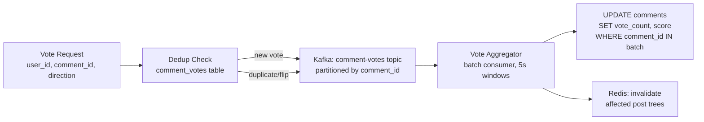
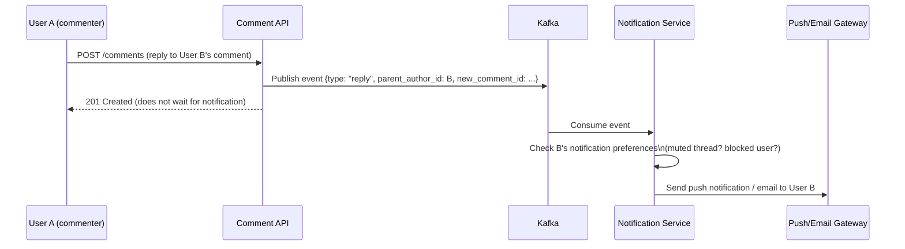

# Design a Nested Comments System

**Difficulty**: 🟢 Easy | **Codemania #76**
**Reading Time**: ~8 min
**Interview Frequency**: Medium

---

## The Core Problem

Designing a comment system that supports infinite nesting (comment → reply → reply to reply...) with efficient reads of "top-level comments with N replies" and cursor-based pagination for infinite scroll. The data modeling challenge: SQL databases are not natively tree-structured.

---

## Functional Requirements

- Users can post comments on content items (posts, articles, videos)
- Users can reply to any comment at any depth (theoretically infinite nesting)
- Fetch top-level comments with their replies (paginated, sorted by votes or time)
- Delete a comment while preserving child replies ("deleted" placeholder)
- Support upvoting/downvoting on individual comments
- Efficient loading: top-10 comments × top-3 replies per comment on page load

## Non-Functional Requirements

| Requirement | Target |
|-------------|--------|
| Read latency | < 100ms for top-level + first 3 reply levels |
| Write throughput | 10,000 new comments/sec at peak |
| Scale | 1B comments total; 1M comments per popular post |
| Pagination | Cursor-based (not offset — performance degrades) |
| Soft delete | Deleted comments show "[deleted]", children preserved |

---

## Back-of-Envelope Estimates

- **Total comments**: 1B × 200 bytes avg = 200 GB of comment text
- **Tree metadata**: 1B rows × 100 bytes (adjacency list) = 100 GB
- **Closure table**: 1B rows × avg depth 3 = 3B rows × 50 bytes = 150 GB
- **Read pattern**: 95% reads (users scroll), 5% writes (users comment)
- **Hot posts**: Top 1000 posts get 80% of traffic → cache comment trees for hot posts in Redis

---

## High-Level Architecture



---

## Key Design Decisions

### 1. Tree Storage Approaches Compared

| Approach | Read Subtree | Write | Depth Query | Move Subtree | Best For |
|----------|-------------|-------|-------------|--------------|----------|
| Adjacency List | N+1 queries or recursive CTE | O(1) | Recursive CTE | Easy | Simple hierarchies, PostgreSQL with CTE |
| Closure Table | Single JOIN | 2× inserts (self + ancestors) | Single WHERE | Complex | Reddit-style nested comments |
| Materialized Path | LIKE query on path string | O(1) | LIKE prefix | Path rebuild needed | Moderate depth, simple queries |
| Nested Set | Single range query | O(N) (rebuild left/right) | Simple | Very expensive | Read-heavy, rarely modified trees |

### 2. Adjacency List (Simplest)

```sql
CREATE TABLE comments (
  id          BIGINT PRIMARY KEY,
  post_id     BIGINT NOT NULL,
  parent_id   BIGINT REFERENCES comments(id),  -- NULL = top-level
  author_id   BIGINT NOT NULL,
  body        TEXT,
  votes       INT DEFAULT 0,
  deleted_at  TIMESTAMPTZ,                      -- soft delete
  created_at  TIMESTAMPTZ DEFAULT NOW()
);
CREATE INDEX idx_comments_parent ON comments(parent_id);
CREATE INDEX idx_comments_post   ON comments(post_id, created_at DESC);
```

Fetching full subtree with PostgreSQL recursive CTE:
```sql
WITH RECURSIVE tree AS (
  SELECT * FROM comments WHERE id = :root_id
  UNION ALL
  SELECT c.* FROM comments c JOIN tree t ON c.parent_id = t.id
)
SELECT * FROM tree ORDER BY created_at;
```

**Limitation**: Recursive CTE performance degrades past depth 5–6 on large trees (millions of comments).

### 3. Closure Table (Best for Deep Reads)

```sql
CREATE TABLE comment_paths (
  ancestor_id   BIGINT NOT NULL,
  descendant_id BIGINT NOT NULL,
  depth         INT NOT NULL,  -- 0 = self-referencing row
  PRIMARY KEY (ancestor_id, descendant_id)
);
```

On insert of new comment C with parent P:
```sql
INSERT INTO comment_paths
  SELECT ancestor_id, :new_id, depth+1 FROM comment_paths WHERE descendant_id = :parent_id
  UNION ALL SELECT :new_id, :new_id, 0;
```

Fetching all descendants of comment X (any depth):
```sql
SELECT c.* FROM comments c
JOIN comment_paths cp ON c.id = cp.descendant_id
WHERE cp.ancestor_id = :x AND cp.depth > 0;
```

This is a single JOIN — O(1) regardless of tree depth. Trade-off: each insert writes `depth` rows to the paths table (avg 3x overhead).

**Decision**: Use closure table for Reddit/HN-style comments where deep nested reads are common. Use adjacency list with recursive CTE for simpler use cases (max 3–4 levels deep).

### 4. Pagination: Cursor vs Offset

Offset pagination (`LIMIT 20 OFFSET 1000`) degrades to O(N) — the database must skip 1000 rows.
Cursor pagination uses the last-seen row's `(votes, created_at, id)` as a stable cursor:
```sql
SELECT * FROM comments
WHERE post_id = :post_id AND parent_id IS NULL
  AND (votes, created_at, id) < (:last_votes, :last_ts, :last_id)
ORDER BY votes DESC, created_at DESC
LIMIT 20;
```

---

## Soft Delete with Child Retention

When a comment is deleted:
1. Set `deleted_at = NOW()`, `body = '[deleted]'`, `author_id = NULL`
2. Do NOT delete the row (children still reference it as `parent_id`)
3. API excludes `body` and `author_id` for deleted comments but returns the row (so tree structure intact)

If a deleted comment has no children → hard-delete eligible (background job).

---

## Top Interview Questions for This Problem

| Question | Tests |
|----------|-------|
| What are the trade-offs between adjacency list and closure table? | Storage vs query complexity, tree depth, write amplification |
| How do you paginate comments within a nested thread? | Cursor-based pagination, depth-first vs breadth-first ordering |
| How do you handle a popular post with 1M comments without loading them all? | Lazy loading by depth level, "load more replies" pagination |
| How would you add a voting/scoring system that sorts by "best" comments? | Wilson score or Hot formula, index on (post_id, score DESC) |

---

## Common Mistakes

1. **Using offset pagination**: At page 500 with 20 items/page, offset=10,000 causes full table scan. Always use cursor-based pagination.
2. **Fetching full comment tree at once**: Load top 20 comments + top 3 replies per comment on initial page load. Lazy-load deeper levels on demand.
3. **Hard-deleting comments with children**: Orphans the child comments. Always soft-delete and retain the tree structure.

---

---

## Component Deep Dive 1: Closure Table — The Core Storage Engine

The closure table is the most critical architectural decision for a production nested comment system. Understanding why it works — and why naive alternatives break — is what separates a pass from a strong hire in a system design interview.

### How It Works Internally

A closure table stores **every ancestor-descendant pair** in the tree, not just direct parent-child links. For a comment tree of depth 3:

```
Root (id=1)
  └── Child (id=2)
        └── Grandchild (id=3)
```

The `comment_paths` table contains:

| ancestor_id | descendant_id | depth |
|-------------|---------------|-------|
| 1 | 1 | 0 |
| 1 | 2 | 1 |
| 1 | 3 | 2 |
| 2 | 2 | 0 |
| 2 | 3 | 1 |
| 3 | 3 | 0 |

Every node has a self-referencing row at depth=0. Every ancestor of every node has a row. This denormalization is the key: reads become a single indexed lookup instead of a recursive walk.

### Why Naive Approaches Fail at Scale

**Adjacency list with recursive CTE** is the natural first instinct. It works fine up to ~50k rows but degrades badly at scale:
- PostgreSQL's recursive CTE has no built-in depth limit — a malformed tree can cause infinite recursion
- Each recursion level requires a hash join or nested loop; at depth 8 with 100k children per level, you're touching millions of rows
- Optimizer cannot use index scans efficiently across recursive steps; query plans become unpredictable

**Materialized path** (storing `"/1/2/3/"` as a string) requires a `LIKE '/1/2/%'` query. `LIKE` with a leading-variable prefix (`%`) cannot use B-tree indexes. Even with prefix-based indexes, moving a subtree requires updating every path string in the subtree — an O(N) write that locks rows.

**Nested set** (storing `lft`/`rgt` integer ranges) reads are fast but every insert requires renumbering all nodes to the right of the insertion point — O(N) writes under contention on a hot post.

### Closure Table Internal Write Flow



The two INSERTs are wrapped in a single transaction. If the path insert fails, the comment row is rolled back — no orphaned comment_paths rows.

### Trade-off Table: Tree Storage Approaches

| Approach | Read Subtree Cost | Write Cost | Move Subtree | Storage Overhead | Recommended When |
|----------|------------------|------------|--------------|------------------|-----------------|
| Adjacency List + CTE | O(depth × fan-out), recursive | O(1) | O(1) | 1× | Depth < 5, < 500k rows total |
| Closure Table | O(1) — single JOIN | O(depth) writes | O(subtree size) deletes + reinserts | 3–5× (avg depth 3) | Reddit/HN-style deep threads, >1M rows |
| Materialized Path | O(prefix match) — fast with index | O(1) | O(subtree size) path updates | 1.2× | Filesystem-style paths, max depth 6 |
| Nested Set | O(1) range scan | O(N) — renumber all nodes | O(N) | 1× | Mostly-read taxonomies, no hot inserts |

**Production decision**: Use closure table for comment systems with active threading. The 3–5x storage overhead (150 GB for 1B comments at depth 3) is cheap compared to the query complexity savings.

---

## Component Deep Dive 2: Redis Caching for Hot Comment Trees

### Internal Mechanics

Not all posts are equal. The top 0.1% of posts (viral content, breaking news) receive 80% of read traffic. Serving 1M comment-tree reads per minute from PostgreSQL would require a 500-node database cluster. Redis reduces this to a small fleet of cache nodes.

**What to cache**: Serialize the top 20 comments with their top 3 reply levels as a single JSON blob per post. This is the "above the fold" view that 95% of users see without scrolling.

**Cache key structure**:
```
comments:hot:{post_id}:top_20       → JSON blob, TTL 30s
comments:thread:{comment_id}:depth3 → JSON blob, TTL 60s
comments:cursor:{post_id}:{cursor}  → paginated page result, TTL 10s
```

**Invalidation strategy**: Write-through invalidation. When any new comment is posted to a post:
1. Kafka consumer receives the event
2. Consumer calls `DEL comments:hot:{post_id}:*` pattern delete
3. Next read repopulates the cache

Do NOT use write-through cache population (writing new content directly to cache on insert) — comment trees are not easily patchable in Redis without re-reading and re-serializing the entire tree.

### Scale Behavior at 10x Load

At baseline (10k comments/sec, 100k reads/sec):
- Redis handles easily; single replica, ~10% CPU
- Cache hit rate ~85% for top-1000 hot posts

At 10x load (100k writes/sec, 1M reads/sec):
- Cache invalidation storms: a viral post gets 10k new comments per second, triggering 10k `DEL` operations and 10k cache misses racing to repopulate — the "thundering herd" problem
- Fix: **probabilistic early expiration** — cache item expires at TTL × random(0.9, 1.1) so not all clients miss simultaneously, plus a **mutex lock** (Redis SETNX) so only one client repopulates the cache while others wait



---

## Component Deep Dive 3: Voting and Score-Based Ranking

### Architecture Overview

Voting is a high-frequency write path that must not block comment reads. At 10M DAU with a 10% daily vote rate, that is 1M vote events per day — roughly 12 votes/second average, with spikes to 50k votes/second on a viral comment. The naive approach of updating `vote_count` inline on every vote write creates a row-level hotspot: PostgreSQL row locking serializes all vote updates to the same comment, turning a concurrent operation into a queue.



The key insight: accept **eventual consistency** on vote counts (5–30 second lag) in exchange for eliminating write hotspots. Users cannot tell if a comment shows 1,247 vs 1,251 upvotes in real-time; they can tell if the page hangs.

### Specific Technical Decisions

Comment ranking by "best" (Reddit's default) is deceptively hard. Sorting by raw `vote_count DESC` favors old comments that had more time to accumulate votes. Two production approaches:

**Wilson Score Lower Bound** (Reddit's actual algorithm for "Best" sort):
```
score = (p̂ + z²/2n - z√(p̂(1-p̂)/n + z²/4n²)) / (1 + z²/n)
where: p̂ = upvotes/total_votes, n = total_votes, z = 1.96 (95% confidence)
```
This gives a statistically conservative estimate of "true upvote fraction." A comment with 9/10 upvotes scores lower than one with 99/100 — penalizing small sample sizes.

**Hot Score** (time-decayed):
```
score = log10(max(upvotes - downvotes, 1)) + age_hours / 12.0
```

**Storage**: Store `score FLOAT` as a precomputed column, updated on each vote via a background job (not inline on vote — too expensive at high vote rates). Index on `(post_id, parent_id, score DESC)`.

**Vote deduplication**: Store user-level votes in a separate table (`comment_votes(user_id, comment_id, vote_type)`) with a UNIQUE constraint on `(user_id, comment_id)`. Use INSERT ON CONFLICT DO UPDATE to flip votes atomically.

```sql
INSERT INTO comment_votes (user_id, comment_id, vote_type)
VALUES (:uid, :cid, 'up')
ON CONFLICT (user_id, comment_id)
DO UPDATE SET vote_type = EXCLUDED.vote_type;
```

At 1M DAU and 10% daily vote rate: 100k vote writes/day, well within single PostgreSQL primary capacity with batched score recalculation every 60 seconds.

### Ranking Algorithm Comparison

| Algorithm | Formula | Pros | Cons | Used By |
|-----------|---------|------|------|---------|
| Wilson Score | Lower bound of binomial proportion CI | Correct for low-vote comments; statistically sound | Requires upvote/downvote split; complex formula | Reddit "Best" sort |
| Hot Score | `log10(score) + age/12` | Simple; promotes recency naturally | Absolute vote totals matter — first comment advantage | Early Reddit "Hot" sort |
| Bayesian Average | `(C×m + n×avg) / (C+n)` | Smoothed; works without downvotes | Requires global prior `m`; less intuitive | Review aggregators |
| Raw Vote Count | `upvotes - downvotes` | Trivially simple | Favors older comments heavily | Simple forums, not recommended at scale |

For a system design interview, naming Wilson Score and explaining why it handles low-sample-size comments better than raw counts is a strong differentiator.

---

## Data Model

Complete schema for production use:

```sql
-- Core comments table
CREATE TABLE comments (
    comment_id      BIGSERIAL PRIMARY KEY,
    post_id         BIGINT NOT NULL,
    parent_id       BIGINT REFERENCES comments(comment_id) ON DELETE RESTRICT,
    author_id       BIGINT,                          -- NULL when deleted
    body            TEXT,                            -- '[deleted]' when soft-deleted
    vote_count      INT NOT NULL DEFAULT 0,
    score           FLOAT NOT NULL DEFAULT 0.0,      -- precomputed Wilson/Hot score
    depth           SMALLINT NOT NULL DEFAULT 0,     -- 0 = top-level (denormalized for fast filtering)
    reply_count     INT NOT NULL DEFAULT 0,          -- denormalized, updated via trigger
    deleted_at      TIMESTAMPTZ,                     -- NULL = active
    created_at      TIMESTAMPTZ NOT NULL DEFAULT NOW(),
    updated_at      TIMESTAMPTZ NOT NULL DEFAULT NOW()
);

-- Indexes
CREATE INDEX idx_comments_post_top_level ON comments(post_id, score DESC) WHERE parent_id IS NULL;
CREATE INDEX idx_comments_parent         ON comments(parent_id, score DESC) WHERE parent_id IS NOT NULL;
CREATE INDEX idx_comments_author         ON comments(author_id) WHERE author_id IS NOT NULL;
CREATE INDEX idx_comments_created        ON comments(post_id, created_at DESC);

-- Closure table for arbitrary-depth tree traversal
CREATE TABLE comment_paths (
    ancestor_id     BIGINT NOT NULL REFERENCES comments(comment_id),
    descendant_id   BIGINT NOT NULL REFERENCES comments(comment_id),
    depth           SMALLINT NOT NULL,               -- 0 = self-referencing row
    PRIMARY KEY (ancestor_id, descendant_id)
);
CREATE INDEX idx_comment_paths_descendant ON comment_paths(descendant_id);

-- Per-user vote tracking (prevents double voting)
CREATE TABLE comment_votes (
    user_id         BIGINT NOT NULL,
    comment_id      BIGINT NOT NULL REFERENCES comments(comment_id),
    vote_type       SMALLINT NOT NULL CHECK (vote_type IN (-1, 1)),  -- -1=down, 1=up
    voted_at        TIMESTAMPTZ NOT NULL DEFAULT NOW(),
    PRIMARY KEY (user_id, comment_id)
);

-- Soft-delete: comment is gone but row stays for tree integrity
-- Hard-delete eligibility: deleted_at IS NOT NULL AND reply_count = 0
-- Background job runs hourly: DELETE FROM comments WHERE deleted_at < NOW() - INTERVAL '7 days' AND reply_count = 0;
```

**Key design choices in this schema**:
- `depth` is denormalized onto the comments row — avoids a JOIN to comment_paths just to filter "top-level only"
- `reply_count` is denormalized and maintained by a PostgreSQL trigger on INSERT/UPDATE of comments — avoids COUNT(*) queries on every read
- `score` is precomputed, not calculated at query time — enables fast ORDER BY score DESC with an index
- `vote_type SMALLINT` (1/-1) instead of ENUM — portable, sortable, summable with `SUM(vote_type)`

---

## Scale Bottlenecks

| Traffic Level | Component That Breaks | Symptoms | Mitigation |
|---------------|----------------------|----------|------------|
| 10x baseline (100k writes/sec) | PostgreSQL write primary | Replication lag > 5s, write queue depth increases, p99 write latency > 500ms | Partition `comments` table by `post_id % 16`; separate write pools per partition |
| 10x baseline (1M reads/sec) | Redis cache invalidation storms | Cache hit rate drops to 60% on viral posts; DB CPU spikes to 95% | Mutex lock on cache miss; probabilistic TTL jitter; read replicas for cache-miss fallback |
| 100x baseline (1M writes/sec) | `comment_paths` write amplification | 3–5 rows per comment = 3–5M path inserts/sec; index becomes a write bottleneck | Async path insertion (eventual consistency for deep traversal); accept 1–2s delay for closure table writes |
| 100x baseline | Kafka consumer lag | Notification/invalidation events pile up; users don't see vote updates for minutes | Scale consumer group horizontally; partition Kafka by `post_id` so one hot post doesn't starve others |
| 1000x baseline (10M writes/sec) | Single PostgreSQL cluster | Max PostgreSQL throughput ~100k writes/sec per node even with partitioning | Migrate comment storage to Cassandra (wide-column) with `post_id` as partition key; lose arbitrary-depth traversal, limit nesting to 5 levels max |
| 1000x baseline | closure table size (3B+ rows) | Index size exceeds RAM; every B-tree lookup becomes a disk read; query latency > 1s | Replace closure table with pre-computed comment tree stored as JSON in Redis/Cassandra; rebuild tree on write, serve pre-built JSON on read |

---

## How Reddit Built This

Reddit's comment system is one of the most studied nested comment architectures in production. As of 2023, Reddit serves approximately **430 million monthly active users**, with comment read throughput exceeding **500,000 requests/sec** during peak traffic (major news events, AMAs).

**Technology choices**:
- **PostgreSQL + adjacency list** in the early years (pre-2014). Reddit's original schema used a simple `parent_id` column and fetched full comment trees client-side with a custom tree-walking algorithm in Python.
- **Cassandra for comment storage** after 2015, with `link_id` (post ID) as the partition key and `comment_id` as the clustering column. Cassandra's wide-row model maps naturally to "all comments for a post" as a single partition scan.
- **Thrift-based comment trees** pre-computed and stored as serialized blobs in Memcached, keyed by `post_id`. The tree is rebuilt on any write and served as a complete structure — no tree traversal at read time.
- **Reddit's custom "Best" ranking** uses Wilson score lower bound (as described above), computed asynchronously after each vote batch, not inline.

**The non-obvious architectural decision**: Reddit does NOT use a closure table or any relational tree structure in production at scale. Instead, they denormalize aggressively — the entire comment tree for a post is serialized into a single cache object. This means reads are O(1) always (one cache get), but it creates a "write fan-out" problem: any single new comment invalidates the entire tree blob and forces a full re-read of potentially millions of comments from Cassandra. They mitigate this with **batched tree rebuilds** — the tree blob is rebuilt asynchronously every 5–30 seconds rather than on every write. Users may see a 30-second delay before their comment appears in the sort order of a very active thread.

**Specific numbers from Reddit's 2017 infrastructure talk**:
- Peak comment write rate: ~50,000 new comments/minute during major events
- Average comment tree size for top posts: 50,000–200,000 comments
- Cassandra cluster: 72 nodes, ~50 TB of comment data
- Memcached for comment trees: 100+ nodes, average tree blob 40–200 KB compressed

Source: Reddit Engineering blog and ["Lessons Learned from Running Reddit's Infrastructure"](https://www.reddit.com/r/RedditEng/) (2017 SREcon talk).

---

## Interview Angle

**What the interviewer is testing**: Whether you understand the fundamental mismatch between hierarchical data and relational storage, and whether you can reason about the trade-offs between query complexity, write amplification, and storage overhead at scale. Interviewers at senior levels expect you to articulate *why* the naive approach breaks, not just name the correct approach.

**Common mistakes candidates make**:

1. **Jumping straight to adjacency list without acknowledging depth limits.** Saying "just use parent_id and recursive CTE" without mentioning that recursive CTEs degrade past depth 5–6 on large datasets signals you haven't thought through scale. Always quantify the limitation: "this works fine under 100k comments per post, but for Reddit-scale you need a different approach."

2. **Proposing closure table without accounting for write amplification.** Candidates who know closure tables often stop at "it makes reads O(1)" without noting that each insert writes O(depth) rows to `comment_paths`. At 10k inserts/sec with average depth 3, that's 30k path table writes/sec — which can become the bottleneck if not partitioned.

3. **Using offset-based pagination for "load more replies."** Proposing `LIMIT 20 OFFSET 100` for paginating replies within a thread. This is O(N) — the database must scan and discard 100 rows. The correct answer is cursor-based pagination using `(score, created_at, comment_id)` as a composite cursor.

**The insight that separates good from great answers**: Recognizing that at Reddit/Facebook scale, **no relational tree traversal happens at read time at all**. The entire comment tree is pre-built, serialized, and served from cache as a blob. The tree storage pattern (closure table, adjacency list) is only relevant for the write path and for cache-miss fallback. A great candidate shifts the question from "how do I query a tree in SQL?" to "how do I ensure the pre-built tree is always warm in cache?" — which leads to discussions of write-through invalidation, thundering herd protection, and eventual consistency tradeoffs.

---

## Key Numbers to Remember

| Metric | Value | Context |
|--------|-------|---------|
| Closure table storage overhead | 3–5× | Per comment row, at average tree depth of 3 |
| Recursive CTE depth limit | 5–6 levels | Performance degrades significantly past this on large trees |
| Reddit peak write rate | ~50,000 comments/min | During major events (2017 data) |
| Reddit comment data | ~50 TB | Across 72 Cassandra nodes (2017) |
| Pre-built tree blob size | 40–200 KB | Compressed, for top Reddit posts |
| Offset pagination degradation | O(N) | `OFFSET 1000` requires scanning 1000 rows to discard |
| Cache hit target for hot posts | 95%+ | Top 1000 posts get 80% of traffic |
| Wilson score z-value | 1.96 | Standard 95% confidence interval for "Best" sort |
| Vote deduplication key | (user_id, comment_id) | UNIQUE constraint, prevents double votes |
| Score recomputation interval | 60 seconds | Batched, not inline — avoids write hotspots on viral comments |

---

## API Design

Well-defined API contracts clarify the system boundary and are often asked about in the last 10 minutes of a design interview.

### Fetch Top-Level Comments (paginated)

```
GET /v1/posts/{post_id}/comments?sort=best&limit=20&cursor=<opaque>

Response 200:
{
  "comments": [
    {
      "comment_id": "c_7x9k2",
      "author": { "user_id": "u_abc", "username": "alice" },
      "body": "Great post!",
      "vote_count": 412,
      "score": 0.97,
      "depth": 0,
      "reply_count": 14,
      "created_at": "2024-03-15T10:22:00Z",
      "replies": [           // top 3 replies pre-fetched
        { "comment_id": "c_8y1m3", "body": "Agreed!", "vote_count": 55, ... }
      ]
    }
  ],
  "next_cursor": "eyJ2b3Rlc...",   // base64-encoded (score, created_at, comment_id)
  "has_more": true
}
```

### Fetch Replies for a Comment (lazy load)

```
GET /v1/comments/{comment_id}/replies?limit=10&cursor=<opaque>
```

The client calls this when user clicks "Load 14 more replies." Pagination within a reply thread uses the same cursor pattern — `(score DESC, created_at DESC, comment_id DESC)`.

### Post a New Comment

```
POST /v1/posts/{post_id}/comments
Body: { "parent_id": "c_7x9k2" | null, "body": "My reply..." }

Response 201:
{ "comment_id": "c_9z3n8", "created_at": "...", "depth": 1, ... }
```

The API validates `parent_id` belongs to the same `post_id` (prevents cross-post reply injection). Depth is computed server-side from the closure table — clients cannot set it.

### Vote on a Comment

```
POST /v1/comments/{comment_id}/vote
Body: { "direction": 1 | -1 | 0 }   // 0 = remove vote
Response 200: { "vote_count": 413 }
```

`direction: 0` removes an existing vote. The response returns the optimistic new count; actual Wilson score recomputation happens asynchronously within 60 seconds.

---

## Notification Flow

When a new reply is posted, the original comment author should receive a notification. This is a secondary concern but is frequently asked as a follow-up.



**Fanout concern**: A top-level comment with 10k replies generates 10k Kafka events if each reply notifies the root author. Mitigate with **notification deduplication**: if User B already has an unread notification for this thread, skip additional notifications until B reads them. Store notification state in Redis: `notif:user:{B}:thread:{thread_id} = unread` with TTL 7 days.

---

## 📚 Resources & References

| Resource | Type | What You'll Learn |
|----------|------|------------------|
| [ByteByteGo — Database Design Patterns](https://www.youtube.com/@ByteByteGo) | 📺 YouTube | Tree structures in relational databases |
| [Joe Celko — Trees in SQL](https://www.amazon.com/Trees-Hierarchies-SQL-Smarties-Kaufmann/dp/1558609202) | 📚 Book | Complete reference for all 4 tree storage patterns |
| [High Scalability — Reddit Comment Ranking](https://highscalability.com) | 📖 Blog | Wilson score ranking, hot/top sorting algorithms |
| [Facebook Engineering — Comment Systems](https://engineering.fb.com) | 📖 Blog | Scaling threaded comments at Facebook scale |
| [Reddit Engineering Blog](https://www.reddit.com/r/RedditEng/) | 📖 Blog | Reddit's infrastructure choices for comment storage and ranking |
| [PostgreSQL Recursive CTEs](https://www.postgresql.org/docs/current/queries-with.html) | 📚 Docs | Official docs on WITH RECURSIVE — depth limits, cycle detection |
| [How to implement a tree structure in a relational database](https://explainextended.com/2009/07/20/hierarchical-data-in-mysql-parents-alongside-descendants/) | 📖 Blog | Detailed benchmark comparison of all 4 SQL tree patterns |

---

> **TL;DR**: Use a closure table for deep nested reads; serve hot post trees from Redis as pre-built blobs; accept 5–30s eventual consistency on vote scores; always use cursor-based pagination; soft-delete with body replacement to preserve child comment references.

<!-- end of article -->
