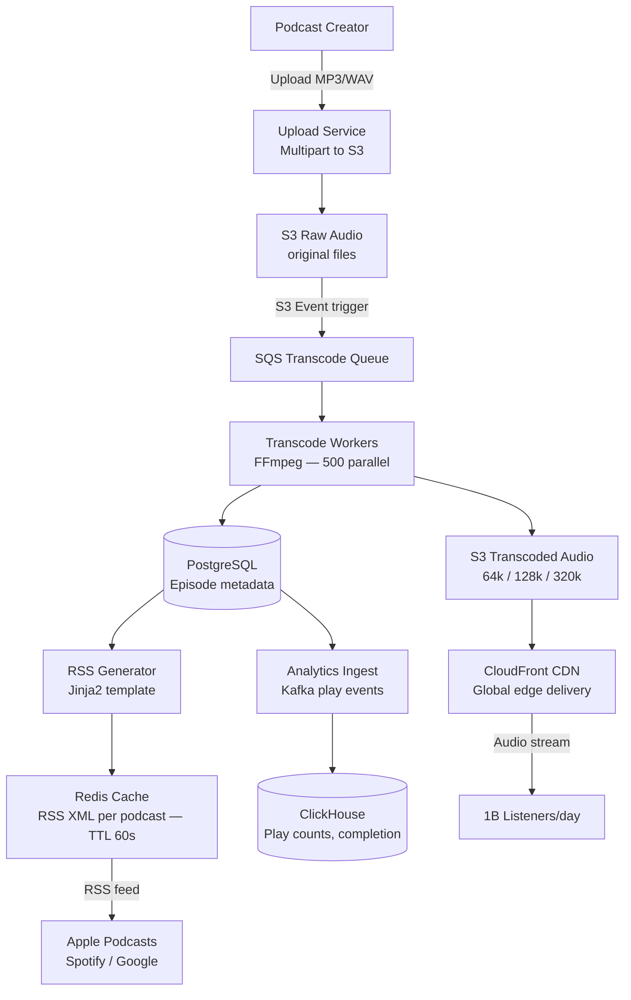
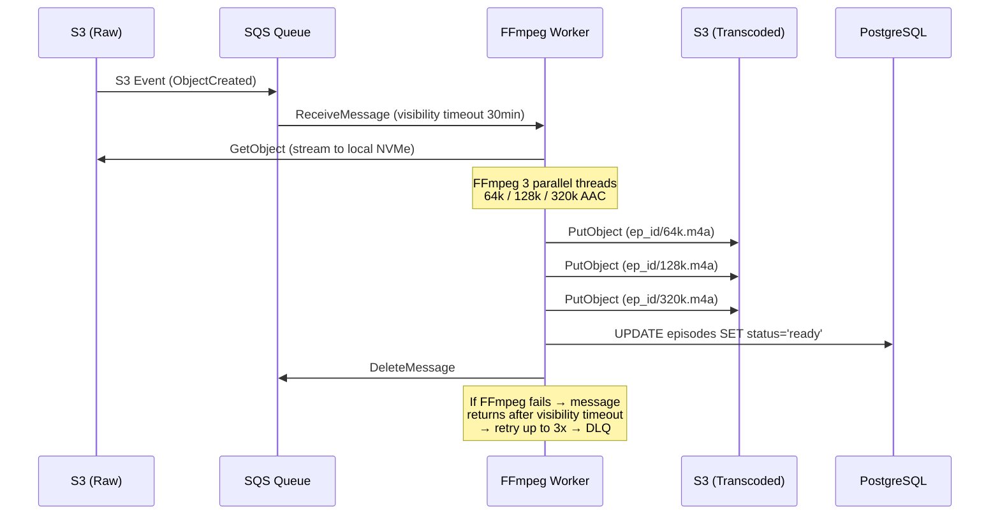
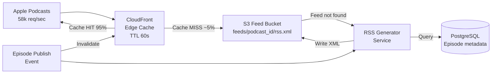

# Design a Podcast Hosting Platform

**Difficulty**: 🟡 Medium | **Codemania #67**
**Reading Time**: ~10 min
**Interview Frequency**: Medium

---

## The Core Problem

Hosting 100 million podcast episodes — accepting creator uploads, transcoding to multiple bitrates, generating RSS feeds, delivering audio to listeners globally, and tracking play analytics. The scale challenge is storage (100M episodes × 50 MB avg = 5 PB) and CDN delivery (1B plays/day).

---

## Functional Requirements

- Creators upload audio files (MP3, WAV, M4A); up to 2 GB per file
- Transcode to multiple bitrates: AAC 64k (low bandwidth), 128k (standard), 320k (high quality)
- Generate and serve RSS feeds for each podcast (Apple Podcasts, Spotify, Google Podcasts compatibility)
- Deliver audio globally with < 200ms time-to-first-byte
- Track analytics: total plays, completion rate per episode, listener geography
- Send notifications to subscribers when new episode is published

## Non-Functional Requirements

| Requirement | Target |
|-------------|--------|
| Storage | 100M episodes × 50 MB avg × 3 bitrates = 15 PB |
| Upload throughput | 10,000 concurrent uploads |
| CDN delivery | < 200ms TTFB globally, 99.9% cache hit rate |
| RSS freshness | Feed updates within 60s of new episode publish |
| Analytics latency | Play count visible to creator within 5 minutes |

---

## Back-of-Envelope Estimates

- **Storage**: 100M episodes × 50 MB × 3 bitrates = 15 PB (S3 + lifecycle to Glacier for old episodes)
- **Upload rate**: 100k new episodes/day × 50 MB = 5 TB/day inbound
- **Transcoding**: 100k uploads/day × 3 outputs × 30 minutes avg audio = 100k × 3 × 30min process time; need ~500 parallel transcoding workers
- **CDN plays**: 1B plays/day ÷ 86,400s = ~11,600 plays/sec; avg audio bitrate 128k → 16 KB/sec × 11,600 = 185 MB/sec sustained egress
- **RSS reads**: 500M podcast subscribers checking feeds daily = ~5,800 RSS requests/sec

---

## High-Level Architecture



---

## Key Design Decisions

### 1. Transcoding: On-Demand vs Pre-Computed

| Approach | On-Demand Transcoding | Pre-Computed Transcoding |
|----------|----------------------|--------------------------|
| Storage | Store only original; transcode at request time | Store 3 copies (3x storage) |
| Latency | 10–60s first-play delay while transcoding | Instant play (already transcoded) |
| CPU cost | Paid per play (wasteful for unpopular episodes) | Paid once at upload (efficient for popular) |
| Complexity | Transcode cache invalidation needed | Simpler — static files |

**Decision**: Pre-compute at upload time for all 3 bitrates. Audio transcoding is CPU-bound but fast (~3x realtime for AAC). The marginal storage cost (3x) is worth eliminating first-play latency for all listeners. For old episodes (>2 years, <100 plays), store only 128k and delete 64k/320k to save storage.

### 2. RSS Feed Generation: Pre-Generated vs Dynamic

| Approach | Pre-Generated RSS (cached XML) | Dynamic RSS (generated per request) |
|----------|-------------------------------|--------------------------------------|
| Latency | < 1ms (cache hit) | 50–200ms (database query) |
| Freshness | Stale by cache TTL | Always fresh |
| Scale | Handles 10k requests/sec with small Redis | Database bottleneck at scale |

**Decision**: Generate RSS XML on episode publish, cache in Redis with 60s TTL. On new episode, invalidate cache immediately. This serves 5,800 RSS requests/sec (all podcast apps checking for updates) with Redis, not the database.

### 3. Pull-Based RSS vs Push Notification

The RSS ecosystem is pull-based: podcast apps poll your feed URL every 1–24 hours. For real-time notification:
- **WebSub (formerly PubSubHubbub)**: Creator pings a hub; hub notifies subscribers immediately. Used by Apple Podcasts and Spotify for < 5 minute episode propagation.
- **Email/push**: Notify subscribers via email or mobile push within 5 minutes of publish.

---

## Audio Upload Flow

Large audio files (up to 2 GB) require multipart upload:
1. Creator requests presigned S3 multipart upload URL (valid 2 hours)
2. Client uploads directly to S3 in 50 MB chunks (parallel, resumable)
3. Client sends `CompleteMultipartUpload` signal
4. S3 event triggers SQS message → transcoding workers pick up

This bypasses the application server entirely for the large binary upload — no memory pressure on API servers.

---

## Analytics: Play Count and Completion Rate

Play events are streamed to Kafka (one event per 30-second listen checkpoint):
```json
{"episode_id": "ep123", "listener_id": "u456", "position_sec": 1800, "total_sec": 3600, "timestamp": "..."}
```

Flink aggregates:
- **Play count**: Count DISTINCT listener_id per episode (HyperLogLog for approximate, exact for billing)
- **Completion rate**: % of listeners who reach 90% of episode duration
- **Geography**: Group by listener IP geolocation

Results stored in ClickHouse, queried by creator dashboard.

---

## Top Interview Questions for This Problem

| Question | Tests |
|----------|-------|
| How would you handle a creator who deletes an episode that's currently being played by 100k listeners? | Soft delete, CDN TTL, grace period |
| How do podcast apps discover new episodes quickly (< 5 min latency)? | WebSub protocol, push-based feed updates |
| What bitrate do you serve to a listener on a slow 2G connection? | Adaptive bitrate selection based on network speed header |
| How do you prevent piracy / unauthorized redistribution of premium podcasts? | Signed CDN URLs with short TTL (15 min), episode-level access tokens |

---

## Common Mistakes

1. **Storing audio on the application server**: Audio files are GBs each; serve from S3+CDN, never from app servers.
2. **Dynamic RSS generation on every request**: With 5,800 RSS requests/sec and 10M podcasts, database queries collapse. Pre-generate and cache.
3. **Not handling resumable uploads**: Creators have unstable connections. Without multipart resumable upload, a 1 GB file upload failing at 99% is devastating UX.

---

## Related Concepts

- [Caching Fundamentals](../../02-caching/concepts/caching-fundamentals) — RSS XML caching strategy
- [Message Queue Basics](../../04-messaging/concepts/message-queue-basics) — SQS for transcoding queue

---

## Component Deep Dive 1: Audio Transcoding Pipeline

The transcoding pipeline is the most critical component of a podcast hosting platform. Every episode upload must be processed before listeners can play it, and transcoding directly determines upload-to-publish latency, storage costs, and audio quality across devices.

### How It Works Internally

When a creator completes an S3 multipart upload, an S3 event notification fires to an SQS queue. Transcoding workers (EC2 instances or ECS tasks running FFmpeg) pull jobs from the queue. Each worker:

1. Downloads the raw audio from S3 to local SSD (ephemeral storage, not EBS — 10x faster I/O)
2. Runs FFmpeg in parallel for three output profiles:
   - `ffmpeg -i input.wav -codec:a aac -b:a 64k output_64k.m4a`
   - `ffmpeg -i input.wav -codec:a aac -b:a 128k output_128k.m4a`
   - `ffmpeg -i input.wav -codec:a aac -b:a 320k output_320k.m4a`
3. Uploads all three outputs to S3 Transcoded bucket
4. Updates episode status in PostgreSQL (`status = 'ready'`, `duration_sec`, `file_size_bytes` per bitrate)
5. Publishes a "transcoding complete" event to SNS → triggers RSS regeneration and subscriber notifications
6. Deletes local temp files

### Why Naive Approaches Fail at Scale

**Naive approach 1: Transcode synchronously in the upload API.** At 100k uploads/day (1.15/sec average, but bursty at 50–100/sec during peak hours), a 30-minute audio file takes ~10 seconds of CPU to transcode to AAC. Doing this synchronously blocks the upload API response and requires the API server to have enough CPU for concurrent transcoding — each c5.xlarge can handle ~4 parallel transcodes, so 100 simultaneous uploads would need 25 API servers just for CPU.

**Naive approach 2: Single-threaded FFmpeg per episode.** FFmpeg can use multiple cores (`-threads 0` flag), but running three sequential bitrate passes is wasteful. Each pass is independent — run all three in parallel with Python's `subprocess` pool and a thread per output profile. This cuts per-episode processing time from 3x serial to 1x parallel (bounded by CPU, not wall clock).

**Naive approach 3: Using EBS-backed volumes for temp storage.** EBS throughput is ~125 MB/sec for gp2. A 2 GB upload to local NVMe SSD reads at 3,500 MB/sec. On a c5d.2xlarge with local NVMe, a 200 MB episode file is fully read in 0.06 seconds vs 1.6 seconds on EBS.

### Transcoding Pipeline Internals



### Trade-off Table: Transcoding Implementation Options

| Approach | Latency (100 MB file) | Cost per 1M episodes | Failure Recovery | Trade-off |
|----------|-----------------------|----------------------|------------------|-----------|
| EC2 spot fleet + SQS | 45–90s | ~$800 (spot pricing) | Message visibility timeout → auto retry | Spot interruption risk; need checkpointing |
| AWS Elastic Transcoder | 60–120s | ~$4,500 (managed) | Managed retry, SNS notifications | 5x cost; less flexible codec control |
| AWS MediaConvert | 30–60s | ~$2,000 | Managed retry, CloudWatch events | Good balance; less FFmpeg flexibility |
| Kubernetes job queue | 30–60s | ~$600 (own infra) | Job resubmission via controller | Ops overhead; best cost at scale |

**Decision at scale**: EC2 spot fleet for cost efficiency. Use Spot interruption notices (2-minute warning) to checkpoint progress — save partially transcoded segments to S3 and resume on a new instance. For episodes under 10 minutes (80% of all content), the full transcode finishes well within the 2-minute warning window.

---

## Component Deep Dive 2: RSS Feed Generation and Delivery

RSS is the distribution backbone of podcasting. Apple Podcasts, Spotify, Amazon Music, and 40+ other apps all poll RSS feeds to discover new episodes. Getting RSS right means the difference between a new episode appearing in 30 seconds vs 24 hours.

### How RSS Feed Generation Works Internally

Each podcast has a canonical RSS feed URL: `https://feeds.example.com/podcasts/{podcast_id}/rss.xml`

The feed XML is generated from a template with:
- Channel-level metadata: title, description, author, cover art URL, language, categories
- Item elements: one `<item>` per episode with `<enclosure url>` pointing to CDN audio URL, duration, GUID, publish date

At 10M podcasts with 100M episodes total, generating RSS dynamically on every request is unsustainable. The solution is event-driven pre-generation:

1. On episode publish, a background job renders the RSS XML Jinja2 template from PostgreSQL data
2. The rendered XML is stored in Redis with key `rss:{podcast_id}` and TTL of 300 seconds (5 minutes)
3. The rendered XML is also written to S3 as `feeds/{podcast_id}/rss.xml` (persistent backup)
4. CloudFront is configured to serve `feeds/{podcast_id}/rss.xml` from S3 with Cache-Control: max-age=60
5. On new episode publish, the system issues a CloudFront invalidation for that specific feed URL

### Scale Behavior at 10x Load

At baseline: 5,800 RSS requests/sec across 10M podcasts.
At 10x: 58,000 RSS requests/sec.

With pure Redis caching, Redis memory scales linearly — 10M feeds × 50 KB avg XML = 500 GB in Redis. That's expensive and impractical.

Better approach: Two-tier caching.
- **Hot tier (Redis)**: Only the 100k most-requested feeds (top podcasts), TTL 60s, ~5 GB RAM
- **Warm tier (CloudFront)**: All feeds cached at CDN edge, served directly from S3 origin, Cache-Control 60s
- **Cold path**: Generate from PostgreSQL, write to S3, invalidate CloudFront

At 10x load, 95%+ of requests hit CloudFront edge nodes (no origin hit). The remaining 5% (new/niche podcasts) hit S3 origin — S3 handles millions of concurrent reads.

### RSS Architecture with Two-Tier Caching



### Trade-off: WebSub Push vs Poll-Based RSS Freshness

| Approach | Discovery Latency | Complexity | Adoption |
|----------|------------------|------------|----------|
| Standard RSS polling (1–24hr) | 1–24 hours | Zero setup | Universal |
| WebSub (PubSubHubbub) | < 2 minutes | Hub registration, ping on publish | Apple, Spotify, ~40% of apps |
| Direct API push (Spotify/Apple) | < 30 seconds | Per-platform integration | Only major platforms |

---

## Component Deep Dive 3: CDN Audio Delivery and Signed URLs

Audio delivery at 1B plays/day (185 MB/sec sustained egress) is pure CDN problem — the application servers are never in the hot path for audio bytes. But there are two non-obvious design decisions: adaptive bitrate selection and premium content protection.

### Adaptive Bitrate Selection

Podcast apps send a `Connection-Speed` header or the client detects bandwidth via JavaScript Fetch. The CDN (or a thin redirect service) maps this to a bitrate:

- Connection < 100 kbps → serve 64k AAC (8 KB/sec)
- Connection 100–1000 kbps → serve 128k AAC (16 KB/sec)
- Connection > 1000 kbps → serve 320k AAC (40 KB/sec)

Implementation: A lightweight Lambda@Edge function reads the `X-Network-Speed` header and rewrites the S3 key before CloudFront fetches. No origin hit — pure edge computation.

### Premium Content: Signed CDN URLs

For paid/subscriber-only episodes, public S3 URLs would allow anyone to share the link and bypass paywall. Solution: CloudFront signed URLs with 15-minute TTL.

1. Listener app authenticates to the API
2. API verifies subscription, generates CloudFront signed URL (`/episodes/{ep_id}/128k.m4a?Expires=...&Signature=...`)
3. Listener app initiates playback from the signed URL
4. CloudFront validates signature and expiry at edge — no origin hit for validation

The 15-minute TTL is a tradeoff: short enough to prevent sharing, long enough that the player doesn't need to refresh mid-episode for most content (average episode 42 minutes → needs 3 URL refreshes during playback; the app refreshes every 10 minutes proactively).

### Storage Lifecycle to Control Costs

| Age | Bitrates Stored | Storage Class | Monthly Cost per TB |
|-----|----------------|---------------|---------------------|
| 0–30 days | 64k, 128k, 320k | S3 Standard | $23 |
| 30 days–2 years | 128k only | S3 Standard-IA | $12.50 |
| 2+ years, <100 plays | 128k only | S3 Glacier | $4 |
| 2+ years, >100 plays | 128k, 320k | S3 Standard-IA | $12.50 |

This lifecycle policy reduces storage cost by ~60% vs keeping all three bitrates forever.

---

## Data Model

```sql
-- Core tables for podcast hosting platform

CREATE TABLE podcasts (
    podcast_id        UUID PRIMARY KEY DEFAULT gen_random_uuid(),
    creator_id        UUID NOT NULL REFERENCES creators(creator_id),
    title             VARCHAR(255) NOT NULL,
    description       TEXT,
    cover_art_s3_key  VARCHAR(512),            -- e.g. covers/podcast_id/cover.jpg
    rss_feed_slug     VARCHAR(100) UNIQUE NOT NULL,  -- used in feed URL
    language          CHAR(5) DEFAULT 'en-US',
    category_primary  VARCHAR(100),            -- Apple Podcasts category
    category_secondary VARCHAR(100),
    is_explicit       BOOLEAN DEFAULT false,
    is_active         BOOLEAN DEFAULT true,
    subscriber_count  INTEGER DEFAULT 0,
    created_at        TIMESTAMPTZ DEFAULT now(),
    updated_at        TIMESTAMPTZ DEFAULT now()
);

CREATE TABLE episodes (
    episode_id        UUID PRIMARY KEY DEFAULT gen_random_uuid(),
    podcast_id        UUID NOT NULL REFERENCES podcasts(podcast_id),
    title             VARCHAR(500) NOT NULL,
    description       TEXT,
    episode_number    INTEGER,
    season_number     INTEGER,
    duration_sec      INTEGER,                 -- total audio duration
    raw_s3_key        VARCHAR(512),            -- original upload: raw/episode_id/original.wav
    s3_key_64k        VARCHAR(512),            -- transcoded: audio/episode_id/64k.m4a
    s3_key_128k       VARCHAR(512),            -- transcoded: audio/episode_id/128k.m4a
    s3_key_320k       VARCHAR(512),            -- transcoded: audio/episode_id/320k.m4a
    file_size_64k     BIGINT,                  -- bytes
    file_size_128k    BIGINT,
    file_size_320k    BIGINT,
    transcode_status  VARCHAR(20) DEFAULT 'pending',  -- pending/processing/ready/failed
    publish_status    VARCHAR(20) DEFAULT 'draft',    -- draft/scheduled/published/deleted
    published_at      TIMESTAMPTZ,
    scheduled_for     TIMESTAMPTZ,
    guid              VARCHAR(255) UNIQUE NOT NULL,   -- RSS GUID (immutable once published)
    is_explicit       BOOLEAN DEFAULT false,
    is_premium        BOOLEAN DEFAULT false,
    created_at        TIMESTAMPTZ DEFAULT now(),
    updated_at        TIMESTAMPTZ DEFAULT now()
);

-- Composite index for RSS feed generation (ordered episodes per podcast)
CREATE INDEX idx_episodes_podcast_published
    ON episodes(podcast_id, published_at DESC)
    WHERE publish_status = 'published';

-- Index for creator dashboard (latest episodes by transcode status)
CREATE INDEX idx_episodes_podcast_status
    ON episodes(podcast_id, transcode_status, created_at DESC);

CREATE TABLE play_events_raw (
    -- Written to via Kafka → ClickHouse, not Postgres
    -- Kept here for schema documentation only
    event_id          UUID,
    episode_id        UUID,
    listener_id       UUID,                    -- anonymous hash if not logged in
    session_id        UUID,                    -- groups consecutive play events
    position_sec      INTEGER,                 -- playback position at checkpoint
    total_sec         INTEGER,                 -- episode total duration
    bitrate_served    SMALLINT,                -- 64, 128, or 320 kbps
    ip_country        CHAR(2),                 -- from MaxMind GeoIP at ingest
    client_type       VARCHAR(50),             -- apple_podcasts, spotify, web, etc.
    event_ts          TIMESTAMPTZ
    -- Stored in ClickHouse, partitioned by toYYYYMM(event_ts)
);

-- ClickHouse materialized view for creator analytics
-- CREATE MATERIALIZED VIEW episode_play_stats
-- ENGINE = AggregatingMergeTree()
-- PARTITION BY toYYYYMM(day)
-- ORDER BY (episode_id, day)
-- AS SELECT
--     episode_id,
--     toDate(event_ts) AS day,
--     uniqState(listener_id) AS unique_listeners_state,
--     countState() AS total_checkpoints_state,
--     countIfState(position_sec >= total_sec * 0.9) AS completions_state
-- FROM play_events_raw GROUP BY episode_id, day;

CREATE TABLE subscriptions (
    subscription_id   UUID PRIMARY KEY DEFAULT gen_random_uuid(),
    listener_id       UUID NOT NULL,
    podcast_id        UUID NOT NULL REFERENCES podcasts(podcast_id),
    notification_pref VARCHAR(20) DEFAULT 'push',  -- push/email/none
    subscribed_at     TIMESTAMPTZ DEFAULT now(),
    UNIQUE(listener_id, podcast_id)
);

CREATE INDEX idx_subscriptions_podcast ON subscriptions(podcast_id)
    WHERE notification_pref != 'none';
```

---

## Scale Bottlenecks

| Traffic Level | Component That Breaks | Symptoms | Mitigation |
|---------------|----------------------|----------|------------|
| 10x baseline (100k uploads/day) | Transcoding worker queue depth grows | Episodes take 30+ min to go live; SQS visible message count spikes | Auto-scale worker ASG on SQS `ApproximateNumberOfMessages` metric; target 500 messages → scale out |
| 10x plays (10B plays/day) | CDN egress cost spikes; origin hit rate increases | Increased CloudFront origin requests; S3 request costs | Multi-CDN routing (CloudFront + Fastly) with geo-based DNS; pre-warm cache for newly published episodes |
| 100x RSS (580k RSS req/sec) | Redis memory exhausted (5 GB → 50 GB for hot feeds) | Redis evictions; cache miss storm hits PostgreSQL | Promote RSS XML from Redis to S3+CloudFront as primary; Redis only for the top 10k feeds; add read replicas for PostgreSQL |
| 100x analytics (100B play events/day) | Kafka partition lag; ClickHouse ingest backlog | Creator dashboard shows play counts 30+ min stale | Increase Kafka partitions (100 → 1000 per topic); add ClickHouse shards; use pre-aggregated counters in Redis for real-time counts (flush to ClickHouse every 60s) |
| 1000x storage (15 EB) | S3 API rate limits on metadata operations | ListObjectsV2 throttling; slow episode status checks | Shard raw uploads across multiple S3 prefixes (UUID prefix naturally shards); use DynamoDB for episode-to-S3-key mapping instead of scanning S3 |

---

## How Spotify Built Their Podcast Platform

Spotify acquired Anchor (podcast hosting platform) in February 2019 for approximately $150M and absorbed its infrastructure to power Spotify's creator-side podcast tools. Their engineering blog documents the migration from Anchor's monolithic Rails/Heroku stack to Spotify's internal microservices platform running on GCP.

**The scale Spotify operates at**: As of 2023, Spotify hosts 5 million+ podcasts with 100 million+ episodes. Their podcast catalog is ~35 petabytes of audio. Podcast listening accounts for ~25% of all audio hours on Spotify's platform — roughly 250 million podcast listener hours per month.

**Key technology choices**:

- **Audio storage**: GCS (Google Cloud Storage) rather than S3, using storage classes analogous to S3's tiering. Episodes older than 2 years with <500 plays are moved to Coldline storage (equivalent to Glacier), reducing storage cost by ~70% on long tail content.
- **Transcoding**: Spotify uses their internal "Nela" media pipeline — a distributed transcoding system that processes not just podcasts but also user-uploaded content. Nela uses a work-stealing scheduler over Kubernetes jobs, with each job containerized with FFmpeg and targeting ~99th percentile completion in 90 seconds for a 1-hour audio file.
- **RSS ingestion**: For podcasts originally hosted externally (e.g., a creator who uploads to Buzzsprout but links Spotify), Spotify runs a distributed RSS crawler — hundreds of Go-based workers polling ~5 million external RSS feeds, with adaptive polling frequency (popular shows polled every 15 minutes, inactive shows every 6 hours). This is fundamentally different from hosting — they're consuming RSS, not generating it.
- **Analytics non-obvious decision**: Spotify does not use raw play events for creator analytics. Instead, they track "streaming intent" — a proprietary metric that filters out plays under 60 seconds and bot/crawler traffic. This means Spotify's "plays" count is systematically lower than platforms that count any play. When Spotify published this methodology in 2021, several large podcasters saw their Spotify play counts drop 15–30% in one day — causing a PR crisis but ultimately improving advertiser trust in the numbers.

Source: Spotify Engineering Blog — "Podcast Hosting at Spotify" series (2020–2022), multiple talks at QCon and Kafka Summit.

---

## Interview Angle

**What the interviewer is testing:** Whether you can design a media pipeline that decouples upload from processing from delivery — and whether you understand the economics (storage, CDN egress, transcoding CPU) that dominate operational costs at scale.

**Common mistakes candidates make:**

1. **Serving audio directly from the application server**: Candidates describe an API endpoint like `GET /episodes/{id}/audio` that reads from a database or filesystem and streams back to the client. This fails immediately — a 128k AAC episode at 16 KB/sec × 11,600 concurrent plays = 185 MB/sec of outbound traffic through your API servers. A single c5.xlarge can handle ~1 GB/sec network, but you'd need 200+ servers just for audio egress, none of which are doing any useful compute. The correct answer is: audio is served entirely from CDN; the API only generates signed URLs.

2. **Forgetting the RSS ecosystem is pull-based**: Many candidates design a "push notification" system for episode distribution but don't realize that Apple Podcasts, Overcast, and most podcast apps operate on poll-based RSS. Without WebSub or equivalent push protocol, a new episode takes up to 24 hours to appear in all apps. The candidate should name WebSub and explain the hub-subscriber model.

3. **Designing analytics with strong consistency**: Candidates often propose storing play counts in PostgreSQL with a `UPDATE episodes SET play_count = play_count + 1` on every play event. At 11,600 plays/sec, this is 11,600 UPDATE operations/sec on a single row per popular episode — immediate row-level lock contention and write bottleneck. Correct answer: write play events to Kafka, aggregate with Flink/ClickHouse, with eventual consistency accepted (5-minute staleness is fine for creator dashboards).

**The insight that separates good from great answers:** Understanding that the RSS feed is the critical distribution primitive — not the audio delivery. CDN audio delivery is a solved problem (S3 + CloudFront). The hard problem is making RSS feeds update within 60 seconds across 10M podcasts without hammering your database. The two-tier caching strategy (Redis for hot feeds, S3+CloudFront for all feeds, event-driven invalidation on publish) shows you've thought about the actual distribution bottleneck.

---

## Failure Modes and Operational Runbooks

### Failure 1: Transcoding Worker Poison Pill

**Scenario**: A corrupt WAV file (zero-length or misformatted) causes FFmpeg to exit with code 1. The SQS message becomes visible again after the visibility timeout (30 minutes). Workers retry 3x, then the message moves to a Dead Letter Queue (DLQ).

**Symptoms**: Episode stays in `transcode_status = 'pending'` indefinitely. Creator sees "Processing..." spinner for hours. SQS DLQ depth metric fires an alarm.

**Operational response**:
1. Check DLQ for the episode_id
2. Download the raw file from S3 and manually run FFmpeg locally to reproduce the error
3. If the file is genuinely corrupt, update episode `transcode_status = 'failed'` and send creator a notification with retry instructions
4. If the file is valid but caused a worker bug, fix the worker and replay the DLQ message

**Prevention**: Add a validation step before transcoding — use `ffprobe` to verify the file has a valid audio stream, non-zero duration, and a supported codec. Reject invalid files with a 422 error at upload time, before they enter the queue.

### Failure 2: RSS Feed Serving Stale Episode List

**Scenario**: A creator publishes an episode, but podcast apps still show the old feed for 10+ minutes. The RSS cache was not invalidated properly.

**Root cause**: The episode publish event was published to SNS, but the RSS generator Lambda had a deployment that failed — it was still running the old version that didn't handle the new `scheduled_for` field correctly. The cache invalidation logic silently errored and returned 200.

**Symptoms**: CloudWatch shows RSS generator Lambda returning 200 but not writing to S3. Cache TTL expires normally every 60 seconds. Old XML is served.

**Fix**:
1. Add explicit write verification: after S3 PutObject, read back the object's ETag and compare with expected checksum
2. Publish a `rss_generated` metric to CloudWatch; alarm if rate drops below 1 per minute during active upload hours
3. Add a fallback: if the RSS generator service is unhealthy, serve the S3-stored XML directly (which may be slightly stale but is always valid)

### Failure 3: CDN Cache Stampede on Episode Launch

**Scenario**: A popular podcast with 10M subscribers publishes a new episode. Within 60 seconds, millions of podcast apps simultaneously request the new episode audio URL. CloudFront cache has not been warmed for the new S3 object yet.

**What happens**: The first request to each of CloudFront's 600+ edge nodes goes to S3 origin. At 10M subscribers × (1/600 nodes each) = ~16,700 simultaneous origin requests per edge node. S3 handles millions of concurrent requests, but this spike can cause elevated P99 latency (500ms → 5s) on the first 30 seconds.

**Mitigation**: Pre-warm the CDN cache before publishing. Workflow:
1. Transcoding completes and uploads to S3
2. RSS feed is NOT updated yet (episode still in `draft` state in DB)
3. A background job sends cache-warming HTTP requests to each major CloudFront region via a warming tool
4. After warming is confirmed (cache hit rate > 80%), the episode is published and RSS updated

For very large launches (10M+ subscribers), coordinate with CDN provider for assisted pre-warming (Fastly and CloudFront both offer this as a paid service).

---

## API Design

The creator-facing and listener-facing APIs have different access patterns and SLA requirements:

```
# Creator Upload API
POST /api/v1/podcasts/{podcast_id}/episodes
  Body: { title, description, episode_number, is_premium, scheduled_for }
  Returns: { episode_id, upload_url (presigned S3 multipart), upload_id }

POST /api/v1/episodes/{episode_id}/complete-upload
  Body: { upload_id, parts: [{part_number, etag}] }
  Returns: { episode_id, transcode_status: "pending" }

GET /api/v1/episodes/{episode_id}/status
  Returns: { transcode_status, publish_status, progress_pct }
  # Polled by creator dashboard every 5s

POST /api/v1/episodes/{episode_id}/publish
  Returns: { episode_id, published_at, rss_updated_at }

# Listener Playback API
GET /api/v1/episodes/{episode_id}/stream
  Headers: X-Auth-Token (required for premium), X-Network-Speed (kbps)
  Returns: 302 redirect to signed CDN URL
  # For free content: redirect to public CDN URL (no auth needed)
  # For premium: verify subscription, generate 15-min signed URL

POST /api/v1/episodes/{episode_id}/progress
  Body: { position_sec, total_sec, session_id }
  Returns: 204 No Content
  # Batched client-side; sent every 30 seconds during playback
```

Rate limits:
- Creator upload initiation: 10 concurrent per creator account
- Progress events: 1 per 10 seconds per session (client-side throttle)
- RSS feed reads: unlimited (served by CDN, not API servers)

---

## Key Numbers to Remember

| Metric | Value | Context |
|--------|-------|---------|
| Storage per episode | 150 MB | 50 MB original × 3 bitrates (64k/128k/320k AAC) |
| Total storage at 100M episodes | 15 PB | Across all bitrates; ~9 PB after lifecycle tiering |
| Transcoding workers needed | 500 | At 100k uploads/day × 3 outputs × ~90s per episode |
| CDN egress sustained | 185 MB/sec | 1B plays/day × 128k avg bitrate |
| RSS requests/sec | 5,800 | 500M subscribers × daily poll ÷ 86,400s |
| Kafka play event rate | 11,600 events/sec | 1B plays/day ÷ 86,400s, one event per 30s checkpoint |
| CDN cache hit target | 99.9% | Any cache miss adds ~50ms latency and costs $0.09/GB origin egress |
| Signed URL TTL | 15 minutes | Premium content; balances security vs re-fetch overhead |
| RSS feed max size | 1 MB | Apple Podcasts hard limit; must paginate feeds with >200 episodes |
| WebSub propagation | < 2 minutes | From episode publish to Apple Podcasts/Spotify discovering new episode |
| Multipart upload chunk size | 50 MB | Optimal for S3 multipart; parallelizes nicely for 2 GB max file size |
| FFmpeg AAC transcode speed | ~3x realtime | 30-min audio transcodes in ~10s on a single c5.xlarge vCPU |
| S3 Glacier retrieval latency | 3–5 hours (standard) | Use Expedited retrieval ($0.03/GB) for urgent old episode access |
| Max RSS items (Apple Podcasts) | 300 items | Feeds with >300 items must use paging extensions or truncate to recent |
| ClickHouse ingest rate | 500k rows/sec per node | Single ClickHouse node handles full play event stream at 1B plays/day |
| Transcoding queue SLA | 90s P99 | Episode goes live within 90 seconds of S3 upload completion |
| Creator dashboard analytics lag | 5 minutes | Acceptable eventual consistency; Flink micro-batch window |
| Average episode duration | 42 minutes | Industry average; drives signed URL refresh strategy |

---

## 📚 Resources & References

| Resource | Type | What You'll Learn |
|----------|------|------------------|
| [ByteByteGo — Design YouTube](https://www.youtube.com/@ByteByteGo) | 📺 YouTube | Video/audio upload, transcoding pipeline, CDN delivery |
| [Spotify Engineering Blog](https://engineering.atspotify.com) | 📖 Blog | Podcast platform architecture and scaling lessons |
| [RSS 2.0 Specification](https://www.rssboard.org/rss-specification) | 📚 Docs | Official RSS feed format for podcast interoperability |
| [High Scalability — Media Streaming](https://highscalability.com) | 📖 Blog | CDN delivery, adaptive bitrate, media storage patterns |
| [AWS Elastic Transcoder vs MediaConvert](https://aws.amazon.com/blogs/media/aws-media-services-and-the-move-to-aws-elemental-mediaconvert/) | 📖 Blog | Choosing the right managed transcoding service on AWS |
| [WebSub Specification (W3C)](https://www.w3.org/TR/websub/) | 📚 Docs | Push-based feed subscription protocol replacing PubSubHubbub |
| [FFmpeg Documentation](https://ffmpeg.org/ffmpeg.html) | 📚 Docs | AAC encoding options, bitrate control, parallel processing flags |
| [ClickHouse — Fast Analytics](https://clickhouse.com/docs/en/intro) | 📚 Docs | Columnar storage for high-ingest analytics workloads like play events |
