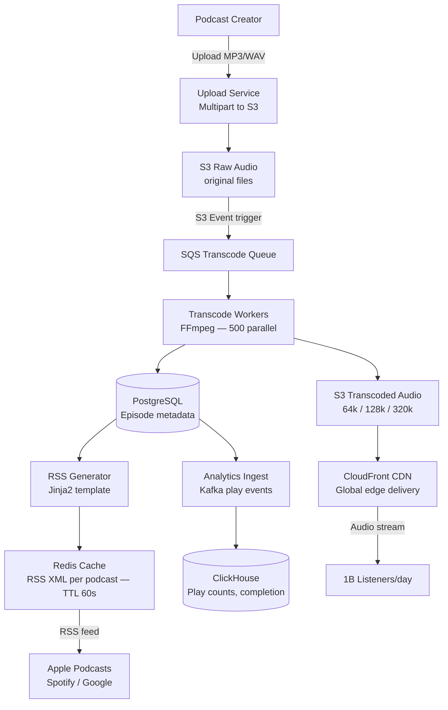

# Design a Podcast Hosting Platform

**Difficulty**: 🟡 Medium | **Codemania #67**
**Reading Time**: ~10 min
**Interview Frequency**: Medium

---

## The Core Problem

Hosting 100 million podcast episodes — accepting creator uploads, transcoding to multiple bitrates, generating RSS feeds, delivering audio to listeners globally, and tracking play analytics. The scale challenge is storage (100M episodes × 50 MB avg = 5 PB) and CDN delivery (1B plays/day).

---

## Functional Requirements

- Creators upload audio files (MP3, WAV, M4A); up to 2 GB per file
- Transcode to multiple bitrates: AAC 64k (low bandwidth), 128k (standard), 320k (high quality)
- Generate and serve RSS feeds for each podcast (Apple Podcasts, Spotify, Google Podcasts compatibility)
- Deliver audio globally with < 200ms time-to-first-byte
- Track analytics: total plays, completion rate per episode, listener geography
- Send notifications to subscribers when new episode is published

## Non-Functional Requirements

| Requirement | Target |
|-------------|--------|
| Storage | 100M episodes × 50 MB avg × 3 bitrates = 15 PB |
| Upload throughput | 10,000 concurrent uploads |
| CDN delivery | < 200ms TTFB globally, 99.9% cache hit rate |
| RSS freshness | Feed updates within 60s of new episode publish |
| Analytics latency | Play count visible to creator within 5 minutes |

---

## Back-of-Envelope Estimates

- **Storage**: 100M episodes × 50 MB × 3 bitrates = 15 PB (S3 + lifecycle to Glacier for old episodes)
- **Upload rate**: 100k new episodes/day × 50 MB = 5 TB/day inbound
- **Transcoding**: 100k uploads/day × 3 outputs × 30 minutes avg audio = 100k × 3 × 30min process time; need ~500 parallel transcoding workers
- **CDN plays**: 1B plays/day ÷ 86,400s = ~11,600 plays/sec; avg audio bitrate 128k → 16 KB/sec × 11,600 = 185 MB/sec sustained egress
- **RSS reads**: 500M podcast subscribers checking feeds daily = ~5,800 RSS requests/sec

---

## High-Level Architecture



---

## Key Design Decisions

### 1. Transcoding: On-Demand vs Pre-Computed

| Approach | On-Demand Transcoding | Pre-Computed Transcoding |
|----------|----------------------|--------------------------|
| Storage | Store only original; transcode at request time | Store 3 copies (3x storage) |
| Latency | 10–60s first-play delay while transcoding | Instant play (already transcoded) |
| CPU cost | Paid per play (wasteful for unpopular episodes) | Paid once at upload (efficient for popular) |
| Complexity | Transcode cache invalidation needed | Simpler — static files |

**Decision**: Pre-compute at upload time for all 3 bitrates. Audio transcoding is CPU-bound but fast (~3x realtime for AAC). The marginal storage cost (3x) is worth eliminating first-play latency for all listeners. For old episodes (>2 years, <100 plays), store only 128k and delete 64k/320k to save storage.

### 2. RSS Feed Generation: Pre-Generated vs Dynamic

| Approach | Pre-Generated RSS (cached XML) | Dynamic RSS (generated per request) |
|----------|-------------------------------|--------------------------------------|
| Latency | < 1ms (cache hit) | 50–200ms (database query) |
| Freshness | Stale by cache TTL | Always fresh |
| Scale | Handles 10k requests/sec with small Redis | Database bottleneck at scale |

**Decision**: Generate RSS XML on episode publish, cache in Redis with 60s TTL. On new episode, invalidate cache immediately. This serves 5,800 RSS requests/sec (all podcast apps checking for updates) with Redis, not the database.

### 3. Pull-Based RSS vs Push Notification

The RSS ecosystem is pull-based: podcast apps poll your feed URL every 1–24 hours. For real-time notification:
- **WebSub (formerly PubSubHubbub)**: Creator pings a hub; hub notifies subscribers immediately. Used by Apple Podcasts and Spotify for < 5 minute episode propagation.
- **Email/push**: Notify subscribers via email or mobile push within 5 minutes of publish.

---

## Audio Upload Flow

Large audio files (up to 2 GB) require multipart upload:
1. Creator requests presigned S3 multipart upload URL (valid 2 hours)
2. Client uploads directly to S3 in 50 MB chunks (parallel, resumable)
3. Client sends `CompleteMultipartUpload` signal
4. S3 event triggers SQS message → transcoding workers pick up

This bypasses the application server entirely for the large binary upload — no memory pressure on API servers.

---

## Analytics: Play Count and Completion Rate

Play events are streamed to Kafka (one event per 30-second listen checkpoint):
```json
{"episode_id": "ep123", "listener_id": "u456", "position_sec": 1800, "total_sec": 3600, "timestamp": "..."}
```

Flink aggregates:
- **Play count**: Count DISTINCT listener_id per episode (HyperLogLog for approximate, exact for billing)
- **Completion rate**: % of listeners who reach 90% of episode duration
- **Geography**: Group by listener IP geolocation

Results stored in ClickHouse, queried by creator dashboard.

---

## Top Interview Questions for This Problem

| Question | Tests |
|----------|-------|
| How would you handle a creator who deletes an episode that's currently being played by 100k listeners? | Soft delete, CDN TTL, grace period |
| How do podcast apps discover new episodes quickly (< 5 min latency)? | WebSub protocol, push-based feed updates |
| What bitrate do you serve to a listener on a slow 2G connection? | Adaptive bitrate selection based on network speed header |
| How do you prevent piracy / unauthorized redistribution of premium podcasts? | Signed CDN URLs with short TTL (15 min), episode-level access tokens |

---

## Common Mistakes

1. **Storing audio on the application server**: Audio files are GBs each; serve from S3+CDN, never from app servers.
2. **Dynamic RSS generation on every request**: With 5,800 RSS requests/sec and 10M podcasts, database queries collapse. Pre-generate and cache.
3. **Not handling resumable uploads**: Creators have unstable connections. Without multipart resumable upload, a 1 GB file upload failing at 99% is devastating UX.

---

## Related Concepts

- [Caching Fundamentals](../../02-caching/concepts/caching-fundamentals) — RSS XML caching strategy
- [Message Queue Basics](../../04-messaging/concepts/message-queue-basics) — SQS for transcoding queue

---

## 📚 Resources & References

| Resource | Type | What You'll Learn |
|----------|------|------------------|
| [ByteByteGo — Design YouTube](https://www.youtube.com/@ByteByteGo) | 📺 YouTube | Video/audio upload, transcoding pipeline, CDN delivery |
| [Spotify Engineering Blog](https://engineering.atspotify.com) | 📖 Blog | Podcast platform architecture and scaling lessons |
| [RSS 2.0 Specification](https://www.rssboard.org/rss-specification) | 📚 Book | Official RSS feed format for podcast interoperability |
| [High Scalability — Media Streaming](https://highscalability.com) | 📖 Blog | CDN delivery, adaptive bitrate, media storage patterns |
