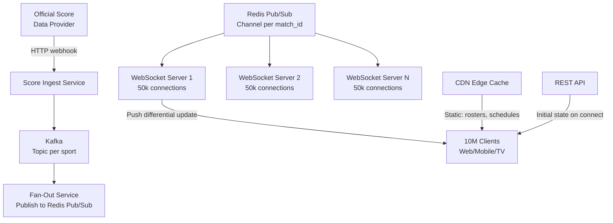

# Design a Real-Time Sports Scoring System

**Difficulty**: 🟡 Medium | **Codemania #65**
**Reading Time**: ~10 min
**Interview Frequency**: High

---

## The Core Problem

Delivering live sports scores to 10 million concurrent viewers with less than 1 second latency during peak match events (goal, wicket, touchdown). The hardest sub-problem is fan-out: a single score update must reach 10M clients within 1 second, which means distributing ~10M write operations per second at peak moments.

---

## Functional Requirements

- Ingest score updates from official data providers (< 500ms from event to ingest)
- Deliver score changes to all subscribed clients within 1 second
- Support static match metadata (team rosters, schedules) via REST/CDN
- Allow per-sport subscription (user subscribes to NFL only)
- Support web (browser), mobile (iOS/Android), and TV apps

## Non-Functional Requirements

| Requirement | Target |
|-------------|--------|
| Concurrent viewers | 10M during peak (World Cup final) |
| Update latency | < 1s from event to client |
| Throughput spike | 10M fan-outs per score event |
| Availability | 99.99% (sports fans are unforgiving) |
| Differential updates | Only send changed scores, not full state |

---

## Back-of-Envelope Estimates

- **Connections**: 10M WebSocket connections → ~10M sockets held open
- **Update frequency**: ~1 score event/minute per game, but up to 20 games simultaneously = 20 events/min
- **Fan-out at peak**: 1 event × 10M subscribers = 10M messages in <1s
- **WebSocket server capacity**: Each server handles ~50k connections → need 200+ WebSocket servers
- **Bandwidth per update**: 200 bytes/update × 10M clients = 2 GB/s egress at peak
- **CDN for static data**: Match schedules, rosters → cached at edge; 0 origin hits for read

---

## High-Level Architecture



---

## Key Design Decisions

### 1. WebSocket vs SSE vs Long Polling

| Dimension | WebSocket | SSE | Long Polling |
|-----------|-----------|-----|--------------|
| Protocol | Full-duplex TCP | HTTP/1.1 one-way | HTTP request-response |
| Browser support | Universal | All modern browsers | Universal |
| Server fan-out | Server pushes | Server pushes | Client re-polls |
| Proxy/firewall | Some issues | Works through CDN | Works everywhere |
| Latency | < 50ms | < 100ms | 500ms–5s |

**Decision**: WebSocket for web/mobile apps (full-duplex, low latency). SSE as fallback for environments where WebSocket is blocked by corporate proxies. Long polling for legacy TV apps.

### 2. Push vs Pull Fan-Out

| Approach | Push Fan-Out (server → all clients) | Pull Fan-Out (client polls) |
|----------|-------------------------------------|-----------------------------|
| Latency | Near-instant push | Poll interval determines latency |
| Server load | High at update spike | Predictable load |
| Missed updates | None — server pushes all | Client catches up on next poll |
| Scale challenge | 10M connections × push = huge burst | No burst — smooth load |

**Decision**: Push fan-out via WebSocket + Redis Pub/Sub. Each WebSocket server subscribes to Redis channels for the matches it serves. Score update arrives in Redis → all WebSocket servers get it → each pushes to its 50k connections. This distributes the fan-out horizontally.

### 3. Sticky Sessions for WebSocket

WebSocket connections are stateful (established TCP connection). Load balancers must use sticky sessions (IP hash or cookie-based) to route a client's HTTP upgrade request and subsequent WebSocket frames to the same server. Alternatively, the fan-out layer (Redis Pub/Sub) eliminates the need for strict stickiness — any server can serve any client.

### 4. Differential Updates

Instead of sending full match state (all scores, all stats) on every update, send only the delta:
```json
{
  "match_id": "NFL_2024_SB58",
  "event": "touchdown",
  "team": "KC",
  "score": {"KC": 17, "SF": 10},
  "clock": "Q3 7:42"
}
```
Client maintains local state and patches it. Reduces payload from ~2KB (full state) to ~200 bytes (delta), a 10x bandwidth reduction.

---

## Handling the Thundering Herd

When a World Cup goal is scored, all 10M clients simultaneously receive a push. Risks:
- **Redis Pub/Sub overload**: Shard by match_id across multiple Redis instances (each match on one Redis shard)
- **WebSocket server CPU spike**: Pre-serialize the JSON update once, broadcast the bytes to all sockets (avoid per-socket serialization)
- **Client reconnect storm**: If servers restart, 10M clients reconnect simultaneously. Use randomized reconnect delay (jitter: 1s–30s).

---

## Top Interview Questions for This Problem

| Question | Tests |
|----------|-------|
| Why Redis Pub/Sub instead of Kafka for the fan-out layer? | Kafka is durable log (good for ingest); Pub/Sub is ephemeral broadcast (good for fan-out). Latency difference: Kafka adds 10–50ms; Redis Pub/Sub adds < 1ms. |
| How do you handle a client that reconnects after missing 30 seconds of updates? | REST API call on reconnect to fetch current match state; then subscribe to live updates |
| How would you support 100M concurrent viewers for the Olympics? | Regional WebSocket clusters per geography, regional CDN edge for static, multiple Redis clusters |
| What if a WebSocket server crashes mid-match? | Clients reconnect (jitter backoff), load balancer routes to healthy server, client fetches current state |

---

## Common Mistakes

1. **Direct Kafka fan-out to WebSocket servers**: Kafka partitions limit parallelism. Use Kafka for ingest durability, Redis Pub/Sub for low-latency broadcast.
2. **Full state broadcast on every update**: Sending 2KB to 10M clients = 20GB/event. Use differential updates.
3. **No initial state on WebSocket connect**: New connections must call REST API to get current score before subscribing to live updates, or they'll display incorrect data.

---

## Related Concepts

- [Message Queue Basics](../../04-messaging/concepts/message-queue-basics) — Kafka ingest layer
- [Caching Fundamentals](../../02-caching/concepts/caching-fundamentals) — Redis Pub/Sub fan-out

---

## 📚 Resources & References

| Resource | Type | What You'll Learn |
|----------|------|------------------|
| [Hussein Nasser — WebSockets Deep Dive](https://www.youtube.com/@hnasr) | 📺 YouTube | WebSocket internals, scaling, proxies |
| [ByteByteGo — Real-Time Leaderboard](https://www.youtube.com/@ByteByteGo) | 📺 YouTube | Fan-out patterns, Redis sorted sets |
| [Scaling WebSockets — High Scalability](https://highscalability.com/scaling-websockets/) | 📖 Blog | Production lessons scaling to millions of connections |
| [Facebook Engineering — Real-Time Updates](https://engineering.fb.com) | 📖 Blog | Long-polling to push migration lessons |
