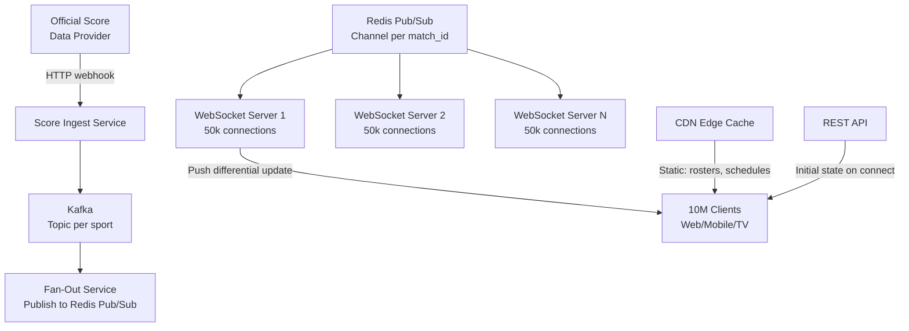
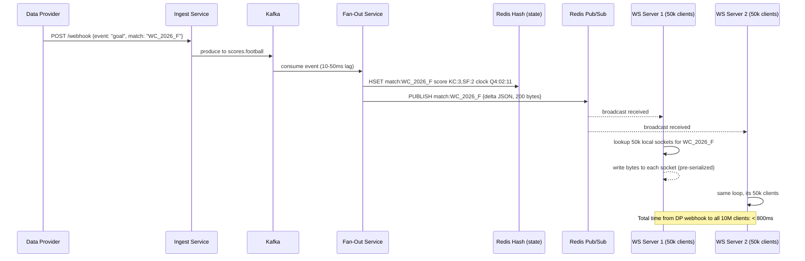
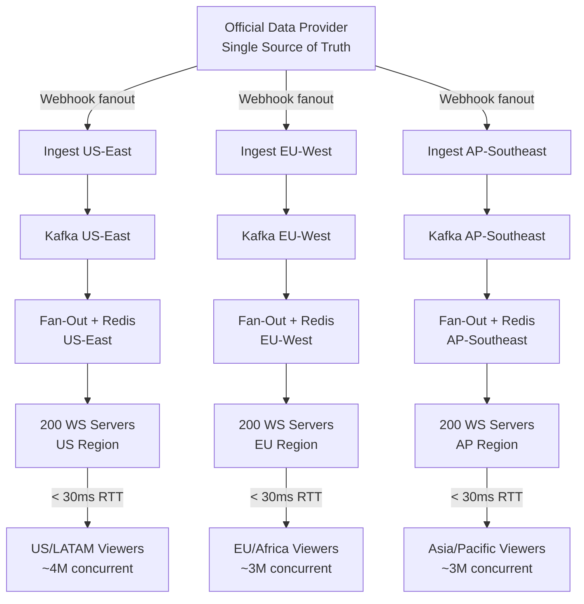

# Design a Real-Time Sports Scoring System

**Difficulty**: 🟡 Medium | **Codemania #65**
**Reading Time**: ~10 min
**Interview Frequency**: High

---

## The Core Problem

Delivering live sports scores to 10 million concurrent viewers with less than 1 second latency during peak match events (goal, wicket, touchdown). The hardest sub-problem is fan-out: a single score update must reach 10M clients within 1 second, which means distributing ~10M write operations per second at peak moments.

---

## Functional Requirements

- Ingest score updates from official data providers (< 500ms from event to ingest)
- Deliver score changes to all subscribed clients within 1 second
- Support static match metadata (team rosters, schedules) via REST/CDN
- Allow per-sport subscription (user subscribes to NFL only)
- Support web (browser), mobile (iOS/Android), and TV apps

## Non-Functional Requirements

| Requirement | Target |
|-------------|--------|
| Concurrent viewers | 10M during peak (World Cup final) |
| Update latency | < 1s from event to client |
| Throughput spike | 10M fan-outs per score event |
| Availability | 99.99% (sports fans are unforgiving) |
| Differential updates | Only send changed scores, not full state |

---

## Back-of-Envelope Estimates

- **Connections**: 10M WebSocket connections → ~10M sockets held open
- **Update frequency**: ~1 score event/minute per game, but up to 20 games simultaneously = 20 events/min
- **Fan-out at peak**: 1 event × 10M subscribers = 10M messages in <1s
- **WebSocket server capacity**: Each server handles ~50k connections → need 200+ WebSocket servers
- **Bandwidth per update**: 200 bytes/update × 10M clients = 2 GB/s egress at peak
- **CDN for static data**: Match schedules, rosters → cached at edge; 0 origin hits for read

---

## High-Level Architecture



---

## Key Design Decisions

### 1. WebSocket vs SSE vs Long Polling

| Dimension | WebSocket | SSE | Long Polling |
|-----------|-----------|-----|--------------|
| Protocol | Full-duplex TCP | HTTP/1.1 one-way | HTTP request-response |
| Browser support | Universal | All modern browsers | Universal |
| Server fan-out | Server pushes | Server pushes | Client re-polls |
| Proxy/firewall | Some issues | Works through CDN | Works everywhere |
| Latency | < 50ms | < 100ms | 500ms–5s |

**Decision**: WebSocket for web/mobile apps (full-duplex, low latency). SSE as fallback for environments where WebSocket is blocked by corporate proxies. Long polling for legacy TV apps.

### 2. Push vs Pull Fan-Out

| Approach | Push Fan-Out (server → all clients) | Pull Fan-Out (client polls) |
|----------|-------------------------------------|-----------------------------|
| Latency | Near-instant push | Poll interval determines latency |
| Server load | High at update spike | Predictable load |
| Missed updates | None — server pushes all | Client catches up on next poll |
| Scale challenge | 10M connections × push = huge burst | No burst — smooth load |

**Decision**: Push fan-out via WebSocket + Redis Pub/Sub. Each WebSocket server subscribes to Redis channels for the matches it serves. Score update arrives in Redis → all WebSocket servers get it → each pushes to its 50k connections. This distributes the fan-out horizontally.

### 3. Sticky Sessions for WebSocket

WebSocket connections are stateful (established TCP connection). Load balancers must use sticky sessions (IP hash or cookie-based) to route a client's HTTP upgrade request and subsequent WebSocket frames to the same server. Alternatively, the fan-out layer (Redis Pub/Sub) eliminates the need for strict stickiness — any server can serve any client.

### 4. Differential Updates

Instead of sending full match state (all scores, all stats) on every update, send only the delta:
```json
{
  "match_id": "NFL_2024_SB58",
  "event": "touchdown",
  "team": "KC",
  "score": {"KC": 17, "SF": 10},
  "clock": "Q3 7:42"
}
```
Client maintains local state and patches it. Reduces payload from ~2KB (full state) to ~200 bytes (delta), a 10x bandwidth reduction.

---

## Handling the Thundering Herd

When a World Cup goal is scored, all 10M clients simultaneously receive a push. Risks:
- **Redis Pub/Sub overload**: Shard by match_id across multiple Redis instances (each match on one Redis shard)
- **WebSocket server CPU spike**: Pre-serialize the JSON update once, broadcast the bytes to all sockets (avoid per-socket serialization)
- **Client reconnect storm**: If servers restart, 10M clients reconnect simultaneously. Use randomized reconnect delay (jitter: 1s–30s).

---

## Top Interview Questions for This Problem

| Question | Tests |
|----------|-------|
| Why Redis Pub/Sub instead of Kafka for the fan-out layer? | Kafka is durable log (good for ingest); Pub/Sub is ephemeral broadcast (good for fan-out). Latency difference: Kafka adds 10–50ms; Redis Pub/Sub adds < 1ms. |
| How do you handle a client that reconnects after missing 30 seconds of updates? | REST API call on reconnect to fetch current match state; then subscribe to live updates |
| How would you support 100M concurrent viewers for the Olympics? | Regional WebSocket clusters per geography, regional CDN edge for static, multiple Redis clusters |
| What if a WebSocket server crashes mid-match? | Clients reconnect (jitter backoff), load balancer routes to healthy server, client fetches current state |

---

## Common Mistakes

1. **Direct Kafka fan-out to WebSocket servers**: Kafka partitions limit parallelism. Use Kafka for ingest durability, Redis Pub/Sub for low-latency broadcast.
2. **Full state broadcast on every update**: Sending 2KB to 10M clients = 20GB/event. Use differential updates.
3. **No initial state on WebSocket connect**: New connections must call REST API to get current score before subscribing to live updates, or they'll display incorrect data.

---

## Related Concepts

- [Message Queue Basics](../../04-messaging/concepts/message-queue-basics) — Kafka ingest layer
- [Caching Fundamentals](../../02-caching/concepts/caching-fundamentals) — Redis Pub/Sub fan-out

---

## Component Deep Dive 1: Fan-Out Service + Redis Pub/Sub

The Fan-Out Service is the most critical component — it is the bottleneck that determines whether 10 million clients receive a score update within 1 second or experience a multi-second delay. Every other component feeds into or depends on fan-out correctness and speed.

### How It Works Internally

When the Score Ingest Service receives a goal event from the data provider, it publishes a normalized event onto a Kafka topic (e.g., `scores.football`). The Fan-Out Service consumes this Kafka event, then performs two actions: (1) persists the latest match state to a Redis Hash (for reconnecting clients), and (2) publishes the differential update to a Redis Pub/Sub channel keyed by `match:{match_id}`.

Every WebSocket Server process in the cluster has subscribed to the Redis Pub/Sub channels for the matches its connected clients care about. The moment the Fan-Out Service publishes to Redis, all WebSocket Servers receive the message simultaneously — Redis broadcasts it to all subscribers. Each WebSocket Server then iterates its local in-memory connection registry, finds all sockets subscribed to that `match_id`, and writes the pre-serialized bytes to each socket. Critically, JSON serialization happens **once** in the Fan-Out Service before the Redis publish, not per-client in the WebSocket Server.

### Why Naive Approaches Fail at Scale

A naive approach would have the Fan-Out Service directly iterate a database table of subscribers and call each WebSocket Server's API per subscriber. At 10 million clients this means 10M HTTP calls — clearly unworkable. Another naive approach is to have each WebSocket Server poll Kafka: with 200 servers and 20 active matches, that is 200 × 20 = 4,000 consumer-group partitions, multiplying operational complexity and adding 10–50ms Kafka consumer lag.

Redis Pub/Sub sidesteps both problems: the single publish operation is broadcast by Redis to all subscribers in sub-millisecond time. Each WebSocket Server receives the update exactly once regardless of how many clients it serves. The bottleneck then becomes the per-WebSocket-Server fan-out loop (50,000 socket writes), which completes in under 200ms on modern hardware.

### Redis Pub/Sub Channel Sharding

A single Redis instance can handle ~100k pub/sub subscribers and ~100k messages/sec before becoming a bottleneck. For peak events with 200 WebSocket Servers all subscribed to 20 active channels, a single Redis is fine. However, for a global tournament with 500 simultaneous matches and 1,000 WebSocket Servers, shard Redis by `match_id % N` across N Redis instances.



### Implementation Option Comparison

| Approach | Latency | Throughput | Trade-off |
|----------|---------|------------|-----------|
| Redis Pub/Sub | < 1ms broadcast to all WS servers | 500k msg/sec per Redis node | Ephemeral — missed messages not replayed; need Redis HA |
| Kafka fan-out (each WS server consumes) | 10–50ms (consumer lag) | Scales with partitions | Durable log; complex consumer group management |
| gRPC streaming (Fan-Out → WS servers) | < 5ms | Limited by open streams | No Redis dep; hard to manage 200+ bidirectional streams |

**Winner**: Redis Pub/Sub for fan-out because latency dominates the SLA requirement (< 1s end-to-end). Kafka is retained upstream for ingest durability and event replay.

---

## Component Deep Dive 2: WebSocket Connection Management

### How It Works Internally

Each WebSocket Server maintains two in-memory data structures:

1. **Connection Registry** (`Map<match_id, Set<socket_id>>`): Maps every active match to the set of WebSocket connections subscribed to it. When a client connects and sends a subscribe frame (`{"action":"subscribe","match_id":"WC_2026_F"}`), the server adds the socket to the relevant set. Unsubscribe and disconnect remove it.

2. **Socket Map** (`Map<socket_id, Socket>`): Maps socket IDs to the actual OS socket file descriptors for writing.

When a Redis Pub/Sub message arrives, the server does: `connections[match_id].forEach(id => socketMap[id].write(bytes))`. This tight loop on pre-allocated in-memory sets is extremely fast — a Node.js server can iterate and write to 50,000 sockets in under 150ms.

### Scale Behavior at 10x Load

At 10x load (100M concurrent viewers), each WebSocket Server would need to hold 500,000+ connections — exceeding single-server memory limits (~16GB RAM, ~64 bytes per connection = ~3.2GB just for pointers, not counting SSL state and Kernel socket buffers). Mitigations:

- **Horizontal scale**: Add more WebSocket servers (linear scaling). At 50k connections/server, 100M viewers need 2,000 WebSocket servers.
- **Connection multiplexing** (TV/STB clients): Smart TV apps can use SSE over HTTP/2 with a connection proxy that multiplexes thousands of device connections onto fewer upstream WebSocket connections.
- **Geographic distribution**: Route viewers to regional clusters. European viewers connect to EU WebSocket servers; Asian viewers to APAC. Reduces cross-continental WebSocket traffic.

```mermaid
graph LR
    LB[L4 Load Balancer\nIP-hash sticky] --> WS1[WS Server 1\n50k conns]
    LB --> WS2[WS Server 2\n50k conns]
    LB --> WSN[WS Server N\n50k conns]

    WS1 --> Sub1[Redis Sub\nmatch:WC_2026_F\nmatch:NFL_SB58]
    WS2 --> Sub2[Redis Sub\nmatch:WC_2026_F\nmatch:EPL_MCI_LIV]
    WSN --> SubN[Redis Sub\nmatch:WC_2026_F]

    WS1 --- CM1[Connection Map\nmatch:WC_2026_F → {sock1...sock30k}\nmatch:NFL_SB58 → {sock30k...sock50k}]
```

### Graceful Reconnect Protocol

WebSocket servers will crash — hardware failures, deploys, OOM kills. Without a reconnect protocol, 50,000 clients simultaneously reconnecting to the load balancer creates a stampede. The protocol:

1. Client detects socket close (TCP RST or clean close).
2. Client waits `jitter = random(1, 30)` seconds.
3. Client issues GET `/api/match/{id}/state` to fetch current score (REST, served by CDN or API tier).
4. Client opens a new WebSocket and subscribes.

The 1–30s jitter spreads 50,000 reconnects across 30 seconds — reducing peak reconnect rate from 50k/s to ~1,667/s.

---

## Component Deep Dive 3: State Persistence and Initial Load

### The Problem

A WebSocket connection is a live stream of deltas. A client connecting mid-match (or reconnecting after a crash) has no accumulated state — if you only send deltas, the client has no idea the current score is 3-2 after 78 minutes. You need a **state snapshot service**.

### Architecture Decision: Redis Hash as Match State Store

When the Fan-Out Service processes each score event, it writes the full current match state to a Redis Hash keyed by `match:{match_id}`. This is a side-effect write that costs < 1ms and runs alongside the Pub/Sub publish.

On WebSocket connect, the client flow is:

1. HTTP GET `/api/match/{match_id}/state` → API Gateway → reads `HGETALL match:{match_id}` from Redis → returns current score JSON.
2. Client stores the snapshot and renders the scoreboard.
3. Client opens WebSocket and sends `{"action":"subscribe","match_id":"..."}`.
4. Server records subscription and begins forwarding subsequent deltas.

The REST endpoint for step 1 can be cached at the CDN edge with a 2-second TTL, absorbing the initial-load traffic spike (all 10M viewers connecting 30 minutes before kickoff). With 10M clients connecting in a 30-minute window, the REST endpoint sees ~5,556 req/sec — easily handled by 10 API servers behind a CDN.

### What Happens Without This

Without initial state fetch, clients display "0-0" even when connecting to a match in the 80th minute with a 4-2 scoreline. Worse, some clients may receive an out-of-order delta and corrupt their local state. The REST snapshot is non-negotiable.

### Storage TTL

Match state in Redis should have TTL = match end time + 24 hours. After that, long-term state (for stats, history) is stored in PostgreSQL and served via a different API path, not the live WebSocket path.

---

## Data Model

### Kafka Event Schema (Avro)

```json
{
  "match_id": "WC_2026_FINAL_ARG_FRA",
  "event_id": "evt_20260701_082345_001",
  "event_type": "GOAL",
  "sport": "FOOTBALL",
  "timestamp_utc": "2026-07-01T08:23:45.123Z",
  "team_code": "ARG",
  "player_id": "messi_10",
  "score_home": 2,
  "score_away": 1,
  "game_clock": "67:12",
  "period": "SECOND_HALF",
  "extra": {
    "assist_player_id": "di_maria_7",
    "goal_type": "OPEN_PLAY"
  }
}
```

### Redis Hash: Match State

```
Key: match:WC_2026_FINAL_ARG_FRA
Fields:
  score_home         → "2"
  score_away         → "1"
  home_team          → "ARG"
  away_team          → "FRA"
  game_clock         → "67:12"
  period             → "SECOND_HALF"
  status             → "LIVE"
  last_event_type    → "GOAL"
  last_event_ts      → "2026-07-01T08:23:45.123Z"
  last_event_player  → "messi_10"
  venue              → "MetLife Stadium, NJ"
TTL: 90000 seconds (25 hours from match start)
```

### PostgreSQL: Historical Match Events

```sql
CREATE TABLE match_events (
    event_id        UUID PRIMARY KEY DEFAULT gen_random_uuid(),
    match_id        VARCHAR(64) NOT NULL,
    event_type      VARCHAR(32) NOT NULL,   -- GOAL, YELLOW_CARD, SUBSTITUTION
    sport           VARCHAR(16) NOT NULL,
    team_code       VARCHAR(8)  NOT NULL,
    player_id       VARCHAR(64),
    score_home      SMALLINT    NOT NULL,
    score_away      SMALLINT    NOT NULL,
    game_clock      VARCHAR(10),            -- "67:12"
    period          VARCHAR(32),            -- "SECOND_HALF"
    event_ts        TIMESTAMPTZ NOT NULL,
    raw_payload     JSONB,                  -- full provider payload for replay
    created_at      TIMESTAMPTZ DEFAULT NOW()
);

CREATE INDEX idx_match_events_match_id ON match_events(match_id, event_ts DESC);
CREATE INDEX idx_match_events_sport    ON match_events(sport, event_ts DESC);
CREATE INDEX idx_match_events_player   ON match_events(player_id) WHERE player_id IS NOT NULL;

CREATE TABLE matches (
    match_id        VARCHAR(64) PRIMARY KEY,
    sport           VARCHAR(16) NOT NULL,
    home_team       VARCHAR(64) NOT NULL,
    away_team       VARCHAR(64) NOT NULL,
    venue           VARCHAR(128),
    scheduled_start TIMESTAMPTZ NOT NULL,
    actual_start    TIMESTAMPTZ,
    actual_end      TIMESTAMPTZ,
    status          VARCHAR(16) NOT NULL DEFAULT 'SCHEDULED',  -- SCHEDULED, LIVE, FINAL
    competition     VARCHAR(64),                               -- "FIFA World Cup 2026"
    season          VARCHAR(16)                                -- "2026"
);

CREATE INDEX idx_matches_sport_status ON matches(sport, status);
CREATE INDEX idx_matches_scheduled    ON matches(scheduled_start);
```

### WebSocket Delta Payload (JSON over wire)

```json
{
  "type": "SCORE_UPDATE",
  "match_id": "WC_2026_FINAL_ARG_FRA",
  "seq": 42,
  "score": { "home": 2, "away": 1 },
  "clock": "67:12",
  "period": "SECOND_HALF",
  "event": "GOAL",
  "scorer": "messi_10",
  "ts": 1751385825123
}
```

Total payload: ~180 bytes. At 10M clients: 1.8 GB/s peak egress.

---

## Scale Bottlenecks

| Traffic Level | Component That Breaks | Symptoms | Mitigation |
|---------------|----------------------|----------|------------|
| 10x baseline (100M viewers) | WebSocket Server count | CPU saturation on fan-out loops; socket write queues back up | Scale WS servers horizontally to 2,000; add connection quotas |
| 10x baseline | Redis Pub/Sub single node | Redis CPU > 90%; message delivery lag > 200ms | Shard Redis by `match_id % 8`; use Redis Cluster |
| 100x baseline (1B viewers) | Network egress bandwidth | Datacenter egress cost exceeds budget; packet drops | Regional WebSocket clusters in US/EU/APAC/LATAM; local fan-out |
| 100x baseline | Load Balancer connection table | L4 LB runs out of connection state memory | Use anycast routing; multiple L4 LBs behind DNS round-robin |
| 1000x baseline | Data Provider ingest | Single webhook endpoint overwhelmed | Multi-region ingest endpoints; Kafka consumer group scaling |
| 1000x baseline | Kafka broker throughput | Consumer lag grows; score updates arrive late | Add Kafka partitions per sport; increase broker count to 50+ |

---

## How ESPN Built This

ESPN operates one of the largest real-time sports data pipelines in the world, serving 100+ million monthly active users across ESPN.com, the ESPN app, and ESPN+. Their architecture evolved significantly between 2012 and 2020.

**Early architecture (2012–2015)**: ESPN used HTTP long-polling with a 5-second poll interval. During peak moments (Super Bowl, College Football Playoffs), their origin servers received 500,000 concurrent long-poll requests, each consuming a thread. This model required ~5,000 application servers to hold the connection pool.

**Shift to Server-Sent Events (SSE, 2015–2018)**: ESPN migrated to SSE rather than full WebSocket because their score updates are unidirectional (server to client) and SSE works reliably through corporate proxies, which blocked WebSocket upgrades for many enterprise users watching during work hours. SSE over HTTP/1.1 reduced their connection overhead significantly — a single SSE connection held open uses far fewer kernel resources than an equivalent WebSocket.

**Current Architecture (2018–present)**: ESPN uses a combination of SSE for web clients and WebSocket for native iOS/Android apps. Their ingest pipeline uses an internal event bus (similar to Kafka) that receives score feeds from SportRadar and Stats Perform (their official data providers). Fan-out goes through an in-house push notification layer they call the "Score Engine" which maintains per-client topic subscriptions.

**Specific numbers from ESPN Engineering talks**: Their Score Engine handles 2 million concurrent SSE connections on peak NFL Sundays. Each score event for an NFL game reaches 1.2 million subscribed clients in under 400ms. They use pre-serialized protocol buffers (not JSON) internally, converting to JSON only at the edge gateway — reducing CPU load on fan-out servers by 60%.

**Non-obvious decision**: ESPN chose SSE over WebSocket as the primary protocol specifically because their CDN (Akamai) can terminate and relay SSE connections at edge nodes. This means a viewer in London receives a score push from the nearest Akamai PoP, not from ESPN's origin datacenter in Bristol, CT — reducing latency from ~150ms (transatlantic) to ~20ms (local PoP). WebSocket, by contrast, requires a persistent connection all the way to origin (CDNs cannot generally cache or relay WebSocket frames).

Source: ESPN Technology blog posts on ESPN Engineering (espneng.wordpress.com) and talks at QCon/Velocity conferences circa 2016–2019.

---

## Interview Angle

**What the interviewer is testing:** The interviewer wants to see whether you understand the distinction between durable message queues (Kafka) and ephemeral broadcast primitives (Redis Pub/Sub), and whether you can reason about the fan-out problem at 10M scale without defaulting to naive per-client polling or database-backed push.

**Common mistakes candidates make:**

1. **Using Kafka as the fan-out layer**: Kafka is a durable, partitioned log optimized for ordered consumption, not broadcast. With 10M clients as consumers, you cannot create 10M Kafka consumer instances. Candidates who suggest this haven't distinguished between ingest (use Kafka) and last-mile delivery (use Pub/Sub or WebSocket push).

2. **Ignoring the initial state problem**: Many candidates design a beautiful streaming system but forget that clients connecting mid-match need current score state, not just future deltas. Skipping the REST snapshot endpoint means users see "0-0" on connection, which is a product-breaking bug.

3. **Forgetting sticky sessions or explaining fan-out incorrectly**: Saying "WebSocket connections go to any server" is correct for the fan-out model using Redis Pub/Sub, but many candidates say it while meaning that a single TCP connection can migrate — which is physically impossible. Clarify: the Redis Pub/Sub model means any server can serve any client *because all servers receive all updates*, not because connections migrate.

**The insight that separates good from great answers:** Recognizing that pre-serializing the JSON update once in the Fan-Out Service (before publishing to Redis) and broadcasting raw bytes to all sockets — rather than serializing once per socket in each WebSocket server — reduces CPU usage on WS servers by a factor of 50,000x at peak. This is the difference between 200 servers and 10,000 servers for the same load. Great candidates also mention that JSON can be replaced with MessagePack or Protocol Buffers to further reduce egress bandwidth by 40–60%.

---

## Key Numbers to Remember

| Metric | Value | Context |
|--------|-------|---------|
| WebSocket connections per server | 50,000 | Typical Node.js/Go server with 16GB RAM |
| Redis Pub/Sub broadcast latency | < 1ms | Single Pub/Sub publish to all subscribers |
| Kafka consumer lag (ingest) | 10–50ms | Under normal load with proper partitioning |
| Differential update payload | ~180–200 bytes | vs ~2KB for full match state (10x reduction) |
| Peak egress at 10M viewers | 1.8–2 GB/s | 180 bytes × 10M clients per score event |
| WebSocket servers for 10M clients | 200 servers | At 50k connections/server |
| WebSocket servers for 100M clients | 2,000 servers | Linear horizontal scale |
| Reconnect jitter window | 1–30 seconds | Spreads 50k reconnects from 50k/s to ~1.7k/s |
| CDN cache TTL for static match data | 300–3,600 seconds | Rosters, schedules; eliminates origin reads |
| ESPN peak SSE connections (NFL Sunday) | 2 million | Concurrent SSE connections at peak |

---

## Failure Modes and Operational Runbook

Real-time systems fail in ways that are invisible until a high-profile event exposes them. Below are the four most common failure scenarios and how to handle each operationally.

### Failure 1: Redis Pub/Sub Node Goes Down Mid-Match

**Symptom**: WebSocket Servers stop receiving score updates. Clients see frozen scores. No errors on the client side — the WebSocket connection remains open, but no new frames arrive.

**Detection**: Alert on Redis Pub/Sub message rate dropping below 1 msg/min during a LIVE match. Monitor with `redis-cli MONITOR` sampling or a synthetic probe that publishes a heartbeat every 10s to each match channel and verifies receipt on subscriber side.

**Mitigation**:
- Redis Sentinel or Redis Cluster with automatic failover (< 30s failover window).
- Fan-Out Service should reconnect to Redis and re-publish in-flight events on reconnect.
- WebSocket Servers should track "last update received" timestamp per match channel and alert if > 60s with no update during a LIVE match.

### Failure 2: Score Ingest Webhook Fails (Data Provider Outage)

**Symptom**: Official score updates stop arriving. Scores freeze. This is often indistinguishable from "no scoring activity" in a low-scoring sport.

**Detection**: The Data Provider SLA typically guarantees a heartbeat message every 30s even when no score events occur. Alert if no heartbeat received for > 60s on a LIVE match.

**Mitigation**:
- Subscribe to a secondary data provider (e.g., primary: SportRadar, fallback: Stats Perform). Fan-Out Service deduplicates by `event_id`.
- Display a "Score updates may be delayed" banner on the client UI when ingest heartbeat is missed.
- For Kafka ingest: the topic retains events for 7 days. If the Fan-Out Service crashes and recovers, it replays from the last committed offset — no events are lost.

### Failure 3: WebSocket Server OOM Kill Under Connection Spike

**Symptom**: A WebSocket server process is killed by the kernel (OOM). Its 50,000 connections drop simultaneously. All 50,000 clients reconnect within seconds.

**Detection**: Monitor WebSocket server RSS memory. Alert at 80% of container memory limit. Pre-scale before expected traffic spikes (kickoff times, half-time return).

**Mitigation**:
- Kubernetes HPA on connection count metric (custom metric via Prometheus). Pre-scale 15 minutes before scheduled match kickoff.
- Per-connection memory budget: use typed arrays (Go slices, not interface{} maps) for the connection registry. Each connection object should be under 1KB.
- Circuit breaker at the load balancer: if a WebSocket server's connection count exceeds 45,000, stop routing new connections to it and let new clients go to less-loaded servers.

### Failure 4: Clock Skew Between Score Events and Client Clocks

**Symptom**: Clients display events out of order — "Goal at 67:12" appears after "Yellow card at 67:45". This happens when two events arrive in rapid succession and network jitter delivers them to different WebSocket servers with slightly different ordering.

**Mitigation**:
- Each delta includes a monotonic `seq` field (sequence number per match, incremented by the Fan-Out Service).
- Clients buffer out-of-order deltas and apply them in `seq` order. Gap in `seq` triggers a REST fetch for missed events.
- The Fan-Out Service uses a single-threaded write path per match channel to guarantee seq ordering before publishing to Redis.

---

## Capacity Planning Worksheet

Use this to size infrastructure before a major event (World Cup Final, Super Bowl).

```
Expected peak concurrent viewers (V): e.g., 10,000,000
WebSocket servers needed = ceil(V / 50,000) = 200

Expected score events per minute (E): e.g., 2 (both teams scoring)
Fan-out messages per minute = V × E = 20,000,000

Redis Pub/Sub throughput needed = E msg/sec × (WS_servers) subscribers
  = 2/60 msg/sec × 200 = ~7 msg/sec to Redis (trivial)

Peak egress bandwidth = V × delta_size_bytes × E_per_sec
  = 10,000,000 × 200B × (2/60) = ~66 MB/s sustained, ~2 GB/s burst

Kafka ingest throughput = E × avg_event_size = 2/min × 500B = trivial
Kafka is never the bottleneck for sports scoring.

Redis state writes per second = E = 2/60 per match × concurrent_matches
  = 2/60 × 20 matches = < 1 write/sec (completely trivial)
```

Key insight from the worksheet: **Kafka and Redis are never the bottleneck**. The bottleneck is always either (a) WebSocket server connection count, or (b) network egress bandwidth. Size infrastructure accordingly — invest in horizontal WS server scaling and CDN egress capacity, not in Kafka or Redis.

---

## Multi-Region Architecture for Global Events

For events like the FIFA World Cup or the Olympics where viewership is truly global, a single-region WebSocket cluster cannot deliver < 1s latency to viewers in Asia, Europe, and the Americas simultaneously. The solution is active-active regional deployment.



### Key Multi-Region Decisions

**Data Provider to Multi-Region Ingest**: The official data provider sends the same webhook payload to ingest endpoints in each region simultaneously. This adds < 50ms for the extra HTTP round trips to distant regions and ensures each regional cluster is fully autonomous — a US datacenter outage does not affect EU viewers.

**Avoiding Cross-Region Fan-Out**: A tempting but wrong approach is to have a single central Kafka cluster that all regions consume. Cross-continental Kafka consumer lag adds 80–150ms, making the < 1s SLA difficult to hit for distant regions. Each region runs its own complete stack.

**DNS-Based Client Routing**: Clients are routed to the nearest regional WebSocket cluster via GeoDNS (e.g., AWS Route 53 latency-based routing or Cloudflare GeoDNS). A viewer in Tokyo resolves `scores.espn.com` to the AP-Southeast WebSocket load balancer IP. No client-side configuration required.

**Event Deduplication**: Because all three regional ingest services receive the same webhook, and match state is per-region in Redis, there is no deduplication problem — each region independently maintains its own match state from its own ingest stream.

---

## Decision Checklist for the Interview

Use this checklist when presenting the design in a 45-minute interview to ensure you cover the dimensions that matter most:

| Decision Point | What to Address |
|---------------|-----------------|
| Transport protocol | WebSocket vs SSE vs long polling — justify based on latency target and proxy compatibility |
| Fan-out strategy | Push (Redis Pub/Sub) vs pull (polling) — justify based on 10M client scale |
| Initial state | REST snapshot on connect — never skip this |
| Connection stickiness | Explain why Redis Pub/Sub eliminates strict stickiness requirement |
| Thundering herd | Jitter-based reconnect, pre-serialized payloads, Redis sharding |
| Differential updates | Delta JSON (~200B) vs full state (~2KB) — 10x bandwidth reduction |
| Availability | Kafka for ingest durability, Redis Sentinel for fan-out HA, multi-AZ WebSocket servers |
| Observability | Alert on: Redis Pub/Sub message rate, WS server connection count, ingest heartbeat lag |
| Scale-out trigger | Add WS servers when average connection count per server exceeds 40k (80% of 50k limit) |

Covering all nine points signals a senior-level understanding of the system. Candidates who stop after "WebSocket + Redis" without addressing initial state, differential updates, or failure recovery score significantly lower.

---

## 📚 Resources & References

| Resource | Type | What You'll Learn |
|----------|------|------------------|
| [Hussein Nasser — WebSockets Deep Dive](https://www.youtube.com/@hnasr) | 📺 YouTube | WebSocket internals, scaling, proxies |
| [ByteByteGo — Real-Time Leaderboard](https://www.youtube.com/@ByteByteGo) | 📺 YouTube | Fan-out patterns, Redis sorted sets |
| [Scaling WebSockets — High Scalability](https://highscalability.com/scaling-websockets/) | 📖 Blog | Production lessons scaling to millions of connections |
| [Facebook Engineering — Real-Time Updates](https://engineering.fb.com) | 📖 Blog | Long-polling to push migration lessons |
