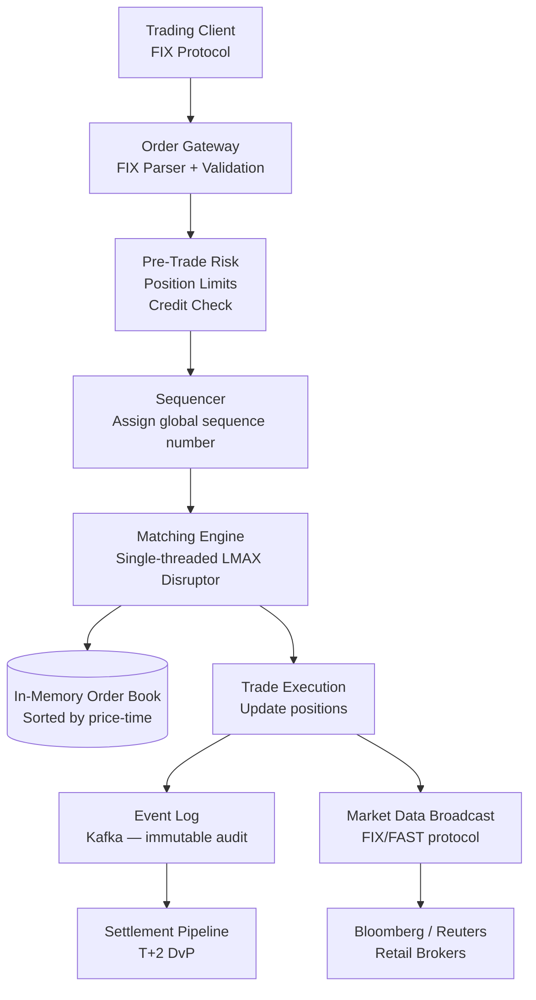
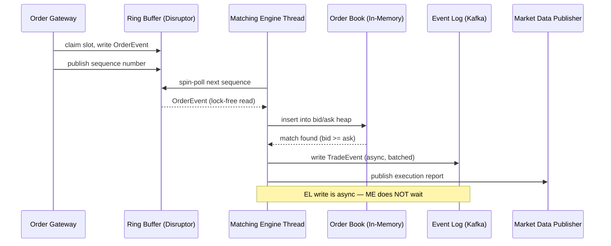
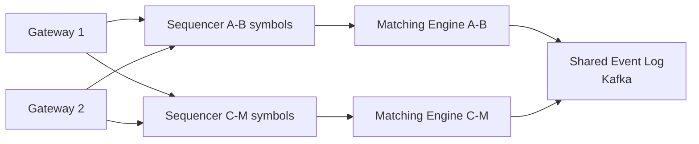

# Design a Real-Time Stock Trading System

**Difficulty**: 🔴 Advanced | **Codemania #66**
**Reading Time**: ~15 min
**Interview Frequency**: High

---

## The Core Problem

Processing 1 million trade orders per second with microsecond-level matching, strict price-time priority ordering, and ACID guarantees for financial integrity. Missing a single order or matching out of sequence can mean regulatory fines, arbitrage exploitation, and loss of market confidence. This is one of the most latency-sensitive distributed systems problems.

---

## Functional Requirements

- Accept buy/sell orders (market, limit, stop orders) via FIX protocol
- Match orders in FIFO price-time priority (best price, earliest time wins)
- Execute trades and broadcast market data to all participants
- Pre-trade risk checks (position limits, credit checks)
- Post-trade settlement pipeline (T+2 settlement)
- Complete audit trail for regulatory compliance

## Non-Functional Requirements

| Requirement | Target |
|-------------|--------|
| Throughput | 1M orders/second |
| Matching latency | < 10 microseconds (P99) |
| Consistency | Strict ACID — no partial matches |
| Ordering | Strict price-time priority (FIFO per price level) |
| Durability | Zero order loss; full event log for audit |
| Availability | 99.999% during market hours |

---

## Back-of-Envelope Estimates

- **Order rate**: 1M orders/sec × 200 bytes/order = 200 MB/sec inbound
- **Order book size**: Top 500 stocks × 10,000 price levels × 2 sides = 10M entries in memory (~2 GB)
- **Market data broadcast**: 1M trades/sec × 100 bytes = 100 MB/sec to all participants
- **Event log**: 1M orders/sec × 200 bytes × 86,400s = ~17 TB/day audit log
- **Matching engine**: Single-threaded for consistency → must process 1 order/microsecond = 1M ops/sec on a single core (achievable with LMAX Disruptor on modern hardware)

---

## High-Level Architecture



---

## Key Design Decisions

### 1. In-Memory vs Disk-Backed Order Book

| Dimension | In-Memory Order Book | Disk-Backed Order Book |
|-----------|---------------------|------------------------|
| Latency | < 1 microsecond | 100+ microseconds (disk I/O) |
| Capacity | Limited by RAM (~2 GB for 500 stocks) | Unlimited |
| Recovery | Must rebuild from event log on restart | Survives process crash |
| Complexity | Simple data structure | Requires WAL and recovery logic |

**Decision**: In-memory order book (all active orders fit in RAM). Durability achieved by writing every order mutation to an event log (Kafka) before executing — if the process crashes, replay the log to rebuild the book.

### 2. Single-Threaded Matching Engine

Why single-threaded? Because concurrent access to the order book requires locks, and locks at 1M ops/sec cause contention that kills latency. Instead:
- Single thread owns the order book exclusively
- Uses LMAX Disruptor (lock-free ring buffer) for order ingestion
- Other threads (risk check, market data broadcast) communicate via disruptors — no shared mutable state
- Throughput: 1 thread at 1 GHz can process ~1M simple operations/sec

### 3. Event Sourcing for Audit Trail

Every state change is modeled as an immutable event:
```
ORDER_RECEIVED   { order_id, symbol, side, qty, price, timestamp }
ORDER_MATCHED    { buy_order_id, sell_order_id, qty, exec_price }
ORDER_CANCELLED  { order_id, reason }
```

The order book is derived by replaying events in sequence. Benefits:
- Full audit trail for regulatory compliance (MiFID II, SEC Rule 17a-4)
- Disaster recovery: replay events to reconstruct exact state
- Backtesting: replay historical events through new matching logic

---

## Order Book Data Structure

The order book for a single symbol is two sorted data structures:
- **Bids**: Max-heap sorted by price descending, then time ascending (best bid = highest price, earliest time)
- **Asks**: Min-heap sorted by price ascending, then time ascending (best ask = lowest price, earliest time)

At each price level: a queue (FIFO) of orders. Matching: if best bid price ≥ best ask price → execute trade.

```
BID SIDE             ASK SIDE
$150.00 x 1000      $150.05 x 500
$149.95 x 2000      $150.10 x 1500
$149.90 x 500       $150.15 x 200
```

---

## Pre-Trade Risk Checks

Before an order reaches the matching engine, it passes through risk checks in < 5 microseconds:
1. **Position limit**: Does this order exceed the trader's allowed position size?
2. **Credit check**: Does the trader have sufficient buying power?
3. **Price validity**: Is a limit price within 10% of last traded price? (Fat-finger protection)
4. **Order rate limit**: Has this trader exceeded 10,000 orders/second?

Risk checks run in parallel with a timeout — if they don't complete in 5 microseconds, the order is rejected.

---

## Top Interview Questions for This Problem

| Question | Tests |
|----------|-------|
| Why is the matching engine single-threaded? | Lock contention at microsecond scale, LMAX Disruptor pattern |
| How do you recover if the matching engine crashes mid-trade? | Event sourcing — replay Kafka log to rebuild order book |
| How do you prevent a fat-finger trade (wrong price by 100x)? | Pre-trade validation, price collars, kill switches |
| What is the FIX protocol and why is it used? | Industry-standard binary protocol for financial messaging, low overhead |
| How does market data broadcast scale to 10,000 subscribers? | Multicast UDP (FAST protocol) for low-latency broadcast |

---

## Common Mistakes

1. **Using a distributed database for the order book**: Any network hop adds milliseconds. The order book must be in the matching engine's local RAM.
2. **Multi-threaded matching engine**: Locks at 1M ops/sec cause priority inversions and unpredictable latency spikes. Single-threaded is intentional.
3. **Synchronous settlement**: Settlement (transferring securities and cash) should be async (T+2) and separate from matching. Tight coupling kills throughput.

---

## Related Concepts

- [Message Queue Basics](../../04-messaging/concepts/message-queue-basics) — Kafka as the event log backbone
- [Consistent Hashing](/14-algorithms/concepts/consistent-hashing-deep-dive) — Sharding order books across symbols

---

## Component Deep Dive 1: The Matching Engine (LMAX Disruptor)

The matching engine is the single most critical component of a trading system. Every other component — risk checks, market data, settlement — exists to serve or be served by this one piece of logic. A naive implementation using synchronized queues or database-backed state collapses immediately at scale.

### Why Naive Approaches Fail

The intuitive implementation is a thread pool reading from a queue and updating an order book protected by a `ReentrantLock`. At 1M orders/sec, threads spend more time waiting for the lock than doing actual work. Amdahl's Law shows that if 10% of work is serialized (the matching logic), maximum speedup from parallelism is 10x — but the synchronization overhead itself consumes far more than 10% of each thread's time. Measured on commodity hardware, a ConcurrentHashMap under 8-thread contention at 1M ops/sec consumes 40–60% of CPU in lock acquisition and cache-line invalidation. P99 latency balloons from 2 microseconds to 800 microseconds.

### The LMAX Disruptor Pattern

The Disruptor replaces the `BlockingQueue` with a pre-allocated ring buffer. Key mechanics:

1. **Single producer, single consumer** for the critical matching path — zero lock contention
2. **Ring buffer** pre-allocated at startup (64k slots × 256 bytes = 16 MB) — no garbage collection, no heap allocation in the hot path
3. **Sequence numbers** instead of locks — producers and consumers track their own cursors; the consumer simply spins (busy-wait) until the producer's cursor advances
4. **Cache-line padding** on the sequence counter prevents false sharing between CPU cores
5. **Memory barriers** (not locks) enforce ordering — one `volatile` write/read per event vs. a full `synchronized` block

The result: 1 order processed every ~600 nanoseconds on a single core, with P99 under 2 microseconds when CPU is pinned (no OS scheduler preemption).

### Matching Engine Internals



### Implementation Options

| Approach | Latency (P99) | Throughput | Trade-off |
|----------|--------------|------------|-----------|
| LMAX Disruptor (single-threaded, ring buffer) | 2 µs | 1M+ orders/sec | No horizontal scale for one symbol; must shard by symbol |
| Akka actor per symbol | 50–200 µs | 500k orders/sec (across all actors) | Actor mailbox overhead, GC pauses in JVM |
| Kafka Streams stateful processor | 5–20 ms | 100k orders/sec | Kafka round-trip per order; unacceptable for exchange use |

**Production choice**: LMAX Disruptor with one matching engine process per symbol group. NYSE and LMAX Exchange both use this architecture.

---

## Component Deep Dive 2: The Sequencer and Global Ordering

The sequencer solves a critical correctness problem: orders arrive over the network in non-deterministic order. Two orders submitted 1 millisecond apart can arrive in reverse order due to TCP jitter or different gateway nodes. Without a sequencer, price-time priority becomes meaningless — "time" is undefined.

### Internal Mechanics

The sequencer is a single component (often a dedicated host) that:
1. Receives validated orders from all gateways
2. Stamps each order with a monotonically increasing 64-bit sequence number
3. Writes the sequenced order to the ring buffer consumed by the matching engine

The sequencer is the **single point of serialization** — it is deliberately a bottleneck because serialization is necessary for correctness. All throughput optimization must happen before (parallelizable) or after (parallelizable) this point.

### What Happens at 10x Load

At 10M orders/sec (e.g., a flash crash event causing panic trading), the sequencer becomes the bottleneck. The symptom is sequencer queue depth growing unbounded, which cascades into order gateway backpressure, and eventually clients see order rejections with error code `SYSTEM_BUSY`.

Mitigations:
- **Horizontal sharding**: One sequencer per symbol or symbol group. AAPL orders and MSFT orders never need global ordering relative to each other.
- **Batching**: Group 100 orders into one ring buffer write instead of 100 individual writes. Reduces per-order overhead from ~200ns to ~20ns.
- **Hardware timestamping**: Use kernel-bypass networking (DPDK, RDMA) to assign timestamps at the NIC rather than in software, removing OS scheduler jitter.



Symbol-partitioned sequencers remove the global bottleneck while preserving per-symbol ordering guarantees. Inter-symbol ordering (e.g., index arbitrage between SPY and constituent stocks) is handled by the risk layer, not the matching engine.

---

## Component Deep Dive 3: The Event Log and Recovery

The event log is the system's source of truth. Every other component — the in-memory order book, position tracking, settlement — is a projection derived from replaying this log. This is event sourcing applied to financial infrastructure.

### Why the Event Log Must Come First

The matching engine writes to Kafka **before** confirming execution to the client. This is the "write-ahead" property: if the process crashes after writing to Kafka but before sending the execution report, the client will retry and the event log will contain the order exactly once. The matching engine can replay from the last committed Kafka offset to reconstruct its state.

Without this guarantee, a crash at the moment of trade execution creates an ambiguous state: did the match happen or not? In financial systems, ambiguity equals liability.

### Kafka Configuration for Financial Integrity

Not all Kafka configurations provide the necessary guarantees. Required settings:

- `acks=all` — all replicas must acknowledge before the write is considered durable
- `min.insync.replicas=2` — at least 2 replicas must be in sync
- `enable.idempotence=true` — prevents duplicate events if the producer retries
- `replication.factor=3` — survives one broker failure without data loss

With these settings, Kafka write latency increases from ~0.5ms to ~5ms, but the trade-off is acceptable: the event log write is **async from the matching engine's perspective** — the matching engine writes to a local buffer, another thread flushes to Kafka, and the matching engine can process the next order immediately.

### Recovery Procedure

On restart after a crash:
1. Read the last confirmed sequence number from a checkpoint file
2. Seek Kafka consumer to that offset
3. Replay all events forward, rebuilding the in-memory order book
4. Resume processing from the next incoming order

Replay speed on modern hardware: ~5M events/second. A 1-hour crash replays 3.6B events at ~12 minutes recovery time. For faster recovery, maintain periodic snapshots (binary serialization of the order book every 60 seconds) and replay only the delta.

---

## Data Model

### Orders Table (Durable Store — PostgreSQL for reporting)

```sql
-- Written asynchronously from the event log; not in the critical matching path
CREATE TABLE orders (
    order_id        BIGINT PRIMARY KEY,           -- global sequence number from sequencer
    client_order_id VARCHAR(64) NOT NULL,         -- client-assigned ID (from FIX field 11)
    firm_id         INT NOT NULL,                 -- broker/dealer identifier
    trader_id       INT NOT NULL,
    symbol          VARCHAR(10) NOT NULL,         -- e.g. 'AAPL', 'MSFT'
    side            CHAR(1) NOT NULL CHECK (side IN ('B','S')),
    order_type      VARCHAR(10) NOT NULL CHECK (order_type IN ('MARKET','LIMIT','STOP')),
    quantity        BIGINT NOT NULL,              -- in shares (no fractional shares)
    limit_price     NUMERIC(12,4),               -- NULL for market orders; 4 decimal places
    stop_price      NUMERIC(12,4),
    time_in_force   VARCHAR(10) DEFAULT 'DAY',   -- DAY, GTC, IOC, FOK
    status          VARCHAR(20) NOT NULL DEFAULT 'NEW',
    filled_qty      BIGINT NOT NULL DEFAULT 0,
    avg_fill_price  NUMERIC(12,4),
    submitted_at    TIMESTAMPTZ NOT NULL,
    received_at     TIMESTAMPTZ NOT NULL,         -- gateway timestamp
    sequenced_at    TIMESTAMPTZ NOT NULL,         -- sequencer timestamp (canonical)
    updated_at      TIMESTAMPTZ NOT NULL
);

CREATE INDEX idx_orders_symbol_status ON orders (symbol, status);
CREATE INDEX idx_orders_firm_trader ON orders (firm_id, trader_id);
CREATE INDEX idx_orders_submitted ON orders (submitted_at DESC);

-- Executions (fills) — child records of orders
CREATE TABLE executions (
    exec_id         BIGINT PRIMARY KEY,
    buy_order_id    BIGINT NOT NULL REFERENCES orders(order_id),
    sell_order_id   BIGINT NOT NULL REFERENCES orders(order_id),
    symbol          VARCHAR(10) NOT NULL,
    executed_qty    BIGINT NOT NULL,
    exec_price      NUMERIC(12,4) NOT NULL,
    executed_at     TIMESTAMPTZ NOT NULL,         -- sequencer timestamp of the match
    settlement_date DATE NOT NULL                 -- T+2 from executed_at
);

CREATE INDEX idx_executions_symbol ON executions (symbol, executed_at DESC);
CREATE INDEX idx_executions_settlement ON executions (settlement_date, symbol);
```

### In-Memory Order Book (Matching Engine — not persisted)

```
-- Pseudocode representation of the in-memory structure
OrderBook {
    symbol: String                          // "AAPL"
    bids: TreeMap<Price DESC, PriceLevel>   // sorted max-price first
    asks: TreeMap<Price ASC, PriceLevel>    // sorted min-price first
}

PriceLevel {
    price: long                             // in cents, no floating point
    total_qty: long
    orders: ArrayDeque<Order>               // FIFO queue at this price level
}

Order {
    order_id: long                          // 8 bytes
    quantity: long                          // 8 bytes
    sequence_num: long                      // 8 bytes — determines time priority
    firm_id: int                            // 4 bytes
    // Total: 28 bytes per in-memory order slot
}
```

**Critical note**: All prices stored as integer cents (or basis points for bonds) to avoid floating-point rounding errors. A limit price of `$150.05` is stored as `15005`. This is non-negotiable in financial systems.

### Kafka Event Schema (Avro)

```json
{
  "namespace": "com.exchange.events",
  "type": "record",
  "name": "OrderEvent",
  "fields": [
    {"name": "event_type",    "type": {"type": "enum", "name": "EventType",
                               "symbols": ["ORDER_NEW","ORDER_CANCEL","ORDER_MODIFY",
                                           "ORDER_FILLED","ORDER_PARTIAL_FILL",
                                           "ORDER_REJECTED","ORDER_EXPIRED"]}},
    {"name": "sequence_num",  "type": "long"},
    {"name": "order_id",      "type": "long"},
    {"name": "symbol",        "type": "string"},
    {"name": "side",          "type": "string"},
    {"name": "order_type",    "type": "string"},
    {"name": "quantity",      "type": "long"},
    {"name": "limit_price",   "type": ["null", "long"], "default": null},
    {"name": "exec_price",    "type": ["null", "long"], "default": null},
    {"name": "exec_qty",      "type": ["null", "long"], "default": null},
    {"name": "counterpart_order_id", "type": ["null", "long"], "default": null},
    {"name": "timestamp_ns",  "type": "long"}
  ]
}
```

---

## Scale Bottlenecks

| Traffic Level | Component That Breaks | Symptoms | Mitigation |
|---------------|-----------------------|----------|------------|
| 10x baseline (10M orders/sec) | Sequencer per symbol group | Sequencer queue depth grows; order gateway sees 5–10ms acceptance latency instead of 200µs | Increase symbol partitioning granularity; from 10 groups to 100 groups |
| 10x baseline | Kafka event log broker | Producer batch flush latency climbs from 2ms to 40ms; disk I/O saturation | Add Kafka brokers; increase partition count; use faster NVMe disks |
| 10x baseline | Market data broadcast | Multicast network bandwidth saturation at ~1 GB/sec | Add market data aggregation layer; publish top-of-book only (not full depth) to retail subscribers |
| 100x baseline (100M orders/sec) | Network switch fabric | Incast congestion: all gateways sending to one sequencer simultaneously; packet drops and TCP retransmits | Kernel-bypass networking (DPDK); RDMA over InfiniBand (200 Gbps links) |
| 100x baseline | In-memory order book | RAM size: 500 stocks × 100x = need 200 GB RAM per matching engine host | Reduce active symbols per engine; archive inactive price levels to off-heap memory |
| 100x baseline | Risk check engine | Position table lookups contend under 100M checks/sec; bloom filters for position limits saturate | Dedicated FPGA-based risk check unit (used by Citadel, Jane Street); FPGA can check 1B positions/sec |
| 1000x baseline (1B orders/sec) | Everything above + | Entire exchange architecture must be redesigned | This is beyond current NYSE peak volume by 1000x; co-location, custom ASICs, optical switching |

---

## How Nasdaq Built This

Nasdaq operates one of the world's highest-throughput equity exchanges, processing over **30 million messages per second** at peak during events like market open (9:30 AM ET) and major earnings releases. Their architecture offers the most publicly documented example of exchange engineering at scale.

### Technology Choices

Nasdaq's matching engine is written in **C++** (not Java, not Go) specifically to avoid JVM garbage collection pauses. A 50-millisecond GC pause during market open is unacceptable; GC-free C++ with pre-allocated memory pools eliminates this risk entirely. Their order book uses a **custom intrusive linked list** (not std::map) for price levels — a sorted array for the top 10 price levels (accessed >95% of the time) with overflow to a hash map for deeper levels. Cache locality for the top-of-book is critical.

### Specific Numbers

- **Peak throughput**: 30M messages/sec across all symbols on a single exchange
- **Matching latency**: median 74 microseconds, P99 below 500 microseconds (published in their 2023 market quality report)
- **Order book footprint**: ~500 actively traded symbols in the US equity market hold ~90% of volume; top 50 symbols represent ~60% of orders
- **Co-location**: 400+ trading firms co-locate servers in Nasdaq's Carteret, NJ data center, paying $10,000–$100,000/month to be within 300 feet of the matching engine — every meter of fiber adds ~5 nanoseconds of latency

### Non-Obvious Architectural Decision

Nasdaq uses **two parallel matching engines** for redundancy, but only one is active at a time (active-standby). The standby engine processes every incoming order in lockstep with the active engine but does not publish results. On failover, the standby promotes itself in under 50 milliseconds — fast enough that connected clients do not disconnect (FIX session keepalive is typically 30 seconds). The decision to use lockstep processing (rather than state replication from event log) was non-obvious: it doubles hardware cost but eliminates the replay latency window during failover.

Nasdaq published elements of this architecture in their **2019 TotalView-ITCH technical specification** and their exchange technology presentations at the Options Industry Conference and FIX Trading Community conferences.

Source: [Nasdaq TotalView-ITCH Protocol Specification](https://www.nasdaqtrader.com/content/technicalsupport/specifications/dataproducts/NQTVITCHspecification.pdf)

---

## Interview Angle

**What the interviewer is testing:** Whether you understand that ultra-low latency systems require eliminating all sources of non-deterministic latency — locks, GC, network hops, disk I/O — and can explain *why* each elimination is necessary, not just *what* to use.

**Common mistakes candidates make:**

1. **Proposing a distributed database (Cassandra, DynamoDB) for the order book.** This shows the candidate does not understand that any network round-trip adds 0.5–5ms, which is 500–5000x the target matching latency. The order book must live in the matching engine's local memory on the same process. When asked "but what about durability?", candidates who suggest Cassandra often cannot explain the write-ahead log pattern that solves this without sacrificing latency.

2. **Making the matching engine multi-threaded for scalability.** Candidates propose using one thread per price level or one thread per symbol. This works fine for throughput but the interviewer will probe: "How do you handle a single high-volume symbol like AAPL that dominates your order flow?" The answer reveals whether the candidate understands that per-symbol single-threading is the correct granularity — one matching engine thread per symbol, not one thread per price level within a symbol.

3. **Ignoring the settlement layer entirely.** Many candidates design the trade execution path perfectly but say nothing about what happens after a match. Settlement (Delivery vs. Payment, clearing via DTCC, T+2 finality) is a non-trivial distributed systems problem with its own consistency requirements. An interviewer who is an exchange domain expert will probe here to separate candidates with genuine trading system knowledge from those who've only studied the order matching problem.

**The insight that separates good from great answers:** The best candidates articulate that the correct consistency model for a trading system is **sequential consistency at the symbol level, not global consistency**. AAPL orders must be matched in strict sequence. AAPL and MSFT matches have no ordering relationship with each other. This insight allows sharding by symbol — 10,000 symbols across 500 matching engine processes — without sacrificing correctness, and it's the foundation of how all major exchanges scale horizontally while maintaining price-time priority guarantees.

---

## Key Numbers to Remember

| Metric | Value | Context |
|--------|-------|---------|
| Matching latency target | < 10 µs P99 | Industry standard for exchange matching engines |
| LMAX Disruptor throughput | 6M events/sec per core | Single-threaded ring buffer on modern x86 hardware |
| Order book RAM | ~2 GB | Top 500 US equity symbols × 10k price levels × 2 sides |
| Event log write rate | 200 MB/sec | 1M orders/sec × 200 bytes; requires fast NVMe or SAN |
| Audit log size | ~17 TB/day | At 1M orders/sec for a 24-hour exchange window |
| Risk check budget | < 5 µs | Must complete before sequencer; in-memory hash map lookups only |
| Nasdaq peak throughput | 30M messages/sec | Across all symbols; published in market quality reports |
| Nasdaq matching latency | 74 µs median | P99 < 500 µs; published in 2023 Nasdaq market quality report |
| Co-location propagation | ~5 ns per meter of fiber | Why firms pay $100k/month to be 300 feet from the engine |
| Failover time (active-standby) | < 50 ms | Lockstep standby engine; within FIX session keepalive window |
| Settlement cycle | T+2 | Two business days after trade execution; DTCC clears US equities |
| FIX protocol message size | 150–300 bytes | Binary FIX (FIXT) for exchange connectivity; ASCII FIX for less latency-sensitive paths |

---

## 📚 Resources & References

| Resource | Type | What You'll Learn |
|----------|------|------------------|
| [LMAX Disruptor — Martin Thompson](https://lmax-exchange.github.io/disruptor/) | 📚 Book | Lock-free ring buffer for ultra-low latency messaging |
| [ByteByteGo — Stock Exchange System Design](https://www.youtube.com/@ByteByteGo) | 📺 YouTube | Order book, matching engine, market data |
| [Hussein Nasser — High Frequency Trading](https://www.youtube.com/@hnasr) | 📺 YouTube | Network and CPU optimizations for HFT |
| [High Scalability — Trading Systems](https://highscalability.com) | 📖 Blog | Real-world lessons from exchange architects |
| [Martin Kleppmann — Event Sourcing](https://martin.kleppmann.com) | 📖 Blog | Event sourcing patterns for financial systems |
| [Nasdaq TotalView-ITCH Specification](https://www.nasdaqtrader.com/content/technicalsupport/specifications/dataproducts/NQTVITCHspecification.pdf) | 📚 Docs | Official Nasdaq market data protocol; reveals real architecture choices |
