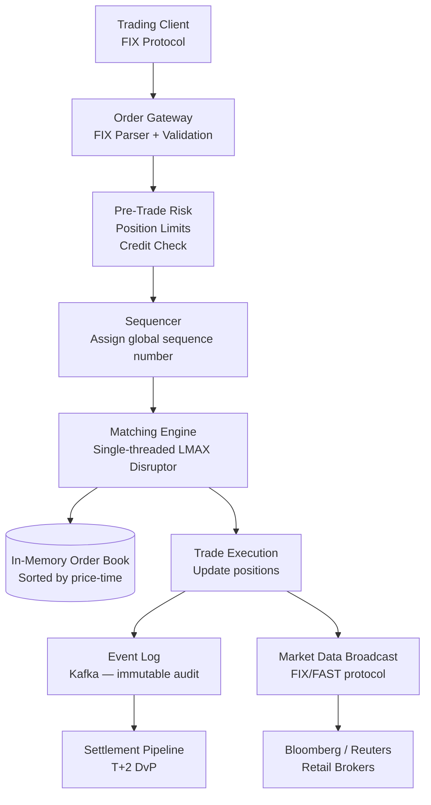

# Design a Real-Time Stock Trading System

**Difficulty**: 🔴 Advanced | **Codemania #66**
**Reading Time**: ~15 min
**Interview Frequency**: High

---

## The Core Problem

Processing 1 million trade orders per second with microsecond-level matching, strict price-time priority ordering, and ACID guarantees for financial integrity. Missing a single order or matching out of sequence can mean regulatory fines, arbitrage exploitation, and loss of market confidence. This is one of the most latency-sensitive distributed systems problems.

---

## Functional Requirements

- Accept buy/sell orders (market, limit, stop orders) via FIX protocol
- Match orders in FIFO price-time priority (best price, earliest time wins)
- Execute trades and broadcast market data to all participants
- Pre-trade risk checks (position limits, credit checks)
- Post-trade settlement pipeline (T+2 settlement)
- Complete audit trail for regulatory compliance

## Non-Functional Requirements

| Requirement | Target |
|-------------|--------|
| Throughput | 1M orders/second |
| Matching latency | < 10 microseconds (P99) |
| Consistency | Strict ACID — no partial matches |
| Ordering | Strict price-time priority (FIFO per price level) |
| Durability | Zero order loss; full event log for audit |
| Availability | 99.999% during market hours |

---

## Back-of-Envelope Estimates

- **Order rate**: 1M orders/sec × 200 bytes/order = 200 MB/sec inbound
- **Order book size**: Top 500 stocks × 10,000 price levels × 2 sides = 10M entries in memory (~2 GB)
- **Market data broadcast**: 1M trades/sec × 100 bytes = 100 MB/sec to all participants
- **Event log**: 1M orders/sec × 200 bytes × 86,400s = ~17 TB/day audit log
- **Matching engine**: Single-threaded for consistency → must process 1 order/microsecond = 1M ops/sec on a single core (achievable with LMAX Disruptor on modern hardware)

---

## High-Level Architecture



---

## Key Design Decisions

### 1. In-Memory vs Disk-Backed Order Book

| Dimension | In-Memory Order Book | Disk-Backed Order Book |
|-----------|---------------------|------------------------|
| Latency | < 1 microsecond | 100+ microseconds (disk I/O) |
| Capacity | Limited by RAM (~2 GB for 500 stocks) | Unlimited |
| Recovery | Must rebuild from event log on restart | Survives process crash |
| Complexity | Simple data structure | Requires WAL and recovery logic |

**Decision**: In-memory order book (all active orders fit in RAM). Durability achieved by writing every order mutation to an event log (Kafka) before executing — if the process crashes, replay the log to rebuild the book.

### 2. Single-Threaded Matching Engine

Why single-threaded? Because concurrent access to the order book requires locks, and locks at 1M ops/sec cause contention that kills latency. Instead:
- Single thread owns the order book exclusively
- Uses LMAX Disruptor (lock-free ring buffer) for order ingestion
- Other threads (risk check, market data broadcast) communicate via disruptors — no shared mutable state
- Throughput: 1 thread at 1 GHz can process ~1M simple operations/sec

### 3. Event Sourcing for Audit Trail

Every state change is modeled as an immutable event:
```
ORDER_RECEIVED   { order_id, symbol, side, qty, price, timestamp }
ORDER_MATCHED    { buy_order_id, sell_order_id, qty, exec_price }
ORDER_CANCELLED  { order_id, reason }
```

The order book is derived by replaying events in sequence. Benefits:
- Full audit trail for regulatory compliance (MiFID II, SEC Rule 17a-4)
- Disaster recovery: replay events to reconstruct exact state
- Backtesting: replay historical events through new matching logic

---

## Order Book Data Structure

The order book for a single symbol is two sorted data structures:
- **Bids**: Max-heap sorted by price descending, then time ascending (best bid = highest price, earliest time)
- **Asks**: Min-heap sorted by price ascending, then time ascending (best ask = lowest price, earliest time)

At each price level: a queue (FIFO) of orders. Matching: if best bid price ≥ best ask price → execute trade.

```
BID SIDE             ASK SIDE
$150.00 x 1000      $150.05 x 500
$149.95 x 2000      $150.10 x 1500
$149.90 x 500       $150.15 x 200
```

---

## Pre-Trade Risk Checks

Before an order reaches the matching engine, it passes through risk checks in < 5 microseconds:
1. **Position limit**: Does this order exceed the trader's allowed position size?
2. **Credit check**: Does the trader have sufficient buying power?
3. **Price validity**: Is a limit price within 10% of last traded price? (Fat-finger protection)
4. **Order rate limit**: Has this trader exceeded 10,000 orders/second?

Risk checks run in parallel with a timeout — if they don't complete in 5 microseconds, the order is rejected.

---

## Top Interview Questions for This Problem

| Question | Tests |
|----------|-------|
| Why is the matching engine single-threaded? | Lock contention at microsecond scale, LMAX Disruptor pattern |
| How do you recover if the matching engine crashes mid-trade? | Event sourcing — replay Kafka log to rebuild order book |
| How do you prevent a fat-finger trade (wrong price by 100x)? | Pre-trade validation, price collars, kill switches |
| What is the FIX protocol and why is it used? | Industry-standard binary protocol for financial messaging, low overhead |
| How does market data broadcast scale to 10,000 subscribers? | Multicast UDP (FAST protocol) for low-latency broadcast |

---

## Common Mistakes

1. **Using a distributed database for the order book**: Any network hop adds milliseconds. The order book must be in the matching engine's local RAM.
2. **Multi-threaded matching engine**: Locks at 1M ops/sec cause priority inversions and unpredictable latency spikes. Single-threaded is intentional.
3. **Synchronous settlement**: Settlement (transferring securities and cash) should be async (T+2) and separate from matching. Tight coupling kills throughput.

---

## Related Concepts

- [Message Queue Basics](../../04-messaging/concepts/message-queue-basics) — Kafka as the event log backbone
- [Consistent Hashing](/14-algorithms/concepts/consistent-hashing-deep-dive) — Sharding order books across symbols

---

## 📚 Resources & References

| Resource | Type | What You'll Learn |
|----------|------|------------------|
| [LMAX Disruptor — Martin Thompson](https://lmax-exchange.github.io/disruptor/) | 📚 Book | Lock-free ring buffer for ultra-low latency messaging |
| [ByteByteGo — Stock Exchange System Design](https://www.youtube.com/@ByteByteGo) | 📺 YouTube | Order book, matching engine, market data |
| [Hussein Nasser — High Frequency Trading](https://www.youtube.com/@hnasr) | 📺 YouTube | Network and CPU optimizations for HFT |
| [High Scalability — Trading Systems](https://highscalability.com) | 📖 Blog | Real-world lessons from exchange architects |
| [Martin Kleppmann — Event Sourcing](https://martin.kleppmann.com) | 📖 Blog | Event sourcing patterns for financial systems |
