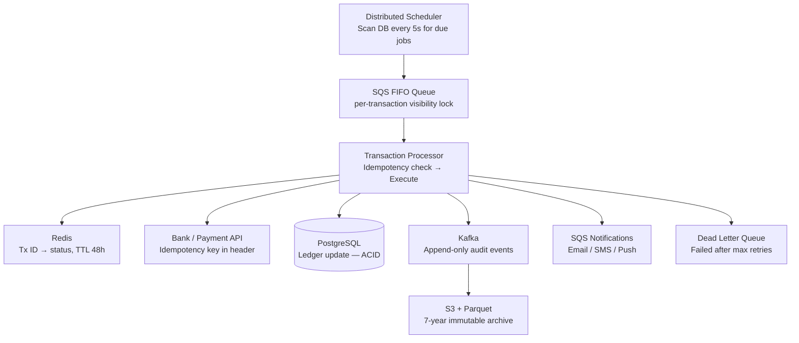
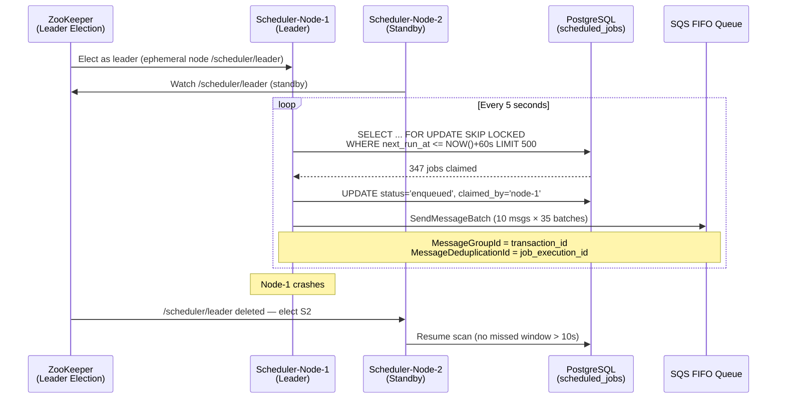

# Design a Scheduled Digital Transaction System

**Difficulty**: 🔴 Advanced | **Codemania #77**
**Reading Time**: ~14 min
**Interview Frequency**: High

---

## The Core Problem

Executing 100 million pre-scheduled financial transactions (bill payments, recurring transfers) per day with exactly-once guarantees and a complete compliance audit trail. The hard problems: clock skew across distributed schedulers may fire the same job twice; network failures during execution may leave transactions in an ambiguous state; regulatory compliance requires an immutable record of every action.

---

## Functional Requirements

- Schedule recurring transactions (daily, weekly, monthly, custom cron)
- Execute scheduled transactions at the configured time (± 5 second accuracy)
- Exactly-once execution — no duplicate charges
- Support for retry on transient failures (bank downtime) with configurable policy
- Immutable audit log of all execution attempts and outcomes
- User notification on success, failure, and retry

## Non-Functional Requirements

| Requirement | Target |
|-------------|--------|
| Scale | 100M scheduled transactions/day = ~1,160/sec |
| Exactly-once | Zero duplicate charges (idempotency guarantee) |
| Time accuracy | Execute within ± 5 seconds of scheduled time |
| Retry policy | Configurable: max 3 retries over 24 hours |
| Audit retention | 7 years (SOX/HIPAA compliance) |
| Latency | Transaction confirmation to user within 30 seconds |

---

## Back-of-Envelope Estimates

- **Daily volume**: 100M transactions/day ÷ 86,400 = 1,160 TPS average
- **Peak hour**: Bill payments cluster at month-end → 5× peak = ~5,800 TPS
- **Job scheduler load**: 100M jobs → scan upcoming 5-min window = 100M ÷ 288 five-min slots = ~347k jobs per 5-min slot
- **Idempotency store**: 100M transaction IDs × 64 bytes = 6.4 GB (fits in Redis)
- **Audit log**: 100M events/day × 500 bytes = 50 GB/day → 18 TB/year

---

## High-Level Architecture



---

## Key Design Decisions

### 1. Centralized vs Distributed Scheduler

| Approach | Centralized Scheduler | Distributed Scheduler |
|----------|----------------------|----------------------|
| Simplicity | Simple — single process owns clock | Complex — must handle leader election |
| Scale | Single-process bottleneck | Horizontal scale |
| Clock skew | N/A — one clock | Must handle skew; use NTP + distributed lock |
| SPOF | Yes — single scheduler failure halts all jobs | No — multiple nodes, leader election |

**Decision**: Distributed scheduler with leader election (ZooKeeper or Postgres advisory lock). The leader scans the `scheduled_jobs` table every 5 seconds for jobs due in the next 60 seconds and enqueues them into SQS. If leader dies, new leader elected within 10 seconds — maximum 10 second delay for in-progress scan window.

### 2. Idempotency via Transaction ID

Every transaction has a stable `transaction_id` (UUID generated at schedule creation time). Before execution:

```python
def execute_transaction(tx_id, amount, from_acct, to_acct):
    # Step 1: Acquire idempotency lock in Redis
    if not redis.setnx(f"tx:lock:{tx_id}", "processing", ex=300):
        current = redis.get(f"tx:status:{tx_id}")
        if current == "completed":
            return {"status": "already_completed"}
        # Still processing — wait or return pending
        return {"status": "in_progress"}

    try:
        # Step 2: Execute with idempotency key to bank API
        result = bank_api.transfer(
            idempotency_key=tx_id,
            amount=amount, from_acct=from_acct, to_acct=to_acct
        )
        redis.set(f"tx:status:{tx_id}", "completed", ex=172800)  # 48h TTL
        write_audit_log(tx_id, "completed", result)
        return result
    except Exception as e:
        redis.delete(f"tx:lock:{tx_id}")  # Release lock for retry
        write_audit_log(tx_id, "failed", str(e))
        raise
```

### 3. Retry Policy with Exponential Backoff

For transient failures (bank timeout, network error):
- Retry 1: 5 minutes after failure
- Retry 2: 1 hour after failure
- Retry 3: 6 hours after failure
- After 3 failures: Move to DLQ, notify user, pause recurring schedule

For permanent failures (insufficient funds, closed account):
- Do not retry; notify user immediately; optionally suspend future recurrences

### 4. Compensating Transactions for Partial Failures

Distributed transaction (debit account A + credit account B) may partially complete. Use the Saga pattern:
1. Debit account A → success
2. Credit account B → failure (bank API timeout)
3. Execute compensation: credit account A (undo the debit)

Each step records a compensating action in the audit log. The saga orchestrator ensures the compensation runs if any step fails.

---

## Handling Clock Skew and Time Zones

- All scheduled times stored as UTC timestamps in the database
- User-visible times converted to user's timezone at display time
- Month-end handling: "every month on the 30th" → February executes on Feb 28 (last day of month logic)
- DST transitions: jobs scheduled at "2:00 AM daily" near DST transition get explicit UTC times; no double-execution

---

## Audit Log — Tamper-Evident Chain

For SOX/HIPAA compliance, the audit log must be tamper-evident:
```json
{
  "tx_id": "uuid-123",
  "event": "TRANSACTION_COMPLETED",
  "timestamp": "2024-01-15T14:00:00Z",
  "amount": 1500.00,
  "prev_hash": "sha256:abcdef...",
  "hash": "sha256:123456..."  // Hash of this record + prev_hash
}
```

Each record hashes the previous record's hash — like a blockchain. Tampering with any record breaks all subsequent hashes.

---

## Top Interview Questions for This Problem

| Question | Tests |
|----------|-------|
| How do you ensure a transaction fires exactly once when two schedulers both see it as "due"? | Distributed lock (Redis SETNX), SQS visibility timeout, idempotency key |
| What happens if the transaction processor crashes after debiting account A but before crediting account B? | Saga pattern, compensating transactions, at-least-once with idempotency |
| How do you handle a bank that goes down for 6 hours? | Retry queue with exponential backoff, DLQ, user notification |
| How do you reconstruct the exact state of account X at time T for an audit? | Event sourcing, append-only ledger, timestamp-based replay |

---

## Common Mistakes

1. **Using wall-clock time in the scheduler without distributed lock**: Two scheduler nodes both scan and enqueue the same job → duplicate execution. Use `SELECT ... FOR UPDATE SKIP LOCKED` on the job table or Redis lock.
2. **Trusting the bank API's success response without local record**: Store the intent to debit before calling the bank. If you crash after calling the bank but before recording success, you'll re-execute without idempotency.
3. **Hard-deleting job records after completion**: Keep them for 7 years for regulatory audit. Soft-delete with status = "completed".

---

## Related Concepts

- [Message Queue Basics](../../04-messaging/concepts/message-queue-basics) — SQS FIFO for exactly-once delivery
- [Rate Limiter](../05-infrastructure/rate-limiter) — Throttle outbound bank API calls

---

## Component Deep Dive 1: Distributed Job Scheduler

The scheduler is the most critical component — it determines WHEN each transaction fires, and getting this wrong means either missed payments or duplicate charges. Both outcomes are catastrophic for a financial system.

### How It Works Internally

The scheduler maintains a `scheduled_jobs` table in PostgreSQL. Every 5 seconds, a leader process runs a bounded scan: fetch all jobs where `next_run_at <= NOW() + 60s AND status = 'pending'`. The 60-second lookahead window prevents the scan from racing with clock skew — if a job is due in 50 seconds, it gets enqueued now rather than potentially being missed if the next scan is slightly late.

The critical detail is **how the leader claims ownership of a job before enqueuing it**. A naive implementation would scan, then enqueue, creating a window where two schedulers both scan the same 5-second window. The correct approach uses `SELECT ... FOR UPDATE SKIP LOCKED`:

```sql
-- Claim a batch of due jobs atomically
UPDATE scheduled_jobs
SET status = 'enqueued', claimed_at = NOW(), claimed_by = 'scheduler-node-3'
WHERE job_id IN (
    SELECT job_id FROM scheduled_jobs
    WHERE next_run_at <= NOW() + INTERVAL '60 seconds'
      AND status = 'pending'
    ORDER BY next_run_at ASC
    LIMIT 500
    FOR UPDATE SKIP LOCKED
)
RETURNING job_id, transaction_id, scheduled_at;
```

`SKIP LOCKED` means concurrent scheduler nodes skip rows that are already locked by another node — no blocking, no duplicate claims. This is the Postgres-native distributed lock for the scan phase.

### Why Naive Approaches Fail at Scale

**Naive approach 1 — single cron job**: A cron running `SELECT * FROM jobs WHERE due_at <= NOW()` on one machine. Fails because: single point of failure, can't scale past ~2,000 TPS on one machine, restarts cause missed windows.

**Naive approach 2 — application-level polling**: Every processor node polls for its own jobs. Fails because: N processors × N scans = N² database load, race conditions on claim, thundering herd at month-end peaks.

**Naive approach 3 — time-based partitioning without locks**: Partition jobs by `job_id % num_nodes` — each node owns a slice. Fails because: node failure leaves a slice uncovered; no rebalancing; new nodes require resharding.

### Scheduler Internals Flow



### Scheduler Implementation Options

| Approach | Latency to Detect Leader Failure | Throughput | Trade-off |
|----------|----------------------------------|------------|-----------|
| ZooKeeper ephemeral node | 3–10 seconds (session timeout) | 5,000 jobs/sec | Extra operational dependency (ZK cluster) |
| PostgreSQL advisory lock | 5–30 seconds (lock timeout) | 3,000 jobs/sec | No extra infra; PG must be highly available |
| Redis SETNX with TTL | 1–5 seconds | 8,000 jobs/sec | Redis failure = no leader; TTL drift risk |

**Chosen approach**: PostgreSQL advisory lock + `SELECT FOR UPDATE SKIP LOCKED`. Rationale: PostgreSQL is already the system of record for scheduled jobs. Adding ZooKeeper for a lock that's only needed every 5 seconds adds operational complexity that doesn't justify the ~2× failover speedup.

---

## Component Deep Dive 2: Idempotency Store (Redis)

The idempotency store is the last line of defense against duplicate charges. Even with distributed locks on the scheduler, messages can be re-delivered by SQS (at-least-once), processors can crash mid-execution, and bank APIs can timeout leaving ambiguous state.

### How It Works Internally

Each transaction has a stable `transaction_id` (UUID v4 generated at schedule-creation time). The idempotency store tracks three states:

1. **`processing`** — lock acquired, execution in progress (TTL: 5 minutes)
2. **`completed`** — terminal success, do not retry (TTL: 48 hours)
3. **`failed_permanent`** — insufficient funds, closed account — do not retry (TTL: 48 hours)
4. **`failed_transient`** — network error, timeout — retry allowed (TTL: expires after retry delay)

The critical Redis pattern uses a combination of `SETNX` for lock acquisition and `SET NX EX` for status recording:

```python
# Redis key structure:
# tx:lock:{tx_id}    → "processing"  (TTL 300s — prevents duplicate concurrent execution)
# tx:status:{tx_id}  → "completed"   (TTL 172800s — 48h dedup window)
# tx:attempt:{tx_id} → "3"           (TTL 86400s — retry count)

ACQUIRE_AND_CHECK = """
local lock = redis.call('SET', KEYS[1], 'processing', 'NX', 'EX', 300)
if lock == false then
    local status = redis.call('GET', KEYS[2])
    return {0, status}
end
return {1, 'acquired'}
"""
result = redis.eval(ACQUIRE_AND_CHECK, 2, f"tx:lock:{tx_id}", f"tx:status:{tx_id}")
```

Using a Lua script makes the check-and-set atomic — no TOCTOU race between checking the status and acquiring the lock.

### Scale Behavior at 10× Load

At baseline (1,160 TPS), Redis handles ~3,500 commands/sec (3 commands per transaction: SET lock, GET status, SET status). At 10× (11,600 TPS), this becomes 34,800 commands/sec — well within Redis's ~100,000 commands/sec single-node limit.

At 100× (116,000 TPS / ~10 billion transactions/day), a single Redis node saturates. Mitigation: shard the idempotency store by `tx_id` across 8 Redis nodes using consistent hashing. Redis Cluster handles this natively with hash slots.

**Idempotency Window**: TTL of 48 hours means if a processor crashes and the same SQS message is redelivered 47 hours later, it's still caught. After 48 hours, SQS's maximum retention (4 days) ensures the message is dead before the idempotency record expires.

### Idempotency Store Options

| Option | Latency (p99) | Failure Mode | Notes |
|--------|--------------|--------------|-------|
| Redis SETNX + Lua | 0.5ms | Redis down = all processing blocked | Fast; needs Redis HA |
| PostgreSQL UPSERT with advisory lock | 5ms | Slower but durable | Survives Redis restart |
| DynamoDB conditional write | 3–8ms | Regional failure | Serverless; auto-scales |

---

## Component Deep Dive 3: Audit Log (Kafka → S3)

The audit log must satisfy two conflicting requirements: it must be **low-latency** (transaction processors can't block on a slow disk write), and it must be **tamper-evident** (any post-hoc modification must be detectable). Kafka addresses latency; the hash chain addresses tamper-evidence.

### Internal Mechanics

Transaction processors write to a Kafka topic `audit.transactions` with the `transaction_id` as the partition key. Partition-by-key ensures all events for the same transaction land in order on the same partition — critical for reconstructing execution history without cross-partition coordination.

A Kafka consumer (Flink job) reads from all partitions, computes the rolling SHA-256 hash chain per transaction, and writes Parquet files to S3 every 10 minutes. The Parquet files are written to an S3 bucket with **Object Lock (WORM — Write Once, Read Many)** with a 7-year retention policy. Once written, no AWS IAM policy can delete or overwrite them — even the root account.

```
Kafka partition layout:
  Partition 0: tx_id % 100 == 0..9   (10 million transactions)
  Partition 1: tx_id % 100 == 10..19
  ...
  Partition 9: tx_id % 100 == 90..99

S3 path structure:
  s3://audit-bucket/year=2024/month=01/day=15/hour=14/part-0-00000.parquet
  (10-minute Parquet files, ~5 GB each at 100M tx/day)
```

The tamper-evident chain makes forensic auditing straightforward: a regulator can verify that no records have been modified by re-computing the hash chain from the first record in a file. If any hash mismatches, the tampered record's position is immediately pinpointed.

### Hash Chain Verification

```python
def verify_audit_chain(parquet_file: str) -> bool:
    records = read_parquet(parquet_file)
    expected_hash = "genesis"  # known anchor
    for record in records:
        computed = sha256(f"{record['tx_id']}{record['event']}{record['timestamp']}{expected_hash}")
        if computed != record['hash']:
            raise AuditIntegrityError(f"Chain broken at tx_id={record['tx_id']}")
        expected_hash = record['hash']
    return True
```

---

## Data Model

The core tables powering the system. PostgreSQL is used for the job schedule and ledger (ACID required); Redis for fast idempotency lookups.

```sql
-- =========================================================
-- Core Schedule Table
-- =========================================================
CREATE TABLE scheduled_jobs (
    job_id              UUID PRIMARY KEY DEFAULT gen_random_uuid(),
    transaction_id      UUID NOT NULL UNIQUE,  -- stable across retries
    user_id             BIGINT NOT NULL,
    from_account_id     VARCHAR(64) NOT NULL,
    to_account_id       VARCHAR(64) NOT NULL,
    amount_cents        BIGINT NOT NULL,        -- store in cents, no float
    currency            CHAR(3) NOT NULL DEFAULT 'USD',
    recurrence_rule     VARCHAR(256),           -- iCal RRULE format: "FREQ=MONTHLY;BYDAY=-1FR"
    next_run_at         TIMESTAMPTZ NOT NULL,   -- always UTC
    timezone            VARCHAR(64) NOT NULL DEFAULT 'UTC',
    status              VARCHAR(32) NOT NULL DEFAULT 'pending',
                        -- pending | enqueued | executing | completed | failed | paused | cancelled
    retry_count         SMALLINT NOT NULL DEFAULT 0,
    max_retries         SMALLINT NOT NULL DEFAULT 3,
    retry_policy        JSONB,                  -- {"delays_seconds": [300, 3600, 21600]}
    claimed_by          VARCHAR(128),           -- scheduler node ID
    claimed_at          TIMESTAMPTZ,
    last_executed_at    TIMESTAMPTZ,
    last_execution_id   UUID,                   -- links to execution_log
    created_at          TIMESTAMPTZ NOT NULL DEFAULT NOW(),
    updated_at          TIMESTAMPTZ NOT NULL DEFAULT NOW()
);

-- Hot path: scheduler scans this index every 5 seconds
CREATE INDEX idx_jobs_due ON scheduled_jobs (next_run_at ASC, status)
    WHERE status = 'pending';

-- User lookup
CREATE INDEX idx_jobs_user ON scheduled_jobs (user_id, status);

-- =========================================================
-- Execution Log (immutable — INSERT only, no UPDATE/DELETE)
-- =========================================================
CREATE TABLE execution_log (
    execution_id        UUID PRIMARY KEY DEFAULT gen_random_uuid(),
    job_id              UUID NOT NULL REFERENCES scheduled_jobs(job_id),
    transaction_id      UUID NOT NULL,
    attempt_number      SMALLINT NOT NULL,
    status              VARCHAR(32) NOT NULL,   -- executing | completed | failed_transient | failed_permanent
    started_at          TIMESTAMPTZ NOT NULL DEFAULT NOW(),
    completed_at        TIMESTAMPTZ,
    duration_ms         INT,
    bank_request_id     VARCHAR(256),           -- bank's idempotency key echo
    bank_response_code  VARCHAR(64),
    error_code          VARCHAR(64),
    error_message       TEXT,
    amount_cents        BIGINT NOT NULL,
    currency            CHAR(3) NOT NULL,
    processor_node      VARCHAR(128)
);

-- Lookup all attempts for a job
CREATE INDEX idx_execlog_job ON execution_log (job_id, attempt_number);

-- Idempotency lookup
CREATE INDEX idx_execlog_tx ON execution_log (transaction_id);

-- =========================================================
-- Ledger (double-entry bookkeeping)
-- =========================================================
CREATE TABLE ledger_entries (
    entry_id            UUID PRIMARY KEY DEFAULT gen_random_uuid(),
    execution_id        UUID NOT NULL REFERENCES execution_log(execution_id),
    account_id          VARCHAR(64) NOT NULL,
    entry_type          CHAR(1) NOT NULL CHECK (entry_type IN ('D', 'C')),  -- Debit / Credit
    amount_cents        BIGINT NOT NULL,
    currency            CHAR(3) NOT NULL,
    balance_after_cents BIGINT NOT NULL,        -- snapshot for fast balance queries
    recorded_at         TIMESTAMPTZ NOT NULL DEFAULT NOW(),
    is_compensation     BOOLEAN NOT NULL DEFAULT FALSE  -- saga compensation entry
);

-- Balance reconstruction at time T
CREATE INDEX idx_ledger_account_time ON ledger_entries (account_id, recorded_at DESC);
```

**Redis key schema** (complementary fast-path):

```
tx:lock:{transaction_id}     STRING  "processing"        TTL=300s
tx:status:{transaction_id}   STRING  "completed"         TTL=172800s  (48h)
tx:attempt:{transaction_id}  STRING  "2"                 TTL=86400s   (24h)
user:next_tx:{user_id}       ZSET    score=unix_ts       (next scheduled tx per user)
```

---

## Scale Bottlenecks

| Traffic Level | Component That Breaks | Symptoms | Mitigation |
|---------------|----------------------|----------|------------|
| 2× baseline (2,320 TPS) | PostgreSQL scheduler scan | p99 scan latency rises from 20ms to 200ms | Add read replica for scan; partition `scheduled_jobs` by `next_run_at` month |
| 5× baseline (5,800 TPS — month-end peak) | SQS FIFO throughput | FIFO limited to 3,000 TPS per queue | Shard into 4 FIFO queues by `user_id % 4`; each queue handles 1,450 TPS |
| 10× baseline (11,600 TPS) | Redis idempotency store | CPU saturation at ~100k ops/sec | Redis Cluster with 8 shards; pipeline 3-command sequences |
| 20× baseline (23,200 TPS) | Bank API rate limits | `429 Too Many Requests` from bank | Token bucket rate limiter per bank endpoint; queue excess in overflow SQS |
| 100× baseline (116,000 TPS) | PostgreSQL ledger writes | Write WAL throughput maxed (~50k writes/sec) | Partition ledger by account_id range; route each partition to separate PG instance |
| 1000× baseline | Everything | Complete meltdown | Horizontal scaling insufficient alone — add regional sharding by user geography |

**Month-end cliff**: ~30% of all monthly recurring transactions are scheduled for the last business day of the month. At 100M tx/day baseline, month-end peak is 300–500M tx in a 4-hour window = ~35,000 TPS sustained. Design must pre-scale (predictive auto-scaling triggered 2 hours before month-end) rather than reactive scaling.

---

## How Stripe Built This

Stripe's recurring billing infrastructure, called **Stripe Billing**, processes tens of millions of subscription renewals per day globally. Their engineering team published detailed post-mortems and architecture discussions at Stripe Engineering Blog.

**Technology choices**: Stripe uses a combination of their own distributed job scheduler built on top of MySQL (not PostgreSQL) with advisory locks, Kafka for event streaming, and Redis for idempotency. Their Sorbet type system enforces that idempotency keys are always passed through the call stack — a compile-time guarantee rather than a code review convention.

**Specific numbers**: At Stripe's scale (millions of merchants, hundreds of millions of subscriptions), the billing system processes roughly 50,000 invoice finalization events per second during peak hours at month-end. Their idempotency key infrastructure processes ~200 million unique keys per day with a p99 lookup latency of under 2ms.

**Non-obvious architectural decision**: Stripe separates the **billing engine** (decides what to charge) from the **payment executor** (actually charges the card). These run as independent services with a Kafka event between them. This decoupling means the billing engine can be highly consistent (MySQL transactions for invoice state) while the payment executor can be horizontally scaled independently. The Kafka topic between them also provides natural backpressure — if payment execution slows down, invoices queue up without blocking invoice generation.

**Failure handling insight**: Stripe's most published learning is that **idempotency keys must be generated by the client, not the server**. If the server generates the key, a client that crashes before receiving the key can never retry safely. Stripe requires clients to generate a UUID before making any mutating API call. This same principle applies here: `transaction_id` is generated at schedule-creation time, not at execution time.

**Source**: Stripe Engineering Blog — "Designing Robust and Predictable APIs with Idempotency" (stripe.com/blog/idempotency) and PyCon 2018 talk "Stripe's Approach to Reliable Systems."

---

## Interview Angle

**What the interviewer is testing:** Whether you understand the gap between "schedule a task" (easy) and "guarantee exactly-once financial execution in the presence of partial failures" (hard). This problem tests distributed systems fundamentals: idempotency, distributed locks, saga pattern, and audit trail design.

**Common mistakes candidates make:**

1. **Using `INSERT ... ON CONFLICT DO NOTHING` as the idempotency mechanism**: This works for preventing duplicate rows but doesn't help when the same SQS message is redelivered while the first execution is still in-flight. The processor re-processes, sees no existing row (first execution hasn't committed yet), and charges twice. The fix is an optimistic lock with a "processing" state checked before execution begins.

2. **Storing amounts as floats (DECIMAL(10,2) or float64)**: IEEE 754 floating point cannot represent $0.10 exactly. `0.1 + 0.2 = 0.30000000000000004`. At 100M transactions/day, rounding errors accumulate to thousands of dollars/day. Always store monetary amounts as integer cents (BIGINT) and convert at the display layer only.

3. **Scheduling the retry in the application layer (`time.sleep(300)`)**: If the processor crashes during sleep, the retry is lost. Instead, write the retry as a new row in `scheduled_jobs` with `next_run_at = NOW() + 300s` or re-enqueue to SQS with a delay. The retry must be durable, not in-memory.

**The insight that separates good from great answers:** The truly hard problem is not "how do you prevent duplicate execution" — it's "how do you handle the case where you can't tell if the bank charged or not." A bank API that returns a timeout after 30 seconds may have charged or may not have. The correct answer is: pass a stable idempotency key to the bank, then poll the bank's status endpoint using that same key. This turns an ambiguous timeout into an eventually-consistent query. Great candidates know that idempotency is a property of the entire call chain, not just your internal system.

**Worked example interviewers love:** Walk through this exact sequence:
1. SQS delivers message for `tx_id=abc-123` to Processor A.
2. Processor A acquires `tx:lock:abc-123` in Redis, calls bank API with idempotency key `abc-123`.
3. Bank receives the request, charges the account, prepares a 200 OK response.
4. Network drops — Processor A receives a TCP timeout. Bank has charged; Processor A does not know.
5. Processor A's Redis lock expires (TTL=300s) because it crashed. SQS visibility timeout expires. SQS redelivers to Processor B.
6. Processor B tries `SETNX tx:lock:abc-123` — succeeds (lock expired). Naive implementation would re-execute and double-charge.
7. **Correct implementation**: Processor B calls `GET /payments/abc-123` on the bank's API. Bank returns `{status: "completed", charged_at: "..."}`. Processor B records this as a completed execution without re-charging. User is charged exactly once.

This scenario is what separates candidates who understand idempotency theoretically from those who have wrestled with it in production.

---

## Key Numbers to Remember

| Metric | Value | Context |
|--------|-------|---------|
| Average TPS | 1,160 TPS | 100M transactions/day ÷ 86,400 seconds |
| Month-end peak TPS | 5,800 TPS | 5× average; ~30% of monthly jobs cluster on last business day |
| Scheduler scan interval | 5 seconds | Look-ahead window: 60 seconds; batch size: 500 jobs |
| Idempotency store TTL | 48 hours | Exceeds SQS max retention (4 days) — always caught within window |
| Redis idempotency ops | ~3,500 ops/sec at baseline | 3 commands per transaction (lock, check, set) |
| Audit log volume | 50 GB/day | 100M events × 500 bytes; 18 TB/year before compression |
| Parquet compression ratio | ~8:1 | 50 GB/day → ~6 GB/day stored in S3 |
| Stripe peak billing TPS | ~50,000 TPS | Published in Stripe engineering talks (month-end peak) |
| Redis single-node ceiling | ~100,000 ops/sec | Saturation point requiring cluster sharding |
| Bank API timeout budget | 30 seconds | After which: query status by idempotency key, do not retry blind |

---

## Failure Modes and Mitigations

| Failure | When It Happens | Detection | Recovery |
|---------|----------------|-----------|----------|
| Scheduler leader crash mid-scan | Node OOM, network partition | ZooKeeper session expires in 3–10s; new leader elected | New leader re-scans the same 60s window; jobs with `status='enqueued'` are skipped (`SKIP LOCKED`) |
| SQS message redelivered after visibility timeout | Processor takes >30s (default visibility timeout) | SQS re-delivers after timeout | Redis idempotency lock (`tx:lock:{id}`) blocks duplicate execution; processor that reclaims finds `status='processing'` and backs off |
| Bank API returns 504 timeout | Bank overloaded or network drop | HTTP 504 after 30s | Do NOT retry blind — call bank's `GET /payments/{idempotency_key}` to determine actual outcome before deciding to retry or compensate |
| Processor crashes after bank charge, before ledger write | OOM kill, power loss | Execution log row stays `status='executing'` past 5-minute timeout | Reconciliation job runs every 15 minutes: queries bank by `transaction_id`; writes ledger entry from bank's confirmed response |
| Redis idempotency store goes down | Redis node failure | All processors fail to acquire lock; circuit breaker opens | Fall back to PostgreSQL `execution_log` UPSERT — 5ms vs 0.5ms but maintains exactly-once; re-enable Redis when recovered |
| Audit Kafka consumer lag | Flink job falls behind (GC pause, repartition) | Consumer lag > 100,000 messages (~30 seconds of data) | Auto-scale Flink task managers; Kafka retains 7 days so no data loss; alert if lag > 5 minutes |
| Month-end thundering herd | 30% of monthly jobs due in 4-hour window | TPS spikes 5–30× normal; scheduler scan takes >5s | Pre-scale: EventBridge scheduled rule fires 2 hours before month-end to increase ASG min capacity; spread jobs ±30 minutes using jitter on `next_run_at` |
| Daylight saving time double-fire | Jobs set to "run daily at 2 AM" near DST fall-back | Clock goes 1:59 AM → 1:00 AM → 2:00 AM again | Store all `next_run_at` as explicit UTC; convert timezone only for display. No ambiguity in UTC — DST is a display concern only |

---

## 📚 Resources & References

| Resource | Type | What You'll Learn |
|----------|------|------------------|
| [Stripe — Idempotency Keys](https://stripe.com/blog/idempotency) | 📖 Blog | How Stripe implements exactly-once payment APIs |
| [ByteByteGo — Distributed Job Scheduler](https://www.youtube.com/@ByteByteGo) | 📺 YouTube | Scheduler architecture, distributed locking |
| [Hussein Nasser — Saga Pattern](https://www.youtube.com/@hnasr) | 📺 YouTube | Distributed transactions with compensating actions |
| [Martin Kleppmann — Designing Data-Intensive Applications](https://martin.kleppmann.com) | 📚 Book | Distributed transactions, exactly-once semantics |
| [AWS Step Functions for Reliable Scheduling](https://docs.aws.amazon.com/step-functions/latest/dg/concepts-amazon-states-language.html) | 📚 Book | AWS-native approach to durable workflows |
