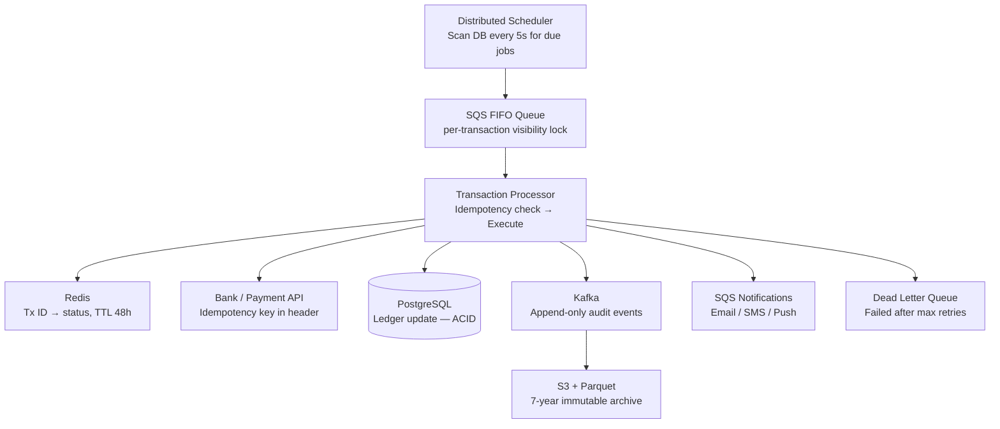

# Design a Scheduled Digital Transaction System

**Difficulty**: 🔴 Advanced | **Codemania #77**
**Reading Time**: ~14 min
**Interview Frequency**: High

---

## The Core Problem

Executing 100 million pre-scheduled financial transactions (bill payments, recurring transfers) per day with exactly-once guarantees and a complete compliance audit trail. The hard problems: clock skew across distributed schedulers may fire the same job twice; network failures during execution may leave transactions in an ambiguous state; regulatory compliance requires an immutable record of every action.

---

## Functional Requirements

- Schedule recurring transactions (daily, weekly, monthly, custom cron)
- Execute scheduled transactions at the configured time (± 5 second accuracy)
- Exactly-once execution — no duplicate charges
- Support for retry on transient failures (bank downtime) with configurable policy
- Immutable audit log of all execution attempts and outcomes
- User notification on success, failure, and retry

## Non-Functional Requirements

| Requirement | Target |
|-------------|--------|
| Scale | 100M scheduled transactions/day = ~1,160/sec |
| Exactly-once | Zero duplicate charges (idempotency guarantee) |
| Time accuracy | Execute within ± 5 seconds of scheduled time |
| Retry policy | Configurable: max 3 retries over 24 hours |
| Audit retention | 7 years (SOX/HIPAA compliance) |
| Latency | Transaction confirmation to user within 30 seconds |

---

## Back-of-Envelope Estimates

- **Daily volume**: 100M transactions/day ÷ 86,400 = 1,160 TPS average
- **Peak hour**: Bill payments cluster at month-end → 5× peak = ~5,800 TPS
- **Job scheduler load**: 100M jobs → scan upcoming 5-min window = 100M ÷ 288 five-min slots = ~347k jobs per 5-min slot
- **Idempotency store**: 100M transaction IDs × 64 bytes = 6.4 GB (fits in Redis)
- **Audit log**: 100M events/day × 500 bytes = 50 GB/day → 18 TB/year

---

## High-Level Architecture



---

## Key Design Decisions

### 1. Centralized vs Distributed Scheduler

| Approach | Centralized Scheduler | Distributed Scheduler |
|----------|----------------------|----------------------|
| Simplicity | Simple — single process owns clock | Complex — must handle leader election |
| Scale | Single-process bottleneck | Horizontal scale |
| Clock skew | N/A — one clock | Must handle skew; use NTP + distributed lock |
| SPOF | Yes — single scheduler failure halts all jobs | No — multiple nodes, leader election |

**Decision**: Distributed scheduler with leader election (ZooKeeper or Postgres advisory lock). The leader scans the `scheduled_jobs` table every 5 seconds for jobs due in the next 60 seconds and enqueues them into SQS. If leader dies, new leader elected within 10 seconds — maximum 10 second delay for in-progress scan window.

### 2. Idempotency via Transaction ID

Every transaction has a stable `transaction_id` (UUID generated at schedule creation time). Before execution:

```python
def execute_transaction(tx_id, amount, from_acct, to_acct):
    # Step 1: Acquire idempotency lock in Redis
    if not redis.setnx(f"tx:lock:{tx_id}", "processing", ex=300):
        current = redis.get(f"tx:status:{tx_id}")
        if current == "completed":
            return {"status": "already_completed"}
        # Still processing — wait or return pending
        return {"status": "in_progress"}

    try:
        # Step 2: Execute with idempotency key to bank API
        result = bank_api.transfer(
            idempotency_key=tx_id,
            amount=amount, from_acct=from_acct, to_acct=to_acct
        )
        redis.set(f"tx:status:{tx_id}", "completed", ex=172800)  # 48h TTL
        write_audit_log(tx_id, "completed", result)
        return result
    except Exception as e:
        redis.delete(f"tx:lock:{tx_id}")  # Release lock for retry
        write_audit_log(tx_id, "failed", str(e))
        raise
```

### 3. Retry Policy with Exponential Backoff

For transient failures (bank timeout, network error):
- Retry 1: 5 minutes after failure
- Retry 2: 1 hour after failure
- Retry 3: 6 hours after failure
- After 3 failures: Move to DLQ, notify user, pause recurring schedule

For permanent failures (insufficient funds, closed account):
- Do not retry; notify user immediately; optionally suspend future recurrences

### 4. Compensating Transactions for Partial Failures

Distributed transaction (debit account A + credit account B) may partially complete. Use the Saga pattern:
1. Debit account A → success
2. Credit account B → failure (bank API timeout)
3. Execute compensation: credit account A (undo the debit)

Each step records a compensating action in the audit log. The saga orchestrator ensures the compensation runs if any step fails.

---

## Handling Clock Skew and Time Zones

- All scheduled times stored as UTC timestamps in the database
- User-visible times converted to user's timezone at display time
- Month-end handling: "every month on the 30th" → February executes on Feb 28 (last day of month logic)
- DST transitions: jobs scheduled at "2:00 AM daily" near DST transition get explicit UTC times; no double-execution

---

## Audit Log — Tamper-Evident Chain

For SOX/HIPAA compliance, the audit log must be tamper-evident:
```json
{
  "tx_id": "uuid-123",
  "event": "TRANSACTION_COMPLETED",
  "timestamp": "2024-01-15T14:00:00Z",
  "amount": 1500.00,
  "prev_hash": "sha256:abcdef...",
  "hash": "sha256:123456..."  // Hash of this record + prev_hash
}
```

Each record hashes the previous record's hash — like a blockchain. Tampering with any record breaks all subsequent hashes.

---

## Top Interview Questions for This Problem

| Question | Tests |
|----------|-------|
| How do you ensure a transaction fires exactly once when two schedulers both see it as "due"? | Distributed lock (Redis SETNX), SQS visibility timeout, idempotency key |
| What happens if the transaction processor crashes after debiting account A but before crediting account B? | Saga pattern, compensating transactions, at-least-once with idempotency |
| How do you handle a bank that goes down for 6 hours? | Retry queue with exponential backoff, DLQ, user notification |
| How do you reconstruct the exact state of account X at time T for an audit? | Event sourcing, append-only ledger, timestamp-based replay |

---

## Common Mistakes

1. **Using wall-clock time in the scheduler without distributed lock**: Two scheduler nodes both scan and enqueue the same job → duplicate execution. Use `SELECT ... FOR UPDATE SKIP LOCKED` on the job table or Redis lock.
2. **Trusting the bank API's success response without local record**: Store the intent to debit before calling the bank. If you crash after calling the bank but before recording success, you'll re-execute without idempotency.
3. **Hard-deleting job records after completion**: Keep them for 7 years for regulatory audit. Soft-delete with status = "completed".

---

## Related Concepts

- [Message Queue Basics](../../04-messaging/concepts/message-queue-basics) — SQS FIFO for exactly-once delivery
- [Rate Limiter](../05-infrastructure/rate-limiter) — Throttle outbound bank API calls

---

## 📚 Resources & References

| Resource | Type | What You'll Learn |
|----------|------|------------------|
| [Stripe — Idempotency Keys](https://stripe.com/blog/idempotency) | 📖 Blog | How Stripe implements exactly-once payment APIs |
| [ByteByteGo — Distributed Job Scheduler](https://www.youtube.com/@ByteByteGo) | 📺 YouTube | Scheduler architecture, distributed locking |
| [Hussein Nasser — Saga Pattern](https://www.youtube.com/@hnasr) | 📺 YouTube | Distributed transactions with compensating actions |
| [Martin Kleppmann — Designing Data-Intensive Applications](https://martin.kleppmann.com) | 📚 Book | Distributed transactions, exactly-once semantics |
| [AWS Step Functions for Reliable Scheduling](https://docs.aws.amazon.com/step-functions/latest/dg/concepts-amazon-states-language.html) | 📚 Book | AWS-native approach to durable workflows |
