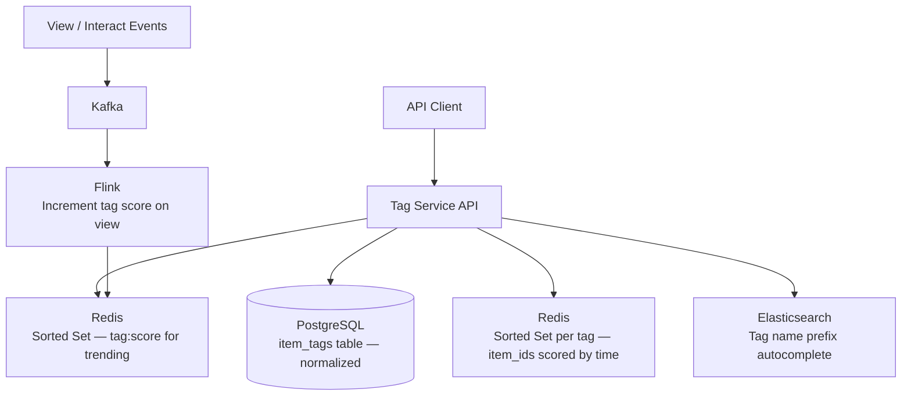
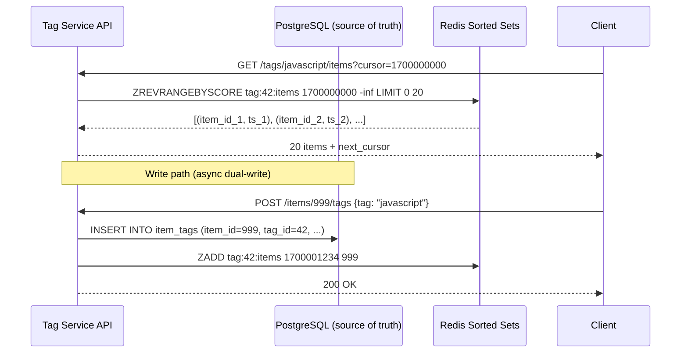
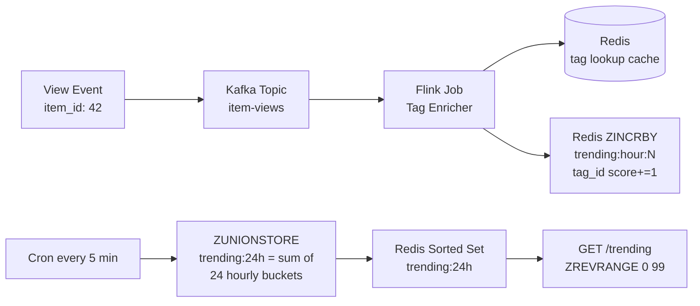
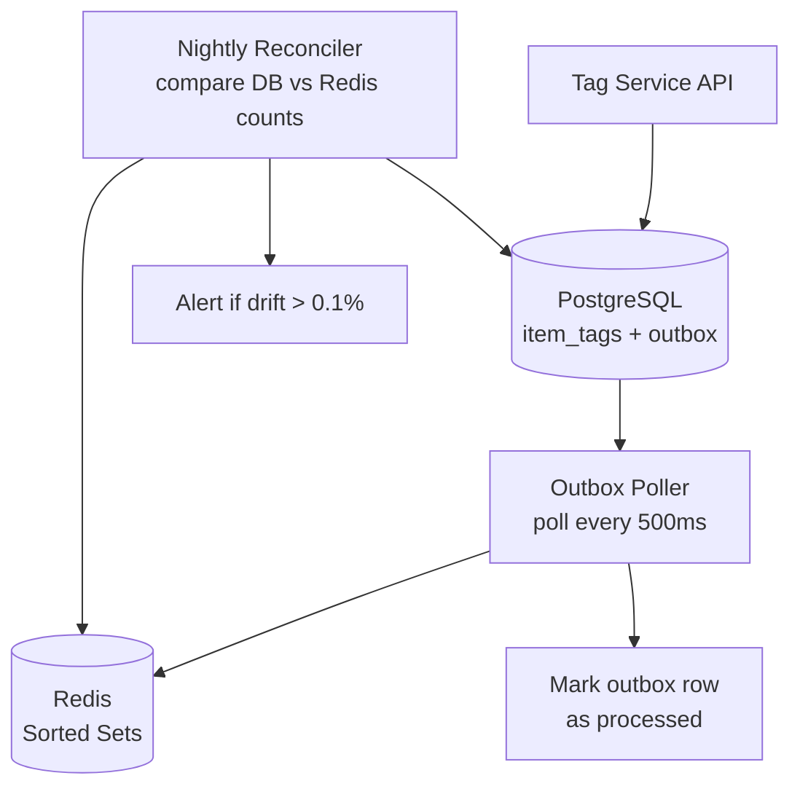

# Design a Tagging Service

**Difficulty**: 🟢 Easy | **Codemania #85**
**Reading Time**: ~8 min
**Interview Frequency**: Medium

---

## The Core Problem

Implementing a tag system for a platform with 1 billion items (articles, products, videos), supporting three query patterns: "items with tag X", "tags for item Y", and "trending tags in the last 24 hours." The data modeling challenge is efficient bidirectional lookup in a many-to-many relationship at scale.

---

## Functional Requirements

- Add/remove tags to any item (article, product, video)
- Query: all tags for a given item (O(1) lookup)
- Query: all items with a given tag (paginated, sorted by recency or popularity)
- Query: top-100 trending tags in last 24 hours
- Tag autocomplete: prefix search for tag names (type "java" → suggest "java", "javascript", "java-spring")
- Tag normalization: "JavaScript", "javascript", "JAVASCRIPT" all map to same canonical tag

## Non-Functional Requirements

| Requirement | Target |
|-------------|--------|
| Items | 1B items, avg 5 tags per item = 5B tag associations |
| Tags | 10M unique tags globally |
| Query latency | < 10ms for item tags, < 50ms for tag→items list |
| Trending computation | Real-time, updated every 5 minutes |
| Write throughput | 100k tag operations/sec (add/remove) |

---

## Back-of-Envelope Estimates

- **Tag association storage**: 5B rows × 20 bytes = 100 GB (fits in PostgreSQL with partitioning)
- **Inverted index**: 10M tags × avg 500 item_ids × 8 bytes = 40 GB (Redis sorted set per tag)
- **Trending sorted set**: 10M tags × 16 bytes in Redis sorted set = 160 MB (trivial)
- **Tag autocomplete trie**: 10M tag names × avg 10 chars = 100 MB trie or Elasticsearch prefix index

---

## High-Level Architecture



---

## Key Design Decisions

### 1. Data Model: Normalized vs Denormalized Tag Storage

**Normalized (recommended)**:
```sql
CREATE TABLE tags (
  id      BIGINT PRIMARY KEY,
  name    VARCHAR(100) UNIQUE,  -- canonical lowercase form
  slug    VARCHAR(100) UNIQUE   -- url-safe version
);

CREATE TABLE item_tags (
  item_id  BIGINT NOT NULL,
  tag_id   BIGINT NOT NULL REFERENCES tags(id),
  created_at TIMESTAMPTZ DEFAULT NOW(),
  PRIMARY KEY (item_id, tag_id)
);
CREATE INDEX idx_item_tags_tag_id ON item_tags(tag_id, created_at DESC);
CREATE INDEX idx_item_tags_item_id ON item_tags(item_id);
```

**Denormalized** (tags as array column in item table):
```sql
-- Postgres arrays
ALTER TABLE items ADD COLUMN tag_names TEXT[];
CREATE INDEX idx_items_tags ON items USING GIN(tag_names);
```

| Dimension | Normalized | Denormalized (Array) |
|-----------|-----------|---------------------|
| Write | 2 tables, 1 row each | Single table update |
| Lookup item tags | `JOIN item_tags JOIN tags` | Array access — O(1) |
| Lookup items by tag | `WHERE tag_id = X` with index | `WHERE X = ANY(tag_names)` with GIN index |
| Rename tag | Single UPDATE in tags table | Update millions of item rows |
| Trending computation | `GROUP BY tag_id COUNT(*)` | Scan and count array elements |

**Decision**: Normalized for platforms where tag names can change (rename "react.js" → "react") and where trending computation needs efficiency. Denormalized acceptable for read-heavy platforms with stable tag names.

### 2. Inverted Index for tag → items Queries

For "all items with tag X" queries, a database index on `tag_id` works for small scales. At 1B items × 5 tags = 5B rows, pagination and performance suffer. Use Redis sorted set as a secondary inverted index:

```
Key: tag:{tag_id}:items
Value: Sorted Set where score = created_at (Unix timestamp), member = item_id
```

```python
# Add item to tag
redis.zadd(f"tag:{tag_id}:items", {item_id: created_at_unix})

# Get latest 20 items with tag
redis.zrevrange(f"tag:{tag_id}:items", 0, 19, withscores=True)

# Cursor-based pagination: get items before cursor
redis.zrevrangebyscore(f"tag:{tag_id}:items", cursor_score, '-inf', start=0, num=20)
```

### 3. Trending Tags with Redis Sorted Set

Track tag popularity with a windowed approach:
```python
# On each view/interaction event for an item:
tags = get_tags_for_item(item_id)
hour_bucket = int(time.time() / 3600)  # current hour
for tag_id in tags:
    redis.zincrby(f"trending:hour:{hour_bucket}", 1, tag_id)
    redis.expire(f"trending:hour:{hour_bucket}", 3600 * 25)  # 25h TTL

# Compute 24h trending: merge last 24 hourly buckets
# ZUNIONSTORE trending:24h 24 trending:hour:N ... trending:hour:N-23
redis.zunionstore("trending:24h", [f"trending:hour:{hour_bucket - i}" for i in range(24)])
top_tags = redis.zrevrange("trending:24h", 0, 99, withscores=True)
```

### 4. Tag Autocomplete

Three approaches:
- **Trie in Redis**: Store tag prefixes as keys; fast but complex to update
- **Elasticsearch prefix query**: `{"prefix": {"name": {"value": "java"}}}` with dedicated low-latency cluster
- **PostgreSQL trigram index**: `CREATE INDEX ON tags USING GIN(name gin_trgm_ops)` — works for prefix and fuzzy match

**Decision**: Elasticsearch for autocomplete (purpose-built for prefix search, handles typos with fuzzy matching, supports highlighting the matching prefix in suggestions).

### 5. Tag Normalization

All tag input goes through a normalization pipeline:
1. Lowercase: "JavaScript" → "javascript"
2. Strip special chars: "c++" → "cpp", "c#" → "csharp"
3. Slug: "machine learning" → "machine-learning"
4. Synonym mapping: "js" → "javascript", "node" → "nodejs"

Normalization applied at write time. Canonical form stored in `tags.name`, original user input optionally stored in `tags.aliases`.

---

## Top Interview Questions for This Problem

| Question | Tests |
|----------|-------|
| How do you efficiently query "all items with tag X" when a tag has 10M items? | Inverted index, cursor-based pagination, Redis sorted set |
| How do you compute trending tags in real-time? | Hourly Redis sorted sets, ZUNIONSTORE for 24h window |
| How do you handle tag merging (merge "nodejs" and "node.js")? | Update canonical tag ID, run migration, alias table |
| How would you recommend related tags for a given tag? | Co-occurrence matrix, "tags frequently used together", collaborative filtering |

---

## Common Mistakes

1. **Querying items by tag using LIKE '%javascript%'**: Full table scan. Always use a proper index (GIN for arrays, inverted index for tag-item associations).
2. **Storing tags as comma-separated strings**: Makes queries, indexing, and normalization very difficult. Always use a junction table or structured array.
3. **Recomputing trending from scratch every 5 minutes**: Expensive aggregate query on 5B rows. Pre-accumulate with Redis ZINCRBY as events arrive.

---

## Component Deep Dive 1: Inverted Index — The Core Scaling Challenge

The inverted index is the most critical architectural component in a tagging service. It answers the query "give me all items with tag X" without scanning every item in the database. At 1 billion items with 5 tags each, a naive `SELECT item_id FROM item_tags WHERE tag_id = X` query with even a B-tree index will return millions of rows and require expensive disk seeks for any popular tag. This is where the design either scales or collapses.

### How It Works Internally

An inverted index maps from tag → list of items, exactly the reverse of the natural data direction (item → tags). At the database layer, the `idx_item_tags_tag_id` B-tree index on `(tag_id, created_at DESC)` is already an inverted index — it clusters all rows for a given tag together on disk. For moderate-traffic tags (< 100k items), this is sufficient.

For high-cardinality tags like "javascript" (potentially 50M items on Stack Overflow), even a good B-tree index will cause deep scans. The fix is a Redis Sorted Set secondary index operating in memory:



The Redis Sorted Set stores `item_id` as the member and `created_at` Unix timestamp as the score, enabling time-ordered pagination without any database hits for common read paths.

### Why Naive Approaches Fail at Scale

A naive `OFFSET`-based pagination (`LIMIT 20 OFFSET 10000`) forces the database to scan and discard 10,000 rows on every page flip — at 10M items per tag, reaching page 500,000 means scanning 10 million rows to return 20. Redis cursor-based pagination via `ZREVRANGEBYSCORE` is O(log N + M) regardless of page depth.

### Implementation Option Trade-offs

| Approach | Latency (p99) | Throughput | Trade-off |
|----------|---------------|------------|-----------|
| PostgreSQL B-tree index only | 5–50ms | ~5k reads/sec per tag | Simple; degrades linearly with tag cardinality |
| Redis Sorted Set (per-tag) | < 2ms | ~100k reads/sec | Requires dual-write; 40 GB Redis memory for full index |
| Elasticsearch `term` query | 5–20ms | ~20k reads/sec | Full-text + filtering in one system; more infrastructure |

**Chosen approach**: Redis Sorted Set for top 1% of high-traffic tags; PostgreSQL index for the long tail. A tag popularity counter (maintained via Redis INCR) gates which tags get promoted to Redis-backed inverted index.

### Consistency on Redis Promotion

When a tag crosses the promotion threshold (10,000 items), a background job backfills the Redis Sorted Set from PostgreSQL in one pass:

```python
# Backfill sorted set for tag_id from PostgreSQL
with db.cursor() as cur:
    cur.execute("""
        SELECT item_id, EXTRACT(EPOCH FROM created_at)::BIGINT
        FROM item_tags WHERE tag_id = %s ORDER BY created_at DESC
    """, (tag_id,))
    pipe = redis.pipeline(transaction=False)
    for item_id, score in cur:
        pipe.zadd(f"tag:{tag_id}:items", {item_id: score}, nx=True)
        if len(pipe) >= 500:       # flush in 500-item batches
            pipe.execute()
    pipe.execute()
# Atomically flip the "use Redis" flag for this tag
redis.set(f"tag:{tag_id}:promoted", 1)
```

The `nx=True` flag makes each ZADD idempotent: if the backfill job is interrupted and retried, already-written members are skipped. The `promoted` flag is only set after the full backfill completes, so the read path continues using PostgreSQL until the Redis index is complete. This avoids a partial-index window where some items are missing from Redis results.

---

## Component Deep Dive 2: Trending Tags — Windowed Aggregation at 100k Events/sec

The trending computation is a streaming aggregation problem. At 100k tag operations per second, you cannot recompute "top 100 tags in last 24 hours" by scanning the `item_tags` table. You need pre-accumulated counts updated in real-time.

### Internal Mechanics

The design uses a sliding window of 24 hourly Redis Sorted Sets. Each set key is `trending:hour:{UNIX_HOUR}` where `UNIX_HOUR = floor(unix_timestamp / 3600)`. On each view/interact event for any item, the service increments the score for each of the item's tags in the current hour's sorted set.



### Scale Behavior at 10x Load

At 1M events/sec (10x baseline), the main bottleneck shifts from Redis write throughput to the Flink enrichment step — fetching tags for each item_id under high concurrency. The tag lookup cache (Redis Hash `item:{item_id}:tags`) must be warmed and have a high hit rate (>99%). A cache miss at 1M events/sec that falls through to PostgreSQL will saturate the database connection pool.

At this scale, consider sharding the trending sorted sets by tag ID prefix across multiple Redis nodes, and using Flink's keyed state to batch ZINCRBY calls with a 100ms micro-batch window, reducing Redis round-trips from 1M/sec to ~500/sec aggregated.

The `ZUNIONSTORE` operation that merges 24 hourly buckets runs every 5 minutes. At 10M tags × 24 buckets, this operation itself takes ~2 seconds. At 10x load it could take 20 seconds — longer than the 5-minute schedule. Fix: merge incrementally. Instead of recomputing from scratch, maintain a `trending:23h` set and use `ZDIFFSTORE` to subtract the expiring hour and add the new one.

---

## Component Deep Dive 3: Tag Normalization Pipeline

Tag normalization determines whether "JavaScript", "javascript", "Java Script", and "js" map to the same tag or create four separate low-signal tags. Poor normalization fragments the tag graph and breaks trending computation, autocomplete relevance, and cross-platform search.

### Technical Decisions

The normalization pipeline runs synchronously at write time before any storage operation. This is a deliberate trade-off: slightly higher write latency (~1ms) in exchange for guaranteed consistency at read time. Async normalization would allow write spikes but risks different canonical forms being stored if two concurrent writes race.

**Pipeline stages** (applied in order):

1. **Unicode normalization** (NFC): ensures "café" and "café" hash identically
2. **Lowercase**: "JavaScript" → "javascript"
3. **Special character mapping**: "c++" → "cpp", "c#" → "csharp", "node.js" → "nodejs"
4. **Whitespace collapse + hyphenation**: "machine  learning" → "machine-learning"
5. **Synonym lookup**: query `tag_synonyms` table; "js" → tag_id of "javascript"
6. **Length validation**: reject tags > 50 chars, < 2 chars
7. **Blocklist check**: reject profanity, reserved words, spam patterns

The synonym table is cached in-process (invalidated on update via pub/sub) with a 5-minute TTL, making synonym lookups a ~0.1ms memory operation rather than a database round-trip.

For tag merging operations (when a moderator decides "nodejs" and "node.js" should unify), the process is:
1. Insert alias record: `(source_tag_id: nodejs, canonical_tag_id: node.js)`
2. Background job migrates all `item_tags` rows pointing to source → canonical tag
3. Old tag becomes an alias — queries for "nodejs" return "node.js" items
4. Elasticsearch index is updated asynchronously

---

## Data Model

Full schema with real field names, types, indexes, and partitioning strategy:

```sql
-- Tag canonical registry
CREATE TABLE tags (
    tag_id       BIGSERIAL PRIMARY KEY,
    name         VARCHAR(100) NOT NULL,   -- canonical lowercase slug, e.g. "machine-learning"
    display_name VARCHAR(150) NOT NULL,   -- human-readable, e.g. "Machine Learning"
    description  TEXT,
    created_at   TIMESTAMPTZ NOT NULL DEFAULT NOW(),
    item_count   BIGINT NOT NULL DEFAULT 0,  -- denormalized counter, updated async
    is_blocked   BOOLEAN NOT NULL DEFAULT FALSE,
    CONSTRAINT tags_name_unique UNIQUE (name)
);

-- Synonym and alias mapping
CREATE TABLE tag_synonyms (
    synonym_id        BIGSERIAL PRIMARY KEY,
    source_name       VARCHAR(100) NOT NULL,  -- e.g. "js"
    canonical_tag_id  BIGINT NOT NULL REFERENCES tags(tag_id),
    created_by        BIGINT,                 -- admin user id
    created_at        TIMESTAMPTZ NOT NULL DEFAULT NOW(),
    CONSTRAINT tag_synonyms_source_unique UNIQUE (source_name)
);
CREATE INDEX idx_tag_synonyms_canonical ON tag_synonyms(canonical_tag_id);

-- Item-tag associations (partitioned by tag_id range for parallel scans)
CREATE TABLE item_tags (
    item_id     BIGINT NOT NULL,
    tag_id      BIGINT NOT NULL REFERENCES tags(tag_id),
    item_type   VARCHAR(20) NOT NULL,         -- 'article', 'product', 'video'
    created_at  TIMESTAMPTZ NOT NULL DEFAULT NOW(),
    created_by  BIGINT,                       -- user who applied the tag
    PRIMARY KEY (item_id, tag_id)
) PARTITION BY HASH (tag_id);

-- 16 hash partitions for parallel index scans
CREATE TABLE item_tags_p0  PARTITION OF item_tags FOR VALUES WITH (MODULUS 16, REMAINDER 0);
-- ... p1 through p15

-- Primary access pattern: "all items with tag X, newest first"
CREATE INDEX idx_item_tags_tag_recency ON item_tags(tag_id, created_at DESC);
-- Secondary: "all tags for item Y"
CREATE INDEX idx_item_tags_item ON item_tags(item_id);

-- Tag co-occurrence for "related tags" feature
CREATE TABLE tag_cooccurrence (
    tag_id_a    BIGINT NOT NULL REFERENCES tags(tag_id),
    tag_id_b    BIGINT NOT NULL REFERENCES tags(tag_id),
    co_count    BIGINT NOT NULL DEFAULT 0,
    updated_at  TIMESTAMPTZ NOT NULL DEFAULT NOW(),
    PRIMARY KEY (tag_id_a, tag_id_b),
    CONSTRAINT no_self_cooccurrence CHECK (tag_id_a < tag_id_b)
);
CREATE INDEX idx_cooccurrence_a ON tag_cooccurrence(tag_id_a, co_count DESC);
```

**Redis data structures (companion layer):**

```
# Inverted index for popular tags (> 10k items)
tag:{tag_id}:items        → ZSET  member=item_id, score=created_at_unix

# Trending window (24 hourly buckets)
trending:hour:{unix_hour} → ZSET  member=tag_id, score=view_count
trending:24h              → ZSET  member=tag_id, score=sum_of_24h_views (recomputed every 5min)

# Item tag cache (avoid DB for tag enrichment in trending pipeline)
item:{item_id}:tags       → SET   members=tag_ids (TTL: 300s)

# Tag name → tag_id lookup for normalization (cached synonym table)
tag:slug:{name}           → STRING  value=tag_id (TTL: 300s)
```

---

## Scale Bottlenecks

| Traffic Level | Component That Breaks | Symptoms | Mitigation |
|---------------|----------------------|----------|------------|
| 10x baseline (1M writes/sec) | Redis ZINCRBY throughput for trending sets | Trending updates lag > 30s behind real-time | Shard trending sets by tag_id range across Redis cluster; batch micro-aggregation in Flink (100ms windows) |
| 10x baseline (read) | PostgreSQL `item_tags` for long-tail tag queries | p99 tag→items query > 500ms | Promote all tags with > 1k items to Redis inverted index; add read replicas with connection pooling |
| 100x baseline | Redis memory for full inverted index (400 GB) | OOM on Redis nodes | Tiered storage: Redis for top 0.1% tags (by traffic), Elasticsearch for next 1%, PostgreSQL for long tail |
| 100x baseline | `ZUNIONSTORE` for 24h trending merge | Merge job takes longer than 5-min schedule | Incremental merge: maintain rolling set, subtract expiring hour bucket only |
| 1000x baseline | PostgreSQL `item_tags` total size (100 GB → 10 TB) | Partition pruning misses; vacuum lag | Shard PostgreSQL by `item_id % N`; use Cassandra wide-column for item_tags (`partition_key=tag_id`, `clustering=created_at DESC`) |
| Any | Elasticsearch for autocomplete cluster down | Autocomplete 503s | Fallback to PostgreSQL trigram index with `SIMILAR TO` — degraded but functional |

---

## How Pinterest Built Their Tagging and Interest Graph

Pinterest is one of the best-documented cases of a tagging system at massive scale. By 2019 they were serving 300M+ monthly active users with a core use-case identical to this problem: every Pin (image/video) has a set of interest tags (called "topics" or "interests"), and the entire recommendation engine depends on efficiently traversing the tag graph.

**Technology choices:**
- Pinterest replaced their original MySQL-backed tag associations with a graph database approach built on top of HBase and their internal graph system called "Pixie." Tag associations are edges in a bipartite graph: `(Pin nodes) ↔ (Interest nodes)`.
- The tag index is a custom inverted index stored in HBase with `rowkey = topic_id`, storing up to 100k Pin IDs per topic with recency-based eviction. This is structurally identical to the Redis Sorted Set design described above, but persisted to HBase for durability at scale.
- Trending computation uses a Lambda architecture: real-time counts via Kafka → Storm (now Flink) for the hot path, and Hadoop batch jobs nightly for accurate long-term trend signals.

**Specific numbers:**
- 200 billion+ pins in the system (2022), average ~5-8 board tags = ~1 trillion tag associations
- Autocomplete for 500M+ unique interest phrases served via Elasticsearch with < 50ms p99
- Tag normalization pipeline processes 10M+ new pins/day with a custom NLP interest classifier layered on top of user-supplied tags

**Non-obvious architectural decision:** Pinterest does not trust user-supplied tags as ground truth. Every item is also auto-tagged by a computer vision model (PinSage, their graph neural network). The auto-tags and user-tags are stored separately but merged at query time with weighted scoring. This prevents tag spam, handles content whose user-supplied tags are wrong or missing, and allows trending topics to emerge even when users don't explicitly tag content.

Source: [Pinterest Engineering Blog — "Building Pixie: A System for Recommendations at Scale"](https://medium.com/@Pinterest_Engineering/building-a-real-time-user-action-counting-system-for-ads-88a60d9c9a89) and [Evan Sparkman, Pinterest, RecSys 2018](https://labs.pinterest.com/user/themes/pin_labs/assets/paper/pintext-kdd2019.pdf).

---

## API Design

All tag operations flow through a single Tag Service. Below are the five core endpoints with their contracts, expected latencies, and key implementation notes.

### Endpoints

```
# Apply tags to an item (idempotent)
PUT /v1/items/{item_id}/tags
Body: { "tags": ["javascript", "react", "frontend"] }
Response: { "applied": ["javascript", "react", "frontend"], "normalized_to": {"js": "javascript"} }
Latency target: < 20ms p99

# Remove a tag from an item
DELETE /v1/items/{item_id}/tags/{tag_slug}
Response: 204 No Content
Latency target: < 10ms p99

# Get all tags for an item (item → tags direction)
GET /v1/items/{item_id}/tags
Response: { "tags": [{ "slug": "javascript", "display_name": "JavaScript", "item_count": 4200000 }] }
Latency target: < 5ms p99  — served from PostgreSQL item index or in-process cache

# Get items for a tag (tag → items direction, paginated)
GET /v1/tags/{tag_slug}/items?cursor={cursor}&limit=20&sort=recency|popularity
Response: { "items": [...], "next_cursor": "1700001234_item999", "total_approx": 4200000 }
Latency target: < 10ms p99 for cursor page 1–100; < 50ms for deep pages

# Trending tags
GET /v1/tags/trending?window=24h&limit=100
Response: { "tags": [{ "slug": "...", "score": 98200, "rank": 1 }], "computed_at": "..." }
Latency target: < 5ms p99 — ZREVRANGE on pre-computed trending:24h set

# Autocomplete
GET /v1/tags/autocomplete?q=java&limit=10
Response: { "suggestions": [{ "slug": "javascript", "display_name": "JavaScript", "item_count": 4200000 }] }
Latency target: < 30ms p99 — Elasticsearch prefix query
```

### Rate Limiting and Abuse Prevention

Tag writes are a common abuse vector: bots apply hundreds of irrelevant tags to items to game trending. Apply per-user rate limits at the API gateway layer:
- Anonymous users: 10 tag operations/minute
- Authenticated users: 100 tag operations/minute
- Trusted partners (via API key): 10,000 tag operations/minute

Tags applied faster than the rate limit are queued in a per-user Redis List with a 5-minute TTL. If the queue is full (> 50 pending), return HTTP 429 immediately. This prevents thundering-herd tag floods while letting legitimate bulk imports drain through.

---

## Consistency and Dual-Write Safety

Every write to the tagging service touches at minimum two systems: PostgreSQL (source of truth) and Redis (secondary index). If the PostgreSQL write succeeds but the Redis write fails, the inverted index is stale — queries for that tag will miss the item until the inconsistency is repaired. If Redis succeeds first and PostgreSQL fails, the index points to an item that doesn't officially have that tag.

### The Dual-Write Problem

Distributed dual-writes have no atomic transaction boundary. Three common failure modes:

1. **Network partition after DB commit**: PostgreSQL write succeeds, Redis unreachable. The item is in the database but not searchable by tag until Redis is restored.
2. **Redis write fails silently**: ZADD returns an error that the application swallows. Silent data loss — no alarm fires, tag count drifts.
3. **Partial tag batch**: An item receives tags [A, B, C]. PostgreSQL inserts all three. Redis accepts A and B but times out on C. Tag C query is broken.

### Recommended Repair Strategy: Outbox Pattern + Reconciliation



The **Outbox pattern** writes a pending event row in the same PostgreSQL transaction as the `item_tags` insert. A separate poller reads unprocessed outbox rows and applies them to Redis, then marks them done. This guarantees at-least-once delivery to Redis: if Redis is down, the outbox row stays pending and is retried. The cost is slightly higher write latency (~5ms extra for the outbox insert) and a short window of inconsistency between the DB commit and the Redis apply (typically < 1 second at normal load).

**Nightly reconciler**: A batch job compares `item_count` in the `tags` table against `ZCARD tag:{id}:items` in Redis. Any tag with a delta > 1% triggers an automated repair job that re-populates the Redis sorted set from PostgreSQL for that tag. This catches any long-lived drift from silent failures.

### Idempotency

Both the outbox poller and any retry path must be idempotent. `ZADD NX` (only add if not exists) prevents double-counting on retry. For score updates (e.g., timestamp changed), use `ZADD XX` (only update existing). The combined command `ZADD NX` for new associations and `ZADD XX CH` for updates covers both cases safely.

---

## Read Path Optimization: Tiered Lookup Strategy

At steady state, the tag service receives approximately 800k read requests per second (80% of total traffic). The tiered read strategy avoids unnecessary database hits by consulting faster layers first:

| Tier | Storage | Hit Rate Target | Latency | Use Case |
|------|---------|----------------|---------|----------|
| 1 — L1 cache | In-process LRU (per API pod) | 40% | < 0.1ms | Ultra-hot tags: "javascript", "python" — top 1000 tags by traffic |
| 2 — Redis Sorted Set | Redis cluster | 55% | < 2ms | All promoted tags (> 10k items) — covers ~99% of actual read traffic |
| 3 — PostgreSQL replica | Read replica with connection pool | 4.9% | 5–50ms | Long-tail tags not in Redis |
| 4 — PostgreSQL primary | Primary (last resort) | 0.1% | 5–20ms | Very new tags not yet on replica |

The in-process LRU cache per API pod holds the top 1,000 tag-to-items sorted lists in JVM heap, invalidated by TTL (60 seconds). This alone eliminates ~40% of Redis round-trips. At 100 API pods × 1,000 tags × 100kB average tag list = 10 GB total in-process cache — within acceptable JVM heap limits.

**Cache invalidation on tag removal**: When a tag is removed from an item, the API issues a synchronous `ZREM` to Redis and a `DEL` on any in-process cache key via pub/sub broadcast to all API pods. This keeps the multi-tier cache consistent within one round-trip time (~1ms cluster-wide pub/sub latency).

---

## Interview Angle

**What the interviewer is testing:** Your ability to recognize the many-to-many relationship as the core challenge and choose the right secondary index strategy (Redis Sorted Set vs. DB index vs. Elasticsearch) based on the query pattern and scale — not just enumerate data structures.

**Common mistakes candidates make:**

1. **Jumping straight to Elasticsearch for everything**: Elasticsearch is not free — it requires separate infrastructure, eventual consistency, and operational complexity. For a tagging service, PostgreSQL with proper B-tree indexes handles all queries up to ~100M items. Recommending Elasticsearch before establishing that scale is needed signals unfamiliarity with cost/complexity trade-offs.

2. **Using OFFSET-based pagination for tag→items queries**: Candidates who write `SELECT item_id FROM item_tags WHERE tag_id = X ORDER BY created_at DESC LIMIT 20 OFFSET 2000` miss the O(N) scan cost for deep pages. Cursor-based pagination via `created_at < :cursor` is essential for tags with millions of items.

3. **Ignoring write amplification in the trending pipeline**: Adding a single tag to an item and then viewing that item triggers writes to: `item_tags` (PostgreSQL), `tag:{id}:items` (Redis), and `trending:hour:{h}` (Redis for each tag). At 100k events/sec × 5 tags/item, that's 500k Redis ZINCRBY operations per second. Candidates who don't quantify write amplification miss a critical bottleneck.

**The insight that separates good from great answers:** Recognizing that trending computation is fundamentally a stream processing problem, not a batch problem. Great candidates propose the hourly Redis bucket approach (O(1) incremental update per event) over the naive "recompute from item_tags every 5 minutes" approach — and can explain why ZUNIONSTORE across 24 fixed-size sorted sets is O(24 × N) rather than O(total events in 24h).

A second-order insight: trending by raw count favours evergreen high-traffic tags like "javascript" permanently. Production trending systems apply **velocity weighting** — recent hours contribute more than older hours. Implement by multiplying hourly bucket scores before ZUNIONSTORE: hour N (current) weight 1.0, hour N-1 weight 0.9, ..., hour N-23 weight 0.1. This surfaces genuinely trending topics rather than always-popular ones. The weights are constants, so the ZUNIONSTORE `WEIGHTS` argument handles this in a single Redis command:

```
ZUNIONSTORE trending:24h 24
  trending:hour:N trending:hour:N-1 ... trending:hour:N-23
  WEIGHTS 1.0 0.9 0.8 0.7 0.6 0.55 0.5 0.45 0.4 0.35
          0.3 0.28 0.26 0.24 0.22 0.2 0.18 0.16 0.14 0.12
          0.1 0.08 0.06 0.04
```

This is a detail that almost no candidate mentions and immediately signals production experience with trending systems.

---

## Key Numbers to Remember

| Metric | Value | Context |
|--------|-------|---------|
| Tag association storage | 100 GB | 5B rows × 20 bytes in PostgreSQL at 1B items / 5 tags avg |
| Redis inverted index size | 40 GB | 10M tags × 500 avg items × 8 bytes per item_id |
| Trending sorted set size | 160 MB | 10M tags × 16 bytes — negligible, fits in RAM |
| Autocomplete Elasticsearch index | ~500 MB | 10M tag names × avg 50 bytes with inverted index overhead |
| Write throughput target | 100k ops/sec | Add/remove tag operations; peaks to 500k ZINCRBY/sec due to view events × 5 tags/item |
| Tag→items query latency | < 2ms (Redis), < 50ms (PostgreSQL) | Redis path for popular tags; PostgreSQL for long-tail tags |
| Trending merge frequency | Every 5 min | ZUNIONSTORE across 24 hourly buckets; takes ~2s for 10M tags |
| Tag cardinality threshold for Redis promotion | 10,000 items | Tags below threshold served directly from PostgreSQL index |
| Autocomplete response target | < 30ms p99 | Elasticsearch prefix query on 10M tag names |
| Dual-write inconsistency window | < 1 second | Outbox poller at 500ms interval under normal load |
| In-process cache size per pod | 10 MB | Top 1,000 tag lists × ~10 KB average serialized list |
| Nightly reconciler drift threshold | 0.1% | Tags with > 0.1% item count delta trigger auto-repair |
| Tag normalization pipeline latency | ~1 ms | Synchronous, all stages in-process with cached synonym table |
| Redis key TTL for trending buckets | 25 hours | 24h window + 1h buffer to prevent premature expiry |
| Tag promotion backfill batch size | 500 items/pipeline flush | Balances Redis round-trips vs. memory pressure during backfill |
| Rate limit — authenticated user | 100 tag ops/min | Prevents bot abuse while allowing normal bulk imports |

---

## 📚 Resources & References

| Resource | Type | What You'll Learn |
|----------|------|------------------|
| [ByteByteGo — Designing Autocomplete](https://www.youtube.com/@ByteByteGo) | 📺 YouTube | Trie, Elasticsearch prefix search, ranking suggestions |
| [Redis Sorted Sets Documentation](https://redis.io/docs/data-types/sorted-sets/) | 📚 Book | ZADD, ZREVRANGE, ZUNIONSTORE for trending computation |
| [High Scalability — Tagging Systems](https://highscalability.com) | 📖 Blog | Many-to-many tag architectures at scale |
| [Hussein Nasser — Database Indexing](https://www.youtube.com/@hnasr) | 📺 YouTube | GIN indexes, inverted index patterns in PostgreSQL |
