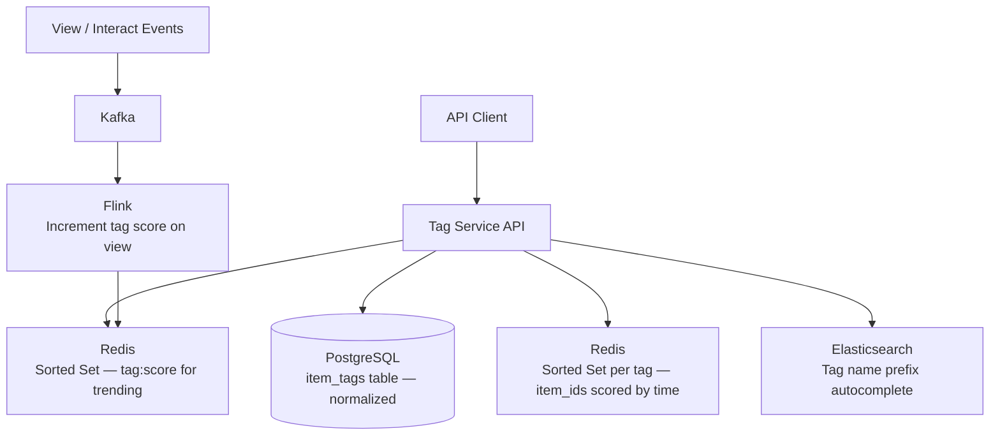

# Design a Tagging Service

**Difficulty**: 🟢 Easy | **Codemania #85**
**Reading Time**: ~8 min
**Interview Frequency**: Medium

---

## The Core Problem

Implementing a tag system for a platform with 1 billion items (articles, products, videos), supporting three query patterns: "items with tag X", "tags for item Y", and "trending tags in the last 24 hours." The data modeling challenge is efficient bidirectional lookup in a many-to-many relationship at scale.

---

## Functional Requirements

- Add/remove tags to any item (article, product, video)
- Query: all tags for a given item (O(1) lookup)
- Query: all items with a given tag (paginated, sorted by recency or popularity)
- Query: top-100 trending tags in last 24 hours
- Tag autocomplete: prefix search for tag names (type "java" → suggest "java", "javascript", "java-spring")
- Tag normalization: "JavaScript", "javascript", "JAVASCRIPT" all map to same canonical tag

## Non-Functional Requirements

| Requirement | Target |
|-------------|--------|
| Items | 1B items, avg 5 tags per item = 5B tag associations |
| Tags | 10M unique tags globally |
| Query latency | < 10ms for item tags, < 50ms for tag→items list |
| Trending computation | Real-time, updated every 5 minutes |
| Write throughput | 100k tag operations/sec (add/remove) |

---

## Back-of-Envelope Estimates

- **Tag association storage**: 5B rows × 20 bytes = 100 GB (fits in PostgreSQL with partitioning)
- **Inverted index**: 10M tags × avg 500 item_ids × 8 bytes = 40 GB (Redis sorted set per tag)
- **Trending sorted set**: 10M tags × 16 bytes in Redis sorted set = 160 MB (trivial)
- **Tag autocomplete trie**: 10M tag names × avg 10 chars = 100 MB trie or Elasticsearch prefix index

---

## High-Level Architecture



---

## Key Design Decisions

### 1. Data Model: Normalized vs Denormalized Tag Storage

**Normalized (recommended)**:
```sql
CREATE TABLE tags (
  id      BIGINT PRIMARY KEY,
  name    VARCHAR(100) UNIQUE,  -- canonical lowercase form
  slug    VARCHAR(100) UNIQUE   -- url-safe version
);

CREATE TABLE item_tags (
  item_id  BIGINT NOT NULL,
  tag_id   BIGINT NOT NULL REFERENCES tags(id),
  created_at TIMESTAMPTZ DEFAULT NOW(),
  PRIMARY KEY (item_id, tag_id)
);
CREATE INDEX idx_item_tags_tag_id ON item_tags(tag_id, created_at DESC);
CREATE INDEX idx_item_tags_item_id ON item_tags(item_id);
```

**Denormalized** (tags as array column in item table):
```sql
-- Postgres arrays
ALTER TABLE items ADD COLUMN tag_names TEXT[];
CREATE INDEX idx_items_tags ON items USING GIN(tag_names);
```

| Dimension | Normalized | Denormalized (Array) |
|-----------|-----------|---------------------|
| Write | 2 tables, 1 row each | Single table update |
| Lookup item tags | `JOIN item_tags JOIN tags` | Array access — O(1) |
| Lookup items by tag | `WHERE tag_id = X` with index | `WHERE X = ANY(tag_names)` with GIN index |
| Rename tag | Single UPDATE in tags table | Update millions of item rows |
| Trending computation | `GROUP BY tag_id COUNT(*)` | Scan and count array elements |

**Decision**: Normalized for platforms where tag names can change (rename "react.js" → "react") and where trending computation needs efficiency. Denormalized acceptable for read-heavy platforms with stable tag names.

### 2. Inverted Index for tag → items Queries

For "all items with tag X" queries, a database index on `tag_id` works for small scales. At 1B items × 5 tags = 5B rows, pagination and performance suffer. Use Redis sorted set as a secondary inverted index:

```
Key: tag:{tag_id}:items
Value: Sorted Set where score = created_at (Unix timestamp), member = item_id
```

```python
# Add item to tag
redis.zadd(f"tag:{tag_id}:items", {item_id: created_at_unix})

# Get latest 20 items with tag
redis.zrevrange(f"tag:{tag_id}:items", 0, 19, withscores=True)

# Cursor-based pagination: get items before cursor
redis.zrevrangebyscore(f"tag:{tag_id}:items", cursor_score, '-inf', start=0, num=20)
```

### 3. Trending Tags with Redis Sorted Set

Track tag popularity with a windowed approach:
```python
# On each view/interaction event for an item:
tags = get_tags_for_item(item_id)
hour_bucket = int(time.time() / 3600)  # current hour
for tag_id in tags:
    redis.zincrby(f"trending:hour:{hour_bucket}", 1, tag_id)
    redis.expire(f"trending:hour:{hour_bucket}", 3600 * 25)  # 25h TTL

# Compute 24h trending: merge last 24 hourly buckets
# ZUNIONSTORE trending:24h 24 trending:hour:N ... trending:hour:N-23
redis.zunionstore("trending:24h", [f"trending:hour:{hour_bucket - i}" for i in range(24)])
top_tags = redis.zrevrange("trending:24h", 0, 99, withscores=True)
```

### 4. Tag Autocomplete

Three approaches:
- **Trie in Redis**: Store tag prefixes as keys; fast but complex to update
- **Elasticsearch prefix query**: `{"prefix": {"name": {"value": "java"}}}` with dedicated low-latency cluster
- **PostgreSQL trigram index**: `CREATE INDEX ON tags USING GIN(name gin_trgm_ops)` — works for prefix and fuzzy match

**Decision**: Elasticsearch for autocomplete (purpose-built for prefix search, handles typos with fuzzy matching, supports highlighting the matching prefix in suggestions).

### 5. Tag Normalization

All tag input goes through a normalization pipeline:
1. Lowercase: "JavaScript" → "javascript"
2. Strip special chars: "c++" → "cpp", "c#" → "csharp"
3. Slug: "machine learning" → "machine-learning"
4. Synonym mapping: "js" → "javascript", "node" → "nodejs"

Normalization applied at write time. Canonical form stored in `tags.name`, original user input optionally stored in `tags.aliases`.

---

## Top Interview Questions for This Problem

| Question | Tests |
|----------|-------|
| How do you efficiently query "all items with tag X" when a tag has 10M items? | Inverted index, cursor-based pagination, Redis sorted set |
| How do you compute trending tags in real-time? | Hourly Redis sorted sets, ZUNIONSTORE for 24h window |
| How do you handle tag merging (merge "nodejs" and "node.js")? | Update canonical tag ID, run migration, alias table |
| How would you recommend related tags for a given tag? | Co-occurrence matrix, "tags frequently used together", collaborative filtering |

---

## Common Mistakes

1. **Querying items by tag using LIKE '%javascript%'**: Full table scan. Always use a proper index (GIN for arrays, inverted index for tag-item associations).
2. **Storing tags as comma-separated strings**: Makes queries, indexing, and normalization very difficult. Always use a junction table or structured array.
3. **Recomputing trending from scratch every 5 minutes**: Expensive aggregate query on 5B rows. Pre-accumulate with Redis ZINCRBY as events arrive.

---

## 📚 Resources & References

| Resource | Type | What You'll Learn |
|----------|------|------------------|
| [ByteByteGo — Designing Autocomplete](https://www.youtube.com/@ByteByteGo) | 📺 YouTube | Trie, Elasticsearch prefix search, ranking suggestions |
| [Redis Sorted Sets Documentation](https://redis.io/docs/data-types/sorted-sets/) | 📚 Book | ZADD, ZREVRANGE, ZUNIONSTORE for trending computation |
| [High Scalability — Tagging Systems](https://highscalability.com) | 📖 Blog | Many-to-many tag architectures at scale |
| [Hussein Nasser — Database Indexing](https://www.youtube.com/@hnasr) | 📺 YouTube | GIN indexes, inverted index patterns in PostgreSQL |
