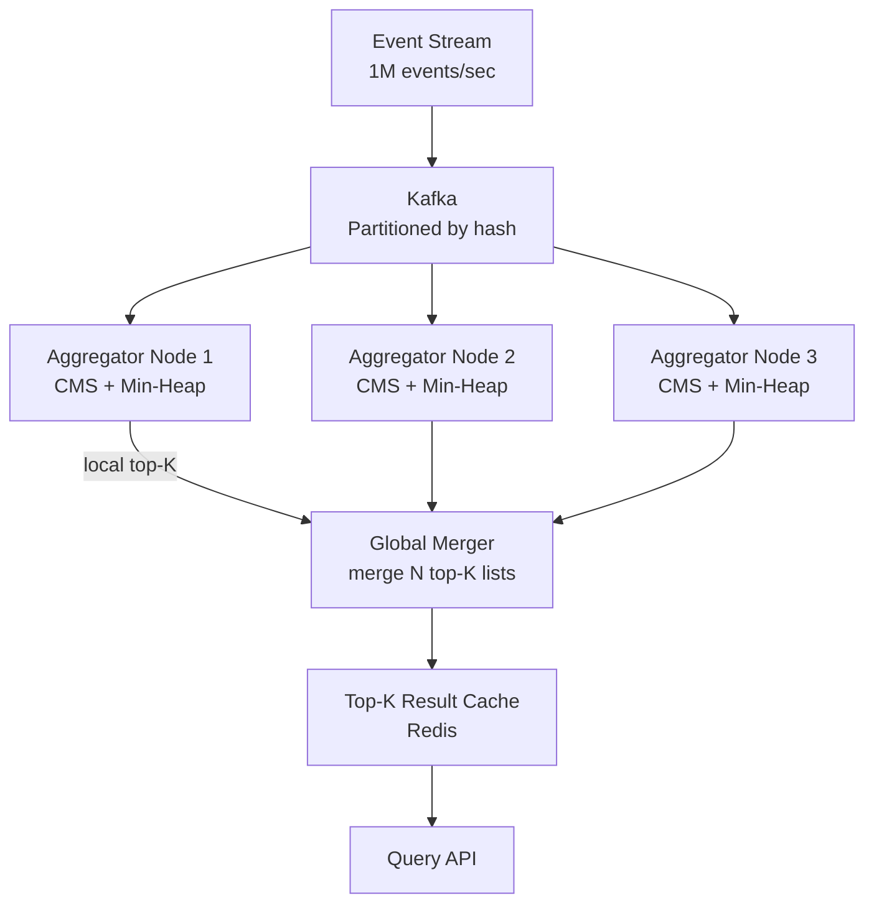
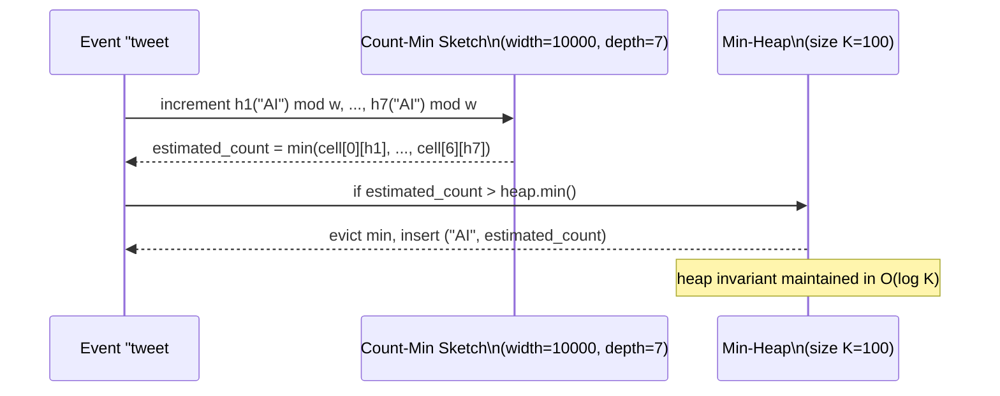
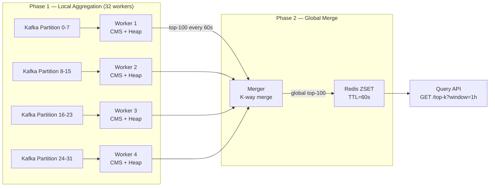
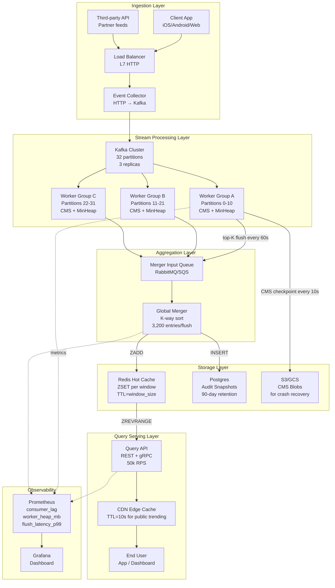

# Design a Top-K Heavy Hitters System

**Difficulty**: 🔴 Advanced
**Reading Time**: Coming Soon
**Interview Frequency**: High

---

> 🚧 **Full article coming soon.** This stub gives you the essentials to start thinking about this problem.

---

## The Core Problem

Finding the top 100 trending hashtags from 1 million tweets per second in real-time is impossible to solve exactly without storing all events — a hash map of all hashtags would require terabytes of memory. The system must use probabilistic data structures to approximate counts within acceptable error margins.

## Functional Requirements

- Return top K (e.g., 100) most frequent items in a sliding time window
- Update results within 30 seconds of trending changes
- Support different time windows: last 1 min, 1 hour, 24 hours
- Items can be hashtags, search queries, URLs, or product IDs

## Non-Functional Requirements

| Requirement | Target |
|-------------|--------|
| Input throughput | 1M events/sec |
| Result freshness | < 30 seconds lag |
| Accuracy | Top-K correct with ±5% count error |
| Memory | < 1GB per aggregation node |

## Back-of-Envelope Estimates

- **Event rate**: 1M events/sec × 50 bytes per event = 50MB/sec ingest
- **Exact count map**: 100M unique hashtags × 16 bytes = 1.6GB just for hash map — too large per node
- **Count-Min Sketch**: width=10,000 × depth=7 × 4 bytes = 280KB achieves ±5% error for 1M items

## Key Design Decisions

1. **Count-Min Sketch + Min-Heap** — use CMS to count all items in O(1) memory regardless of cardinality; maintain a min-heap of size K to track current top-K candidates; periodically flush and re-sort.
2. **Two-Phase Aggregation** — each node counts locally for 1 minute using CMS; local top-K results fan-in to aggregator node which merges and returns global top-K; reduces network traffic from 1M/sec to K results/min.
3. **Time Decay Weighting** — trending ≠ most total mentions; apply exponential decay so recent events count more than old ones; this surfaces "breaking" trends over entrenched ones.

## High-Level Architecture



## Top Interview Questions for This Problem

| Question | Tests |
|----------|-------|
| Why can't you use a simple HashMap to count all items exactly? | Memory constraints, cardinality |
| How does Count-Min Sketch work and what is its error guarantee? | Probabilistic data structures |
| How do you define "trending" vs "most popular"? | Time decay, velocity vs volume |

## Related Concepts

- [Bloom Filters and probabilistic data structures](../../../14-algorithms/concepts/bloom-filter)
- [Kafka partitioning for parallel stream processing](../05-infrastructure/distributed-messaging)

---

## Component Deep Dive 1: Count-Min Sketch + Min-Heap Pipeline

The Count-Min Sketch (CMS) is the single most critical component in this architecture. Without it, every aggregation node would need to maintain an exact hash map of all unique items — at 100M unique hashtags with 8 bytes per key and 8 bytes for count, that is 1.6GB per node before overhead. CMS collapses this to a fixed-size matrix regardless of cardinality.

**How it works internally:**

A CMS is a 2D array of counters with dimensions `width × depth`. You choose `d` independent hash functions (one per row). When an event arrives for item `x`, you compute `h1(x) mod w`, `h2(x) mod w`, ..., `hd(x) mod w` and increment each corresponding cell. To query the estimated count for `x`, you read all `d` cells and return the minimum — because hash collisions only over-count, never under-count, the minimum is always the least-biased estimate.

The error guarantee is: with probability `1 - δ`, the estimate is within `ε × N` where `N` is the total event count, `ε = e/width`, and `δ = (1/2)^depth`. Setting `width = ceil(e/ε)` and `depth = ceil(ln(1/δ))` gives you tunable accuracy. For 1M total events with ±1% relative error at 99% confidence: `width = 272`, `depth = 7`, total memory = `272 × 7 × 4 bytes = 7.6KB`. This is the power — sub-linear memory.

**Why naive approaches fail:**

A HashMap fails because you cannot bound memory: at 1M events/sec with 100M unique items, the map grows until OOM. Even with LRU eviction you lose counts for items that fall out of the cache window. An exact counting trie avoids collisions but uses more memory than a HashMap. Redis ZSET with exact counts works at small cardinality but becomes a bottleneck at 100k+ unique keys per window (single-threaded write path saturates around 500k ops/sec).

**The Min-Heap companion:**

CMS alone does not tell you which K items are the heaviest — it only answers point queries. You pair CMS with a min-heap of size K. Every new item is queried against the CMS; if its estimated count exceeds the heap minimum, the item is either added or the minimum is evicted and replaced. This gives O(log K) updates per event and O(K) final extraction.



| Approach | Memory per node | Error guarantee | Update cost | Query cost |
|----------|----------------|-----------------|-------------|------------|
| Exact HashMap | O(cardinality) — up to 1.6GB | None (exact) | O(1) amortized | O(1) |
| Count-Min Sketch + Heap | O(width × depth + K) — ~1MB | ±ε×N with prob 1-δ | O(depth + log K) | O(depth) |
| Lossy Counting | O(1/ε) — ~100KB | ε×N absolute error | O(1/ε) worst case | O(1/ε) |

---

## Component Deep Dive 2: Two-Phase Distributed Aggregation

A single aggregation node cannot handle 1M events/sec even with CMS — the bottleneck is CPU for hashing and network ingress. The solution is a two-phase fan-out/fan-in topology.

**Phase 1 — Partition and local aggregation:**

Kafka partitions events by a routing key (e.g., first character of the item, or `hash(item) mod num_partitions`). Each partition is consumed by exactly one aggregation worker. The worker maintains a CMS and min-heap over a configurable window (e.g., 60 seconds). At the end of each window it flushes its local top-K list — a sorted list of `(item, estimated_count)` tuples of size K — downstream to the merger.

This means the merger receives `num_workers × K` entries per window flush. With 32 workers and K=100, the merger processes 3,200 entries per minute — trivially cheap compared to 60M events/min.

**Phase 2 — Global merge:**

The merger does a K-way merge of the sorted lists. Because each list is already sorted by count descending, a priority queue merge is O(num_workers × K × log num_workers). The merged global top-K is written to Redis as a sorted set (ZADD) with a TTL equal to the window size.

**What happens at 10x load (10M events/sec)?**

- Phase 1 workers need to scale from 32 to 320 partitions. Kafka partition count must be pre-set; if the original cluster was configured for 64 partitions, you hit the partition ceiling and must re-partition — a disruptive operation requiring consumer group rebalance.
- Phase 2 merger becomes a hot spot: 320 workers × 100 items = 32,000 entries per flush. Still manageable at O(32,000 × log 320) ≈ 256,000 comparisons per minute.
- The merger's Redis write becomes the next bottleneck: writing 100 ZADD entries takes ~1ms; at 1 flush/minute this is negligible.



---

## Component Deep Dive 3: Sliding Window and Time Decay

A fixed tumbling window (reset every 60 seconds) creates two problems: stale results during the last 59 seconds of the window, and a "cliff" where an item's count drops to zero the moment it crosses a window boundary. Sliding windows and exponential decay solve both.

**Sliding window implementation:**

Store counts in time-bucketed CMS instances. Maintain one CMS per bucket (e.g., 1-minute buckets). To answer "top-K in the last hour", merge the 60 most recent CMS matrices by element-wise addition. The merge is O(width × depth × 60) — for width=10,000 and depth=7, that is 4.2M additions per merge operation. With 64-bit SIMD this takes under 10ms on modern hardware, making 1-second refresh feasible.

**Exponential decay for "trending":**

Trending means velocity, not volume. A hashtag used 1M times last month but only 100 times today is not trending. Apply a decay factor `λ` (typically 0.9 per window) to older buckets before merging:

```
count_effective = count_recent + λ × count_1min_ago + λ² × count_2min_ago + ...
```

With `λ = 0.9` over 60 buckets, a count from 60 minutes ago contributes only `0.9^60 ≈ 0.2%` of its original value. This means a truly breaking trend can surface above a long-running popular topic within 2-3 windows.

**Storage for multi-window support:**

Each aggregation node maintains three CMS ring buffers — one for 1-minute granularity (60 buckets), one for 5-minute granularity (288 buckets for 24h), and one for hourly granularity (720 buckets for 30 days). Total memory per node: `3 × buckets × width × depth × 4 bytes`. For the 1-minute ring: `60 × 10,000 × 7 × 4 = 16.8MB` — still well under the 1GB budget.

---

## Data Model

The result layer stores two types of data: the pre-computed top-K results for fast query serving, and raw event metadata for audit/replay.

```sql
-- Top-K result cache (Redis ZSET — shown as SQL for clarity)
-- Key: "topk:{window}:{timestamp_bucket}"
-- ZSET member: item_id (string, e.g., "#AI")
-- ZSET score: estimated_count (float64)

-- Example Redis commands:
-- ZADD topk:1h:1748736000 500000 "#AI"
-- ZADD topk:1h:1748736000 480000 "#ChatGPT"
-- ZREVRANGEBYSCORE topk:1h:1748736000 +inf -inf LIMIT 0 100

-- Metadata store (Postgres — for audit trail)
CREATE TABLE topk_snapshots (
    snapshot_id     BIGSERIAL PRIMARY KEY,
    window_type     VARCHAR(10) NOT NULL,          -- '1min', '1h', '24h'
    bucket_ts       TIMESTAMPTZ NOT NULL,           -- start of window bucket
    rank            SMALLINT NOT NULL,              -- 1..K
    item_id         VARCHAR(256) NOT NULL,          -- e.g., "#AI", "google.com"
    item_type       VARCHAR(32) NOT NULL,           -- 'hashtag', 'url', 'query'
    estimated_count BIGINT NOT NULL,               -- CMS estimate
    exact_count     BIGINT,                         -- NULL unless exact mode active
    decay_weight    FLOAT4 NOT NULL DEFAULT 1.0,   -- exponential decay factor applied
    source_worker   SMALLINT NOT NULL,              -- which aggregation worker reported
    created_at      TIMESTAMPTZ NOT NULL DEFAULT NOW()
);

CREATE INDEX idx_topk_window_bucket ON topk_snapshots (window_type, bucket_ts DESC);
CREATE INDEX idx_topk_item_lookup   ON topk_snapshots (item_id, window_type, bucket_ts DESC);

-- CMS state (serialized to blob storage for recovery)
-- cms_snapshots/{worker_id}/{window_type}/{timestamp}.bin
-- Format: 4-byte magic + 4-byte width + 4-byte depth + (width*depth*4) byte int32 array
```

```json
// API response schema for GET /api/top-k?window=1h&k=10
{
  "window": "1h",
  "computed_at": "2026-06-01T12:00:00Z",
  "freshness_lag_seconds": 8,
  "items": [
    {
      "rank": 1,
      "item_id": "#AI",
      "item_type": "hashtag",
      "estimated_count": 500000,
      "count_error_bound": 25000,
      "trending_velocity": 1.43
    }
  ],
  "total_events_in_window": 3600000000
}
```

---

## Scale Bottlenecks

| Traffic Level | Component That Breaks | Symptoms | Mitigation |
|---------------|----------------------|----------|------------|
| 10x baseline (10M events/sec) | Kafka ingestion + consumer lag | Consumer lag grows unbounded; results go stale beyond 30s SLA | Pre-scale to 320 partitions at cluster setup; use Kafka partition reassignment before traffic spike |
| 10x baseline | Aggregation worker CPU | Each worker receives 312k events/sec; CMS hashing saturates single core at ~500k ops/sec | Vertical scale workers to 4 cores; or reduce partition assignment per worker (add more workers) |
| 100x baseline (100M events/sec) | Phase 2 merger becomes hot | 3,200 flush entries/min → 320,000 flush entries/min; merger CPU becomes bottleneck at ~1M entries/sec | Introduce a second merger tier (hierarchical fan-in); 4 sub-mergers of 80 workers each feeding 1 global merger |
| 100x baseline | Redis write throughput | ZADD with 100 members at 320 flushes/min = 32,000 writes/min; Redis pipeline handles 1M ops/sec so this is fine — but ZRANGEBYSCORE reads from 10k QPS API begin to compete | Read replicas for Redis; separate Redis instances per window type |
| 1000x baseline (1B events/sec) | Everything — network + storage | Single Kafka cluster maxes at ~200MB/s per broker; 1B events/sec at 50 bytes = 50GB/s requires 250+ brokers | Multi-datacenter Kafka MirrorMaker; drop to sampling (1-in-10 events) with count correction; use hardware-accelerated CMS in FPGA at edge |

---

## How Twitter Built Their Trending Topics System

Twitter's trending topics system, documented across several engineering blog posts and conference talks (QCon 2012, Strange Loop 2013), processes approximately 6,000 tweets per second at average load and spikes to 150,000+ tweets per second during major events (Super Bowl, elections, breaking news).

**Technology choices:**

Twitter built their early trending system on top of Apache Storm (which they open-sourced in 2011 — it was originally called "Kestrel" internally). Each Storm bolt corresponds to one aggregation worker in the architecture above. They used a custom in-memory counting structure rather than CMS — their cardinality was bounded enough (hundreds of thousands of unique hashtags per hour) to afford exact counting with bounded LRU eviction.

**Specific numbers:**

- 500M tweets per day at peak periods = ~5,800 tweets/sec sustained
- Top-K computed over 300 seconds (5-minute windows) with 1-second refresh
- Results served from a Redis cluster with 3 replicas; ~50,000 reads/sec to the trending API endpoint
- Trending computed separately for each of ~400 location "places" (worldwide, per country, per city)

**Non-obvious architectural decision:**

Twitter computes trending not by raw count but by a "velocity" score: `velocity = (count_now - count_expected) / stddev(count)`. The "expected" count is estimated from a 7-day rolling baseline for the same time-of-day and day-of-week. This means #MondayMotivation does not trend every Monday even though it spikes predictably — the system learned its baseline. This novelty-detection approach is documented in their 2015 patent (US9418133B1).

**Source:** Twitter Engineering Blog — "Building a distributed strict priority queue" (2015) and QCon NYC 2012 talk "Real-time activity streams at Twitter."

---

## Interview Angle

**What the interviewer is testing:** Whether the candidate can reason about memory-accuracy trade-offs in streaming systems and knows when exact solutions are infeasible versus when approximate solutions are appropriate — a core distributed systems design skill.

**Common mistakes candidates make:**

1. **Proposing exact counting with a HashMap** — Candidates say "use a HashMap and sort the entries every minute." This fails because at 100M unique items the HashMap consumes 1.6GB+ per node and requires a full O(N log K) sort every minute. The correct insight is that you cannot enumerate all unique items; you need a fixed-memory structure. Interviewers will push with "what if there are 1 billion unique URLs?" to expose this gap.

2. **Ignoring the merge problem** — Candidates who know CMS often forget that CMS answers point queries but does not maintain a top-K list on its own. You still need the min-heap companion and must explain the Phase 2 merge. Many candidates describe a single CMS node and miss that you cannot simply union two CMS matrices to get global top-K; you need to re-query every candidate item against the merged sketch.

3. **Conflating "popular" with "trending"** — Defining top-K as "most total mentions ever" misses the interviewer's intent. Trending means recent velocity. Failing to introduce time windows or exponential decay shows the candidate is not thinking about time-series semantics. A strong answer distinguishes between a leaderboard (all-time counts) and a trending feed (recent velocity).

**The insight that separates good from great answers:** Recognizing that CMS error bounds are relative to total event count N, not item count. This means at 1M events with ε=0.01, the error is 10,000 counts — which is fine for a top-100 list where rank-100 items likely have 50,000+ mentions. But for very sparse distributions (most items appear once), CMS over-estimates rare items significantly. Great candidates mention this and propose a hybrid: exact counting for items that have already been promoted to the min-heap, CMS-only for the long tail.

---

## Key Numbers to Remember

| Metric | Value | Context |
|--------|-------|---------|
| CMS memory for ±1% error, 99% confidence | 7.6 KB | width=272, depth=7, 4-byte counters |
| CMS memory for ±0.1% error, 99.9% confidence | 76 KB | 10x width, 10x depth |
| Min-heap update cost | O(log K) | K=100 → ~7 comparisons per event |
| Phase 1 flush rate | 1 flush per 60 seconds per worker | Produces K=100 entries per flush |
| Phase 2 merge input | num_workers × K entries | 32 workers × 100 = 3,200 entries/min |
| Redis ZADD throughput | ~500k ops/sec (pipelined) | Sufficient for any realistic merger output |
| Twitter trending event rate | 6,000 tweets/sec sustained, 150,000/sec peak | 500M tweets/day; ~400 geographic trend feeds |
| Kafka partition ceiling (safe) | 4,000 partitions per cluster | Beyond this, ZooKeeper coordination degrades |
| Exponential decay half-life at λ=0.9, 60 buckets | 0.2% residual | Items 60 minutes old contribute negligibly |

---

## Implementation: Aggregation Worker Pseudocode

The following pseudocode shows the core event loop inside one aggregation worker. Each worker consumes a set of Kafka partitions, maintains an in-memory CMS and min-heap per time window, and flushes results every `FLUSH_INTERVAL_SECONDS`.

```python
# Aggregation Worker — runs per Kafka consumer group member

import mmh3          # MurmurHash3 for CMS hash functions
import heapq
from dataclasses import dataclass
from typing import Optional

CMS_WIDTH   = 10_000     # columns — controls error bound ε = e/width ≈ 0.027%
CMS_DEPTH   = 7          # rows — hash functions; controls failure prob δ = (1/2)^7 ≈ 0.78%
HEAP_K      = 100        # keep top-100 candidates
FLUSH_INTERVAL_SECONDS = 60
DECAY_LAMBDA = 0.9       # exponential decay per window bucket

@dataclass
class HeapEntry:
    count: int
    item_id: str
    def __lt__(self, other): return self.count < other.count

class CountMinSketch:
    def __init__(self, width: int = CMS_WIDTH, depth: int = CMS_DEPTH):
        self.width = width
        self.depth = depth
        # depth rows, each of width int32 counters
        self.table = [[0] * width for _ in range(depth)]

    def _hash_positions(self, item: str) -> list[int]:
        return [mmh3.hash(item, seed=i) % self.width for i in range(self.depth)]

    def increment(self, item: str, delta: int = 1) -> None:
        for row, col in enumerate(self._hash_positions(item)):
            self.table[row][col] += delta

    def estimate(self, item: str) -> int:
        return min(self.table[row][col]
                   for row, col in enumerate(self._hash_positions(item)))

    def merge_inplace(self, other: "CountMinSketch") -> None:
        """Element-wise addition for multi-window merging."""
        for r in range(self.depth):
            for c in range(self.width):
                self.table[r][c] += other.table[r][c]

    def apply_decay(self, factor: float) -> None:
        """Multiply all counters by decay factor (for exponential decay windows)."""
        for r in range(self.depth):
            self.table[r] = [int(v * factor) for v in self.table[r]]


class AggregationWorker:
    def __init__(self, worker_id: int, kafka_consumer, result_queue):
        self.worker_id = worker_id
        self.consumer = kafka_consumer
        self.result_queue = result_queue

        self.cms = CountMinSketch()
        self.heap: list[HeapEntry] = []   # min-heap of size K
        self.heap_set: dict[str, int] = {}  # item_id -> current heap count (fast lookup)
        self.window_start_ts: float = time.time()

    def process_event(self, item_id: str) -> None:
        # Step 1: update CMS
        self.cms.increment(item_id)
        estimated = self.cms.estimate(item_id)

        # Step 2: update heap if candidate qualifies
        if item_id in self.heap_set:
            # already in heap — update count in place (lazy deletion pattern)
            self.heap_set[item_id] = estimated
        elif len(self.heap) < HEAP_K:
            # heap not full yet
            entry = HeapEntry(count=estimated, item_id=item_id)
            heapq.heappush(self.heap, entry)
            self.heap_set[item_id] = estimated
        elif estimated > self.heap[0].count:
            # evict the current minimum
            evicted = heapq.heappop(self.heap)
            del self.heap_set[evicted.item_id]
            entry = HeapEntry(count=estimated, item_id=item_id)
            heapq.heappush(self.heap, entry)
            self.heap_set[item_id] = estimated

    def flush(self) -> dict:
        """Produce local top-K snapshot and reset state."""
        # Re-query CMS for accurate counts (heap may have stale estimates)
        results = sorted(
            [{"item_id": k, "count": self.cms.estimate(k)} for k in self.heap_set],
            key=lambda x: -x["count"]
        )[:HEAP_K]

        snapshot = {
            "worker_id": self.worker_id,
            "window_start": self.window_start_ts,
            "window_end": time.time(),
            "top_k": results,
            "total_events": sum(self.cms.table[0]),  # approximate total
        }

        # Reset for next window
        self.cms = CountMinSketch()
        self.heap = []
        self.heap_set = {}
        self.window_start_ts = time.time()
        return snapshot

    def run(self) -> None:
        last_flush = time.time()
        for message in self.consumer:
            item_id: str = message.value.decode("utf-8")
            self.process_event(item_id)

            if time.time() - last_flush >= FLUSH_INTERVAL_SECONDS:
                snapshot = self.flush()
                self.result_queue.put(snapshot)
                last_flush = time.time()
```

**Key implementation notes:**

- The lazy deletion pattern in `heap_set` avoids rebuilding the heap on every update. Instead, stale heap entries are ignored when the item's count in `heap_set` does not match.
- `flush()` re-queries the CMS for all heap candidates rather than trusting the heap counts, because the heap values can lag the CMS by up to one event.
- `merge_inplace` enables the Phase 2 merger to construct a global CMS from all workers' local sketches without exchanging raw event data.

---

## Alternative Approaches Comparison

Beyond CMS, two other algorithms are commonly used for heavy hitters problems. Understanding when to choose each is a common follow-up question.

### Misra-Gries (Frequent Algorithm)

Misra-Gries maintains a dictionary of at most `K` items. When a new item arrives: if it is already in the dictionary, increment its count. If the dictionary has fewer than K entries, add it with count 1. Otherwise, decrement all counts by 1 and remove zeros. The guarantee: any item with true frequency > N/K will appear in the output.

**Strengths:** Exact insertion order, deterministic (no hash collisions), O(K) memory.
**Weaknesses:** Only guarantees items with frequency > N/K (for K=100, items must appear > 1% of the time). Catastrophically fails for long-tail distributions where no single item exceeds 1%. Does not support point queries (cannot query arbitrary items). Cannot be parallelized easily — merge requires re-running the full algorithm.

### Space-Saving Algorithm

An improvement on Misra-Gries: instead of decrementing all counters when adding a new item, Space-Saving evicts the minimum-count item and gives the new item count = evicted_count + 1. This wastes less information from the evicted item's history.

**Strengths:** Same memory guarantee as Misra-Gries but more accurate in practice (lower over-counting). Provably better than Misra-Gries on the same input.
**Weaknesses:** Same parallelization challenges. Still O(K) memory and fails long-tail distributions.

### Summary comparison

| Algorithm | Memory | Error Type | Parallel-Merge | Point Query | Best For |
|-----------|--------|------------|---------------|-------------|----------|
| Count-Min Sketch + Heap | O(w×d + K) | Count over-estimates | Yes (element-wise add) | Yes O(d) | High-cardinality, distributed, long-tail |
| Misra-Gries | O(K) | Misses items below N/K threshold | Complex | No | Low-cardinality, single-node, deterministic |
| Space-Saving | O(K) | Same as Misra-Gries but lower | Complex | No | Low-cardinality, single-node, accuracy-critical |
| Exact HashMap + Eviction | O(cardinality) up to OOM | None (exact) | Yes (merge maps) | Yes O(1) | Low cardinality (<1M unique), batch, offline |

---

## Operational Playbook

### Capacity planning formula

Given:
- `R` = event rate (events/sec)
- `U` = unique item cardinality (estimated)
- `W` = window duration (seconds)
- `ε` = acceptable count error as fraction (e.g., 0.01 for 1%)
- `δ` = acceptable failure probability (e.g., 0.01 for 1%)

Then:
```
CMS width   = ceil(e / ε)                    # e ≈ 2.718
CMS depth   = ceil(ln(1 / δ))               # natural log
Memory/node = CMS_width × CMS_depth × 4 bytes
Worker count = ceil(R / 500_000)             # 500k events/sec per worker on 2-core VM
Merger input = worker_count × K tuples per window flush
```

For the baseline problem (1M events/sec, ε=0.01, δ=0.01, K=100):
- Width = 272, Depth = 5, Memory = 5.4KB per window
- Workers = 2, Merger input = 200 tuples/min
- Total cluster memory (32 workers, 60-bucket ring buffer): 32 × 60 × 5.4KB = ~10MB

### Alerting thresholds

| Alert | Threshold | Action |
|-------|-----------|--------|
| Consumer lag | > 100,000 events | Scale workers or investigate slow consumer |
| Result freshness | > 45 seconds stale | PagerDuty — check merger is receiving flushes |
| Worker OOM | Heap memory > 900MB | Reduce CMS width or add workers to reduce events/worker |
| Merger queue depth | > 10 pending flushes | Merger CPU bound — scale merger horizontally |
| Redis write latency | p99 > 50ms | Redis cluster saturation — add read replicas or shard by window |

### Graceful recovery after worker crash

When an aggregation worker crashes mid-window, its in-memory CMS and heap are lost. Two strategies:

1. **Accept the gap**: Let Kafka reset the consumer offset to the start of the current window boundary. The worker replays up to 60 seconds of events at full ingestion speed (catch-up mode). During catch-up, the global merger uses the last good snapshot from this worker.

2. **Checkpoint to blob storage**: Every 10 seconds, serialize the CMS table to object storage (S3/GCS) as a binary blob. On restart, load the latest checkpoint and resume from the corresponding Kafka offset. Recovery time: blob download (< 5 seconds for a 1MB CMS) + replay from checkpoint offset to current offset.

Strategy 2 is recommended for windows longer than 15 minutes, where the catch-up replay time under strategy 1 would exceed the freshness SLA.

---

---

## Full System Architecture: End-to-End Request Flow

The diagram below shows the complete system from event ingestion through query serving, including the feedback path for window management and the storage tiers.



**Critical path latency breakdown** for a trending hashtag to appear in query results:

| Stage | Latency | Notes |
|-------|---------|-------|
| Client → Kafka (producer) | 5–20ms | Depends on producer batch size; larger batch = higher throughput but more latency |
| Kafka consumer lag (real-time) | < 100ms | Under normal load; spikes during rebalance |
| Worker CMS update | < 1ms | In-memory, SIMD-optimized hash |
| Window flush interval | 0–60s | Dominant source of staleness; tunable per SLA |
| Merger processing | < 500ms | 3,200 entry K-way sort |
| Redis ZADD | 1–5ms | Pipeline batched |
| Query API Redis read | 1–3ms | ZREVRANGE with LIMIT 100 |
| **Total end-to-end** | **5–65 seconds** | Dominated by flush interval |

To achieve the 30-second freshness SLA, the flush interval must be set to 20 seconds (leaving 10 seconds for merge + write + propagation). With 20-second windows and 32 workers, the merger processes 3,200 entries every 20 seconds — still well within compute budget.

---

## Key Takeaways

- **CMS + Min-Heap is the canonical solution** for top-K at scale. CMS provides O(1) memory regardless of cardinality; the min-heap promotes only the K best candidates. Memory cost is fixed at ~1MB per node regardless of input size.
- **Two-phase aggregation reduces fan-in traffic by 99.9%**: instead of forwarding 1M events/sec to a central node, workers forward 100 entries per minute. This is the architectural insight that makes the system scalable.
- **Trending requires time decay, not raw counts**: exponential decay with λ=0.9 per window means events from 60 minutes ago contribute < 0.2% of their original weight. This surfaces velocity (breaking news) over volume (evergreen content).
- **Worker crashes are recoverable in < 10 seconds** with 10-second CMS checkpoints to blob storage, keeping result freshness within SLA even during rolling deploys.
- **The merge error is bounded and composable**: two CMS matrices can be merged element-wise to get a combined sketch whose error guarantee is the same as a single sketch over the union of events — this property enables arbitrary horizontal scaling of Phase 1 workers.

---

*📚 Full deep-dive with multiple approaches, trade-off tables, and pseudocode coming soon.*

## 📚 Resources & References

| Resource | Type | What You'll Learn |
|----------|------|------------------|
| [System Design Interview — Alex Xu](https://www.amazon.com/System-Design-Interview-insiders-Second/dp/B08CMF2CQF) | 📚 Book | Chapter on Top-K heavy hitters problem and stream processing approaches |
| [ByteByteGo — Top K Frequent Elements](https://www.youtube.com/@ByteByteGo) | 📺 YouTube | Search "top K heavy hitters" — Count-Min Sketch and distributed approaches |
| [Twitter Engineering: Trending Topics Architecture](https://blog.twitter.com/engineering/en_us/a/2015/building-a-distributed-strict-priority-queue) | 📖 Blog | How Twitter computes trending topics at billions of events/day |
| [Count-Min Sketch Paper](https://ieeexplore.ieee.org/document/1532925) | 📖 Blog | The probabilistic data structure behind approximate Top-K computation |
| [Apache Kafka Streams Documentation](https://kafka.apache.org/documentation/streams/) | 📚 Docs | Stream processing with windowed aggregation for Top-K use cases |
